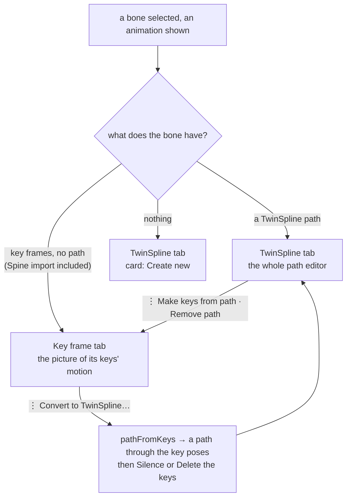
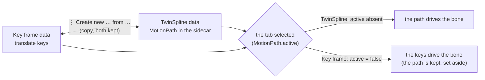

# Motion Path panel: two modes, Key frame and TwinSpline — plan

**Removed 2026-10-09** with the rest of TwinSpline: docs/REMOVE-TWINSPLINE-PLAN.md.

**Status: planned 2026-10-08 from the owner's note; built the same day (see "Result"), then revised the same day ("Revised", last section: both kept, the tab chooses which is used).** Follows `TWO-SYSTEMS-PLAN.md`: the two systems get two tabs in the panel, so a bone is looked at and edited as one or the other, never a mix.

## What was asked

> we must have separate 2 modes: 1 key frame (include from import "Spine"), 2 twinSpline; switch mode at the top (2 red marks).
> when a bone is empty, default selected the twinSpline tab, with an option to create new.
> when it has keyframe data, we can click the 3-dot at the end of the button for a menu to convert the data to twinSpline.

## The design

- **Two tabs in the panel's header**, beside the title: **Key frame** and **TwinSpline**, each with a ⋮ button at its end. The tab is a *view*; which system drives the bone is still the one-driver rule (a path in the animation drives its bone, its keys are silenced).
- **Which tab opens.** On a new bone or animation: a path → TwinSpline; translate key frames and no path → Key frame; nothing → TwinSpline (with the *Create new* card). "Key frames" here means translate keys, the data a path can replace: a bone keyed only in rotation, scale or shear counts as empty. The person's own choice for that bone and animation is kept until the bone or the animation changes.
- **Key frame tab, no path.** The picture of the bone's keyed motion as today (the trail, the layers, the handles that edit the bone at a frame); the path bar, node strip and speed graph are not shown. **With a path** the tab says so (a card: the path drives this bone, its N key frames are silenced) with *Show TwinSpline* and *Remove path*; the picture shows the keys' trail.
- **TwinSpline tab.** With a path: the whole editor of today. Without one: a card, *No TwinSpline for this bone*, with **Create new** (the parent bone is chosen first, as before) and, when the bone has translate keys, **Convert key frames to TwinSpline…**.
- **⋮ menus.** Key frame ⋮: **Convert to TwinSpline…** (off when the bone has no translate keys or already has a path). TwinSpline ⋮: **Create new**, **Make keys from path**, **Remove path** (each off when it does not apply). The path bar keeps its buttons.
- **Convert keys → TwinSpline** (`pathFromKeys`, `ui/motion.ts`): a node where the bone is at each translate key frame (its joint in the parent bone's space, from the keys' own pose), a ring when the last pose is the first's, else open; the duration is first key to last key; each node's speed is set so the path reaches it at its key's time (`speed = Δlength / Δtime − 1` over its span, held to −0.99 … 5). It is an approximation: the status line says how far the path strays from the keyed positions at worst. Then the same **Silence or Delete** question as Create new. A copy and nothing more, like Make keys from path in the other direction.

## Steps

1. `pathFromKeys` and a test (a straight move with even timing gives speed 0; uneven timing gives speeds that make the path reach each node at its key's time; a closed loop is a ring; a bone with no movement is refused).
2. The tabs, the mode choice and the cards in `motionPanel.ts`; the picture's path-only drawing reads the TwinSpline mode.
3. The ⋮ menus and the conversion flow (shared with Create new's Silence or Delete question).
4. Tests: the tab opens by data; Key frame hides the path editor; Convert on the stickman's `hips` (9 translate keys); existing tests that start a path on a bone with keys switch tab first.
5. SPEC §7's panel paragraph, the changelog on commit.

## Result

**Done 2026-10-08, looked at in two screenshots (the tabs, and the Create new card) and through the tests.** `tsc`, 803 unit tests and the browser suite pass.

- **Tabs.** *Key frame* and *TwinSpline* in the header, each with a ⋮ (`tabs` in `motionPanel.ts`). The tab opens once per bone and animation (`syncMode`): a path → TwinSpline; translate keys and no path → Key frame; otherwise TwinSpline. It does **not** flip again while the bone is selected: an edit that adds keys (dragging the bone with Auto Key) must not change the layout under the person's hand (a first version flipped, and the picture rescaled). A bone keyed only in rotation, scale or shear is empty for this purpose.
- **Under the Key frame tab** the panel's path editor sees no path (`MotionPathPanel.path()` is `undefined`): no path bar, node strip or speed graph, and the picture is the keys' (trail, dots, onion, handles), as before the path existed. All the editor's code reads `this.path()`, so the two tabs cannot half-show each other.
- **Cards** (top right of the picture, only the buttons take the pointer): Key frame with a path says the path drives the bone and its N translate keys are silenced (*Show TwinSpline*, *Remove path*); TwinSpline without one says there is none (*Create new*, and *Convert key frames to TwinSpline…* when the bone has translate keys).
- **⋮ menus.** Key frame: *Convert to TwinSpline…*. TwinSpline: *Create new*, *Convert key frames to TwinSpline…*, *Make keys from path*, *Remove path*, each off when it does not apply. The path bar keeps its buttons.
- **Convert** (`pathFromKeys`): as designed. The conversion needs the parent bone first (the TwinSpline tab opens with its picker if none is chosen), then asks Silence or Delete (`placePath`, shared with Create new), and reports the nodes, the duration and how far the path strays from the keyed motion at worst.
- **Guards.** `e2e/motionModes.spec.ts`: the tab by data; Create new on the card, then the Key frame tab's card and Remove path; Convert on `hips` (9 translate keys) through the ⋮ menu with Silence leaving the keys as they were; the TwinSpline menu's items on and off. Tests that made a path on a bone with keys (`hips`, `hand_near_target`) open the TwinSpline tab first.
- **Not done.** The conversion's speeds are an approximation (a constant multiplier per span, smoothed by the speed spline), so a path of very uneven timing strays more; the status line says by how much. No unit test of `pathFromKeys` alone (it needs a session); the browser test covers one real conversion, without checking the stray figure.

## Revised 2026-10-08 (the owner): both kept, the tab chooses which is used

> Key frame ⋮: 1 Create new TwinSpline from Key frame (if it has data), 2 Delete Key frame data.
> TwinSpline ⋮: 1 Create new Key frame from TwinSpline (if it has data), 2 Delete TwinSpline data.
> we can keep data both, but it is up to the user to select which to use.

This replaces the *Silence or Delete* question (Q2 of `TWO-SYSTEMS-PLAN.md`) and the rule "a path in the animation drives its bone".

- **Which is used.** A bone with a path uses the path unless the path says `active: false` (written in the sidecar only then); pressing a tab is that choice, one undo step ("Use the TwinSpline of X", "Use the key frames of X"). A bone with no path uses its keys, and its tab is only a view. `Session.pose()`, the play clock, the Timeline's dimming and the picture all read this one flag (`Session.usedPaths`, `pathDrives`).
- **The tab shows the one in use** for a bone with a path (so Undo of the choice moves the tab too); for a bone with none it opens on Key frame when the bone has translate keys, else on TwinSpline, once per bone and animation.
- **Key frame ⋮.** *Create new TwinSpline from Key frame* (`pathFromKeys`; asks before replacing an existing path; relative to the bone's own parent unless a parent was chosen; the new path is the one in use; the keys are kept) and *Delete Key frame data* (the bone's translate keys in the animation, with a confirm, one undo step).
- **TwinSpline ⋮.** *Create new Key frame from TwinSpline* (the old Make keys from path: asks before replacing existing keys; the path is kept and the tab stays: press Key frame to use the keys) and *Delete TwinSpline data* (the path, with a confirm).
- **Gone.** The Silence or Delete dialog when making a path (`placePath`, `startMotionDeletingKeys`) and the cards' Convert buttons: Create new makes an empty path and keeps the keys; the card on the TwinSpline tab of a bone with keys offers *Create from Key frame*.
- **Tests.** `e2e/motionModes.spec.ts` (tab by data, the card, the menus off when empty) and `e2e/motionPath.spec.ts` (both kept: a path made on `hips` keeps its 9 translate keys byte for byte; the tabs switch which one drives and the Timeline's dimming; the four menu items in a row: path from keys, keys from path, delete keys, delete path; the delete of the keys is one undo step).

## Revised again 2026-10-08 (the owner): layers as icons by the tabs, actions in the menu

> show Path and show Spline move to the red dots (convert the label to an icon); the white boxes (Edit Path and +, Make keys from path and Remove path) become the ⋮ menu.

- **Path and Spline layer toggles** are icon buttons beside the tab they belong to (Path, the bone's keyed trail, before Key frame with the translate-key icon; Spline, the drawn curve, before TwinSpline with the spline icon); they keep their accessible names "Path" and "Spline" and leave the Show group.
- **The path bar** is now the parent bone, − Node, Duration, Closed, Loop, Play / Pause, Both, Stop and the clock. **Edit Path**, **+**, **Make keys from path** and **Remove path** are gone as buttons: the TwinSpline ⋮ menu is *Create new TwinSpline*, *Add a spline node*, then *Create new Key frame from TwinSpline* and *Delete TwinSpline data* (Make keys and Remove path were these two already). *Create new TwinSpline* with no parent chosen says so in the status line instead of being disabled; the card on an empty TwinSpline tab keeps its *Create new* button.
- **Tests.** The Motion Path browser tests reach these through `twinMenu` in `e2e/motionHelpers.ts` (a delete or a replace answers its confirm there); `startEditPath` is now the menu's Create new TwinSpline.

## Revised a third time 2026-10-08 (the owner): the transport in the view bar

> at the red box (the path bar) migrate some proper buttons to the red dot bar (the view bar over the picture).

**Play / Pause, Both, Stop and the path's clock** moved from the path bar to the view bar, between the zoom and Fit: they drive what the picture shows, and the view bar had the room. They show only for a bone with a path in the TwinSpline tab. The path bar keeps what describes the path: the parent bone, − Node, Duration, Closed, Loop (one row now). No test changed (the tests find the buttons by name inside the panel).

## Made stable 2026-10-08 (the owner: "make it more stable")

Seen: in Pose mode (no animation) the tabs and the Path and Spline icons vanished and the path bar went away, so the header and the picture jumped as the person moved between modes, bones and tabs. Now **nothing in the header or the path bar comes and goes**: the two tabs and the two layer icons are always there, dimmed and not pressable when there is no animation and bone; the path bar always has its two rows: the controls and the node count under the TwinSpline tab, or a one-line hint ("Select a bone in Animate mode to see its motion." / "Key frames: the bone's keyed motion. A tab's ⋮ makes the other kind from it.") and an empty line otherwise. The picture is therefore a little smaller under the Key frame tab than before (the Onion test's green-pixel margin went from 50 to 20 for that reason). Looked at in a screenshot of Pose mode.
