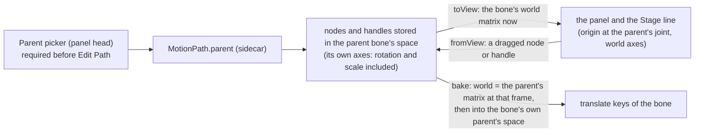

# Motion Path relative to a parent bone — plan

**Status:** done 2026-10-08 (see "Result" at the end). The owner's ask: replace the Motion Path panel's
**Local** mode with **relative to parent**, with a required parent-bone picker (no path can be made until one is chosen), and store
and edit the path's nodes in that bone's space, drawn through that bone's current world transform, so the path follows the parent.

## What changes

| | Before (Local) | After (relative to parent) |
|---|---|---|
| Space the nodes live in | the world's axes, from the bone's own parent's joint | the **chosen** parent bone's own axes (so its rotation and scale carry the path) |
| Which bone | always the bone's real parent | **any bone that is not the bone or under it**, chosen in the picker; the first choice is the bone's real parent only if the person picks it |
| Creating a path | Edit Path always starts one | Edit Path (and `+`, and the keys that start one) are refused, with a message, until a parent is chosen; the picker has no default |
| Following the parent | the parent's rotation is not in the path | the nodes are drawn through the parent's world matrix at the playhead, so a turning parent turns the path |
| Bake | the point is taken as a vector from the bone's parent | the point goes through the parent bone's matrix **at each frame**, then into the bone's own parent's space |
| The panel's view origin | the bone's real parent's joint | the chosen parent bone's joint (axes stay the world's; the path itself is rotated by the parent) |

## Decisions

- **Stored form.** `MotionPath.parent` (a bone name) in the sidecar; `nodes` (x, y, handles `tx ty bx by`) are in that bone's local
  space. A path read from a file without `parent` (made before this) takes the bone's real parent, the nearest equivalent; it is
  written back with `parent`. No migration of the numbers: the old ones were measured from the same joint, and equal where the
  parent was not turned.
- **One conversion pair, the rest of the panel untouched.** The panel keeps working in *view* space (the parent's joint as the origin,
  the world's axes) and `ui/motion.ts` converts at the edges: `pathToView` for what is drawn and hit-tested, `pathFromView` for what an edit
  writes (an unchanged node keeps its stored numbers, so editing one node does not move the others by rounding). This keeps every
  hit test, drag and structural edit (reverse, merge, origin, legs) as it was.
- **Handles are offsets**, so they go through the matrix's linear part only.
- **Changing the parent of a path that exists** keeps the path where it is on screen at the playhead (its nodes are re-expressed in the new
  parent's space), one undo step.
- **The picker lists** every bone but the selected one and the bones under it (a bone cannot be placed by its own child). Choosing a
  parent for a bone with no path remembers the choice for that bone in this animation until a path is made.

## Steps

1. Model and file: `parent` in `MotionPath`, `io/sidecar.ts`; table test of the round trip.
2. `ui/motion.ts`: the reference bone, `pathToView` / `pathFromView`, `startMotion` with a parent, `currentNode`, `poseAtNode`, `bakeKeys` in the parent's space; unit tests on a rig with a turned parent (the baked key puts the bone on the path at each frame).
3. Panel: the picker, the gate on creation, the view origin, nodes through the conversion, the Stage line, the rename Local → Parent in the space buttons and titles; browser test.

## Result

All three steps built.

1. **Model and file.** `MotionPath.parent` (optional) in `model/sidecar.ts`, read and written by `io/sidecar.ts`; the round trip is in `tests/sidecar.test.ts`'s sample.
2. **`ui/motion.ts`.** `refBoneName`, `parentChoices`, `refMatrix`, `toView` / `fromView`, `pathToView` / `pathFromView` (an unchanged node, or handle,
   keeps its stored numbers exactly), `startMotion(s, parent)`, `currentNode(s, parent)`, `poseAtNode(..., parent)` and `bakeKeys`, which puts each path point through the
   parent bone's matrix **at that frame** and then into the bone's own parent's space. `stage/trail.ts`: `TrailSpace` is `"parent" | "world"`, `fromParent` takes the origin bone.
   Unit tests: `tests/motionParent.test.ts`.
3. **Panel.** A `Parent bone…` picker at the start of the path row, with no default; **Edit Path and the green `+` are off until a bone is chosen**, and the keys that start a path
   say why in the status line; the bones offered exclude the bone and those under it. The view's origin is the chosen bone's joint; nodes are drawn, hit and
   dragged through the conversion (the curve's handles are kept in view too, so they can always be reached); the Stage's path line goes through the parent's matrix
   at the playhead. The arrow keys move a node in the **parent's own axes** (the numbers it is stored in). Changing the parent of a path keeps it where it is on screen
   at that frame (the two joints' distance is taken into account), one undo step. The space buttons read **Parent** and **World**; a saved view that said `local` reads as Parent.
   Browser tests: `e2e/motionParent.spec.ts` (the gate, the choice and re-parenting, the path following the bone's matrix at two frames); the older Motion Path specs choose a parent first
   (`e2e/motionHelpers.ts`) and measure joints in the parent's space.

What changed from the plan: the arrows nudge in the parent's axes rather than the screen's, to match "edit in the parent's space"; the view always keeps the world's axes (only the *path* is
turned by the parent), as the plan said. A legacy path with no `parent` takes the bone's own parent, as planned. Not done: a node cannot be dragged in World space (as before).
