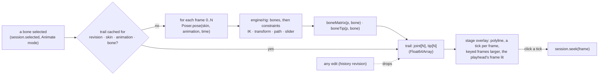

# The selected bone's motion preview — plan

**Status:** planned, 2026-10-06; not started. Written from the owner's note (see "What was asked",
and "My reading" where the note was not clear). Nothing is built, and the uncommitted path-creation
work is untouched.

In Animate mode, a bone selected on the stage shows a dedicated preview of **only that bone, across
every frame of the shown animation**: where its joint and its tip are at each frame, drawn as a
trail with a mark per frame. It is the bone's *posed* place, so a bone driven by IK or another
constraint shows where the constraint puts it, not where its own keys say.

## What was asked

> it show when click at correct bone (can't sub ik) in animation mode only —
> it must have dedicate preview only bone had selected with all time frame

## My reading, to confirm

1. **When it shows:** Animate mode only (an animation is shown), and for the bone that is selected;
   with nothing selected, or in Pose mode, nothing is drawn.
2. **"Correct bone, can't sub ik":** the preview must follow the bone you clicked, and not be fooled
   by IK: a bone under an IK chain (the "sub" bones of the chain) has few or no keys of its own, so a
   trail built from keys would be wrong or empty for it. The plan therefore poses the whole rig at
   each frame and reads the bone from the result.
3. **"Dedicated preview, only the selected bone, all time frames":** one trail for the one bone, over
   the whole animation, drawn on the stage; not the whole skeleton (onion skin already does that).

If any of the three is wrong, say which and I change the plan before building.

## Decisions

- **Posed, not keyed.** Each frame is `Poser.pose(skin, animation, time)` and the bone is read from
  the result (`boneMatrix`, `boneTip`), so IK, transform, path and slider constraints are in it. The
  trail is the same as what playback shows.
- **Frames.** `0 … duration` in steps of `1 / fps` (the file's frame rate); a long animation is
  worked out a chunk of frames at a time between paints, so the stage does not stall.
- **What is drawn.** The joint's trail as a polyline with a small tick at each frame; the tip's trail
  fainter (the tip tells the rotation, which the joint's trail cannot). Frames the animation keys
  for this bone are larger ticks; the playhead's frame is lit. Colours follow the selected-bone
  colour setting.
- **Cache.** Keyed by the history's revision, the skin, the animation and the bone; an edit drops
  it. Physics-driven bones are posed without physics (`"none"`) like every still frame, and the note
  says so for a bone a physics constraint moves.
- **Click a tick** puts the playhead on that frame.
- **Setting.** View ▸ Motion Trail, on by default; in Preferences ▸ Viewport ▸ Display, with the
  trail's colour (Auto: the selected-bone colour).

## Steps

1. `src/ui/stage/trail.ts`: `bonePath(poser, skin, animation, bone, fps, duration)`, chunked, with
   its cache; a table test that the trail's point at frame f equals the pose at f, for the stickman's
   IK-driven forearm and a plain bone.
2. The stage draws it (Animate mode, a bone selected) and a click on a tick seeks.
3. View ▸ Motion Trail and the Preferences entries; a browser test: select a bone in `run`, the trail
   has one tick per frame; select none, nothing; Pose mode, nothing.

## Not in this plan

Several bones at once; editing the trail (dragging a tick to move the key); physics-simulated
trails. Each could follow.

## Result

(filled in when built)
