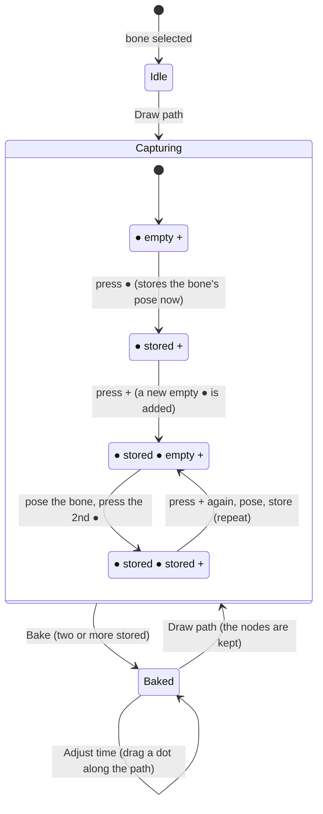

# Drawing a path by capturing the bone's poses (red and green buttons) — plan

**Status:** built 2026-10-07 with all five recommendations; not committed; **not verified by hand**. `tsc`, vitest
(738) and the whole Playwright suite (66) pass, and a deliberate swap of the stored x and y fails the bake test.
Not built: nothing from the plan is left out; **"Make path" is gone** (Draw path starts the path). Written from the owner's note and screenshot (below). It
**replaces the first step of `docs/PATH-SPEED-PLAN.md`** ("Make path" giving three nodes at the first, middle
and last frame) with a capture flow; everything after it there (Bake, Adjust time, the key count fields, the
sidecar) stays. Nothing is built.

Today a path starts with three nodes the editor places. The owner wants the artist to **place the nodes by
posing the bone**: pose it, press a red button to store that pose as a node, add another button, pose
again, store again, until Bake. The screenshot shows the two buttons at the start, a red box and a green box
at the top-left of the Motion Path panel.

## What was asked

> * user must selected bone, then click "draw path"
> * if user new animation it have 2 bt at start
> * 1 red bt store current bone, at 2 green for new bt, then we have 2 red 1 green now
> * user must move bone, then 2 red store data
> * loop until user bake

## My reading, to confirm

1. **Entering:** a bone must be selected (and an animation shown). **Draw path** (the mode button, now the way
   in; the old *Make path* button goes) opens the capture bar. With no path yet, the bar starts as the owner
   describes: **one red button and one green button** (a red *slot*, empty, and the green *add*).
2. **Red = store.** Pressing a red button stores **the bone's pose as it is now** (its joint, in the panel's Local space,
   read from the posed rig, including an unkeyed pose the artist dragged to) as that slot's node. A stored red
   shows solid with the number of the node and its x, y on hover; pressing it again **replaces** that node with the
   bone's pose now (so a node can be re-stored). An empty red is hollow.
3. **Green = add.** Pressing green appends a new **empty red** slot ("then we have 2 red and 1 green"): the bar reads
   `● ● +`. The artist then moves the bone and presses the new red to store the next node.
4. **Loop** as many times as wanted: green, pose the bone, red. **Bake** needs two stored nodes; an empty slot is
   skipped (with a note). Bake writes the keys, as before, and the panel goes to Adjust time.
5. **Moving the bone while capturing writes no keys.** In Draw path the Stage and the panel's handles pose the bone
   *unkeyed* (the Stage's Auto Key off: `Session.setUnkeyed`), so the animation's keys are untouched until Bake; the
   unkeyed pose is dropped when the playhead moves, so a capture is made at the frame the artist is on.
6. **The nodes are kept** (the preserved path, in the `.bbdata`): back in Draw path after a Bake, the bar shows one stored
   red per node; a red can be re-stored, green adds more, and a node can still be dragged on the canvas to refine it.

## Open questions

1. **When is a node in time?** (a) Each node remembers the **playhead frame it was stored at**, so the artist sets the
   timing too by scrubbing between stores (the first node at frame 0, the next at frame 12 …); the speed between
   them starts even, and Adjust time refines it. (b) Nodes carry no time: they spread evenly from the first to the last
   frame of the Bake range. *Recommended: (a), shown on each red as `@12`; two nodes on one frame are refused;
   if no frame was moved (all stored at frame 0) Bake spreads them evenly over the range.*
2. **An animation that already has keys for the bone:** the bar starts the same (one red, one green), and **Bake replaces
   the bone's translate keys** (undo brings them back; the plan says so before it does). *Recommended: yes, with a
   one-line warning in the status when the bone already has translate keys.*
3. **"If user new animation it have 2 bt at start"**: does the two-button start apply to every bone with no path, or only in an
   animation with no keys at all? *Recommended: every bone with no path.*
4. **Removing a slot:** an × on a red (or the Delete key with a red picked); a path keeps at least two once it has been baked.
   *Recommended: yes.*
5. **Stage handles while a path exists:** the move arrows are already hidden; in Draw path should dragging the bone on the **Stage**
   also be unkeyed (point 5), or keyed as usual? *Recommended: unkeyed in Draw path only.*

## What changed from the plan, and why

- **The bar is `● ● +`** in Draw path: a red button per slot (hollow empty, solid stored, with `@frame`), and a green `+`. **− Node** removes the
  picked slot (the last pressed, or a node picked on the canvas); a path keeps one slot, and once baked two poses.
- **Timing from the frames (Q1):** the poses' frames give the bake range (first to last) and when each pose is reached; two poses on one frame, or
  a node without a frame (one added by a double click on the curve), make the time between them **even**, said in the status line and the path's
  info ("even timing"). A range typed in the Timeline bar wins (`fixedRange`). A dot at a pose's frame is the pose's: **Adjust time does not slide it**.
- **Bake replaces the bone's translate keys** (Q2): the status says how many it replaced the first time; Undo brings them back.
- **Unkeyed while drawing (Q5):** `Stage.forceUnkeyed` is true while Draw path is on with a path; Adjust time and no path are as before. The panel's own
  rotation handle also poses unkeyed then.
- **The sidecar** now keeps slots (null), the frame of a pose and `fixedRange`; any number of nodes, including none, reads (a path being drawn).
- **Guards:** `tests/motionPath.test.ts` (frames, empty slots, the even fallback, retimed pins), `tests/sidecar.test.ts` (a null slot, a frame, `fixedRange`),
  `e2e/motionPath.spec.ts` (the bar, no keys until Bake, the baked bone on its stored pose at frame 12, one undo step, the key count fields,
  slide, both modes).

## Sync between the bone and the nodes (owner's request, later the same day)

In Draw path the bone on the Stage and the picked node in the Motion Path panel follow each other:

- **Drag the bone** (it poses unkeyed): the picked node, when the playhead is on its frame, takes the bone's new place live. No red press.
- **Drag a node** on the canvas (or press it): the playhead goes to the node's frame and the bone is posed there, and moves with the node.
- **Which node is "picked":** the one last stored, dragged or pressed; **Shift + press a red button** goes to that pose (seeks, poses the bone)
  without storing. A node with no frame (added by a double click on the curve) is not tied to a frame, so it does not pose the bone.
- **Guards:** `e2e/motionPath.spec.ts` ("follow each other"); a deliberate removal of either direction fails it.
- **Also:** the stored nodes are kept in view when the panel fits itself, so a node cannot be off the canvas.

## Hand tools: curve handles at the nodes (owner's request, later the same day)

In Draw path every node has **handles**, as on a Bézier path: a line and a white dot on each side of a node (the first node has only a way out, the
last only a way in). **Drag a handle** to bend the curve there; the handle on the other side mirrors it, so the node stays smooth. **Double-click a handle**
to put it back to automatic. The pose (the node) does not move, only the curve round it; Bake still passes through every pose on its frame.

- **The curve is now a cubic Bézier through the nodes** (it was a Catmull-Rom spline): between two nodes the control points are the nodes' handles; an
  untouched handle is automatic (along the line between a node's neighbours, a third of the way to each, so there are no loops or cusps), and two nodes
  with none dragged are a straight line. The shape of a path with no handle touched is close to, not identical to, the earlier spline.
- **Stored with the node** (`tx`, `ty`, the way-out offset) in the sidecar; re-storing a pose keeps its handle.
- **Guards:** `tests/motionPath.test.ts` (automatic handles, a dragged one and its mirror, the curve through every node, a straight line for two) and
  `e2e/motionPath.spec.ts` ("hand tools"); flipping the drag's sign fails it.

## Steps

1. **The capture bar** in `panels/motionPanel.ts`: the red and green buttons as a row under the path row (red box: store; green box:
   add), their states from the preserved nodes (`MotionPath.nodes`), the hover text, the picked slot (shown on the canvas as the picked node).
2. **Store:** read the joint now (`boneMatrix` of `session.pose()`, then `fromParent` for Local) and set the slot's node (and,
   per Q1, its frame); keep the path in the sidecar (`keepMotion`); a path with a single stored node is allowed, but cannot Bake.
3. **`makeMotion`** becomes `startMotion` (an empty path: no nodes, `from`/`to` from the animation); `Make path` is removed
   (clean break: nothing else calls it); the model allows 0–1 nodes while drawing (`readSidecar` accepts one or more; Bake needs two).
4. **Unkeyed while drawing** (Q5): the Stage's drag uses its unkeyed branch while the panel is in Draw path with a path started.
5. **Bake:** needs two stored nodes; builds the curve and the timing from the nodes' frames (Q1), writes the keys, goes to Adjust time.
6. **Guards:** `tests/motionPath.test.ts` for nodes with frames (timing from them, spreading when they share a frame);
   `e2e/motionPath.spec.ts`: select a bone, Draw path, the bar is `● +`; store; add; the bar is `● ● +`; pose the bone and store;
   Bake writes keys at the stored frames; the keys are untouched before Bake (the document does not change while capturing);
   re-store replaces; undo takes the whole Bake back. **A deliberate bug must fail it:** store the previous pose once and see the
   position test fail.
7. **Docs:** `PATH-SPEED-PLAN.md`'s first step points here; SPEC §7; the changelog on commit.

## Risks

- **A path with unstored slots** can be confusing: empty reds are hollow and Bake names them.
- **Posing unkeyed** means the artist's pose vanishes when the playhead moves (it does on the Stage today): the capture bar tells them to
  store before moving the playhead, and a capture after scrubbing stores at the new frame (Q1).
- **Replacing keys on Bake** loses hand-made translate keys (undo restores them): hence Q2's warning.
