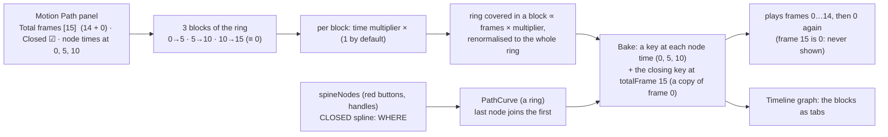

# A path in frames and blocks: a closed spline, totalFrame in Motion Path, node times, a time multiplier per block — plan

**Status:** built 2026-10-07; the panel was renamed **Motion Path** (was Local Path: panel id `motionPath`, `panels/motionPanel.ts`, `MotionPathPanel`, `.motion-path`, `e2e/motionPanel*.spec.ts`; older plans keep the old name in the owner's quotes), not committed; **not verified by hand**. `tsc`, vitest (743) and the whole Playwright suite (71) pass, and a deliberate bug
(the closing key not copying the first) fails the e2e. Flow built in Motion Path: Draw path (2 stored spline nodes + green `+`, never below 2) → Bake → Adjust time
(2 node times, 0 and 8 of 15, never below 2, nothing written) → **Bake to timeline** (keys at the node times + the closing key, one undo step). Total frames
(`14 + 0` hint), Closed tick, per-block time multiplier built. Also built: a **speed graph per block** (a straight line at 1 by default; presets Even / Slow in / Slow out / Slow in & out; draggable points, double-click to add or remove; `MotionPath.curves`): it bends the speed inside a block, never its frames or its share of the ring. **Duties split (2026-10-07):** Draw path shapes the spline (red numbers, +, − Node, handles, Closed; the bone and nodes follow each other); the Adjust time button is the mode switch and replaces the Bake button (the path is kept as it stands, the unkeyed pose is dropped); Adjust time edits timing only (node times, block multipliers and speed graphs, Total frames): the bone cannot be dragged on the Stage (`Stage.dragLocked`) or in Motion Path, and the spline cannot be touched. Block tabs under the Timeline graph built (2026-10-07): with a path on the selected bone the strip under the ruler shows its blocks (frames, `×`, `∿`) instead of the key gaps; a click picks the block, shared with Motion Path through `Session.pickedBlock`. The closing key
is copied from the first key exactly (the rig's parent motion at the closing frame would otherwise shift it).

## What was asked

> totalFrame is duty of "localPath" to set
> for example totalFrame = 14+0 (loop)
> and user add 3 nodeTime at 0, 5, 10
> it mean we get 3 block 0-5, 6-10, 11-14,
> then final 3 block we add time mutiplier to
>
> q1, 14+0 == loop 14 then go 0
> q2, uppon position in spline, spline is default loop (close spline), when we set 15 frame == 14+0, because we count 0 too

(Earlier: "remove all about fps and time"; "in a ring, if we cut 7 times, how many pieces?" — 7.)

## Settled by the owner's answers

- **`14+0` is a loop that runs frames 0 to 14 and then goes to 0.** It is **15 frames** because frame 0 is counted: **totalFrame = 15**. The field says `15` and
  its hint says `14 + 0`. Frame 15 would be frame 0 again, so it is never shown: playback is 0, 1 … 14, 0, 1 …
- **The spline is a closed ring by default.** The last node joins the first (a closed spline: every node has a handle each side), so a ring cut at 3 node
  times is 3 blocks. A tick, **Closed** (on by default), opens it for a path that does not come back (the last node is then the end).

## My reading, to confirm

1. **No seconds, no fps in the path.** `1.25s`, `Path time (s)`, `f30`, the time field and the Timeline bar's path field all go; every number is a frame.
   The skeleton's frame rate stays a file property, used only where a frame is written as a Spine time.
2. **totalFrame is set in the Motion Path panel** (a **Total frames** field, whole number, 15 by default, hint `14 + 0`).
3. **Node times are frames the artist places** (0, 5, 10), not equal parts; **the first is always frame 0**. Each starts a block that runs to the next node time; on a ring the last block runs to
   `totalFrame` (≡ frame 0). With 15 frames and node times 0, 5, 10 the blocks travel **0→5, 5→10, 10→15**: 5, 5 and 5 frames. The example's `0-5, 6-10, 11-14` are the frames each block
   covers, counting from 0 and ending at 14: 6, 5 and 4 of the 15.
4. **Keys:** one at each node time (frames 0, 5, 10) and, on a ring, the **closing key at totalFrame (15), a copy of frame 0**, with each key's Spine curve fitted to the path between it and the next. The
   Timeline's *Closed loop* sees a last key equal to the first as already closing and adds none. An open path has keys at its node times and one at `totalFrame − 1`... see Q3.
5. **The time multiplier, per block** (a number, 1 by default): the ring covered in a block is proportional to **its frames × its multiplier**, renormalised so the blocks cover the whole ring. At all
   1 the speed is even; ×2 on a block makes the bone cover twice as much in it (twice as fast there) and the others a little less. It does not change a block's length in frames.
6. **A block's curve** (optional, later): the way speed varies inside it: the key's own Spine curve (the Timeline graph's handles).
7. **Add and remove node times:** `+ Time` at the playhead's frame, `− Time` on the picked one; a node time's frame is typed in a field for the picked one. The blocks are shown in the Motion Path panel
   as a strip of tabs (frames, `×`) and as tabs under the Timeline graph's ruler; picking one in either picks it in both.

## Open questions

1. ~~What is the `+0`?~~ **Settled** (above).
2. ~~Closed or open?~~ **Settled:** closed by default, with a **Closed** tick to open it.
3. **An open path's last key:** the path ends at `totalFrame − 1` (the last frame shown) on its last node, and the last block runs to it. *Recommended: yes.*
4. **Node time frames:** typed in a field for the picked one (and `+ Time` at the playhead). *Recommended: the field; no dragging along the block edges.*
5. **Multiplier:** 0.1 to 10, a number field on the picked block; the per-block curve later, through the graph's existing handles. *Recommended: yes.*
6. **Existing paths** (node times in seconds, an open spline): dropped when read. *Recommended: dropped.*

## Steps

1. Model: `MotionPath` loses `times` and `duration`; gains `frames` (totalFrame, whole, ≥ 2), `closed` (default true), `starts` (the node times' frames after the first, which is 0) and `speeds` (a
   multiplier for each block, absent = 1); `nodes` unchanged. Sidecar round trip; older paths dropped when read.
2. `src/edit/motionPath.ts`: **`buildCurve` closed** (the last node joins the first; handles for every node; `at(s)`, `project`, `nodeAt` over the ring; open stays as is), `blocksOf(path)`,
   `boundaryProgress(path)` (cumulative shares frames × multiplier, renormalised), `keyFrames` (the node times, and the closing frame on a ring), `bakeKeys` as the fit does today; remove the seconds
   API (`nodeTimes`, `progressAt`, `withDuration`, `moveNodeTime*`, `timeAtProgress`).
3. `src/ui/motion.ts`: `startMotion` (15 frames, closed, node time 0 only), `bakeKeys`; the bake's closing key (a copy of the first).
4. Motion Path: the **Total frames** field (`15`, hint `14 + 0`), the **Closed** tick, the block strip, the picked block's **Speed ×**, `+ Time` / `− Time`, the node time's frame field; the dots on the path show
   frame numbers and are not dragged. The Timeline bar's **Path time** field goes. The Draw path handles at the first and last node (they had one side only) get both sides.
5. Timeline graph: the tab strip shows the path's blocks when the selected bone has a path (picked blocks shared with Motion Path).
6. Guards: unit tests for the ring (the curve through every node and back to the first; arc length; a closed path with handles), `blocksOf` (0, 5, 10 over 15 gives 0→5, 5→10, 10→15), the shares (all 1 is
   even, ×2 moves the end of its block further, the whole ring covered, the first point fixed), the key frames (0, 5, 10, 15 with 15 a copy of 0), 15 frames play 0…14 then 0; e2e: set 15 frames, node times
   at 0, 5, 10 (`+ Time` at the playhead), Bake: keys at 0, 5, 10, 15, the last a copy of the first; ×2 on a block moves its end key further around the ring; remove a node time and Bake: one key fewer.
   **A deliberate bug must fail it.**
7. Docs: the earlier path plans point here; SPEC §7; the changelog on commit.

## Risks

- **A ring through two poses** is a lens (out and back along bending curves): fine, but the artist sees it; **Closed** off gives the straight way.
- **Two changes to timing in one day** (pins, seconds and node times, now frames and blocks): the tests are rewritten again, and the sidecar drops the older paths.
- **A multiplier is not a duration:** ×2 does not shorten a block; it makes the bone cover more of the ring in it.
- **The closing key must equal the first:** editing the first key by hand on the graph makes the path "stale" until Bake, as any hand edit does.
