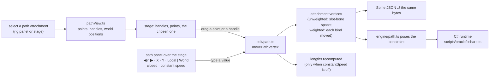

# Path attachments — editing, on the stage and by number — plan

**Status:** done 2026-10-06, apart from adding a path attachment from the interface (it is made by the agent's tools and by Spine; the stage has no "add path" yet). Un-parks "bone paths and their panels" from the v2 cut list
(`docs/EDITOR-V2-PLAN.md`). Scope, from the owner: select a path attachment and drag its points on
the stage; a Local / World choice for the values; a numeric window for exact values; the file
round-trips (vertices in both the unweighted and the bone-weighted form, and the path constraint's
fields); the engine's deformation checked against the C# runtime. After E7 and E8, without
derailing them.

## What exists, what this adds

- **Exists:** the model (`Attachment.vertices/lengths/closed/constantSpeed/vertexCount`), the
  reader and writer, the engine's path constraint (`src/engine/path.ts`), the constraint's
  fields in Properties, the path's curve drawn on the stage (`pathCurves`), and the C# comparison
  over the corpus (`scripts/unity-parity.ts`).
- **Adds:** `src/edit/path.ts` (move a vertex in the world or in the slot bone's space, add and
  delete a point, set closed and constant speed; lengths kept), `src/ui/stage/pathView.ts` (the
  points to draw and pick), the stage's drag, and the path panel.

## Decisions

- **The vertex layout.** A path has `vertexCount` vertices, three to a point (handle in, point,
  handle out). Unweighted, `vertices` holds that many x, y pairs in the slot bone's space.
  Weighted, `vertices.length` differs: each vertex lists its bones with a bind position and weight
  (as a mesh does), and a move changes each bind by the bone-space image of the world move, so the
  weights stay as they were.
- **Local and World.** Local is the slot bone's space on the setup pose; World is the skeleton's.
  The choice is how the panel shows and takes values; dragging on the stage is always in the world.
- **Lengths.** `lengths` holds the cumulative setup-pose length of each curve and is read only when
  `constantSpeed` is off. A move or a point added or removed keeps the count the file had and
  recomputes the numbers only when `constantSpeed` is off; with it on they are left as written.
- **Playback gap, if any:** none expected, since `engine/path.ts` exists and the corpus (Hero,
  Stretchyman, mix-and-match, spineboy-unity) carries path constraints; a path rig that the C#
  comparison cannot take is named in the status, not skipped.

## Steps

1. `src/edit/path.ts` + table tests (unweighted, weighted, closed, local/world, lengths).
2. Round trip: write and read back an edited path rig, constraint fields included.
3. `pathView.ts`, the stage's points and drag, one undo per drag.
4. The path panel (selected point, Local | World, closed, constant speed).
5. The C# comparison on an edited rig.

## Result

1. **`edit/path.ts` + `tests/pathEdit.test.ts`** (12 tests): move a handle or a point (with its handles), add and delete a point,
   closed and constant speed; unbound and bound to bones (Stretchyman's and Hero's paths keep every weight);
   lengths recomputed only when constant speed is off, kept at the count the file had. `isWeighted` in
   `meshLayout.ts` now reads a path's `vertexCount`, so the mesh's frame, binds and `bindAt` serve paths too.
   Adding or deleting a point is refused on a path with deform keys, with the reason.
2. **Round trip** (in the same tests): an edited path, bound or not, written and read back is the same
   document, constraint fields included; an edited Stretchyman path poses its bones elsewhere, and the
   same again from the written file.
3. **`pathView.ts` and the stage**: the selected path's curve, handles and points are drawn; a press
   on one selects and drags it (a point takes its handles), one undo per drag; on the setup pose only,
   since Animate shows the path as a constraint draws it.
4. **`pathPanel.ts`**: over the stage while a path is selected: ◀ ▶ through the vertices, X and Y in
   Local or World, + Point, Delete Point, Closed, Constant speed; `e2e/pathEdit.spec.ts` drags, types
   in both spaces and undoes.
5. **C# comparison** (`scripts/path-parity.ts`): Stretchyman, mix-and-match and spineboy-unity (a
   closed unbound path) with a point moved, and again with a point added and constant speed flipped:
   6 edited rigs, worst 0.0019 against a 0.01 tolerance, every animation and every active bone, so
   the engine poses an edited path as BoneBurst's C# runtime does.

**Playback gap:** none. **Not done:** adding a path attachment from the interface; editing a path
while an animation is shown (its deform keys are not edited here).
