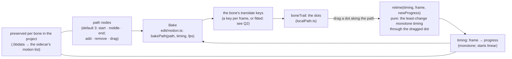

# Motion paths: nodes, Bake, and retiming the dots (speed, shape kept) — plan

**Status:** built 2026-10-07, not committed; **not verified by hand**. `tsc`, 13 unit tests
(`tests/motionPath.test.ts`), 3 Playwright tests (`e2e/motionPath.spec.ts`), the whole vitest (740) and
Playwright (63) suites pass, and a deliberate flip of the dragged progress fails the e2e. Taken as
recommended: Q2 a key per frame (Bake has a *key every N frames* field too), Q3 the three nodes at the
animation's first, middle and last frame, Q4 a smooth spline (no corner switch yet), Q5 one path per bone
per animation; Q1 by the owner: saved per bone in the `.bbdata`. **Added by the owner:** fields in the
Timeline bar to set the frames the path is baked over and the key count. **Not built:** the "Thin keys"
option, the per-node corner switch, rotation along the path, and the SPEC / changelog lines (for the commit).

In the Local Path panel a bone's path is a chain of magenta dots, one per frame; **the gap between
neighbouring dots is the speed** (far apart is fast). Keys alone cannot keep a smooth path's shape once
it is retimed, so the editor keeps the shape itself: a few **nodes**, a **timing** over them, and a **Bake**
that writes the bone's keys from the two. Dragging a dot then changes the timing only.

## Decided

- **Q1, by the owner: the preserved path is saved per bone in the `.bbdata`** (the project file), not in
  the Spine JSON. So the Spine export stays exactly the file Spine and Unity read, with no field of
  ours in it, and a project carries each bone's path with it.
- **Why that also lets the key count change** (the owner's point): the path is the shape and the timing,
  and the keys are only a sampling of it. Baking again with a different number of keys (a key every frame,
  every second frame, a longer or shorter run of frames) resamples the *same* path, so the key count and
  the animation's length can change without losing the shape or the speed. See "Changing the number of keys".

## What was asked

> i think it need preserved bake data,
> first default bone system provide 3 basic node
> they can add, or remove,
> then click bake
> , then when user drag, get best for them, for adjust speed

## My reading, to confirm

1. **A bone gets a motion path on demand** (a "Make path" button in the Local Path panel's header, on a bone
   in Animate mode). It starts with **three nodes**: the bone's position at the animation's first frame, at its
   middle frame, and at its last frame, read from the pose as it is now (a bone with no keys: all three at
   its setup place, in a line the user then pulls into shape).
2. **The nodes are editable:** drag one (the path's shape changes), add one (a "+" on the line between
   two nodes, or double-click the line), remove one (select it, Delete; never below two). The path through them
   is a smooth curve (a Catmull-Rom spline through the nodes; straight segments when the owner prefers: Q4).
3. **Bake writes the bone's translate keys** from the path and its timing: for every frame, the point at
   `progress(frame)` along the path's length. The nodes and the timing are **kept**, not thrown away by the
   bake: that is the preserved data. Bake again after changing a node and the keys follow. One undo step.
4. **Before any retiming the timing is even** (constant speed over the whole animation: equal gaps between
   dots). The gaps the owner sees are then all alike; dragging one is how they are made unlike.
5. **Dragging a dot slides it along the baked path** (the pointer is projected onto the path: it cannot
   leave it), and the timing is **re-fitted to the least change that passes through the new place**: the
   dragged frame now has the new progress, the frames between it and its neighbours that were pinned
   (the first, the last, and any dot the owner has set before) are redistributed smoothly, never running
   backwards. Then the keys are re-baked. The shape does not move: only *when*.
6. **"Get best for them"** is that fit: the owner moves one dot where they want it and the editor works out
   the rest, so one drag does not need a second drag to repair the neighbours.
7. **Out of scope here:** rotation along the path (the bone facing the way it goes: a later step),
   more than one bone on one path, speed as a graph, and baking other channels.

## Where it is stored

The sidecar (`<name>.bb.json` inside the `.bbdata`, `src/model/sidecar.ts`) gains a `motion` list, one entry
per **bone in an animation**: `{ animation, bone, nodes: [{x, y}], pins: [{t, p}], from, to, step, baked }`.
`nodes` are in the bone's parent space at the baked frames; `pins` are the retiming dots as
`(t, p)` with **t the normalized time** (0 to 1 over `from..to`) and **p the progress along the path**, so
they survive a change of length; `from`, `to` and `step` are the baked frame range and how often a key is
written; `baked` is a short signature of the keys the last Bake wrote, to tell when they were edited by
hand since (the stale note). It counts as content a person made (`hasContent`), so it is saved and keeps
the project "unsaved" until it is. **Not undoable:** the sidecar is not part of the history (SPEC §3), so
node and pin edits undo through the keys they bake, not on their own (a risk, below).

## Changing the number of keys

Bake has three numbers: **from**, **to** (the frame range; the animation lengthens or shortens to it) and
**step** (a key every `step` frames, 1 by default). `bakePath` samples `point(p(t) · L)` at those frames.
Change them and press Bake: the same path and the same speed, with more or fewer keys, or over more or
fewer frames. Where `step` is above 1 the bone moves in straight lines between the keys, so a curve is
approximated by a polygon: the panel shows the baked dots, which is how that looks, and a distance in units
tells how far off the polygon is (the largest gap to the path) before the owner commits.

## The maths

- **The path.** Nodes `P0..Pn-1`; a centripetal Catmull-Rom spline through them (no loops or cusps from
  uneven node spacing); its arc length is tabulated at 64 samples per span, so a distance along the path
  maps to a point and back: `point(s)` for `s ∈ [0, L]`.
- **The timing.** A monotone non-decreasing map `p(t) ∈ [0, 1]` over normalized time `t = (frame − from) / (to − from)`,
  stored as the *pinned* pairs `(t, progress)` (always `(0, 0)` and `(1, 1)`) and interpolated with a
  monotone cubic (Fritsch–Carlson / PCHIP), so it never overshoots and never reverses. No pins but the two
  ends is constant speed.
- **A drag.** The pointer projected on the path gives progress `q`. The dot's frame `f` gets the pin
  `(f, q)`, clamped between its neighbouring pins so the order of frames is kept (`q` cannot pass the pin
  before or after). That one new pin, with the existing ones, is the whole timing: the "best" answer is the
  unique monotone cubic through them, the smoothest fit with no free parameter to tune.
- **Bake.** For each frame `f`: `point(p(f) · L)` in the bone's parent space (through `moveDelta` and the
  parent's matrix at that frame, as the Local Path drag already does), written as the bone's translate
  key at `f` (linear between frames). Frames with no change from the neighbours' straight line are kept
  anyway in this version (a key per frame: exact, simple; thinning is Q2).

## What exists (to check on disk before building)

`boneTrail` and the dots (`stage/trail.ts`, `panels/localPath.ts`: `marks`, `beginEdit`, `editTo`),
`shiftedLocal` and the parent-space maths (`stage/trailEdit.ts`), `keyBone` / `setKey` / `deleteKeys`
(`edit/boneKeys.ts`, `edit/keys.ts`), the history's `begin` / `apply` / `end`, the sidecar's view and its
`extra` map (`edit/sidecar.ts`), `Animation.extra` (model, round-tripped as written).

## What changed from the plan, and why

- **Timeline fields (owner's request):** "Path [from] – [to] every [step]" in the Timeline bar, shown when the
  selected bone has a path. Typing one keeps it and bakes again at once: the same path and speed, more or
  fewer keys, or over more or fewer frames. Out-of-range values are refused and put back.
- **Nodes live in Local space**, so they are shown and edited only while the panel is in Local; in World the
  panel says so. The retime drag also needs Local.
- **A dot slides only when the keys are as the bake left them** (not "stale") and the path has been baked; the
  first and last frames are pinned. Otherwise a dot's drag is the free move as before.
- **Projection near a hint:** a path that doubles back (a hairpin, or one crossing itself) has two equally near
  places for the pointer; the slide takes the one nearer where the dot is now (`project(p, near)`).
- **Where the code is:** `edit/motionPath.ts` (curve, timing, bake keys), `ui/motion.ts` (make, bake, stale; poses the
  rig), the sidecar's `motion` list (`model/sidecar.ts`, `io/sidecar.ts`, `edit/sidecar.ts`), the panel's button
  row and drawing (`panels/localPath.ts`), the fields (`timeline/timeline.ts`).
- **Not undoable on its own:** nodes and pins are in the sidecar; Bake and Retime are undo steps of the keys.

## Two modes (owner's request, later the same day)

The Local Path panel's path row now has two modes, as buttons that show when a bone has a path:

- **Draw path:** shape the path: drag, add (+ Node, or a double click on the curve) and remove nodes, then
  **Bake** (the Spine keys). A press on a dot only puts the playhead there. The move arrows are hidden while a
  path exists (they edit the keys directly and would make the path stale); the rotation handle stays.
- **Adjust time:** change the speed only: a dot is dragged **along the path** (the nodes are drawn small and hollow and
  cannot be grabbed). If the keys changed since the last bake, or the path was never baked, a press says so and
  only seeks.

Make path starts in Draw path; **Bake switches to Adjust time**. The mode is a panel setting, not saved.

## Steps

1. `src/edit/motionPath.ts` and `tests/motionPath.test.ts`: the spline (`pathPoint`, length table, a point
   to progress), the timing (`timingAt`, `withPin`, monotone and clamped), `bakePath` (nodes + timing + fps
   → the translate keys). Tests: the spline passes through every node; constant speed has equal gaps (±1e-6);
   a pin is passed exactly; the timing is monotone for any pins; **shape invariance**: baking before and
   after a retime, every dot lies on the same curve within 1e-6; a straight path with two nodes bakes a
   straight line.
2. The sidecar's `motion` list and its round trip (`src/io/sidecar.ts`, `src/model/sidecar.ts`, `tests/sidecar.test.ts`):
   write and read nodes, pins and the range; an editor that does not know the list keeps it (`extra`); `hasContent`.
3. The panel: "Make path" (three nodes), drawing the nodes as squares on the line, drag / add / remove
   (history steps, so undo works), and **Bake**.
4. The retime drag: a press on a dot of a *baked* path slides it (cursor and a status hint); the live
   preview re-bakes into the document on each move (one undo step, as the edit drags do).
5. Guards: the unit tests above; an e2e that makes a path on the stickman, drags a dot and reads the baked
   keys back (the dots' shape unchanged, the dragged dot where it was dropped), then Undo; **a deliberate
   bug must fail it** (project onto the wrong segment once and see the shape-invariance test fail).
6. Docs: SPEC §7 (the preserved path), the Local Path tooltip, a dated changelog entry on commit.

## Risks

- **The preserved data and the keys can drift** if the owner edits the keys by hand afterwards (dragging a dot
  to a new place as today, a key on the timeline). Rule: **a hand edit to a baked bone's translate keys
  marks the path "stale"** (a note on the panel: "keys changed since the last bake: Bake overwrites them")
  rather than overwriting silently; Bake is the only thing that writes from the path.
- **A key per frame** makes the JSON bigger (Q2).
- **The sidecar is not undone with the keys.** Undo can bring back the old keys while the nodes stay new; the
  `baked` signature then marks the path stale instead of hiding it.
- **Only a project (`.bbdata`) keeps the paths:** a Spine JSON exported and opened alone has the keys and
  no path, which is the point of (Q1), but worth saying in the panel.
- **Two ways to edit one motion** (the nodes and the dots) can confuse; the panel says which is in control.

## Open questions

1. ~~Where the preserved path lives.~~ **Decided: per bone, in the `.bbdata`** (above).
2. **What Bake writes.** (a) A key per frame, linear between: exact, big. (b) Fewer keys, thinned to a
   tolerance (0.05 units) with eases between: small, and a thinned bake can be a hair off the path.
   *Recommended: (a) now, with a "Thin keys" option after, since "best" for retiming is exactness.*
3. **The three starting nodes:** first, middle and last frame of the animation as it is now (this plan), or
   the bone's first key, a middle one and its last. *Recommended: first, middle and last frame of the animation.*
4. **Curve or straight:** a smooth spline through the nodes (this plan), or straight segments with the
   option to round the corners. *Recommended: smooth (the screenshot's loop reads as hand-drawn corners
   though: so a per-node "corner" toggle may be wanted; the first version uses smooth only).*
5. **One path per bone per animation** (this plan: the owner said "by each bone"), or one per bone shared by
   every animation. *Recommended: per animation: a walk and a jump move the same bone differently.*
