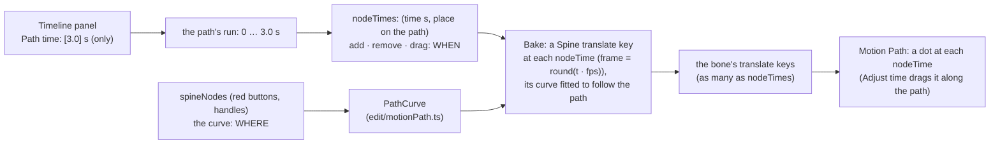

# Time on the Timeline, node times on the path (nodeTime ≠ spineNode) — plan

**Status:** built 2026-10-07 with all five recommendations; not committed; **not verified by hand**. `tsc`, vitest (741) and the
whole Playwright suite (71) pass, and two deliberate bugs (the curve's x and y swapped; the bone-to-node sync without its guard) fail the tests.
Deviation from the plan: dragging a node time **in time** is a field, not Shift-drag (below). Written from the owner's note (below). It changes the **timing half** of
`docs/PATH-SPEED-PLAN.md` and `docs/PATH-CAPTURE-PLAN.md`: the pins, the "from – to every" fields and the key per
frame go; **node times** take their place. The shape half (the red buttons, the curve and its handles) stays. Nothing is built.

Two kinds of node, kept apart:

- a **spineNode** is a point that **shapes** the path (what the red buttons store; the curve passes through it; it has handles). It says *where*.
- a **nodeTime** is a mark **on** the path that says **when**: at this time the bone is at this place on the path. It is the keyframe.
  The animation gets **one Spine key for each nodeTime**, so the frame count follows the nodeTimes, not the other way round.

The Timeline panel no longer sets frames or keys for the path: it sets **only the time** the path takes (seconds, 3 s by default).

## What was asked

> Timeline panel, can set time only, default 3 sec, but frame count upon nodeTime in path (splinePath with spineNode) of "localPath" panel,
> nodeTime can add or remove too, nodeTime != spineNode

## My reading, to confirm

1. **The Timeline's path fields become one: "Path time (s)"**, 3.0 by default. It is the length of the run: the first nodeTime is at 0 and the
   last at that time, unless the artist drags the last one. The "from", "to" and "every" fields go; **a frame is only the ruler's unit**.
2. **nodeTimes live on the path.** Each is `(t seconds, p along the path 0..1)`. They are drawn on the curve as dots (the current magenta dots,
   but only these few instead of one per frame), each with its time (`1.25s`) and the **frame it falls on**; the gap between two shows the time between them.
3. **Add and remove:** a **+ Time** (or a double click on the path where there is no node) adds a nodeTime at that place, its time interpolated
   from its neighbours; **× / Delete** on a picked one removes it. The two **ends are always there** (a path keeps its first and last nodeTime: it can
   be moved in time but not removed).
4. **Adjust time** now means dragging a nodeTime: **along the path** (changes where the bone is at that time), or, with Shift, **in time** (changes when
   it gets there, the dot staying on the path). *Recommended: along the path by default, Shift for time.*
5. **Bake writes a translate key at each nodeTime**, at the frame `round(t · fps)`. Between two keys Spine blends; to follow a curved path a key's
   **per-channel Bézier curve is fitted** to the path between it and the next (a cubic Bézier of the path between two keys is exactly a
   Spine channel curve when time runs evenly; the fit handles the rest), with a readout of how far the baked motion strays from the path.
6. **spineNodes carry no time any more.** A red button stores a place (and its handle); the frame stored with it today is dropped. *(Q1: or kept as the
   nodeTime it creates.)*
7. **A path's frame count is the number of nodeTimes**: a path with 4 nodeTimes bakes 4 keys, however long or short in seconds.

## Open questions

1. **Does a red button also add a nodeTime?** (a) No: red stores a place only; nodeTimes are added on the path. (b) Yes: storing a pose at the
   playhead frame adds a nodeTime there at that place on the path (the earlier capture flow's timing kept, as nodeTimes). *Recommended: (a) so the two
   stay apart, as the owner said; the path starts with the two end nodeTimes (0 s and the path time), the artist adds more.*
2. **What does Bake write between nodeTimes** when the path curves? (a) Keys at the nodeTimes only, each with its fitted Bézier curves (few keys, a stated
   error). (b) The same plus extra keys where the error exceeds a tolerance (never off the path by more than 0.5 units, more keys). (c) A key per
   frame as today. *Recommended: (a), with the error shown; the artist adds nodeTimes where it strays.*
3. **Time in seconds, keys on frames:** a nodeTime is stored in **seconds** (the Timeline sets time only) and lands on `round(t · fps)` at Bake; two
   nodeTimes within one frame of each other are refused. *Recommended: yes.*
4. **The default time:** 3.0 s for a new path, or the animation's current length when it has one. *Recommended: 3.0 s, as said; the field then edits it.*
5. **Existing paths** (made with the earlier build today): dropped, or converted (their pins become nodeTimes). *Recommended: dropped: the build is beta
   and the paths are hours old (CLAUDE.md §3), and the sidecar keeps reading what it does not know.*

## What changed from the plan, and why

- **Node time in time = a field.** Drag moves a node time **along the path**; to change *when*, pick it and type its time in the path row's field
  (seconds). Shift-drag needed a time scale the panel does not have.
- **Node times live in the path row, in Adjust time:** `+ Time` (at the playhead), a double click on the path, `− Time` (or Delete) on the picked
  one, the time field. Each change **bakes at once**, so the keys follow (one undo step each).
- **The bake fits each segment** by sampling the bone's local x and y in the rig as posed then (a moving parent is in it) and least-squares fitting the two
  control values per channel, control times at thirds. Spine's own curve then follows the path; the readout "strays n" is the worst fit error. A
  segment that is one cubic fits exactly (unit test).
- **A red button stores a place only** (no frame); a path starts with the two end node times (0 s and the path time); **older paths are dropped**
  when read (no `duration`).
- **The bone-to-node sync follows only a bone that was posed** (`Session.unkeyedRevision`), not every session change: dragging a handle was copying
  the bone's pose into the picked node.
- **Left as they were:** the per-frame dots and Length numbers of the bone's trail (they show the baked motion), the Timeline's graph of the keys.
- **Guards:** `tests/motionPath.test.ts` (node times, add/remove/move rules, path time, key frames, the fit, the keys' curves), `tests/sidecar.test.ts`,
  `e2e/motionPath.spec.ts` (ends and poses, path time, add/remove, drag along the path, the baked bone within 4 units of the curve at every 3rd frame).

## Steps

1. `src/model/sidecar.ts` / `src/io/sidecar.ts`: `MotionPath` gains `times: {t, p}[]` (nodeTimes) and `duration` (seconds); loses `pins`, `from`, `to`,
   `step`, `fixedRange` and the nodes' `frame`. Round trip test.
2. `src/edit/motionPath.ts`: the curve and handles stay; **nodeTimes** replace the pins (`timeAt(p)`, `placeAt(t)`, a monotone map through the
   nodeTimes), `bakeKeys` (one key per nodeTime, its channel curves fitted to the path between), `bakeError`.
3. `src/ui/motion.ts`: `startMotion` (two end nodeTimes, 3 s), `addTime`, `removeTime`, Bake from the nodeTimes.
4. The Timeline bar: one field, **Path time (s)**; the old three fields go.
5. Motion Path: the nodeTime dots (only these), their labels, + Time / double click, remove, Adjust time (along the path / Shift in time); the
   per-frame dots and the Length numbers (a distance per frame) go or become the distance between nodeTimes.
6. Guards: unit tests for the monotone map, the fit (a single cubic path segment bakes to the same channel curves; the stray readout), add and
   remove; e2e: make a path, add a nodeTime, Bake: as many keys as nodeTimes at the right frames, the bone on the path at each; the Timeline field
   changes the time and the keys follow; remove a nodeTime and Bake: one key fewer. **A deliberate bug must fail it.**
7. Docs: the two earlier plans' timing parts point here; SPEC §7; the changelog on commit.

## Risks

- **A fitted curve is an approximation** unless a segment is one cubic: the readout says how far; the artist adds a nodeTime to tighten.
- **Fewer keys than before:** a baked path no longer has a key per frame, so a hand edit on the Timeline's graph is by key, not frame. That is the point.
- **Two plans' worth of code changes** (pins, fields, per-frame dots): most of today's path tests are rewritten, not just added to.
