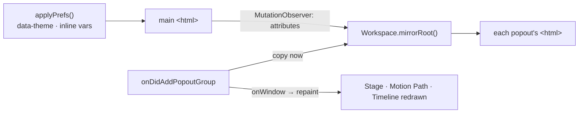

# Popout windows take the editor's theme

**Status:** done, 2026-10-09. Nothing left.

A panel opened in a new window ("Open in New Window", Dockview's popout) is in a document of its own. The theme chosen in
Preferences lives on the main page's `<html>`: `data-theme` (Light or Dark, when not following the system) and the inline
appearance values (`--tab-bar-bg`, `--ruler-bg`, `--ui-font-size`, `zoom`). The popout's `<html>` got none of it, so with **Light**
chosen and the system dark, the popped-out Motion Path panel came up dark, and its canvases (painted before the move, in the main
page's light colours) stayed light on the dark page: the owner's screenshot.

1. `Workspace`: when Dockview opens a popout, its `<html>` takes the main page's `data-theme` and `style`; a `MutationObserver` on the
   main `<html>` copies every later change to each open popout (a closed window is dropped).
2. `app.ts`: a new popout repaints the panels (`applyPrefs` again, one frame later), so canvases drawn in the main page's colours
   are drawn again in the window's.
3. e2e (`popout.spec.ts`): with Light chosen and the system dark, a popped-out Motion Path's `<html>` is Light, its speed graph is
   painted in Light's panel colour, and choosing Dark afterwards reaches the popout too.

## Result

As planned, and two more causes found while testing step 3:

- **The Motion Path panel repainted on the main window's frames** (`requestAnimationFrame` of the main page), where the Stage and the
  Timeline use their own window's. In a popout it now asks its own window, so it repaints there while the main window is behind.
- **The speed graph and the frame strip painted nothing when they had nothing to draw** (no bone selected, no animation): the canvas
  kept its last picture, in the old theme's colours. Both now fill with the theme's panel colour first (`blank`).

`popout.spec.ts`: with Light chosen and the system dark, the popout's `<html>` is Light and its speed graph white; Dark chosen then
reaches the window and, with no bone selected, the graph is painted dark (it stayed white before `blank`). vitest 776 pass; e2e 124
pass, the 3 AI-bridge tests fail as before (no bridge from the dev server on 5199).
