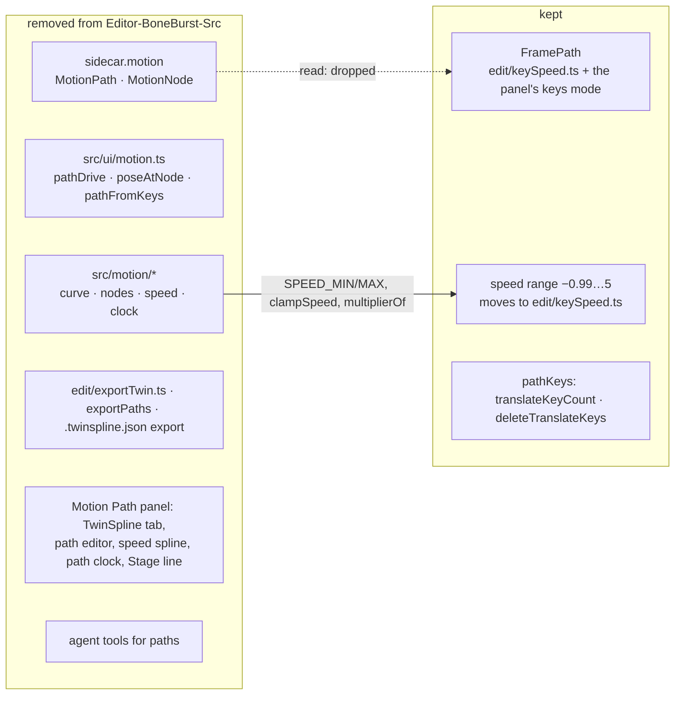
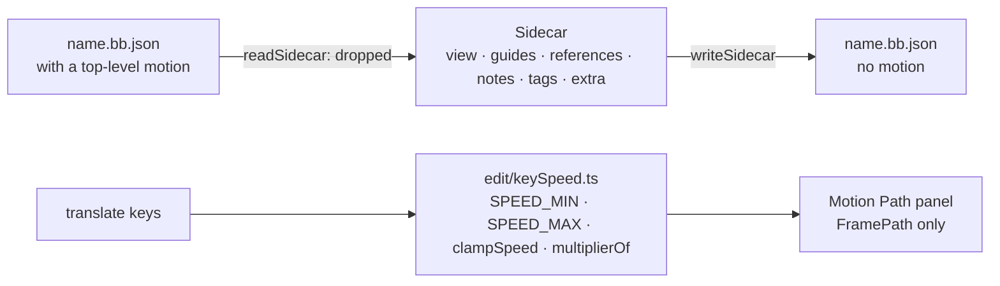

# Remove TwinSpline from the editor — plan

**Status: done 2026-10-09 (see "Result"), uncommitted. Looked at in the browser on Stickman_IK's `hips`: FramePath alone in the header, the strip, the speed graph and the key data shown, no console errors. Left: `npm run check`'s chunk gate (the main chunk is 551 kB, over 500 kB; it was 618 kB before this change, so the gate failed before it too), and M0's Unity runtime (the next pass).** Planned 2026-10-09 from the owner's note. FramePath (`FRAMEPATH-SPEED-PLAN.md`) now does in the Spine keys what TwinSpline did beside them: a curved path, a speed per key, three handle modes. The owner: remove everything about TwinSpline from the editor now ("now 1"), and from M0's Unity runtime soon after ("soon m0 too"). A file that has TwinSpline paths in its sidecar opens as if they were not there; they are dropped on the next save (owner's choice, beta clean break, §3 of the repository's `CLAUDE.md`).

## What goes

- **The path system's code**: `src/motion/` (curve, nodes, speed spline, path clock), `src/ui/motion.ts` (driving a bone from a path, posing at a node, path ↔ keys), `src/ui/pathKeysOver.ts`, and in `src/edit/pathKeys.ts` everything that makes keys from a path (`fitChannel`, `translateKeys`, `translateKeysAt`, `writeTranslateKeys`, `setupXY`) once nothing else uses it.
- **The data**: `MotionPath` / `MotionNode` and `Sidecar.motion` in `src/model/sidecar.ts`; their reading and writing in `src/io/sidecar.ts` and their edits in `src/edit/sidecar.ts`. A sidecar's `motion` is read and dropped, not kept in `extra`.
- **The export**: `src/edit/exportTwin.ts`, `src/ui/exportPaths.ts` and the TwinSpline part of `src/ui/unityExport.ts` (the `.twinspline.json` written beside the export); the scripts that make its fixtures (`scripts/twin-fixtures.ts`, `scripts/twin-e2e-fixture.ts`).
- **The session**: the path clock (`pathClock`, `playPath`, `pausePath`, `stopPath`, `seekPath`, `playBoth`) and the pose a path drives.
- **The Motion Path panel**: the TwinSpline tab and its ⋮ menu, the "Create new" card, the parent-bone picker, the path bar (Duration, Play, Both, Stop, clock), the green node strip, the node data, the speed spline's twin drawing and events, the spline on the picture and its handles, the Stage line (and the Stage's drawing of it in `app.ts`), the TwinSpline hotkeys. The FramePath tab stays, as the panel's one mode: no tab row, its ⋮ menu (Closed, Delete FramePath data) kept by the title.
- **The AI tools** that read or write paths (`src/agent/tools.json`, `context.ts`, `unity.ts`), with the contract's version note as `npm run check` asks.
- **Tests and docs**: the TwinSpline e2e and unit tests (`twinSpline`, `twinExport`, `motionPath`, `exportTwin`, `exportPaths`, `pathKeysOver`, and the path parts of the others); the TwinSpline plans get a line at the top saying the code is removed, with this plan's name. SPEC's sections about the path system are cut back to FramePath.

## What stays

- FramePath: `src/edit/keySpeed.ts`, the panel's keys mode, its strip, speed graph and handles. The speed range (`SPEED_MIN`, `SPEED_MAX`, `clampSpeed`, `multiplierOf`) moves into `src/edit/keySpeed.ts`, the one place that now uses it.
- `translateKeyCount` and `deleteTranslateKeys` (FramePath's ⋮ menu).
- The Unity runtime's TwinSpline code in M0 (`com.module.ta-creator-boneburst-core/Runtime/Core/TwinSpline/`, `TimelineDef`, `TimelineApply`, `Doc/Format/TwinSpline.md`) and the ECS project's P16: the next pass.

## Steps

1. Move the speed range into `keySpeed.ts`; the panel imports it from there.
2. Cut the panel down to FramePath; `tsc` guides the rest.
3. Remove the session's path clock and driven pose, the Stage line in `app.ts`, the export, the sidecar's motion (read and dropped), the agent tools, `src/motion/`, `src/ui/motion.ts`, `pathKeysOver.ts`, and the unused parts of `pathKeys.ts`.
4. Remove or trim the tests; a test that a sidecar with `motion` opens and saves without it.
5. `npm run check` (types, unit, e2e, the build's e2e, licence guards); a look in the browser.
6. Status and results here; SPEC and the old plans marked.

## Result

1. **The speed range** (`SPEED_MIN`, `SPEED_MAX`, `clampSpeed`, `multiplierOf`) is in `src/edit/keySpeed.ts`; the panel imports it from there.
2. **The panel** (`src/ui/panels/motionPanel.ts`, 3396 → 2122 lines) is FramePath only: no tab row; the Path layer icon, FramePath's name and its ⋮ (Closed, Delete FramePath data; "Create new TwinSpline from FramePath" gone) sit where the tabs were (the ⋮ keeps the accessible name "FramePath menu"). Gone: the TwinSpline tab and menu, the Create new card, the parent-bone picker, the path bar, the view bar's Play / Both / Stop / clock / Duration, the green node strip and node data, the speed spline's twin drawing, legs, menu, fit and scrub, the spline on the picture with its nodes and handles, the Stage line (button, swatch, `stageLine`), the Spline layer, the TwinSpline hotkeys (`hotkey`, `stepNode`, `nudge`), `syncFromBone`, `drawing`, `withoutInactive`. Every `this.tab === "keys"` branch is now the only path. The panel measures from the bone's own parent (the parent picker was TwinSpline's). FramePath's handles and speed curve keep the colour they had by default (`PATH_COLOUR`, the old Stage line default) since the swatch is gone. A closed FramePath's "twin" key (the frame at the other end) is renamed `otherEnd`, so nothing named twin is left.
3. **Removed**: `src/motion/` (curve, nodes, speed, clock, index), `src/ui/motion.ts`, `src/ui/pathKeysOver.ts`, `src/ui/exportPaths.ts`, `src/edit/exportTwin.ts`, `scripts/twin-fixtures.ts`, `scripts/twin-e2e-fixture.ts`; in `src/edit/pathKeys.ts` everything but `TRANSLATE_TIMELINES`, `translateKeyCount` and `deleteTranslateKeys`. `MotionPath`, `MotionNode` and `Sidecar.motion` are gone from the model, `motionOf` / `withMotion` from `edit/sidecar.ts`; `readSidecar` drops a top-level `motion` (not into `extra`) and no longer takes the frame rate (it was only for old paths). The session has no path clock, no path-driven pose (`pose()` and `previewPose()` are the keys alone), no `pathDrives`; its history link carries the tags alone. `app.ts`: no Stage line, no `advancePath`, no TwinSpline export items, no Motion Path hotkeys or arrow nudge (F still fits the panel under the pointer). The Stage lost `motionLine` / `drawMotionLine` and `forceUnkeyed` (only a drawn path used it); `stage/trail.ts` lost `DrivenTrail` / `drivenPose`; the Timeline lost the "silenced by path" badge and dimming. `unityExport.ts` writes the document as it is (`exportFiles`; `exportBundle`, `ExportMode` and the `note` are gone). Shortcuts: the Motion Path group (A, X, V, M, O) is gone, Q and W only step frames. CSS: the twin-only rules (node buttons, drop arrow, path bar sections, Play and clock, card, Stage swatch, silenced badge) are gone.
4. **The AI contract**: `export_to_unity` has no `mode` and no `report`; its arguments are v1's again, so `npm run check`'s contract gate asked for the note's line to change from "reshaped" to "meaning" (the line now says the mode went with TwinSpline). The version stays 2 (the note lists changes from v1, and v1's fixture is what it is checked against). `src/agent/context.ts`, `unity.ts` and `ui/agent/context.ts` follow.
5. **Tests.** Deleted: `e2e/twinSpline.spec.ts`, `e2e/twinExport.spec.ts`, `e2e/motionPath.spec.ts`, `e2e/motionParent.spec.ts`, `e2e/motionStageLine.spec.ts`, `e2e/motionHelpers.ts` (all TwinSpline), `tests/twinSpline.test.ts`, `tests/exportTwin.test.ts`, `tests/exportPaths.test.ts`, `tests/pathKeysOver.test.ts`, `tests/motionParent.test.ts`, `tests/motionLayer.test.ts` (the guard over `src/motion/`), `tests/motionPath.test.ts` (its one FramePath test, translate keys counted and deleted, moved to the new `tests/pathKeys.test.ts`). Trimmed: `e2e/motionModes.spec.ts` (the tab tests replaced by "FramePath is the panel's one mode" and "the ⋮ menu is Closed and Delete FramePath data", Delete's undo checked), `e2e/motionPanel.spec.ts` (no Spline button; F over the panel fits it, from the deleted motionPath test; a 1100 px tall window, since every bone now has the strip and graph under the picture, which shrank it below the pixel counts), `e2e/motionPanelEdit.spec.ts` (the picture's canvas named, now that the strip's canvases show too), `e2e/panelMenu.spec.ts`, `e2e/shortcutsSheet.spec.ts`, `tests/shortcuts.test.ts`, `tests/agentHost.test.ts` (no mode, `mode` refused), `tests/fixtures/agentContext.ts`. Added in `tests/sidecar.test.ts`: a sidecar with a `motion` array reads without it (not in `extra`, no issue, the rest kept) and writes without it.
6. **Kept**: `docs/PATH-PLAN.md` (path attachments) and `LOCALPATH-EDIT-PLAN.md` (dragging the bone's marks, still FramePath's) are not marked. `src/edit/path.ts` is path attachments, not TwinSpline. `scripts/check.sh` lost its `layer motion` line and `src/motion` in the DOM check.
7. **Checks** (2026-10-09): `npx tsc --noEmit` clean; `npx vitest run` 766 passed in 70 files (848 before, the difference the deleted TwinSpline tests); `npx playwright test` 118 passed (158 before); the build's e2e 1 passed. `npm run check` **fails at its first gate**: `dist/assets/index-*.js` is 550.97 kB, over 500 kB. Not caused here: the same build of `HEAD` (before this change) makes a 617.96 kB chunk and fails the same way; this change made it 67 kB smaller. Run with that one gate left out, the rest of `check.sh` passes ("check: all passed": vitest, e2e, build e2e, licence and layer guards).
8. SPEC: §1's diagram and table lose `src/motion`; §3 says a sidecar's `motion` is read and dropped; §4's export is the document as it is; §6a is now "A bone's motion: FramePath", short, pointing to `FRAMEPATH-SPEED-PLAN.md`; §7's Motion Path paragraph describes the FramePath panel. The TwinSpline-era plans (`TWINSPLINE`, `TWO-SYSTEMS`, `PATH-CAPTURE`, `PATH-FRAMES`, `PATH-SPEED`, `PATH-TIME`, `MOTION-MODES`, `MOTION-PARENT`, `RING-SLICE`, `UNITY-EXPORT`) have the "Removed 2026-10-09" line under their title.

