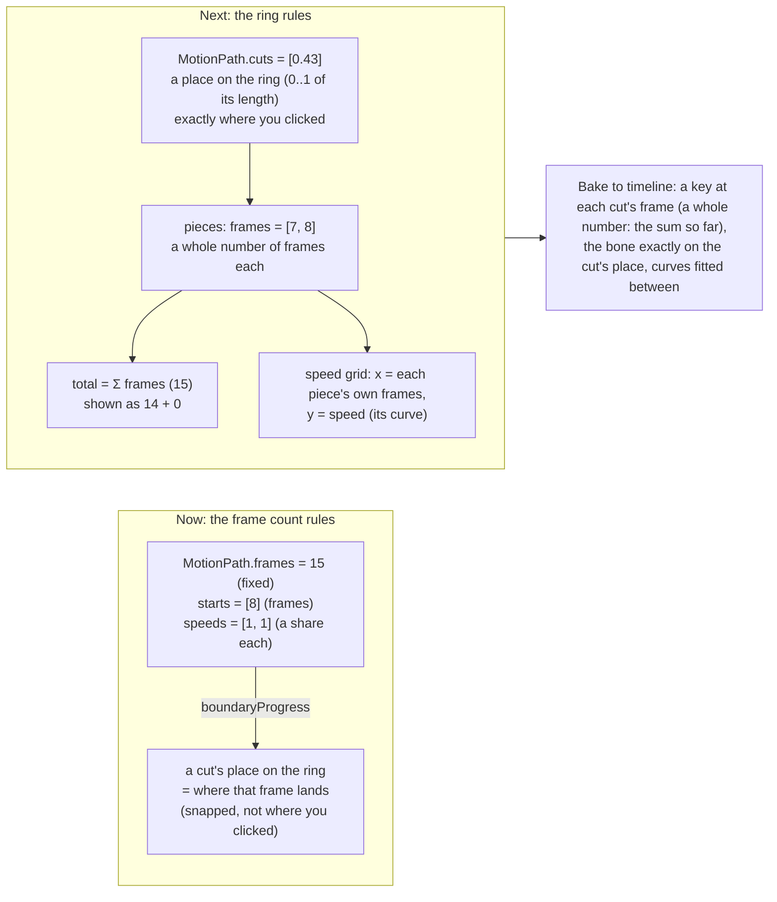

# Slice the ring where you click: cuts on the ring, a length in frames for each piece, no fixed frame count — plan

> **Dropped 2026-10-08, not built:** node times and cuts are gone; see `TWINSPLINE-PLAN.md`.

**Status:** planned 2026-10-07; not started. From the owner's note (below); three questions at the end settle the details. It changes the **timing model**
of `docs/PATH-FRAMES-PLAN.md` and the cuts of `docs/ADJUST-GRID-PLAN.md`; the ring itself (Edit Path) is untouched: **"we have a good ring"**.

Today a cut is a **frame**: Ctrl + click picks the free whole frame the bone passes nearest the click, so the cut lands on that frame's place on the ring, **not where
you clicked**, and the run has a fixed length (`frames`, "Total frames") that the pieces share out. The owner's point: pinning the cuts to a frame count costs the path some of its
quality; slice the ring itself, and let the length follow from the pieces.

## What was asked

> 1 we have good ring
> 2 if we try to use frameCount to lock it, it will reduce quality of path, i think, we just slice ring without use fix frameCount
>
> let plan

## Why the frame count costs quality (checked on disk)

- `edit/motionPath.ts` `boundaryProgress` gives each piece a share of the ring ∝ its frames × its multiplier, and `progressAtFrame` reads the bone's place from it; a cut is a whole frame in `starts`.
- `ui/panels/motionPanel.ts` `ringFrameAt` (the Ctrl + click) picks the free frame whose place on the ring is nearest the click, so the cut sits at that frame's place: up to half a frame's travel from the click, and a different place again when the frame count or a multiplier changes.
- Spine keys must sit on whole frames. That is true either way, and it is what the new model keeps: a key at each cut's whole frame, with the bone exactly on the cut's place. What changes is that the **place is chosen, and the frame follows**, instead of the other way round.

## The model

1. **A cut is a place on the ring**: `MotionPath.cuts: number[]`, each 0..1 of the ring's length (arc length, as `PathCurve.project` returns it), strictly increasing; the ring starts at 0 (its origin, the first node). Ctrl + click stores the **projected point exactly**, with no snapping to a frame's place.
2. **A piece has a length in frames**: `MotionPath.pieces: number[]`, a whole number each (≥ 1), one more than there are cuts. **The run's length is their sum**: no stored `frames`. Closed ring: the closing key sits on the sum (a copy of the first), shown `14 + 0` for 15 as before.
3. **Speed inside a piece is its curve** (`curves`, unchanged), over the piece's own frames: the speed grid's x axis is each piece's frames, the y axis the speed.
4. **`speeds` (Time ×) goes**: it only existed to share the ring out between pieces; with cuts as places there is nothing to share. A piece that should go faster is given fewer frames or a faster curve (clean break, CLAUDE.md §3).
5. **Cutting a piece**: the new cut splits its piece in two; the frames are split in proportion to the arc length each side, at least 1 each; **a piece of one frame cut in two becomes two of one frame (the run grows by one)** rather than being refused, so the frame count is never in the way. The new piece is picked; each half keeps the speed curve straight (a bent curve is reset, said in the status line).
6. **Removing a cut** (right-click it) joins its two pieces: their frames add, the curve goes straight. A ring keeps two pieces.
7. **Moving a cut**: on the ring canvas **a cut's mark is dragged along the ring** (Adjust time's one grab: it slides the place, never off the ring; the neighbours' frames do not change, so the time stays and the speed changes). In the cell row, dragging the line between two cells **moves frames between the two pieces** (the place stays, the time moves). Two different things, each in its own place.
8. **Total frames** is no longer typed: it shows the sum (`15 frames (14 + 0)`), and a field **Piece frames** sets the picked piece's frames. (Question 3.)
9. **Old files**: a path with `frames` / `starts` / `speeds` is read into the new model **without loss**: each `starts[i]` becomes the place `boundaryProgress` gave it, `pieces` the block lengths, the multipliers folded into the places. Written back in the new shape only; `frames`, `starts`, `speeds` are not written any more.

## Steps

1. `model/sidecar.ts`, `io/sidecar.ts`: `cuts`, `pieces` replace `frames`, `starts`, `speeds`; read the old shape (the conversion above, one function, unit tested); write the new one.
2. `edit/motionPath.ts`: the model's functions over cuts and pieces (`blocksOf`, `boundaryProgress` → the cuts themselves, `progressAtFrame` with a piece's own frames, `withCut(place)`, `withoutCut(i)`, `moveCut(i, place)`, `withPieceFrames(i, n)`, `totalFrames`, `keyFrames` = the running sum); `swap`/`move`/origin of **nodes** (Edit Path) must keep the cuts meaningful: a cut is a place on the *ring*, so reordering or restarting the ring (Set to Origin) re-projects each cut onto the new ring or, simpler, asks (Question 3 notes it).
3. `ui/motion.ts`: `startMotion` (cuts `[0.5]`, pieces `[8, 7]`), `bakeKeys` (a key at each running-sum frame, the bone at the cut's place exactly).
4. `ui/panels/speedGrid.ts`, `motionPanel.ts`: cells ∝ pieces' frames (as now), the grid's columns the same; the ring's cut marks draggable along the ring; Ctrl + click cuts at the exact place; the `Piece frames` field replaces `Total frames` and the node-time frame field; `Time ×` goes.
5. The Timeline's block tabs and `Session.pickedBlock`: unchanged in use (pieces by index).
6. Tests: unit (cut at a place keeps it exactly through frame-count changes; the proportional split and the one-frame case; join; move; the old-shape conversion is lossless: the bone's place at every frame is the same before and after); e2e (`e2e/speedGrid.spec.ts`, `e2e/motionPath.spec.ts` updated: a Ctrl + click cut lands on the clicked place within 1 px on the canvas, not on a frame dot; a cut dragged along the ring keeps the pieces' frames; Piece frames changes the run's length; the bake puts a key exactly at each cut). **A deliberate bug must fail it** (snapping the cut to the nearest frame's place).
7. Docs: `PATH-FRAMES-PLAN.md` and `ADJUST-GRID-PLAN.md` point here; the changelog on commit.

## Risks

- **Two clocks on one cell row**: piece frames (time) and the cut place (the ring) move separately; the cell row moves frames, the ring's marks move places, and the status line says which.
- **Reordering nodes under cuts**: a cut stored as a place on the ring means something else once the ring's order changes (Edit Path's drag-to-gap, Set to Origin). Question 3 says what to do; the safe default is to re-project each cut onto the new ring by the point's own position.
- **Dropping `speeds`** loses the "× N" quick way to speed a piece; the speed grid's curve and the piece's frames do the same job with more control.
- **Whole frames only**: a piece's time is a whole number of frames (a Spine key sits on a frame); a smoother time inside a piece is the curve's job.

## Questions for the owner

1. **A piece's length**: (a) a whole number of frames, the run's length their sum, no fixed total (*recommended*, as above); (b) keep a total, and a piece's frames are a share of it (then the frame count rules again).
2. **Cutting a piece of one frame**: (a) the run grows by one frame, two pieces of one frame each (*recommended*); (b) refuse, and say to give the piece more frames first.
3. **When the ring's order changes** (a node dragged to another place, Set to Origin): (a) each cut keeps its **point** on the ring (re-projected, so it stays where it was in the picture) (*recommended*); (b) the cuts keep their 0..1 places, so they move with the new ring; (c) the cuts are dropped back to two pieces, with a warning.
