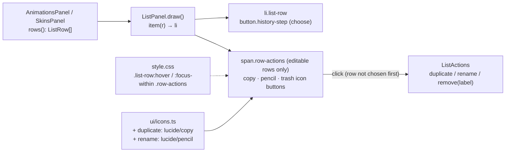

# Row actions: Duplicate, Rename and Delete as icons on the hovered row

**Status: done (2026-10-09), not committed.** Built as planned, with two changes: the bar's Duplicate…, Rename… and Delete are removed (the owner's answer to decision 4), and the chosen row now keeps its accent while hovered (the generic `button:hover` rule outranked `[aria-current]`, so the chosen row went grey with dark text; found while checking the look, fixed for these two panels only). `e2e/rowActions.spec.ts` covers both panels.

The owner asked for the Animations panel's rows to show three icon buttons, Duplicate, Rename and
Delete, at the right end of a row while the pointer is over it. Today they are only words in the
bar above the list, acting on the chosen row. The rows come from `ListPanel`
(`src/ui/panels/listPanel.ts`), which the Skins panel shares, so both panels get the icons.

## Decisions

| # | Question | Choice |
|---|---|---|
| 1 | Which rows? | Rows with `editable` only: not the setup pose, not the default skin. Folder rows get none. |
| 2 | What does a click act on? | That row, by its full label (the folder path included), whether or not it is the chosen one; the same `ListActions` as the bar, so the prompts, undo steps and messages are unchanged. |
| 3 | When are they shown? | On hover of the row, and while a row button has keyboard focus (`:focus-within`), so they are reachable without a mouse. Hidden otherwise; they take no width. |
| 4 | The bar's Duplicate…, Rename…, Delete | **Removed** (owner, 2026-10-09): the bar keeps New… and Nest by /. |
| 5 | Icons | Lucide `copy` and `pencil` vendored from the pinned commit, `trash` already there. MANIFEST.md and `tests/icons.test.ts` list them. |

## Steps

1. Vendor `copy.svg`, `pencil.svg`; `icons.ts` names `duplicate`, `rename`; MANIFEST rows.
2. `listPanel.ts`: each editable row's `li` holds the row button and a `.row-actions` span of
   three `iconButton(…, false)` buttons with titles; a click stops there.
3. `style.css`: the `li` positions the span at the right; shown on hover or focus within; on the
   chosen row the icons take its accent text colour.
4. e2e: hovering a row shows three buttons; Rename, Duplicate and Delete through a row's icons act
   on that row, not the chosen one; the setup pose and the default skin have none; the bar holds
   only New…; the chosen row keeps its accent while hovered.
5. SPEC's panels paragraph says so.
