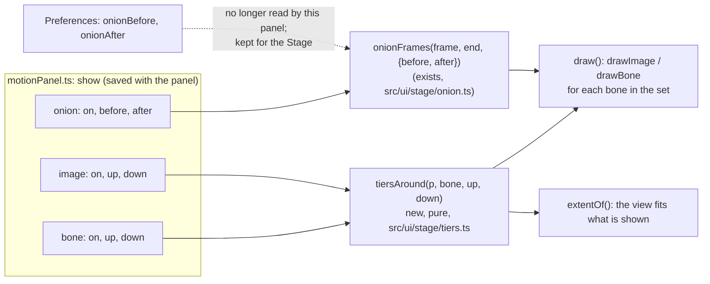

# Show steppers: how many tiers of bones and images, how many onion frames

**Status: done (2026-10-08).** Built as planned: `src/ui/stage/tiers.ts` (`tests/tiers.test.ts`), the steppers in the Show group, Parent and Children removed, saved panels converted (Parent bone/image become all tiers above, Children all below; the shown count is held to what the bone has), Onion's counts in the panel. e2e in `e2e/motionPanel.spec.ts`. Changed from the plan: the old parent-bone extent block is gone (the view fits the tiers shown), and `parentTree` became `shownTiers` (test getter).

The Motion Path panel's Show group has one toggle for each thing (Image, Bone, Length, Onion, Children) and a second group, Parent, with a Bone and an Image toggle. They say *whether*, never *how much*: Parent draws the whole chain, Children draws the whole subtree, Onion takes its two counts from Preferences. This plan gives Bone, Image and Onion a number on each side, so the picture shows exactly the tiers or frames asked for, and removes the Parent group and the Children toggle.



## What the owner asked for

Under Show, each of these three reads as a row of controls with the layer's own button in the middle:

```
[ 2 ] [ < ]  [ Bone  ]  [ > ] [ 1 ]      upper tiers  ·  the bone  ·  lower (child) tiers
[ 2 ] [ < ]  [ Image ]  [ > ] [ 1 ]      the same, for the images
[ 3 ] [ < ]  [ Onion ]  [ > ] [ 3 ]      frames before  ·  onion skin  ·  frames after
```

## Decisions (my reading; each one is yours to change)

| # | Question | Recommendation |
|---|---|---|
| 1 | What does a tier mean? | Tier 1 up is the bone's parent, 2 up its grandparent, and so on to the root. Tier 1 down is the bone's children, 2 down their children. Only the tiers asked for are drawn, with the bone itself always in the middle. A bone with several children shows all of them at that tier. |
| 2 | What do `<` and `>` do? | `<` shows **one more** tier up, `>` one more tier down. The number beside each is the current count; **clicking the number takes one away** (it is the "less" control, tooltip says so), and a count of 0 shows none. The counts stop at the root and at the deepest descendant. For Onion the same: `<` one more frame before, `>` one more after, the number takes one away. |
| 3 | Is the middle button still an on/off toggle? | Yes: Bone, Image, Onion keep their on/off, so a row can be switched off without losing its counts. Counts are kept per panel, as the toggles are. |
| 4 | Do Bone and Image have separate counts? | Yes. "Bones two tiers up, images only the parent" is a real wish (a hip-to-foot chain with only the leg's skin showing). |
| 5 | What replaces **Parent** and **Children**? | They go. Parent bone / Parent image become Bone / Image with up > 0; Children becomes down > 0. The Parent label goes with the group, and the header gets shorter. |
| 6 | Defaults and old saved panels | New default: Bone and Image on, up 0, down 0 (just the selected bone), Onion off with 2 and 2. A saved panel with `parentBone` or `parentImage` on becomes up = the chain length to the path's parent bone; `children` on becomes down = the deepest tier. Nothing is lost on first load. |
| 7 | Onion's counts and Preferences | The panel's own counts are the ones used here. Preferences ▸ Behavior keeps before/after for the Stage's onion skin (they are the same words, a different panel); keyed only and colour stay in Preferences for both. |
| 8 | Where does the path's parent bone fit? | The path is still stored in its parent bone's space and the picture still draws in it. The tiers are counted from the **selected bone**, not from the path's parent; the parent bone is drawn whenever up reaches it. The view fits what is shown, as it does now. |

## Steps

1. `src/ui/stage/tiers.ts` (pure, no DOM): `tiersAround(rig, bone, up, down): { up: number[][]; down: number[][]; maxUp: number; maxDown: number }`, replacing `chainTo` and `withChildren` in `motionPanel.ts`. Table tests in `tests/tiers.test.ts`: a chain, a branch, the root, a leaf, counts past the ends.
2. State: `show.bone` / `show.image` become `{ on, up, down }`, `show.onion` `{ on, before, after }`; the saved-layers key reads the old booleans (decision 6). Test: an old saved panel opens as the plan says.
3. Header: a stepper component (`< n` and `n >` around a layer button) in the Show group; the Parent group and the Children toggle are removed; `motionPanel.ts` and `style.css`. The Spine-style look stays: the group label, the segmented look, the accent when on.
4. Drawing and `extentOf` take the sets from `tiersAround`; the faint parent drawing stays for tiers above, children keep their look.
5. Onion reads the panel's `before` / `after`; `onion()` in the app keeps supplying keyed-only and colour.
6. e2e: Bone with up 2 down 1 on the stickman (`parentTree` getter style: the bones drawn are the expected names), the number takes one away, counts stop at the ends, Onion counts change the ghosts drawn, the counts survive a reload.
7. SPEC section on the Motion Path panel and the shortcuts/panel info text brought up to date; one commit when the suites are green.

## Not changing

Path, Spline and the handle toggles, the node strip, the speed graph, Preview, and the Stage's own onion skin and bone display.
