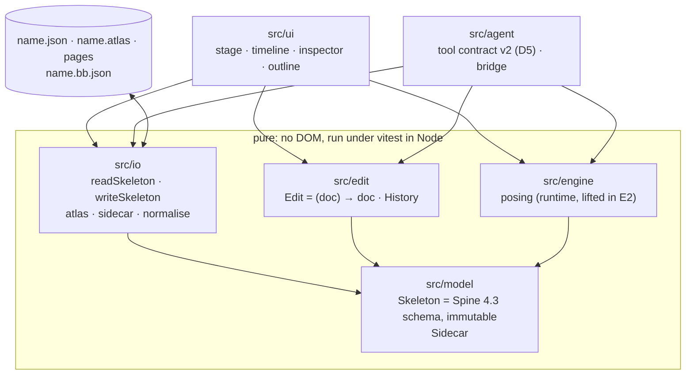

# BoneBurst Editor — architecture spec

**Status:** E0, 2026-10-06. Written before any implementation, from the v2 plan
(`../Animation-BoneBurst-Src/docs/EDITOR-V2-PLAN.md`, decisions D1–D5), the BoneBurst format
specs (`../Packages/com.module.ta-creator-boneburst/Doc/Format/`, ours) and Spine 4.3's public
JSON format. Not from the Animo-fork editor's code or its architecture document (CLAUDE.md ▸
Clean room).

The editor opens a Spine 4.3 skeleton JSON, edits it, and saves Spine 4.3 JSON. The file **is**
the document (D4): there is no project format. What has no place in Spine's schema and does not
change what the JSON means — view state, guides, reference images, AI notes — goes into a sidecar
next to the file.



## 1. Layers and the one dependency rule

| Folder | Holds | May import |
|---|---|---|
| `src/model` | the document's types and pure queries over them | nothing of ours |
| `src/io` | Spine JSON and atlas reading and writing; the sidecar; round-trip normalisation | `model` |
| `src/edit` | edits (pure functions document → document) and the history | `model` |
| `src/engine` | posing a document at a time: bones, constraints, physics, meshes | `model` |
| `src/ui` | everything with a DOM | anything above |
| `src/agent` | the AI tools and their bridge | `model`, `io`, `edit`, `engine` |

`model`, `io`, `edit` and `engine` touch no DOM, so all of them run in vitest under Node. The
check script enforces the import direction once there is code to enforce it on (E1).

## 2. Document

- **`Skeleton`** is Spine 4.3's JSON structure as typed data: header, bones, slots, constraints,
  skins and attachments, events, animations and their timelines, with the keys, defaults and
  units of `Format-Json-Atlas.md` §3–11. Names are the identities, as in the file: a bone is
  referred to by its name, so renaming is an edit that rewrites every reference.
- **Immutable.** Every object is readonly; an edit returns a new skeleton that shares whatever it
  did not change. Under vitest every edit's result is deep-frozen, so a mutation fails loudly.
- **Lossless for what it does not model.** Each object keeps the keys it does not know in a side
  field, written back in place, so a file with keys this editor ignores round-trips.
- **Time is Spine's: seconds.** The timeline shows frames at `skeleton.fps` (nonessential;
  default 30), and a key's time is the float32 value Spine writes for that frame.
- **The BoneBurst profile holds.** A document is always a file
  `BoneBurst-Profile.md` §1 accepts; an edit that would break a rule there is refused, not
  written and reported later.

## 3. Sidecar `<name>.bb.json`

```json
{ "format": "boneburst-sidecar", "version": 1, "view": {}, "guides": [], "references": [], "notes": [] }
```

Versioned from its first field. It never changes what the skeleton means: deleting it loses only
view state, guides, reference images and notes. A sidecar whose `format` or `version` is
unknown is ignored with a warning, never guessed at.

## 4. Editing and history

- An **edit** is a pure function from document to document with a label ("Move bone hip").
- The **history** keeps the documents themselves: undo returns the previous document object,
  so an undo can never disagree with the edit it undoes. Structural sharing keeps this cheap.
- A **gesture** (one drag, one scrub of a field) opens a group; every step inside it replaces
  the group's last document, so the gesture is one undo step whatever the pointer did.
- Selection, the playhead and view state are not in the document and are not undone.

## 5. Reading and writing

- `readSkeleton(text)` returns the skeleton and the profile's issues; `writeSkeleton(skeleton)`
  returns text with the key order and defaults omitted as `Format-Json-Atlas.md` describes.
- The atlas is read and written as text (`Format-Json-Atlas.md` atlas sections); pages are
  images next to it.
- **Round-trip test:** every sample skeleton the format specs' tests use, read then written,
  equals the original after normalisation: numbers compared as float32, `nonessential` fields as
  the file has them, key order per the spec.

## 6. Engine

Posing is the BoneBurst runtime, lifted from `Animation-BoneBurst-Src/src/core/boneburst/runtime/`
in E2 after the plan's provenance pass (its two easing helpers move in first). Until then
`src/engine` is empty. The stage and the preview pose with the same engine: there is one posing
path, so the stage cannot disagree with the preview.

## 7. Interface (E2–E4)

One window: the **stage** (canvas, the setup pose or the pose at the playhead, gizmos), the
**timeline** (one row per bone, slot and constraint with keys; frames at `skeleton.fps`), the
**inspector** (the selection's fields), the **outline** (the skeleton's tree: bones, slots,
attachments, constraints, skins). Docking and themes are not planned until E4's flows run.

## 8. AI tools (E5)

The tool contract gets a new version (D5): names stay where their meaning holds, `layer`
arguments become slot names, and tools for features Spine has no home for are dropped or renamed
in the version note. Every edit a tool makes is one history step labelled "AI: …".

## 9. Verification

- `scripts/check.sh`: typecheck and build, the tests (zero tests is a failure), no Spine runtime
  package imported from `src/`, none shipped in `dist/`, and the clean-room tripwire.
- `@esotericsoftware/spine-core` may be a **dev** dependency later, as a test oracle only.
- Fixtures: `../Packages/com.module.ta-creator-boneburst/Tests/Editor/Data~/samples/`.

## 10. Plan

E0 this charter · E1 model and IO, headless · E2 stage · E3 timeline and playback ·
E4 authoring surfaces · E5 AI tools · E6 parity with the old editor and cutover
(`EDITOR-V2-PLAN.md` ▸ Phases).
