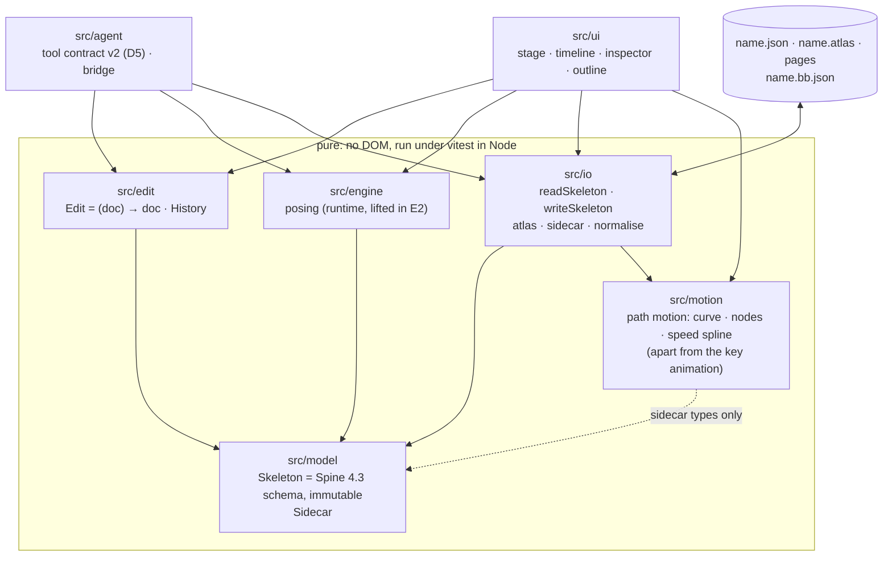
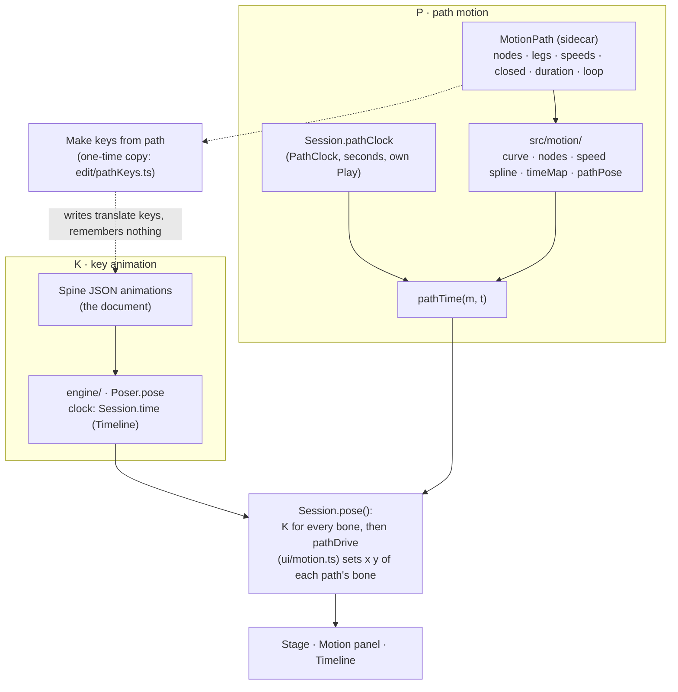

# BoneBurst Editor — architecture spec

**Status:** E3 done, E4 started, 2026-10-06 (E1: model and IO; E2: engine and stage; E3: timeline and playback; E4 step 1: the Dockview shell). Written before any implementation, from the v2 plan
(`EDITOR-V2-PLAN.md`, decisions D1–D8), the BoneBurst format
specs (`../Packages/com.module.ta-creator-boneburst/Doc/Format/`, ours) and Spine 4.3's public
JSON format. Not from the Animo-fork editor's code or its architecture document (CLAUDE.md ▸
Clean room).

The editor opens a Spine 4.3 skeleton JSON, edits it, and saves Spine 4.3 JSON. The file **is**
the document (D4): there is no project format. What has no place in Spine's schema and does not
change what the JSON means — view state, guides, reference images, AI notes — goes into a sidecar
next to the file.



## 1. Layers and the one dependency rule

| Folder | Holds | May import |
|---|---|---|
| `src/model` | the document's types and pure queries over them | nothing of ours |
| `src/io` | Spine JSON and atlas reading and writing; the sidecar; round-trip normalisation | `model` |
| `src/edit` | edits (pure functions document → document) and the history | `model` |
| `src/engine` | posing a document at a time: bones, constraints, physics, meshes; reads plain Spine JSON | `model` |
| `src/motion` | the path motion, the second system beside the key animation (docs/TWO-SYSTEMS-PLAN.md): the curve, the nodes and the speed spline, numbers in and out | `model/sidecar` (types) and `model/refused` only; not `edit`, not `engine`; `edit` and `engine` never import it |
| `src/ui` | everything with a DOM | anything above |
| `src/agent` | the AI tools and their bridge | `model`, `io`, `edit`, `engine` |

`model`, `io`, `edit`, `engine` and `motion` touch no DOM, so all of them run in vitest under Node. The
check script enforces the import direction once there is code to enforce it on (E1).

## 2. Document

- **`Skeleton`** is Spine 4.3's JSON structure as typed data: header, bones, slots, constraints,
  skins and attachments, events, animations and their timelines, with the keys, defaults and
  units of `Format-Json-Atlas.md` §3–11. Names are the identities, as in the file: a bone is
  referred to by its name, so renaming is an edit that rewrites every reference.
- **Immutable.** Every object is readonly; an edit returns a new skeleton that shares whatever it
  did not change. Under vitest every edit's result is deep-frozen, so a mutation fails loudly.
- **Lossless for what it does not model.** Each object keeps the keys it does not know in a side
  field, written back in place, so a file with keys this editor ignores round-trips.
- **Time is Spine's: seconds.** The timeline shows frames at `skeleton.fps` (nonessential;
  default 30), and a key's time is the float32 value Spine writes for that frame (the shortest
  decimal that reads back as it: `model/timelines.frameTime`). Keys within 1e-5 s are one key:
  exports may store a frame a float32 step off. The playhead poses at a frame's float32 time.
- **The BoneBurst profile holds.** A document is always a file
  `BoneBurst-Profile.md` §1 accepts; an edit that would break a rule there is refused, not
  written and reported later.

## 3. Sidecar `<name>.bb.json`

```json
{ "format": "boneburst-sidecar", "version": 1, "view": {}, "guides": [], "references": [], "notes": [] }
```

Versioned from its first field. It never changes what the skeleton means: deleting it loses only
view state, guides, reference images and notes. A sidecar whose `format` or `version` is
unknown is ignored with a warning, never guessed at.

The app (E4 step 8) opens the sidecar named after the skeleton with it, puts back the view it
keeps (camera, skin, animation), and saves it beside the skeleton when it holds guides,
references or notes or was opened, and its text changed. Guides are dragged out of the stage's
rulers. Reference images (step 9) draw behind the skeleton; their pictures are the image files
opened with the skeleton, or dropped on it later, matched by file name. The chosen one (its
row in the Reference panel, or a double-click on its picture) is dragged on the stage to move it
and by a corner to size it (step 13); only the chosen one takes presses, so the stage still pans
over the others. Sidecar changes are not undo steps.

A bone's **path** (`motion` in the sidecar, `MotionPath`) is the path system's data (§6a): nodes with their handles and speeds, `closed`, `duration` in seconds, `loop`, and the `animation` and `bone` it belongs to. It is plain numbers. The sidecar itself is not exported to Unity; the TwinSpline export (docs/UNITY-EXPORT-PLAN.md) writes the paths in a file of their own, `name.twinspline.json` (`edit/exportTwin.ts`: `{ "twinspline": 1, "animations": { animation: { bone: { parent?, duration, loop, closed, nodes } } } }`, seconds; the nodes are the sidecar's without the editor's `id`).

## 4. Editing and history

- An **edit** is a pure function from document to document with a label ("Move bone hip").
- The **history** keeps the documents themselves: undo returns the previous document object,
  so an undo can never disagree with the edit it undoes. Structural sharing keeps this cheap.
- A **gesture** (one drag, one scrub of a field) opens a group; every step inside it replaces
  the group's last document, so the gesture is one undo step whatever the pointer did. It records
  nothing only when it ends on the identical document it started from.
- Selection, the playhead and view state are not in the document and are not undone.
- **Every step is reachable (E7)**: `History.entries` lists the steps (the done ones, then those a
  redo brings back, and how many the undo limit let go); `goTo(n)` undoes or redoes one step at a
  time to `n`, so whatever follows the document (a re-import's atlas) sees each step. The History
  panel is that list.
- **What an edit refuses (E7, the fuzz)**: a number a file cannot hold (NaN, ±Infinity:
  `edit/finite.refuseNonFinite`); a bone that cannot hold vertices (its world matrix has no
  inverse: inactive in the skin shown, or scaled to zero) for binding, weighting or a vertex edit,
  saying which skin to show. Weighted vertices name bones by index, so every change to the bone
  order (`addBone`, `reparentBone`, `deleteBone`) goes through `withBoneOrder`, which remaps them by
  name and refuses deleting a bone a weighted attachment still uses.

## 5. Reading and writing

- `readSkeleton(text)` returns the skeleton and the profile's issues; `writeSkeleton(skeleton)`
  returns text with the key order and defaults omitted as `Format-Json-Atlas.md` describes.
- The atlas is read and written as text (`Format-Json-Atlas.md` §15): pages, regions and fields
  as written, every value kept; meanings through queries (`regionBounds`, `regionDegrees`). Pages
  are images next to it.
- JSON is read by our own parser: objects keep every key's place, integer-like keys included
  (`JSON.parse` moves those first, and Spine reads names in document order). It refuses nesting
  deeper than 1,000 and numbers out of range (`1e400` would open as Infinity and never save).
- **Opening says what is wrong (E7, hostile files)**: a file opens with its issues listed, or is
  refused with a reason, never with a crash. The profile (`model/profile.ts`) holds a file to what
  BoneBurst's C# reader requires, including geometry (uvs in pairs, triangles in threes within the
  vertices, weights by real bones), curve lengths, draw-order offsets (in slot order, within the
  slots, no slot twice, no two to one place) and hex colours; `engine/atlasCheck.missingRegions`
  names attachments whose regions the atlas lacks. A page image the browser cannot decode opens
  without that page, said.
- **The notes are live (E8)**: what reading the files said stays as `Session.issues`; everything
  about the document as it is now is `Session.notes()` (`ui/notes.ts`): the profile, the regions the
  atlas lacks, what the engine skips, and the bones the pose shown leaves without one, worked out
  again after every change, each with the thing it is about (a click selects it).
- **Export to Unity (docs/UNITY-EXPORT-PLAN.md)**: the file Unity gets is made from `closedDoc()` (the closing frames of looping
  animations) and is never the document itself; the document, Save and the sidecar are untouched by an export. Two modes. **Keys**
  (the default; File ▸ Export Spine JSON…, Export to Unity…, the AI's `export_to_unity`): `ui/exportPaths.ts` `exportDoc` replaces the
  translate timelines of each bone that uses a path (`active` not false) with keys made from it over the animation's length
  (`ui/pathKeysOver.ts`, exact seconds, a Bézier fit per stretch, the same maths as the Stage's driven pose through `pathLocal`); a
  document with nothing to bake exports as the same object, byte for byte as the document writes. The status line and the AI's `report`
  say what was baked and warn per looping path whose runs do not fill the animation. **TwinSpline** (File ▸ Export TwinSpline JSON…,
  Export to Unity as TwinSpline…, `mode: "twinspline"`): `edit/exportTwin.ts` writes `name.twinspline.json` (version 1, §3) for every
  bone with a path or convertible translate keys (a conversion that strays over 0.5 units stays as keys and is listed) and removes
  those bones' translate timelines from the skeleton copy, which stays plain Spine. Unity plays the keys mode today; nothing in
  Unity reads the TwinSpline file yet. The `.bbdata` project copy is the document as it is, not an export.
- **Round-trip test:** every sample skeleton the format specs' tests use, read then written,
  equals the original after normalisation: numbers compared as float32, `nonessential` fields as
  the file has them, key order per the spec.

## 6. Engine

Posing is the BoneBurst runtime, lifted in E2 from `Animation-BoneBurst-Src/src/core/boneburst/runtime/` (the old editor, archived at the tag `old-editor-final`)
after the plan's provenance pass. The stage and the preview pose with the same engine: there is
one posing path, so the stage cannot disagree with the preview.

- **Input is plain JSON.** `io/json.plainJson(skeletonToJson(doc))` gives the engine what
  `JSON.parse` would; `engine/rigData.readRig` builds its `RigData` from that and the atlas's
  regions (`engine/regions.atlasImages` over the model's atlas: one atlas reader, `io/atlas`).
- **`Rig`** holds one posed instance: `setupPose`, `apply(animation, time)`, `updateWorld`;
  `drawList` says what to draw, in order, with clipping. `Track` plays and crossfades (E3).
- **What it skips, it names (E8)**: `RigData.skipped`, each `{ message, subject }` (the
  constraint, attachment or animation, and what it lacks), where it said a category before. A path
  with no whole curve (fewer than 6 vertices open, 3 closed, or not three a point) is left alone.
  Bones a degenerate rig poses to NaN are not drawn or picked on the stage, and named.
- **Broken data is posed, not thrown (E7)**: lists skip entries that are not objects, number lists
  take numbers only (`rigJson.list`, `nums`), a malformed weighted stream or triangle list draws
  nothing, and a draw-order key keeps a slot's first move. Valid files pose exactly as before
  (`scripts/unity-parity.ts`).
- **Held to spine-core 4.3.13** by `tests/engineOracle.test.ts`: every sample and the stickman,
  every skin, setup pose and each animation at six times, bone matrices and drawn vertices
  within 1e-4 relative (worst 6.6e-5). Physics is posed off there (`Physics.none`).

### Provenance (E2, 2026-10-06)

Checked file by file before the lift: authorship and dates from git, imports, any Animo-side name
or line, and comments pointing at the old editor.

- **Animo: clean.** Every file was created in the runtime's own commits ("Our own Spine runtime",
  P0–P5, 2026-10-05; `bones.ts` in P5), as new files, not copied or renamed from the fork's code.
  The repository's history has one author throughout. No Animo-side names (layers, symbols,
  tweens, documents) appear. The runtime imported two things from outside its folder: the
  bezier helpers (written in our Phase 4, 2026-09-30, in the Animo-era `core/math/easing.ts`)
  and `BoneBurstInherit` (our Phase 1 contract). Both moved into the runtime in v1 first
  (`runtime/bezier.ts`, `runtime/rigTypes.ts`), so the folder stood alone when lifted.
- **spine-core: carried, not cleared.** The runtime's own plan records that its author (Claude)
  knows spine-core's algorithms from training, worked from the format with spine-core as a
  black-box oracle without opening its source, and that the inherit modes and solvers follow
  spine-core's structure closely (`ik.ts`, `transform.ts`, `path.ts`, `physics.ts` say so in
  their headers). Its plan asks for legal review, with a human clean-room rewrite of the solvers
  from a written spec as the fallback. That stands for v2 as it did for v1.

| v2 file | From (`runtime/`) | Change in the lift |
|---|---|---|
| `bezier.ts` | `bezier.ts` | comments only |
| `bones.ts` | `bones.ts` | `LooseBones` left out (the old editor's own pose used it) |
| `ik.ts`, `transform.ts`, `path.ts`, `physics.ts`, `slider.ts` | same names | comments only |
| `track.ts`, `rig.ts`, `draw.ts` | same names | comments only |
| `rigData.ts`, `rigAnimation.ts`, `rigAttachments.ts`, `rigJson.ts`, `rigTypes.ts` | same names | comments; atlas types from `regions.ts` |
| `regions.ts` | — (replaces `atlasRead.ts`) | new: the regions from the model's atlas |

## 6a. Two systems: key animation and path motion

A bone's motion has two sources that never read each other (docs/TWO-SYSTEMS-PLAN.md, decisions Q1 to Q5 of 2026-10-08, D9 in `EDITOR-V2-PLAN.md`).



| | K · key animation | P · path motion |
|---|---|---|
| Data | `animations` in the document | `Sidecar.motion`, one `MotionPath` per bone and animation |
| Pure code | `engine/`, `edit/keys*` | `src/motion/` (imports the sidecar types and `EditRefused` only) |
| Clock | `Session.time`, the Timeline's Play | `Session.pathClock`, Play, Pause, Stop and Loop in the Motion panel; in seconds |
| Together | — | **Both** in the Motion panel starts the two clocks with one button (UI, not a data bridge) |

- **One driver per bone, chosen by the person.** A bone's translation comes from its keys or from its path, never both: the path's `active` flag (absent = the path) says which, and the Motion Path panel's tabs set it. The path drives only x and y; the rest of the pose is the keys'. Both datasets are kept; the one not in use is left untouched (the Timeline draws the keys dim while the path is in use).
- **No bridge.** There is no bake, no signature, no stale state. Each ⋮ menu has a one-time copy (*Create new Key frame from TwinSpline*, *Create new TwinSpline from Key frame*), one undo step; neither follows the other afterwards, and each can be deleted on its own.
- **To Unity.** The sidecar is not exported as it is. An export either bakes the used path into translate keys (the default) or writes the paths in `name.twinspline.json` (§5); neither changes the document.
- **Guards.** `scripts/check.sh` (`layer motion`, no DOM) and `tests/motionLayer.test.ts`: `src/motion/` imports no rig, document, edit layer or interface, and `edit`, `engine`, `model` never import it.
- **Limits.** A path's reference bone is read from the key pose; the picture's Path layer for a silenced bone is the keys' trail; a key made on a silenced bone is not warned about.

## 7. Interface (E2–E4)

E2 (`src/ui/`): the stage draws the setup pose through the engine (`stage/posed.ts`, re-posed
on every document revision), images with WebGL2 and bones and the gizmo on a 2D canvas over it.
The gizmo's maths is DOM-free (`stage/gizmo.ts`, `stage/camera.ts`); a drag is one gesture and
writes local setup values through `updateBone`, an untouched axis left as the file had it.

E3 (`src/ui/timeline/`, `src/edit/keys.ts`): with an animation chosen the stage and the
inspector key at the playhead (key values as offsets and factors of the setup pose, §11.4); the
timeline moves, deletes and eases keys, a bezier's handles following its interval's ends
(`edit/curves.ts`); playback poses through the same engine.

One window: the **stage** (canvas, the setup pose or the pose at the playhead, gizmos), the
**timeline** (one row per bone, slot and constraint with keys; frames at `skeleton.fps`), the
**inspector** (the selection's fields), the **outline** (the skeleton's tree: bones, slots,
attachments, constraints, skins).

**Rig authoring (E4 step 2):** the selection is typed (a bone, a slot, or an attachment by
skin, slot and key; `ui/session.Selection`). The rig panel builds the structure through
`edit/bones`, `edit/slots` and `edit/attachments`; every structural edit keeps references whole
(renames rewrite them, deletes cascade or are refused with the reason) and keeps draw order keys
meaning what they meant (`edit/drawOrder`). An atlas opened alone starts a new skeleton. Skins (step 3) are authored in the rig panel's Skins view; per-skin deform
timelines and linked-mesh skin references follow every skin edit (`edit/skins`). Constraints
(step 4) are authored in the Constraints view, listed in the order they apply; renames and
deletes follow the name into skins' lists and animations' timelines, references are checked
when written, and a new constraint leaves the pose as it was (`edit/constraints`,
`ui/panels/newConstraint`). Meshes (step 5): a region converts to a mesh that draws the same;
with a mesh selected on the setup pose the stage edits its vertices (`ui/stage/meshMode`,
`edit/mesh`, triangulated by `edit/triangulate`), and deform keys keep meaning what they meant.
The stage draws each active constraint (step 12: IK links and targets, transform links, path
curves, physics and slider marks; `ui/stage/constraintShapes`) and a press on one selects it.
In Animate mode (step 11) a constraint's animatable values key at the playhead
(`edit/constraintKeys`) and a dragged mesh vertex keys a deform (`edit/deformKeys`).
Weights (step 6): meshes bind to bones by distance and are reweighted on the setup pose
(`edit/weights`, `edit/meshLayout`), whose bone matrices the session gives the edits as data. A
Photoshop file (step 7) opens as a new rig: `io/psd` reads its layers with `ag-psd` (D7),
`io/pack` packs them into atlas pages, `edit/layerRig` makes a slot and region per layer, and
the first save writes the atlas and pages beside the skeleton (`ui/psdImport`). Dropped on the
open rig (step 14), the PSD is re-imported (`ui/psdReimport`, pure): layers match atlas regions by
the import's names; regions take the new pixels, place and size; meshes keep their geometry and
weights and take the new pixels cut to their picture; new layers become slots; the rest is kept.
The atlas is packed again and follows the re-import's undo step. Page PNGs are decoded and
encoded by `io/png` (exact; no canvas), for re-imports and every save of pages.

**Docking (D6, E4):** the window is the toolbar and status line around a Dockview dock
(`dockview-core`; with `ag-psd`, D7, the npm runtime dependencies). Every panel is a Dockview panel, under an id
reserved in `ui/workspace/panelIds.ts` (stage, timeline, rigTree, properties; preview,
reference, ai when built); default places live in `ui/workspace/layout.ts`. Dockview does the
splitting, tabbing, floating and popout windows; panels size from its `layout(width, height)`
and use their own window (a popout's), not the main one. The layout is kept in the browser's
storage (view-only state of the app); a saved layout naming a panel the build lacks defers it.
The dock's themes are Dockview's dark and light, coloured through `--dv-*` variables (the person's own themes, below, pick one of the two as their base); text is Inter and
numbers JetBrains Mono, vendored woff2 files, so every machine renders the same text.

**Icons (E4 step 13a)** are vendored SVG files, never an npm package: Lucide (ISC) for the
general ones and the domain glyphs it has, and a subset of Godot's editor icons (MIT), redrawn as
one-path `currentColor` outlines, for those it lacks (constraint kinds, mesh, bounding box, key
kinds, curves). `ui/icons.ts` names them; an icon is a span masked by its file, so it takes the
text's colour in either theme. Each set's `MANIFEST.md` names its pinned commit and every file's
origin; `tests/icons.test.ts` guards files, manifests, styling and licences.

**Keys and the History (E7)**: every keyboard shortcut is a row of `ui/shortcuts.ts` (its keys,
group, what it does and how a key event matches); `app.ts` dispatches from it into handlers typed
by its ids, and the menus, titles and messages show its keys. Help ▸ Keyboard Shortcuts (or `?`)
lists it. The History panel lists the undo steps; a click goes there. The status line's notes (E8)
are buttons: a note about a thing selects it; Properties says so for a selected bone without a pose.

**Running it (E7)**: `npm start` (`scripts/start.mjs`) builds `dist/` when stale and serves it on
the dev server's origin (localhost:5185), starting the AI bridge when none answers. Dockview loads
from its ES module, its styles taken from its package at build time (`vite.config.ts` ▸
`dockviewStyles`); the PSD reader and the AI layer load on first use; no chunk is over 500 kB.

**Preferences (E4 step 10)** are the person's, not the document's: theme, rulers, bones, undo
steps, new references' opacity, kept in the browser's storage (`boneburst.preferences`,
versioned, unreadable values taken as the defaults) like the dock layout (`ui/preferences`).

**Themes (2026-10-08).** The title bar of the Preferences dialog picks the theme in use: Follow the
system, the built-in Light and Dark, or the person's own (a ⋮ menu makes a copy, renames, deletes
and sets the scheme it is based on). A theme owns the appearance preferences (`APPEARANCE_KEYS` in
`ui/preferences.ts`: colours, sizes, interface scale, the tree's look); the behaviour preferences
(undo steps, snapping, autosave…) are the same in every theme. Storage is version 2 (`themes`,
`theme`, the behaviour values beside them); a version 1 file is read once into the built-in theme it
named. `Preferences.values` stays the flat set in force (`resolveSettings`), so nothing outside the
dialog knows about themes; `Preferences.scheme` is what the page's `data-theme` takes. When the system's scheme changes (while following it, or the app's, for a browser pane) the page's colours follow by CSS at once, and `app.ts` then applies every preference again, so canvases and the colours worked out from the theme (the rulers') are made from the new ones: before, they kept the old colours until something else redrew them.

**The Properties panel** has a tab strip under its header: Properties (the selection's fields, or
the skeleton's when nothing is selected) and Snapping (the snapping settings, `ui/snapFields`).
**The outline** draws a thin guide line per level of the tree under each parent's fold arrow, in
the colour set under Tree (`treeGuideColour`).

**The Motion Path panel** (`ui/panels/motionPanel.ts`) is the path system's editor (§6a), for the
selected bone and the animation shown, in two tabs (docs/MOTION-MODES-PLAN.md): **Key frame** (the
bone's keyed motion, a Spine import's included; its ⋮ makes a TwinSpline from the keys, or deletes them)
and **TwinSpline** (the path editor below; its ⋮ makes keys from the path, or deletes it). Both are
kept; pressing a tab chooses which one the bone uses (`MotionPath.active`). Under the TwinSpline tab, from the top: the header (the two tabs, with the Path and Spline layer
toggles as icons beside them, then what else the picture shows, the parent bone and handles
toggles, the Stage line); the path bar (the parent bone the path is relative to, − Node, Duration
and Closed and Loop; making a path or a node, making key frames from the path and deleting it are in
the tab's ⋮ menu); the view bar (zoom − and +, the zoom, the path's Play / Pause, Both, Stop and clock, Fit); the
picture (the ring spline with its nodes and legs, the bone and its image at the path's own time,
the path's frame dots; wheel zooms, the middle button pans); the node strip (a number per node,
dragged to reorder); and under a splitter you drag, the picked node's data (place, speed, both
legs) with the **speed graph**: the speed spline over the path's length, a ruler in the path's own
units with the cap (the path clock), a point and two legs per node, wheel to zoom, a drag on empty
graph to pan, Fit and Node to fit the whole path or the picked node's section, a right-click or
⌘ + click menu (add a node there, delete one, break or mirror its legs) and a green line under it
that sets the graph's height. Edits are history steps (`keepMotion`), like every other sidecar
edit that goes through `History.applyBeside`.

## 8. AI tools (E5)

The tool contract gets a new version (D5): names stay where their meaning holds, `layer`
arguments become slot names, and tools for features Spine has no home for are dropped or renamed
in the version note. Every edit a tool makes is one history step labelled "AI: …".

**The contract (E5 step 1).** `src/agent/tools.json` is `{ version, tools }`: version 2 from v1's
50 tools, 46 served; its `version.changes` lists each tool dropped, renamed, reshaped or given a new
meaning. v1's file is frozen in `tests/fixtures/tools-v1.json`, and `src/agent/contract.ts`'s
`contractProblems` fails `npm run check` when a change has no line, a line has no change, or one
of the flow's tools (`auto_rig`, `apply_motion`, `check_preview`, `set_keys`, `show`,
`get_pose`) differs from v1 in name or arguments (prose may change). `src/agent` is pure: it
imports the model, io, edit and engine, never the interface.

**Provenance (E5).** Files lifted from the fork are checked as in E2 before they are opened:
git authorship and history, then imports, Animo-side names and comments. `tools.json`: created in
our "Phase 9: an AI can animate the open rig" (2026-10-01), changed only in our commits after;
data, no Animo name; one phrase ("the symbol's constraints") rewritten. Code that speaks the old
editor's model (the agent API and its modules) is rewritten, not lifted; v1's agent tests are
read for what each tool must do.

**The bridge (E5 step 2).** `mcp/bridge.mjs`, a dependency-free Node process: MCP over stdio for
Claude Code and Claude Desktop, and on 127.0.0.1:5191 the HTTP side the editor tab long-polls
(`/agent/next`, `/agent/result`, `/agent/status`; only the editor's origins), plus Ask AI's
`/chat` with Claude or GLM, whose keys stay in the bridge and its key file. `initialize` gives the
client the contract's version note. The tab's end (`ui/agent/bridge.ts`, the toolbar's AI button,
kept as the `ai` preference) hands each call to `agent/host.ts`: the tool by name, its arguments
checked against its schema (`agent/schema.ts`), then the tool; a refusal (`AgentRefused`) is a
message the model reads. Lifted from v1's `mcp/boneburst-bridge.mjs` after its pass (ours: Phase 9,
10 commits, one author; Node built-ins only): the contract's path, v2's prompts and origins, the
version note in `initialize`, and a settable call timeout changed; the old `AMINO_*` aliases and
key file dropped.

**Reading (E5 step 3).** `agent/read.ts`: `get_rig`, `get_animation`, `get_pose`, `get_reference`,
`show`, `render_frame`, over the context's data and functions (`agent/context.ts`): the atlas's
regions, the view, `show`, `pose` (the stage's `Poser`), the references, `render`. Keys and setup
poses read local and absolute (stored offsets added, scale factors multiplied); eases by the
names `set_keys` takes or a normalised cubic; `seam` and `cycle` from the poses at frame 0 and the
last frame. `ui/agent/context.ts` builds the context from the session; `render_frame` draws with an
offscreen copy of the stage's renderer, framed on the drawn pictures and the bones on them. Two
meaning changes are in the version note: `show` takes one skin (view state, not an undo step) and
`get_reference` returns v2's still references.

**Keying (E5 step 4).** `agent/keys.ts`: `new_animation`, `set_keys`, `delete_keys`,
`key_properties`, `key_ik`, `key_transform`, `key_constraint`, `key_draw_order`, `define_event`,
`key_event`, `set_inherit`. Each call's edits are one History step, "AI: …" (`agent/apply.ts`).
`set_keys` merges keys by bone and frame, takes what a key leaves out from the pose before the
call, and sets each channel's curve after every value is in place (`edit/keys.ts` `setKeyCurve`,
a shape per channel); an ease given to a key still last on its timeline cannot be stored in
Spine's file and the answer says so. Constraint keys take the values in force from the context's
`constraintNow`. New pure edits: `edit/events.ts`; `edit/drawOrder.ts` `drawOrderAt`,
`reorderFront`. Poses for the tools are taken at the float32 time, as the playhead is: keys are
stored as float32, and a frame's float64 time can fall just before the key written at it.

**Building (E5 step 5).** `agent/build.ts`: `add_bones`, `attach`, `add_ik`, `draw_order`,
`auto_rig`, `add_transform_constraint`, `map_transform`, `add_physics`, `add_slider`, `make_path`,
`set_constraint_order`, `set_point`, `add_attachment`. A tool that builds on what it just made runs
as one History gesture, the rig posed between its parts (`agent/apply.ts` `inStep`); bones are
placed from joint and tip under the parent's posed world matrix (`localBone`, exact under scale and
shear); a slot moved onto a bone has its attachments re-expressed so it stays put (`reexpress`).
`auto_rig` plans with `agent/rig/autoRig.ts`, lifted from v1's (ours; SPEC §8 provenance: its two
imports replaced by `agent/rig/views.ts`, its old words changed, its nested draw order left out:
v2's slots keep the PSD's stacking), and settles each IK's bend with the engine (a bent limb as
drawn, a straight one forward for the facing). v1's `rigPlan.ts` spoke the old model and is
rewritten in these tools. A transform constraint is made with Spine 4.3's identity property map
(without one it moves nothing). New edit: `edit/attachments.ts` `addAttachment`.

**Motion (E5 step 6).** `agent/motion.ts`: `list_motions`, `apply_motion`. The library is clip
data: seven hand-made clips (`agent/rig/motions.json`, from `scripts/build-motions.ts`) and five
AnimatedDrawings motion captures (`agent/rig/motions-bvh.json`, from `scripts/build-bvh-motions.ts`
through `agent/rig/bvh.ts` and `bvhClip.ts`; MIT, © Meta, in THIRD-PARTY-NOTICES). `agent/rig/motion.ts`
retargets a clip onto the rig: limbs and torso by world angle, hips, head, hands and feet by
offset, feet held on the ground, two-bone IK chains keyed at their targets. Provenance (§8): all
ours; `bvh.ts`, `bvhClip.ts`, the data and the scripts lifted (the scripts write both data files
again byte for byte); from `motion.ts` the parts that stand alone lifted and the posing rewritten
in Spine's y-up matrices, its answers equal to v1's to 1e-13 on twelve rigs and clips (v1 run as
an oracle; three kept in `tests/fixtures/retarget-v1.json`). An IK chain's bend is the
constraint's own `bendPositive` (v1 read it off the pose, unknown for a limb drawn straight).

**Checking (E5 step 7).** `agent/check.ts`: `check_preview` compares the editor's pose with the
pose of the file as Save writes it (the document written as Spine 4.3 JSON, read back, posed by a
fresh runtime through the context's `poseOf`), frame by frame; above 0.01 pixels the file would
not play as shown. It also reports a loop's seam. v1 compared against a Preview panel's runtime;
in v2 the stage is that runtime (a meaning change in the version note).

**The rest of the contract (E5 step 8).** `agent/looks.ts` (skins and tints), `agent/sequences.ts`
(numbered atlas images as Spine sequences, and their keys), `agent/meshes.ts` (meshes from the
image's opaque outline, `edit/trace.ts`; bound by the editor's Bind; linked meshes),
`agent/unity.ts` with `ui/unityExport.ts` (Export to Unity: a folder picked once with the
browser's folder picker, kept in IndexedDB; the atlas and pages, then the skeleton; an optional `mode`, §5). Every tool of
contract version 2 is built; `tests/agentHost.test.ts` holds the two lists equal.

**Ask AI (E5 step 9).** The `ai` panel (`ui/panels/askAi.ts`) sends the conversation to the
bridge's `/chat` (Claude or GLM with the same tools) and shows it as rows (`ui/agent/chat.ts`
`transcript`); while the model works, the editor's own calls (`AiBridge.onCall`) show as steps.
Sending turns the AI connection on. Keys stay in the bridge. `?bridge=<port>` picks another local
bridge port.

**End to end (E5 step 10).** `e2e/mcpFlow.spec.ts` keeps E5's done-when: an MCP client over the
real bridge drives the editor in a browser through `auto_rig` → `apply_motion` →
`check_preview` on the figure PSD.

## 9. Verification

- `scripts/check.sh`: typecheck and build, the tests (zero tests is a failure), no Spine runtime
  package imported from `src/`, none shipped in `dist/`, and the clean-room tripwire.
- `@esotericsoftware/spine-core` may be a **dev** dependency later, as a test oracle only.
- **E7's nets, in `npm run check`**: the build's own browser test (`e2e-build/`); seeded random
  edits on every corpus rig with the document's invariants after each step
  (`tests/fuzzEdits.test.ts`, `FUZZ_SEED`/`FUZZ_STEPS` for longer runs); hostile files, hand-made
  and seeded mutations, judged by what BoneBurst's C# reader refuses (`tests/hostileFiles.test.ts`,
  `HOSTILE_*`); the owner's flow end to end (`e2e/dailyDriver.spec.ts`). By hand, with Unity's
  .NET SDK: `scripts/unity-parity.ts` (the corpus) and `scripts/daily-driver.ts` (the flow's
  export), both through `scripts/oracle/csharp.ts`.
- **The bake (E8)**, by hand with the Unity Editor: `scripts/unity/BakeCheck.cs` (run with the
  `unity` CLI's `run_script`) bakes an export as the popup does, reads the asset back and poses its
  data with BoneBurst's runtime; `scripts/bake-check.ts` compares that with the export (names, and
  every bone at every frame through `comparePoses`).
- Fixtures: `../Packages/com.module.ta-creator-boneburst/Tests/Editor/Data~/samples/`.

## 10. Plan

E0 this charter · E1 model and IO, headless · E2 stage · E3 timeline and playback ·
E4 authoring surfaces · E5 AI tools · E6 parity with the old editor and cutover · E7 the daily
driver (history, shortcuts, `npm start`, robustness) · E8 the truth up to the bake (live notes, the
real bake)
(`EDITOR-V2-PLAN.md` ▸ Phases).
