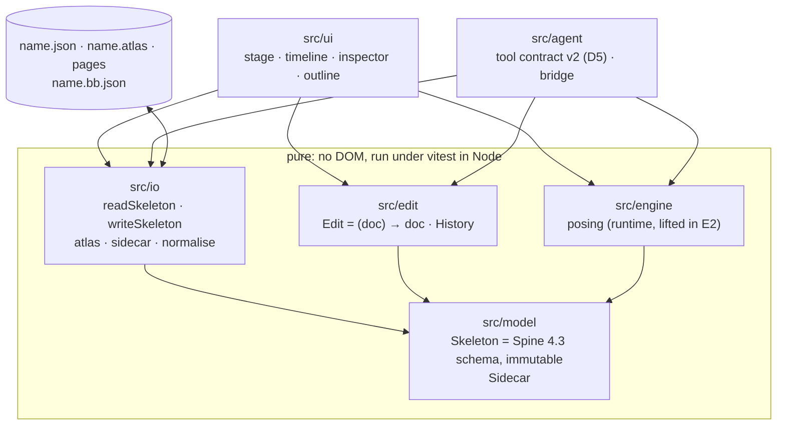

# BoneBurst Editor — architecture spec

**Status:** E3 done, E4 started, 2026-10-06 (E1: model and IO; E2: engine and stage; E3: timeline and playback; E4 step 1: the Dockview shell). Written before any implementation, from the v2 plan
(`../Animation-BoneBurst-Src/docs/EDITOR-V2-PLAN.md`, decisions D1–D5), the BoneBurst format
specs (`../Packages/com.module.ta-creator-boneburst/Doc/Format/`, ours) and Spine 4.3's public
JSON format. Not from the Animo-fork editor's code or its architecture document (CLAUDE.md ▸
Clean room).

The editor opens a Spine 4.3 skeleton JSON, edits it, and saves Spine 4.3 JSON. The file **is**
the document (D4): there is no project format. What has no place in Spine's schema and does not
change what the JSON means — view state, guides, reference images, AI notes — goes into a sidecar
next to the file.



## 1. Layers and the one dependency rule

| Folder | Holds | May import |
|---|---|---|
| `src/model` | the document's types and pure queries over them | nothing of ours |
| `src/io` | Spine JSON and atlas reading and writing; the sidecar; round-trip normalisation | `model` |
| `src/edit` | edits (pure functions document → document) and the history | `model` |
| `src/engine` | posing a document at a time: bones, constraints, physics, meshes; reads plain Spine JSON | `model` |
| `src/ui` | everything with a DOM | anything above |
| `src/agent` | the AI tools and their bridge | `model`, `io`, `edit`, `engine` |

`model`, `io`, `edit` and `engine` touch no DOM, so all of them run in vitest under Node. The
check script enforces the import direction once there is code to enforce it on (E1).

## 2. Document

- **`Skeleton`** is Spine 4.3's JSON structure as typed data: header, bones, slots, constraints,
  skins and attachments, events, animations and their timelines, with the keys, defaults and
  units of `Format-Json-Atlas.md` §3–11. Names are the identities, as in the file: a bone is
  referred to by its name, so renaming is an edit that rewrites every reference.
- **Immutable.** Every object is readonly; an edit returns a new skeleton that shares whatever it
  did not change. Under vitest every edit's result is deep-frozen, so a mutation fails loudly.
- **Lossless for what it does not model.** Each object keeps the keys it does not know in a side
  field, written back in place, so a file with keys this editor ignores round-trips.
- **Time is Spine's: seconds.** The timeline shows frames at `skeleton.fps` (nonessential;
  default 30), and a key's time is the float32 value Spine writes for that frame (the shortest
  decimal that reads back as it: `model/timelines.frameTime`). Keys within 1e-5 s are one key:
  exports may store a frame a float32 step off. The playhead poses at a frame's float32 time.
- **The BoneBurst profile holds.** A document is always a file
  `BoneBurst-Profile.md` §1 accepts; an edit that would break a rule there is refused, not
  written and reported later.

## 3. Sidecar `<name>.bb.json`

```json
{ "format": "boneburst-sidecar", "version": 1, "view": {}, "guides": [], "references": [], "notes": [] }
```

Versioned from its first field. It never changes what the skeleton means: deleting it loses only
view state, guides, reference images and notes. A sidecar whose `format` or `version` is
unknown is ignored with a warning, never guessed at.

The app (E4 step 8) opens the sidecar named after the skeleton with it, puts back the view it
keeps (camera, skin, animation), and saves it beside the skeleton when it holds guides,
references or notes or was opened, and its text changed. Guides are dragged out of the stage's
rulers. Reference images (step 9) draw behind the skeleton; their pictures are the image files
opened with the skeleton, or dropped on it later, matched by file name. Sidecar changes are not
undo steps.

## 4. Editing and history

- An **edit** is a pure function from document to document with a label ("Move bone hip").
- The **history** keeps the documents themselves: undo returns the previous document object,
  so an undo can never disagree with the edit it undoes. Structural sharing keeps this cheap.
- A **gesture** (one drag, one scrub of a field) opens a group; every step inside it replaces
  the group's last document, so the gesture is one undo step whatever the pointer did. It records
  nothing only when it ends on the identical document it started from.
- Selection, the playhead and view state are not in the document and are not undone.

## 5. Reading and writing

- `readSkeleton(text)` returns the skeleton and the profile's issues; `writeSkeleton(skeleton)`
  returns text with the key order and defaults omitted as `Format-Json-Atlas.md` describes.
- The atlas is read and written as text (`Format-Json-Atlas.md` §15): pages, regions and fields
  as written, every value kept; meanings through queries (`regionBounds`, `regionDegrees`). Pages
  are images next to it.
- JSON is read by our own parser: objects keep every key's place, integer-like keys included
  (`JSON.parse` moves those first, and Spine reads names in document order).
- **Round-trip test:** every sample skeleton the format specs' tests use, read then written,
  equals the original after normalisation: numbers compared as float32, `nonessential` fields as
  the file has them, key order per the spec.

## 6. Engine

Posing is the BoneBurst runtime, lifted in E2 from `Animation-BoneBurst-Src/src/core/boneburst/runtime/`
after the plan's provenance pass. The stage and the preview pose with the same engine: there is
one posing path, so the stage cannot disagree with the preview.

- **Input is plain JSON.** `io/json.plainJson(skeletonToJson(doc))` gives the engine what
  `JSON.parse` would; `engine/rigData.readRig` builds its `RigData` from that and the atlas's
  regions (`engine/regions.atlasImages` over the model's atlas: one atlas reader, `io/atlas`).
- **`Rig`** holds one posed instance: `setupPose`, `apply(animation, time)`, `updateWorld`;
  `drawList` says what to draw, in order, with clipping. `Track` plays and crossfades (E3).
- **Held to spine-core 4.3.13** by `tests/engineOracle.test.ts`: every sample and the stickman,
  every skin, setup pose and each animation at six times, bone matrices and drawn vertices
  within 1e-4 relative (worst 6.6e-5). Physics is posed off there (`Physics.none`).

### Provenance (E2, 2026-10-06)

Checked file by file before the lift: authorship and dates from git, imports, any Animo-side name
or line, and comments pointing at the old editor.

- **Animo: clean.** Every file was created in the runtime's own commits ("Our own Spine runtime",
  P0–P5, 2026-10-05; `bones.ts` in P5), as new files, not copied or renamed from the fork's code.
  The repository's history has one author throughout. No Animo-side names (layers, symbols,
  tweens, documents) appear. The runtime imported two things from outside its folder: the
  bezier helpers (written in our Phase 4, 2026-09-30, in the Animo-era `core/math/easing.ts`)
  and `BoneBurstInherit` (our Phase 1 contract). Both moved into the runtime in v1 first
  (`runtime/bezier.ts`, `runtime/rigTypes.ts`), so the folder stood alone when lifted.
- **spine-core: carried, not cleared.** The runtime's own plan records that its author (Claude)
  knows spine-core's algorithms from training, worked from the format with spine-core as a
  black-box oracle without opening its source, and that the inherit modes and solvers follow
  spine-core's structure closely (`ik.ts`, `transform.ts`, `path.ts`, `physics.ts` say so in
  their headers). Its plan asks for legal review, with a human clean-room rewrite of the solvers
  from a written spec as the fallback. That stands for v2 as it did for v1.

| v2 file | From (`runtime/`) | Change in the lift |
|---|---|---|
| `bezier.ts` | `bezier.ts` | comments only |
| `bones.ts` | `bones.ts` | `LooseBones` left out (the old editor's own pose used it) |
| `ik.ts`, `transform.ts`, `path.ts`, `physics.ts`, `slider.ts` | same names | comments only |
| `track.ts`, `rig.ts`, `draw.ts` | same names | comments only |
| `rigData.ts`, `rigAnimation.ts`, `rigAttachments.ts`, `rigJson.ts`, `rigTypes.ts` | same names | comments; atlas types from `regions.ts` |
| `regions.ts` | — (replaces `atlasRead.ts`) | new: the regions from the model's atlas |

## 7. Interface (E2–E4)

E2 (`src/ui/`): the stage draws the setup pose through the engine (`stage/posed.ts`, re-posed
on every document revision), images with WebGL2 and bones and the gizmo on a 2D canvas over it.
The gizmo's maths is DOM-free (`stage/gizmo.ts`, `stage/camera.ts`); a drag is one gesture and
writes local setup values through `updateBone`, an untouched axis left as the file had it.

E3 (`src/ui/timeline/`, `src/edit/keys.ts`): with an animation chosen the stage and the
inspector key at the playhead (key values as offsets and factors of the setup pose, §11.4); the
timeline moves, deletes and eases keys, a bezier's handles following its interval's ends
(`edit/curves.ts`); playback poses through the same engine.

One window: the **stage** (canvas, the setup pose or the pose at the playhead, gizmos), the
**timeline** (one row per bone, slot and constraint with keys; frames at `skeleton.fps`), the
**inspector** (the selection's fields), the **outline** (the skeleton's tree: bones, slots,
attachments, constraints, skins).

**Rig authoring (E4 step 2):** the selection is typed (a bone, a slot, or an attachment by
skin, slot and key; `ui/session.Selection`). The rig panel builds the structure through
`edit/bones`, `edit/slots` and `edit/attachments`; every structural edit keeps references whole
(renames rewrite them, deletes cascade or are refused with the reason) and keeps draw order keys
meaning what they meant (`edit/drawOrder`). An atlas opened alone starts a new skeleton. Skins (step 3) are authored in the rig panel's Skins view; per-skin deform
timelines and linked-mesh skin references follow every skin edit (`edit/skins`). Constraints
(step 4) are authored in the Constraints view, listed in the order they apply; renames and
deletes follow the name into skins' lists and animations' timelines, references are checked
when written, and a new constraint leaves the pose as it was (`edit/constraints`,
`ui/panels/newConstraint`). Meshes (step 5): a region converts to a mesh that draws the same;
with a mesh selected on the setup pose the stage edits its vertices (`ui/stage/meshMode`,
`edit/mesh`, triangulated by `edit/triangulate`), and deform keys keep meaning what they meant.
The stage draws each active constraint (step 12: IK links and targets, transform links, path
curves, physics and slider marks; `ui/stage/constraintShapes`) and a press on one selects it.
In Animate mode (step 11) a constraint's animatable values key at the playhead
(`edit/constraintKeys`) and a dragged mesh vertex keys a deform (`edit/deformKeys`).
Weights (step 6): meshes bind to bones by distance and are reweighted on the setup pose
(`edit/weights`, `edit/meshLayout`), whose bone matrices the session gives the edits as data. A
Photoshop file (step 7) opens as a new rig: `io/psd` reads its layers with `ag-psd` (D7),
`io/pack` packs them into atlas pages, `edit/layerRig` makes a slot and region per layer, and
the first save writes the atlas and pages beside the skeleton (`ui/psdImport`).

**Docking (D6, E4):** the window is the toolbar and status line around a Dockview dock
(`dockview-core`; with `ag-psd`, D7, the npm runtime dependencies). Every panel is a Dockview panel, under an id
reserved in `ui/workspace/panelIds.ts` (stage, timeline, rigTree, properties; preview,
reference, ai when built); default places live in `ui/workspace/layout.ts`. Dockview does the
splitting, tabbing, floating and popout windows; panels size from its `layout(width, height)`
and use their own window (a popout's), not the main one. The layout is kept in the browser's
storage (view-only state of the app); a saved layout naming a panel the build lacks defers it.
Themes are Dockview's dark and light, coloured through `--dv-*` variables; text is Inter and
numbers JetBrains Mono, vendored woff2 files, so every machine renders the same text.

**Preferences (E4 step 10)** are the person's, not the document's: theme, rulers, bones, undo
steps, new references' opacity, kept in the browser's storage (`boneburst.preferences`,
versioned, unreadable values taken as the defaults) like the dock layout (`ui/preferences`).

## 8. AI tools (E5)

The tool contract gets a new version (D5): names stay where their meaning holds, `layer`
arguments become slot names, and tools for features Spine has no home for are dropped or renamed
in the version note. Every edit a tool makes is one history step labelled "AI: …".

## 9. Verification

- `scripts/check.sh`: typecheck and build, the tests (zero tests is a failure), no Spine runtime
  package imported from `src/`, none shipped in `dist/`, and the clean-room tripwire.
- `@esotericsoftware/spine-core` may be a **dev** dependency later, as a test oracle only.
- Fixtures: `../Packages/com.module.ta-creator-boneburst/Tests/Editor/Data~/samples/`.

## 10. Plan

E0 this charter · E1 model and IO, headless · E2 stage · E3 timeline and playback ·
E4 authoring surfaces · E5 AI tools · E6 parity with the old editor and cutover
(`EDITOR-V2-PLAN.md` ▸ Phases).
