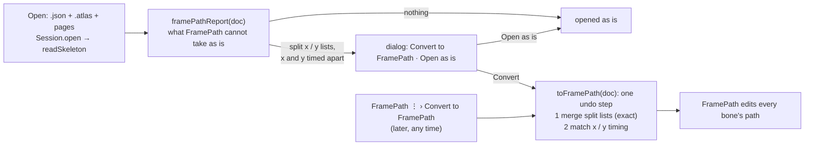
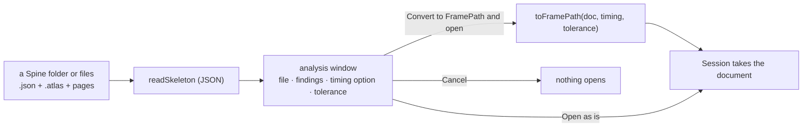

# Opening a Spine export: an option to convert its translate keys to FramePath

**Status:** done, 2026-10-09 (steps 1–5). Left outside this plan: the editor-against-C# gap already on the original sample (step 4), a task of its own.

The owner asked: when a Spine 2D export is opened (the sample: `Assets/Samples Custom/BoneBurstDemo/mix-and-match-pro`), there must be
an option to convert it to **FramePath**. FramePath (docs/FRAMEPATH-SPEED-PLAN.md, docs/CURVES-PANEL-PLAN.md) edits a bone's motion
in its translate keys, and it can only do so when those keys are in one form. This plan says what a Spine export has, what FramePath
needs, and how the editor offers the conversion.

## What FramePath needs

1. **One combined `translate` list per bone.** A bone keyed as `translatex` and `translatey` (Spine's separate x and y) has no frame
   strip, speed graph or Curves view today; FramePath says "keys translate as separate x and y" (`translateNodes` in
   `edit/keySpeed.ts` returns null).
2. **x and y timed together.** A span's speed and the Curves view read one pair of time handles; FramePath writes the same time handles
   to x and y (CURVES-PANEL-PLAN Decision 4, Match only). A Spine curve may time x and y apart: FramePath then reads their average, so
   what it shows is near, not exact, and its first edit of that span gives both channels the same timing, which changes the motion a
   little.

Nothing else in a Spine file stands in FramePath's way: linear and stepped spans, beziers, IK targets, keys between frames all read.

## What the sample has

`mix-and-match-pro.json`: Spine 4.3.26, 17 animations, no `fps` (the editor's default, 30, as Spine's).

| | count |
|---|---|
| bones keyed as one `translate` list (FramePath reads them) | 335 lists |
| bones keyed as split `translatex` / `translatey` | **22** (in 9 animations), only 4 with x and y on the same frames |
| bezier `translate` keys that time x and y apart | **21** of 304, in 10 bones of 5 animations |
| a bone with both a combined and a split list in one animation | none |

The split ones, by animation: `item-equip` hips; `item-equip-long` hips; `pickaxe-action` foot-back-IK (x only), hips; `pickaxe-throw`
foot-front-IK, hips, item; `run` foot-back-IK, foot-front-IK, hips; `shovel-action` bag, foot-back-IK, hips, item; `shovel-run`
foot-back-IK, foot-front-IK, hips, item; `torch-action` bag, head-control, item; `walk` hips (y only).

The ones timed apart: `item-equip-long` bag-control, body-up; `pickaxe-action` body-up, item; `run` bag, hair-side-back;
`shovel-action` hair-side-back, head; `shovel-run` bag, hair-side-back.

So a person opening this sample today can edit most bones in FramePath, but not the hips in 8 of the 17 animations, which is the bone a
walk or a run is mostly about.

## The conversion

**1. Split lists merged: exact.** The new `translate` list has a key at every frame either list keys. At each, x is the x list's
value there and y the y list's; where one list has no key at that frame, its curve is split there (de Casteljau per channel, as Trim
does: docs/FRAME-LIMIT-PLAN.md), so each channel's curve is exactly what it was. A channel with no list at all is 0 (a translate key is
an offset from the setup pose, so an unkeyed axis stays at the setup). The x and y lists go. The motion is the same to the last digit
of the curve; only the file's shape changes.

**2. x and y timing matched: near.** After step 1 a span can still time x and y apart (merged lists, and the 21 keys above). FramePath
needs one timing. One timing is fitted to both channels, the value handles following (see Result, step 1: averaging moved too much).
This moves the bone a little in time along the same path; the conversion measures how far (the largest distance between the old and
new place over the span, sampled each frame) and, where that is over a tolerance, splits the span in two first (a key at its middle,
exact) and matches the halves, until every span is within it.

**3. One undo step.** The whole conversion is one history step; the file on disk changes only when it is saved. The Unity export
and bake are unaffected in kind: a combined `translate` list is ordinary Spine data that BoneBurst's runtime reads as it reads split
lists. `scripts/unity-parity.ts` (the engine against BoneBurst's C# runtime) checks the converted file plays as the original within
the tolerance.

## Where the option is (first draft; replaced by the analysis window, Decision 1)

- **On opening** a skeleton that has any of the above: a dialog (`askChoice`, as Close's "save changes?" does) says what it found
  ("22 bones keep x and y as separate lists; 21 curves time x and y apart. FramePath can edit them after a conversion: the motion stays
  the same, within 0.5 units.") with **Convert to FramePath**, **Open as is**, and a details list (each animation and bone).
- **Any time later**: FramePath's ⋮ menu gets **Convert to FramePath…** for the animation shown (or the whole file), and FramePath's
  hint for a split bone ("keys translate as separate x and y") gets a **Convert** button for that bone.

## Steps (first draft; replaced by Steps, as decided)

1. Model (`src/edit/toFramePath.ts`, no DOM; tests first): `framePathReport(doc)` (what is split, what is timed apart, per animation and
   bone); `mergeSplitTranslate(animation, bone)` (exact); `matchTranslateTiming(animation, bone, tolerance)` (with subdivision);
   `toFramePath(doc, scope, tolerance)`. Table tests on small cases, and the sample itself: after conversion, no split list and no span
   timed apart, and the engine poses every bone within the tolerance of the original at every frame of every animation.
2. The open dialog and the ⋮ menu item and the hint's button (`session.ts` after `readSkeleton`, `motionPanel.ts`).
3. e2e: open a split-translate fixture, convert, FramePath shows its strip; Open as is leaves it split; one undo step undoes it.
4. Parity: the converted sample through `scripts/unity-parity.ts`.
5. Docs: docs/SPEC.md §6a and the panel's Info.

## Decisions (the owner, 2026-10-09)

1. **An analysis window first, every time a Spine export is opened** (a folder or its files, its JSON): before the skeleton
   opens, the window shows what the file is (Spine version, frame rate, animations, bones, skins) and what FramePath cannot take as is
   (each split bone and each curve timed apart, by animation), and the way it would be converted. One window for the whole file.
2. **The x / y timing is an option in that window**, not fixed: *Match, split spans to stay within the tolerance* (the default),
   *Match only* (no extra keys), or *Leave them* (only the split lists are merged).
3. **The tolerance is an option in that window** (units, default 0.5), used by the first choice above.
4. **JSON only; no binary** (the owner, revising: "no binary, if .skel == binary, cut it"). A folder or files with a `.skel` /
   `.skel.bytes` and no `.json` are not opened: the window says the editor opens Spine's JSON export and asks for it (Spine: Export ›
   JSON). A folder with both opens its `.json`.

The window's buttons: **Convert to FramePath and open**, **Open as is**, **Cancel** (nothing opens).

## Steps, as decided

1. **Model** (`src/edit/toFramePath.ts`; tests first): `framePathReport(doc)`, `mergeSplitTranslate`, `matchTranslateTiming(…, mode,
   tolerance)` with the three modes, `toFramePath(doc, { timing, tolerance })`, and the sample's check (no split list after, timing within
   the tolerance at every frame of every animation as the engine poses it).
2. **The analysis window** (`src/ui/importAnalysis.ts`): opened by `Session.open` (and a drop) before the document is taken; its options and
   buttons as above; a `.skel` without a `.json` said and not opened; e2e on a split-translate fixture.
3. **Later, from FramePath**: the ⋮ menu's Convert to FramePath… and the split bone hint's Convert, the same conversion with the same options.
4. **Parity**: the converted sample through `scripts/unity-parity.ts`.
5. **Docs**: docs/SPEC.md (opening, §6a), THIRD-PARTY-NOTICES unchanged (nothing taken in), this plan's result.

## Result

### Step 1 (done, 2026-10-09)

`src/edit/toFramePath.ts`: `framePathReport(doc)` and `convertToFramePath(doc, { timing, tolerance })` → `{ doc, added, worst }`.

- **Merging split lists** as planned: one `translate` list keyed at the union of the two lists' times, each channel's cubic cut at the
  new keys (de Casteljau), an axis without a list 0, an axis before its first key 0. Where one axis jumps (a stepped key, or a list starting
  late) while the other moves, a key one frame before the jump and a one-frame ramp into it: the same at every whole frame. The sample has
  both cases (5 lists start late, 5 bones step one axis only).
- **Matching the timing: changed from the plan.** Averaging x's and y's time handles moved the bone too much: on the sample, up to 8.5
  units between frames inside spans one frame long, which can be cut no further. The timing is now **fitted**: shared time handles
  searched on a grid (shares of the span in twentieths, and the average), and for each the two channels' value handles solved by least
  squares against the old curves; the best kept. On the sample: Match moves a bone at most 0.71 units and adds 1 key (a ramp); Split at
  0.5 moves it at most 0.59 (a one-frame span that cannot be cut) and adds 2. `worst` is that figure, for the window to show.
- `split` cuts a span at the whole frame nearest its middle while the fit moves the bone more than the tolerance, down to one frame.

`tests/toFramePath.test.ts` (8; written after the code, not before as planned; checked by breaking the curve cut on purpose, which fails
three of them): the report's findings; a merge the same at every frame within the engine's bezier sampling (0.3); an axis without a list;
a late list and a one-axis step the same at every whole frame (1e-3), the step adding one key; Leave, Match and Split, Split's keys on
whole frames and its worst within the tolerance; the sample: 22 split bones and 21 curves timed apart reported, and converted (Split,
0.5) nothing left to report and every bone within 0.75 units of the original at every frame of all 17 animations as the engine poses
them (the tolerance, and Spine's 10-step bezier sampling of cut curves). vitest 811 pass.

### Step 2 (done, 2026-10-09)

`src/ui/importAnalysis.ts`: `analyseOpen(a)` → `OpenChoice`; `Session.beforeOpen` (set by the app) is asked by `Session.open` after the
JSON is read and before the document is taken; `open` now returns whether it opened. The window: the file's facts (Spine version,
frame rate or "not set (30 fps)", bones, slots, skins, animations, notes from reading), what FramePath cannot take (counts, and a
"Where" list of each animation and bone), the timing choice (Decision 2) and the tolerance (Decision 3, off unless the timing is the
first choice), what converting with them does, measured (keys added, the largest move), and Cancel · Open as is · **Convert to
FramePath and open** (a file FramePath takes as it is: Cancel · Open). Converting is one undo step on top of the file as exported.
A `.skel` without a `.json` gets the window's message and nothing opens (Decision 4).

Found and settled while testing:

- **The window did not come a second time**: tabs set a document aside by copying every field of the session (`capture`), and the
  restore of a fresh one cleared `beforeOpen`. It is now one of the editor's shared fields.
- **Not every open is a Spine export**: a `.bbdata` project, Restore of work kept in this browser, and the dev fixture buttons (every e2e
  test's way in; the File menu's Stickman sample uses them too) open without the window; Open…, Import Spine Folder and a drop show it.
- **A broken file was refused after the window** (a slot on a missing bone): the rig is now built before the window, so such a file is
  refused at once with its reason, as before.

`e2e/importAnalysis.spec.ts` (5): a split export said (its Where row), converted (one `translate` list, one undo step back to the split
lists); Open as is and Cancel ("Nothing was opened."); the three timing choices and the tolerance; a clean export (Open only, the frame
rate "not set (30 fps)") and a `.skel` alone; the owner's sample (22 split bones, 21 curves, measured). The specs that open real files
(`hostileFiles`, `importFolder`, `unposed`, `weightBrush`) click Open as is in the window. Seen on a Playwright screenshot of the sample.
vitest 811 pass; e2e 154 pass, the 3 AI-bridge tests fail as before (no bridge from the dev server on 5199).

### Step 3 (done, 2026-10-09)

For a file opened as it is: FramePath's ⋮ menu has **Convert to FramePath…** (off when there is nothing to convert), and a bone keyed as
separate x and y has a **Convert…** button beside its hint. Both open the analysis window in its convert form (`analyseOpen(a, true)`: no
file facts; Cancel · Convert; a file with nothing to convert says so, with Close) and convert the whole file, one undo step
(`MotionPathPanel.convertDoc`), the status line saying the keys added and the largest move. `importAnalysis.spec.ts` (6): opened as is,
the hint's Convert… converts (the window without Open as is), undo splits it again, the ⋮ menu converts again, and after it the menu item
is off.

### Step 4 (done, 2026-10-09)

`scripts/framepath-parity.ts` (`npx vite-node scripts/framepath-parity.ts [timing] [tolerance]`; needs Unity's .NET SDK, so not in
`npm run check`): converts the owner's sample, has BoneBurst's C# runtime pose the original and the converted file
(`scripts/oracle/csharp.ts` now exports `dumpWithCsharp`, which `compareWithCsharp` uses), and compares. Run on 2026-10-09 (Split, 0.5):

- **The converted file is ordinary Spine data both runtimes play alike**: the editor against C# on the converted file differs by
  0.0374 units at most, the same figure, frame and bone (`pickaxe-throw` frame 14, `leg-back-4`) as on the **original** file: a mismatch
  already there between the editor's engine and the C# runtime on this sample, over the harness's 0.01, and not this plan's doing. The
  conversion adds none.
- **Original against converted, both in C#**, at the harness's steps (0.0337 s, which fall between frames): 0.61 units at most (`run` and
  `shovel-run` at 0.135 s, `leg-down-back`, an IK chain amplifying it), the tolerance and Spine's 10-step bezier sampling as the editor
  measured (0.59). At whole frames the unit test of step 1 holds every bone within 0.75 in the editor's engine, which the C# runtime matches.

### Step 5 (done, 2026-10-09)

docs/SPEC.md: §5 says a Spine export opens through the analysis window (what it shows, its choices, what opens without it); §6a's
diagram has the conversion's way into the keys and a paragraph on `edit/toFramePath.ts`. The FramePath panel's Info names Convert to
FramePath… and the split bone's Convert…. THIRD-PARTY-NOTICES unchanged: nothing was taken in.

### The window's layout (done, 2026-10-09; the owner: "1.5 × w and 1.75 × h, then a top toolbar of tabs for clean sections")

The window is 840 × 1050 (it was 560 wide and as tall as its content, about 600), held to 94 % × 92 % of the screen. Under its title a row
of tabs: **Summary** (the file's facts, what FramePath cannot take, the measured result), **Where (n)** (each animation and bone, the
table's head staying in sight as it scrolls; it was folded under a "Where" toggle) and **Convert** (the timing and the tolerance, the
measured result again). One tab shows at a time and scrolls on its own; the buttons stay at the bottom; ← and → move between tabs. A
file with nothing to convert, and the convert form, have the Summary tab only, or no file facts. `importAnalysis.spec.ts` (7) checks the
size, the three tabs, one page shown at a time, and the buttons in sight; the options test opens the Convert tab first. Seen on
Playwright screenshots of the sample (Summary and Where).
