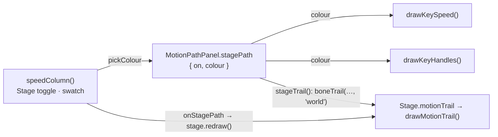

# The selected bone's path on the Stage

**Status:** done, 2026-10-09. `e2e/stagePath.spec.ts` passes (and fails with the speed curve back on the fixed colour); `e2e/motionModes.spec.ts` (its button check anchored, so the new "Path on Stage" button does not trip it) and the 770 unit tests pass. Nothing left.

The speed graph's header in the Motion Path panel gets a **Stage** toggle and a colour swatch. On, the
Stage draws the selected bone's path over the animation shown (its joint, frame by frame, in world
space) in that colour. The same colour draws FramePath's speed curve and its handles on the picture, so
the line on the Stage, the handles and the graph read as one thing. Both are kept per browser
(`localStorage`, `boneburst.motionPath.stagePath`), not in the document.

## Steps

1. `MotionPathPanel`: `stagePath { on, colour }` read from and saved to `localStorage`; `PATH_COLOUR`
   becomes its default. `stageTrail()` returns the selected bone's world trail (cached by document,
   images, skin, animation and bone) with the colour, or null when off, with no animation or no bone.
2. The speed graph's header: **Stage** (pressed while on) and a swatch that opens `pickColour`. A change
   redraws the panel and calls `onStagePath`.
3. `Stage.motionTrail`, set by the app: drawn over the bones, under the gizmo: a line through the
   frames' joints, a small dot each frame, a larger one at the playhead.
4. An e2e check: the toggle and the colour are kept, the Stage's trail follows the toggle, and the speed curve is drawn in the picked colour.

**Result:** as planned. The toggle's accessible name is "Path on Stage" (its text "Stage"): the FramePath test that guards the removed TwinSpline buttons matched any name containing "Stage", so its pattern is now anchored to the old names.
