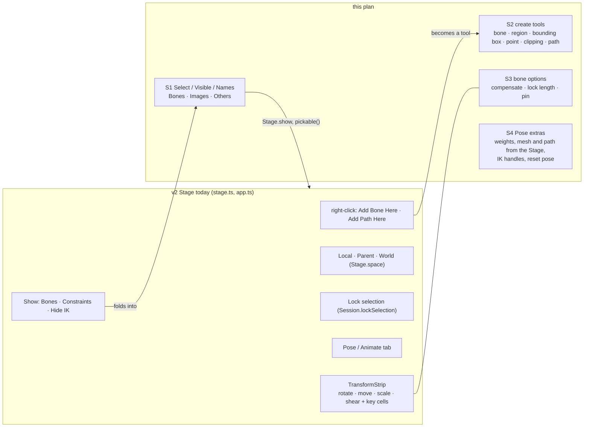

# Stage and Pose mode — what Spine's Stage tools have that v2 does not — plan

**Status:** steps 1 and 2 done (the matrix, 2026-10-07; the Create tools, 2026-10-08, with Region added later the same day); step 3 done 2026-10-08 on the plan's own defaults (Compensate and Pin; Lock length left out); step 4 done 2026-10-08 (Mesh, Weights, Path, Reset; IK handles were already there); step 5 done 2026-10-08 (keys, tooltips, layout); the questions below are still open. Written from the owner's picture of Spine's Stage tool panels
(Pose mode) and from what v2 has today, read on disk. Spine's editor is not open here, so what each icon does
is read from the picture and marked **confirm** where it is a guess; the owner confirms the list in
"Questions" before step 1. Clean-room: no code from the old editor or the fork is read; the behaviour is
described, then written fresh.

The picture shows five groups of tools floating over Spine's Stage. v2's Stage has the third (the transform
panel with its key buttons), a Local / Parent / World group, a Show group, a lock for the selection, and
Pose / Animate. What is missing is the **create tools**, the **bone options** (compensate, pin), the **lock
column**, and the **Select / Visible / Names matrix** for Bones, Images and Others.

## What the picture shows, left to right

| # | Group in Spine | What I read | v2 today |
|---|---|---|---|
| 1 | **Create** (3 buttons, left) | create a bone (bone with a plus); a bounding shape (box with corner dots); a point-like create (ring and crosshair) — **confirm** | only right-click ▸ Add Bone Here and Add Path Here; no create tool, no click-drag chain |
| 2 | **Transform** (4 rows) | Rotate, Translate, Scale, Shear, each with a key cell | done (`TransformStrip`), head cell is the key toggle |
| 3 | **Bone options** (4 buttons) | toggles on how a bone edit treats its neighbours: two compensate-style buttons, a pin (lit), one more — **confirm** | none |
| 4 | **Lock** (3 buttons) | lock the selection / an image / a mesh vertex set — **confirm** | one Lock-selection button, bottom right of the stage |
| 5 | **Select · Visible · Names** matrix | rows Bones, Images, Others; columns *selectable* (arrow), *visible* (eye), *name shown* (tag) | Show: Bones, Constraints, Hide IK; no per-kind pick or names |

## Decisions

- **One matrix, not three buttons.** The Show group (Bones, Constraints, Hide IK) becomes the matrix:
  rows **Bones**, **Images**, **Others** (constraints, paths, points, bounding boxes, clipping); columns
  **Select**, **Visible**, **Names**. A cell is a preference like the ones the Show buttons are now
  (`prefs.values.bones`, `constraints`, `hideIkBones`), so Preferences ▸ Viewport and the View menu stay in step
  (one source of truth, as `snapFields` does for snapping). Select off means a press on that kind is an empty
  press (it pans), exactly as the selection lock already treats other bones.
- **Create is a tool, not a menu.** A Create group picks what a press on the Stage makes; the tool stays on
  until Esc or another tool, so a chain of bones is one run of clicks. Each creation is one undo step through
  the edit layer that Add Bone Here already uses (`edit/bones.ts`), and the new thing is selected.
- **Compensate keeps the children where they were.** With it on, a Move, Rotate, Scale or Shear of a bone
  (setup or an unkeyed pose) changes its children's local values so their world places do not move. This is
  the same maths `reparentBone` already uses to keep a bone in place (`localUnder`), applied to children
  instead of the bone. Off by default, remembered per browser.
- **Pose mode gets what Pose means.** In Pose mode the Stage edits the setup pose, so the group of tools
  that only make sense there (create, compensate, lock length, weights, mesh and path edits, reset pose) show
  in Pose and hide in Animate, where the transform panel, Auto Key and Onion stay. The two modes already keep
  separate layouts (`Workspace.setMode`); this adds separate tool groups, not a second window.
- **Icons: Lucide where it has one, Godot's where it is a rig concept, drawn only when neither has.** Each new
  icon is vendored with its row in the lucide or godot `MANIFEST.md`, which `tests/icons.test.ts` checks.

## Icons to add

| Button | Candidate | Source | Note |
|---|---|---|---|
| Create bone | `bone` + a plus | Lucide `bone` (have) over a drawn plus | `bone` is in `ICON_FILES` already |
| Create region (image) | `image-plus` | Lucide (have: `addImage`) | |
| Create bounding box | `square-dashed` with corner dots | Lucide `square-dashed` (have: `slot`) / Godot `boundingbox` (have) | use Godot's, it is already the attachment's icon |
| Create point | `crosshair` | Lucide (have: `point`) | |
| Create clipping | `scissors` | Lucide (have: `clipping`) | |
| Create path | `spline` | Lucide (have: `path`) | |
| Compensate | `link` / `unlink` | Lucide | **confirm** the meaning first |
| Lock length | `lock` | Lucide | new file |
| Pin | `pin` | Lucide | new file |
| Select | `mouse-pointer-2` | Lucide | new file; the matrix's column head |
| Visible | `eye` and `eye-off` | Lucide | new files |
| Names | `tag` | Lucide | new file |
| Reset pose | `rotate-ccw` | Lucide | new file; `history` already uses `rotate-ccw-clock` |

Five of the thirteen are already vendored (`bone`, `addImage`, `slot`/`boundingbox`, `point`, `clipping`, `path`);
the rest are about eight Lucide files, added the way `ghost.svg` was (a row in `lucide/MANIFEST.md`, the
`FILES` entry in `icons.ts`).

## Steps

Each step is one commit, with a browser test (Playwright) and, where the maths is new, a unit test;
no step changes the Spine file format, so every export stays what BoneBurst's reader reads.

1. **The Select / Visible / Names matrix — done 2026-10-07.** Result: `stage/viewMatrix.ts` replaces the Bones and Constraints buttons in the Show group (Hide IK stays under it); cells follow the picture, so Images has Select only and Others has Select and Visible (the rest dimmed). Preferences `boneSelect`, `imageSelect`, `otherSelect`, `boneNames` are new; Visible is the existing `bones` and `constraints`; Preferences ▸ Viewport ▸ Display has the same switches. A press on an image picks its slot (and still pans); Names ▸ Bones draws each bone's name above its middle; Names for Others and Visible for Images were left out (dimmed), as in the picture. Icons `mouse-pointer-2`, `eye`, `tag` vendored. Tests: `e2e/viewMatrix.spec.ts`. Original text: rows and columns as above, in the Show group's place; new
   preferences `boneSelect`, `imageSelect`, `otherSelect`, the visible and names columns for images and
   others, `boneNames`; `Stage` reads them in drawing and in `pickBone`. Names on the Stage draw the bone's or
   attachment's name by its origin. Tests: a hidden kind is not drawn and not pickable; names draw.
2. **Create tools — done 2026-10-08, without Region.** Result: `ui/stage/create.ts` (`createBone`, `createShape`) and `edit/create.ts` (`newPointAttachment`, `newPolygon`); the Create group (bone, point, bounding box, clipping, path) floats like the others and shows in Pose mode only; Esc leaves the tool. A bone is a press-and-drag (it starts where pressed, points where released, its length the drag; a click makes a 50 unit one), its parent the bone under the press, else the selected one, else the root, and it is selected after, so the next press carries on under it. A box or clipping polygon is the dragged rectangle (a click: 100 units square) on a new slot of that bone; a clipping one goes first in the draw order and clips every slot after it (Undo takes it away; its End is not editable in Properties yet). Boxes, clipping polygons and points are now drawn (green, red dashed, cyan cross) while Others ▸ Visible is on. Region joined later on 2026-10-08, the owner's answer to question 3 being "from the atlas": the Region tool shows a list of the loaded atlas's images in the Create panel, and a press puts the chosen one on a new slot of the bone under it, centred there, at its original size, shown from the setup pose (key **Y**; `createRegion` in `ui/stage/create.ts`; `e2e/createTools.spec.ts`). Tests: `e2e/createTools.spec.ts`. Original text: The Create group (bone, region, bounding box, point, clipping, path) and a Create
   tool state in `Stage`; click makes, click-drag on a bone tool sizes it (the tip follows the pointer),
   the next press continues the chain under it. Right-click ▸ Add … stays. Tests: a chain of three bones is
   one run of presses and three undo steps; each kind appears in the rig.
3. **Bone options: Compensate, Pin — done 2026-10-08 (Lock length left out).** Result: `ui/compensate.ts` wraps a bone's value edit (the Stage drag, the transform panel's cells and the arrow keys, the Properties fields) so that, in Pose mode only, every child stays put with Compensate on, and every pinned bone under it stays put at any depth: each gets the local values that keep its world place under the moved bone, measured from the setup pose before and after (bones that do not inherit normally are left alone). Compensate is a preference (`compensate`, Preferences ▸ Viewport ▸ Display); Pin is a set of bone names kept in the session, drawn as an orange ring and stalk, and is not written to the file. Both sit in a Bone options group beside Create, Pose mode only. Pin was built on the plan's own reading (one bone's world place held while a bone above moves), since question 2 is unanswered. Lock length is not built: v2's Stage has no bone-tip drag for it to act on. Tests: `e2e/boneOptions.spec.ts`. Original text: Compensate as decided above; Lock length keeps a bone's
   length while its tip is dragged (a drag turns it instead of stretching it); Pin is the open question below.
   Tests: with Compensate on, a child's world matrix is the same before and after a parent's Move, Rotate,
   Scale and Shear (compared by `boneMatrix`), with it off, it moves.
4. **Pose-mode extras — done 2026-10-08.** Result: a Pose tools group, Pose mode only, `ui/stage/poseTools.ts`: **Mesh** edits the selected slot's image as a mesh (a region is turned into a mesh first, one undo step) and selects it, so its vertices drag on the Stage; **Weights** toggles the weight brush for the mesh being edited (it says what to do when none is, and the bone is still picked in Properties ▸ Show weights); **Path** selects the selected bone's or slot's first path; **Reset** puts the selected bone's rotation, scale and shear back to 0, 1, 0 as the right-click menu does, one undo step, and never touches every bone at once, since in Pose mode those values are the rig. IK handles were already there: an IK target is a bone, so dragging it on the Stage moves the chain, and the constraint is drawn. Icon `rotate-ccw` vendored. Tests: `e2e/poseTools.spec.ts`. Original text: The Stage's own entries for Weights, Mesh and Path (today in the Rig and
   Properties panels), IK handles dragged on the Stage in Pose mode, and Reset Pose (setup values back for
   the selected bone, or all). Tests: each entry turns the same mode on as its panel button; Reset Pose is one
   undo step.
5. **Icons and layout — done 2026-10-08.** Result: every icon was added with its step; this step gave the new tools their keys, the tooltips carry them, and the shortcuts sheet lists them from the same table. Keys, in Pose mode only (they do nothing in Animate, and the key goes on to whoever else wants it): **D** bone, **P** point, **G** bounding box, **C** clipping, **N** path, **U** edit mesh, **I** pin. The plan's first guess (B, I, P, C) clashed with the Motion Path panel's keys (B, M, X, L is Lock selection), so D, G, N and U were taken instead; Compensate, Weights, Path (the tool) and Reset have no key. The groups are floating cards with a saved place and fold like the others, and "Panels" (double-click) puts every one back. Tests: `tests/shortcuts.test.ts`, `e2e/poseTools.spec.ts`. Original text: Every new button gets its icon and tooltip with its key (`keysOf`), the Create
   group and the Bone options group are floating cards like the others (grip, fold, saved place), and the
   Pose-only groups hide in Animate. The shortcuts sheet lists the new keys.

## Questions for the owner

1. **Group 3's four buttons and group 4's three**: are they *Compensate* and *Pin* and *Lock* as read here?
   Say what each does, or give the names under the icons, and I fix the table before step 3.
2. **Pin**: in Spine it is a bone-pose tool; should it pin a bone's world place while its parent moves (like
   Compensate, for one bone), or is it a mesh tool (pin a vertex)?
3. **Create region**: it makes a region attachment from an image of the atlas, so it needs the picker for
   the image. Pick from the loaded atlas, or from a file?
4. **Names**: on the Stage as text beside each item, or only for the selected one? (The matrix says all.)
5. **Keys**: the Create tools want keys (`B` bone, `I` region …); `B`, `I`, `P`, `C` are free today.

## What is not in this plan

- Animation-mode tools (Auto Key, Onion, the Timeline) — they are done and stay where they are.
- Anything the Spine file cannot hold: the matrix, Compensate and Lock length are editor state (preferences
  and edit rules); nothing new is written to the file.
- A look at Spine's editor itself: the owner's picture is the source for this plan.
