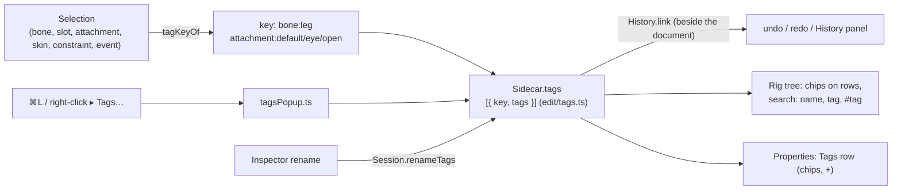

# Tags on every element

**Status: done 2026-10-08.** A list of words on any element of the rig (bone, slot, image/attachment, skin, constraint, event), kept in the sidecar, edited with ⌘L, found by the rig tree's search.

## Decisions

- **In the sidecar, not the Spine file** (D4): tags change nothing the skeleton means, and the file stays what Spine reads. Deleting `<name>.bb.json` loses only tags, motion paths and the view.
- **Keyed by kind and name**, so a rename moves them (`Session.renameTags`, from the Inspector's name fields: one undo step of its own, after the rename's). A slot's or skin's rename also moves its attachments' tags. An element deleted leaves its entry behind, unseen.
- **Undoable**: the sidecar's `tags` rides in the History's "beside" state together with the motion paths (`Session`'s `history.link`), so each tag edit is a step.
- **Search**: the rig tree's search finds an element by name or by a tag that holds the text; `#ik` finds only elements with exactly the tag IK. Any case.
- **A tag** is trimmed, commas and runs of space folded, at most 40 characters; several at once are typed with commas.

## Where

`src/edit/tags.ts` (pure, `tests/tags.test.ts`), `src/model/sidecar.ts` + `src/io/sidecar.ts` (the `tags` object), `src/ui/tagsPopup.ts`, `src/ui/panels/outline.ts`, `src/ui/panels/inspector.ts`, the shortcut `tags` in `src/ui/shortcuts.ts`; checked by `e2e/tags.spec.ts`.

## The Tags panel (2026-10-08)

`src/ui/panels/tagsPanel.ts`, behind the Rig panel by default: every tag in use with its count (elements that no longer exist are not counted). A click opens the tag's elements, a click on one selects it; ✎ renames the tag on every element (a name already in use merges the two, one copy kept), the bin takes it off every element: each is one undo step (`Session.renameTagEverywhere`, `deleteTagEverywhere`; pure in `edit/tags.ts`: `renameTag`, `deleteTag`, `taggedOfKey`).

## Not done

Tag colours, tags on animations, and tag-based selection of several elements at once (the selection is one element).
