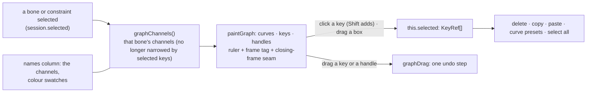

# The Timeline is the curve graph only — plan

**Status:** built 2026-10-07, not committed; **not verified by hand**. `tsc`, vitest (733) and the whole
Playwright suite (64) pass. Done: the Graph button and the cell view are gone; the graph is the Timeline; keys
are selected on the graph (click, Shift, box) so the curve buttons, Delete, copy, paste and select all still work;
the row height preference went with the rows. **Not verified:** the look at other window sizes.

The Timeline had two views: the **cell** view (one row per bone, slot and constraint, a diamond per key: the
dope sheet) and the **Graph** (the curves of one bone's channels). The owner wants the graph only. The cell
view, its rows and its Graph button go; the graph becomes the Timeline.

## What was asked

> at TimeLine, it must have only graph view now, remove old cell (like pic) mode

and, to my question about what becomes of the keys that only the cell view showed (events, draw order, slot
colour, attachment keys):

> Graph only, rows gone (Recommended)

## What goes, what stays, what changes

- **Goes:** the Graph toggle; the rows (`buildRows`, `marks`, `rowAt`, `markAt`, `Row`, `Mark` and their
  painting, labels, twisties and box select by rows); the row height preference. **Events, draw-order, slot
  and attachment keys are no longer shown or edited on the Timeline** (Properties, the Key button and the AI
  tools still edit them).
- **Stays:** the ruler, the green frame tag and its time, Fit, wheel zoom, middle-drag pan, the names-column splitter,
  Closed loop (its dashed seam is drawn on the graph), the Path from–to-every fields, the animation list, transport,
  the curve presets, copy and paste, Delete, select all.
- **Changes:** keys are selected **on the graph** (click a key, Shift adds, a box over empty graph selects the keys
  inside), so the curve buttons, Delete, copy and paste still have a selection. The channels shown are the
  selected bone's (or constraint's) whatever keys are picked, so picking a key no longer hides the others.

## What changed from the plan, and why

- **The Row height preference is gone** (preferences, its slider in Preferences ▸ Timeline, `ROW`, `setRowHeight`):
  nothing has a row height now. An old saved preference with it is read without it.
- **Tests:** the row tests in `tests/timeline.test.ts` and the row half of `tests/eventsTimeline.test.ts` went; the
  edit-level event-key test stayed as `tests/eventKeys.test.ts`. `e2e/events.spec.ts` no longer drags or deletes an
  event's diamond (there is none); `e2e/copyPaste.spec.ts` boxes keys on the graph; `e2e/graph.spec.ts` lost its
  Graph click and gained a key click / Shift / Stepped / Delete test; `e2e/uiScale.spec.ts` lost the Row height step.

## Guards

`tests/timeline.test.ts` loses the row tests with the rows; a unit test for the graph's key hit and box
selection (pure, in `graph.ts`); the e2e that used the cell view are changed to the graph or removed with
what they tested (events and rows); `e2e/graph.spec.ts` no longer clicks a Graph button.
