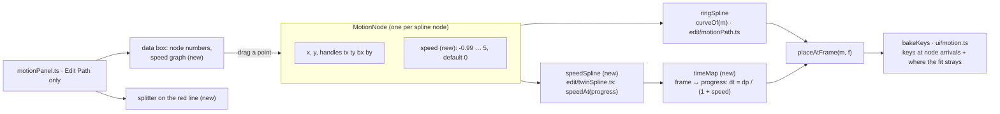

# TwinSpline: one Edit Path, a ring spline and its speed spline

**Status: done 2026-10-08, not verified by hand** (the owner went ahead with the three assumptions at the end as written). `tsc`, 787 unit tests and 129 Playwright tests pass; the panel was looked at in a screenshot only. Steps 1 to 6 below were all done. What changed from the plan is under "Built".

Adjust time goes away. Edit Path keeps the **ring spline** (the motion path) and gains a **twin**, the **speed spline**: one speed value on each node of the ring, drawn as a graph in the data box under the node numbers. The bone goes along the ring spline; how fast it goes at each place is `1 + speed` (the speed value runs from **-0.99 to 5**, so the multiplier runs from 0.01 to 6 and is never 0). The red line between the picture and the node numbers becomes a splitter you can drag.

## What the owner asked

1. Remove everything about Adjust time; do the work in Edit Path.
2. A new system, **TwinSpline**: the ring spline (the motion path) plus a **splineSpeedGraph** inserted in the blue box. Add a node to the spline and the speed graph gets its point there.
3. The speed graph's value goes from **-0.99 to 5**. The bone moves along the ring spline, with its speed multiplied by `1 + splineSpeedGraph`.
4. The red line (the edge between the picture and the node numbers) must be draggable.

## How it works

**Data.** `MotionNode` gets one optional number, `speed` (absent = 0, so the path moves evenly, as a path with no timing did). It lives on the node, so it follows the node when nodes are reordered, merged, reversed, sorted, inserted or removed, with no second list to keep in step (single source of truth, CLAUDE.md §4). The sidecar writes `speed` beside `x`, `y` (`io/sidecar.ts`). `frames` (total frames) and `closed` stay.

**The speed spline.** A smooth curve through the nodes' speed values, drawn over the path's progress: x is 0 to 1 along the ring's length, with each node at its own place (`curve.nodeAt[i] / curve.length`); y is -0.99 to 5. The same automatic smoothing as the ring's handles (a Catmull-Rom style tangent from the neighbours), periodic on a ring, clamped to the range everywhere. No handles of its own in this first version.

**Timing.** The bone's speed at progress `p` is `m(p) = 1 + speedAt(p)`. Time spent over a small step is `dp / m(p)`, so the time to reach `p` is `T(p) = ∫ dp / m`, and a frame `f` is at the `p` where `T(p) / T(1) = f / endFrame`. A table of `T` (512 samples) is built once per path and inverted by binary search: `progressAtFrame(m, f)` keeps its name and meaning, so `placeAtFrame`, the preview and the Stage line are untouched. With every speed 0 the table is a straight line: the old default.

**Bake.** No node times any more, so keys go where the motion needs them: one at each node's arrival (its frame from the table, rounded to a whole frame, kept strictly increasing) and one at the end, then a key added wherever the fitted Bézier between two keys strays from the sampled motion by more than a tolerance (`stray`, the number Bake already reports), up to a depth limit. Each interval keeps `fitChannel`'s control points. The status line says how many keys were written and the largest stray, as now.

**The panel.** Edit Path is the only mode. The mode buttons (Edit Path / Adjust time), + Time, − Time, the node time and block multiplier fields, the speed grid and its cells, and the block tabs in the Timeline go. The row keeps: the Parent bone picker, + / − Node, Closed, Total frames, Bake, Remove path. The E key (switch mode) goes; A, X, V, M, O, B keep their Edit Path meanings.

**The blue box.** Left, the picked node's data as now (place, both handles, legs), with one more row: **Speed** (the picked node's value, with the multiplier beside it: `0.5 → ×1.5`). Right, the speed graph: the speed spline over the ring's progress, the nodes as points numbered like the strip, the picked one lit, a horizontal line at 0 (even speed) and at -0.99 and 5 (the limits). Drag a point up or down to set its speed (one undo step per drag, snapped to the range); the point of the picked node is also the one the Speed field edits. A click on a point picks that node, as a click on its number does.

**The red line.** A 6 px splitter between the picture and the node numbers (the same blue grip and resize cursor as the panel sashes, `workspace/grips.ts`). Dragging it changes the height of the area under it (numbers, data and graph); the picture takes the rest. A minimum for each (the picture 120 px, the area 150 px), a double click puts it back, and the height is kept with the project's view (`MotionMemory.dataHeight`, `ui/viewMemory.ts`) and in the panel's own storage for a project not yet named.

## Beta posture: a clean break

The old timing (`starts`, `speeds`, `curves`, the node times, the blocks) is deleted, not migrated (CLAUDE.md §3): the data is a bone's own hand-tuned timing in the sidecar, and a path is re-timed in a minute with the speed graph. The sidecar reader ignores those keys and keeps the nodes and `frames`; the keys a path baked earlier stay on the timeline as they are (only the path's `baked` mark no longer matches, so the panel says the path changed since the last bake). To check before building: grep the fixtures and tests for `starts` (the list is under "Files").

## Steps

| # | Step | Guarded by |
|---|---|---|
| 1 | `edit/twinSpline.ts`, pure: `clampSpeed`, `speedAt`, the time table, `progressAtFrame` on it; `MotionNode.speed`; the sidecar reader and writer | `tests/twinSpline.test.ts`: all zero is even; a speed of 1 over a stretch makes it twice as fast; the multiplier never reaches 0; periodic on a ring; the table inverts exactly at the ends; `tests/sidecar.test.ts` round trip |
| 2 | Node edits carry `speed`: insert (the new node takes the graph's value there, so the shape is kept), merge (the mean), reverse, sort, break/mirror legs | `tests/motionPath.test.ts` |
| 3 | Bake: arrivals + adaptive keys; `bakeKeys` and `keyFrames` without node times | `tests/motionPath.test.ts`, a bake e2e |
| 4 | Delete Adjust time: the mode, buttons, fields, `speedGrid.ts`, the node-time and block functions in `edit/motionPath.ts`, `Session.pickedBlock`, the Timeline's block tabs, the E key and its shortcut row, the Info text, `MotionMemory.mode` | `tsc`, the whole suite |
| 5 | The speed graph and the Speed row in the blue box; the splitter on the red line; the view memory of its height | `e2e/twinSpline.spec.ts` |
| 6 | Docs: `PATH-FRAMES-PLAN.md`, `PATH-SPEED-PLAN.md`, `PATH-TIME-PLAN.md` get a line saying they are replaced; `ADJUST-GRID-PLAN.md` and `RING-SLICE-PLAN.md` are closed as dropped | review |

## Files

`src/edit/motionPath.ts`, new `src/edit/twinSpline.ts`, `src/model/sidecar.ts`, `src/io/sidecar.ts`, `src/ui/motion.ts`, `src/ui/panels/motionPanel.ts`, `src/ui/panels/speedGrid.ts` (deleted), `src/ui/timeline/timeline.ts`, `src/ui/session.ts`, `src/ui/viewMemory.ts`, `src/ui/shortcuts.ts`, `src/ui/workspace/panelInfo.ts`, `src/ui/style.css`; tests `tests/motionPath.test.ts`, `tests/motionParent.test.ts`, `tests/sidecar.test.ts`, `e2e/motionPath.spec.ts`, `e2e/speedGrid.spec.ts` (deleted), `e2e/motionStageLine.spec.ts`, `e2e/viewMemory.spec.ts`. `src/agent/tools.json` and `src/ui/agent/bridge.ts` name motion paths: check whether an AI tool reads `starts` or `speeds` before step 4.

## What I am not sure of (assumed unless you say otherwise)

1. **One speed point per node.** I read "add a node to the spline and the speed graph gets its point there" as one-to-one. The other reading is a speed graph with its own points, anywhere along the path. One per node is simpler and cannot drift from the ring; its cost is that two places with different speeds need two nodes.
2. **The range is the value, not the multiplier.** The graph's value (-0.99 to 5) is what you drag; the multiplier is `1 + value`, 0.01 to 6.
3. **Keys on the timeline** are one at each node's arrival plus the ones the fit needs, not one per frame. If you want a key on every frame of the path, say so: it is one line in the bake, and the timeline gets crowded.

## Not in this plan

Handles on the speed spline (its own curve shape per node), a speed graph per animation or per bone beyond the path's own, and a loop of speed over several rings.

## Built (2026-10-08)

- `edit/twinSpline.ts` as planned: `speedAt` (a cubic Hermite through the nodes' values, periodic on a ring, held to -0.99…5), `timeMap` (512 samples, kept per path object), `progressAtFrame`, `placeAtFrame`, `arrivalFrames`. `placeAtFrame` and `progressAtFrame` moved there from `edit/motionPath.ts` (no import cycle); everything of the old timing in `motionPath.ts` is deleted (node times, blocks, speed graphs, `withSpeed`), and `withFrames` only sets the frames.
- Bake: arrivals rounded and kept apart, then a middle key where a stretch's fit strays by more than `max(0.1, 0.2 % of the path's length)`, down to stretches of two frames, at most four times over; `bakeMotion` also returns the key count for the status line.
- The sidecar reads `speed` on a node and ignores the old `starts`, `speeds` and `curves`; it writes `speed` only when it is not 0.
- Merge takes the mean speed; a node added after the picked one (and one inserted on the curve with a double click) takes the speed spline's value there; reverse and sort keep each node's own.
- The speed graph is in the data box, to the right of the picked node's numbers, with a Speed row (`×1.5` beside it). Drag a point (Shift: steps of 0.1), double-click it for 0; each drag is one undo step.
- The splitter sits above the node numbers (`.lp-split`); the area under it is a flex basis (shrinks in a small panel, never below 150 px, the picture keeps 120 px). Its height is kept in `localStorage` (`boneburst.motionPath.lower`) and with the project's view (`MotionMemory.lower`).
- Removed with Adjust time: the mode and its buttons and fields, `speedGrid.ts` and its spec, the Timeline's block tabs, `Session.pickedBlock`, `Stage.dragLocked`, the E shortcut, `MotionMemory.mode` and `time`.
- Tests: `tests/twinSpline.test.ts`, `e2e/twinSpline.spec.ts`; `e2e/motionPath.spec.ts` lost its Adjust time tests and gained the bake and total-frames ones.
- The speed graph shares the data box with the node numbers' fields side by side, so in a narrow panel (under about 480 px) the graph is small.
