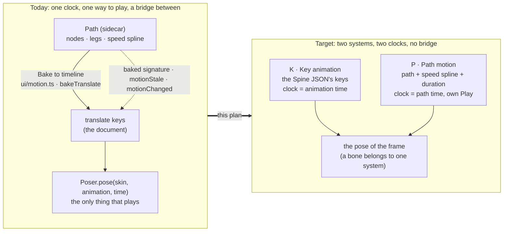
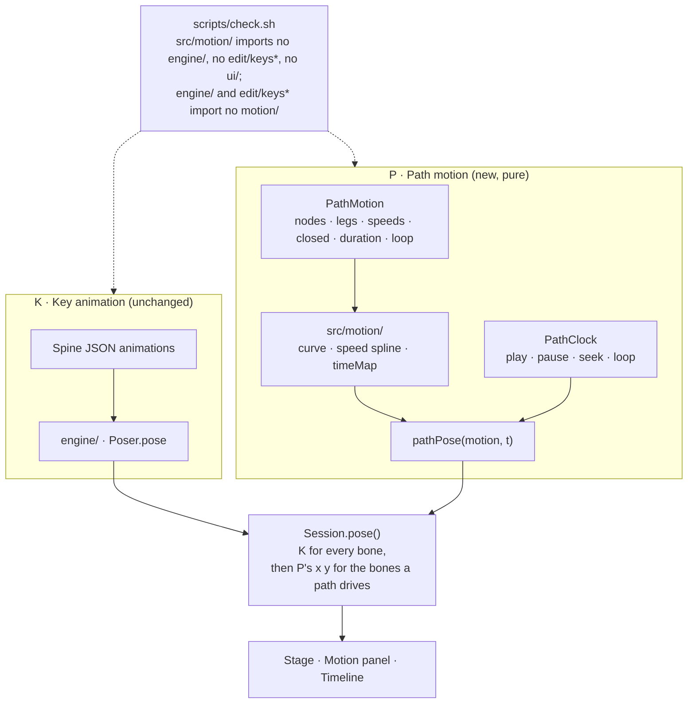

# Two pure systems: Key animation and Path motion — plan

**Status: planned 2026-10-08; the five questions were answered the same day (all five recommendations, with the owner's additions under "Decided"). Step 1 built the same day (below).** Written from the owner's note (below). It splits what is today one tangled thing, a bone's path that is only a recipe for keys, into two systems that never read each other.

## What was asked

> now time to big refactor,
> now we have 2 systems for can play
> 1 by key frame (old design)
> 2 by time and path length (can click play, no need to bake data to the timeline first)
> i think we need to split into 2 pure systems — let plan md

## What is there today (checked on disk, 2026-10-08)

The owner's second system is **not a system yet**: it is a way to *author* keys. What exists:

- **K, the key animation.** The document is the Spine 4.3 JSON; `engine/` (`rig*`, `track`, `bezier`) evaluates its keys, `Session.pose()` asks the `Poser` for the pose at `session.time`, and BoneBurst plays the same keys in Unity. Only this plays.
- **The path.** `Sidecar.motion` (`model/sidecar.ts`; not the document, not undone with it, **not exported to Unity**): `MotionPath` with nodes (place, handles, speed, speed legs `ss`/`sb`), `closed`, `frames`, `parent`, `baked`. Pure parts: `edit/motionPath.ts` (the ring curve, node edits, key fitting) and `edit/twinSpline.ts` (the speed spline, `timeMap`, `progressAtFrame`, `placeAtFrame`). The rig-touching parts: `ui/motion.ts` (the reference bone's space, `bakeMotion`), `ui/panels/motionPanel.ts` (2 700 lines: the picture, the node strip, the graph, the bake button).
- **How a path "plays".** It does not. A press on a node sets an *unkeyed* pose (`poseAtNode`, `Session.setUnkeyed`); the graph's cap scrubs `session.seek(frame)`; the bone only moves along the path at that frame **after Bake to timeline** has written translate keys (`bakeTranslate`).
- **The coupling to cut** (each is a place where P knows about K or the reverse):
  1. `MotionPath.baked` (a signature of the keys and of the path), `motionStale`, `motionChanged`, the Bake button's "attention" state and the `B` key.
  2. `frames` / `endFrame` / `progressAtFrame(m, session.frame)`: the path's time *is* the animation's frame.
  3. The graph cap and the ruler seek `session.frame`, so the path has no time of its own.
  4. `arrivalFrames`, `fitChannel`, `translateKeys`, `keysSignature` in `edit/motionPath.ts` are key logic inside the path module.
  5. The Timeline's node tabs and `Session.pickedBlock` (what is left of the old blocks).

## The design

**Two systems, one rule: a bone's translation is driven by exactly one of them, per animation.**

| | **K · Key animation** | **P · Path motion** |
|---|---|---|
| Data | `animations` in the Spine JSON | `PathMotion` records (see Q1 for where) |
| Pure core | `engine/` + `edit/keys*` | new `src/motion/`: `curve`, `speed`, `timeMap`, `pathPose(motion, t) → {x, y}` |
| Clock | the animation's time (Timeline) | the path's own time (seconds, `duration`, loop on or off) |
| Plays | Timeline Play | Play in the Motion panel, no keys needed |
| Edits / undo | document history | the same history (sidecar edits already are steps) |
| Unity | exported, played by BoneBurst | not yet (a later plan: Q1) |

- **P is pure.** `src/motion/` takes numbers and returns numbers (as `edit/twinSpline.ts` already does); it imports no `Session`, no `engine/`, no DOM, no Spine types. Everything about the rig (the reference bone's matrix, turning a path point into the bone's local x and y) stays in one small adapter, `ui/motion.ts`, today's `refMatrix` and `poseAtNode` family.
- **P has its own clock.** `PathClock { time, playing, loop }` plays at real time over `duration` (seconds; the panel shows frames as a convenience at the animation's rate, `Total frames` becomes `Duration`). The graph's ruler is length along the ring, the cap is the path's time, so scrubbing it moves P's clock and never `session.frame`. Play in the Motion panel runs P without a key.
- **A bone is driven by one system.** While a path exists for a bone in an animation, K's *translate* timeline for that bone is not read for the pose (rotate, scale, shear still are). A bone that has translate keys and gets a path is told so and asked (Q2).
- **No bridge.** Bake to timeline, the baked signature and the stale tracking go. If keys are wanted from a path, a one-time **Make keys from path** command samples P into new K keys and forgets the path link (Q3).

## Steps

Each step leaves the editor working; tests and `npm run check` pass before the next.

1. **Extract `src/motion/`** (P1, no behaviour change). Move the pure path code out of `edit/motionPath.ts` and `edit/twinSpline.ts` (curve, node edits, legs, speed spline, time map, `pathPose` over progress); keep the key-fitting code (`bakeTranslate`, `fitChannel`, `translateKeys`, `keysSignature`) where it is until step 4. Add the import guard to `scripts/check.sh` and a vitest that fails if a forbidden import appears. Unit tests move with the code.
2. **The path's own time** (P2). `PathClock` and `pathPose(motion, t)`; `MotionPath.frames` becomes `duration` (+ `loop`); sidecar reader and writer updated (clean break: §3 of the repository's rules, the old field is read once as frames ÷ the animation's fps, then not written).
3. **Play without keys** (P3). `Session.pose()` asks P for the driven bones after K and applies their x and y (the same slot `setUnkeyed` uses, but a separate map: a *drag* and a *path* are different things). A Play / Pause / Loop strip in the Motion panel drives `PathClock`; the Stage and the picture show the bone moving.
3b. **Play both** (right after P3, Q4). One button that calls `play()` on `PathClock` and on the Timeline's clock; each clock keeps its own time and loop, and neither reads the other.
4. **Cut the bridge** (P4). Delete `baked`, `motionStale`, `motionChanged`, the Bake button, the `B` key, `arrivalFrames`' bake use; add **Make keys from path**; the Timeline's leftover node tabs go. `ui/motion.ts` keeps only the rig adapter.
5. **One driver per bone** (P5). The rule above: Silence or Delete asked once when a path is made on a bone with translate keys (Q2); the silenced keys drawn dimmed in the Timeline, a badge on the bone's row; Remove path makes them play again; a test that remove-then-undo-then-remove leaves the keys byte-for-byte as they were.
6. **The graph and the cap on P's clock** (P6). Cap, ruler and scrub use `PathClock`; the picture's frame ticks follow P's time.
7. **Docs and guards.** `SPEC.md` gets a section for the two systems; `TWINSPLINE-PLAN.md` and `PATH-*-PLAN.md` point here; the changelog on commit.
8. **Later, its own plan (Q1):** the Unity side: a format for paths in the export, the importer in `com.module.ta-creator-boneburst-import`, and a Burst system that plays P next to K (it would sit beside the animation system in `BoneBurst-ECS-P15-AnimationSystem-Plan.md`; the two must be planned together).

## What each step touches

| Step | Files | Risk |
|---|---|---|
| 1 | `edit/motionPath.ts`, `edit/twinSpline.ts` → `src/motion/*`, `scripts/check.sh`, tests | low: moves and renames; the old tests are the proof |
| 2 | `model/sidecar.ts`, `io/sidecar.ts`, `src/motion/*`, panel's Total frames field | medium: sidecar format change; read the old one once |
| 3 | `ui/session.ts` (`pose()`), `ui/panels/motionPanel.ts`, `ui/stage/*` | medium: the pose cache key (`posed.key`) must include P's clock and revision |
| 4 | `ui/motion.ts`, `motionPanel.ts`, `ui/shortcuts.ts`, tests, `agent/motion.ts` (an AI tool that bakes?) | medium: check the AI tool contract's version note (Q5 of the editor plan) |
| 5 | `edit/*` guard, Timeline row | low |
| 6 | `motionPanel.ts` graph code | low |

Outside this project nothing changes in steps 1 to 7: the sidecar is not exported, so BoneBurst, M2-Creator-All and M2-Sample-25DL-Shader never see a path. Searched on disk before changing the sidecar field: the owner's own sidecars are the only data; verify them before step 2.

## Step 1 built (2026-10-08): `src/motion/`

**Done, behaviour unchanged.** `tsc`, 796 unit tests and the 37 Motion Path browser tests pass.

- `src/motion/curve.ts` (the curve, handles, `curveOf`), `nodes.ts` (labels, adding, merging, legs, order, origin, frames), `speed.ts` (the speed spline and time map, ex `edit/twinSpline.ts`), `index.ts` (what the rest imports: `@/motion`).
- `src/edit/motionPath.ts` is now only the key side of the old bake (`fitChannel`, `translateKeys`, `bakeTranslate`, the signatures, `setupXY`); it goes in step 4.
- `EditRefused` moved to `src/model/refused.ts` (re-exported by `edit/history`, so every `instanceof` still holds) so the motion folder can refuse an edit without importing the edit layer.
- **Guards.** `scripts/check.sh`: `layer motion` (only `./`, `@/model/sidecar`, `@/model/refused`), `src/motion` in the no-DOM list, and `edit`/`engine` do not list `@/motion` so they cannot import it. `tests/motionLayer.test.ts` says the same under `npm test`. A rig import added to `curve.ts` on purpose failed both the test and the grep the check uses, then was removed.
- `docs/SPEC.md` §1 has the new row and diagram node.
- Not done on purpose: the old data names (`frames`, `baked`) are untouched (steps 2 and 4).

## Step 2 built (2026-10-08): the path's own time

**Done.** `tsc`, 802 unit tests and all 133 browser tests pass; looked at only through the tests (the Duration field was not seen on screen).

- `MotionPath.frames` is gone: `duration` (seconds, at least 0.1) and `loop` (default true) replace it (`model/sidecar.ts`). `src/motion/` speaks seconds only: `progressAtTime`, `pathPose(m, t)`, `arrivalTimes`, `withDuration`, `withLoop`, `DEFAULT_DURATION` (0.5 s), and `PathClock` (`clock.ts`: time, playing, loop, `seek`, `advance(dt, duration)`; no timer in it, the caller supplies the seconds). `endFrame`, `withFrames`, `progressAtFrame`, `placeAtFrame`, `arrivalFrames` are deleted.
- **Sidecar.** Written as `duration` (and `"loop": false` only when off). A path stored with `frames` is read once, as `(frames if a ring, frames - 1 if open) ÷ the skeleton's fps` seconds (`readSidecar(text, fps)`; the session passes the skeleton's `header.fps`), and written back as `duration`; one with neither is dropped as before. Checked: no `*.bb.json` sidecar is committed in this repository, so no file here carries an old `frames` path; the owner's own sidecars outside it (and copies kept in a browser) are the only such data, and are covered by the one-time reading above (unit-tested, not tried on a real old file).
- **Panel.** Total frames becomes **Duration (s)** (0.05 steps, at least 0.1), with `(N frames at F fps)` beside it. The graph's cap and the ruler read `progressAtTime(m, frame / fps)`. The path is still driven by the Timeline's playhead until step 3 gives it its own Play.
- **Bake (until step 4).** The run's end frame is `round(duration × fps)`, the node frames `round(arrivalTime × fps)`. **A visible change:** a new path used to run 15 frames; it now runs 0.5 s, which is 12 frames at 24 fps (15 at 30 fps).
- Tests: `tests/twinSpline.test.ts` (time, clock), `tests/motionPath.test.ts` (duration, loop), `tests/sidecar.test.ts` (the one-time frames reading, loop, bad durations), `e2e/motionPath.spec.ts` (Duration field, bake length, the bake's follow-the-path check on `pathPose`).

## Step 3 and 3b built (2026-10-08): play without keys, and both clocks

**Done.** `tsc`, 803 unit tests and all 135 browser tests pass; the path bar was looked at in a screenshot, the Stage not.

- **The clock.** `Session.pathClock` (a `PathClock`, seconds that never wrap) beside the animation's `time`; `pathTime(m, t)` (in `src/motion/clock.ts`) gives each path its own time from it: starting over each run when the path loops, held at its end when not. `Session.advancePath(dt)` runs in `app.ts`'s existing animation-frame tick, next to `advance`.
- **The pose.** While `pathEngaged`, `Session.pose()` poses the key animation alone, asks `pathDrive` (`ui/motion.ts`) for each path's bone, and poses again with those local x and y over the keys (the drag map `unkeyed` still wins over them). The bone's other values stay what the keys give. A path point goes through the reference bone *as the keys pose it*, so a path whose reference bone is itself path-driven sees that bone's key pose, not its driven one (limit, noted for step 5).
- **The panel.** After Duration, Closed and a new **Loop** box (the path's own `loop`): **Play / Pause** (the path's clock, no bake), **Both**, **Stop** and the clock in seconds. Stop is the way back: it zeros the clock and gives the bones back to the keys; Pause leaves the paths driving.
- **Both (3b, Q4).** `Session.playBoth()` calls `play()` and `playPath(true)`: two clocks, one button, neither reading the other; pressing it again pauses both.
- **Until step 5:** a path drives its bone only while engaged (after Play, until Stop); step 5 makes the one-driver rule permanent.
- Tests: `e2e/motionPath.spec.ts` (Play moves the bone with no keys written and no history step; Pause holds; Stop restores; Loop off stops at the end; Both starts and pauses both clocks), `tests/twinSpline.test.ts` (`pathTime`).

## Decided (2026-10-08, the owner)

- **Q1 Where a path lives: the sidecar, as today.** The document stays byte-exact Spine JSON. Each path is shaped as plain numbers keyed by animation and bone, so moving it into the export later (the Unity plan, step 8) is only a writer change.
- **Q2 A bone with translate keys that gets a path: ask once, silence or delete.** The silenced keys are shown dimmed in the Timeline. **Removing the path makes the keys resume** (silencing is a state of "a path exists for this bone", never a change to the keys), so no key data is touched unless the person chose Delete.
- **Q3 Path to keys: a one-time "Make keys from path" that copies and forgets.** This is how a path-driven bone reaches Unity today (the sidecar is not exported).
- **Q4 Timeline Play runs K only; P has its own Play.** Added by the owner: a **"play both clocks"** convenience right after step 3: one button that starts the two clocks together. It is UI (two `play()` calls), not a data bridge: neither clock reads the other, and each keeps its own time, loop and speed.
- **Q5 The path's time unit: seconds with a `duration`**, matching the Spine JSON's key times and freeing P from any animation's fps.

The decision list in `EDITOR-V2-PLAN.md` points here (D9).

## Beta posture and the owner's rules

A clean break, as the repository asks (§3): `baked` and the node tabs are deleted, not kept as obsolete. A step is not done without its tests, and the editor's check (`npm run check`) must pass; a deliberate break of the import guard must fail it once. Changelog entry on commit only.
