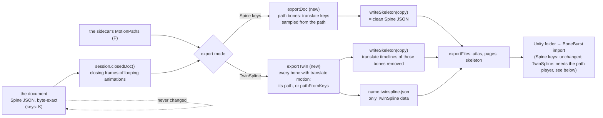

# Export to Unity: two modes, clean Spine keys or pure TwinSpline — plan

**Status: planned 2026-10-08; the owner answered E2–E8 "all recommended" the same day (see "Decided"). Step 0, the TwinSpline mode, is built (see "Result of step 0"); step 1, keys over a length, is built (see "Result of step 1"); steps 2–6 (the Spine keys mode that bakes paths into the export) are not. Revised the same day (the owner: "every bone we can bake to TwinSpline, add an option for export pure TwinSpline JSON").** This is step 8 of `TWO-SYSTEMS-PLAN.md`. The export gets a **mode**: **Spine keys** (clean JSON: a bone that uses a TwinSpline reaches Unity as translate keys made at export) and **TwinSpline** (pure: every bone that can be a path leaves as one, in a TwinSpline JSON file). Either way the work is done on the exported copy, never on the document.



**Two modes at a glance.**

| | Spine keys (clean) | TwinSpline (pure) |
|---|---|---|
| Files | atlas, pages, skeleton `.json` | the same, skeleton without those bones' translate timelines, plus `name.twinspline.json` |
| A bone with a path | translate keys sampled from it | its path, exact |
| A bone with translate keys only | its keys, as they are | converted with `pathFromKeys` (approximate, the stray is reported) |
| Unity | plays today, no change | needs the path player (a later plan; the file and its format are this plan's) |

## What was asked

> now try plan 8, export clean json to unity — plan md

## What is there today (checked on disk, 2026-10-08)

- `ui/unityExport.ts` `exportFiles(session, closed = true)`: the atlas and its pages, then `writeSkeleton(session.closedDoc())`, the skeleton last (so Unity's BoneBurst import rebakes the folder it baked before). `agent/unity.ts` (the AI's `export_to_unity`) and the toolbar's *Export to Unity…* both go through it.
- The export never looks at the sidecar. So **today a bone that uses its TwinSpline exports its translate keys, which the Motion Path panel now calls silenced**: Unity plays something the person is not looking at. That is the gap this plan closes.
- `ui/motion.ts` has the machinery to turn a path into keys: `keysFromPath` (a key where the bone reaches each node, one at the end of the run, more where the fitted curve strays, each segment's Bézier control values from `fitChannel`) and `edit/pathKeys.ts` (`translateKeys`, `writeTranslateKeys`, `deleteTranslateKeys`). It makes **one run, in whole frames, for the selected bone**; the export needs every path bone, over the animation's length, in seconds.
- Unity's side: `Packages/com.module.ta-creator-boneburst-import` reads Spine exports (`SkeletonJsonReader`, bake in `Module.TA.BoneBurstImport.Editor`); the editor's checks that an export survives it are `scripts/bake-check.ts` with `scripts/unity/BakeCheck.cs` (E8), `scripts/unity-parity.ts` and `scripts/daily-driver.ts`.

## The design

1. **The rule.** For each animation, each bone with a `MotionPath` in that animation whose `active` is not `false` is *a path bone*: in the exported copy its translate timelines (`translate`, `translatex`, `translatey`) are replaced by keys sampled from its path. Every other timeline of the bone, and every other bone, is left as the document has it. A bone using its key frames (no path, or `active: false`) exports its keys as they are. The path is never written.
2. **Clean means nothing extra.** The exported JSON has no new field, no `boneburst` block, no sidecar content: only what Spine's format has. A document with **no path bones exports byte for byte as it does today** (guarded by a test).
3. **The path's time over the animation.** In the editor the path has its own clock (`pathTime(m, t)`: starts over each run when `loop`, held at its end when not) and, played with Both, runs from 0 at the animation's start. The export uses that same mapping, `t_path = animation time`, over `[0, length]`: a looping path repeats along the animation, a non-looping one holds its last place.
4. **Keys, in seconds.** The sample is the path's point in the reference bone's space, through the key animation's pose of the reference bone at that time, into the bone's own parent's space (exactly `pathDrive`'s maths, so what Unity plays is what the Stage shows). Keys are made per run: at each node's arrival time, at the seam of each repeat, at the end of the animation, then more inside any stretch whose fitted Bézier strays more than the bake's tolerance (the existing `keysFromPath` rule), with the control values of each segment's fit. Times are exact seconds (`k × duration + arrival`), **not rounded to frames**, so a 0.5 s loop stays 0.5 s at any frame rate.
5. **Order with the closing frame.** `closedDoc()` runs first (it adds the closing frame of a looping animation to the keys that exist); the path bake then replaces the path bones' translate timelines, including a final key at the animation's end. When the animation's length is not a whole number of the path's runs the last repeat is cut: the seam at the loop point is a jump. The export says so (below) and does not change either length.
6. **The report.** The status line after *Export to Unity…* (and the AI tool's result) names what was baked: `N bones from their TwinSpline (M keys); K bones from their key frames`, and a warning for each path bone whose seam jumps ("`hips`: its 0.5 s path does not divide `run`'s 1.37 s, so the loop jumps").
7. **A plain file too.** *File ▸ Export Spine JSON…* writes the same clean JSON (the skeleton alone) through a Save dialog, for people who do not use the Unity folder: the same `exportDoc`, so there is one definition of "clean".
8. **The document and Save are untouched.** Save writes the document (keys, silenced or not) and the sidecar as today; only an export bakes.

## The TwinSpline mode (added 2026-10-08)

> every bone we can bake to TwinSpline, you must add an option for export: pure TwinSpline JSON.

1. **Which bones.** In an animation, every bone that has translate motion *and* can become a path: a bone with a path (used or set aside) exports that path exactly; a bone with translate keys and no path is converted with `pathFromKeys` (the one-time copy the ⋮ menu already makes: a node per translate key, a ring if it ends where it began, speeds from the timing). A bone `pathFromKeys` refuses (one key, no movement) stays as its keys and is listed. Bones with no translate motion, and every non-translate timeline (rotate, scale, shear, slots, deform, events, constraints), are left as Spine keys.
2. **Which source wins on a bone that has both.** The tab's choice (`active`) is honoured, as in the Spine keys mode: a bone set to Key frame is converted from its keys, a bone set to TwinSpline exports its path. The report names which.
3. **The skeleton file.** The same Spine JSON as the other mode, with those bones' `translate`, `translatex` and `translatey` timelines removed, so it still loads in any Spine runtime (the bones simply hold their setup pose without the file beside it). Nothing is added to it.
4. **The TwinSpline file** `name.twinspline.json`, pure: versioned, in seconds, one entry per animation and bone. It is the sidecar's `MotionPath` shape without editor state (no colours, no selection, no `active`):
   ```json
   { "twinspline": 1, "animations": { "run": { "hips": {
       "parent": "root", "duration": 0.8, "loop": true, "closed": true,
       "nodes": [ { "x": 0, "y": 0, "tx": 12, "ty": 0, "bx": -12, "by": 0, "speed": 0.0, "ss": 1, "sb": 1 } ] } } } }
   ```
   The fields are the ones `MotionPath` has (`src/model/sidecar.ts`), written by one function so the format has one definition; a reader in Unity (and a test that reads it back) is the guard.
5. **Accuracy.** An exported path is exactly what the Stage shows. A converted one is an approximation, so the report gives, per bone, how far the path strays from the keyed motion at worst (the figure `pathFromKeys` already computes), and a threshold above which the bone is **kept as keys** and listed instead (E7).
6. **Unity.** The skeleton imports as it does today. Playing a path needs a path player in BoneBurst (sample `pathPose(m, t)` on the bone's translate, one function ported from `src/motion/`, held to the editor by `scripts/path-parity.ts`). That is a separate plan and the owner's call (E8); until it exists the TwinSpline mode is for files read by that player and by tools, and the editor says so on the menu item.
7. **Where it is chosen.** *Export to Unity…* and *File ▸ Export Spine JSON…* each ask the mode (a small choice dialog, remembered in Preferences, default Spine keys). The AI's `export_to_unity` gets an optional `mode` (`"keys"` or `"twinspline"`, default `"keys"`; the contract version note changes, gated by `npm run check`).

## Steps

0. **TwinSpline mode** (after step 2 below, sharing `exportDoc`'s walk): `exportTwin(session)` returns the skeleton copy, the TwinSpline file's object and the report; `writeTwinSpline` serialises it (one definition of the format; `docs/SPEC.md` §3 points to it). Tests: the skeleton copy equals the document minus those bones' translate timelines; a path round-trips through the file byte for byte; a converted bone's reported stray equals `pathFromKeys`'s; an unconvertible bone stays as keys and is listed; a document with no translate motion writes an empty `animations` and the same skeleton as the Spine keys mode.
1. **`edit/pathKeys.ts` / `ui/motion.ts`: keys over a length.** `pathKeysOver(poser, doc, m, length)` returning `Key[]` (seconds, Bézier controls): the run's keys of `keysFromPath` generalised from frames to seconds and repeated. A table test: a 3-node ring over twice its duration repeats its first run; a non-loop path holds; a path that does not divide the length is flagged; a straight even path gives straight keys.
2. **`exportDoc(session)`** (`ui/unityExport.ts`, or a pure `edit/exportPaths.ts` taking the doc, the paths and a poser): `closedDoc()` plus the replacement of the path bones' translate timelines; returns the document and the report. `exportFiles` and the toolbar and AI paths use it. Test: no paths → byte-identical to `writeSkeleton(closedDoc())`; with a path → only the path bones' translate timelines differ (compare the JSON after removing them).
3. **The status line and the AI result** carry the report (`agent/unity.ts`'s note; the tool contract's version note is gated by `npm run check`, so the new text is a contract change to record).
4. **File ▸ Export Spine JSON…** (one menu item, one save dialog; the keys table, `shortcuts.ts`, if it gets one).
5. **Prove it in Unity** (by hand, with the Unity Editor and the `unity` CLI, as E8 did): export the stickman with a path on a bone, bake it with `scripts/bake-check.ts`, and compare Unity's pose at several frames with the editor's driven pose (`scripts/path-parity.ts` is the place; extend it with the driven pose of `Session.pose()` vs the exported keys sampled by the C# runtime, within 0.5 units). Not run until the owner has a Unity Editor open; the plan's status says so.
6. **Docs.** `SPEC.md` §5 (Reading and writing) gets the export rule; `TWO-SYSTEMS-PLAN.md` step 8 points here; the changelog on commit.

## What it touches

| Step | Files | Risk |
|---|---|---|
| 1 | `edit/pathKeys.ts`, `ui/motion.ts`, tests | medium: the key fit moves from frames to seconds; the existing Make keys from path must keep its output (its tests are the proof) |
| 2 | `ui/unityExport.ts`, a new pure module, tests | low: the byte-identity test guards the no-path case |
| 3 | `agent/unity.ts`, `agent/tools.json` note, `tests/fixtures/tools-v1.json` | low |
| 4 | `ui/app.ts` menu, `ui/files` | low |
| 5 | scripts, a Unity run | the only step that needs the Unity Editor |
| 0 | `ui/unityExport.ts`, a pure `edit/exportTwin.ts`, `ui/motion.ts` (`pathFromKeys` reused), `agent/unity.ts`, `agent/tools.json`, `tests/fixtures/tools-v1.json`, `docs/SPEC.md` §3 | medium: the file format is new public surface; the conversion reuses `pathFromKeys`, whose approximation is already reported |

Outside this project nothing changes: BoneBurst, M2-Creator-All and M2-Sample-25DL-Shader receive the same kind of file as before.

## Questions for the owner

1. **E1 (answered 2026-10-08): both.** Spine keys (clean, baked from the path) and TwinSpline (pure) are two modes of one export, chosen when exporting. Spine keys stays the default.
6. **E6: where the TwinSpline data goes.** (a) A separate `name.twinspline.json` beside the skeleton, the skeleton staying plain Spine (as above); (b) inside the skeleton JSON under a `twinspline` key (one file, but not clean Spine any more). **Recommend (a)**: "pure TwinSpline JSON" is a file that holds only TwinSpline, and the skeleton keeps loading everywhere.
7. **E7: a bone whose conversion strays too far.** (a) Keep it as keys and list it (the export still works); (b) convert anyway and warn; (c) refuse the export. **Recommend (a)**, with the threshold as a Preferences number (default 0.5 units, the same bound the parity checks use).
8. **E8: the Unity path player.** (a) Write it as the next plan (its own `Doc/Review` plan in the BoneBurst package, since BoneBurst's consumers M2-Creator-All and M2-Sample-25DL-Shader take that code live); (b) the mode ships first and Unity ignores the file until then. **Recommend (b) then (a)**: the file format is fixed by this plan, the player follows.
2. **E2: a path that does not divide the animation's length.** (a) Export it as it is and warn about the jump; (b) refuse the export; (c) stretch the path's last run to fit. **Recommend (a)**: the editor shows the same jump (the clocks are independent), so the export tells the truth.
3. **E3: keys in exact seconds or snapped to frames.** **Recommend seconds** (a looping 0.5 s path stays 0.5 s at any rate); the document's own keys stay as they are.
4. **E4: File ▸ Export Spine JSON… as well as the Unity folder.** **Recommend yes**: one function, one definition of "clean", useful beyond Unity.
5. **E5: should the export be refused or warn when a path bone's keys are also present?** Both exist by design now (the tab chooses). **Recommend neither**: the export follows the choice, and the report names which bones came from which.

## Decided 2026-10-08 (the owner: "all recommended")

E1 both modes (Spine keys is the default). E2 export a path that does not divide the animation's length and warn about the jump. E3 keys in exact seconds. E4 add File ▸ Export Spine JSON…. E5 follow the tab's choice and name each bone's source in the report. E6 the TwinSpline data in a separate `name.twinspline.json`, the skeleton staying plain Spine. E7 a conversion that strays too far keeps the bone as keys and lists it (threshold a Preferences number, default 0.5 units). E8 the mode and file format ship first; the Unity path player is a later plan in the BoneBurst package.

## Result of step 0 (2026-10-08): the TwinSpline mode

**Built and tested; the conversion of keyed bones is weak on real data (see "What the stickman showed").** Not run in Unity: nothing in Unity reads the file yet (E8).

- **`edit/exportTwin.ts`** (pure, in the edit layer): `exportTwin(doc, paths, convert, maxStray)` → the skeleton copy, the file's object and a report; `writeTwinSpline` / `parseTwinSpline` (the format's one definition, version 1, validated on read); `twinSummary` (the sentence the status line and the AI say). A bone with a path (`active` not false) exports it exactly, without the editor's node number; a bone with translate keys only goes through `convert`; one that `convert` refuses, cannot pose, or strays more than `DEFAULT_MAX_STRAY` (0.5 units) stays as keys and is listed with the reason. Only the exported bones lose their translate timelines.
- **`ui/motion.ts`**: `pathFromKeys` is now a wrapper over `pathFromKeysOf(session, animation, bone, parent, doc, refine?)`, which converts any bone of any animation (the export uses the closed document, so a loop's closing key is a node). With `refine` it adds nodes at the frame furthest from the path, up to 12, until within `refine` (the export asks for half the limit). The panel's own conversion does not refine; its output is unchanged. The keyed pose of each frame is posed once.
- **`ui/unityExport.ts`**: `exportBundle(session, closed, mode)` (files plus the note), `exportFiles` kept as its wrapper, `exportToUnity(session, gesture, choose, mode)`. `.bbdata` project saving still uses `exportFiles(session, false)` and is unchanged.
- **Where it is chosen.** Two File-menu items, not a dialog: **Export TwinSpline JSON…** (downloads the files) and **Export to Unity as TwinSpline…** (the Unity folder); the status line carries the summary. A dialog and a remembered mode would add a click to every export for the default case. The AI's `export_to_unity` has the optional `mode` (`"keys"` default, `"twinspline"`); the contract's version note lists it as a reshape of `export_to_unity` (merged into its existing line).
- **Differs from the plan.** (1) File ▸ Export Spine JSON… already existed (it downloads `exportFiles`), so E4 needed only the TwinSpline item beside it. (2) The stray limit is the constant `DEFAULT_MAX_STRAY`; the Preferences number E7 asks for is not built.
- **Guards.** `tests/exportTwin.test.ts` (5: own path exact and the copy minus translate timelines with the document untouched; conversion, kept-as-keys for refused, too far and no pose; the bone's choice; a quiet document gives an empty file and the same skeleton; the file reads back byte for byte and bad files say why), `tests/agentHost.test.ts` (the `mode` argument), `e2e/twinExport.spec.ts` (a path made on `head` on the stickman, File ▸ Export TwinSpline JSON…: the file has that path, the skeleton has no `head` translate keys, `run/hips` stays keys and is named, the document keeps its keys). `tests/contract.test.ts` holds the contract note. 810 vitest tests pass.

### What the stickman showed

Converting the stickman's keyed bones is **weak**: with nodes added at the worst frames, `run/hips` still strays 3.1 units (it was 4.6 before refining), the run's hand and foot targets 11–17, and the dance's hand targets 19; at the 0.5 limit none converts, so all ten stay keys and are listed. The causes are in what a path is, not in the fitting: a path cannot **pause** (a hold of one frame costs the bone's speed times that frame; speed is held to −0.99 and above), and a motion that **retraces** a line (hips bobbing up and down) or reverses sharply is a poor fit for a spline whose progress only moves forward. So the mode is exact for bones that have a path, and an honest "left as keys" for keyed motion that a path would only approximate. Whether to raise the limit (E7's Preferences number), make the conversion cleverer, or leave it, is for the owner.

Export time on the stickman (10 keyed bones, two animations): about 3 seconds, almost all of it the refinement; without refining the figures above are the same minus the 1.5 units gained.

## Result of step 1 (2026-10-08): keys over a length

**Built and tested; not yet used by any export** (step 2 wires it).

- **`ui/pathKeysOver.ts`** (pure): `keysOver(m, length, fps, place)` → `{ keys, stray, wholeRuns }`, keys in exact seconds with the Bézier control values of each stretch's fit. The path's time is the animation's time from 0 (a looping path starts over each run, any other holds its last place). A key where the bone reaches each node (`arrivalTimes`), at each repeat and at the end, then a key in the middle of any stretch whose fit strays more than `max(0.1, 0.002 × the path's length)`, down to stretches of two frames of `fps`, four levels deep. `place(time, x, y)` is the caller's: where the path's point lands in the bone's own parent's space.
- **Seams.** A ring just continues across a repeat. An open looping path jumps from its last place to its first: a key at the run's end `SEAM_GAP` (1 ms) before the repeat, a straight move to the key at the repeat, so Unity shows a jump, not a smear over the segment; an open looping path of a whole number of runs ends the same way. `wholeRuns` is false when the length is not a whole number of the path's runs (step 3 turns that into the warning).
- **`edit/pathKeys.ts`**: `TimedKey` and `translateKeysAt` (keys at exact times as offsets from the setup pose, curve controls at thirds); `translateKeys` (frames) now calls it, its output unchanged (the Make keys from path tests pass).
- **`ui/motion.ts`**: `pathKeysOver(poser, doc, skin, m, length, fps)` supplies `place` from the key animation's pose at each time; `pathDrive` and it share one function (`pathLocal`), so the export cannot drift from what the Stage shows.
- **Guards.** `tests/pathKeysOver.test.ts` (11): a ring over twice its duration repeats its first run; the keys' motion is the path's at every time; a path that does not loop holds; the whole-runs flag; a path longer than the animation is cut; an even straight path gives straight keys; the open path's jump and a ring's absence of one; `place` is the caller's; the written Spine keys; nothing for no length; and on the stickman an IK target following a ring in the hips' space matches `pathDrive` to 0.2 units at eight times. The deliberate bug (posing the key animation at time 0 for every sample) fails that test (12 units).
- **Not yet.** Nothing calls `pathKeysOver` outside tests; the document is not touched.
