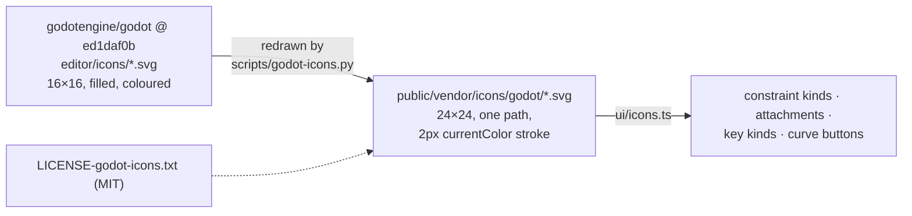

# Godot editor icons (subset, restyled)

Sixteen icons for the animation glyphs Lucide lacks, redrawn after Godot's editor icons
(E4-PLAN step 13a). Every file here was made by `scripts/godot-icons.py` from the original named
below, taken from Godot `4.7.2-stable`, commit `ed1daf0bf001b61586d9930840f2f1394092c079`, and from no other version.
Godot's `COPYRIGHT.txt` at that commit puts `editor/icons/` under its MIT (Expat) licence:
`LICENSE-godot-icons.txt`, © Godot Engine contributors.

Restyling: monochrome, one `<path>`, viewBox `0 0 24 24`, `fill="none"`,
`stroke="currentColor"`, `stroke-width="2"`, round caps and joins, the attributes Lucide's icons
use. Each is a derivative of its original and keeps Godot's MIT notice.
`tests/icons.test.ts` checks this list against the files.

| File | Original | Commit | Shows |
|---|---|---|---|
| `constraint-ik.svg` | `editor/icons/ChainIK3D.svg` | `ed1daf0bf001b61586d9930840f2f1394092c079` | an IK constraint |
| `constraint-transform.svg` | `editor/icons/RemoteTransform2D.svg` | `ed1daf0bf001b61586d9930840f2f1394092c079` | a transform constraint |
| `constraint-path.svg` | `editor/icons/PathFollow2D.svg` | `ed1daf0bf001b61586d9930840f2f1394092c079` | a path constraint |
| `constraint-physics.svg` | `editor/icons/SpringBoneSimulator3D.svg` | `ed1daf0bf001b61586d9930840f2f1394092c079` | a physics constraint |
| `constraint-slider.svg` | `editor/icons/HSlider.svg` | `ed1daf0bf001b61586d9930840f2f1394092c079` | a slider constraint |
| `mesh.svg` | `editor/icons/MeshInstance2D.svg` | `ed1daf0bf001b61586d9930840f2f1394092c079` | a mesh attachment |
| `bounding-box.svg` | `editor/icons/CollisionPolygon2D.svg` | `ed1daf0bf001b61586d9930840f2f1394092c079` | a bounding box attachment |
| `key-translate.svg` | `editor/icons/KeyTrackPosition.svg` | `ed1daf0bf001b61586d9930840f2f1394092c079` | translate keys |
| `key-rotate.svg` | `editor/icons/KeyTrackRotation.svg` | `ed1daf0bf001b61586d9930840f2f1394092c079` | rotate keys |
| `key-scale.svg` | `editor/icons/KeyTrackScale.svg` | `ed1daf0bf001b61586d9930840f2f1394092c079` | scale keys |
| `key-deform.svg` | `editor/icons/KeyTrackBlendShape.svg` | `ed1daf0bf001b61586d9930840f2f1394092c079` | deform keys |
| `curve-linear.svg` | `editor/icons/CurveLinear.svg` | `ed1daf0bf001b61586d9930840f2f1394092c079` | Linear |
| `curve-stepped.svg` | `editor/icons/CurveConstant.svg` | `ed1daf0bf001b61586d9930840f2f1394092c079` | Stepped (drawn as a step) |
| `curve-ease-in.svg` | `editor/icons/CurveIn.svg` | `ed1daf0bf001b61586d9930840f2f1394092c079` | Ease in |
| `curve-ease-out.svg` | `editor/icons/CurveOut.svg` | `ed1daf0bf001b61586d9930840f2f1394092c079` | Ease out |
| `curve-ease-in-out.svg` | `editor/icons/CurveInOut.svg` | `ed1daf0bf001b61586d9930840f2f1394092c079` | Ease in-out |
