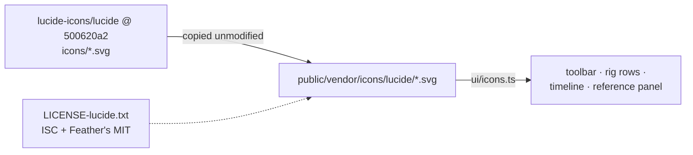

# Lucide icons (subset)

The interface's general icons, and the domain glyphs Lucide has (E4-PLAN step 13a), copied
unmodified from Lucide `1.52.0`, commit `500620a2e8123f8d1db191538886dc0c223f69a9`. Lucide is ISC, © Lucide Icons and Contributors;
the icons it took from Feather are MIT, © Cole Bemis. Both notices are in `LICENSE-lucide.txt`
(Lucide's `LICENSE` at that commit).

No npm package: only these files ship. `tests/icons.test.ts` checks this list against the
files.

| File | Lucide source | Used for |
|---|---|---|
| `folder-open.svg` | `icons/folder-open.svg` | Open… |
| `save.svg` | `icons/save.svg` | Save |
| `undo-2.svg` | `icons/undo-2.svg` | Undo |
| `redo-2.svg` | `icons/redo-2.svg` | Redo |
| `move.svg` | `icons/move.svg` | the Move tool |
| `rotate-cw.svg` | `icons/rotate-cw.svg` | the Rotate tool |
| `scaling.svg` | `icons/scaling.svg` | the Scale tool |
| `scan.svg` | `icons/scan.svg` | Fit |
| `settings.svg` | `icons/settings.svg` | Preferences |
| `arrow-up.svg` | `icons/arrow-up.svg` | up in a list |
| `arrow-down.svg` | `icons/arrow-down.svg` | down in a list |
| `trash.svg` | `icons/trash.svg` | Delete, Remove |
| `play.svg` | `icons/play.svg` | Play |
| `pause.svg` | `icons/pause.svg` | Pause |
| `skip-back.svg` | `icons/skip-back.svg` | to the first frame |
| `repeat.svg` | `icons/repeat.svg` | Loop |
| `image-plus.svg` | `icons/image-plus.svg` | Add image… |
| `diamond.svg` | `icons/diamond.svg` | Key |
| `bone.svg` | `icons/bone.svg` | a bone |
| `shirt.svg` | `icons/shirt.svg` | a skin |
| `square-dashed.svg` | `icons/square-dashed.svg` | a slot |
| `image.svg` | `icons/image.svg` | a region attachment |
| `link.svg` | `icons/link.svg` | a linked mesh |
| `spline.svg` | `icons/spline.svg` | a path attachment |
| `crosshair.svg` | `icons/crosshair.svg` | a point attachment |
| `scissors.svg` | `icons/scissors.svg` | a clipping attachment |
| `layers.svg` | `icons/layers.svg` | draw order keys |
| `bot.svg` | `icons/bot.svg` | the AI button (E5) |
| `folder-output.svg` | `icons/folder-output.svg` | Export to Unity… (E5) |
| `flag.svg` | `icons/flag.svg` | events (E6 step 4b) |
| `layout-dashboard.svg` | `icons/layout-dashboard.svg` | the activity bar's Stage button |
| `list-tree.svg` | `icons/list-tree.svg` | the activity bar's Rig button |
| `sliders-horizontal.svg` | `icons/sliders-horizontal.svg` | the activity bar's Properties button |
| `film.svg` | `icons/film.svg` | the activity bar's Timeline button |
| `shear.svg` | `icons/shear.svg` | the Shear tool (drawn in Lucide style) |
| `key-round.svg` | `icons/key-round.svg` | the Auto Key button |
