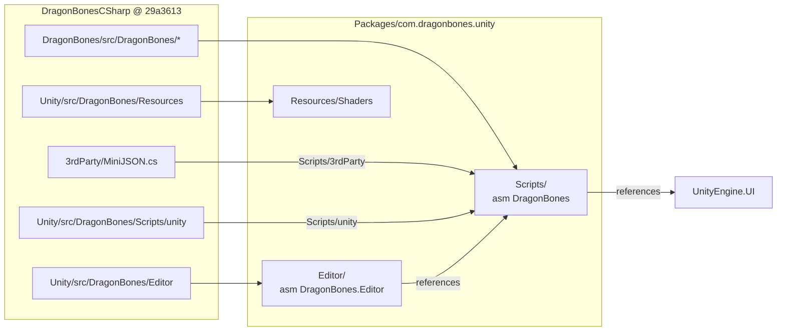

# Changelog: com.dragonbones.unity

This package is the DragonBones C# runtime for Unity, embedded from [DragonBones/DragonBonesCSharp](https://github.com/DragonBones/DragonBonesCSharp) `master` at `29a3613` (2026-05-08; runtime `VERSION` 5.6.300). Upstream is not a UPM package: its README says to copy three source folders into `Assets/`. This file lists everything done here beyond that copy, so it can be re-applied onto a newer upstream.

## Layout

Upstream's documented install layout is `Assets/DragonBones/{Scripts, Editor, Resources}`, with `3rdParty` and the Unity `unity` folder inside `Scripts`. The package keeps that layout at its root.

| Package path | Upstream source |
|---|---|
| `Scripts/animation`, `armature`, `core`, `event`, `factory`, `geom`, `model`, `parser` | `DragonBones/src/DragonBones/` |
| `Scripts/3rdParty/MiniJSON.cs` | `3rdParty/MiniJSON.cs` |
| `Scripts/unity/` | `Unity/src/DragonBones/Scripts/unity/` |
| `Editor/` | `Unity/src/DragonBones/Editor/` |
| `Resources/Shaders/` | `Unity/src/DragonBones/Resources/Shaders/` |
| `LICENSE.md` | `LICENSE` (MIT) |

The sources come from `src/`, not from the copy under `Unity/Demos/Assets/DragonBones`. That copy is older (4 files differ) and the demo project targets Unity 2017.1.

## Local changes

### Added: package files
- `package.json`: upstream has no package manifest. It depends on `com.unity.ugui` because `UnityUGUIDisplay` derives from `MaskableGraphic`.
- `Scripts/DragonBones.asmdef` (assembly `DragonBones`, all platforms, references `UnityEngine.UI`) and `Editor/DragonBones.Editor.asmdef` (assembly `DragonBones.Editor`, Editor only, references `DragonBones` and `UnityEngine.UI`). Upstream ships no asmdefs, and C# in a package is compiled only through one. The names follow the `DragonBones` namespace; they are vendor names, not `Module.*` tier names.

### Changed: `Editor/DragonBonesIcons.cs`: icon folder path
- **What:** `Initialize()` searched `Application.dataPath` (`Assets/`) for `DragonBonesIcons.cs` to find its `GUI/` icon folder. It now uses the fixed path `Packages/com.dragonbones.unity/Editor`.
- **Why:** under `Packages/` the search finds nothing, and `files[0]` throws `IndexOutOfRangeException` from an `[InitializeOnLoad]` static constructor on every domain reload.
- **Behavior:** unchanged apart from where the icons are loaded from.

### Changed: Editor calls to APIs Unity 6.6 removed (CS0619 errors)
Upstream targets Unity 2017–2018. Unity 6.6 turns its int instance-ID APIs into compile errors, so `DragonBones.Editor` did not compile. Each call now uses the direct replacement:
- `Editor/DragonBonesIcons.cs`: `EditorApplication.hierarchyWindowItemOnGUI` → `hierarchyWindowItemByEntityIdOnGUI`. `HierarchyIconsOnGUI(int instanceId, …)` → `(EntityId entityId, …)`. `EditorUtility.InstanceIDToObject` → `EditorUtility.EntityIdToObject`.
- `Editor/PickJsonDataWindow.cs` (1 call) and `Editor/UnityEditor.cs` (2 calls): `AssetDatabase.GetAssetPath(x.GetInstanceID())` → `AssetDatabase.GetAssetPath(x)`, which returns the same path.
- **Behavior:** unchanged.

### Not changed (warnings left as upstream ships them)
Upstream code still compiles with 8 warnings: CS0618 for `PrefabUtility.GetPrefabParent` and `GetPrefabObject` (in `UnityArmatureComponent.cs` and `UnityArmatureEditor.cs`), UAC1001 for non-serializable fields, CS0168 and CS0109. They are left alone to keep the diff against upstream small.
