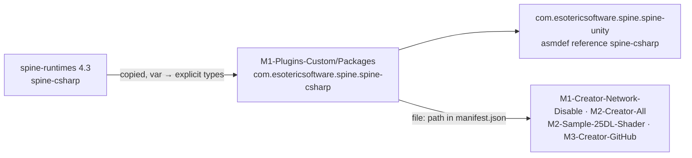

# Changelog

Local changes to this copy of [spine-csharp](https://github.com/EsotericSoftware/spine-runtimes/tree/4.3/spine-csharp), vendored at upstream `4.3.40` (`4.3` branch, commit `7ce5d0da`).
Everything below is local; re-apply it after copying a newer upstream over this folder, or drop it: none of it changes behaviour.

## Unreleased

### Changed — code style (2026-09-29, commit `80f4a755`)

IDE clean-up: `var` → the explicit type, per `CLAUDE.md`'s "no `var`" rule. No behaviour change; assembly name `spine-csharp` unchanged.

- `Animation.cs`, `AnimationState.cs`, `AnimationStateData.cs`
- `Attachments/MeshAttachment.cs`, `Attachments/Sequence.cs`
- `IkConstraint.cs`, `PathConstraint.cs`, `PhysicsConstraint.cs`, `TransformConstraint.cs`, `Slider.cs`
- `SkeletonBinary.cs`, `SkeletonJson.cs` (most of the diff: the timeline and constraint readers)

On an upgrade these lines conflict with upstream's `var` lines. Take upstream's file and redo the clean-up, or keep upstream's `var`: nothing depends on it.
