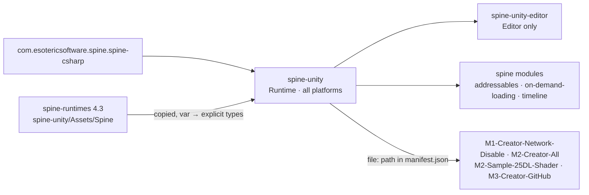

# Changelog

Local changes to this copy of [spine-unity](https://github.com/EsotericSoftware/spine-runtimes/tree/4.3/spine-unity/Assets/Spine), vendored at upstream `4.3.109` (`4.3` branch, commit `7ce5d0da`).
Everything below is local; re-apply it after copying a newer upstream over this folder. Only the `SkeletonRenderer.cs` guard is more than style.

## Unreleased

### Fixed — `using UnityEditor;` inside `#if UNITY_EDITOR` (2026-09-29)

`Runtime/spine-unity/Components/SkeletonRenderer.cs`: the clean-up below added `using UnityEditor;` to the unguarded block at the top of a runtime (all-platforms) file. It now sits in the `#if UNITY_EDITOR` block beside `using UnityEditor.SceneManagement;`. Its only user, `PropertyModification` in the prefab-mesh revert, is editor-only code already. The player compile passed without the guard as well (`playercompile.py`: `spine-unity` 0 errors both ways); the guard is `CLAUDE.md` §7.

### Changed — code style (2026-09-29, commit `3068ac83`)

IDE clean-up: `var` → the explicit type, per `CLAUDE.md`'s "no `var`" rule, and the `using` each new type name needs. No behaviour change; assembly names `spine-unity` / `spine-unity-editor` unchanged.

Usings added: `System.Reflection` (`ISkeletonRendererInspector.cs`), `System.Collections.Generic` (`SkeletonUtilityInspector.cs`), `UnityEditor.Build` (`BuildSettings.cs`), `Unity.Collections` (`SkeletonDataCompatibility.cs`, `NativeArray` — UnityEngine core, every platform), `UnityEngine.Rendering` (`SkeletonRenderSeparator.cs`), `UnityEditor` (`SkeletonRenderer.cs`, see above).

`Editor/spine-unity/Editor/`:

- `Asset Types/SkeletonDataAssetInspector.cs`
- `Components/ISkeletonRendererInspector.cs`, `SkeletonGraphicCustomMaterialsInspector.cs`, `SkeletonRendererCustomMaterialsInspector.cs`, `SkeletonUtilityBoneInspector.cs`, `SkeletonUtilityInspector.cs`
- `SpineAttributeDrawers.cs`
- `Utility/AssetUtility.cs`, `BuildSettings.cs`, `SpineEditorUtilities.cs`, `SpineHandles.cs`
- `Windows/ComponentUpgradeWarningDialog.cs`, `SkeletonBaker.cs`, `SkeletonDebugWindow.cs`, `SpinePreferences.cs`, `WorkflowMismatchDialog.cs`

`Runtime/spine-unity/`:

- `Asset Types/AtlasAssetBase.cs`, `SkeletonDataCompatibility.cs`
- `Components/Following/BoneFollower.cs`, `BoneFollowerGraphic.cs`, `PointFollower.cs`
- `Components/SkeletonRenderSeparator/SkeletonRenderSeparator.cs`, `Components/SkeletonRenderer.cs`
- `Components/SkeletonUtility/SkeletonUtility.cs`, `SkeletonUtilityBone.cs`
- `SkeletonDataModifierAssets/BlendModeMaterials/BlendModeMaterialsAsset.cs`
- `Threading/LockFreeWorkStealingWorkerPool.cs`, `LockFreeWorkerPool.cs`, `SkeletonUpdateSystem.cs`
- `Utility/AttachmentRegionExtensions.cs`, `SkeletonExtensions.cs`, `TimelineExtensions.cs`

On an upgrade these lines conflict with upstream's `var` lines. Take upstream's file and redo the clean-up, or keep upstream's `var`: nothing depends on it. Keep any `using UnityEditor…` in a runtime file inside `#if UNITY_EDITOR`.

`package.json` is upstream's: its dependencies (`com.unity.ugui` `1.0.0`, `spine-csharp` `4.3.36`) are minimums, and Unity 6000.6 resolves `2.6.0` / `4.3.40`.
