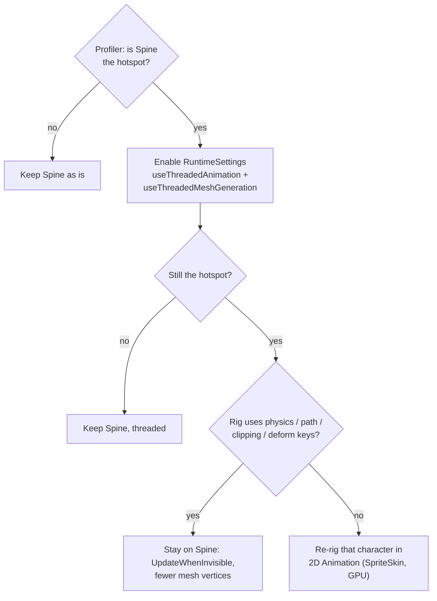

# spine-unity vs Unity 2D Animation — runtime comparison

Spine has the better **authoring** story (Spine Editor, meshes, deform keys, physics constraints, skins), but its Unity **runtime** is updated slowly and rebuilds every skeleton's mesh in managed C# on the CPU each frame. Unity's own `com.unity.2d.animation` (16.0.1, in `Library/PackageCache/com.unity.2d.animation@899988b542b9`) has the stronger runtime: Burst jobs, batched deformation and GPU skinning, shipped in lock-step with the Editor. This page records how the two runtimes actually work in the copies in this project, so the choice between them is made on the mechanism, not on reputation.

```mermaid
flowchart TD
    subgraph SPINE["spine-unity 4.3.109 (this fork)"]
        SA["SkeletonAnimation.Update<br/>AnimationState.Apply"] --> SK["Skeleton.UpdateWorldTransform<br/>spine-csharp · managed"]
        SK --> LU["SkeletonRenderer.LateUpdate"]
        LU --> MG["MeshGenerator.BuildMesh<br/>per skeleton · CPU"]
        MG --> MR["MeshRenderer<br/>Mesh re-uploaded each frame"]
        SUS["SkeletonUpdateSystem<br/>LockFreeWorkStealingWorkerPool"] -.->|"only if RuntimeSettings<br/>useThreaded* = true"| SK
        SUS -.-> MG
    end
    subgraph U2D["com.unity.2d.animation 16.0.1"]
        AN["Animator · Playables<br/>native, multithreaded"] --> TR["Bone Transforms"]
        TR --> DMU["DeformationManagerUpdater.LateUpdate<br/>order 10"]
        DMU --> DM["DeformationManager.Update"]
        DM -->|"Cpu"| CPU["CpuDeformationSystem<br/>Burst IJobParallelFor<br/>SkinDeformBatchedJob"]
        DM -->|"Gpu (URP)"| GPU["GpuDeformationSystem<br/>bone matrices only"]
        CPU --> SR["SpriteRenderer<br/>SRP Batcher · 2D Lights"]
        GPU --> SR
    end
```



## Where the frame time goes

| Stage | spine-unity (`Runtime/spine-unity`) | 2D Animation (`Runtime/`) |
|---|---|---|
| Animation sampling | `AnimationState.Apply` in C#, one call per `SkeletonAnimation` | `Animator` in native code, Playables graph, worker threads |
| Bone world transforms | `Skeleton.UpdateWorldTransform` in spine-csharp; bones are **not** `Transform`s | Real `Transform`s; read by `TransformAccessJob` (`IJobParallelForTransform`) |
| Vertex deformation | `MeshGenerator.BuildMesh` / `FillVertexData` — managed loop per skeleton | `SkinDeformBatchedJob<T>` — Burst, **batched across all `SpriteSkin`s** |
| GPU skinning | none — every vertex computed on CPU | `GpuDeformationSystem` (URP): only bone matrices uploaded |
| Change detection | none — mesh rebuilt each frame the renderer is visible | `BoneTransformsChangeDetectionJob` skips unchanged skins |
| Bounds | computed in `MeshGenerator` | `UpdateBoundJob` (Burst) |
| Threading | `Threading/SkeletonUpdateSystem.cs`, own lock-free worker pool — **off by default** | Unity Job System, always on |
| Renderer | `MeshRenderer` / `CanvasRenderer`; 2D Lights need `com.esotericsoftware.spine.urp-shaders` | `SpriteRenderer`; SRP Batcher and 2D Lights native |
| Profiling | `SPINE_ENABLE_THREAD_PROFILING` define | `Profiler/` module + `Animation2DProfilerMarkers` |

### The threading switch nobody has flipped

`Runtime/spine-unity/Utility/RuntimeSettings.cs` ships with:

```csharp
public bool useThreadedMeshGeneration = false;
public bool useThreadedAnimation = false;
```

Unless a project writes `Assets/Resources/SpineRuntimeSettings.asset` with those set (Spine Preferences does this), or sets `threadedMeshGeneration = SettingsTriState.Enable` per component (`SkeletonRenderer.Common.cs:137`), every skeleton updates on the main thread. `SkeletonUpdateSystem` is compiled in (`SPINE_DISABLE_THREADING` not defined) but idle. **This is the cheapest runtime win available without leaving Spine** — measure it before deciding anything else.

## Why the Spine runtime lags

- It is **engine-agnostic C#** (`com.esotericsoftware.spine.spine-csharp`) shared with MonoGame, XNA and Godot-C#. It cannot use Burst, `NativeArray` jobs or Unity's `Transform` hierarchy in its core without forking itself.
- Package floor is `"unity": "2018.3"`; new Unity-only APIs (GPU sprite skinning, `IJobParallelForTransform`, SRP Batcher hooks) are opt-in behind version defines, if at all.
- Upstream moves on Spine Editor release cadence, not Unity's. 2D Animation ships a fix list with each Editor minor (see its `CHANGELOG.md`, e.g. UUM-143004, UUM-147565).
- This fork is pinned at `4.3` commit `7ce5d0da` (`CHANGELOG.md`); updating means re-applying the local changes listed there.

## What 2D Animation does *not* give you

The runtime is better; the content pipeline is not a drop-in replacement.

- **No Spine importer.** `.skel` / `.json` + `.atlas` cannot be loaded by `SpriteSkin`. Rigs are rebuilt in the Skinning Editor (usually from a PSB via `com.unity.2d.psdimporter`).
- Missing or weaker: Spine **physics constraints**, **path constraints**, **transform constraints**, per-slot **deform timelines**, **skins with attachments swapped per slot** (Sprite Library / `SpriteResolver` covers part), **clipping attachments**, **mix/track blending** as `AnimationState` does it (Animator layers + blend trees instead).
- IK exists (`IK/` — `IKManager2D`, `LimbSolver2D`, `CCDSolver2D`, `FabrikSolver2D`), but runs as MonoBehaviours at order −10, not Burst.
- GPU deformation needs URP and a shader that supports it; `DeformationManager` falls back to CPU per renderer and logs a warning.

## Decision guide



1. **Profile first.** Look for `SkeletonRenderer.LateUpdate` / `MeshGenerator` vs `DeformationManager.Update` in the Profiler. No numbers were taken for this page.
2. **Turn on Spine threading** (above) — no content change, reversible.
3. Cut work Spine does not need: `UpdateMode` for off-screen skeletons (`ISkeletonAnimation.UpdateWhenInvisible`) and fewer mesh vertices in the Spine Editor.
4. **Mixed is fine.** Crowds, props and background characters with simple rigs → 2D Animation + GPU deformation. Hero characters with physics, clipping or heavy skin swaps → Spine.
5. Do **not** patch spine-unity's `MeshGenerator` for speed in this fork. Every line is a re-apply after the next upstream copy (`CLAUDE.md` §2); upstream threading already covers it.

## Consumers

Changing Spine runtime settings is per consuming project (the `SpineRuntimeSettings` asset lives in *their* `Assets/Resources`), not in this package. This page changes no code; it reaches M1-Creator-Network-Disable, M2-Creator-All, M2-Sample-25DL-Shader and M3-Creator-GitHub only as documentation.
