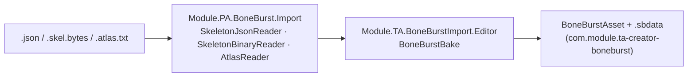

# Changelog

BoneBurst Import (`com.module.ta-creator-boneburst-import`) is BoneBurst's authoring side. `Module.PA.BoneBurst.Import` reads Spine 4.3 exports into Data's model, and `Module.TA.BoneBurstImport.Editor` is the bake that writes a `BoneBurstAsset` and its `.sbdata`. It is our own package; this file is its history. Players read only the baked data.

## 0.1.0 (2026-10-05)

### 2026-10-06 — **hostile files refused with a reason, never a crash: a JSON depth limit, draw-order offsets checked**
- **`Runtime/JsonNode.cs`**: `JsonNode.MaxDepth` (1000, the BoneBurst Editor's limit); the parser refuses deeper nesting with `nested deeper than 1000 levels`. JSON nested 100,000 deep overflowed the stack, which kills the process (in Unity, the Editor).
- **`Runtime/SkeletonJsonReader.cs` `DrawOrder`, `Runtime/SkeletonBinaryReader.cs` `ReadDrawOrder`**: every offset's slot is checked before the walk, and a slot moved twice, slots out of slot order, two slots to one place (and, binary only, a slot index outside the list or a target past it) are refused naming the slot. Each threw `IndexOutOfRangeException` before; stock spine-csharp crashes the same way, so no valid file reads differently.
- Why: the BoneBurst Editor's E7 step 5 findings H1 and H2 (`Editor-BoneBurst-Src/docs/E7-PLAN.md`). Plan: [BoneBurstImport-HostileFiles-Plan.md](Review/BoneBurstImport-HostileFiles-Plan.md).
- Guard: `HostileFileTests` (7; on the old readers the 4 draw-order cases throw `IndexOutOfRangeException` and the deep case overflows the stack, run on .NET with an NUnit shim); parity gate 215 of 215, 144,294,824 values bit-exact; offline compile (`tiercompile.py`) 0 errors; v2's `unity-parity.ts` 17 rigs, worst 0.0067. Import suite through the live Editor, 29 of 29 (a follow-up commit adds the two new files' `.meta`). **Not verified:** the binary guards by a test (only the binary corpus reading unchanged).

### 2026-10-06 — **the rebake's comment: the old editor archived at the tag `old-editor-final`** (comment only)
- `Editor/BoneBurstRebakeOnChange.cs`: its summary names only the BoneBurst Editor's (v2) Export to Unity. Its link to the pipeline plan now says the plan is at the git tag `old-editor-final`, because the old editor left `main` at E6 step 7 (`Editor-BoneBurst-Src/docs/E6-PLAN.md`, D8). Nothing compiles differently.

### 2026-10-06 — **the rebake's comment names the BoneBurst Editor (v2)** (comment only)
- `Editor/BoneBurstRebakeOnChange.cs`: its summary names `Editor-BoneBurst-Src/`'s Export to Unity as the export it rebakes (the old editor's File › Export to Unity still works the same way). Why: E6 step 5 moves the docs to v2 (`Editor-BoneBurst-Src/docs/E6-PLAN.md`). Nothing compiles differently.

### 2026-10-06 — **a baked export folder rebakes itself when its export changes: `BoneBurstRebakeOnChange`**
- **`Editor/BoneBurstRebakeOnChange.cs`**, an `AssetPostprocessor`: when a `.json`, `.skel.bytes`, `.atlas.txt` or `.png` is imported, its folder is rebaked after the import with its previous settings (as the asset's Rebake command), but only a folder baked before (`BoneBurstBake.WasBaked`, new); the first bake stays the popup. A broken export is a warning, a refused bake an error; the bake's own output starts nothing. Why: the BoneBurst editor's File › Export to Unity (`Animation-BoneBurst-Src/`) writes into an export folder, and its edits should reach the baked asset without the menus. Plan: `Animation-BoneBurst-Src/docs/BONEBURST-PIPELINE-PLAN.md` R4. Guard: `BoneBurstRebakeOnChangeTests` (4; with the watcher off, 2 fail); import Editor suite 22 of 22 through the live Editor. **Not verified:** the loop by hand from the editor (its folder picker is the user's). `FindSource_WithJsonAndItsBinaryTwin_TakesTheJson` swung from 13 s to a 185 s timeout across runs, with and without the watcher (stock spine-unity's importer).

### 2026-10-05 — **the bake writes the shader as a direct reference**
- `WriteAsset` takes a `Shader` and calls `BoneBurstAsset.SetShader(Shader)`; `ShaderReference(…)` and `ShaderOf` are deleted (callers read `asset.Shader`). The report names the shader on its own line instead of counting it among the AssetSystem references. Why and guards: `com.module.ta-creator-boneburst`'s changelog the same day ([BoneBurst-PlayerShader-Plan.md](../../com.module.ta-creator-boneburst/Doc/Review/BoneBurst-PlayerShader-Plan.md)). Import 18 of 18.

### 2026-10-05 — **licence repositioned: original work** (LICENSE + package.json only)
- Part of the repositioning logged in `com.module.ta-creator-boneburst`'s changelog the same day: `LICENSE` = owner's notice only (Spine Runtimes License text and derivative-work declaration removed), `licensesUrl` removed. No code change; readers stay export-only and 4.3-gated.

### 2026-10-05 — **IDE code cleanup** (format only)
- Part of the cleanup logged in `com.module.ta-creator-boneburst`'s changelog the same day. Guard: tiercheck PASS; parity gate 215 of 215, bit-exact; Editor compile 0 errors; import 18, Editor 426 (425 + 1 skipped), SpineUnity 24, timeline 14, play 37 (the pixel tests draw through the reformatted shaders), timeline play 13; no `var` and no XML-doc layout break added.

### 2026-10-05 — **renamed: `com.module.ta-creator-boneburst-import`, `Module.PA.BoneBurst.Import`, `Module.TA.BoneBurstImport.Editor`; the bake is `BoneBurstBake`**
- Part of the package-wide rename: plan [BoneBurst-Rename-Plan.md](../../com.module.ta-creator-boneburst/Doc/Review/BoneBurst-Rename-Plan.md). Guard: tiercheck PASS; parity gate 215 of 215, bit-exact; Editor compile 0 errors, no `*SpineBurst*` assembly left; suites unchanged (import 18, Editor 426 = 425 + 1 skipped, SpineUnity 24, timeline 14, play 37, timeline play 13); leftover scan: only allowlisted "spine" (vendor, `Tests.SpineUnity`, the Spine format in prose). **Not verified:** SmartAddresser Apply & Index (3 active `AssetSystem.db` rows keep their old paths), M2-Creator-All's compile (its Editor was closed), and a player `-loadBench`.

### 2026-10-05 — **package created: the export readers and the bake, moved out of `com.module.ta-creator-boneburst`**
- The readers (`SkeletonJsonReader`, `JsonNode`, `SkeletonBinaryReader`, `AtlasReader`) came from `Module.PA.BoneBurst.Data`. The bake (`BoneBurstBake`, `BoneBurstBakeMenu`, `BoneBurstBakePopup`, `BoneBurstBakeSettings`, `BoneBurstDrop`) and its tests came from BoneBurst's Editor and test assemblies. Namespaces and GUIDs are unchanged. M2-Creator-All takes the package by `file:` path for its bake. Plan: [BoneBurstImport-Plan.md](Review/BoneBurstImport-Plan.md).
- Guard: tiercheck PASS; parity gate 215 of 215 with 144,294,824 values bit-exact; Editor 426 (425 + 1 skipped: 436 − 18 moved bake tests + 8 new layout cases), import 18 of 18, SpineUnity 24, timeline 14, play 37, timeline play 13; M2-Creator-All recompiles with 0 errors and resolves the bake from the new assembly. **Not verified:** the benchmark's `json_first_use` row in a release player (compiled only).
