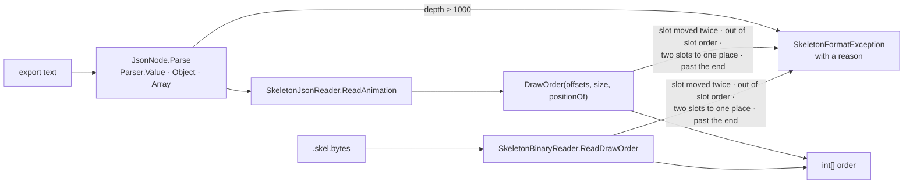

# BoneBurst Import — hostile files refused with a reason, never a crash

**Status:** not verified in Unity (2026-10-06): the code is done, and the gates that run outside Unity pass. Left: the import suite through the live Editor (no Editor was open), the `.meta` files Unity makes for the new test file and this plan, and a commit with its changelog entry (§12).

The BoneBurst Editor's (v2) E7 step 5 ran its hand-made hostile files through this package's JSON reader
(`Editor-BoneBurst-Src/docs/E7-PLAN.md`, "Step 5 — hostile files", findings H1 and H2). Two inputs crash it instead
of throwing a `SkeletonFormatException`: a draw-order key that moves one slot twice (`IndexOutOfRangeException` in
`SkeletonJsonReader.DrawOrder`), and JSON nested 100,000 deep (a stack overflow in `JsonNode.Parser`, which kills the
process: in Unity, the Editor). This plan makes both a refusal with a reason. The package matched: both readers live
in `Module.PA.BoneBurst.Import`, so the work and this plan belong here.

## Decisions

- **Refuse, not repair.** v2's engine keeps the first move (`orderFromOffsets`) and its profile reports the file as
  damaged; this reader refuses, as it already refuses an offset past the end. A reader that guesses would bake a
  draw order nobody authored, and stock spine-csharp crashes on the same input, so there is no stock behaviour to
  match. The message names the slot.
- **The whole precondition, not only the reported case.** The stock algorithm assumes the offsets list each slot at
  most once, in slot order, and that no two land on one place. Each broken assumption crashes the same way: a slot
  listed twice or listed before an earlier one (`while (original != position)` runs past the array), and two slots
  moved to one place (one hole too many, `unchanged[--u]` below 0). All three are refused.
- **The binary reader too.** `SkeletonBinaryReader.ReadDrawOrder` is the same algorithm over slot indices and crashes
  the same way (it also has no bounds check on the target). Same guards, same messages, slot named by index.
- **Depth limit 1000**, as v2 (`Editor-BoneBurst-Src/src/io/json.ts` `MAX_DEPTH`). The parser counts depth on entry to
  `Object` and `Array` and refuses past 1000 with its usual `JSON line N:` message. A real export nests under 10.
- **Valid files are untouched.** The guards only add checks on paths that crashed before; the parity gate shows the
  orders of valid files did not move.

## Steps

1. `Runtime/JsonNode.cs`: a depth counter in `Parser`; refuse past `MaxDepth` (1000).
2. `Runtime/SkeletonJsonReader.cs` `DrawOrder`: refuse a slot out of order or listed twice, and two slots to one
   place.
3. `Runtime/SkeletonBinaryReader.cs` `ReadDrawOrder`: the same guards, plus the target bounds check the JSON side
   already has.
4. `Tests/Editor/HostileFileTests.cs` in `Module.TA.BoneBurstImport.Tests.Editor`: each case throws
   `SkeletonFormatException` (and its message names the cause); 1000 levels still parse; a valid draw order still
   reads. Confirm the new cases fail on the old code.
5. Gates: harness `--dump` on both files (refused with a reason), `parity-harness`, compile and the import suite
   through the live Editor.

## Results

1. **Done.** `JsonNode.MaxDepth` = 1000; `Parser.Enter()` counts a level on `{` / `[` and refuses past it with
   `JSON line N: nested deeper than 1000 levels.`; the closing bracket counts it back down.
2. **Done, changed from the plan.** The first version checked each slot as the walk reached it. The new test
   `DrawOrder_SlotsOutOfSlotOrder_IsRefused` showed that is too late: for `c` then `a`, the walk to `c` already
   overflows `unchanged`, before `a` is read. So `DrawOrder` now checks every position first (strictly increasing:
   equal → "moves slot s twice", lower → "lists slot s after a slot that follows it"), then walks. A move to a place
   already taken → "moves slot s to a place another slot takes".
3. **Done.** `ReadDrawOrder` reads all (index, offset) pairs first, in the same byte order as before, then the same
   checks, plus a slot index outside the list and the target bounds check the JSON side already had.
   **Not tested:** no binary file with a broken draw order is built by a test; the binary corpus still reads (gate).
4. **Done.** `Tests/Editor/HostileFileTests.cs`, 7 tests. Run on .NET against the readers at `HEAD` and the new ones
   (a scratch build with an NUnit shim, since no Editor was open): on the old code the 4 draw-order cases throw
   `IndexOutOfRangeException` and the deep case kills the process ("Stack overflow."); the 2 controls pass. On the
   new code, 7 of 7 pass.
5. Harness `--dump`: the two hostile files now say `JSON skeleton (4.3.0): draw order moves slot shin_far twice` and
   `JSON line 1: nested deeper than 1000 levels.` `parity-harness` gate: 215 of 215, 144,294,824 values, 0 not
   bit-exact (run after the last change). Offline compile (`tiercompile.py --only` both touched assemblies): 9 of 9,
   0 failed, the new test file included. v2's `unity-parity.ts`: 17 rigs, worst 0.0067 (tolerance 0.01).
   **Not run:** the import suite in the Editor (`unity status`: no instance).
