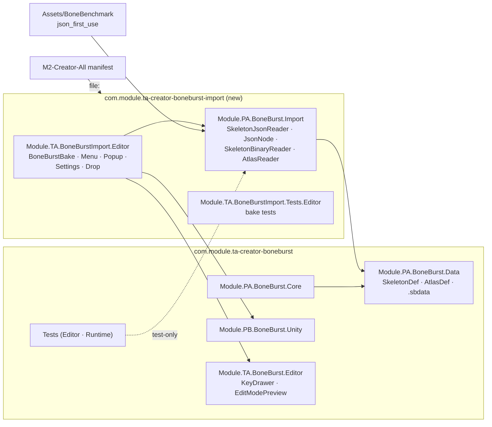

# BoneBurst Import — split the source readers and the bake into their own package

**Status:** done (2026-10-05). Left: nothing; not committed yet (the changelog entry goes in with the commit, §12).

The Spine source-format readers (`SkeletonJsonReader`, `JsonNode`, `SkeletonBinaryReader`, `AtlasReader`) sit in
`Module.PA.BoneBurst.Data` beside the baked format, although no runtime path reads a Spine export: a player reads
`.sbdata` through `BoneBurstDataReader`. Their callers are the bake, the tests and the benchmark's `json_first_use`
row. This plan moves them, together with the bake that is their only production caller, into a new embedded package
`com.module.ta-creator-boneburst-import`. The bake has to move with them: if the readers moved alone, BoneBurst's
Editor assembly would reference a package that depends on BoneBurst, a package cycle (owner's choice, 2026-10-05).

## What moves

| From (`com.module.ta-creator-boneburst`) | To (`com.module.ta-creator-boneburst-import`) |
|---|---|
| `Runtime/Data/SkeletonJsonReader.cs`, `JsonNode.cs`, `SkeletonBinaryReader.cs` | `Runtime/` (`Module.PA.BoneBurst.Import`) |
| `Runtime/Data/AtlasReader.cs`: the `AtlasReader` class | `Runtime/AtlasReader.cs`. `AtlasDef`, `AtlasPageDef` and `AtlasRegionDef` stay in Data, in a new `AtlasDef.cs`: baked data holds them |
| `Editor/BoneBurstBake*.cs`, `BoneBurstDrop.cs` | `Editor/` (`Module.TA.BoneBurstImport.Editor`) |
| `Tests/Editor/Bake/*` | `Tests/Editor/` (`Module.TA.BoneBurstImport.Tests.Editor`) |

Namespaces stay the same (`BoneBurst.Data`, `BoneBurst.Editor`, `BoneBurst.Tests`) (§4). Moves use `git mv` with
their `.meta` files, so GUIDs are kept. Nothing serializes these types: `BoneBurstBakeSettings` is only ever a
transient `CreateInstance`, and no asset carries any of the moved script GUIDs.

## Steps

1. Create the package: `package.json` (unity 6000.6; depends on `com.module.ta-creator-boneburst` 0.1.0 and
   `com.module.pb-creator-base`), `LICENSE` (the Spine licence, copied), `Doc/`.
2. `git mv` the files listed above; split `AtlasReader.cs`.
3. asmdefs:
   - `Module.PA.BoneBurst.Import` → Data, Unity.Mathematics. Data's `AssemblyInfo` gains the `InternalsVisibleTo`
     entries the readers need (`CurveBaker`, …).
   - `Module.TA.BoneBurstImport.Editor` → the old bake references + Import. Data, Core and Unity also gain the
     `InternalsVisibleTo` entries the bake used under `Module.TA.BoneBurst.Editor`.
   - BoneBurst `Tests.Editor`, `Tests` (play) and the timeline `Tests` / `Tests.Editor` → add Import. This is a
     test-only reference back from the dependency to the new package; tests compile only in M0.
4. Parity harness `ParityHarness.csproj`: compile the new `Runtime/**/*.cs`.
5. `BoneBurstAssemblyLayoutTests`: Import may reference Data only. Core and Unity must not reference Import.
6. M2-Creator-All `Packages/manifest.json`: add the new package by `file:` path, so its bake keeps working.
   M2-Sample-25DL-Shader does not bake and is left as it is.
7. Docs: CLAUDE.md package table and diagram; the BoneBurst plan pointers.

## Verification

- `tiercheck.py`: 0 cycles, no upward edges.
- Live Editor recompile is clean. Editor suite (435 + 1 skipped before the move) plus the moved bake suite give the
  same total; SpineUnity 24; play 37; timeline 14 / 13. A count of 0 fails.
- Parity harness: 215.
- M2: refresh and recompile with no errors.

## Result (2026-10-05)

- Steps 1–7 done as planned. Changes from the plan:
  - The bake tests use `DeepComparer` (internal, in `Module.TA.BoneBurst.Tests.Editor`). So
    `Module.TA.BoneBurstImport.Tests.Editor` references that assembly and is listed in its `InternalsVisibleTo`,
    the same arrangement `Tests.SpineUnity` already uses.
  - `Module.TA.BoneBurst.Tests.SpineUnity` (`MeshGeneratorParityTests`) also reads atlases, so it references Import too.
  - The new Editor assembly references `Module.TA.BoneBurst.Editor`, kept as planned; the tier gate accepts TA → TA.
  - The Editor did not see the new embedded package until `PackageManager.Client.Resolve()` ran; a plain
    `AssetDatabase.Refresh()` was not enough.
- Guard:
  - tiercheck PASS (0 cycles, 0 upward edges).
  - Parity gate PASS: 215 of 215, 144,294,824 values bit-exact.
  - M0 Editor: BoneBurst 426 (425 + 1 skipped). That is 436 − 18 bake tests + 8 new layout cases.
  - Import 18 of 18 (the moved bake suite), SpineUnity 24, timeline 14, play 37, timeline play 13.
  - M2-Creator-All: recompiles with 0 errors and `BoneBurstBake` resolves from `Module.TA.BoneBurstImport.Editor`.
  - Not built: a release player. `json_first_use` in `BoneBenchmarkLoad` now reaches the readers through the
    auto-referenced Import assembly; it compiled, but no player has run it.
