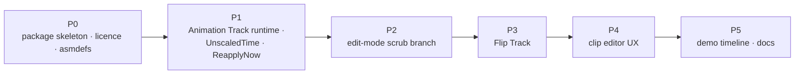

# Changelog

BoneBurst Timeline (`com.module.ta-creator-boneburst-timeline`, assemblies `Module.TB.BoneBurstTimeline` + `.Editor`) is our own package; this is its history. The plan, with per-phase state, is [Review/BoneBurstTimeline-Plan.md](Review/BoneBurstTimeline-Plan.md); the licence position is [Licence.md](Licence.md).

## 2026-10-05

- **Licence repositioned: original work** — `LICENSE` = owner's notice only (Spine Runtimes License text and derivative-work declaration removed), `licensesUrl` removed, description no longer says "port". Part of the repositioning logged in `com.module.ta-creator-boneburst`'s changelog the same day; see [Licence.md](Licence.md). No code change.
- **IDE code cleanup** (format only; logged in `com.module.ta-creator-boneburst`'s changelog the same day). Timeline 14 of 14, play 13 of 13.
- **Renamed: `com.module.ta-creator-boneburst-timeline`, `Module.TB.BoneBurstTimeline` (+ `.Editor`, `.Tests`, `.Tests.Editor`), namespace `BoneBurst.Timeline`, `BoneBurst*` tracks and clips** (part of the package-wide rename; plan [BoneBurst-Rename-Plan.md](../../com.module.ta-creator-boneburst/Doc/Review/BoneBurst-Rename-Plan.md)). Timeline 14 of 14, play 13 of 13.
- **Both test assemblies reference `Module.PA.BoneBurst.Import`**, where the export readers moved (the tests load the demo skeleton from JSON). Plan: [BoneBurstImport-Plan.md](../../com.module.ta-creator-boneburst-import/Doc/Review/BoneBurstImport-Plan.md). Timeline 14 of 14, play 13 of 13.

## 2026-10-02

- **References follow BoneBurst's assembly split**: the runtime and both test assemblies reference `Module.PA.BoneBurst.Data`, `.Core` and `Module.PB.BoneBurst.Unity` in place of `Module.TA.BoneBurst`; the editor assembly only the front. No code change. Plan: `com.module.ta-creator-boneburst/Doc/Review/BoneBurst-AssemblySplit-Plan.md`. Guard: timeline EditMode 14 of 14, PlayMode 13 of 13.

## 0.1.0 (2026-10-01)

First version, written phase by phase against the plan; all phases landed the same day.

- **P0** — package skeleton (`TB Creator BoneBurst Timeline`, deps: BoneBurst 0.1.0, Timeline 6.6.0), both runtime asmdefs, `LICENSE` (derivative work of the Spine Runtimes, like BoneBurst), and two enablers in the BoneBurst package: `InternalsVisibleTo` and the key drawer's `template.Asset` fallback.
- **P1** — Animation Track (Track/Clip/Behaviour/Mixer/Lookup): event-driven clip starts ported from spine-unity's mixer (weight edges, two-clips-one-frame ordering, ease-in, thresholds, pause/end semantics, root-speed lookup), clips pick animations by baked key and resolve against the bound skeleton; BoneBurst gained `BoneBurstSkeleton.UnscaledTime` and `BoneBurstSystem.ReapplyNow` (same-evaluation pose). Tests: mixer unit tests + same-evaluation pose test (fails with `ReapplyNow` stubbed), parity harness 191 of 191 bit-exact, BoneBurst PlayMode 34 of 34.
- **P2** — edit-mode scrub branch: the playhead clip pinned on the real state at the clip's time, posed by the existing zero-delta preview driver; play-path tests moved into the PlayMode suite (the edit gate requires it); a rebuild-drops-the-scrub test pins the no-leak property.
- **P3** — Flip Track (capture/greatest-weight/empty-space/stop semantics, `GatherProperties`, same-evaluation flips).
- **P4** — editor UX: clip asset filled from the track binding on create/change/rebind, mismatch flagged as clip error text (Timeline 6.6 has no `ClipEditor.DrawInspector`); track colours. The scrub crossfade approximation stays out, as planned.
- **P5** — demo timeline `Assets/BoneBurstDemo/Timeline/BoneBurstDemo.playable` (idle → walk crossfade, unscaled run overlay at alpha 0.6, a flip clip; director on the demo's CPU spineboy, play on awake) and a director-driven PlayMode test over an in-memory timeline of the same shape — real director, crossfade at the overlap, mix completion ending the from-entry like stock, entry time at the clip's position, flip applied. This README.
- Suite state at release: timeline EditMode 14 of 14, PlayMode 13 of 13; BoneBurst suites and harness re-run green.
