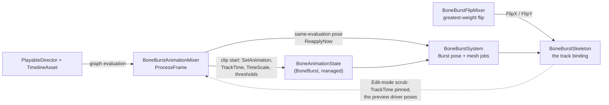

# BoneBurst Timeline

Unity Timeline tracks for BoneBurst skeletons: play and mix animations on a chosen animation-state track index, flip the skeleton over a clip's extent, per-track unscaled time. A behaviour port of spine-unity's timeline extension (`com.esotericsoftware.spine.timeline`, studied at 4.3.24) onto our runtime's architecture. Plan and state: [Review/BoneBurstTimeline-Plan.md](Review/BoneBurstTimeline-Plan.md).

The mixer is **event-driven, like spine-unity's**: it applies a clip when its weight rises from zero (or the timeline seeks) and then lets the system advance the animation on the game clock, at the clip's and the director's speed. It does not re-sync the track time every frame.

## The tracks

**BoneBurst/Animation Track** (binds a `BoneBurstSkeleton`) — its clips play on one animation-state track index.

- *Track Index* — which animation-state track the clips play on. Order timeline tracks base (index 0) at the top, overlay tracks below.
- *Unscaled Time* — set on the skeleton whenever a clip of this track starts, so that track plays in unscaled game time. `PlayableDirector.UpdateMethod` is ignored in favour of this, per track.
- *Clip: Animation* — the baked animation key, picked from the skeleton's asset (the popup fills itself from the track's binding). An empty key sets the empty animation instead.
- *Loop, Event/Attachment/Draw Order Threshold, Alpha* — the stock `TrackEntry` settings, applied when the clip starts.
- *Custom Duration / Use Blend Duration / Mix Duration* — the crossfade into this clip: from the timeline clip's blend-in duration when Use Blend Duration is on, else the field; without a custom duration the asset's mix for the animation pair applies (`BoneBurstAsset` DefaultMix / Mixes).
- *Don't Pause with Director* — keep advancing when the director pauses (normally the timeline's entry freezes with it).
- *Don't End with Clip / End Mix Out Duration* — at the clip's end normally mix out to the empty animation with this duration; below 0 pause instead; with Don't End with Clip on, keep playing.

**BoneBurst/Flip Track** (binds the same `BoneBurstSkeleton`) — flips X and/or Y while a clip has weight. The clip with the greatest weight wins; when the empty space around the clips outweighs every clip, the flip the skeleton had when the track started shows; the timeline stopping restores that flip.

## Usage

1. A `BoneBurstSkeleton` and a `PlayableDirector` in the scene (the demo: `Assets/Scenes/BoneBurstDemo.unity`, director on *Girl CPU (Unlit, run)*, timeline `Assets/BoneBurstDemo/Timeline/BoneBurstDemo.playable`).
2. In the Timeline window: right-click a track row › *BoneBurst › Animation Track* (or Flip Track), and drag the skeleton onto the track's binding field.
3. Right-click the track's dopesheet › *Add BoneBurst Animation Clip*, pick the animation key, set timing; drag clips into each other to crossfade (keep *Use Blend Duration* on so the overlap sets the mix length).

## Behaviour notes

- Clip starts apply in the **same evaluation** (the system re-poses the one skeleton through the same Burst job path a scheduled frame uses), so a clip's first pose lands on its boundary frame, as spine-unity's does.
- Scrubbing in the Timeline window poses the real animation state at the playhead's clip time through the existing zero-delta Editor preview driver; **no crossfade is approximated while scrubbing** — the clip under the playhead shows as it is. Check mixes in Play mode.
- Edit-time mutation cannot leak into Play mode: entering Play rebuilds every skeleton from its serialized fields.
- A key the bound skeleton does not have logs one warning and the previous animation keeps playing; a clip whose asset disagrees with the binding is kept (variant workflows) and flagged on the clip.
- Animations started outside the timeline are never paused or mixed out by it — the mixer only touches entries it started itself.
