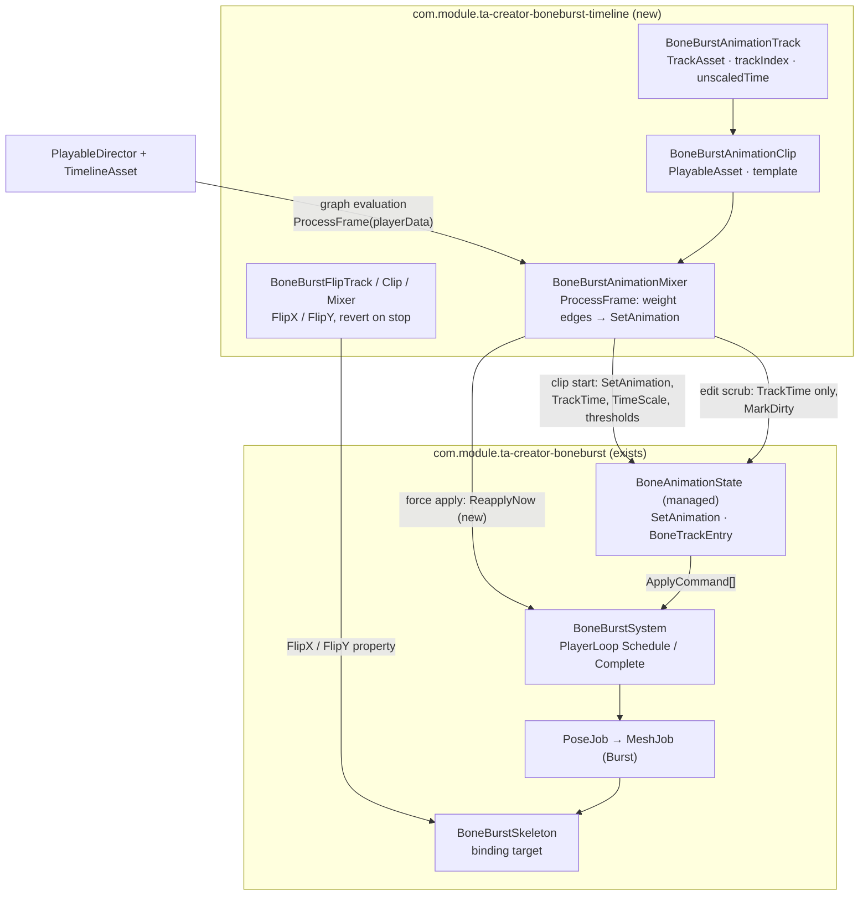

# BoneBurst Timeline — plan

**Status:** plan written 2026-10-01. **P0 done 2026-10-01** (package skeleton: `package.json`, `LICENSE`, `Doc/`, both asmdefs; `InternalsVisibleTo` and the `BoneBurstKeyDrawer` `template.Asset` fallback in the BoneBurst package, both in its `Doc/CHANGELOG.md`; tiercheck and compile green). **P1 done 2026-10-01** (Animation Track runtime: Track/Clip/Behaviour/Mixer/Lookup in `Runtime/Animation/`, `BoneBurstSkeleton.UnscaledTime` and `BoneBurstSystem.ReapplyNow` in the BoneBurst package; tests EditMode 8 of 8, PlayMode 3 of 3 — the same-evaluation pose test fails with `ReapplyNow` stubbed out on purpose; parity harness 191 of 191 bit-exact, BoneBurst PlayMode 34 of 34; tiercheck and compile green). **P2 done 2026-10-01** (edit-mode scrub branch: the mixer's `PreviewEditModePose` pins the playhead clip on the real state at the clip's time and marks the instance dirty for the existing zero-delta preview driver — no dummy state, no crossfade approximation; with the edit gate in place the play-path mixer tests moved into the PlayMode suite and the EditMode suite became the scrub tests, incl. a pose check through the driver tick that fails with the `TrackTime` pin removed on purpose, and a rebuild-drops-the-scrub test standing in for the planned P→E→P no-leak test, which no runner can cycle; suites EditMode 7 of 7, PlayMode 11 of 11; no BoneBurst runtime change, so no harness run). **P3 done 2026-10-01** (Flip Track family: `BoneBurstFlipTrack` (binding `BoneBurstSkeleton`, `GatherProperties` registering the binding's serialized leaves so the Timeline window restores the flip after an edit-mode preview), `BoneBurstFlipClip`/`Behaviour` (`ClipCaps.None`, flipX/flipY), and `BoneBurstFlipMixer` — a port of stock's mixer: original flip captured on the first frame, greatest-weight clip wins, the original shows when the empty space outweighs every clip, `director.stopped` and `OnStop` restore it; the flip is only written when it changes, and in play mode a change is posed in the same evaluation through `ReapplyNow` (also on stop). Tests: flip weight/capture/stop/driver in EditMode, a same-evaluation mesh-mirror test in PlayMode that fails with the `ReapplyNow` call removed on purpose; suites EditMode 11 of 11, PlayMode 12 of 12; compile and tiercheck green; no BoneBurst runtime change). **P4 done 2026-10-01** (editor UX: `BoneBurstAnimationClipEditor` fills a clip's empty `template.Asset` from the track's bound skeleton on clip creation, on clip change, and on track/binding change (`BoneBurstAnimationTrackEditor.OnTrackChanged`), and a clip whose asset disagrees with the binding keeps it and shows the mismatch as its error text — Timeline 6.6 has no `ClipEditor.DrawInspector`, so the warning moved from a HelpBox to `ClipDrawOptions.errorText`, a deviation from plan §6 forced by the installed API; track editors set spine-unity's track colours, no icons authored. The scrub crossfade approximation stays skipped, as plan §5 allowed. Tests: three EditMode unit tests of the sync helpers over a real `TimelineAsset` + `PlayableDirector` binding — fill-once, keep-different, no-binding-no-fill; suites EditMode 14 of 14, PlayMode 12 of 12; compile and tiercheck green. The manual pass in the Timeline window is the owner's). **P5 done 2026-10-01** (demo timeline `Assets/BoneBurstDemo/Timeline/BoneBurstDemo.playable` — idle → walk crossfade over a 0.4 s overlap on track 0, an unscaled `run` overlay on track 1 at alpha 0.6, a `flipX` clip; `PlayableDirector` on *Spineboy CPU (Unlit, run)* with play-on-awake and all three bindings; created through a safety-checked Editor snippet, existence-wins, scene saved clean, verified by reloading the asset and bindings. Interactive live validation was blocked by the Editor refusing play-mode entry after a script-triggered play cycle (a wedged editor state, not a code path — the editor loop ran, the player loop did not), so end-to-end validation went into a director-driven PlayMode test over an in-memory timeline of the same shape instead: crossfade at the overlap with the asset's default mix, the finished mix ending the from-entry as stock does, entry time at the clip's position, flip applied — 1 of 1. `Doc/README.md` and `Doc/CHANGELOG.md` written; CLAUDE.md carries the package row and diagram node. Final suites: timeline EditMode 14 of 14, PlayMode 13 of 13; BoneBurst EditMode 395 passed + 1 ignored of 396, PlayMode 34 of 34.) **All phases P0–P5 done.** What is left for the owner: the manual pass in the Timeline window (press Play in the demo scene and watch the CPU spineboy), and restarting the Editor if it still refuses play-mode entry. Source studied: `Packages/com.esotericsoftware.spine.timeline` (upstream spine-unity timeline extension, vendored 4.3.24) and `Packages/com.module.ta-creator-boneburst` (our runtime, `Module.TA.BoneBurst`). Target: a new sibling package `com.module.ta-creator-boneburst-timeline` that gives BoneBurst skeletons the same Timeline workflow spine-unity has.

`com.module.ta-creator-boneburst-timeline` (displayName `TB Creator BoneBurst Timeline`) provides **Unity Timeline tracks that drive `BoneBurstSkeleton` through `BoneAnimationState`**, porting the behaviour of spine-unity's timeline extension to our runtime's architecture. Two track types are planned: an **Animation Track** (set/mix animations on a chosen `BoneAnimationState` track index, per-clip mix durations, thresholds, alpha, pause/end semantics, unscaled time) and a **Flip Track** (flip X/Y over a clip's extent, revert on stop). The clip picks animations by **baked key** (`BoneBurstKey`, the same popup the skeleton component uses), not by `AnimationReferenceAsset`. The integration is event-driven exactly like stock's: the mixer calls `SetAnimation` when a clip's weight rises from 0 and lets the system advance time — it does not re-sync `TrackTime` every frame.



Frame order is the crux of the design (§3): `BoneBurstSystem.Schedule` runs in `Update`, Timeline evaluation runs in `PreLateUpdate.DirectorUpdate*`, and the system's `Complete` runs at the end of `PreLateUpdate`. A `SetAnimation` issued by the mixer therefore lands *after* this frame's pose pass, so the package needs one small addition to the runtime — `BoneBurstSystem.ReapplyNow` — the equivalent of stock's `skeletonAnimation.Update(0); Renderer.LateUpdate();`.

---

## 1. What we take from `com.esotericsoftware.spine.timeline`

Studied at upstream 4.3.24: `Runtime/BoneAnimationState/*` (track, clip, behaviour, mixer), `Runtime/SpineSkeletonFlip/*`, `Runtime/PlayableHandle Component/*`, `Editor/*`, `Documentation/README.md`.

**Adopted as-is (behaviour parity):**

- **The four-type track pattern.** `TrackAsset` (`[TrackClipType]`, `[TrackBindingType]`, serializes `trackIndex` + `unscaledTime`, hands each clip its `TimelineClip` in `CreateTrackMixer`) → `PlayableAsset` clip holding a serializable `template` behaviour, `clipCaps = Blending | ClipIn | SpeedMultiplier | (Looping)`, `duration` = the animation's duration → `PlayableBehaviour` with the per-clip settings → mixer whose `ProcessFrame` drives the runtime.
- **Weight-edge detection.** A clip "starts" when its input weight goes `0 → >0`, or on `info.seekOccurred` / `info.timeLooped`. Up to two clips may start on one frame; they are sorted so the one ending sooner is applied first (`startingClips` pair + swap by duration).
- **Clip-start application.** `SetAnimation(trackIndex, animation, loop)`; when there is no current entry and a custom mix is wanted, ease in via `SetEmptyAnimation(trackIndex, 0)` + `AddAnimation(…, 0)`. Then set `TrackTime = clipPlayable.GetTime()` (speed already included in clip time), `TimeScale = clipSpeed * rootPlayableSpeed`, `EventThreshold` / `MixAttachmentThreshold` / `MixDrawOrderThreshold` / `Alpha`, and `SetMixDuration(customMix / rootSpeed, 0)` for custom durations. Custom mix duration comes from the timeline clip's `blendInDuration`/`easeInDuration` when `useBlendDuration`, else the serialized `mixDuration`; otherwise the state data's pair mix (`GetMix(from, to)` / `DefaultMix`).
- **Empty clips.** A clip with no animation → `SetEmptyAnimation` (mix duration per the same rules).
- **Pause/resume with the director.** `OnBehaviourPause` zeroes the started entry's `TimeScale` (remembering the previous value); `OnBehaviourPlay` restores it. `dontPauseWithDirector` opts out per clip.
- **End-of-clip semantics.** When the last clip's weight falls to 0, or the graph stops without a pause (`OnGraphStop` while `graph.IsPlaying()`), `SetEmptyAnimation(trackIndex, endMixOutDuration)` — or pause the entry when `endMixOutDuration < 0`. `dontEndWithClip` opts out. Only an entry the timeline itself started is touched (`timelineStartedTrackEntry` identity), so external `SetAnimation` calls are never fought.
- **Root speed lookup.** `GetRootPlayableSpeed` walks multiple graph roots to find the one parenting this playable — copied verbatim in spirit, it makes `Director.timeScale` and manual speed changes work.
- **Error handling.** An animation the bound skeleton doesn't have logs a warning and the previous animation keeps playing (stock: "will do nothing"). A clip whose asset differs from the bound skeleton's warns once, as stock's `skeletonDataMismatch` check does.
- **Flip track shape.** Capture the current flip on the first frame, per frame apply the greatest-weight clip's flip, revert on graph stop (via `director.stopped` when the event exists), and `GatherProperties` so Timeline's edit-mode preview restores driven properties.
- **Docs shape.** `Doc/README.md` with one section per track: parameters, usage steps, track behaviour, known issues (stock's README is the model).

**Deliberately different (BoneBurst's architecture):**

| spine-unity timeline | this package | why |
|---|---|---|
| Binds `SkeletonAnimation` / `SkeletonGraphic` (two track types) | Binds `BoneBurstSkeleton` only | BoneBurst has one component type; no UI path exists |
| Flip track binds `SpinePlayableHandleBase` wrapper MonoBehaviours | Flip track binds `BoneBurstSkeleton` directly | The wrapper exists to unify two component types; we have one |
| Clip stores an `AnimationReferenceAsset` (ScriptableObject) | Clip stores `BoneBurstAsset Asset` + `BoneBurstKey Animation` | Reuses the baked-key popup the skeleton component already uses; no per-animation assets to generate |
| `skeletonAnimation.UnscaledTime` | new `BoneBurstSkeleton.UnscaledTime` flag | the system, not the component, advances time (§4) |
| Force-apply: `Update(0)` + `Renderer.LateUpdate()` | new `BoneBurstSystem.ReapplyNow(owner)` | posing runs in system jobs, not on the component (§3) |
| Edit preview: dummy `AnimationState` + direct `Animation.Apply` on the stock skeleton | Edit scrub: set `TrackTime` on the real state + `MarkDirty`; the existing edit-mode driver (`BoneBurstEditModePreview` → `Schedule(0)`/`Complete`) poses with no time passing | BoneBurst already runs frame-shaped in Edit mode; no dummy apply path is needed for single clips |
| `holdPrevious` serialized field kept "as safety" | dropped | beta posture, clean break (CLAUDE.md §3); no legacy timeline assets exist to migrate |

**Non-goals:** `SkeletonGraphic`/`SkeletonMecanim` equivalents (none exist), per-frame `TrackTime` scrub sync (stock parity: event-driven starts only), converting spine-unity timeline assets to BoneBurst ones, a Spine-event → Timeline marker/signal bridge (later, if wanted), any new `EditorWindow` (CLAUDE.md §8 — none needed; everything lives in the Timeline window's inspectors).

---

## 2. Package layout and assemblies

Folder and `name`: `com.module.ta-creator-boneburst-timeline`, displayName `TB Creator BoneBurst Timeline` (tier code `TB`: same tier `T` as BoneBurst, band `B` above it — a package that consumes `Module.TA.BoneBurst` may only sit at `TB` or higher, and `TB → TA` is a legal downward edge in `tiercheck.py`). Layout per CLAUDE.md §2: `Runtime/`, `Editor/`, `Tests/`, `Doc/` beside `package.json`.

```
Packages/com.module.ta-creator-boneburst-timeline/
  package.json                  deps: com.module.ta-creator-boneburst 0.1.0, com.unity.timeline 6.6.0
  Doc/
    Review/BoneBurstTimeline-Plan.md      (this file)
    README.md                              user doc, written in P5
    Licence.md                             Spine Runtimes licence, as BoneBurst ships (derivative work)
  Runtime/
    Module.TB.BoneBurstTimeline.asmdef    refs: Module.TA.BoneBurst, Unity.Timeline
    AssemblyInfo.cs                        (if needed; InternalsVisibleTo lives in BoneBurst's own AssemblyInfo)
    Animation/  BoneBurstAnimationTrack.cs · BoneBurstAnimationClip.cs ·
                BoneBurstAnimationBehaviour.cs · BoneBurstAnimationMixer.cs
    Flip/       BoneBurstFlipTrack.cs · BoneBurstFlipClip.cs ·
                BoneBurstFlipBehaviour.cs · BoneBurstFlipMixer.cs
  Editor/
    Module.TB.BoneBurstTimeline.Editor.asmdef   refs: Module.TB.BoneBurstTimeline, Module.TA.BoneBurst.Editor,
                                                  Unity.Timeline, Unity.Timeline.Editor; Editor-only
    BoneBurstAnimationTrackEditor.cs      icon + track colour (TrackEditor)
    BoneBurstAnimationClipEditor.cs       keeps the clip's Asset in sync with the track binding (ClipEditor)
    BoneBurstFlipTrackEditor.cs
  Tests/
    Editor/  Module.TB.BoneBurstTimeline.Tests.Editor.asmdef   refs: runtime + Module.TA.BoneBurst.Tests.Editor patterns
    Runtime/ Module.TB.BoneBurstTimeline.Tests.asmdef          PlayMode tests
```

Namespaces: `BoneBurst.Timeline` and `BoneBurst.Timeline.Editor` (BoneBurst's convention of one root namespace per package). Assembly names are load-bearing (`Module.TB.*`); run `python3 .claude/skills/assembly-tier-check/tiercheck.py` after creating them — expect 0 cycles, no new upward edges (`TB → TA` and `TB.Editor → TB, TA.Editor` are downward/same-code, both legal).

**Access to BoneBurst internals.** The mixer needs `BoneBurstSystem.MarkDirty`, `SetPlaying` and the new `ReapplyNow` — all `internal`. Add to `com.module.ta-creator-boneburst/Runtime/AssemblyInfo.cs`:

```csharp
[assembly: InternalsVisibleTo("Module.TB.BoneBurstTimeline")]
```

That follows the file's existing pattern (its `.Tests`, `.Tests.Editor`, `.Editor` entries) and keeps BoneBurst's public surface unchanged. The public API the mixer uses otherwise — `BoneBurstSkeleton.AnimationState`, `Asset`, `Data`, `FlipX/FlipY`, `BoneAnimationState.SetAnimation/AddAnimation/SetEmptyAnimation/GetTrack/ClearTracks`, `BoneTrackEntry` fields, `BoneAnimationStateData.GetMix/DefaultMix`, `BoneBurstAsset.NameOf/Keys/Blob` — is already public.

---

## 3. Frame order and `ReapplyNow` (the one runtime addition that matters)

Where things run today (verified in `BoneBurstSystem.Install` and Unity's PlayerLoop):

```
Update.ScriptRunBehaviourUpdate     gameplay sets animations
→ BoneBurstSystem.Schedule         state.Update(delta) → state.Apply → pose/mesh jobs scheduled
→ PreLateUpdate.DirectorUpdate*     PlayableDirector evaluates Timeline → mixer ProcessFrame
→ PreLateUpdate.ScriptRunBehaviourLateUpdate
→ BoneBurstSystem.Complete         jobs complete, meshes upload, events drain
```

So a `SetAnimation` from the mixer lands **after** this frame's pose pass: without help, every clip start (and every clip end's `SetEmptyAnimation`) takes effect one frame late, and a crossfade starts one frame after the timeline clip boundary. Stock spine-unity has the same order and hides it: the mixer calls `skeletonAnimation.Update(0)` + `Renderer.LateUpdate()` right after `SetAnimation`, applying the new entry's pose within the same evaluation.

**`BoneBurstSystem.ReapplyNow(BoneBurstSkeleton owner)`** (internal, new): pose and mesh one instance synchronously, with no time passing —

1. `CompleteNow()` — finish the frame's scheduled jobs (the later `Complete` becomes a no-op through `s_Scheduled`).
2. `state.Update(0)` — advance by zero; safe with pending delays (delta 0 never decrements them).
3. `state.Apply(owner.Buffer)`, `AppliedThisFrame = true`, copy commands into native memory (`owner.Header` already does this part).
4. Schedule `PoseJob` (+`MeshJob`/`GpuJob` as the instance's path requires) for this row only, complete, upload mesh, fire events (`AfterApply`).

The mixer calls it once per evaluation in which it started, ended or flipped something — clip boundaries, not per frame. Two constraints to respect in the implementation, with tests: it must be idempotent when two tracks bound to the same skeleton both trigger it in one evaluation, and events must fire exactly once per apply (the system's normal `Complete` path must not re-drain).

**Flip track and same-frame flips.** `FlipX`/`FlipY` only `MarkDirty`, which takes effect at the next `Schedule` — a frame late. The flip mixer sets the property and then calls `ReapplyNow`, so flips apply in the same evaluation as every other track's changes.

---

## 4. The Animation Track in detail

**Serialization model.** `BoneBurstAnimationBehaviour` (the clip template):

```csharp
public BoneBurstAsset Asset;                              // key-table source for the popup; also clip duration
[BoneBurstKeyOf(BoneBurstKeyKind.Animation)]
BoneBurstKey Animation;                                   // empty key = empty-animation clip
public bool Loop;
public bool customDuration, useBlendDuration;              // as stock
public float mixDuration = 0.1f;
public bool dontPauseWithDirector, dontEndWithClip;
public float endMixOutDuration = 0.1f;                     // < 0 pauses at clip end
[Range(0, 1f)] public float attachmentThreshold = 0.5f, eventThreshold = 0.5f,
    drawOrderThreshold = 0.5f, alpha = 1.0f;
```

The field is named `Asset` on purpose: `BoneBurstKeyDrawer` reads `serializedObject.FindProperty("Asset")` for its key list. Two editor details follow from that (§6): the drawer needs a fallback path for `template.Asset`, and the clip editor keeps `template.Asset` synced with the track's binding.

**Runtime resolution.** The mixer never resolves through the clip's `Asset` at play time — it resolves against the **bound skeleton**: `skeleton.Asset.Keys.TryGet(key.Id, out entry)` (kind must be `Animation`), then find the animation index by `entry.Name` in `skeleton.Data.Blob.Skeleton.Animations`. Missing key or name → `Debug.LogWarning` on the binding, previous entry untouched (stock's "error handling" behaviour). `BoneBurstAnimationClip.duration` reads `Asset.Blob.Content.Animations[i].Duration` when the clip's `Asset` resolves, else 0 — this is the only thing the clip's own `Asset` is for at runtime, and a mismatched one only makes the drawn clip length wrong, never the playback.

**Mixer behaviour.** A direct port of `SpineAnimationStateMixerBehaviour` (§1 lists every adopted mechanic). BoneBurst-specific substitutions: `BoneTrackEntry` for `TrackEntry`, `BoneAnimationStateData.GetMix(int, int)`/`DefaultMix` for `AnimationStateData.GetMix`, `skeleton.UnscaledTime = track.unscaledTime` on clip start, and `ReapplyNow(skeleton)` where stock calls `Update(0)` + `LateUpdate()`. The `SPINE_EDITMODEPOSE` edit branch is replaced by §5's.

**Unscaled time.** New public `bool UnscaledTime` on `BoneBurstSkeleton` (default false). `BoneBurstSystem.Schedule()`'s advance loop picks `Time.unscaledDeltaTime` vs `Time.deltaTime` per owner; `Schedule(float delta)` (the Edit-mode driver's zero path) is unchanged. As with stock, `PlayableDirector.UpdateMethod` is ignored in favour of the track's per-clip setting.

---

## 5. Edit-mode preview (Timeline window scrubbing)

`ProcessFrame` also runs at edit time when the Timeline window scrubs or previews. BoneBurst already poses Edit-mode skeletons through the real system with delta 0 (`BoneBurstEditModePreview` ticks `Schedule(0)`/`Complete` whenever `HasPendingWork`), so the mixer's edit branch is small:

1. Not `Application.isPlaying`: find the last input with weight > 0 (stock's `lastNonZeroWeightTrack`), resolve its animation as in §4.
2. `SetupPose()` when `trackIndex == 0` (stock does; keeps scrubbing deterministic).
3. Set the real state's entry directly: `SetAnimation(trackIndex, index, loop)` (or keep the existing entry if it already shows that animation), then `entry.TrackTime = clipTime`. No dummy `AnimationState` is needed because the jobs, not the mixer, apply the pose.
4. `MarkDirty` + ensure the instance is registered — the existing driver's next `EditorApplication.update` tick poses and meshes with zero delta and repaints the Scene view.

Crossfades while scrubbing a blend: v1 shows the to-animation only (stock itself warns "edit mode preview mixing may look different"); if it bothers anyone, set up a real `MixingFrom` chain with explicit `TrackTime`/`MixTime` and let the same zero-delta pass apply it — deferred to P4, not promised. Entering Play mode already detaches and rebuilds every instance (`BoneBurstEditModePreview.OnPlayModeChanged` → `Uninstall`), so edit-time mutation of the animation state cannot leak into play mode — that property is what makes this design safe, and a PlayMode test pins it.

---

## 6. Editor assembly

- **`BoneBurstKeyDrawer` fallback (change in `Module.TA.BoneBurst.Editor`).** The drawer's `FindProperty("Asset")` finds only root-level fields; on a clip the path is `template.Asset`. Extend `KeysOf` to fall back to `FindProperty("template.Asset")` (both are our code; note it in the package's review doc, no upstream-diff concern). Everything else about the drawer — popup of baked keys, "(missing)" retention — then works unchanged on clips.
- **`BoneBurstAnimationClipEditor` (`ClipEditor`).** When the track has a binding (`TimelineEditor.inspectedDirector.GetGenericBinding(track)`), keep `template.Asset` synced with the bound skeleton's `Asset`, so the key popup and clip duration are right without the user assigning anything. Draw a "not this skeleton's asset" warning when they disagree (mirrors the mixer's runtime warning).
- **Track editors.** `TrackEditor.GetTrackOptions` for track colour (animation: stock's `255,64,1`; flip: `0.855,0.8623,0.87`) and an icon (reuse an existing BoneBurst glyph if one exists; otherwise none — do not author new art for v1).

---

## 7. Tests and gates

Per phase, and per CLAUDE.md §5/§9: a deliberate bug must fail a test; a green run with a zero count is a failure. Skeletons come from `Packages/com.esotericsoftware.spine.spine-unity/Samples~` (spineboy-pro et al.), as BoneBurst's suites already do.

**EditMode (`Module.TB.BoneBurstTimeline.Tests.Editor`)** — build the graph manually (`PlayableGraph.CreateScriptPlayable` + `AnimationTrack.CreateTrackMixer` output), call `ProcessFrame` with synthetic weights:

1. weight `0→1` edge calls `SetAnimation` with the right animation index, `Loop`, `TrackTime` = clip time, `TimeScale` = clip × root speed; thresholds and `Alpha` land on the entry.
2. two clips starting the same frame apply shorter-end-first; the ease-in path (`SetEmptyAnimation(0)` + `AddAnimation`) triggers when there is no current entry and a custom mix is wanted.
3. empty key → `SetEmptyAnimation` with the custom/default mix; all weights to 0 → end semantics (`SetEmptyAnimation(endMixOutDuration)`, or `TimeScale = 0` when negative); external entries are never ended.
4. `OnBehaviourPause`/`OnBehaviourPlay` zero and restore `TimeScale` unless `dontPauseWithDirector`.
5. missing key / wrong asset → warning, previous entry untouched.
6. edit branch: scrub weights set `TrackTime` on the real state and leave the instance dirty (driver poses it).
7. flip mixer: greatest weight wins; original flip captured once and restored on stop.

**PlayMode (`Module.TB.BoneBurstTimeline.Tests`)** — a real `PlayableDirector` + timeline over a spineboy `BoneBurstSkeleton`:

1. director-driven pose: after N frames, the entry's `AnimationTime` tracks the clip position (tolerance for one frame of system delta, lockstep against a manually driven twin state as in BoneBurst's parity suites).
2. `ReapplyNow`: on the frame a clip starts, the posed skeleton already shows the new animation (the crux test for §3 — break `ReapplyNow`'s scheduling once and confirm this fails).
3. crossfade between overlapping clips ≈ an equivalent hand-driven `SetAnimation` mix, within the suites' size-scaled tolerance.
4. `UnscaledTime` track advances under a non-1 `Time.timeScale`.
5. flip applies in the same evaluation; graph stop reverts.
6. edit-mode mutations don't leak into Play (P→E→P cycle).

**Gates:** `tiercheck.py` after each asmdef lands; `Logs/Editor.log` after every code change; `playtest.py test --assembly Module.TB.BoneBurstTimeline.Tests[.Editor] --mode …` per suite; `parity-harness` before landing P1 — `ReapplyNow` and `UnscaledTime` edit `Module.TA.BoneBurst`'s `Runtime/`, and that gate runs on any change there.

---

## 8. Phases

| Phase | Deliverable | Tests |
|---|---|---|
| **P0** | Package skeleton: folder, `package.json`, both runtime asmdefs (+ empty folder placeholders), `Doc/Licence.md`; `InternalsVisibleTo` + `BoneBurstKeyDrawer` fallback in the BoneBurst package; tiercheck green, `Logs/Editor.log` clean | — |
| **P1** | Animation Track runtime (play mode): Track/Clip/Behaviour/Mixer port, key resolution, `UnscaledTime`, `ReapplyNow`, end/pause semantics | EditMode 1–5; PlayMode 1–3; parity-harness |
| **P2** | Edit-mode preview: scrub branch, driver integration, no-leak guarantee | EditMode 6; PlayMode 6 |
| **P3** | Flip Track family + `GatherProperties` + same-frame flip | EditMode 7; PlayMode 5 |
| **P4** | Editor UX: clip editor (asset sync + warning), track colours/icons; scrub crossfade if still wanted | manual pass in the Timeline window |
| **P5** | Demo timeline in `Assets/BoneBurstDemo` (a director on the demo spineboy: two crossfading clips, a flip clip, an unscaled track), `Doc/README.md`, `CHANGELOG.md`, CLAUDE.md package-table row | full suites re-run |

P0–P3 are the deliverable core; P4–P5 are polish and can land afterwards in any order.

---

## 9. Recorded decisions

- **D1 — new sibling package, not a module inside BoneBurst.** Keeps `Module.TA.BoneBurst` free of a `Unity.Timeline` dependency and matches how stock ships timeline support as a separate package.
- **D2 — tier `TB`.** Same tier, band above `A`: `TB → TA` is a legal downward edge; `tiercheck.py` checks E/F pass with it.
- **D3 — clips store `Asset` + `BoneBurstKey`** rather than a new `AnimationReferenceAsset`-like ScriptableObject: one picker everywhere, no generated per-animation assets, and the key survives re-bakes the same way the component's fields do.
- **D4 — `InternalsVisibleTo`, not public API.** The mixer is first-party; BoneBurst's public surface stays as small as it is today.
- **D5 — event-driven sync (stock parity).** `TrackTime` is set at clip starts/seeks only; the system advances time between them. Per-frame re-sync was considered and rejected: it fights the system's own advancement and diverges from stock behaviour.
- **D6 — `ReapplyNow` (force-apply) is in scope from P1.** Without it every clip boundary is one frame late; stock's mixer force-applies for the same reason.
- **D7 — drop `holdPrevious`.** Stock keeps it only as serialized-value safety (its own comment says "remove later"); we have zero existing timeline assets to protect (CLAUDE.md §3).
