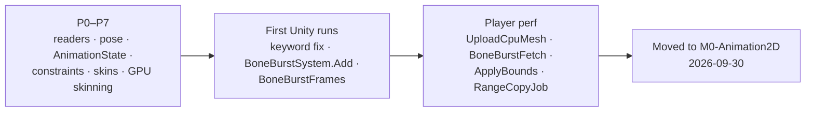

# Changelog

BoneBurst (`com.module.ta-creator-boneburst`, runtime assemblies `Module.PA.BoneBurst.Data` < `Module.PA.BoneBurst.Core` < `Module.PB.BoneBurst.Unity`; one assembly `Module.TA.BoneBurst` until 2026-10-02) is our own package, not a fork, so this is its history, not a list of changes to re-apply. Each entry is short; the measurements and evidence are in the dated sections of [BoneBurst-Plan.md](Review/BoneBurst-Plan.md) §9, and the test state is in [BoneBurst-TestReport.md](Review/BoneBurst-TestReport.md).

## 0.1.0 (2026-09-30)

### 2026-10-08 — **The MonoBehaviour front is kept as a sample; new work goes to `com.module.ta-creator-boneburst-ecs`** (docs only, no code changed)

Owner decision [D2-FrontPackageSample-Decision.md](Review/D2-FrontPackageSample-Decision.md): this package, the timeline package and the import Editor bake (which references the front) are frozen and get no new features; `-core` and the ECS package (in `M0-25DPlatformer-ECS`) are live; M2-Creator-All and M2-Sample-25DL-Shader stay on the frozen copy. The root `CLAUDE.md` says so in one line. Four points are left open for the owner in the decision (where the ECS plans live, whether the ECS package moves into M0, the editor's Unity proof, the two consumers). Nothing built or run.

### 2026-10-07 — **ECS port P14 recorded: pose system overlaps its header loop with the job, pose −22 to −27%** (docs only in this package; code is in `M0-25DPlatformer-ECS`)

Plan [BoneBurst-ECS-Plan.md](Review/BoneBurst-ECS-Plan.md) §24; [BoneBurst-ECS-Summary.md](Review/BoneBurst-ECS-Summary.md) updated. The frame job runs per chunk of headers, flushed as scheduled; at 2000 idle EcsGpu is 2.91 ms against MonoGpu 3.95. A new chunked-job test guards it (the deliberate bug crashed the Editor instead of failing cleanly). Batch size and the colour-space cache gave nothing; the animation system and IL2CPP are not covered.

### 2026-10-07 — **ECS port P13 recorded: CPU route vertex fetch, EcsCpu 25.8 → 4.85 ms at 2000 skeletons** (docs only in this package; code is in `M0-25DPlatformer-ECS`)

Plan [BoneBurst-ECS-Plan.md](Review/BoneBurst-ECS-Plan.md) §23; [BoneBurst-ECS-Summary.md](Review/BoneBurst-ECS-Summary.md) updated. The ECS CPU route now keeps vertices in one shared list (ring-uploaded) and draws topology-only meshes, 1.14× the mono CPU route at 2000 idle. Guarded by the fixture tests (deliberate bug failed 30) and Editor and player captures; per-mesh-upload fallback, platforms without vertex-shader structured buffers and IL2CPP not covered.

### 2026-10-07 — **ECS port summary written: all phases S0–P12 in one page** (docs only)

[BoneBurst-ECS-Summary.md](Review/BoneBurst-ECS-Summary.md) collects the architecture, every phase's result, the P12 same-backend numbers and what is left, from [BoneBurst-ECS-Plan.md](Review/BoneBurst-ECS-Plan.md). Not verified against the plan section by section.

### 2026-10-07 — **ECS port P12 recorded: same-backend comparison; ECS GPU route 5–20% faster than mono, ECS CPU route 6× slower** (docs only in this package; code is in `M0-25DPlatformer-ECS`)

Plan [BoneBurst-ECS-Plan.md](Review/BoneBurst-ECS-Plan.md) §22 (replaces the blocked check below). Both runtimes built as CoreCLR players on Unity 7000 (a mono benchmark harness in the 25D project) and run ABBA. Corrects §16 and §17: their EcsCpu numbers measured undrawn skeletons. Numbers carry the noise of another session's runaway processes; IL2CPP not compared.

### 2026-10-07 — **ECS port P12 checked: an IL2CPP ECS player cannot be built with this Editor** (docs only; no code changed)

Plan [BoneBurst-ECS-Plan.md](Review/BoneBurst-ECS-Plan.md) §21. Unity 7000.0.0a7 ships only CoreCLR macOS player variations; a like-for-like backend comparison needs a CoreCLR build of the MonoBehaviour benchmark, an IL2CPP module, or an Entities 6000.6 port. Not verified: nothing was built.

### 2026-10-07 — **ECS port P11 recorded: rim light on the ECS Lit2D shader, tint black and rim seen in a player** (docs only in this package; code is in `M0-25DPlatformer-ECS`)

Plan [BoneBurst-ECS-Plan.md](Review/BoneBurst-ECS-Plan.md) §20. Rim light (authoring fields, baked settings and masks, per-material rim, shader port) built; tint black checked on both routes with a dark-coloured spineboy written through Core's writer. Both match between Editor and a macOS player. Guarded by the on-screen check and `RenderMaterialTests`; painted masks, rotated regions and IL2CPP not covered.

### 2026-10-07 — **ECS port P10 recorded: CPU skeletons now draw, the default shader survives a player build** (docs only in this package; code is in `M0-25DPlatformer-ECS`)

Plan [BoneBurst-ECS-Plan.md](Review/BoneBurst-ECS-Plan.md) §19. A four-variant scene (GPU/CPU × Unlit/Lit2D) in the Editor and a macOS player showed that the render query skipped CPU-skinned skeletons and that the by-name default shader was stripped from the player; both fixed and seen drawing in the player. Not verified by a unit test (needs a graphics device); tint black, rim light and IL2CPP not covered.

### 2026-10-07 — **ECS port P9 recorded: skeleton render queue orders it against sprites** (docs only in this package; code is in `M0-25DPlatformer-ECS`)

Plan [BoneBurst-ECS-Plan.md](Review/BoneBurst-ECS-Plan.md) §18. A per-skeleton material render queue decides the draw order against sprites of the same sorting layer and order (checked on screen); a real sorting layer or order is not reachable through Entities Graphics and was not built. Not verified by a unit test: the render system needs a graphics device.

### 2026-10-07 — **ECS port P8 recorded: less shell overhead at small counts** (docs only in this package; code is in `M0-25DPlatformer-ECS`)
- [BoneBurst-ECS-Plan](Review/BoneBurst-ECS-Plan.md) §17: a per-system timer showed the managed shell at 1.1 of 1.7 ms at 500 idle skeletons; the steady animation shortcut, one frame job (pose, GPU record, CPU mesh) and staging without copies cut the frame time 7–12% at idle (100–2000) in alternating release-player A/Bs, with a better tail while switching; the rest is a fixed floor outside BoneBurst (0.30 ms for one skeleton against 0.19 for the MonoBehaviour runtime). 382 tests; deliberate bugs failed 29, 8 and 208. Core is unchanged by this step.

### 2026-10-07 — **ECS port P7 recorded: physics input, followers, idle skipping and the benchmark** (docs only in this package; code is in `M0-25DPlatformer-ECS`)
- [BoneBurst-ECS-Plan](Review/BoneBurst-ECS-Plan.md) §16: physics requests and movement inheritance, bone followers and idle skipping, each against the managed reference (309 tests; three deliberate bugs failed 2, 1 and 1). A benchmark player mirroring `BoneBenchmark` (same content, grid, seeds and switch sequence) ran alternating against the existing IL2CPP BoneBurst players: level at 2000 skeletons (ECS GPU 3.67 against mono GPU 3.49 ms idle), slower at 500 and below (1.70 against 1.00 at 500 idle) because of main-thread shell cost, which a lookup-based pass cut by 14–16% at 100–500. The backends differ (CoreCLR against IL2CPP) and the machine was not quiet; both are stated in the plan. Core is unchanged by this step.

### 2026-10-07 — **ECS port P6 recorded: CPU route, skin requests, tint black, Lit2D** (docs only in this package; code is in `M0-25DPlatformer-ECS`)
- [BoneBurst-ECS-Plan](Review/BoneBurst-ECS-Plan.md) §15: skeletons the GPU route cannot skin (deform, clipping) get a per-instance mesh on a CPU route that equals `ManagedPose.BuildMesh` frame by frame (48 fixture runs); skin and attachment requests, tint black on both routes, and a `BoneBurstEcs/Lit2D` shader seen lit by Light 2D. Four deliberate bugs failed 23, 6, 22 and 2 tests. **Not done:** vertex fetch, rim light, a player build. Core is unchanged by this step.

### 2026-10-07 — **ECS port P5 recorded: GPU skeletons drawn through Entities Graphics** (docs only in this package; code is in `M0-25DPlatformer-ECS`)
- [BoneBurst-ECS-Plan](Review/BoneBurst-ECS-Plan.md) §13 and §14: a DOTS-instanced shader derived from `BoneBurst/Unlit`, one render entity per submesh, materials per page and blend. Seen drawing on the URP 2D Renderer; 31 render entities gave 1 draw command (Entities Graphics' own counters); sorting against sprites works as Default layer, order 0, with no way yet to give a skeleton its own layer or order. **Not verified:** a player build and the 3D renderer's pass. Core is unchanged by this step.

### 2026-10-07 — **`RangeAllocator` moves to Core, and Core's internals open to the ECS assembly** (P5 step 1 of [BoneBurst-ECS-Plan](Review/BoneBurst-ECS-Plan.md))
- `RangeAllocator` moved from `Runtime/Gpu/BoneBurstGpu.cs` (Module.PB.BoneBurst.Unity) to `com.module.ta-creator-boneburst-core/Runtime/Core/Gpu/RangeAllocator.cs` (namespace unchanged) so the ECS GPU buffers share it; Core's `AssemblyInfo` lists `Module.PB.BoneBurst.Ecs` for `InternalsVisibleTo` (the instance's GPU fields). **Why:** one allocator, not a copy in each runtime. Behaviour unchanged: parity harness 215/215 and 0 values not bit-exact, tier check clean, `Module.TA.BoneBurst.Tests.Editor` 210/212 (the one failing test needs the demo's baked data, absent from this checkout), PlayMode 37/37. The ECS side's 229 tests in `M0-25DPlatformer-ECS` compare the GPU records, meshes and bounds with `ManagedPose.GpuFrame` frame by frame.

### 2026-10-07 — **ECS port P4 recorded: the animation state as unmanaged memory** (docs only in this package; code is in `M0-25DPlatformer-ECS`)
- [BoneBurst-ECS-Plan](Review/BoneBurst-ECS-Plan.md) §12: `BoneTrackState` ports `BoneAnimationState` into pointer-linked unmanaged memory. Guards: 72 seeded fuzz cases (24 fixtures × 3 seeds × 220 frames) give exactly the managed class's commands, modes, hold factors, rotation memory, unkeyed state and events, and three deliberate bugs failed 50, 72 and 67 tests. Core is unchanged; the managed class remains the oracle.

### 2026-10-07 — **`PoseStep` in Core and a `SkeletonBlob` over external arrays, for the ECS pose system** (P3 of [BoneBurst-ECS-Plan](Review/BoneBurst-ECS-Plan.md))
- **`Core/Instance/PoseStep.cs`** holds the pose order (setup pose when flagged, apply, world update) that `Jobs/PoseJob.cs` had inline; `PoseJob.Pose` now calls it. **`SkeletonBlob(content, in BlobView)`** wraps arrays owned elsewhere (an Entities BlobAsset): `View` returns the given view, nothing is copied or freed. **Why:** the ECS port poses with the same code over its own blob, and one pose order beats two copies. Behaviour of the MonoBehaviour runtime is unchanged. Guards: parity harness 215/215 and 0 values not bit-exact, Editor compile clean, `Module.TA.BoneBurst.Tests.Editor` 210/212 (the one failing test needs the demo's baked data, absent from this checkout), PlayMode 37/37; the ECS side's 125 tests in `M0-25DPlatformer-ECS` compare it with `ManagedPose` over 24 fixtures.

### 2026-10-07 — **ECS port P2 recorded: the skeleton data as an Entities BlobAsset** (docs only in this package; code is in `M0-25DPlatformer-ECS`)
- [BoneBurst-ECS-Plan](Review/BoneBurst-ECS-Plan.md) §10: `com.module.ta-creator-boneburst-ecs` converts Core's `BlobContent` into a `SkeletonBlobData` BlobAsset byte for byte and rebuilds Core's `BlobView` from it. Guards: 74 EditMode tests over 24 baked fixtures (a deliberate copy bug failed 48 of them) and a subscene bake checked by script. Core is unchanged.

### 2026-10-07 — **Data and Core move to their own package, `com.module.ta-creator-boneburst-core`** (P1 of [BoneBurst-ECS-Plan](Review/BoneBurst-ECS-Plan.md))
- `Runtime/Data` (`Module.PA.BoneBurst.Data`) and `Runtime/Core` (`Module.PA.BoneBurst.Core`) moved with their `.meta` files to `Packages/com.module.ta-creator-boneburst-core/Runtime/`. Assembly names, namespaces, GUIDs and `InternalsVisibleTo` lists are unchanged; the new package depends only on collections and mathematics. **Why:** the ECS port takes the pose core without this package's AssetSystem, UniTask and pb-creator-base dependencies, and a copy would break `CLAUDE.md` §4's single source of truth.
- `package.json` here and in `com.module.ta-creator-boneburst-import` list the core package; `Tools~/ParityHarness/ParityHarness.csproj` compiles Data and Core from it. M2-Creator-All and M2-Sample-25DL-Shader gain a `file:` entry for it in their manifests (M2-Sample's old, dead `M0-Animation2D` path is corrected).
- Guards: `BoneBurstAssemblyLayoutTests` (the two folder-ownership cases follow the move; new `CorePackage_DeclaresOnlyThePoseDependencies`). Checked: parity harness 215/215 and 0 values not bit-exact, tier check 0 cycles, Editor compile clean, EditMode `Module.TA.BoneBurst.Tests.Editor` 210/212 (1 skipped; 1 failing test needs the demo's baked `mix-and-match-pro.sbdata.bytes`, absent from this checkout and never in git), SpineCsharp 215/215, PlayMode 37/37, Timeline 14/14, Import 28/29 on the first run (a timeout; the fixture passes alone, 15/15). **Not verified:** M2-Creator-All and M2-Sample-25DL-Shader were not opened against the split.

### 2026-10-06 — **the old editor archived at the tag `old-editor-final`: the profile's note, the dump's comment** (docs and comments only)
- `Doc/Format/BoneBurst-Profile.md`: its 2026-10-06 note adds that the old editor and its pipeline plan are archived at the git tag `old-editor-final`. `Tools~/ParityHarness/Dump.cs`: the comment says the old editor's `tests/boneburstUnity.test.ts`, which reads the same dump, is at that tag. Why: E6 step 7 removed `Animation-BoneBurst-Src/` from `main` (`Editor-BoneBurst-Src/docs/E6-PLAN.md`, D8). Guard: v2's `scripts/unity-parity.ts` still reads the dump. Nothing compiles differently.

### 2026-10-06 — **the editor side is the BoneBurst Editor (v2): the profile's note, the dump's comments** (docs and comments only)
- `Doc/Format/BoneBurst-Profile.md`: a dated note that the editor side is now `Editor-BoneBurst-Src/` (the JSON itself, read and written exactly, held to this runtime by its `scripts/unity-parity.ts`); the diagram and the editor column describe the old editor. `Tools~/ParityHarness/Dump.cs` and `run.sh`: their comments name v2's script beside the old editor's test, both reading the same dump. Why: E6 step 5 (`Editor-BoneBurst-Src/docs/E6-PLAN.md`). Guard: v2's `scripts/unity-parity.ts` on the dump, all 17 corpus rigs agree. Nothing compiles differently.

Assets load from baked `.sbdata` data made by a right-click Editor bake, and parity with stock is proven bit for bit by a strict-float harness gate, with Editor suites that pass under Unity's Mono.

### 2026-10-05 — **the parity harness poses the BoneBurst editor's files: `run.sh --dump`**
- **`Tools~/ParityHarness/Dump.cs`**: `run.sh --dump <in> <out>` reads each Spine 4.3 export in `in` with `SkeletonJsonReader`/`AtlasReader`, plays every animation through `BoneAnimationState` + `ManagedPose` (0 s, then 0.0337 s a frame, physics updating) and writes every bone's world matrix, slot colour and attachment and the draw order per frame as JSON. Why: the BoneBurst editor (`Animation-BoneBurst-Src/`) compares it frame by frame with its own runtime (`tests/boneburstUnity.test.ts`, pipeline plan R2), so the editor's exports are held to the runtime the game ships; files cross, never code. Guard: 34 files match (the editor's exports, every spine-unity sample, every sample re-exported by the editor; worst 8.4e-4 matrix, 3.5e-5 of the rig's size); breaking the editor's IK by 0.1 % fails it; the harness gate stays 215 of 215 bit-exact. **Not verified:** the bake round trip of those files — the bake's name keys hash through `UnityEngine.PropertyName`, which .NET cannot call, so it needs `BakedDataTests` in the Editor.

### 2026-10-05 — **the BoneBurst profile of Spine 4.3 JSON** (docs only in this package)
- **[Format/BoneBurst-Profile.md](Format/BoneBurst-Profile.md)**: what both BoneBurst sides, this package and the editor in `Animation-BoneBurst-Src/`, require of a Spine 4.3 file, as an overlay on [Format-Json-Atlas.md](Format/Format-Json-Atlas.md) (which now links it): rules for every file, quoting `SkeletonJsonReader`'s errors; rules for files BoneBurst writes (`skeleton.hash`); where spine-csharp and spine-core disagree (`fps` default, event volume and balance, hash) and that BoneBurst follows spine-csharp; what each side does with each part. Why: the editor's export is what the bake reads, so the two must agree on one written contract. Plan: `Animation-BoneBurst-Src/docs/BONEBURST-PIPELINE-PLAN.md` R1. Guard, editor side: `profileIssues` catches each of 15 broken files, every spine-unity sample passes, every export of the editor's parity and import suites keeps to it (editor suite 2,188 passed). **Not verified:** no C# test cites the profile yet, and the C# reader still skips unknown timeline names silently (stock behaviour); no Unity run.

### 2026-10-05 — **players draw BoneBurst: the shader is a direct reference, and both shaders are Always Included**
- A release player drew no BoneBurst skeleton (`shader BoneBurst/Unlit not found`): the asset's shader was an unindexed AssetSystem reference (the shaders are package files, never addressable), and `Shader.Find`'s fallback had nothing in the build to find. Owner decisions: `BoneBurst/Unlit` and `BoneBurst/Lit2D` go into `ProjectSettings/GraphicsSettings.asset` *Always Included Shaders* (each consumer project needs the same two entries), and `BoneBurstAsset.m_Shader` becomes a plain `Shader` (option c), so a Lit2D asset keeps Lit2D in a player. `ShaderReference`, `SetShaderAsset` and the shader's AssetSystem load path are deleted; `SetShader(Shader)` and `Shader` replace them, and null still means Unlit. Every existing asset referenced Unlit, so the old value loading as null changes no look; M0's asset was written back explicitly. Plan: [BoneBurst-PlayerShader-Plan.md](Review/BoneBurst-PlayerShader-Plan.md). Guard: release player 0 `not found`, and BurstCpu `gpu_ms` 0.065 → 0.19 ms at 20 (it draws); Editor compile 0 errors; import 18, SpineUnity 24, timeline 14, play 37, timeline play 13. **Not verified:** a Lit2D asset in a player (M0 has none left); Editor 424 + 1 skipped with 1 failure, `DataReference_BuildsTheBlobThroughTheEditorCache_WithoutALoader`, whose data file is deleted by another session's uncommitted move to `Assets/Samples Custom/`.
- Docs: [BoneBurst-BurstTween-Evaluation.md](Review/BoneBurst-BurstTween-Evaluation.md) (BoneBurst should not use BurstTween; callers may), [BoneBurst-Perf3-Plan.md](Review/BoneBurst-Perf3-Plan.md) with C0, the first measurement at consumer scale ([BoneBurst-Performance.md](Review/BoneBurst-Performance.md) §2.5: stock wins at 1 skeleton, BoneBurst from 5; recommendation: drop C1).

### 2026-10-05 — **licence repositioned: original work, not a derivative work of the Spine Runtimes** (LICENSE + docs only)
- Owner decision. `LICENSE` now carries the owner's notice only — the Spine Runtimes License text and the derivative-work declaration were removed. `Doc/Licence.md` rewritten to the case-B position, with the previous case-A reasons recorded honestly and what still applies kept: Spine Editor licences for everyone who uses the editor; the vendored `com.esotericsoftware.spine.*` packages remain under Esoteric's own licence until M2 phase P9 (D1). Siblings `-import` and `-timeline` follow the same position. Recommended before any commercial ship: written confirmation from Esoteric. No code change.

### 2026-10-05 — **IDE code cleanup across the BoneBurst packages** (format only)
- An IDE cleanup over `com.module.ta-creator-boneburst`, `-import` and `-timeline`: usings sorted, explicit `private`, members reordered, long lines wrapped, and the shaders and `.hlsl` re-indented (some preprocessor-branch lines lost their indent, e.g. `tint=` in `BoneBurstCommon.hlsl`; whitespace only). No behaviour change intended. Guard: tiercheck PASS; parity gate 215 of 215, bit-exact; Editor compile 0 errors; import 18, Editor 426 (425 + 1 skipped), SpineUnity 24, timeline 14, play 37 (the pixel tests draw through the reformatted shaders), timeline play 13; no `var` and no XML-doc layout break added.

### 2026-10-05 — **the rename verified in a player** (docs only)
- After SmartAddresser Apply & Index, every active row has its `BoneBurstDemo` path, with no duplicate indices, and the demo assets' references match the database. A release IL2CPP player (`Build/macOS_BoneBenchmark_IL2CPP`) run with `-loadBench 20` loaded the baked data by key with no AssetRuntime refusal; all five rows ran, `json_first_use` included (the Import assembly works in a player). One row keeps its old path text (`mix-and-match-pro.sbdata.bytes`, bake-owned; lookups go by GUID and index, which match). Results in [BoneBurst-Rename-Plan.md](Review/BoneBurst-Rename-Plan.md). **Not verified:** M2-Creator-All and M2-Sample compiles.

### 2026-10-05 — **renamed: SpineBurst → BoneBurst ("Spine" → "Bone" in every name we own)**
- `SpineBurst` → `BoneBurst` in package names (`com.module.ta-creator-boneburst{,-import,-timeline}`), assemblies (`Module.PA.BoneBurst.Data`, …), namespaces, types, files, shaders (`BoneBurst/Unlit`, `BoneBurst/Lit2D`), keywords and menus; `SpineAnimationState(Data)` → `BoneAnimationState(Data)`, `SpineTrackEntry` → `BoneTrackEntry`, `SpineMath` → `BoneMath`. GUIDs kept (`git mv` with metas). "Spine" stays where it names Esoteric's product: the vendor packages, the Spine 4.3 format our readers parse, the licence. The `.sbdata` format (`SBDF`) is unchanged, so no rebake. M2-Creator-All and M2-Sample-25DL-Shader follow by `file:` path. Plan: [BoneBurst-Rename-Plan.md](Review/BoneBurst-Rename-Plan.md).
- Guard: tiercheck PASS; parity gate 215 of 215, bit-exact; Editor compile 0 errors, no `*SpineBurst*` assembly left; suites unchanged (import 18, Editor 426 = 425 + 1 skipped, SpineUnity 24, timeline 14, play 37, timeline play 13); leftover scan: only allowlisted "spine" (vendor, `Tests.SpineUnity`, the Spine format in prose). **Not verified:** SmartAddresser Apply & Index (3 active `AssetSystem.db` rows keep their old paths), M2-Creator-All's compile (its Editor was closed), and a player `-loadBench`.

### 2026-10-05 — **the Spine export readers and the bake move to `com.module.ta-creator-boneburst-import`**
- `SkeletonJsonReader`, `JsonNode`, `SkeletonBinaryReader` and `AtlasReader` leave `Module.PA.BoneBurst.Data` for `Module.PA.BoneBurst.Import`; `BoneBurstBake`, its menu, popup and settings, and `BoneBurstDrop` leave `Module.TA.BoneBurst.Editor` for `Module.TA.BoneBurstImport.Editor`; the bake tests go with them. Why: no runtime path reads a Spine export (a player reads `.sbdata`), so the runtime assemblies should not carry the parsers. The bake moves too, because readers alone would leave a package cycle. `AtlasDef`, `AtlasPageDef` and `AtlasRegionDef` stay in Data, now in `AtlasDef.cs`. Namespaces and GUIDs are unchanged. The test assemblies (Editor, SpineUnity, play) reference Import; the parity harness compiles the new package's `Runtime/`; `BoneBurstAssemblyLayoutTests` checks that Import references only Data and holds the readers. Plan: [BoneBurstImport-Plan.md](../../com.module.ta-creator-boneburst-import/Doc/Review/BoneBurstImport-Plan.md).
- Guard: tiercheck PASS; parity gate 215 of 215 with 144,294,824 values bit-exact; Editor 426 (425 + 1 skipped: 436 − 18 moved bake tests + 8 new layout cases), import 18 of 18, SpineUnity 24, timeline 14, play 37, timeline play 13; M2-Creator-All recompiles with 0 errors and resolves the bake from the new assembly. **Not verified:** the benchmark's `json_first_use` row in a release player (compiled only).

### 2026-10-03 — **BoneBurst loads through AssetSystem V2 (`AssetRuntime`)**
- `BoneBurstAsset` moves off the frozen `Module.PB.AssetSystem` (M2 D70): `using AssetRuntime`; `WaitForService` (an un-indexed reference is refused with its reason, then `AssetService.WaitForCurrentAsync(15 s)`) replaces `AssetManager.WaitForGroupAsync`, since V2 loads by GUID with no wrapper. `CanLoad` (Play Mode, with a service or an `AssetRuntimeHost`) replaces the loader-entry checks; an un-indexed shader is not requested (the Unlit fallback, as before); the Editor resolves by GUID through `AssetDatabase` instead of `EditorAssetCache1`. A load cancelled at service shutdown is quiet. New public `LoadDataBytesAsync()` (the benchmark's load path). `Module.PB.BoneBurst.Unity` → `Module.PB.AssetRuntime`. No serialized reference changes. M0's `[AssetManager]` gained `AssetRuntimeHost`. Plan: [BoneBurst-AssetRuntimeV2-Plan.md](Review/BoneBurst-AssetRuntimeV2-Plan.md).
- Guard: Editor 435 + 1 skipped of 436 (two texts now name V2), SpineUnity 24, play 37, timeline 14 / 13, harness 215, M2 CCP play 17 (6 `BoneBurstCharacterTest`), tiercheck PASS; release player `macOS_SpineBenchmark_IL2CPP_10`: 500 skeletons attached and `-loadBench` loaded through V2, with no AssetRuntime refusal in the log. **Not rerun in a player:** the quiet-cancel change (compiled only). Left for phase E: the bake's old editor indexing.

### 2026-10-02 — **rim light in BoneBurst/Lit2D: an edge toward the light, times a painted per-page rim mask**
- `BoneBurstLit2DPass.hlsl` `BoneBurstRim`: a world-space light direction is mapped into atlas UV through the screen derivatives (rotated regions, bones and flips need nothing), and the step is `_RimWidth` atlas texels at any zoom, which keeps it inside the atlas padding. Three alpha samples give the edge, multiplied by `_RimMaskTex` (R, page-aligned, any size, white by default). The term is added after lighting. The values sit in the shared CBUFFER (one SRP Batcher layout); there is no keyword and no new variant, and strength 0 skips it. The ramp texture of the first version was removed (owner). Plans: [BoneBurst-RimLight-Plan.md](Review/BoneBurst-RimLight-Plan.md), [BoneBurst-TextureSplit-Plan.md](Review/BoneBurst-TextureSplit-Plan.md) (the RGB + (A, mask) split was analysed and dropped: it saves nothing on BC, ETC2 or ASTC).
- `BoneBurstAsset`: a *Rim light* block (colour, strength, width, direction; `SetRim`, live through `OnValidate`) and `m_RimMasks`, one AssetSystem reference per page (`SetRimMasks`), loaded like the pages and released in `Free`. The bake picks up `<page>_rim.png` beside a page (`RimMaskOf`) and imports it as one linear channel (BC4) at half the page's Max Size. Demo: `mix-and-match-pro_rim.png` made with `com.editor-tools.texturepacker` (a template from the page's alpha, to be painted); the Lit2D variant has the rim on.
- Guard: `BoneBurstRimTests` 2 of 2; `KeywordVariantComparisonTests` (the variant compile) and the bake suites green, Editor 435 + 1 skipped of 436, timeline 14, play 37. **Not covered:** no test bakes an export that has a `_rim.png` (the demo rebake exercised it once), and no capture of a painted mask yet.

### 2026-10-02 — **docs synced to the closed performance round 2** (docs only)
- [BoneBurst-Performance.md](Review/BoneBurst-Performance.md): the headline is round 2's (BurstCpu 2.50 / 2.51 / 3.55 ms at 2000, 6.7× / 8.2× / 6.1× vs Stock), the fix timeline gains the fused-job and steady-step rows, §2.3 records the round's closure (P1b and P3 tried and reverted; the later-round list and where it lives), "where the time goes" is the release phase split instead of the superseded Development profile, and the guards cite the 2026-10-02 counts. [BoneBurst-TestReport.md](Review/BoneBurst-TestReport.md)'s current-state block moved to the same run: Editor strict 433 + 1 skipped of 434, the dedicated spine-unity suite 24, play 37, harness 215 of 215.
- [CpuVertexFetch.md](Format/CpuVertexFetch.md) and [GpuSkinning.md](Format/GpuSkinning.md) name `PoseMeshJob` (pose and mesh fused, Perf2 P1) where the chains said `PoseJob → MeshJob`; GpuSkinning §7 no longer says GPU numbers are unmeasured. [BoneBurst-Plan.md](Review/BoneBurst-Plan.md)'s status and §11 name the real consumers (M2-Creator-All and M2-Sample-25DL-Shader by `file:`, P9 done 2026-10-01) instead of "none", and the improvement plan's I7 is closed. Why: the Perf2 plan's closing step — record the numbers in Performance.md — and every page still describing the pre-round-2 state. Guard: checked against `BoneBurstSystem.ScheduleJobs`, `PoseMeshJob` and `BoneBurstPhaseTimes` on disk and the recorded 2026-10-02 suite counts; no code changed, so no re-run.

### 2026-10-02 — **tests read the mix-and-match-pro demo files; Perf2 plan closed**
- `BoneBurstPageReferenceTests` and the bake test's "another export" path use the baked mix-and-match-pro files, since the spineboy-pro demo assets left M0 (`Assets/Docs-Plan/Demo-MixAndMatch-Plan.md`). The Perf2 plan records the Headers profile (§1.5) and is closed (P0, P1, P6 kept). Guard: Editor 433 + 1 skipped of 434, harness 215 of 215.

### 2026-10-02 — **steady animation step: −13 % idle, −18 % walk, −9 % switch at 2000** (Perf2 plan P6)
- `BoneAnimationState.TryAdvanceSteady` does Update and Apply in one step for the common steady state: one track holding one entry, no delay, no next entry, no mix, not reversed, alpha 1, nothing queued. It runs the same operations statement for statement, so the float results are the same, and emits one `Fast` command that `BoneBurstSkeleton.Header` writes straight into native memory. After the job, `SteadyNeedsAfter` / `AfterSteady` deliver events and Complete through the same `QueueEvents`, and a frame with neither does nothing. Everything else takes the full path, unchanged. `AnimationTime` and the Complete test are shared helpers (`AnimationTimeAt`, `Completes`). Built instead of the planned Burst port of the whole state, which would have changed `BoneTrackEntry`'s public fields, taken days, and is where mixing drifts. Plan: [BoneBurst-Perf2-Plan.md](Review/BoneBurst-Perf2-Plan.md) §1.4.
- Release A/B (ABBA) against P1, BurstCpu: 2.88 → 2.50 ms idle, 3.05 → 2.51 walk, 3.91 → 3.55 switch; Events 0.45 → 0.09 ms idle. BurstGpu 3.20 → 2.70 idle. Against stock: 6.7× idle, 8.2× walk, 6.1× switch.
- Guard: `MixingParityTests.RandomScripts_SteadyStep_MatchStock` (24 cases): the stock-parity mixing scripts with the steady step taken whenever accepted, compared bit for bit with stock spine-csharp (pose and listener log), each case asserting the step ran; breaking its `LastTime` on purpose failed the event-firing skeletons. Harness 215 of 215, Editor 433 + 1 skipped of 434, SpineUnity 24, play 37, timeline 14 / 13, M2 CCP play 17 of 17. Also tried and reverted this round: P3, flat command lists with a block copy (no frame-time gain; plan §1.3).

### 2026-10-02 — **performance round 2: the frame measured phase by phase; pose and mesh in one job** (Perf2 plan P0, P1)
- **P0:** `BoneBurstSystem.TimePhases` (off by default) times Advance, Headers, JobSetup, Wait, Apply and Events with `Stopwatch` timestamps into `LastFramePhases` (`BoneBurstPhaseTimes`), because a release player's `ProfilerRecorder` reads nothing from script markers. The benchmark records them, plus Unity's render-submit, present-wait and player-loop markers, as CSV columns. It now sets aside a `summary.csv` whose header has other columns (the old one silently dropped the new columns), and takes `-counts` / `-runtimes` to narrow the suite. Result at 2000, BurstCpu idle 2.90 ms: Wait 0.75, Unity render 0.62, Headers 0.48, Events 0.42, Advance 0.34, Apply 0.13. Timing on costs nothing measurable. Plan: [BoneBurst-Perf2-Plan.md](Review/BoneBurst-Perf2-Plan.md) §1.1.
- **P1:** new `PoseMeshJob` poses and meshes each CPU-meshed instance in one work item (`PoseJob.Pose` then `MeshJob.BuildScratch`, the same Strict-float code), removing the Pose → Mesh barrier. Pose-only and GPU rows keep `PoseJob` → `GpuJob`. The two scheduling copies (`Schedule`, `ReapplyNow`) became one `ScheduleJobs`. Larger `innerloopBatchCount`s measured slower and stay at 1. Wait −0.03 to −0.08 ms in every animation; frame −0.04 to −0.18 ms (switch 4.03 → 3.93 in an ABBA A/B). **P1b** (the fused job copying into the GPU ring itself) cut the wait again but raised Apply as much, so it was reverted. Plan §1.2.
- Guard: play 37, timeline 14 / 13, Editor 409 + 1 skipped of 410, SpineUnity 24, harness 191 of 191 bit-exact, M2 CCP play green (all 6 `BoneBurstCharacterTest`); breaking P1b's copy on purpose failed 8 of 10 `VertexFetchPlayModeTests` (the guard the revert keeps). Results: `Assets/BoneBenchmark/Results/2026-10-02_*`.

### 2026-10-02 — **one assembly split into Data, Core and the Unity front** (assembly-split plan)
- `Module.TA.BoneBurst` became `Module.PA.BoneBurst.Data` (`Runtime/Data`: definitions, JSON / binary / atlas readers, `.sbdata` writer, keys — `Keys/` moved in), `Module.PA.BoneBurst.Core` (`Runtime/Core`: blob, animation, constraints, instance, skins, mesh, math, `GpuSkin`; no UnityEngine code) and `Module.PB.BoneBurst.Unity` (`Runtime/`: asset, skeleton, system, materials, jobs, GPU buffers; the old asmdef renamed, same GUID). The owner asked for `PA` on the front; it references `Module.PB.AssetSystem`, so `PB` is the lowest code the tier gate accepts. Files moved with their `.meta` (GUIDs kept), namespaces unchanged, so no call site or serialized asset changed. Why: the compiler now enforces data ← core ← front, and the strict-float harness compiles exactly Data + Core instead of a hand-kept exclude list (which had let two front files in). Plan: [BoneBurst-AssemblySplit-Plan.md](Review/BoneBurst-AssemblySplit-Plan.md).
- Consumers take what they name: M0's editor, three test assemblies and the timeline's four; M2's `Module.TC.CCP.Spine2D` and `.Tests.PlayMode` (same commit day). Seven doc crefs from Data/Core to front types became `<c>`.
- Guard: new `BoneBurstAssemblyLayoutTests` (21 cases: references point down, Data/Core take no AssetSystem / UniTask / Burst / Base, each asmdef owns its folder, no `UnityEngine` in Core's source, no Unity objects below the front, type placement, old assembly gone); giving Core an AssetSystem reference on purpose failed it. Editor 409 + 1 skipped of 410, SpineUnity 24, play 37, timeline 14 / 13, harness 191 of 191 bit-exact, M2 CCP play 17 of 17, M2-Sample compiles and its scene's skeleton attaches; tiercheck M0 PASS.

### 2026-10-01 — `BoneBurstAsset` on the AssetSystem end to end; bake from `.skel.bytes` (AssetSystem plan; M2 migration)
- `BoneBurstAsset` holds references only: `m_Data` (TextAsset), `m_Pages`, `m_Shader`; the authored `Pages` field is deleted (owner). New `PrepareAsync` (one `UniTaskCompletionSource` shared by every waiting skeleton; a failed load retries), `IsReady`, `TryGetBlob`; the data handle is released once the blob is built; every load first awaits `AssetManager.WaitForGroupAsync` (the M0 player failed without it). `BoneBurstSkeleton` attaches when the data arrives. `Free()` now forgets delivered pages. Internal in-memory seams for tests. Plan: [BoneBurst-AssetSystemPlan.md](Review/BoneBurst-AssetSystemPlan.md).
- The bake writes references for data, pages and shader (Direct mode deleted) and reads a binary `.skel.bytes` export when the folder has no `.json` (`Source.Export`, `IsBinary`). `BoneBurstKeyDrawer` also finds the asset through a `BoneBurstSkeleton` field (M2's CCP handle).
- M0: `[AssetManager]` prefab in the demo and benchmark scenes, the benchmark loads through it, 4 demo assets rebaked, `spineboy-pro_Addressed.asset` deleted (owner) — `com.module.pb-creator-base/Doc/Review/AssetManager-Setup-M0-Plan.md`.
- Checked: Editor 386 + 1 skipped of 387, SpineUnity 24, play 37 (+3 deferred-attach), timeline 14 / 13, harness 191 of 191 bit-exact, bake suite 15 (+ binary bake vs `SkeletonBinaryReader`); deliberate bug (skip the deferred attach) failed its two tests; Mono development player loads by baked key. **Not verified:** shaders in a player (they fall back to Unlit until made addressable — owner).

### 2026-10-01 — the four spine-unity modules deleted (decouple plan P2)
- `com.esotericsoftware.spine.urp-shaders`, `.timeline`, `.addressables` and `.on-demand-loading` are gone from `Packages/`: nothing referenced them — not our asmdefs, and a GUID sweep of every `.mat`/`.unity`/`.prefab`/`.asset` in `Assets/` found no user of their shaders or scripts either (one false positive chased to ground: the additive URP shader's guid matches no asset). `spine-unity` and `spine-csharp` stay — the benchmark's stock side and the parity oracle. CLAUDE.md: the modules row and the module list on the SU node are gone, the `SU → SB` edge now names what actually remains (MeshGenerator mesh parity through the dedicated test assembly), the Samples~ bullet points at the vendored `Data~/samples`, and §5 names the dedicated assembly. Compile, tiercheck and both Editor suites green after the deletion (380 + 1 ignored of 381, and 24 of 24).

### 2026-10-01 — a clean AssetSystem page lifecycle (clean-asset plan P0)
- The page resolution path is one method now: `ResolvePage(page)` — direct reference or earlier delivery, the loader's cache, then (Editor) the GUID cache — and `MaterialFor`'s page branch is a call to it. `RequestPages`/`LoadPage` switched from load-and-forget `LoadAsync` to **`LoadHandleAsync<Texture2D>`**: one refcounted `AssetHandle<Texture2D>` per page, held by the asset (shared by every skeleton using it), and `Free()` (now internal) disposes them beside the blob/material teardown — the stack's own hold-then-release semantics, ending the deferred release-policy wart. The lifecycle state (request flag, warning flag, delivered set, handles) sits in one documented region, and `Pages`'s tooltip states its one meaning: authored direct references win, play-mode arrivals land as a cache. No serialized-shape change; the bake, the demo and `PageLoaded`'s patch machinery untouched.
- Tests: the page-reference suite gained `Free_DisposesThePageHandles_WithoutThrowing` (twice — the handles dispose idempotently; M0 has no loader, so the release path's real exercise is a project with the AssetSystem, stated in the test). The deliberate-bug check — the editor step of `ResolvePage` disabled — failed exactly the editor-cache test. Suites: Editor 380 passed + 1 ignored of 381, SpineUnity 24 of 24, play 34 of 34, timeline 14 and 13, harness 191 of 191 bit-exact, tiercheck clean.

### 2026-10-01 — spine-unity out of the main test assembly (decouple plan P1)
- New dedicated assembly `Module.TA.BoneBurst.Tests.SpineUnity` (`Tests/Editor/SpineUnity/`, Editor-only, references `spine-csharp` + `spine-unity` + the main test assembly): the only test code that names spine-unity. `MeshGeneratorParityTests` moved there wholesale; the animating and setup-pose mesh comparisons that lived behind `#if !BONEBURST_PARITY_HARNESS` inside `AnimationParityTests` and `SetupPoseParityTests` became `StockMeshCompare` hooks on those suites, installed at editor load by `StockMeshComparisons` (`[InitializeOnLoadMethod]`) — null in the strict-float harness (the mesh halves skip, as the `#if` did) and in any project without the dedicated assembly. `GpuSkinningParityTests`, `ParityDriftReport` and the bake tests never named spine-unity and stay; `Module.TA.BoneBurst.Tests.Editor` drops the `spine-unity` reference (spine-csharp stays: the oracle) and gains `InternalsVisibleTo` for the dedicated assembly.
- Checked: dedicated suite 24 of 24; strict suite 379 passed + 1 ignored of 380 (the 24 moved out); harness 191 of 191 bit-exact (the strict files compile and run on .NET with the hooks null); the deliberate-bug check — sabotage in the dedicated assembly's setup-pose comparison — fails the strict suite, proving the hooks are live in it. Tiercheck and compile green.

### 2026-10-01 — test data vendored out of spine-unity's Samples~ (decouple plan P0)
- `Tests/Editor/Data~/samples/`: all 19 sample export folders (json, atlas, page textures — 9.9 MB, no spine-unity product assets), copied from spine-unity's `Samples~`. The `Samples` const in all 17 reader files (11 here, 6 in the timeline package) points at the package's own copy, and `ReaderParityTests`' corpus enumerates it, so the spine-unity stack is no longer read at all — the reliance that remains is one assembly reference (`Tests.Editor` → `spine-unity`), which P1 moves into a dedicated `Module.TA.BoneBurst.Tests.SpineUnity` asmdef per the owner's direction. Suites identical before and after: Editor 403 passed + 1 ignored of 404, play 34 of 34, timeline 14 and 13, harness 191 of 191 bit-exact.

### 2026-10-01 — pages as AssetSystem IndexGenericAsset references (index-asset plan P0+P1; supersedes the plans above)
- `BoneBurstAsset.m_Pages`: `[SerializeField] [ExpectBuiltInAsset(AssetTypeCodes.Texture)] IndexGenericAsset[]` — the stack's own reference type (GUID pivot, baked group/index ints), replacing `PageGuids` and the whole custom indirection. `PageReferences`/`SetPages` expose it; `Pages` stays as the resolved cache and the editor/tests path. Material time: direct texture → `GetLoaded<Texture2D>()` → editor GUID cache (`EditorAssetCache1`) → pending; the blob build asks `LoadAsync<Texture2D>()` (UniTask) once per session when a loader exists, delivering into `PageLoaded` exactly as before. Without an `AssetManager` the Editor resolves by GUID and play scenes warn once per asset.
- The bake writes one reference per page and **bakes the AssetSystem keys itself**: `MappingMutationService.EnsureIndexed` (pb-creator-base's idempotent write path over the Addressables groups SmartAddresser populates) puts the durable `(group, index)` straight into the reference; not-addressable textures keep -1 ints and are counted in the report. The Page-references setting becomes Direct + references / references only. The separate key map, `Bake Page Keys` command, the `BoneBurstPages` hook, and the `com.module.pc-creator-boneburst-assets` package (PC hook + PD adapter) are all deleted — clean break, nothing shipped.
- Runtime assembly references: + `Module.PA.Base`, `Module.PB.AssetSystem`, `UniTask` (the parity harness is unaffected: `BoneBurstAsset.cs` was already excluded, and no other compiled file touches the reference type). `package.json` depends on `com.module.pb-creator-base` directly.
- Tests: `BoneBurstPageReferenceTests` (editor-cache resolution with no loader, `PageLoaded` patch/duplicates/range, unresolvable-reference warning, neither-texture-nor-reference error) and the rewritten bake tests (one reference per page with the durable key when known, references-only builds quietly, rebake keeps and recovers). Suites: Editor 403 passed + 1 ignored of 404, play 34 of 34, timeline 14 and 13, harness 191 of 191 bit-exact, tiercheck clean. The demo's addressed asset was re-authored onto a reference and renders textured in the Scene view with the adapter packages gone.

### 2026-10-01 — the page-source hook moves out; BoneBurst references it (owner's restructure; superseded above)
- The `BoneBurstPages`/`IBoneBurstPageSource` hook now lives in `com.module.pc-creator-boneburst-assets` (`Module.PC.BoneBurstAssets`, engine-only types), and this package depends on that one instead of the reverse: the runtime asmdef references `Module.PC.BoneBurstAssets` and `package.json` declares the dependency. The interface is GUID-only — `Get(string guid)` and `Load(int page, string guid, Action<Texture2D> delivered)` — so the P-tier adapter never names this package's types; `BoneBurstAsset` passes a closure that delivers into `PageLoaded`. The `InternalsVisibleTo` lines for the old TB adapter assemblies are gone.
- The page-key bake command moved into this package's editor (`BoneBurstPageKeyBake`, same `Tools › BoneBurst Assets › Bake Page Keys` item): crawling `BoneBurstAsset`s needs this package's types, and `Module.TA.BoneBurst.Editor` referencing pb-creator-base (`Module.PA.Base`, `Module.PB.AssetSystem(.Editor)`) is a legal downward edge — the adapter's P-tier editor could not. The adapter's tests moved into `Tests/Editor/Core` beside the hook tests.
- The parity harness's exclude list drops the stale `BoneBurstPages.cs` entry (the file moved). Suites: Editor 413 passed + 1 ignored of 414 (the nine adapter tests now run here), play 34 of 34, harness 191 of 191 bit-exact, tiercheck clean (TA→PC and TA→PB edges are downward).

### 2026-10-01 — page textures by address, runtime side (page-address plan P0)
- `BoneBurstAsset.PageGuids`: baked GUIDs of the atlas page textures beside the direct `Pages` references. A page with no texture and a GUID resolves through the new page-source hook at material time — synchronous `BoneBurstPages.Get` first, an asynchronous delivery through `BoneBurstAsset.PageLoaded` (internal) afterwards, which patches every already-cached material of that page and, in play mode, fills `Pages` too. Late duplicates are ignored (a delivered-pages set; in edit mode `Pages` is never written, so the asset is not dirtied). The blob build asks the source once per session for every page that has an address and no texture.
- `BoneBurstPages`/`IBoneBurstPageSource` (runtime): the hook an adapter package implements against the host project's asset system. No dependency added — the runtime still references only Burst, Collections and Mathematics, so the parity harness (which excludes the Unity-facing files, `BoneBurstPages.cs` now among them) and the benchmark players are untouched.
- The blob build's missing-page error now counts pages with neither a texture nor an address (a right-sized array of nulls used to pass silently); a page that has an address but no registered source warns once per asset.
- The bake records the page GUIDs beside the textures (`WriteAsset`), has a **Page references** setting — Direct + GUIDs (default) or GUIDs only, recovered on rebake from the previous asset — and reports the mode. Variants share both arrays.
- Tests: `BoneBurstPageSourceTests` (fake source: one ask per session, synchronous get at material time, `PageLoaded` patches cached materials — fails with the patch broken on purpose — duplicates ignored, out-of-range ignored, no-source warning, neither-texture-nor-address error) and `BoneBurstBakePageGuidTests` (GUIDs recorded, GUIDs-only leaves `Pages` empty and builds quietly, rebake keeps the GUID and recovers the mode). Editor 404 passed + 1 ignored (405), play 34 of 34, harness 191 of 191 with 0 values off bit-exact.
- `Runtime/AssemblyInfo.cs` (the plan's P1, same day): `InternalsVisibleTo` for `Module.TB.BoneBurstAssets` and its editor tests — the new sibling package `com.module.tb-creator-boneburst-assets` registers `AssetSystemPageSource` (pb-creator-base's AssetSystem by GUID) on `BoneBurstPages` at editor load and before the first scene; its 5 editor tests pass against the real surface with no `AssetManager` in the scene. No behaviour change in this package beyond the visibility.

### 2026-10-01 — animation track runtime support (timeline package P1)
- `BoneBurstSkeleton.UnscaledTime`: advance this skeleton with `Time.unscaledDeltaTime` instead of `Time.deltaTime`, as spine-unity's `SkeletonAnimation.UnscaledTime`; the Timeline animation track sets it when a clip starts. `BoneBurstSystem.Schedule()` now passes both clocks; `Schedule(float)` (the Edit-mode preview) keeps its delta on both.
- `BoneBurstSystem.ReapplyNow(owner)`: re-poses and re-meshes one instance synchronously, with no time passing — the frame in flight completes first, then the instance applies and poses through the same job and apply paths as a scheduled frame. The Timeline mixer calls it after `SetAnimation`, so a clip's first pose shows in the same evaluation, what spine-unity's mixer does with `Update(0)` + `LateUpdate()`.
- `Runtime/AssemblyInfo.cs`: `InternalsVisibleTo` for the timeline package's two test assemblies as well (its runtime was already listed, P0).
- Checked: timeline suites EditMode 8 of 8 and PlayMode 3 of 3 (the same-evaluation pose test fails with `ReapplyNow` stubbed out on purpose); BoneBurst PlayMode 34 of 34; harness 191 of 191, 133,729,676 values bit-exact.

### 2026-10-01 — enablers for the timeline package (its P0)
- `Runtime/AssemblyInfo.cs`: `InternalsVisibleTo("Module.TB.BoneBurstTimeline")` — the new sibling package `com.module.ta-creator-boneburst-timeline` (plan: its `Doc/Review/BoneBurstTimeline-Plan.md`) drives the animation state from Timeline through the internal `MarkDirty` / `SetPlaying` without widening this package's public API. No behaviour change here.
- `BoneBurstKeyDrawer` also finds the asset under `template.Asset`, so a PlayableAsset clip that serializes its behaviour as `template` gets the key popup too (the timeline clips, later phases).

### 2026-10-01 — fixes found in the Edit-mode preview's first use
- **Crash at Editor start / after Play:** `IndexOutOfRangeException` in `BoneBurstSystem.MoveRow`. `Uninstall` freed the per-row headers but kept the instance table's rows, so the next frame's row move indexed an empty list. `Uninstall` now detaches every skeleton first and leaves the system empty.
- **Native leak, older than the preview:** `AssetDatabase.DeleteAsset` destroys a `BoneBurstAsset` without `OnDisable` or `OnDestroy`, so a deleted asset's blob stayed allocated. This was the "Leak Detected: 28 allocations" at script reloads, one blob per temporary bake-test asset. `BoneBurstAsset` now lists the assets that built a blob, and `FreeDestroyed` (called from the Editor tick and before a reload) frees the blobs of destroyed ones. Test `DeletedAsset_HasItsBlobFreed`, which fails with the free disabled.
- **Test hang:** the merged-error test copied a real Spine JSON into a folder without an atlas, and spine-unity's importer answered with a modal "AtlasAsset for …" dialog that froze the run. The test now writes plain `{}` files.

### 2026-10-01 — Edit-mode preview
- `BoneBurstSkeleton` is `[ExecuteAlways]`: the Scene view shows every skeleton outside Play mode, on its start animation's first frame (or the setup pose). `BoneBurstEditModePreview` (Editor) runs `BoneBurstSystem`'s frame from `EditorApplication.update` only when something changed, with no time passing; an idle scene costs nothing. An Inspector change or Undo rebuilds the skeleton (`OnValidate` queues it; `RestartQueuedPreviews` rebuilds it outside `OnValidate`). The mesh is `DontSave`, like the runtime materials, so nothing extra is saved into scenes.
- `BoneBurstSystem.Uninstall` now detaches every skeleton before freeing, and leaves the system empty (instance table, owners, queues). It runs before a script reload and before entering Play too; skeletons rebuild in `OnEnable`. Before, it freed the per-row headers but kept the table's rows, so a skeleton disabled afterwards (leaving Play, with the preview ticking) crashed the next frame with `IndexOutOfRangeException` in `MoveRow` (found at Editor start, 2026-10-01). `Schedule(float delta)` takes the time step (0 for the preview). A missing asset is an error only in Play mode.
- Checked: the demo scene's four skeletons (CPU, GPU skinning, Lit2D + tint black, mix-and-match-pro) render in Edit mode; no leak reported over three script reloads and a PlayMode run; they come back after Play. Tests: `BoneBurstBakeTests` 12 of 12 (the preview meshes a dropped skeleton and rebuilds after an Inspector edit; with the rebuild queue broken on purpose, it fails), PlayMode 34 of 34, harness 191 of 191 bit for bit.

### 2026-10-01 — drag a BoneBurstAsset into the scene
- `BoneBurstDrop` (Editor): dropping `BoneBurstAsset`s on the Scene view or the Hierarchy creates, per asset, a GameObject named after it (without `_BoneBurst`) with `BoneBurstSkeleton`, `MeshFilter` and `MeshRenderer`, the asset set, a skin that draws (the default skin, else the first that has a region or mesh; mix-and-match-pro gets `skin-base`), and `idle` (else the first animation) looping. One Undo step each; dropped on a Hierarchy object, it becomes a child. Drags holding anything else are left to Unity.
- Tests: `BoneBurstBakeTests` 11 of 11 (creation, parent, position, Undo; skin and animation choice on spineboy-pro and mix-and-match-pro).

### 2026-10-01 — Bake Folder… always enabled
- `BoneBurstBakeMenu`: `Assets › BoneBurst › Bake Folder…` no longer greys out. It bakes the selected folder, the folder of a selected file, or with nothing selected the folder open in the Project window. It reads `Selection.assetGUIDs`: the owner's right-click on a folder had left `Selection.activeObject` null, which is why that folder could not be baked.
- A click that cannot bake logs **one** error listing every problem (`BoneBurstBake.FindSource` now collects them all) instead of a dialog; Rebake logs its errors too.

### 2026-10-01 — licence
- `LICENSE`: BoneBurst is treated as a derivative work of the Spine Runtimes (its format docs were written from spine-csharp 4.3.40, and parity with it is bit for bit), so it ships under the Spine Runtimes License Agreement. `LICENSE` holds the owner's notice (copyright, use only under the Spine licence, an "AS IS" no-warranty disclaimer), then the vendored spine-csharp header's licence text word for word. `package.json` gains `license` and `licensesUrl`.
- `Doc/Licence.md`: why, what it requires, and the owner's checklist. `BoneBurst-Plan.md` no longer says the new code narrows the licence question.

### 2026-10-01 — bake variants, label lookup, compressed demo (improvement plan I5)
- `BoneBurstBakeSettings.Variants` (in the popup): more `BoneBurstAsset`s, `<name>_BoneBurst_<suffix>.asset`, with their own shader and tint black, sharing the data, the textures and the mixes. A rebake keeps their GUIDs and finds them again; a variant dropped from the list is left in place.
- The bake labels its data file `BoneBurstData`, and finds the previous bake through that label instead of every `TextAsset`. `BoneBurstBake.SettingsFor` takes an optional data path; the asset's Rebake command passes its own.
- The demo is baked with texture compression on, and the benchmark's stock material samples the same copy. Frame time is unchanged, and GPU time drops by about a quarter on both sides.
- Format version 2 (colour timelines as bytes) was built, measured 0.1–0.9 % larger, and not kept.
- Tests: `BoneBurstBakeTests` 9 of 9.

### 2026-10-01 — skin and start animation serialized as keys; event key ids
- `BoneBurstSkeleton.m_Skin` and `m_Animation` are `BoneBurstKey`, not `string`; `Skin` and the new `Animation` property are `BoneBurstKey` (a string still converts implicitly). The skin resolves by key id through `BoneBurstAsset.NameOf`, so a suffixed skin key (`x (A)`) finds skin `x`. Clean break: the demo scene's three start animations were rewritten in the new format; no other asset holds a `BoneBurstSkeleton`.
- `[BoneBurstKeyOf(kind)]` (runtime) and `BoneBurstKeyDrawer` (Editor): a popup of the asset's keys of that kind.
- `BoneBurstEvent.KeyId`: the fired event's baked key id, from `BoneAnimationStateData.EventKeyIds`, which `BoneBurstAsset` fills. The `BoneBurstEvent` constructor takes it after `name`.
- Tests: two play-mode tests, each also run once against a deliberately broken lookup. PlayMode 34 of 34, EditMode 389 passed and 1 ignored, harness 191 of 191 with 0 values off bit-exact. Details in `Doc/Format/NameKeys.md` §3.

### 2026-10-01 — release-player numbers after the bake (improvement plan I4)
- Benchmark `-loadBench N` (`Assets/BoneBenchmark/BoneBenchmarkLoad.cs`). IL2CPP release, spineboy-pro:
  - baked first use 0.42 ms, against 4.1–4.4 ms for the old JSON path and 3.5 ms for stock;
  - frame time unchanged by the bake (two full suites).
- I6 (bake the built blob) decided against: the blob build is 0.2 ms per skeleton type.

### 2026-09-30 — docs match the checks (improvement plan I3)
- `BoneBurst-Plan.md` status, `CLAUDE.md` §5, `Doc/Parity/Parity.md` (where parity is checked, per suite and runtime), and the test report's current state now say what the tests and gates check. Version 0.1.0.

### 2026-09-30 — strict-float parity as a gate (improvement plan I2)
- `.claude/skills/parity-harness` (`paritygate.py`): runs `Tools~/ParityHarness` and requires every parity test to pass and every compared value to be bit-exact; UNCHECKED when Unity or `Library/` is missing. Listed in `CLAUDE.md` among the gates. A deliberate runtime bug fails it.

### 2026-09-30 — Editor parity green (improvement plan I1)
- Tests: lockstep also compares and syncs bone worlds (inactive bones carry their world), `ParityConditioning` widens the bound for IK chains out of reach or nearly straight and every bone they feed, the applied matrix gets 4 × the base bound, and clipping frames whose vertices don't line up compare the clipped area.
- Editor suite 388 passed, 0 failed, 1 ignored in Release and Debug JIT; harness 191 of 191; five deliberate runtime bugs each fail both.

### 2026-09-30 — tolerant Editor parity, in progress (parity plan F3)
- Tests: tolerance mode scaled to the skeleton's size, lockstep that compares then syncs carried state each frame (`ParityLockstep`), applied poses compared as matrices, a short-run rule for frames over tolerance, and a per-case summary line. Mesh bounds use the tolerance; the GPU suite is ignored (not passed) when every frame clips.
- `Tools~/ParityHarness/run.sh` stops when the build fails.
- Editor suite 383 passed, 5 failed, 1 ignored (from 142 failures); harness 191 of 191. The 5 long runs over tolerance, the deliberate-bug checks and a Debug-JIT run are still open.

### 2026-09-30 — parity drift measured (parity plan F2)
- `ParityDrift` (Tests/Editor/Parity): every stock comparison of the six parity suites goes through it; verdicts unchanged, and in measuring mode it records error sizes per category, suite and frame band. `ParityDriftReport.MeasureDrift` (explicit) writes the table; Release and Debug reports in `Doc/Parity/`.
- Test fix: spine-unity's colour space (`MeshGenerator.linearColorSpaceGlobal`) is set from `QualitySettings` before each stock mesh (`AnimationParityTests.StockColorSpace`); additive slots below alpha 1 had been compared gamma vs linear (73 → 1 byte).
- Result: harness 117 M values all exact; Unity Release 15.3 % / Debug 1.6 % inexact. Frame-0 errors fit `max(1e-5, 1e-6·|v|)`; long IK/physics runs need lockstep (F3).

### 2026-09-30 — strict-float parity harness (parity plan F1)
- `Tools~/ParityHarness/` (`run.sh`): stock spine-csharp, BoneBurst's managed runtime and the unchanged Editor parity tests, built with Unity's bundled .NET SDK and run on strict float32. Result: **191 of 191 bit for bit** — the 142 Editor failures are Mono's JIT-dependent rounding in stock, not BoneBurst.
- Tests: world and applied-pose comparisons count NaN on both sides as equal (`AnimationParityTests.SameWorld` / `Same`); the only harness failures were identical NaNs under an inactive parent. spine-unity mesh comparisons are behind `#if !BONEBURST_PARITY_HARNESS`.
- `.gitignore` re-includes `Tools~/`.

### 2026-09-30 — demo baked by the tool (bake plan B5)
- `Assets/BoneBurstDemo/spineboy-pro_BoneBurst/`: spineboy-pro baked with Bake Folder (texture compression off, so the benchmark's two sides sample the same pixels); the demo assets moved there with their GUIDs, so both scenes are unchanged. The B3 stopgap data file is removed.
- Fix: the bake report's texture sizes are computed from the imported format (the profiler's size right after a reimport was wrong).
- spineboy-pro: data 194,899 → 69,521 B; texture 8,192 → 2,048 KB with compression on; load 5.09 → 0.34 ms (Editor Mono). Demo checked in Play mode.

### 2026-09-30 — Editor bake (bake plan B4)
- Right-click an export folder › BoneBurst › Bake Folder… (`BoneBurstBakeMenu`, `BoneBurstBakePopup`): name, output, scale, shader, tint black, mixes and texture settings; writes `<name>.sbdata.bytes`, the page textures (copied, compressed, no mipmaps) and `<name>_BoneBurst.asset`. `CONTEXT/BoneBurstAsset/Rebake` reruns with the previous settings.
- `BoneBurstBake`: every target checked before writing (empty, or made by a bake of the same export); rebakes keep GUIDs; the export folder is only read. Bake settings live in the data file's importer `userData`, not on the runtime asset.
- `BoneBurstBakeTests` 6 of 6; Editor suite 247 of 389 (same 142 failures), play mode 32 of 32.

### 2026-09-30 — assets read baked data (bake plan B3)
- `BoneBurstAsset` has one `Data` field (`.sbdata.bytes`); `SkeletonFile`, `AtlasFile`, `Scale` and `Keys` (the asset reference) are removed. `Keys` is now a property: the `BoneBurstKeyTable` baked into the data, which refuses ids that changed since the bake.
- Deleted: the `BoneBurstKeys` ScriptableObject, `BoneBurstKeysBaker`, `BoneBurstAssetCreator`; the demo's keys asset. Play-mode tests bake in memory (`BakedTestData`).
- Demo: `spineboy-pro.sbdata.bytes` baked once for both demo assets, until the B4 tool re-bakes them (B5). Editor suite 241 of 383 (same 142 failures), play mode 32 of 32.

### 2026-09-30 — baked data format (bake plan B1 + B2)
- `BoneBurstDataWriter` / `BoneBurstDataReader`: the `.sbdata` format ([BakedData.md](Format/BakedData.md)). A skeleton and its atlas round-trip bit for bit, at about a third of the JSON + atlas size (spineboy-pro 195 KB → 69.5 KB).
- `TimelineDef.Beziers`: both readers record Bézier control points through new `CurveBaker` overloads, so the format stores 4 floats per curve block instead of 18. The curve arithmetic is unchanged.
- `BakedDataTests` (98 of 98) with `DeepComparer`; Editor suite 240 of 382 (the same 142 stock-parity failures), play mode 32 of 32.

## 0.0.1

### 2026-09-30 — moved to M0-Animation2D
- The package moved out of M1-Plugins-Custom with the Spine forks, so it can be built, tested and benchmarked on its own. M1-Plugins-Custom's git history keeps everything before the move.
- The test results are unchanged by the move: play mode 32 of 32, Editor 142 of 284 (the stock-parity suites fail from the setup pose at frame 0; cause not found).
- This changelog was created (the plan's layout called for it with the first code change).

### 2026-09-30 — performance in release players
- **Mesh upload:** `MeshJob` writes into persistent per-instance lists; `BoneBurstSkeleton.UploadCpuMesh` uploads only vertices while the topology is unchanged. `Detach` now removes the owner from the dirty queue (`BoneBurstSystem.Unqueue`).
- **CPU vertex fetch:** `BoneBurstFetch` and the `BONE_BURST_FETCH` shader variant, then a ring of `LockBufferForWrite` buffers filled by a Burst copy job, and GPU fallbacks routed through fetch.
- **Bounds with a margin** (`BoneBurstSkeleton.ApplyBounds`) and the GPU fallback's late copy in a job (`BoneBurstFetch.ScheduleLate`).
- Profiler markers for the per-instance managed loops (`BoneBurst.Advance`, `Headers`, `ApplyMeshes`, `Events`).

### 2026-09-30 — name keys
- `BoneBurstKeys` / `BoneBurstKey`: names baked to ints with the same hash as M2's `PropertyString`; `BoneBurstAsset.Keys`, and `PlayAnimation` / `SetSkin` taking a key or its id.

### 2026-09-29 — first runs in Unity
- **Shader keywords:** `_TINT_BLACK_ON` is `multi_compile_local`; straight alpha is a uniform branch on `_StraightAlphaInput`, so runtime materials keep their variants in player builds.
- **Setup pose in a scene:** `BoneBurstSystem.Add` goes through `MarkDirty`, so an owner is queued once.
- **Tests:** play-mode tests wait with `BoneBurstFrames.Next()` for the frame's `Complete`; `BoneBurstSkeleton.LastGpuState` reads a field cached after `Complete` instead of racing the job.

### 2026-09-29 — P0–P7
- Readers for the 4.3 JSON, binary and atlas formats; setup pose; animation playback and mixing; IK, transform, path, physics and slider constraints; skins, clipping, tint black, Lit2D and culling; GPU skinning. Written and checked against stock offline; run in Unity from the entries above.
