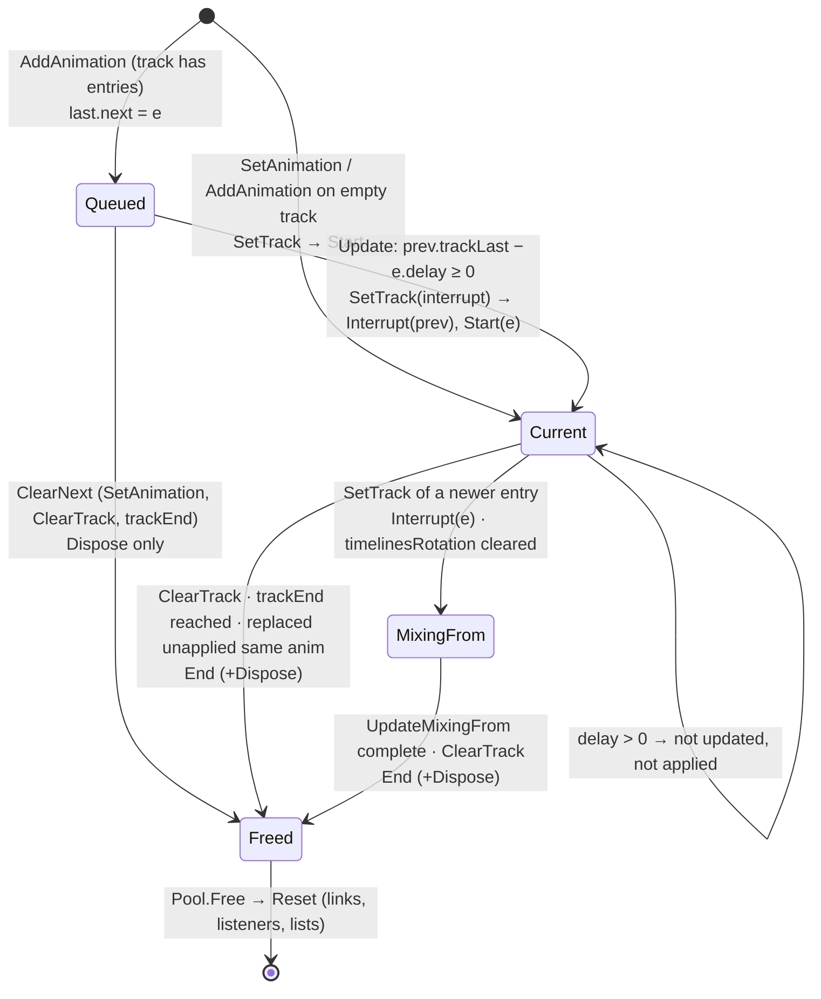
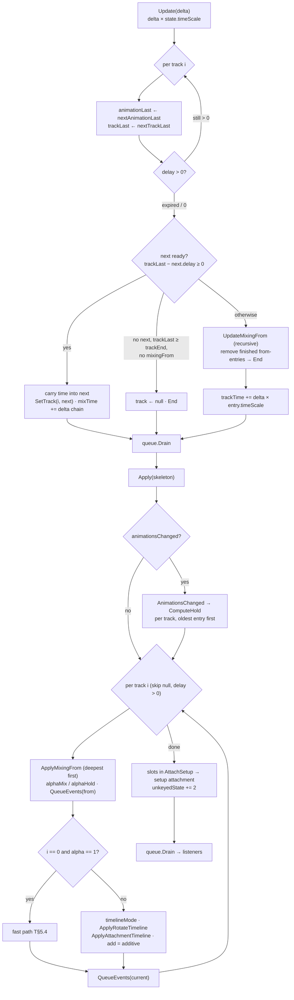

# Spine 4.3 AnimationState: clean-room specification

This spec describes the whole of stock Spine 4.3 `AnimationState`: track entries and their settings, queueing (`SetAnimation`, `AddAnimation`, empty animations, clearing), `Update` (time, delays, queue switching, mix bookkeeping), `Apply` (alpha, mixing-from recursion, hold, rotation memory, attachment states), `ComputeHold`, the listener event queue, `AnimationStateData`, and the spine-unity `SkeletonAnimation` driver. The reference is spine-csharp **4.3.40** in `Packages/com.esotericsoftware.spine.spine-csharp` (upstream `4.3` @ `7ce5d0da`; the local diff in `AnimationState.cs`/`AnimationStateData.cs` only adds `private` keywords and changes no behaviour) and spine-unity in `Packages/com.esotericsoftware.spine.spine-unity`. No reference source is reproduced; tables, prose and pseudocode are written from scratch, and every float formula gives its operation order. **Per-timeline `Apply` semantics, the combiners, the track-0 fast path, `ApplyRotateTimeline`, `ApplyAttachmentTimeline`, property IDs and the single-track mix-0 case are in [Timelines.md](Timelines.md) and are only referenced here** (as "T§n"). Numeric conventions are T§1.1: float32 everywhere, left-to-right, no FMA.





---

## Contents

1. [Scope and what 4.3 does not have](#1-scope-and-what-43-does-not-have)
2. [Data model](#2-data-model)
3. [AnimationStateData and spine-unity mix settings](#3-animationstatedata-and-spine-unity-mix-settings)
4. [Track API: set, add, empty, clear](#4-track-api-set-add-empty-clear)
5. [Update(delta)](#5-updatedelta)
6. [Apply(skeleton)](#6-applyskeleton)
7. [AnimationsChanged, ComputeHold, From](#7-animationschanged-computehold-from)
8. [Events and the listener queue](#8-events-and-the-listener-queue)
9. [ApplyEventTimelinesOnly](#9-applyeventtimelinesonly)
10. [spine-unity SkeletonAnimation driver](#10-spine-unity-skeletonanimation-driver)
11. [Edge cases, worked](#11-edge-cases-worked)
12. [Ambiguities / verified only by reading](#12-ambiguities--verified-only-by-reading)
13. [Parity traps](#13-parity-traps)

---

## 1. Scope and what 4.3 does not have

| Concept from older runtimes | Status in 4.3.40 |
|---|---|
| `MixBlend` (setup/first/replace/add), `MixDirection` | Gone. Replaced by `MixFrom {Current 0, Setup 1, First 2}` plus `add` and `mixOut` flags (T§1.2). |
| `interruptAlpha` | **Does not exist.** Interrupted mixes are handled by the `fromMix` recursion (§6.3) and `alphaHold = alphaMix / keep`. |
| `holdPrevious` | **Does not exist.** Holding is automatic (§7.2, the `Hold` bit); `keepHold` is internal, set by `UpdateMixingFrom`. |
| `TrackEntry.mixBlend` | Gone. `additive` (bool) replaces `MixBlend.Add`. |
| `GetCurrent(track)` | Named `GetTrack(trackIndex)` in C#. |
| `mixInterpolation` | **New in 4.3**: an `Interpolation` curve applied to `mixTime / mixDuration` (§2.4). Default `Linear`. |

Constants: `MixFrom` bits are `Mode = 3` (mask), `Hold = 4`. Attachment states `AttachSetup = 1`, `AttachRetain = 2` (offsets from `unkeyedState`, T§5.5).

---

## 2. Data model

### 2.1 AnimationState fields

| Field | Initial | Meaning |
|---|---|---|
| `data` | ctor argument (non-null, else throws) | `AnimationStateData` for `GetMix`. Setter throws on null. |
| `tracks` | empty list | Index = track number. Entries may be null. `Count` only grows (via `ExpandToIndex`) except `ClearTracks`, which sets it to 0 and zero-fills. |
| `events` | empty list | Scratch list that event timelines append to during one entry's apply. Cleared (without zeroing) after each entry. |
| `queue` | empty | The listener `EventQueue` (§8.3). |
| `propertyIds` | empty map `ulong → TrackEntry` | Scratch for `AnimationsChanged`; empty between calls. |
| `animationsChanged` | **false** | Set true synchronously whenever `queue.Start` or `queue.End` enqueues (not at delivery). |
| `timeScale` | 1 | Multiplies every `Update` delta. No validation. |
| `unkeyedState` | 0 | Attachment-state epoch; `+2` per `Apply` (T§5.5). |
| pool | empty | Freed entries are reused by `NewTrackEntry`. |

Listeners: state-level delegates `Start, Interrupt, End, Dispose, Complete` (entry) and `Event` (entry, event). `AssignEventSubscribersFrom(src)` replaces all six with `src`'s; `AddEventSubscribersFrom(src)` appends.

### 2.2 TrackEntry fields and initial values

`NewTrackEntry(trackIndex, animation, loop, last)` takes an entry from the pool (or makes a new one) and writes **every** field below. `last` is the entry it will follow or mix from (may be null).

| Field | Initial value | Notes |
|---|---|---|
| `trackIndex` | argument | |
| `animation` | argument | |
| `loop` | argument | |
| `additive`, `reverse`, `shortestRotation`, `keepHold` | false | |
| `eventThreshold`, `alphaAttachmentThreshold`, `mixAttachmentThreshold`, `mixDrawOrderThreshold` | 0 | |
| `animationStart` | 0 | |
| `animationEnd` | `animation.duration` | Snapshot; not updated if `Animation` is reassigned later. |
| `animationLast`, `nextAnimationLast` | −1 | |
| `delay` | 0 | `AddAnimation` sets it after creation. |
| `trackTime` | 0 | |
| `trackLast`, `nextTrackLast` | −1 | `nextTrackLast == −1` means "never applied". |
| `trackEnd` | `float.MaxValue` (3.4028235e38) | |
| `timeScale` | 1 | |
| `alpha` | 1 | |
| `mixTime` | 0 | |
| `mixDuration` | `last == null ? 0 : data.GetMix(last.animation, animation)` | |
| `mixInterpolation` | `Interpolation.Linear` (singleton) | |
| `totalAlpha` | 0 | |
| `previous`, `next`, `mixingFrom`, `mixingTo` | null | Cleared by the pool's `Reset` when freed. |
| entry listeners (6) | none | Cleared by `Reset`. |
| `timelineMode` (int list), `timelineHoldMix` (entry list), `timelinesRotation` (float list) | count 0, backing zero-filled | Cleared by `Reset` (zero-fill). |

### 2.3 Public setters and their side effects

Everything not listed as having a side effect is a plain field write, takes effect on the next `Update`/`Apply` that reads it, and triggers **no** recomputation (in particular, not `ComputeHold`).

| Property | Setter behaviour |
|---|---|
| `Animation` | Throws on null. Plain write. Does **not** update `animationEnd`, `timelineMode`, rotation memory or `animationsChanged`. |
| `Loop` | Plain. |
| `Delay` | Throws if `value < 0`. Plain. |
| `TrackTime` | Plain. Setting it does not move `animationLast` (so events between can fire, see `AnimationLast`). |
| `TrackEnd` | Plain. |
| `AnimationStart`, `AnimationEnd` | Plain. |
| `AnimationLast` | Writes **both** `animationLast` and `nextAnimationLast`. |
| `TimeScale` | Plain. Negative is "not supported" (no check). |
| `Alpha` | Plain. |
| `EventThreshold`, `AlphaAttachmentThreshold`, `MixAttachmentThreshold`, `MixDrawOrderThreshold` | Plain. |
| `MixInterpolation` | Throws on null. Plain. |
| `MixTime` | Plain. |
| `MixDuration` | Plain. **Does not** adjust `delay` (see `SetMixDuration`). Setting it on a queued entry after `AddAnimation` leaves the delay computed from the old mix duration. Holds (`timelineHoldMix`) that depend on `mixDuration > 0` are not recomputed. |
| `SetMixDuration(md, delay)` | `mixDuration = md`. If `delay <= 0`: `delay = (previous == null) ? 0 : max((delay + previous.TrackComplete) − md, 0)`. Then `this.delay = delay` (no `< 0` check). `previous` is null once the entry is current. |
| `Additive` | Plain. `ComputeHold` results (hold bits) are not recomputed; `Apply` reads `additive` live for `add` and `shortestRotation`. |
| `Reverse` | Plain. Read live in `Apply`. |
| `ShortestRotation` | Plain. Read live. |
| `ResetRotationDirections()` | `timelinesRotation.Clear()` (count 0, zero-fill), so the next non-shortest apply is a `firstFrame`. |
| `AllowImmediateQueue()` | `if nextTrackLast < 0: nextTrackLast = 0` (makes the entry count as applied for queue switching and mix completion). |

### 2.4 Derived getters (exact)

```
AnimationTime:                                  # also T§5.3
    if not loop: return min(trackTime + animationStart, animationEnd)
    d = animationEnd - animationStart
    if d == 0: return animationStart
    return (trackTime % d) + animationStart

TrackComplete:
    d = animationEnd - animationStart
    if d != 0:
        if loop: return d * float(1 + (int)(trackTime / d))   # int add, then to float, then multiply
        if trackTime < d: return d
    return trackTime

Mix():
    if mixDuration == 0: return 1
    m = mixTime / mixDuration
    if m >= 1: return 1
    if mixInterpolation is the Linear singleton: return m          # no clamp: m may be negative
    m = mixInterpolation.Apply(m)
    return m < 0 ? 0 : (m > 1 ? 1 : m)

IsComplete:   trackTime >= animationEnd - animationStart
WasApplied:   nextTrackLast != -1
IsNextReady:  next != null and (nextTrackLast - next.delay) >= 0
IsEmptyAnimation: animation is the shared EmptyAnimation object
```

`min` is `Math.Min(float, float)` (returns NaN if either is NaN). `TrackComplete` uses `trackTime` **as it is at the call**, so `AddAnimation` computes delays from the previous entry's time at the moment of the call.

`mixInterpolation` for non-linear curves is a pluggable `f(a)`; the 4.3 set (`Smooth`, `Pow2In`, `Sine`, `Elastic`, `Bounce` …) is in `Interpolation.cs` and is out of scope here. A port claiming parity for a non-linear mix must port that function exactly (several use `Math.Pow`/`Math.Sqrt` in double and cast back).

---

## 3. AnimationStateData and spine-unity mix settings

### 3.1 AnimationStateData

| Member | Behaviour |
|---|---|
| `defaultMix` | float, **0** by default in spine-csharp. |
| `SetMix(fromName, toName, d)` | Looks both up with `skeletonData.FindAnimation`; throws `ArgumentException` if either is missing. Then `SetMix(from, to, d)`. |
| `SetMix(from, to, d)` | Throws on null. Removes any existing pair, then inserts `(from, to) → d`. |
| `GetMix(from, to)` | Throws on null. Returns the pair's duration if `(from, to)` is present, else `defaultMix`. |

* The key is the pair of **object references** (reference equality on both). There is no wildcard, no reverse lookup (`(to, from)` is a different key), and no name fallback.
* `EmptyAnimation` is a static object not in `SkeletonData`, so a name-based `SetMix` can never target it: `GetMix(x, empty)` and `GetMix(empty, x)` always return `defaultMix`.
* `GetMix` is called exactly once per entry, inside `NewTrackEntry`, with `last.animation` (§2.2). Changing `defaultMix` or pair mixes later does not affect existing entries.

### 3.2 spine-unity `SkeletonDataAsset`

| Item | Behaviour |
|---|---|
| Serialized fields | `fromAnimation[]`, `toAnimation[]` (names), `duration[]`, `defaultMix` (float, C# default 0). |
| Import default | When the editor importer **creates** the asset (`AssetUtility.IngestSpineProject`), `defaultMix = Preferences.defaultMix`, which is `SpinePreferences.DEFAULT_DEFAULT_MIX = 0.2` unless the user changed the preference. Re-import of an existing asset keeps its value. |
| Runtime-created assets | `CreateRuntimeInstance` does not set it: `defaultMix = 0`. |
| Loading | `GetSkeletonData` → `InitializeWithData`: new `AnimationStateData(skeletonData)`, then `FillStateData`. |
| `FillStateData` | `stateData.DefaultMix = defaultMix`. Then for `i` in `0..fromAnimation.Length`: skip if either name is empty; (editor only: skip with an error log if either name is not found); `stateData.SetMix(from[i], to[i], duration[i])`. Later duplicates of the same pair overwrite earlier ones. In a **player build** the not-found check is compiled out, so a stale name makes `SetMix` **throw**. |
| Sharing | `GetAnimationStateData()` returns one cached `AnimationStateData` per asset; every `SkeletonAnimation` using the asset shares it. |

---

## 4. Track API: set, add, empty, clear

### 4.1 Helpers

```
ExpandToIndex(i):
    if i < tracks.Count: return tracks[i]
    tracks.EnsureSize(i + 1)          # new slots are null
    return null

SetTrack(i, e, interrupt):
    from = ExpandToIndex(i)
    tracks[i] = e
    e.previous = null
    if from != null:
        from.next = null
        if interrupt: queue.Interrupt(from)
        e.mixingFrom = from;  from.mixingTo = e
        e.mixTime = 0
        from.timelinesRotation.Clear()        # the from-entry re-picks rotation directions when it mixes out
    queue.Start(e)                            # sets animationsChanged

ClearNext(e):
    n = e.next
    while n != null: queue.Dispose(n); n = n.next
    e.next = null
```

`SetTrack` keeps `from.mixingFrom`, so an interrupted mix becomes a chain of 3 or more (§11.6). `ClearNext` is public.

### 4.2 SetAnimation(track, animation, loop)

Throws for `track < 0` or null animation. The by-name overload throws if `FindAnimation` misses.

```
interrupt = true
cur = ExpandToIndex(track)
if cur != null:
    if cur.nextTrackLast == -1 and cur.animation == animation:     # never applied AND same animation
        tracks[track] = cur.mixingFrom
        queue.Interrupt(cur); queue.End(cur)
        ClearNext(cur)
        cur = cur.mixingFrom
        interrupt = false
    else:
        ClearNext(cur)
e = NewTrackEntry(track, animation, loop, cur)
SetTrack(track, e, interrupt)
queue.Drain()
return e
```

* A never-applied current with a **different** animation is **not** discarded: it becomes `mixingFrom` and is applied (mixing out) on the next `Apply`.
* In the discard branch the new entry's `mixDuration` is `GetMix(older.animation, animation)`, or 0 if there is no older entry.
* Everything queued here (Interrupt/End/Dispose/Start) is delivered **before `SetAnimation` returns**, unless draining is disabled (§8.4). Listeners added to the returned entry therefore miss its Start.

### 4.3 AddAnimation(track, animation, loop, delay)

```
last = ExpandToIndex(track)
if last != null: while last.next != null: last = last.next      # end of the queue, not the current
e = NewTrackEntry(track, animation, loop, last)                 # mixDuration from last
if last == null:
    SetTrack(track, e, true); queue.Drain()                     # Start delivered NOW, before delay is set
    if delay < 0: delay = 0
else:
    last.next = e;  e.previous = last
    if delay <= 0: delay = max((delay + last.TrackComplete) - e.mixDuration, 0)
e.delay = delay
return e
```

* `delay` is measured on the **previous entry's `trackTime`** axis: the switch happens when `prev.trackLast − e.delay ≥ 0` (§5.2).
* `last.TrackComplete` is evaluated now. For a queued `last` (not yet current) its `trackTime` is 0 (unless set), so a looping `last` gives `d × 1`.
* On an empty track the entry becomes current immediately **with** its delay: it is neither updated nor applied until the delay elapses (§5.1). With `delay <= 0` there, it is 0.
* A positive `delay` is stored as given (no `TrackComplete` term).

### 4.4 Empty animations

`EmptyAnimation`: one shared static `Animation` named `"<empty>"`, zero timelines, duration 0, empty property-ID set (so `HasTimeline` is always false).

```
SetEmptyAnimation(track, md):
    e = SetAnimation(track, EmptyAnimation, loop = false)      # events already drained here
    e.mixDuration = md
    e.trackEnd = md
    return e

AddEmptyAnimation(track, md, delay):
    e = AddAnimation(track, EmptyAnimation, loop = false, delay)
    if delay <= 0: e.delay = max((e.delay + e.mixDuration) - md, 0)     # e.mixDuration is still GetMix(...) here
    e.mixDuration = md
    e.trackEnd = md
    return e

SetEmptyAnimations(md):
    old = queue.drainDisabled; queue.drainDisabled = true
    for i in 0 .. tracks.Count-1: if tracks[i] != null: SetEmptyAnimation(tracks[i].trackIndex, md)
    queue.drainDisabled = old
    queue.Drain()
```

* In `SetEmptyAnimation` the Start listener runs **before** `mixDuration`/`trackEnd` are assigned and sees `mixDuration = defaultMix` (or 0) and `trackEnd = MaxValue`. In `SetEmptyAnimations` delivery is deferred, so Start sees the final values.
* `AddEmptyAnimation`'s delay is corrected in two clamped steps: `max(max((d + TC) − dm, 0) + dm − md, 0)` with `dm = GetMix(last, empty)`. That is **not** bit-equal (nor always equal) to `max(d + TC − md, 0)`.
* On an empty track, `AddAnimation` makes the entry current with `mixDuration = 0` and `delay = 0` (or the positive delay given). For `delay <= 0` the correction is `max((0 + 0) − md, 0) = 0`. Then `mixDuration = md` and `trackEnd = md`, with nothing to mix from.
* Two `SetEmptyAnimation` calls on a track with no `Apply` between them: the second discards the first (same animation, never applied, §4.2).
* Semantics of the mix: see §11.3.

### 4.5 ClearTrack / ClearTracks

```
ClearTrack(i):
    if i < 0: throw
    if i >= tracks.Count: return
    cur = tracks[i]; if cur == null: return
    queue.End(cur)
    ClearNext(cur)                               # Dispose for each queued entry
    e = cur
    while e.mixingFrom != null:
        f = e.mixingFrom
        queue.End(f)
        e.mixingFrom = null; e.mixingTo = null
        e = f
    tracks[cur.trackIndex] = null                # Count unchanged
    queue.Drain()

ClearTracks():
    old = drainDisabled; drainDisabled = true
    for i in 0 .. tracks.Count-1: ClearTrack(i)
    tracks.Clear()                               # Count = 0, zero-filled
    drainDisabled = old; queue.Drain()
```

Clearing never touches the skeleton: the pose stays as last applied. Queue order for one track: `End(cur), Dispose(queued…), End(mixingFrom), End(its mixingFrom)…` (newest to oldest).

### 4.6 GetTrack, Tracks, listener control

| Call | Behaviour |
|---|---|
| `GetTrack(i)` | Throws for `i < 0`; null if `i >= Count`; else `tracks[i]` (may be null). |
| `Tracks` | The list itself, nulls included. |
| `ClearListenerNotifications()` | Drops every undelivered queue item (`queue.Clear`). Dropped End/Dispose items mean those entries are **never returned to the pool** and their listeners never fire. |
| `DelayListenerNotifications()` | `drainDisabled = true`. |
| `IssueDelayedListenerNotifications()` | `drainDisabled = false; Drain()`. |

---

## 5. Update(delta)

### 5.1 Per-track loop

```
Update(delta):
    delta = delta * timeScale
    for i in 0 .. tracks.Count-1 (Count read once):
        cur = tracks[i]; if cur == null: continue
        cur.animationLast = cur.nextAnimationLast
        cur.trackLast     = cur.nextTrackLast
        cd = delta * cur.timeScale

        if cur.delay > 0:
            cur.delay = cur.delay - cd
            if cur.delay > 0: continue                         # nothing else this frame (mixing frozen too)
            cd = -cur.delay                                     # leftover time
            cur.delay = 0

        nx = cur.next
        if nx != null:
            nt = cur.trackLast - nx.delay
            if nt >= 0:                                         # §5.2 switch
                nx.delay = 0
                nx.trackTime = nx.trackTime + (cur.timeScale == 0 ? 0 : ((nt / cur.timeScale) + delta) * nx.timeScale)
                cur.trackTime = cur.trackTime + cd
                SetTrack(i, nx, interrupt = true)
                e = nx
                while e.mixingFrom != null: e.mixTime = e.mixTime + delta; e = e.mixingFrom
                continue                                        # no UpdateMixingFrom this frame
        else if cur.trackLast >= cur.trackEnd and cur.mixingFrom == null:
            tracks[i] = null
            queue.End(cur); ClearNext(cur)
            continue

        if cur.mixingFrom != null and UpdateMixingFrom(cur, delta):     # §5.3
            f = cur.mixingFrom
            cur.mixingFrom = null
            if f != null: f.mixingTo = null
            while f != null: queue.End(f); f = f.mixingFrom          # newest to oldest

        cur.trackTime = cur.trackTime + cd
    queue.Drain()
```

| Quantity | Scaled by |
|---|---|
| `trackTime` of the current entry | `delta × state.timeScale × entry.timeScale` (`cd`) |
| `delay` countdown | same (`cd`): **entry** time scale affects the delay |
| `trackTime` of mixing-from entries | `delta × from.timeScale` (their own scale, §5.3) |
| `mixTime` | `delta` only (state-scaled, **not** entry-scaled) |
| carry-over into `next` | `((nt / cur.timeScale) + delta) × next.timeScale` |

### 5.2 Queue switching

* The test uses **`trackLast`** (the `trackTime` the current entry had at its last `Apply`), not `trackTime`. An entry that has never been applied has `trackLast = −1`, so with `next.delay = 0` it switches only after its first apply (or after `AllowImmediateQueue`).
* The overshoot `nt` is in the old entry's scaled time; it is unscaled by `cur.timeScale`, the current frame's `delta` is added, and the sum is scaled by the next entry's time scale. It is **added** to `next.trackTime` (a user-set start time survives).
* The old current still gets `+cd` before becoming a mixing-from entry.
* The `mixTime += delta` loop runs over the new current and every entry below it **that has a `mixingFrom`** (the oldest entry is skipped). The new current's `mixTime` was just zeroed by `SetTrack`, so it becomes `delta`.
* Because of the `continue`, deeper mixing-from entries of the old current are **not** updated this frame: their `trackTime` does not advance and their `animationLast`/`trackLast` are not refreshed (§12, item 3).
* The queue item order is `Interrupt(old), Start(next)`.

### 5.3 UpdateMixingFrom(to, delta)

Returns true when every mix in the chain below `to` is complete.

```
UpdateMixingFrom(to, delta):
    f = to.mixingFrom
    if f == null: return true
    finished = UpdateMixingFrom(f, delta)            # deepest pair first
    f.animationLast = f.nextAnimationLast
    f.trackLast     = f.nextTrackLast
    if to.nextTrackLast != -1 and to.mixTime >= to.mixDuration:     # `to` applied at least once, mix done
        if f.totalAlpha == 0 or to.mixDuration == 0:
            to.mixingFrom = f.mixingFrom
            if f.mixingFrom != null: f.mixingFrom.mixingTo = to
            if f.totalAlpha == 0:
                e = to
                while e.mixingTo != null: e.keepHold = true; e = e.mixingTo     # all but the track's current
            queue.End(f)
        return finished                              # f is NOT advanced
    f.trackTime = f.trackTime + (delta * f.timeScale)
    to.mixTime  = to.mixTime + delta
    return false
```

| Situation at a pair `(to, f)` | Effect |
|---|---|
| `to` never applied | Keep `f`, advance `f.trackTime` and `to.mixTime`. |
| Mix not done (`mixTime < mixDuration`) | Same. |
| Mix done, `mixDuration == 0` | Remove `f` (End), splice. |
| Mix done, `f.totalAlpha == 0` (last apply contributed nothing: no holds, or holds faded by `holdMix`, or no timelines) | Remove `f`, set `keepHold` up the chain (excluding the current). |
| Mix done, `f.totalAlpha != 0` (a held timeline still at alpha > 0) | Keep `f`, **freeze** it (no time advance), return `finished`. If this is the top pair and `finished` is true, `Update` then ends the whole remaining chain. |

* `mixTime >= mixDuration` is tested **before** incrementing. With the increment in one `Update` crossing `mixDuration`, the next `Apply` sees `Mix() = 1` (alpha 0 for non-held timelines), and the following `Update` removes the entry. A from-entry therefore always gets one final apply at mix = 1.
* `totalAlpha` is the float sum of the alphas used in the from-entry's **last** `ApplyMixingFrom` (§6.3); only `== 0` matters.
* Removal order inside the recursion: oldest pair first. The final "finished" loop in `Update` ends the rest newest to oldest.
* `mixingTo` of a removed entry is not cleared (it is reset when freed).

### 5.4 trackEnd

| Where | Condition | Effect |
|---|---|---|
| `Apply` | `mixingFrom == null`, `trackTime >= trackEnd`, `next == null` | The current entry is applied with **alpha 0** (§6.2). |
| `Update` (next frame) | `next == null`, `trackLast >= trackEnd`, `mixingFrom == null` | `tracks[i] = null`, `End(cur)`. |

With `next != null` (even if not ready) neither happens: the entry keeps playing at its alpha past `trackEnd` until the switch. With a `mixingFrom`, both wait until the mix chain is gone.

---

## 6. Apply(skeleton)

### 6.1 Top level

```
Apply(skeleton):
    if skeleton == null: throw
    if animationsChanged: AnimationsChanged()                  # §7
    applied = false
    for i in 0 .. tracks.Count-1:
        cur = tracks[i]
        if cur == null or cur.delay > 0: continue              # the whole track, mixing-from entries included
        applied = true
        alpha = cur.alpha
        if cur.mixingFrom != null: alpha = alpha * ApplyMixingFrom(cur, skeleton)      # = cur.alpha × cur.Mix()
        else if cur.trackTime >= cur.trackEnd and cur.next == null: alpha = 0
        applyCurrent(i, cur, alpha)                            # §6.2
        if cur.reverse: EventsReverse(cur, cur.animationLast, animTime)                 # §8.2
        QueueEvents(cur, animTime)                             # §8.1
        events.clear()
        cur.nextAnimationLast = animTime                       # animTime = cur.AnimationTime, computed once before the timelines
        cur.nextTrackLast = cur.trackTime
    for each slot s in skeleton.slots (index order):
        if s.attachmentState == unkeyedState + 1:              # AttachSetup: temporary this frame
            n = s.data.attachmentName
            s.pose.attachment = (n == null) ? null : skeleton.GetAttachment(s.data.index, n)
    unkeyedState += 2
    queue.Drain()
    return applied
```

`Apply` changes entry state (`nextAnimationLast`, `nextTrackLast`, `totalAlpha`, `timelinesRotation`, `timelineMode`), so applying one state to two skeletons in one frame is not side-effect free for rotation memory, although the "next*" values are overwritten with the same numbers.

### 6.2 The current entry

```
applyCurrent(i, cur, alpha):
    last = cur.animationLast
    animTime = cur.AnimationTime
    t = animTime; ev = events
    if cur.reverse: t = cur.animation.duration - t; ev = null          # full duration, not animationEnd
    if i == 0 and alpha == 1:
        fast path (T§5.4): every timeline with from = Setup, add = false, mixOut = false,
        attachments via ApplyAttachmentTimeline(from = Setup, retain = true)
    else:
        retain = alpha >= cur.alphaAttachmentThreshold
        add = cur.additive
        shortest = add or cur.shortestRotation
        firstFrame = (not shortest) and cur.timelinesRotation.Count != 2 * timelineCount
        if firstFrame: cur.timelinesRotation.EnsureSize(2 * timelineCount)    # keeps old contents (zeros after Clear)
        for k, tl in timelines:
            from = cur.timelineMode[k] & 3
            if not shortest and tl is Rotate: ApplyRotateTimeline(tl, t, alpha, from, mem = 2k, firstFrame)   # T§5.7
            else if tl is Attachment:         ApplyAttachmentTimeline(tl, t, from, retain)                       # T§5.5
            else:                             tl.Apply(skeleton, last, t, ev, alpha, from, add, mixOut = false, applied = false)
```

| Condition | Path | `from` | `add` | Notes |
|---|---|---|---|---|
| track 0, alpha exactly 1 | fast | Setup | false | `additive`, `timelineMode`, thresholds and rotation memory are ignored. |
| track 0, alpha ≠ 1 (mixing in, `Alpha < 1`, trackEnd alpha 0) | slow | `timelineMode` | `additive` | Rotation through `ApplyRotateTimeline` (shortest path with direction memory) unless `additive`/`shortestRotation`. |
| track ≥ 1, any alpha (including 1) | slow | `timelineMode` | `additive` | At alpha 1, a Current-mode relative timeline gives `cur + ((v + setup) − cur) × 1`, not `setup + v`. |

The current entry's `timelineMode` never has the Hold bit (its `mixingTo` is null), and its `from` is Setup if it is the first on the track to key the property, First if an older entry on the same track (or an earlier timeline of its own) keys it, Current if a lower track keys it (§7.3).

`ApplyRotateTimeline` detail beyond T§5.7: at `alpha == 1` it only zeroes `mem.total` on a `firstFrame` and calls the plain timeline; `mem.lastDiff` is not written. The next non-1 frame then reads `lastDiff = 0` (zero-filled). This yields the same `total` as a genuine first frame, because both reduce to `total = diff` when `lastTotal = 0`.

### 6.3 ApplyMixingFrom(to, skeleton)

Returns `to.Mix()`. Recurses to the oldest entry first.

```
ApplyMixingFrom(to, skeleton):
    f = to.mixingFrom
    fromMix = (f.mixingFrom != null) ? ApplyMixingFrom(f, skeleton) : 1      # = f.Mix() when f is itself mixing in
    mix = to.Mix()
    a        = f.alpha * fromMix
    keep     = 1 - (mix * to.alpha)
    alphaMix = a * (1 - mix)
    alphaHold = (keep > 0) ? (alphaMix / keep) : a

    retainAtt = mix < f.mixAttachmentThreshold
    drawOrder = mix < f.mixDrawOrderThreshold
    add = f.additive;  shortest = add or f.shortestRotation
    firstFrame = (not shortest) and f.timelinesRotation.Count != 2 * n
    if firstFrame: f.timelinesRotation.EnsureSize(2 * n)

    last = f.animationLast;  animTime = f.AnimationTime;  t = animTime
    ev = null
    if f.reverse: t = f.animation.duration - t
    else if mix < f.eventThreshold: ev = events

    f.totalAlpha = 0
    for k, tl in f.animation.timelines:
        mode = f.timelineMode[k];  from = mode & 3
        if mode & Hold:
            hm = f.timelineHoldMix[k]
            alpha = (hm == null) ? alphaHold : alphaHold * (1 - hm.Mix())
        else:
            if not drawOrder and tl is DrawOrderTimeline and from == Current: continue    # skipped, not counted
            alpha = alphaMix
        f.totalAlpha = f.totalAlpha + alpha
        if not shortest and tl is Rotate: ApplyRotateTimeline(tl, t, alpha, from, 2k, firstFrame)
        else if tl is Attachment: ApplyAttachmentTimeline(tl, t, from, retain = retainAtt and alpha >= f.alphaAttachmentThreshold)
        else:
            mixOut = (not drawOrder) or (tl is not DrawOrderTimeline) or from == Current
            tl.Apply(skeleton, last, t, ev, alpha, from, add, mixOut, applied = false)

    if f.reverse and mix < f.eventThreshold: EventsReverse(f, last, animTime)
    if to.mixDuration > 0: QueueEvents(f, animTime)
    events.clear()
    f.nextAnimationLast = animTime
    f.nextTrackLast = f.trackTime
    return mix
```

| Value | Meaning | At mix = 0 | At mix = 1, `to.alpha = 1` |
|---|---|---|---|
| `a` | The from-entry's own weight: its alpha times its own mix-in progress | `f.alpha × fromMix` | same |
| `alphaMix` | Weight for properties the next entry does not key (fade out) | `a` | 0 |
| `alphaHold` | Weight for held properties: compensates for the next entry mixing in with `First` so the sum does not dip | `a` (`keep = 1`) | `a` (`keep = 0`) |
| `holdMix` fade | For a 3+ chain: the first later entry that stops keying the property fades the hold out with its own `Mix()` | – | – |

* `DrawOrderFolderTimeline` is **not** a `DrawOrderTimeline`: it is never skipped and always gets `mixOut = true` in a from-entry.
* With default thresholds (all 0): `retainAtt`, `drawOrder` and events are all off for a mixing-out entry. So draw order keys and attachment keys of the old animation revert to setup (or lower-track values) at the **first** frame of the mix, and its events stop firing (only Complete can still be queued, §8.1).
* A non-skipped `DrawOrderTimeline` with `drawOrder` true and `from != Current` gets `mixOut = false` and keeps applying the from-entry's keyed order.
* Instant timelines are called with `mixOut = true`, so alpha does not matter to them: they revert to setup (from ≠ Current) or leave the value (Current) (T§3).
* `alphaHold` must be computed exactly as `(a × (1 − mix)) / (1 − (mix × to.alpha))`; it is not bit-equal to `a` in general.
* The mixing-out entry's events are gated by `mix < eventThreshold`, where `mix` is `to.Mix()` (the progress of the **newer** entry).

---

## 7. AnimationsChanged, ComputeHold, From

### 7.1 AnimationsChanged

Runs at the start of `Apply` when `animationsChanged` is set (by any `Start` or `End` enqueue since the last `Apply`).

```
AnimationsChanged():
    animationsChanged = false
    for i in 0 .. tracks.Count-1 (ascending):
        track = tracks[i]; if track == null: continue
        e = track
        while e.mixingFrom != null: e = e.mixingFrom          # oldest
        do: ComputeHold(e, track); e = e.mixingTo while e != null
    propertyIds.clear()
```

* One map spans **all tracks**. Lower tracks claim first; within a track the oldest from-entry claims first.
* The value stored for every claim is the track's **current** entry (`track`), so all entries of one track are one owner.
* Queued entries are not visited (they are processed when their Start marks the state changed).
* A current entry with `delay > 0` is visited and claims its properties although it is not applied (§12, item 6).

### 7.2 ComputeHold(entry, track)

```
ComputeHold(entry, track):
    mode[] = entry.timelineMode.EnsureSize(n)       # previous values kept: keepHold reads them
    entry.timelineHoldMix.Clear(); holdMix[] = entry.timelineHoldMix.Resize(n)    # all null
    add = entry.additive; keep = entry.keepHold; to = entry.mixingTo
    for k, tl in entry.animation.timelines:
        ids = tl.propertyIds
        from = From(track, tl, ids)                                          # §7.3; claims ids
        if add and tl.additive: mode[k] = from; continue                    # no Hold, keepHold ignored
        if to == null or tl.instant or (to.additive and tl.additive) or not to.animation.HasTimeline(ids):
            m = from
        else:
            m = from | Hold
            for nx = to.mixingTo; nx != null; nx = nx.mixingTo:
                if (nx.additive and tl.additive) or not nx.animation.HasTimeline(ids):
                    if nx.mixDuration > 0: holdMix[k] = nx
                    break
        if keep: m = (m & ~Hold) | (mode[k] & Hold)                         # freeze the previous Hold bit
        mode[k] = m
```

| Rule | Detail |
|---|---|
| Hold | The next entry (`mixingTo`) keys **any** of the timeline's IDs (`HasTimeline` = any-match), the timeline is not `instant`, and not (next additive and timeline additive). |
| `holdMix` | The first entry further up the chain that does **not** key the property (or is additive with an additive timeline). Recorded only if its `mixDuration > 0`; the search stops at it either way. No such entry → null → plain `alphaHold`. |
| Additive entry | For its `additive` timelines: mode = `from` only. Its non-additive timelines are held normally. |
| `keepHold` | Set by `UpdateMixingFrom` on intermediate entries when an older entry is removed with `totalAlpha == 0`. It is never cleared for the life of the entry: the Hold bits stay as they were at the last compute before it was set. `holdMix` is still recomputed, and only in the "would hold now" branch, so a frozen Hold bit can come with `holdMix = null`. |
| Current entry | `mixingTo` is null, so never held. |
| Mixing to the empty animation | `HasTimeline` is false, so nothing is held: every property fades with `alphaMix`. |

Hold and holdMix are **snapshots**: later changes to `additive`, `mixDuration` or `animation` on any entry are not reflected until the next Start/End.

### 7.3 From(track, timeline, ids)

This is the full rule (T§5.6 describes it only for one track).

```
From(track, tl, ids):
    result = Setup
    for j, id in ids:
        owner = putIfAbsent(propertyIds, id, track)          # returns the existing owner, or null after inserting
        if owner != null:
            if owner != track:                               # a lower track keys it
                insert the remaining ids[j+1..] if absent
                return Current
            result = First                                   # same track claimed it earlier
    if tl is DrawOrderFolderTimeline and propertyIds has DrawOrder id:
        return (owner(DrawOrder id) != track) ? Current : First
    return result
```

| Outcome | When | Effect in Apply |
|---|---|---|
| Setup | No ID seen before | Base = setup; before-first-key = setup. The entry fades from/to **setup**. |
| First | Some ID already claimed on this track (older entry, or earlier timeline in the same animation, e.g. RGB after RGBA) | Base = current value; before-first-key moves toward setup by alpha. |
| Current | Some ID claimed by a lower track | Base = current value (the lower track's result); before-first-key leaves it. The entry fades from/to the lower track. |

A DrawOrderFolder timeline follows the whole-draw-order ID: if a DrawOrder timeline on this track was seen (in any entry, including earlier in the same animation) it is First; on a lower track, Current. Folder IDs of this track are still inserted.

---

## 8. Events and the listener queue

### 8.1 QueueEvents(entry, animationTime)

T§5.8 gives the loop. Full rule, including mixing-from entries:

```
QueueEvents(e, animTime):
    d = e.animationEnd - e.animationStart
    split = e.trackLast % d                      # track-time based: animationStart is NOT added
    if e.reverse: split = d - split
    k = 0
    while k < events.count:
        x = events[k]
        if (x.time < split) XOR e.reverse: break
        if e.animationStart <= x.time <= e.animationEnd: queue.Event(e, x)
        k += 1
    if e.loop: complete = (d == 0) or ((int)(e.trackTime / d) > 0 and (int)(e.trackTime / d) > (int)(e.trackLast / d))
    else:      complete = animTime >= e.animationEnd and e.animationLast < e.animationEnd
    if complete: queue.Complete(e)
    for remaining k: if in [animationStart, animationEnd]: queue.Event(e, events[k])
```

| Caller | When QueueEvents runs | Events list content |
|---|---|---|
| Current entry | Every `Apply` of the track | Everything its Event timelines fired (null list if `reverse`; then only `EventsReverse`) |
| Mixing-from entry | Only if **`to.mixDuration > 0`** | Only if `mix < eventThreshold` (else empty, but **Complete can still be queued**) |
| Mixing-from entry, `to.mixDuration == 0` | Never: no events and no Complete from the final apply | – |

* A looping entry with `d == 0` queues Complete on **every** apply.
* A non-looping entry queues Complete once, on the first apply whose `animTime` reaches `animationEnd` (`animationLast < end`). An entry past its end that keeps being applied does not repeat it.
* `(int)` truncates toward zero. First apply: `trackLast = −1`, so `(int)(−1/d)` is 0 for `d > 1` and negative for `d < 1`; `cycles > 0` still gates it.

### 8.2 EventsReverse(entry, animationLast, animationTime)

Used instead of the event timelines when `reverse` is set.

```
EventsReverse(e, lastT, nowT):
    D = e.animation.duration
    from = D - lastT;  to = D - nowT                 # previous and current reversed times
    for each EventTimeline tl in e.animation.timelines (stored order):
        if from >= to:                               # no wrap
            append every key k (ascending) with to <= frames[k] < from
        else:                                        # wrapped
            append keys with frames[k] < from (ascending)
            then keys with frames[k] >= to (ascending, to the end)
```

* The window is `[to, from)`: inclusive of the current reversed time, exclusive of the previous one, the opposite of the forward `(last, now]`.
* Keys are appended in **ascending time**, not in reversed-playback order.
* First apply: `lastT = −1`, `from = D + 1`, so every key `>= to`, including one at exactly `D`, fires.

### 8.3 EventQueue items and delivery

| Enqueue | Sets `animationsChanged` | Delivered as (entry listener first, then state listener) | Frees the entry |
|---|---|---|---|
| `Start(e)` | yes | Start | no |
| `Interrupt(e)` | no | Interrupt | no |
| `End(e)` | yes | End, **then** Dispose (the End item falls through into Dispose) | yes, after Dispose |
| `Dispose(e)` | no | Dispose only | yes |
| `Complete(e)` | no | Complete | no |
| `Event(e, x)` | no | Event(e, x) | no |

```
Drain():
    if drainDisabled: return
    drainDisabled = true
    for idx = 0; idx < items.count; idx++:          # count re-read: callbacks may append
        deliver(items[idx])
    items.clear()
    drainDisabled = false
```

* **Re-entrancy.** A callback that calls `SetAnimation` (or anything that enqueues) appends to the same list; its own inner `Drain` returns immediately; the new items are delivered **later in the same outer drain**, after every item already queued (FIFO).
* A freed entry is reset immediately (links, listeners, lists) and can be handed out again by a `NewTrackEntry` inside a later callback of the same drain.
* `ClearListenerNotifications` inside a callback clears the list while the loop index keeps its value, so items appended afterwards at lower indices are skipped and then cleared.
* An entry listener added after its Start was delivered never sees that Start.

### 8.4 When each notification happens

| Trigger | Items queued, in order | Delivered |
|---|---|---|
| `SetAnimation` | [discard branch: `Interrupt(cur)`, `End(cur)`] `Dispose(queued…)`, [`Interrupt(old)` unless discard branch] `Start(new)` | Inside the call |
| `AddAnimation`, empty track | `Start(new)` | Inside the call (before `delay` is set) |
| `AddAnimation`, non-empty track | – | – |
| `SetEmptyAnimation(s)` | As `SetAnimation`; plural batches all tracks | Inside the call |
| `ClearTrack` | `End(cur)`, `Dispose(queued…)`, `End(from…)` newest → oldest | Inside the call |
| `ClearTracks` | Per track as above, ascending | One drain at the end |
| `Update`: queue switch | `Interrupt(old)`, `Start(next)` | End of `Update` |
| `Update`: trackEnd | `End(cur)` | End of `Update` |
| `Update`: mix done | `End(f)` inner removals oldest first; then the "finished" loop newest → oldest | End of `Update` |
| `Apply` | Per track ascending: per from-entry, oldest first: `Event…(before split)`, `Complete`, `Event…(after)`; then the current entry likewise | End of `Apply`, **after** the attachment reset |

Within one frame (spine-unity), then: Start/Interrupt/End/Dispose from `Update` arrive before any pose work; Event/Complete arrive at the end of `Apply`, before `UpdateWorldTransform` (§10).

---

## 9. ApplyEventTimelinesOnly

`ApplyEventTimelinesOnly(skeleton, issueEvents = true)` is a spine-csharp addition used by spine-unity's reduced update modes.

```
ApplyEventTimelinesOnly(skeleton, issue):
    (no AnimationsChanged call; animationsChanged stays set)
    for each track (skip null, delay > 0):
        if cur.mixingFrom: ApplyMixingFromEventTimelinesOnly(cur, issue)     # deepest first
        animTime = cur.AnimationTime; t = animTime; ev = events
        if cur.reverse: t = duration - t; ev = null
        if issue:
            for EventTimeline tl: tl.Apply(skeleton, cur.animationLast, t, ev, 1, Current, false, false, false)
            if cur.reverse: EventsReverse(...)
            QueueEvents(cur, animTime); events.clear()
        cur.nextAnimationLast = animTime; cur.nextTrackLast = cur.trackTime
    if issue: queue.Drain()

ApplyMixingFromEventTimelinesOnly(to, issue):
    f = to.mixingFrom; recurse if f.mixingFrom
    mix = to.Mix(); same t / ev (reverse → null)
    if issue:
        if mix < f.eventThreshold: apply f's EventTimelines (alpha 0, Current, mixOut = true); if reverse: EventsReverse
        if to.mixDuration > 0: QueueEvents(f, animTime)
        events.clear()
    f.nextAnimationLast = animTime; f.nextTrackLast = f.trackTime
```

No pose is written, `totalAlpha` is **not** updated (it keeps the value from the last full `Apply`, 0 for an entry never fully applied, so such a from-entry is removed as soon as its mix completes), `unkeyedState` is not advanced, and there is no attachment reset.

---

## 10. spine-unity SkeletonAnimation driver

### 10.1 Per-frame order (non-threaded)

```
MonoBehaviour Update / FixedUpdate / LateUpdate (whichever matches updateTiming):
    UpdateOncePerFrame(dt0)     # dt0 = unscaledTime ? Time.unscaledDeltaTime : Time.deltaTime
        if frameOfLastUpdate == Time.frameCount: return           # at most once per rendered frame
        dt = dt0
        deltaTimeOverride?(this, ref dt)
        skip if renderer invalid, Freeze, not valid, or UpdateMode == Nothing
        GatherTransformMovementForPhysics; BeforeUpdate event
        frameOfLastUpdate = frameCount
        dt = dt * component.timeScale
        state.Update(dt)                    # drains Start/Interrupt/End/Dispose
        skeleton.Update(dt)                 # physics clock: time += dt
        if UpdateMode == OnlyAnimationStatus: state.ApplyEventTimelinesOnly(skeleton, issueEvents = false); stop after physics movement
        ApplyTransformMovementToPhysics
        BeforeApply event
        if UpdateMode != OnlyEventTimelines: state.Apply(skeleton)          # drains Event/Complete (+ callbacks' own)
        else: state.ApplyEventTimelinesOnly(skeleton, issueEvents = true)
        AfterAnimationApplied: UpdateLocal event → UpdateWorldTransform(Physics.Update)
                               (or Pose → UpdateWorld event → Update) → UpdateComplete event
```

| Setting | Effect on AnimationState |
|---|---|
| `timeScale` (component, default 1) | `dt × timeScale` is what `state.Update` receives; then `× state.timeScale × entry.timeScale` (T§5.2, T trap 12). |
| `unscaledTime` | Uses `Time.unscaledDeltaTime` (threaded: `ExternalUnscaledDeltaTime`). |
| `updateTiming` | `InUpdate` (default), `InFixedUpdate`, `InLateUpdate`, `ManualUpdate` (user calls `Update(dt)`; no once-per-frame guard). `InFixedUpdate` uses `Time.deltaTime` inside FixedUpdate (= fixed step) but the once-per-frame guard means **only the first FixedUpdate of a rendered frame** advances the state, and frames without a FixedUpdate advance nothing. |
| `UpdateMode` | `Nothing (0)`: skipped. `OnlyAnimationStatus (1)`: `Update` + event-timeline bookkeeping without events, no `Apply`. `EverythingExceptMesh (2)`, `FullUpdate (3)`: full. `OnlyEventTimelines (4)`: `Update` + `ApplyEventTimelinesOnly(issue)` + world transform. |
| `OnAnimationDisposed` | Subscribed to `state.Dispose` at init. In modes other than Full/EverythingExceptMesh, every disposed entry's animation is applied once with `Animation.Apply(skeleton, 0, 0, loop=false, null, alpha 0, Setup, add=false, mixOut=true, applied=false)`, resetting its keyed properties to setup (T§4). This runs for End'd entries too (End falls through to Dispose). |
| Initial animation | `InitializeAnimationComponent`: new `AnimationState(asset.GetAnimationStateData())`, then `ClearTrack(0)` and `SetAnimation(0, animationName, loop)` (mix 0: no previous). In edit mode, `Update(0)`. |
| `AnimationName` setter | `ClearTrack(0)` for empty names, else `SetAnimation(0, anim, loop)` unless track 0 already plays it with the same loop. |

Consequences:

* Listener callbacks for timeline events and Complete run **before** this frame's `UpdateWorldTransform`: bone world transforms read in a callback are the previous frame's.
* Poses written by a callback (for example via `SetAnimation` + manual `Apply`) are overwritten or not depending on what the next frame applies; the new entry is first applied next frame, with `trackTime = dt` of that frame (its `Update` runs first).

### 10.2 Threaded update

When `isUpdatedExternally` (the `SkeletonUpdateSystem`; enabled per component or by `RuntimeSettings.useThreadedAnimation`, whose default is **false**), `MainThreadBeforeUpdateInternal` calls `DelayListenerNotifications`, the update and apply run on a worker, and `MainThreadAfterUpdateInternal` calls `IssueDelayedListenerNotifications`. All callbacks of the frame (from both `Update` and `Apply`) are then delivered together **after** the world transform, and the pooled entries of ended tracks are freed only then. The delta comes from the static `ExternalDeltaTime` / `ExternalUnscaledDeltaTime`. Pose results are the same; callback timing is not.

---

## 11. Edge cases, worked

### 11.1 Mix duration 0 vs > 0 (A playing, `SetAnimation(0, B)`)

| Step | `mixDuration = 0` | `mixDuration = m > 0` |
|---|---|---|
| `SetAnimation` | `Interrupt(A)`, `Start(B)` | same |
| Update 1 | B unapplied → A kept, advanced; `B.mixTime = δ` | same |
| Apply 1 | A: `mix = 1` → non-held alpha 0 from Setup/Current, held alpha `a`; no events, no Complete (`to.mixDuration == 0`). B: alpha 1 → fast path | A: `mix = δ/m`, alphaMix/alphaHold; A may queue Complete. B: alpha `mix` → slow path, B's shared properties in First mode |
| Update 2 | Mix done, `mixDuration == 0` → End(A) | A advanced until `mixTime ≥ m` |
| Removal | Update 2 | First `Update` after the `Apply` with `Mix() = 1` (from Setup/Current at alpha 0, held timelines with `keep = 0` → `a`). Removed via `totalAlpha == 0` if nothing was held, else via the "finished" path. |

T§5.6 walks the zero case in detail.

### 11.2 Zero-duration animations

| Getter/feature | Result when `animationEnd == animationStart` |
|---|---|
| `AnimationTime`, loop | `animationStart` |
| `AnimationTime`, no loop | `min(trackTime + start, end)` = `end` once `trackTime >= 0` |
| Complete, loop | Every apply |
| Complete, no loop | First apply only |
| `QueueEvents` split | `x % 0` = NaN: every comparison is false, so all events go before Complete (reverse: all after) |
| `TrackComplete` | `trackTime` → `AddAnimation(delay 0)` gives `max(trackTime − mix, 0)` |
| `IsComplete` | true from the start |

### 11.3 Empty-animation mixes (setup-pose restore)

**Mix out** (`SetEmptyAnimation(i, md)`): the old entry has no holds (the empty animation keys nothing) and fades by `alphaMix` in its `timelineMode`: Setup-mode properties fade **to setup**, Current-mode ones (keyed on a lower track) fade to the lower track's value, First-mode ones to whatever the older same-track entry leaves. Instant timelines revert at once (with default thresholds). At the last apply (`mix = 1`) every Setup-mode property is written as `setup + x × 0` (T§5.6 step 4, including the deform exception). The empty entry then lives until `trackLast ≥ md` with no `mixingFrom`, is applied once with alpha 0 (no timelines, only its first-apply Complete), and is cleared with `End`.

**Mix in** (`SetEmptyAnimation(i, 0)` then `AddAnimation(i, X, loop, 0)` and set `X.MixDuration`): `X.delay = max(0 + emptyTrackComplete − defaultMix, 0)`, which is 0 unless the empty entry has run. X switches in after the empty entry's first apply. The empty from-entry has no timelines, so `totalAlpha = 0` and it is removed when the mix completes; X's properties are Setup mode (no one else on the track), so they fade in **from setup** (or from the lower track if Current).

`SetEmptyAnimation(i, 0)` alone is the canonical "clear and restore": one more apply of the old entry at alpha 0.

### 11.4 Looping with animationStart/End

* Timelines see `(trackTime % (end − start)) + start`; events outside `[start, end]` are dropped at queue time (they still fire into the list).
* Complete counts cycles of `trackTime / (end − start)`.
* `QueueEvents`' `split = trackLast % (end − start)` is **not** offset by `start`, while event times are animation times: with `start ≠ 0` the before/after-Complete partition compares mismatched axes (§12, item 4).
* Reverse uses `animation.duration − AnimationTime` (the full duration), so a reversed sub-range maps to `[duration − end, duration − start]`.

### 11.5 trackEnd reached

The last apply (alpha 0, slow path) writes Setup/First-mode continuous properties back toward setup and leaves Current-mode ones at the lower track's value. **Instant timelines are not reverted**: attachment timelines run with `retain = (0 >= alphaAttachmentThreshold)`, which is true by default, so they apply their keyed attachment; draw order, inherit, sequence and IK discrete fields are applied with `mixOut = false` and keep their keyed values. Then `End`.

### 11.6 Interrupting a mix (chains of 3+)

`A → B` mixing, then `SetAnimation(C)`: chain `C.mixingFrom = B`, `B.mixingFrom = A`. B's `mixTime` keeps running (A keeps fading by B's progress) while B fades by C's. In `Apply`: A first with `a_A = A.alpha × 1`, `mix = B.Mix()`; then B with `a_B = B.alpha × B.Mix()` and `mix = C.Mix()`; then C with `alpha = C.alpha × C.Mix()`. A's held properties (B keys them) have `holdMix` = C if C does not key them and `C.mixDuration > 0`, so they fade with `alphaHold_A × (1 − C.Mix())`. When A's `totalAlpha` reaches 0 and B's mix is done, A is removed and B gets `keepHold`. The same chain arises from a queue switch while mixing (§5.2) and from `SetAnimation` onto a never-applied entry of a different animation.

### 11.7 Alpha < 1 on track 0

The slow path runs. With no mixing, properties are Setup mode: continuous values become `setup + (anim − setup-ish) × alpha` per combiner (T§2.5), i.e. a blend toward setup, **not** toward the previous pose. Rotation goes through `ApplyRotateTimeline`: the shortest-path difference between setup and the keyed angle, with direction memory, so a keyed 270° at alpha 0.5 gives `setup − 45°`, not `setup + 135°`. Attachments and other instant timelines apply fully (default thresholds).

### 11.8 Additive on track 0 vs higher tracks

| Case | Result |
|---|---|
| Track 0, alpha 1, not mixing | **Fast path: `additive` ignored**, plain replace from setup. |
| Track 0, alpha < 1 or mixing in | `add = true`; Setup-mode relative timelines are `setup + v × alpha` (Setup is tested before add, T§2.5), so for rotate/translate/shear additive is identical to non-additive; scale becomes `setup + (v − setup) × alpha`. |
| Track ≥ 1, property keyed on a lower track | Current mode: `cur + v × alpha` (true layering). |
| Track ≥ 1, property keyed nowhere lower | Setup mode: as track-0 row 2 (no accumulation across frames). |
| Additive timelines of an additive entry | Never held. `add` is passed to every timeline; only physics masks it by its own flag (T trap 9). |
| Additive + rotation | `shortestRotation` is forced true, so the plain rotate timeline is used (no direction memory). |

---

## 12. Ambiguities / verified only by reading

Nothing here was executed; all of it comes from reading `AnimationState.cs`, `AnimationStateData.cs`, `Animation.cs`, `ExposedList.cs`, `Interpolation.cs`, `Skeleton.cs` and the spine-unity files named above. Each item deserves a parity test.

1. **Float semantics** as in T§12 (items 1–4): `%`, `(int)` casts, `Math.Sign(NaN)` throwing, no FMA. `Math.Max`/`Math.Min` on floats are assumed IEEE-style with NaN propagation (affects delay computations only when inputs are NaN).
2. **Non-linear `mixInterpolation`** functions were not specified; several go through double `Math.Pow`/`Math.Sqrt`. Linear is the default and the only one specified.
3. **Queue switch skips `UpdateMixingFrom`** (§5.2). The old current's deeper from-entries keep stale `animationLast`/`trackLast` and an un-advanced `trackTime` for that frame. On the following `Apply` their `QueueEvents` (if `to.mixDuration > 0`) compare against the same `trackLast` as the previous frame, so a Complete queued on the previous frame appears to be **queued again**; with `eventThreshold > 0` the previous event window re-fires. Needs a test.
4. **`QueueEvents` split with `animationStart ≠ 0`** compares event times (animation axis) against `trackLast % d` (track axis). Stock behaviour, likely an upstream quirk; replicate literally.
5. **Reverse** passes the un-reversed `animationLast` together with the reversed time to non-event timelines (PhysicsConstraintReset, T§12 item 9). `EventsReverse` uses `animation.duration`, `QueueEvents` uses `animationEnd − animationStart`.
6. **Delayed current entries** (`delay > 0`) still claim property IDs in `AnimationsChanged`, so a higher track keying the same property uses Current mode (leaving the value as-is) although nothing below is applied.
7. **Pool reuse inside a drain**: an entry freed by an End/Dispose item can be re-obtained by `NewTrackEntry` in a later callback of the same drain. A second queued item for the same original entry (possible only through unusual re-entrant sequences) would then fire on the new entry.
8. **`unkeyedState` overflow** after 2³⁰ applies, and **two AnimationStates on one skeleton** (independent `unkeyedState` counters can collide on `slot.attachmentState`), were not analysed.
9. **`keepHold` intent**: the freeze rule is transcribed exactly, but no case was constructed where the frozen bit differs from a fresh compute other than a `mixingTo` chain changing after `keepHold` was set.
10. **`ApplyEventTimelinesOnly` and `totalAlpha`** (§9): a from-entry never fully applied has `totalAlpha = 0` and is dropped on mix completion even if a full `Apply` would have held it.
11. **Editor-only paths** (`UpdatePropertyToCurrentAnimationEditor`, `AssignEventSubscribersFrom` on re-init, edit-mode `Update(0)`) were read but not traced for event timing.
12. **Threaded update** delivery timing (§10.2) was read from `SkeletonAnimation`/`SkeletonAnimationBase`; `SkeletonUpdateSystem` scheduling was only skimmed.

---

## 13. Parity traps

| # | Trap | Correct behaviour |
|---|---|---|
| 1 | Fast path condition | Track **index** 0 and `alpha == 1` exactly, where `alpha = entry.alpha × entry.Mix()`. A track-0 entry whose mix just completed (mix 1) takes the fast path even while its from-entry is still applied. Track ≥ 1 never does. |
| 2 | Additive on track 0 | Ignored on the fast path. It only matters at alpha ≠ 1, and even then Setup-mode relative timelines are unaffected. |
| 3 | `mixTime` scale | Advanced by the state-scaled `delta`, never by the entry's `timeScale`; `trackTime` of from-entries uses **their own** `timeScale`. |
| 4 | Queue switch test | Uses `trackLast` (last applied time), not `trackTime`; carry-over is `((nt / curScale) + delta) × nextScale` **added** to `next.trackTime`; `curScale == 0` → 0. |
| 5 | Switch frame | No `UpdateMixingFrom` that frame; the `mixTime += delta` loop covers entries that have a `mixingFrom` only. |
| 6 | Mix completion | Tested before incrementing; one apply at `Mix() = 1` always happens; removal needs `to` applied once and (`totalAlpha == 0` or `mixDuration == 0`), otherwise the chain is frozen until the top-level "finished" path ends it. |
| 7 | `alphaHold` | `(a × (1 − mix)) / (1 − mix × to.alpha)` when the denominator > 0, else `a`. Do not simplify to `a`. `holdMix` multiplies by `(1 − holdMix.Mix())`. |
| 8 | `fromMix` | A from-entry's weight is `from.alpha × from.Mix()` if it is itself mixing in, else `from.alpha`. There is no `interruptAlpha`. |
| 9 | DrawOrder skip | Only `DrawOrderTimeline`, only non-held, only `from == Current` and `mix ≥ mixDrawOrderThreshold`; skipped timelines do not add to `totalAlpha`. Folder timelines are never skipped. |
| 10 | Property ownership | One map across all tracks per `AnimationsChanged`; owner value is the track's current entry; lower track → Current, same track → First; a later ID owned by another track overrides an earlier First. |
| 11 | Hold snapshot | Hold bits and `holdMix` are computed only on Start/End; setter changes do not recompute. `keepHold` freezes Hold bits permanently. Additive timelines of additive entries skip both hold and `keepHold`. |
| 12 | Same-animation replace | `SetAnimation` discards the current entry only if it was never applied **and** has the same animation; otherwise it mixes from it even if unapplied. |
| 13 | `AddAnimation` delay | `max((delay + prev.TrackComplete) − mixDuration, 0)` with `TrackComplete` evaluated at call time on the **last queued** entry; `MixDuration` set afterwards does not move the delay (use `SetMixDuration`). |
| 14 | `AddEmptyAnimation` delay | Two clamped steps (§4.4), not one. |
| 15 | Start listener sees stale values | `SetEmptyAnimation` and `AddAnimation` on an empty track deliver Start before `mixDuration`/`trackEnd`/`delay` are assigned; `SetEmptyAnimations` does not. |
| 16 | End implies Dispose | The End item delivers End then Dispose, then frees. Queued-but-never-current entries get Dispose only. Order inside one item: entry listener, then state listener. |
| 17 | Mixing-from events | Only with `mix < eventThreshold` (default never); Complete for a from-entry is still queued whenever `to.mixDuration > 0`; nothing at all when it is 0. |
| 18 | Event timing in spine-unity | Update-phase items drain at the end of `state.Update`; Event/Complete drain at the end of `Apply`, after the AttachSetup reset and **before** `UpdateWorldTransform`. Threaded mode defers all to after it. |
| 19 | Reverse events | `[to, from)` window on reversed times, ascending key order, full `animation.duration`; first apply includes a key at exactly `duration`. |
| 20 | trackEnd last apply | Alpha 0 on the slow path: continuous properties go to setup/lower track, **instant ones (attachment, draw order, inherit, sequence, IK flags) keep their keyed values**. |
| 21 | Delay on the current entry | Blocks `Update` of the whole track (mixing frozen) and `Apply` of the whole track (from-entries not applied). Countdown uses the entry's `timeScale`; leftover time goes into `trackTime`. |
| 22 | Rotation memory | Cleared when an entry starts mixing out (`SetTrack`) and by `ResetRotationDirections`; `firstFrame` = memory count ≠ 2 × timeline count; `additive` or `shortestRotation` bypasses it entirely. |
| 23 | Loop with zero duration | Complete every apply; `split` NaN puts every event before Complete. |
| 24 | `FixedUpdate` timing | At most one state update per rendered frame; extra fixed steps are dropped, frames without one advance nothing. |
| 25 | `defaultMix` | 0.2 on editor-imported assets (preference), 0 on runtime-created assets and in plain spine-csharp. Pair lookups are by object reference and never match the empty animation. |
