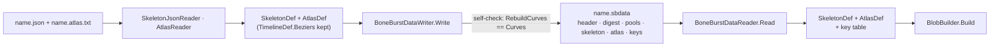

# Baked data (`.sbdata`, format version 1)

BoneBurst's own file for one skeleton and its atlas. It is baked from a Spine JSON export: `SkeletonJsonReader` and `AtlasReader` build the model, and `BoneBurstDataWriter` writes it. At runtime `BoneBurstDataReader` gives back **the same `SkeletonDef` and `AtlasDef`, bit for bit**, without parsing text. Every number is stored as the reader produced it, and nothing is quantized. Each string is stored once; arrays are stored once per object, so sharing survives. Bézier curves are stored as their 4 control points and rebuilt with the same `CurveBaker` calls. Plan: [BoneBurst-BakePlan.md](../Review/BoneBurst-BakePlan.md).



## 1. Encoding

| Type | Bytes |
|---|---|
| `u8`, `bool` | 1 |
| `u16`, `i32`, `u64`, `f32` | little-endian, 2 / 4 / 8 / 4. `f32` is the raw IEEE bits: `-0`, NaN payloads and denormals survive |
| `varuint` | LEB128, 7 bits per byte |
| `varint` | zigzag, then `varuint`: -1 is one byte |
| `str` | `varuint`: 0 = null, else string pool index + 1 |
| `floats`, `ints` | `varuint`: 0 = null, else pool index + 1 |
| `att` | `varuint`: 0 = null, else attachment index + 1 |
| `list?` | `varuint`: 0 = null list, else length + 1 |
| `color` | `bool exact`; exact: 4 × `u8` (each channel is `byte / 255f`, what both readers produce); else 4 × `f32` |

## 2. Layout

```
header   "SBDF" · u16 version (1) · f32 scale · u64 FNV-1a-64 of everything after the header
payload  bytes sourceDigest · pools · skeleton · atlas · keys
```

**Pools**, written before the sections that refer to them:
- **Strings:** `varuint count`, then each as `varuint length` + UTF-8.
- **Float arrays:** `varuint count`, then each entry, either
  - `u8 0` · `varuint length` · `length × f32` (dense), or
  - `u8 1` · `varuint length` · `varuint base` (0 = zeros, else an **earlier** entry + 1) · `varuint start` · `varuint count` · `count × f32` (sparse: the base with one range overwritten).
- **Int arrays:** `varuint count`, then each as `varuint length` + `length × varint`.

Arrays are pooled **by object**, not by value. The linked mesh that shares its source's `Vertices`, the deform key that *is* the setup vertices and the shared `Array.Empty` read back shared the same way. The writer uses sparse entries only for deform keys: the range whose bits differ from the setup vertices (unweighted) or from zeros (weighted).

**Skeleton**, in this order:

| Section | Per item |
|---|---|
| Header | `str Hash, Version` · `f32 X, Y, Width, Height, ReferenceScale, Fps` |
| Bones | `str Name` · `varint Parent` · `f32 Rotation, X, Y, ScaleX, ScaleY, ShearX, ShearY` · `u8 Inherit` · `f32 Length` · `bool SkinRequired` |
| Slots | `str Name` · `varint Bone` · `color Color` · `bool HasDarkColor` · `color DarkColor` (alpha 1) · `str AttachmentName` · `u8 Blend` |
| Events | `str Name` · `varint Int` · `f32 Float` · `str String, AudioPath` · `f32 Volume, Balance` |
| Constraints | `u8 Kind` · `str Name` · `bool SkinRequired` · the kind's fields in declaration order (`BoneBurstDataWriter.WriteConstraint`) |
| Attachments | count, then every kind (`u8`), then every body: the objects are created first so references can point forward |
| Skins | `str Name` · `ints Bones, Constraints` · entries: `varint Slot` · `str Placeholder` · `varuint attachment` |
| Default skin | `varint` index into skins, -1 = none |
| Animations | `str Name` · `f32 Duration` · timelines |

**Attachments:** each is listed once, in skin-entry order. Then:
- Every attachment starts with `str Name`.
- Vertex attachments (mesh, path, clipping, bounding box) continue with `ints Bones` · `floats Vertices` · `varint WorldVerticesLength` · `att TimelineAttachment`.
- A mesh then adds `str Path` · `color` · sequence · `varint HullLength` · `floats RegionUVs` · `ints Triangles, TimelineSlots` · `f32 Width, Height` · `att SourceMesh`.
- A linked mesh is a mesh whose `SourceMesh` is set. Its shared arrays are the same pool entries as its source's.

**Timeline:**
1. `u8 Kind` · `varint Target, FrameCount` · `floats Frames`.
2. Curves:
   - `bool` has curves; if true: `floats Beziers` (4 per block) · `varuint channels` · `FrameCount − 1` × `u8` segment type (0 linear, 1 stepped, 2 Bézier).
   - The reader rebuilds `Curves` with `BoneBurstDataReader.RebuildCurves`, which makes the same `CurveBaker.Bezier` / `DeformBezier` calls, with the same frame values, as the reader that first built the timeline.
3. `list? AttachmentNames` (each `str`) · `varint Skin` · `att Attachment`.
4. `list? Deform` (each `floats`) · `list? DrawOrders` (each `ints`) · `ints FolderSlots`.
5. `list? Events`: each `f32 Time` · `varint Event, Int` · `f32 Float` · `str String` · `f32 Volume, Balance`.

**Atlas:**
- Pages: `str Name` · `varint Width, Height` · `str Format, MinFilter, MagFilter` · `bool RepeatU, RepeatV, Pma`.
- Regions: `str Name` · `varint Page, X, Y, Width, Height` · `f32 OffsetX, OffsetY` · `varint OriginalWidth, OriginalHeight, Degrees, Index` · `f32 U, V, U2, V2` · `varint PackedWidth, PackedHeight` · `list? Extra` (each `str` + `ints`).

**Keys**, from `BoneBurstKeyTable.BuildEntries` at bake time: `u8 Kind` · `varint Index` · `i32 Id` · `bool suffixed` (then `str Key`). The name is not stored; it is the named item's own name. The id is stored so a change in Unity's `PropertyName` hash is detected: `BoneBurstKeyTable` refuses a table whose ids no longer match (see [NameKeys.md](NameKeys.md)).

## 3. What is not written, and why

| Field | Why |
|---|---|
| `MeshDef.Edges` | Nonessential editor data (mesh wireframe edges); nothing in the runtime reads it |
| `SkeletonDef.ImagesPath`, `AudioPath` | Folders on the machine that exported the file; never read, and not something to ship |

Everything else in `SkeletonDef`, `TimelineDef`, `AtlasDef` is written, including `Hash`, `Version`, `Fps` and the skeleton's bounds, which cost a few bytes. `TimelineDef.Beziers` is new: `CurveBaker.Create(TimelineDef, …)`, `Bezier(TimelineDef, …)` and `DeformBezier(TimelineDef, …)` record the control points while both readers bake, and the arithmetic is unchanged.

## 4. Refusals (`SkeletonFormatException`)

**Writer:**
- A timeline with curves but no `Beziers`.
- Curves that do not rebuild bit for bit from their control points. Every timeline is checked while writing.
- An attachment reference to an attachment in no skin.
- A default skin missing from the skin list.
- An unknown constraint or attachment type.

**Reader:**
- The wrong magic.
- Another format version (message: "Rebake it").
- A checksum mismatch.
- A truncated file, or bytes left after the last section.
- An index or count out of range; counts are checked against the bytes left, so a damaged count cannot allocate gigabytes.
- A sparse range out of bounds, or a sparse base that is not earlier.
- Curve segment types that use more control points than stored.
- A linked mesh whose source is not a mesh.

## 5. Checked (2026-09-30, Unity 6000.6.3f1, `BakedDataTests`, 98 of 98)

- **Round trip on all 45 corpus cases** (every JSON and binary skeleton in the reader parity corpus, at scale 1 and 0.37):
  - Source model = read-back model, field by field over every public field (`DeepComparer`), floats by bits.
  - `BlobBuilder.BuildContent` of each is identical.
  - Writing the read-back model gives identical bytes.
- **Keys:** same keys, kinds, names, indices, and stored id = the key's id.
- **Refusals:** a damaged byte, a truncated file, another version, the wrong magic, curves without control points, and curves that do not rebuild.
- **Deliberate bugs** (`CLAUDE.md` §5), each reverted after:
  - Reading physics `Wind` and `Gravity` swapped: 6 failures (every file with physics).
  - Sparse arrays ignoring their base: 8 failures.
- **Nothing else moved.** The rest of the Editor suite: the same 142 failures, per class, as before. Play mode: 32 of 32.

**Sizes** (baked against JSON + atlas, scale 1):

| File | Source | Baked | |
|---|---|---|---|
| spineboy-pro | 194,899 B | 69,501 B | 36% |
| raptor-pro | 294,768 B | 85,362 B | 29% |
| mix-and-match-pro | 732,335 B | 267,801 B | 37% |
| celestial-circus-pro | 171,866 B | 59,322 B | 35% |
| every JSON in the corpus | | | 29–65% (small files keep a fixed overhead) |

Against Spine's own binary export the baked file is 7–14% **larger** (cloud-pot, sack-pro, snowglobe-pro). Spine's binary stores colour keys as bytes; version 1 stores every timeline value as `f32`. That is the first thing to try for version 2: colour timelines as bytes when exact, as `color` already does.
