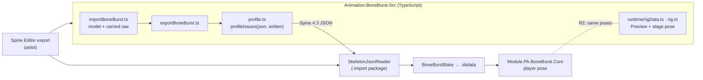

# The BoneBurst profile of Spine 4.3 JSON

A **BoneBurst file is a Spine 4.3 JSON skeleton**, read as [Format-Json-Atlas.md](Format-Json-Atlas.md) specifies, with the rules below on top. There is no BoneBurst dialect: an artist's export from the Spine Editor and an export from the BoneBurst editor (`Animation-BoneBurst-Src/`, AGPL, a separate program in this repository) are the same kind of file, and both BoneBurst runtimes read both. This page says what the two sides must agree on, where Spine's own runtimes disagree with each other and which side BoneBurst takes, and what each side does with each part of a file. It is an overlay: every key, default and unit is in Format-Json-Atlas.md, and every behaviour in the runtime specs it links.

Status 2026-10-05: written for R1 of the editor's pipeline plan (`Animation-BoneBurst-Src/docs/BONEBURST-PIPELINE-PLAN.md`); since R2 both runtimes are held to the same poses on the same files (§6).

Status 2026-10-06: the editor side is now the BoneBurst Editor (`Editor-BoneBurst-Src/`, MIT, written from scratch), whose document is the Spine 4.3 JSON itself: it reads and writes a file exactly as it was (no import or export step), checks it with its own `src/model/profile.ts` (`profileIssues`), and is held to BoneBurst's C# runtime by its `scripts/unity-parity.ts` on the same dump. The diagram above and the "BoneBurst editor" column below describe the old editor (`Animation-BoneBurst-Src/`), which stays as v2's oracle (`Editor-BoneBurst-Src/docs/E6-PLAN.md`).

## 1. Rules for every file

What both BoneBurst readers require. The C# reader throws on each (its message quoted); the editor's `profileIssues` reports each in the same words, and its tests hold every sample to them.

| Rule | C# `SkeletonJsonReader` | Editor |
|---|---|---|
| A `skeleton` header whose `spine` starts with `4.3` | throws ("supports Spine 4.3 only") | importer refuses; `profileIssues` |
| Bones parent-first, every `parent` an earlier bone | throws "parent bone not found" | `profileIssues` |
| Every slot's `bone` exists | throws "bone not found" | `profileIssues` |
| Constraint `type` is `ik`, `transform`, `path`, `physics` or `slider` | throws "unknown constraint type" | runtime lists it as unsupported; `profileIssues` |
| Transform property names are `rotate x y scaleX scaleY shearY` | throws "unknown transform property" | `profileIssues` |
| Attachment `type` is `region mesh linkedmesh boundingbox path point clipping` | throws "unknown attachment type" | runtime lists it; `profileIssues` |
| A mesh is **linked when it names a `source`**, whatever its `type` (§8.4); the source is in `slot` (default: its own slot) of `skin` (default: default) | throws "source mesh not found" | runtime and `profileIssues` (both fixed to this rule 2026-10-05, below) |
| A non-linked mesh has `uvs`, `vertices`, `triangles`; a path has `lengths` | throws | `profileIssues` |
| Every animation's bone, slot, constraint, skin, attachment and event names exist | throws ("bone not found", "timeline attachment not found", "event not found", …) | `profileIssues` |
| Timeline names are the exact lower-case names of §11.3–11.4 | **skips an unknown name silently** | `profileIssues` reports it; it is the one silent drop the profile exists to catch |

Unknown keys inside an object are ignored by every reader, stock and BoneBurst: that is how nonessential data (`color`, `icon`, `visible`, `width`, …) stays harmless.

## 2. Rules for files BoneBurst writes

What the editor's export must also hold (`profileIssues(json, { written: true })`, checked on every export the editor's parity and round-trip suites make):

- **`skeleton.hash`** present. Stock spine-csharp requires it; spine-core and BoneBurst's readers do not, so only a Unity check with spine-unity would catch its absence.
- `skeleton.spine` is `"4.3.0"`.
- Everything in §1.

Not required: `fps`, `x`, `y`, `width`, `height`, `images`, `audio`. They are nonessential, and the editor's *Export ▸ nonessential* setting may leave them out.

## 3. Where Spine's runtimes disagree, and where BoneBurst stands

| Point | spine-csharp 4.3.40 (Format-Json-Atlas.md) | spine-core 4.3.13 (measured by the editor) | BoneBurst C# | BoneBurst editor |
|---|---|---|---|---|
| `fps` absent | 30 | 0 | 30 (stored in `.sbdata`, nothing plays from it) | 0; the Preview steps at 24 |
| Event with `audio`, no `volume` | volume 1 (§10) | volume 0 | as spine-csharp | as spine-csharp (editor ARCHITECTURE ▸ Events with audio) |
| Event key with no `balance` | the event's balance (§11.13) | the event's **volume** | as spine-csharp | as spine-csharp |
| `skeleton.hash` absent | required | accepted | accepted | accepted when read; always written |

BoneBurst follows spine-csharp wherever the two stock runtimes differ: the game runs the C# side, and spine-csharp is its parity oracle.

## 4. Coverage: what each side does with each part

| Part | C# reader + bake + Core | Editor runtime (Preview, stage) | Editor model |
|---|---|---|---|
| JSON | reads | reads | opens, edits, writes |
| `.skel` binary | reads (Format-Binary.md) | – | – |
| Bones (every inherit mode), slots, skins, skin bones and constraints | yes | yes | edits |
| Region, mesh, linked mesh, bounding box, point, path, clipping, sequences | yes | yes | edits |
| IK, transform, path, physics, slider constraints and their keys | yes | yes | edits |
| Bone, slot, attachment (deform, sequence), draw order, event timelines | yes | yes | edits |
| **`drawOrderFolder`** (new in 4.3, Timelines.md §3.7) | yes | **no**: listed as unsupported on the Preview's chip | carried untouched |
| Anything else the editor does not model | – | – | carried untouched (`carry.ts`, written back as read) |
| Bake | lossless `.sbdata` (BakedData.md); edges and image/audio paths dropped | – | – |

## 5. Behaviour: one set of specs for both runtimes

The runtime specs in this folder ([Timelines.md](Timelines.md), [AnimationState.md](AnimationState.md), [Constraints.md](Constraints.md), [Constraints-Path-Physics.md](Constraints-Path-Physics.md), [Pose-and-Mesh.md](Pose-and-Mesh.md), [Clipping.md](Clipping.md), [Skins-TintBlack-Culling.md](Skins-TintBlack-Culling.md)) are the behaviour both BoneBurst runtimes implement. The editor's runtime was written from spine-core as a black-box oracle before it could read them, and three of its bugs were already answered here:

| Editor bug (found, fixed) | Already in |
|---|---|
| A local pose derived from a mirrored world had shear y 180° out (2026-10-05) | Constraints.md §5, world → local decomposition |
| An additive world shear y was wrapped into ±180° before its mix (2026-10-05) | Constraints.md §7.4: "Additive world shear does not wrap" |
| A linked mesh whose source is in another slot drew nothing, and was linked by `type` rather than by `source` (2026-10-05) | Format-Json-Atlas.md §8.4 and §9, step 6 |

From R1 on, a behaviour either runtime measures is written into these specs, and a change to either runtime reads them first.

## 6. How it is checked

- **Editor**: `tests/boneburstProfile.test.ts` (each rule caught on a broken file; every spine-unity sample passes as a file to read), and `spineParity` / `spineImport`, which hold every export they make to §2. `tests/spineRuntime.test.ts` holds the linked-mesh rule and the unsupported-section rule against spine-core.
- **C#**: the reader's own tests (`com.module.ta-creator-boneburst-import/Tests`), and the parity harness against spine-csharp.
- **Both, on the same files**: the editor's `tests/boneburstUnity.test.ts` runs the parity harness's dump mode (`Tools~/ParityHarness/run.sh --dump`, `Dump.cs`) on 34 files (the editor's exports, every spine-unity sample, and every sample re-exported by the editor) and compares BoneBurst's C# pose with the editor's frame by frame. All match (pipeline plan R2). Not yet baked: the bake's keys need the Editor.
