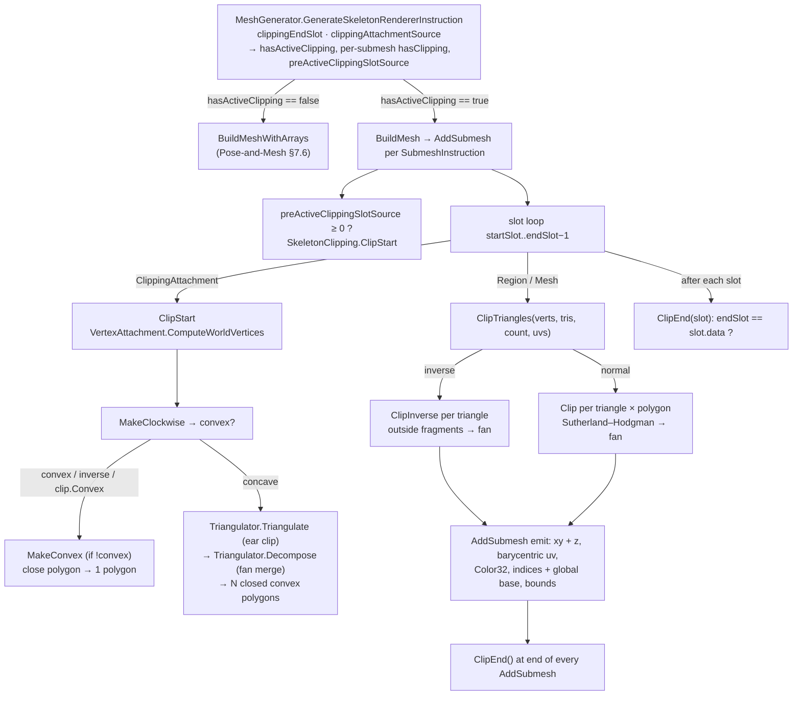

# Spine 4.3 clipping attachments in spine-unity: clean-room specification

This spec covers what stock spine-csharp **4.3.40** / spine-unity **4.3.109** (vendored at upstream `4.3` commit `7ce5d0da`) do when a `ClippingAttachment` is on an active slot. It covers which slots are clipped (`MeshGenerator.GenerateSkeletonRendererInstruction` and `MeshGenerator.AddSubmesh`), how the clip polygon is built (`SkeletonClipping.ClipStart`, `MakeClockwise`, `MakeConvex`, `Triangulator.Triangulate` / `Decompose`), how every triangle is clipped (`SkeletonClipping.ClipTriangles`, `Clip`, `ClipInverse`), and how `AddSubmesh` writes the result into the vertex, UV, colour, index and bounds buffers. The aim is bit-identical output. Numeric rules (float32, one rounding per operation, left-to-right evaluation, no FMA) are those of [Pose-and-Mesh.md §1](Pose-and-Mesh.md#1-numeric-conventions) and apply to every expression here. The non-clipping mesh path is [Pose-and-Mesh.md §7.6](Pose-and-Mesh.md#76-buffers-vertex-order-and-indices-default-path-buildmeshwitharrays), and §4 below contrasts the two. Clipping attachment data (`end`, `convex`, `inverse`, vertices) is in [Format-Json-Atlas.md §8.8](Format-Json-Atlas.md) and [Format-Binary.md §6.7](Format-Binary.md). No reference source is reproduced. All pseudocode is written from scratch, and its types are explicit.



---

## Contents

1. [When clipping is active](#1-when-clipping-is-active)
2. [ClipStart: building the clip polygons](#2-clipstart-building-the-clip-polygons)
3. [ClipTriangles: clipping one attachment](#3-cliptriangles-clipping-one-attachment)
4. [How AddSubmesh writes the buffers](#4-how-addsubmesh-writes-the-buffers)
5. [Ambiguities / verified only by reading](#5-ambiguities--verified-only-by-reading)

Pseudocode conventions: `FloatList` and `IntList` are growable lists with `count`, `add`, `clear`, and indexed access. A "point" is an `(x, y)` float pair stored as two consecutive floats. A polygon is **closed** when its last point repeats its first. `f32` arithmetic follows Pose-and-Mesh §1. `a*b - c*d` always means `(a*b) - (c*d)`.

---

## 1. When clipping is active

Two separate walks decide clipping, and they do not agree in every edge case:

* the **instruction walk** (`GenerateSkeletonRendererInstruction`, once per frame), which decides the path, the submesh splits and each submesh's starting clip;
* the **render walk** (`AddSubmesh`, once per submesh), which actually calls `SkeletonClipping`.

A parity implementation must reproduce both walks, including where they disagree (§1.5).

### 1.1 The clipper's state machine (`SkeletonClipping`)

| Member | Meaning |
|---|---|
| `clipAttachment` | The active clip, or null. `IsClipping` is `clipAttachment != null`. |
| `clippingPolygons` | The ordered list of **closed convex** polygons for the active clip (§2). |
| `inverse` | Copied from the active clip's `Inverse` flag at `ClipStart`. |

| Call | Effect |
|---|---|
| `ClipStart(skeleton, slot, clip)` | If a clip is already active, it does **nothing** and returns 0. Nested clips are ignored. Otherwise it sets `clipAttachment = clip` and builds `clippingPolygons` (§2). |
| `ClipEnd(slot)` | If a clip is active **and** `clip.endSlot` is the same `SlotData` object as `slot.data`, it calls `ClipEnd()`. Otherwise it does nothing. A clip with `endSlot == null` never ends here. |
| `ClipEnd()` | If no clip is active, it does nothing. Otherwise it sets `clipAttachment = null` and empties `clippingPolygons`. |

`MeshGenerator.Begin()` calls `ClipEnd()`, and so does the end of every `AddSubmesh`. **A clip never survives from one submesh to the next by itself.** The only way a clip crosses a submesh boundary is `preActiveClippingSlotSource` (§1.3).

### 1.2 Path selection

Stock uses the clipping path when `SkeletonRendererInstruction.hasActiveClipping` is true **and** there is at least one submesh instruction. Otherwise `BuildMeshWithArrays` runs. `hasActiveClipping` is true when the instruction walk meets **any** `ClippingAttachment` on a slot that it does not skip (§1.3). It does **not** depend on `settings.useClipping`. With `useClipping = false` the clipping path still runs, with the §4 vertex order, but it never clips anything.

On the clipping path **every** submesh goes through `AddSubmesh`, including submeshes that contain no clip.

### 1.3 Instruction walk (the clipping-relevant parts)

Walker state: `clippingEndSlot : SlotData = null`, `clippingAttachmentSource : int = -1`, `lastPreActiveClipping : int = -1`. `current` is the open `SubmeshInstruction` (see Pose-and-Mesh §7.3 for materials and splitting).

```
for (int i = 0; i < drawOrder.count; i++) {
    Slot slot = drawOrder[i];
    bool skip = !slot.bone.active
             || (slot.color.a == 0f && slot.data != clippingEndSlot);   // alpha exemption for the end slot only
    if (skip) continue;                                                 // NOTE: the end-slot test below is not reached

    Attachment att = slot.attachment;
    bool noRender = !(att is RegionAttachment || att is MeshAttachment);
    if (att is ClippingAttachment clip) {
        clippingEndSlot = clip.endSlot;          // overwrites any clip already being tracked
        clippingAttachmentSource = i;
        current.hasClipping = true;
        hasActiveClipping = true;
    }

    // Submesh split (material change, separator), as in Pose-and-Mesh §7.3. At every split:
    //     closed.preActiveClippingSlotSource = lastPreActiveClipping;
    //     lastPreActiveClipping = clippingAttachmentSource;       // value BEFORE this slot's end test
    //     newCurrent.hasClipping = (clippingAttachmentSource >= 0);
    //     newCurrent.startSlot = i;

    if (clippingEndSlot != null && slot.data == clippingEndSlot && i != clippingAttachmentSource) {
        clippingEndSlot = null;
        clippingAttachmentSource = -1;
    }
}
// last submesh (only if its rawVertexCount > 0): preActiveClippingSlotSource = lastPreActiveClipping
```

Consequences:

* The **first** submesh always has `preActiveClippingSlotSource = -1`.
* A submesh that starts while a clip is being tracked records that clip's draw-order index. `AddSubmesh` then calls `ClipStart` on that slot's current attachment before its own slot loop. That slot lies before `startSlot`, and `ClipStart` does not check it for bone or alpha.
* When a split happens **at** the end slot, the new submesh still starts with the clip, because `lastPreActiveClipping` is captured before the end test. The render walk clips that end slot, then ends the clip after it. The two walks agree here.
* `SubmeshInstruction.hasClipping` gates clipping inside `AddSubmesh`: `useClipping = settings.useClipping && instruction.hasClipping`.
* **Alpha-0 end slot.** An end slot whose slot alpha is 0 is **not skipped** by the instruction walk. If it holds a region or mesh, its material and raw counts take part in splitting, so it can cause an extra split or even a trailing submesh that the render walk then leaves empty. `AddSubmesh` does skip it (§1.4).

### 1.4 Render walk (`AddSubmesh`)

```
bool useClipping = settings.useClipping && instruction.hasClipping;
if (useClipping && instruction.preActiveClippingSlotSource >= 0) {
    Slot s = drawOrder[instruction.preActiveClippingSlotSource];
    clipper.ClipStart(skeleton, s, (ClippingAttachment)s.attachment);
}
for (int slotIndex = instruction.startSlot; slotIndex < instruction.endSlot; slotIndex++) {
    Slot slot = drawOrder[slotIndex];
    if (!slot.bone.active || slot.color.a == 0f) { clipper.ClipEnd(slot); continue; }   // skipped slots still END a clip
    Attachment att = slot.attachment;
    if (att is RegionAttachment || att is MeshAttachment) {
        // compute world verts, uvs, triangles, color (§4)
        // if (useClipping && clipper.IsClipping && clipper.ClipTriangles(...)) replace them (§3)
        // emit if vertexCount != 0 && indexCount != 0 (§4)
        clipper.ClipEnd(slot);                                  // end slot is clipped INCLUSIVELY
        continue;
    }
    if (useClipping && att is ClippingAttachment clip) {
        clipper.ClipStart(skeleton, slot, clip);                // ignored if a clip is already active
        continue;                                               // NOTE: no ClipEnd(slot) for this slot
    }
    clipper.ClipEnd(slot);                                      // null, bounding box, point, path (or clip with useClipping false)
}
clipper.ClipEnd();
```

### 1.5 Rule table

| Situation | Render result (what the mesh shows) |
|---|---|
| Clip at draw-order index *c*, end slot at *e* > *c* | Renderable slots *c*+1 .. *e* **inclusive** are clipped. |
| `endSlot == null` (JSON `end` absent) | Clipped until the end of the submesh, and through `preActiveClippingSlotSource` until the end of the skeleton. |
| End slot is the clip's own slot | That slot never runs `ClipEnd(slot)`, because of the `continue` after `ClipStart`, and the instruction walk excludes it with `i != clippingAttachmentSource`. Clips to the end of the skeleton. |
| End slot is **before** the clip in draw order | Never met again, so it clips to the end of the skeleton. The two walks agree. |
| End slot is skipped (inactive bone, or alpha 0) | Render: `ClipEnd(slot)` still runs, so the clip **ends** there. Instruction: an **inactive-bone** end slot is `continue`d before the end test, so the walker still tracks the clip. Every **later** submesh then gets `preActiveClippingSlotSource = c` and is **clipped again** by that clip until the end of the skeleton. Within the same submesh, clipping stops at the end slot. An **alpha-0** end slot is exempt from the skip, so the two walks agree. |
| End slot holds a null / bounding box / point / path attachment | Ends the clip there, in both walks. |
| End slot holds another `ClippingAttachment` | Render: `ClipStart` is ignored (a clip is active) and `continue` skips `ClipEnd(slot)`, so the **outer clip does not end** there. It runs to the end of the submesh. Instruction: the walker switches to the inner clip (see next row). |
| Nested clip (a second clip while one is active) | Render: the second clip is ignored completely, and the outer clip keeps its own end slot. Instruction: the walker **replaces** its state with the inner clip (`clippingEndSlot`, `clippingAttachmentSource`). Any submesh that starts while the walker tracks the inner clip calls `ClipStart` on the **inner** clip, even if the outer clip had already ended or would still be active. So a material split inside a nested region changes which polygon clips. |
| Clip on a slot whose bone is inactive | Skipped by both walks, so no `ClipStart`. If it is the only clip, `hasActiveClipping` stays false and `BuildMeshWithArrays` runs. |
| Clip on an alpha-0 slot (not an end slot) | Skipped by both walks, like the row above. If it is also the **end slot** of the currently tracked clip, the instruction walk does not skip it and starts tracking it. A later submesh may then `ClipStart` it (pre-active), while the render walk never started it. |
| `ClipEnd(slot)` / `ClipEnd()` with no active clip | No-op. |
| `settings.useClipping == false` | Clip attachments behave like noRender slots. The clipping path's vertex order still applies if `hasActiveClipping`. |
| End of each `AddSubmesh`, and `Begin()` | `ClipEnd()`: unconditional reset. |

---

## 2. ClipStart: building the clip polygons

### 2.1 World vertices

`n = clip.worldVerticesLength` (2 × vertex count). The clip's world vertices are computed with the ordinary vertex-attachment transform, stride 2, into `clippingPolygon` (count `n`). This is [Pose-and-Mesh §6.2](Pose-and-Mesh.md#62-world-vertices): unweighted uses the slot's bone, weighted accumulates influences, and deform is used when the slot's deform array is non-empty. The polygon is **open** here: the last point is not repeated.

### 2.2 Decision

```
bool convex = MakeClockwise(clippingPolygon);       // always runs; may reverse the polygon in place
if (convex || clip.inverse || clip.convex) {
    if (!convex) MakeConvex(clippingPolygon);       // convex hull, clockwise
    close(clippingPolygon);                         // append point 0
    clippingPolygons = [ clippingPolygon ];
} else {
    IntList tris = Triangulate(clippingPolygon);    // §2.5, on the clockwise polygon
    clippingPolygons = Decompose(clippingPolygon, tris);   // §2.6, each result closed
}
```

### 2.3 `MakeClockwise(poly)`: winding normalisation and convexity test

`m = n / 2` points `P[0..m-1]`.

```
bool noCW = true, noCCW = true;
float area = 0;
float prevX = P[m-1].x, prevY = P[m-1].y, currX = P[0].x, currY = P[0].y;
for (int k = 1; k < m; k++) {                       // next = P[k]; cross is taken at P[k-1]
    float nextX = P[k].x, nextY = P[k].y;
    area = area + ((currX * nextY) - (nextX * currY));
    float cross = ((currX - prevX) * (nextY - currY)) - ((currY - prevY) * (nextX - currX));
    noCCW = noCCW && (cross <= 0);
    noCW  = noCW  && (cross >= 0);
    prevX = currX; prevY = currY; currX = nextX; currY = nextY;
}
// closing edge P[m-1] → P[0]; cross at P[m-1]
area = area + ((currX * P[0].y) - (P[0].x * currY));
float crossLast = ((currX - prevX) * (P[0].y - currY)) - ((currY - prevY) * (P[0].x - currX));
noCCW = noCCW && (crossLast <= 0);
noCW  = noCW  && (crossLast >= 0);
if (area >= 0) { reverse point order of P in place; return noCW; }
return noCCW;
```

* The order of the cross products is P[0] (with prev = P[m-1]), P[1], …, P[m-2], then P[m-1]. The area terms are summed edge 0→1, 1→2, …, then the closing edge.
* `&=` has no short circuit: every cross is evaluated. A NaN cross fails both tests, so the polygon counts as not convex.
* **Reverse:** new `P[k]` = old `P[m-1-k]`, which is a plain full reversal (for odd `m` the middle point stays in place).
* `area >= 0` includes 0, so a degenerate polygon is reversed and judged by `noCW`.
* Result: the polygon is **clockwise** in y-up terms (negative shoelace area), and the returned flag says whether every turn has the same sign (zero allowed).

### 2.4 `MakeConvex(poly)`: monotone-chain hull (only when `!convex` and inverse or `clip.convex`)

`sorted` is a scratch float array (stock borrows `clipOutput`). `v` is `poly`'s own storage, which is overwritten in place. The input is the clockwise polygon of §2.3, with `n` floats.

```
// 1. Stable insertion sort of the points by x ascending, then y ascending.
sorted[0] = v[0]; sorted[1] = v[1];
for (int i = 2; i < n; i += 2) {
    float x = v[i], y = v[i+1];
    int p = i - 2;
    while (p >= 0 && (sorted[p] > x || (sorted[p] == x && sorted[p+1] > y))) {
        sorted[p+2] = sorted[p]; sorted[p+3] = sorted[p+1]; p -= 2;
    }
    sorted[p+2] = x; sorted[p+3] = y;
}

// Turn(s, x, y) = ((v[s-2] - v[s-4]) * (y - v[s-3])) - ((v[s-1] - v[s-3]) * (x - v[s-4]))

// 2. First chain, left to right.
v[0] = sorted[0]; v[1] = sorted[1]; v[2] = sorted[2]; v[3] = sorted[3];
int s = 4;
for (int i = 4; i < n; i += 2, s += 2) {
    float x = sorted[i], y = sorted[i+1];
    while (Turn(s, x, y) >= 0) { s -= 2; if (s == 2) break; }
    v[s] = x; v[s+1] = y;
}

// 3. Second chain, right to left, starting from the SECOND-TO-LAST sorted point, pushed unconditionally.
v[s] = sorted[n-4]; v[s+1] = sorted[n-3];
int t = s;
s += 2;
for (int i = n - 6; i >= 0; i -= 2, s += 2) {
    float x = sorted[i], y = sorted[i+1];
    while (Turn(s, x, y) >= 0) { s -= 2; if (s == t) break; }
    v[s] = x; v[s+1] = y;
}
poly.count = s - 2;       // drops the final sorted[0], which duplicates v[0]
```

* The `while` tests `Turn` **before** each pop, and the break test comes **after** the pop. With `s == 4`, a true test pops to 2 and stops.
* Collinear points are popped (`>= 0`). The result has no collinear points except where the break guards stop the popping.
* Writes can reach index `s+1` with `s` above the original `n` (see §5, item 4). Size the storage for at least `n + 4` floats.
* The output starts at the lowest-x (then lowest-y) point and is clockwise in y-up.

### 2.5 `Triangulate(poly)`: ear clipping

Inputs: the clockwise, open polygon (`m` points, `vertices = poly`). All index lists below are point indices. `vertices[2*j]` and `vertices[2*j+1]` are point `j`.

```
bool PositiveArea(float p1x, float p1y, float p2x, float p2y, float p3x, float p3y)
    => ((p1x * (p3y - p2y)) + (p2x * (p1y - p3y))) + (p3x * (p2y - p1y)) >= 0;

bool IsConcave(int idx, int count, IntList indices)
{
    int pv = indices[idx > 0 ? idx - 1 : count - 1];
    int cu = indices[idx];
    int nx = indices[idx + 1 < count ? idx + 1 : 0];
    return !PositiveArea(X(pv), Y(pv), X(cu), Y(cu), X(nx), Y(nx));
}

IntList indices = [0, 1, …, m-1];
BoolList isConcave; for (int i = 0; i < m; i++) isConcave[i] = IsConcave(i, m, indices);
IntList triangles = [];
int vertexCount = m;

while (vertexCount > 3) {
    int previous = vertexCount - 1, i = 0, next = 1;
    while (true) {                                           // find ear tip
        if (!isConcave[i]) {
            int a = indices[previous], b = indices[i], c = indices[next];
            float p1x = X(a), p1y = Y(a), p2x = X(b), p2y = Y(b), p3x = X(c), p3y = Y(c);
            bool blocked = false;
            int ii = next + 1 < vertexCount ? next + 1 : 0;
            while (ii != previous) {
                if (isConcave[ii]) {
                    int w = indices[ii];
                    float vx = X(w), vy = Y(w);
                    if (PositiveArea(p3x, p3y, p1x, p1y, vx, vy)
                     && PositiveArea(p1x, p1y, p2x, p2y, vx, vy)
                     && PositiveArea(p2x, p2y, p3x, p3y, vx, vy)) { blocked = true; break; }
                }
                ii++; if (ii == vertexCount) ii = 0;
            }
            if (!blocked) break;                             // ear at i
        }
        if (next == 0) {                                     // wrapped: no clean ear, fall back
            do { if (!isConcave[i]) break; i--; } while (i > 0);   // i may stop at 0 even if concave
            previous = i > 0 ? i - 1 : vertexCount - 1;
            next = i + 1 < vertexCount ? i + 1 : 0;
            break;
        }
        previous = i; i = next; next++; if (next == vertexCount) next = 0;
    }
    triangles.add(indices[previous]); triangles.add(indices[i]); triangles.add(indices[next]);
    indices.removeAt(i); isConcave.removeAt(i);             // shift down, order kept
    vertexCount--;
    int previousIndex = i > 0 ? i - 1 : vertexCount - 1;
    int nextIndex = i < vertexCount ? i : 0;
    isConcave[previousIndex] = IsConcave(previousIndex, vertexCount, indices);
    isConcave[nextIndex]     = IsConcave(nextIndex, vertexCount, indices);
}
if (vertexCount == 3) { triangles.add(indices[2]); triangles.add(indices[0]); triangles.add(indices[1]); }
```

* The scan always restarts at `i = 0` after each cut. The fallback runs when the scan reaches `i = vertexCount - 1` (`next == 0`) without an ear. It then walks **down** from `vertexCount - 1` to the first non-concave position, stopping at 0.
* `previousIndex` is recomputed first, then `nextIndex`. Both use the new `vertexCount`. When `i == vertexCount` after the decrement, `nextIndex` wraps to 0.
* The last triangle is emitted as `(indices[2], indices[0], indices[1])`, a rotation.

### 2.6 `Decompose(poly, triangles)`: merging triangles into convex polygons

Work with **doubled** indices `tK = 2 × pointIndex` (stock stores those). Only equality is ever tested on them, so point indices work just as well if used consistently. `Winding(a, b, c)` is `+1` if `PositiveArea(a, b, c)` holds, else `-1` (so NaN gives −1).

```
List<FloatList> polys = []; List<IntList> polyIdx = [];
FloatList polygon = []; IntList polygonIndices = [];
int fanBaseIndex = -1, lastWinding = 0;

// Pass 1: merge consecutive triangles that share their FIRST index into fans.
for (int k = 0; k < triangles.count; k += 3) {
    int t1 = triangles[k], t2 = triangles[k+1], t3 = triangles[k+2];
    Point A = P[t1], B = P[t2], C = P[t3];
    if (fanBaseIndex == t1) {
        Point pp = polygon.point(polygon.pointCount - 2), pl = polygon.point(polygon.pointCount - 1);
        Point f0 = polygon.point(0), f1 = polygon.point(1);
        if (Winding(pp, pl, C) == lastWinding && Winding(C, f0, f1) == lastWinding) {
            polygon.addPoint(C); polygonIndices.add(t3);
            continue;                                   // lastWinding and fanBaseIndex unchanged
        }
    }
    if (polygon.count > 0) { polys.add(polygon); polyIdx.add(polygonIndices); polygon = new; polygonIndices = new; }
    polygon = [A, B, C]; polygonIndices = [t1, t2, t3];
    lastWinding = Winding(A, B, C);
    fanBaseIndex = t1;
}
if (polygon.count > 0) { polys.add(polygon); polyIdx.add(polygonIndices); }

// Pass 2: absorb leftover triangles into each polygon.
int N = polys.count;                                    // fixed for the whole pass
for (int i = 0; i < N; i++) {
    IntList idx = polyIdx[i];
    if (idx.count == 0) continue;
    int firstIndex = idx[0], lastIndex = idx[idx.count - 1];
    FloatList poly_i = polys[i];
    Point prevPrev = poly_i.point(poly_i.pointCount - 2), prev = poly_i.point(poly_i.pointCount - 1);
    Point first = poly_i.point(0), second = poly_i.point(1);
    int winding = Winding(prevPrev, prev, first);       // computed once per i
    for (int ii = 0; ii < N; ii++) {
        if (ii == i) continue;
        IntList o = polyIdx[ii];
        if (o.count != 3) continue;                     // emptied and merged polygons have count 0
        Point C = polys[ii].point(polys[ii].pointCount - 1);
        int oFirst = o[0], oSecond = o[1], oLast = o[2];
        if (oFirst != firstIndex || oSecond != lastIndex) continue;
        if (Winding(prevPrev, prev, C) == winding && Winding(C, first, second) == winding) {
            polys[ii].clear(); o.clear();
            poly_i.addPoint(C); idx.add(oLast);
            lastIndex = oLast;
            prevPrev = prev; prev = C;
            ii = -1;                                    // restart the scan at 0
        }
    }
}

// Pass 3: walking from the back, drop empty polygons and close the others.
for (int i = polys.count - 1; i >= 0; i--) {
    if (polys[i].count == 0) { polys.removeAt(i); polyIdx.removeAt(i); }
    else close(polys[i]);                               // append its point 0
}
return polys;                                           // order = pass-1 creation order
```

The result list, in order, becomes `clippingPolygons`. Each entry is closed. Its point order is the triangle order `A, B, C, merged…`. `ClipTriangles` visits the polygons in exactly this order.

---

## 3. ClipTriangles: clipping one attachment

spine-unity calls the **UV overload**, `ClipTriangles(vertices, triangles, trianglesLength, uvs)`. `vertices` and `uvs` are interleaved `x,y` / `u,v` arrays that share one index space. It fills `clippedVertices`, `clippedUVs` and `clippedTriangles`, and returns a bool (§3.4). The clipper handles **no colours at all**: no light colour, no dark colour, no per-vertex tint. Colour is applied per attachment by `AddSubmesh` after clipping (§4.3).

### 3.1 `Clip(x1, y1, x2, y2, x3, y3, polygon)`: one triangle against one closed convex polygon

Returns `(clipped : bool, out : FloatList)`. `polygon` has `2(k+1)` floats, which is `k` edges.

```
FloatList input  = [x1, y1, x2, y2, x3, y3, x1, y1];     // closed triangle
FloatList output = [];
bool clipped = false;
int last = polygon.count - 4;
for (int i = 0; ; i += 2) {
    float edgeX = polygon[i], edgeY = polygon[i+1];
    float ex = edgeX - polygon[i+2], ey = edgeY - polygon[i+3];
    int outputStart = output.count;                     // always 0
    float ax = input[0], ay = input[1];
    float s1 = (ey * (edgeX - ax)) - (ex * (edgeY - ay));
    for (int ii = 2; ii <= input.count - 2; ii += 2) {  // segments (p0→p1) … (p_last→p0)
        float bx = input[ii], by = input[ii+1];
        float s2 = (ey * (edgeX - bx)) - (ex * (edgeY - by));
        if (s1 > 0) {
            if (s2 > 0) { output.add(bx); output.add(by); }                         // in → in
            else {                                                                   // in → out
                float ix = bx - ax, iy = by - ay;
                float t = s1 / ((ix * ey) - (iy * ex));
                if (t >= 0 && t <= 1) { output.add(ax + (ix * t)); output.add(ay + (iy * t)); clipped = true; }
                else { output.add(bx); output.add(by); }                              // NOTE: adds the OUT point, no flag
            }
        } else if (s2 > 0) {                                                         // out → in
            float ix = bx - ax, iy = by - ay;
            float t = s1 / ((ix * ey) - (iy * ex));
            if (t >= 0 && t <= 1) {
                output.add(ax + (ix * t)); output.add(ay + (iy * t));
                output.add(bx); output.add(by);
                clipped = true;
            } else { output.add(bx); output.add(by); }
        } else {                                                                     // out → out
            clipped = true;
        }
        ax = bx; ay = by; s1 = s2;
    }
    if (output.count == outputStart) return (true, []);                            // all outside
    output.add(output[0]); output.add(output[1]);                                   // close
    if (i == last) break;
    swap(input, output); output.clear();
}
return (clipped, output without its final (closing) point);
```

* **Inside** is strictly `s > 0`. A vertex exactly on an edge line (`s == 0`) is *outside*. So a triangle that touches a clip edge counts as `clipped`, and its touching vertex is replaced by an interpolated point.
* The output point order is **rotated**: each edge emits segment end points, so a fully-inside pass turns `p0 p1 p2` into `p1 p2 p0`. The vertex order of a clipped piece depends on this. Reproduce it exactly.
* `t` uses `s1` in both crossing cases, and the same denominator `(ix*ey) - (iy*ex)`.
* The stock ping-pong buffers (`clipOutput` / `scratch`, chosen by `polygon.count % 4`) always leave the final result in `clipOutput`. Any buffer scheme that returns the list above is equivalent.
* `clipped == false` means no edge ever cut or dropped anything. The caller then emits the **original** triangle, not `out`.

### 3.2 Normal (non-inverse) clipping

```
clippedVertices.clear(); clippedUVs.clear(); clippedTriangles.count = 0;
int index = 0;
bool anyClipped = false;                                // stock: clipOutputItems != null
for (int i = 0; i < trianglesLength; i += 3) {
    int t = triangles[i] * 2;   float x1 = V[t], y1 = V[t+1], u1 = UV[t], v1 = UV[t+1];
    t = triangles[i+1] * 2;     float x2 = V[t], y2 = V[t+1], u2 = UV[t], v2 = UV[t+1];
    t = triangles[i+2] * 2;     float x3 = V[t], y3 = V[t+1], u3 = UV[t], v3 = UV[t+1];
    float d0 = 0, d1 = 0, d2 = 0, d4 = 0, d = 0;
    for (int p = 0; p < clippingPolygons.count; p++) {
        (bool clipped, FloatList out) = Clip(x1, y1, x2, y2, x3, y3, clippingPolygons[p]);
        if (clipped) {
            anyClipped = true;
            if (out.count == 0) continue;               // fully outside this polygon: try the next
            int k = out.count / 2;
            if (d == 0) {                               // lazily, once per triangle (see note)
                d0 = y2 - y3; d1 = x3 - x2; d2 = x1 - x3; d4 = y3 - y1;
                d = 1 / ((d0 * d2) - (d1 * d4));
            }
            for (int j = 0; j < k; j++) {
                float x = out[2j], y = out[2j+1];
                clippedVertices.add(x, y);
                float c0 = x - x3, c1 = y - y3;
                float a = ((d0 * c0) + (d1 * c1)) * d;
                float b = ((d4 * c0) + (d2 * c1)) * d;
                float c = (1 - a) - b;
                clippedUVs.add(((u1 * a) + (u2 * b)) + (u3 * c),
                               ((v1 * a) + (v2 * b)) + (v3 * c));
            }
            clippedTriangles.count = clippedTriangles.count + 3 * (k - 2);   // see §5 for k < 3
            for (int ii = 1; ii < k - 1; ii++) append (index, index + ii, index + ii + 1);
            index += k;
        } else {                                        // triangle entirely inside polygon p
            clippedVertices.add(x1, y1, x2, y2, x3, y3);
            clippedUVs.add(u1, v1, u2, v2, u3, v3);     // ORIGINAL uvs, not interpolated
            append (index, index + 1, index + 2);
            index += 3;
            break;                                      // no further polygons for this triangle
        }
    }
}
return anyClipped;
```

* **Barycentric UVs apply to every vertex of a clipped piece**, including original corners that survive in `out`. The recomputed UV of a surviving corner can differ from the stored UV in the last bits. Only unclipped triangles copy the original UVs.
* `d` is recomputed while it equals 0 (for example when the denominator is ±∞). The value is the same each time, so computing it once per triangle is equivalent. A zero-area triangle gives `d = ±∞` or NaN, and its UVs become NaN or ∞. Positions are unaffected.
* Triangles are fanned from each piece's first vertex: `(0,1,2), (0,2,3), …`, offset by `index`.
* Every piece and every unclipped triangle gets **its own vertices**. No vertex is shared between triangles, even between the two unclipped triangles of a region.
* A triangle can emit several pieces, one per decomposed polygon it overlaps, in `clippingPolygons` order.

### 3.3 Inverse clipping (`clip.inverse == true`)

Only `clippingPolygons[0]` is used. It is always a single closed convex polygon (§2.2). For each triangle, `ClipInverse` collects the parts **outside** the polygon as a list of fragments. Each fragment is `[sizeInFloats, x, y, x, y, …]`, and `sizeInFloats` is stored as a float.

```
FloatList ClipInverse(float x1, float y1, float x2, float y2, float x3, float y3, FloatList polygon)
{
    FloatList frags = [];
    FloatList input = [x1, y1, x2, y2, x3, y3, x1, y1], output = [];
    int vLast = polygon.count - 4;
    for (int i = 0; ; i += 2) {
        float edgeX = polygon[i], edgeY = polygon[i+1];
        float ex = edgeX - polygon[i+2], ey = edgeY - polygon[i+3];
        int outputStart = output.count;
        int fragmentStart = frags.count; frags.add(<placeholder>);
        float ax = input[0], ay = input[1];
        float s1 = (ey * (edgeX - ax)) - (ex * (edgeY - ay));
        for (int ii = 2; ii <= input.count - 2; ii += 2) {
            float bx = input[ii], by = input[ii+1];
            float s2 = (ey * (edgeX - bx)) - (ex * (edgeY - by));
            if (s1 > 0) {
                if (s2 > 0) { output.add(bx, by); }
                else {
                    float ix = bx - ax, iy = by - ay, t = s1 / ((ix * ey) - (iy * ex));
                    if (t >= 0 && t <= 1) {
                        float cx = ax + (ix * t), cy = ay + (iy * t);
                        output.add(cx, cy);
                        frags.add(cx, cy); frags.add(bx, by);
                    } else output.add(bx, by);
                }
            } else if (s2 > 0) {
                float ix = bx - ax, iy = by - ay, t = s1 / ((ix * ey) - (iy * ex));
                if (t >= 0 && t <= 1) {
                    float cx = ax + (ix * t), cy = ay + (iy * t);
                    frags.add(cx, cy);
                    output.add(cx, cy); output.add(bx, by);
                } else output.add(bx, by);
            } else {
                frags.add(bx, by);
            }
            ax = bx; ay = by; s1 = s2;
        }
        int fragmentSize = frags.count - fragmentStart - 1;
        if (fragmentSize >= 6) frags[fragmentStart] = (float)fragmentSize;
        else frags.count = fragmentStart;                // fewer than 3 points: dropped
        if (output.count == outputStart) break;          // nothing left inside: stop
        output.add(output[0], output[1]);
        if (i == vLast) break;
        swap(input, output); output.clear();
    }
    return frags;
}
```

Then, per triangle (with `u1..v3` read as in §3.2):

```
FloatList frags = ClipInverse(...);
if (frags.count == 0) continue;
float d0 = y2 - y3, d1 = x3 - x2, d2 = x1 - x3, d4 = y3 - y1;
float d = 1 / ((d0 * d2) + (d1 * (y1 - y3)));           // bit-identical to (d0*d2) - (d1*d4)
for (int off = 0; off < frags.count; ) {
    int size = (int)frags[off++]; int k = size / 2;
    for (int j = 0; j < size; j += 2) {                 // same UV formula as §3.2
        float x = frags[off + j], y = frags[off + j + 1];
        emit vertex (x, y) with barycentric (u, v);
    }
    for (int ii = 1; ii < k - 1; ii++) append (index, index + ii, index + ii + 1);
    index += k; off += size;
}
```

* Inverse **always returns true**, so the clipper's output always replaces the attachment's geometry.
* A triangle entirely **inside** the polygon produces no fragments and disappears.
* A triangle entirely **outside** the first edge is re-emitted as one fragment in rotated order `(p1, p2, p0)` with **interpolated** UVs. It is never copied verbatim.
* Fragments are listed per edge, in polygon edge order. Each is the part of the *remaining* triangle (already cut by earlier edges) that lies outside that edge.

### 3.4 Return value and what spine-unity does with it

| Mode | Returns | `AddSubmesh` then uses |
|---|---|---|
| normal, every triangle unclipped (inside some polygon) | false | the **original** vertices, UVs and triangle list (shared vertices, original order) |
| normal, at least one `Clip` returned `clipped` (including fully outside) | true | the clipped buffers for the **whole** attachment. Unclipped triangles are expanded to 3 private vertices each. |
| normal, attachment has 0 triangles | false | the original arrays. The index count is then 0, so the attachment is skipped (§4). |
| inverse | true | the clipped buffers (possibly empty) |

---

## 4. How AddSubmesh writes the buffers

### 4.1 Per attachment, before clipping

| Attachment | `verts` (x, y pairs) | `uvs` | triangle list |
|---|---|---|---|
| Region | `RegionAttachment.ComputeWorldVertices` output **W0, W1, W2, W3** (BR, BL, UL, UR; Pose-and-Mesh §5.5) | sequence frame UVs **P0..P3** (§5.4), paired 1:1 | `{0,1,2, 2,3,0}` |
| Mesh | world vertices (§6.2), attachment order | frame UVs, attachment order | `mesh.triangles` |

These go to `ClipTriangles` when `useClipping && clipper.IsClipping`. If it returns true they are replaced by `clippedVertices` / `clippedUVs` / `clippedTriangles`. `vertexCount = clippedVertices.count / 2` and `indexCount = clippedTriangles.count`.

### 4.2 Emission

```
if (vertexCount == 0 || indexCount == 0) { /* nothing emitted: no vertices, no uv2/uv3, no indices, no bounds */ }
else {
    int ovc = vertexBuffer.count;                      // GLOBAL base across all submeshes
    for (int j = 0; j < vertexCount; j++) {
        position[ovc + j] = (verts[2j], verts[2j+1], zSpacing * slotIndex);
        uv[ovc + j]       = (uvs[2j], uvs[2j+1]);
        color[ovc + j]    = color32;                   // §4.3, one value per attachment
        update bounds with (x, y)                      // §4.4
    }
    for (int k = 0; k < indexCount; k++) submesh.indices.add(tris[k] + ovc);
}
clipper.ClipEnd(slot);
```

### 4.3 Contrast with `BuildMeshWithArrays` (Pose-and-Mesh §7.6)

| Aspect | `BuildMeshWithArrays` | `AddSubmesh` (clipping path) |
|---|---|---|
| When | `!hasActiveClipping` | `hasActiveClipping`, for **every** submesh |
| Region vertex order | W0, W3, W1, W2 | **W0, W1, W2, W3** |
| Region indices | `+0,+2,+1, +2,+3,+1` | `+0,+1,+2, +2,+3,+0` (unclipped) |
| Clipped attachment | n/a | clipper output: private vertices per triangle or piece, rotated S-H order, fan indices, barycentric UVs (§3) |
| Mesh vertices | attachment order | attachment order (unclipped), or clipper output |
| Attachment with 0 vertices or 0 indices | vertices still emitted (a 0-triangle mesh keeps its vertices) | **skipped entirely** |
| Attachment fully clipped away | n/a | 0 vertices, so skipped: no vertices, no indices, no bounds contribution |
| Colour | Pose-and-Mesh §7.5 | **same** formula, same value on every emitted vertex (clipped vertices included); no interpolation |
| z | `slotIndex * zSpacing` | `zSpacing * slotIndex` (same value) |
| Index base | global running vertex count | global `vertexBuffer.count` (same meaning) |
| Submesh count | one per instruction | one per instruction, **including submeshes whose attachments were all clipped away or skipped** (0 indices, material still assigned) |
| `updateTriangles` | may be false (triangle cache) | effectively always true: `GeometryNotEqual` returns true whenever either instruction has clipping. `immutableTriangles` has no effect. |
| Vertex-buffer growth | exact: capacity = total when larger | `max((int)(oldCapacity * 1.3f), needed)`, multiplied in float and then truncated. This only matters for byte-level `Mesh.vertices` length (Pose-and-Mesh §7.9). |
| Tint black (sibling spec) | `uv3.y = alpha` (0 for additive) when PMA | `uv2 = (dark.r*α, dark.g*α)`, `uv3 = (dark.b*α, 1)` when PMA. `uv3.y` is `additive ? 0 : α` **only** with `canvasGroupCompatible`. Written for the post-clip vertex count, uniform per attachment. |

### 4.4 Bounds and thickness

The `meshBoundsMin` / `meshBoundsMax` running values carry across submeshes (reset only by `Begin`). For the attachment emitted when `ovc == 0`, every vertex tests min and max independently. For later attachments the tests are `if (x < min) min = x; else if (x > max) max = x;`, and the same for y. For finite input both give the true component-wise min/max over **emitted (post-clip)** vertices. NaN positions never update the bounds. Thickness is `instruction.endSlot * zSpacing` from the **last** `AddSubmesh`, which is the draw-order count, as in §7.7. `GetMeshBounds` is Pose-and-Mesh §7.7.

### 4.5 Caching that could affect output

* `SkeletonClipping`, `Triangulator` and their pools and lists are reused across frames. Every list is cleared or overwritten before it is read, so none of them affects the output.
* The triangle cache (`SPINE_TRIANGLECHECK` / `GeometryNotEqual`) is bypassed whenever clipping is active (see the table in §4.3).
* A pre-active `ClipStart` recomputes the polygon from the current pose. It is deterministic and identical to the earlier build in the same frame.

---

## 5. Ambiguities / verified only by reading

Nothing here was executed. Every statement comes from reading the vendored sources. Pose-and-Mesh §9 items 1–2 (FMA contraction under IL2CPP, libm) apply unchanged.

1. **Instruction walk vs render walk disagreements (§1.5).** These are the inactive-bone end slot, the nested clip whose inner clip takes over at submesh splits, the alpha-0 end slot that splits submeshes, and the alpha-0 clip that is also an end slot. They are stock behaviour, and a parity runtime must reproduce both walks. None was confirmed in a running Editor.
2. **Pieces with fewer than 3 vertices.** `Clip` can return 1 or 2 points only through the `t ∉ [0,1]` fallback (rounding or NaN). With `k == 2`, two unreferenced vertices are still emitted. They count toward the vertex buffer and the bounds. With `k == 1`, stock sets the triangle count to `count − 3`, which **deletes the previous triangle's indices**. If that makes the count negative, a later write throws. Reproduce `k == 2` exactly. For `k == 1`, match the truncation or flag the frame.
3. **Degenerate source triangles.** A zero-area triangle gives `d = ±∞`/NaN, so the UVs of its clipped pieces become NaN/∞. Unclipped copies keep their original UVs.
4. **`MakeConvex` write range.** The second chain can write past index `n − 1`. Stock's storage has exactly `n` floats on the first clip of a `MeshGenerator` (and more after the first closing `Add` grows it). A non-simple polygon (for example a bow-tie) with `convex`/`inverse` set can therefore throw `IndexOutOfRangeException` on first use in stock. Use scratch space of at least `n + 4`.
5. **Clip polygons with fewer than 3 points**, NaN vertices, or zero area are not guarded anywhere. §2.3's `area >= 0` then reverses the polygon, and the result follows the formulas mechanically.
6. **`Decompose` doubled indices.** Stock compares `2 × index` values. Equality semantics are identical with plain indices.
7. **Polygon orientation assumption.** `Clip` treats `s > 0` as inside, which is correct for the clockwise polygons that `MakeClockwise`/`MakeConvex` produce. Fan polygons from `Decompose` inherit the ear-clipping winding. Their orientation was reasoned about, not tested.
8. **The `d` / inverse-`d` identity** (`d1*(y1-y3) == -(d1*d4)` exactly) relies on IEEE round-to-nearest symmetry. It holds for float32 without FMA.
9. **`singleSubmesh = true`** (not default) uses `GenerateSingleSubmeshInstruction`. It has no alpha exemption for end slots, `preActiveClippingSlotSource = -1`, and calls `AddSubmesh` once. Not specified further.
10. **Tint black on the clipping path** is covered by the sibling tint-black spec. It is summarised here only for the `uv3.y` difference.
11. **What the P6 parity run could not see (2026-09-29).** The implementation matches spine-unity's `MeshGenerator` bit for bit on every corpus frame (1,084 on this path, `Doc/Parity/Parity.md` *P6*). Deliberately breaking these rules went unnoticed, because no corpus polygon or triangle lands on the exact boundary: `MakeClockwise`'s `area >= 0` (zero-area polygons) and its convexity test on exactly collinear turns (§2.3), `Decompose`'s merge-restart `ii = -1` (§2.6), and the `fragmentSize >= 6` cut for inverse fragments (§3.3). They follow this spec as read, unverified by execution.
