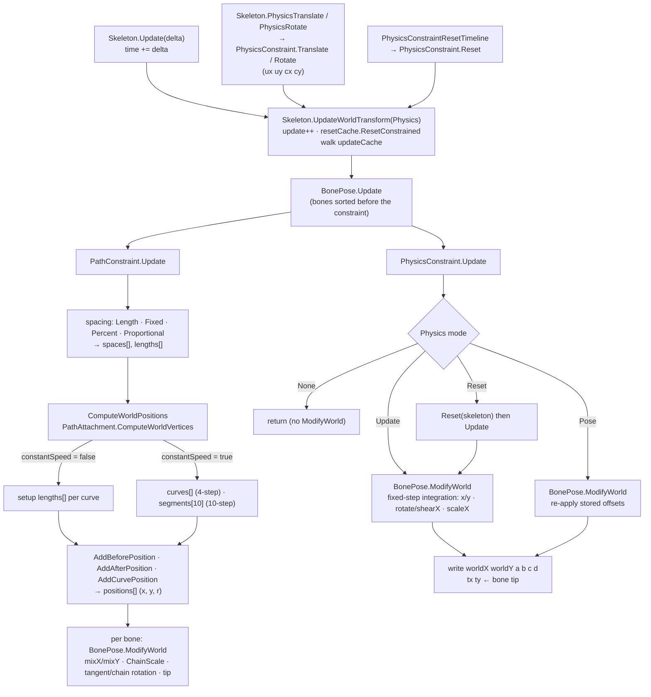

# Spine 4.3 path and physics constraints: clean-room specification

This spec describes how stock Spine 4.3 evaluates **path constraints** and **physics constraints** inside `Skeleton.UpdateWorldTransform`: what each constraint adds to the update cache, the exact float arithmetic of each `Update`, the per-instance state that physics carries from frame to frame, and how `Skeleton.Update(delta)`, `PhysicsTranslate` and `PhysicsRotate` feed that state. The reference is spine-csharp **4.3.40**, vendored in `Packages/com.esotericsoftware.spine.spine-csharp` at upstream `4.3` commit `7ce5d0da`. The local changes there are `var` clean-up only and change no behaviour. No reference source is reproduced. The tables, prose and pseudocode are written from scratch, but every float expression is given with its exact operation order, because that order *is* the specification. The numeric conventions, the bone world transform and vertex-attachment world vertices are in [Pose-and-Mesh.md](Pose-and-Mesh.md) §1, §4 and §6, and are referenced, not repeated. Pose vs applied pose and the physics timelines are in [Timelines.md](Timelines.md) §1.3 and §3.12. General update-cache ordering, IK, transform and slider constraints, and the full `ModifyWorld` / `ModifyLocal` bookkeeping are in the sibling spec `Constraints.md`. Loading of the data fields is in [Format-Json-Atlas.md](Format-Json-Atlas.md) §7.4, §7.5, §8.6 and [Format-Binary.md](Format-Binary.md).



---

## Contents

1. [Conventions and scope](#1-conventions-and-scope)
2. [Shared mechanics](#2-shared-mechanics)
3. [Path constraint](#3-path-constraint)
4. [Physics constraint](#4-physics-constraint)
5. [Per-instance state, persistence and resets](#5-per-instance-state-persistence-and-resets)
6. [Parity traps](#6-parity-traps)
7. [Ambiguities / verified only by reading](#7-ambiguities--verified-only-by-reading)

---

## 1. Conventions and scope

### 1.1 Numerics

All rules of [Pose-and-Mesh.md](Pose-and-Mesh.md) §1 apply: every stored value is float32, every `+ − × ÷` is one float32 operation, evaluation is left to right exactly as parenthesised here, and there is no FMA contraction. `cosF`, `sinF`, `atan2F` and `sqrtF` are the double-precision library function applied to the float argument widened to double, with the result narrowed to float. In this spec `atan2F` is used both for `MathUtils.Atan2` (which is exactly that, since the fast-trig switch is off) and for direct `(float)Math.Atan2` calls, which are identical. Additional functions used here:

| Notation | Meaning |
|---|---|
| `powF(b, e)` | `(float) System.Math.Pow((double) b, (double) e)`. Both float arguments are widened, the power is taken in double, the result is narrowed. The exponent expression is computed in float **before** widening. |
| `ceilF(x)` | `(float) System.Math.Ceiling((double) x)`. The argument is a float expression computed in float, then widened. Since the ceiling of a float is always representable as a float, this equals a float ceil. |
| `fmodF(a, b)` | C# float `%`: exact truncated remainder with the sign of the dividend. |
| `maxF(a, b)` | `System.Math.Max(float, float)` (an integer literal argument is converted to float). Mono/Unity BCL semantics: if `a > b` return `a`; else if `a` is NaN return `a`; else return `b`. NaN therefore propagates from either side. |
| `absF(x)` | `System.Math.Abs(float)`. |
| `int ÷ float`, `int × float` | The integer is converted to float first, then one float operation. |
| `(p ? A : B)` | Only the chosen branch is evaluated. |

### 1.2 Constants

All float32. `Epsilon` and the angle constants come from `MathUtils`. The others are literals at their point of use.

| Name | Definition | Value | Bits | Used in |
|---|---|---|---|---|
| `PI` | literal `3.1415927` | 3.1415927410125732 | `0x40490FDB` | path wrap test |
| `PI2` | `PI × 2` | 6.2831854820251465 | `0x40C90FDB` | path wrap, physics angle wrap |
| `InvPI2` | `1 / PI2` | 0.15915493667125702 | `0x3E22F983` | physics angle wrap |
| `DegRad` | `PI / 180` | 0.01745329238474369 | `0x3C8EFA35` | path offset rotation, `PhysicsConstraint.Rotate` |
| `Epsilon` | literal `0.00001` | 9.999999747378752e-06 | `0x3727C5AC` | path spacing, tangent and length tests |
| `0.001f` | literal | 0.0010000000474974513 | `0x3A83126F` | path tangent near the curve start |
| `0.1875f` | 3/16 | 0.1875 | `0x3E400000` | path 4-step curve length |
| `0.09375f` | 3/32 | 0.09375 | `0x3DC00000` | path 4-step curve length |
| `0.75f` | 3/4 | 0.75 | `0x3F400000` | path 4-step curve length |
| `0.16666667f` | ≈ 1/6 | 0.1666666716337204 | `0x3E2AAAAB` | both path length tables |
| `0.03f` | ≈ 3 × 0.1² | 0.029999999329447746 | `0x3CF5C28F` | path 10-step segment table |
| `0.006f` | ≈ 6 × 0.1³ | 0.006000000052154064 | `0x3BC49BA6` | path 10-step segment table |
| `0.3f` | ≈ 3 × 0.1 | 0.30000001192092896 | `0x3E99999A` | path 10-step segment table |
| `0.1f` | literal | 0.10000000149011612 | `0x3DCCCCCD` | path segment → curve parameter |
| `0.5f` | literal | 0.5 | `0x3F000000` | physics angle wrap |
| `0.7f` | literal | 0.699999988079071 | `0x3F333333` | physics `ScaleYMode.Volume` |
| `3.67347f` | literal | 3.6734700202941895 | `0x406B1A22` | physics `ScaleYMode.Volume` |
| `60` | int literal | 60.0 as float | | physics damping exponent |
| `4`, `3`, `2`, `1` | int literals | exact | | as noted in formulas |

Examples of the derived physics `step`: `fps = 60` gives `step = 1f/60 = 0x3C888889` (0.01666666753590107), and `60 × step` is exactly `1.0`. `fps = 30` gives `0x3D088889`, and `60 × step` is exactly `2.0`.

### 1.3 Scope

Covered: `PathConstraint`, `PathConstraintData`, `PathConstraintPose`, `PathAttachment`, the windowed `VertexAttachment.ComputeWorldVertices` that paths call, `PhysicsConstraint`, `PhysicsConstraintData`, `PhysicsConstraintPose`, the `Physics` enum, and the `Skeleton` members `time`, `Update(delta)`, `PhysicsTranslate`, `PhysicsRotate`, `windX/Y`, `gravityX/Y`, `scaleX`, `ScaleY`. Not covered: IK, transform and slider constraints, and the general update-cache algorithm (sibling `Constraints.md`).

---

## 2. Shared mechanics

### 2.1 Poses a constraint reads and writes

Each constraint, like each bone and slot, has `data.setupPose`, `pose` and `appliedPose` ([Timelines.md](Timelines.md) §1.3).

| Object | Read by `Update` | Written by `Update` |
|---|---|---|
| Constraint pose (`PathConstraintPose` / `PhysicsConstraintPose`) | **`appliedPose`**. This is `pose` itself unless a slider constraint's animation keys this constraint. The slider's `Sort` then marks it constrained, and `appliedPose` becomes a separate copy that `UpdateWorldTransform` refreshes from `pose` at the start of every call. | never |
| Constrained bones | The bone's **`constrainedPose`** object. The constraint stores a reference to it at construction, not to `appliedPose`. Its `Sort` always marks the bone constrained, so for an active constraint `appliedPose` *is* `constrainedPose`. | `worldX`, `worldY`, `a`, `b`, `c`, `d` of that object, plus the `local`/`world` counters via `ModifyWorld`. |
| Path slot | `slot.appliedPose.attachment` (must be a `PathAttachment`) and `slot.appliedPose.deform` | never |
| Path slot's bone | `slot.bone.appliedPose` (world transform, for unweighted vertices and the offset-rotation sign) | never |
| Weighted path bones | `skeleton.bones[index].appliedPose` world transform | never |

`BonePose.Set` (used by `ResetConstrained`) copies only the local fields `x y rotation scaleX scaleY shearX shearY inherit`. The world fields `a b c d worldX worldY` of a `constrainedPose` are **not** reset. They keep last frame's values until the bone's world transform is recomputed.

### 2.2 `BonePose.ModifyWorld(skeleton)`: the invalidation both constraints use

Both constraints call `ModifyWorld` on a bone immediately **before** writing its world transform. Let `U = skeleton.update`, the counter that `UpdateWorldTransform` incremented on entry.

1. Set the bone's `local = U` ("the local transform is stale and must be derived from the world transform before anyone reads it") and `world = U` ("the world transform is current").
2. `ResetWorld(bone)`: for each child `ch` of the bone, in `children` order, using `ch`'s `appliedPose`: if `ch.world == U`, then first, if `ch.local == U`, run `ch.UpdateLocalTransform(skeleton)`, then set `ch.world = 0` and recurse `ResetWorld(ch)`. Children whose `world != U` are skipped and not recursed into.

A bone whose `world` is not `U` recomputes its world transform the next time the update cache reaches it (`BonePose.Update`). Its `UpdateWorldTransform` first calls `UpdateLocalTransform` when `local == U`. The formulas for `UpdateLocalTransform` belong to `Constraints.md`. For this spec, what matters is **when** `ModifyWorld` is called and on which bone. That is listed per constraint in §3.10 and §4.8.

### 2.3 Activation (in `Skeleton.UpdateCache`)

For each constraint in `skeleton.constraints` order:

```
active = IsSourceActive
         && ( !data.skinRequired || (skeleton.skin != null && skeleton.skin.constraints contains data) )
if active: constraint.Sort(skeleton)
```

| Constraint | `IsSourceActive` |
|---|---|
| Path | `slot.bone.active`: the path **slot's** bone. The constrained bones' own `active` flags are **not** consulted. |
| Physics | `bone.bone.active`: the constrained bone. |

An inactive constraint is not sorted, so it never enters the update cache and its `Update` never runs. Its bones are not marked constrained by it. Physics state of an inactive constraint is frozen, not reset (§5).

### 2.4 `SortBone`, `SortReset`, `Constrained` (summary)

These belong to `Constraints.md`. The one-line contracts, needed to read §3.4 and §4.3:

| Call | Effect |
|---|---|
| `SortBone(b)` | If `b.sorted` or `!b.active`: nothing. Otherwise `SortBone(parent)` recursively, then `b.sorted = true` and append `b` to the update cache. |
| `SortReset(children)` | For each **active** bone in the list: if it is sorted, recurse into its children first. Then set `sorted = false`. Inactive bones are skipped entirely. |
| `Constrained(obj)` | If `obj.appliedPose` is still `obj.pose`: switch `appliedPose` to `constrainedPose` and append `obj` to the reset cache. Otherwise nothing. |
| updateCache `.Add(constraint)` | Append the constraint. After all constraints, `UpdateCache` calls `SortBone` on every bone in index order, which appends every still-unsorted active bone. |

### 2.5 Windowed `VertexAttachment.ComputeWorldVertices(skeleton, slot, start, count, out, offset, stride)`

Paths call this with sub-ranges, always with `stride = 2`. The per-vertex formulas are those of [Pose-and-Mesh.md](Pose-and-Mesh.md) §6.2, including the deform rules. The windowing works like this:

* `start` and `count` are counted in **floats of the unweighted layout** (2 per vertex). `start` is always even here.
* Output: vertex *k* of the window goes to `out[offset + 2k]`, `out[offset + 2k + 1]`, for `k = 0 .. (count >> 1) − 1`.
* The deform list is `slot.appliedPose.deform`. It is "present" when its count is greater than 0.
* **Unweighted** (`bones == null`): the source array is `deform` if present, else `vertices`. Vertex *k* reads source floats `start + 2k`, `start + 2k + 1`. The bone is `slot.bone.appliedPose`.
* **Weighted**: first skip `start / 2` vertices. `v = 0`, `skip = 0`, and for each skipped vertex `n = bones[v]`, `v += n + 1`, `skip += n`. Then the influence cursor into `vertices` starts at `skip × 3` and the deform cursor at `skip × 2`. Each emitted vertex then proceeds exactly as in Pose-and-Mesh §6.2, reading bones from `skeleton.bones[index].appliedPose`. With deform present, `px = vertices[b] + deform[f]` and `py = vertices[b+1] + deform[f+1]`.

### 2.6 Path attachment vertex layout

A path with *K* knots has `worldVerticesLength = V = 6K`: three points per knot, in the order **incoming handle, anchor, outgoing handle**. Point *j* occupies floats `2j, 2j+1`. So for knot *k*: `in_k` at float `6k`, `anchor_k` at `6k+2`, `out_k` at `6k+4`.

* Curve *i* (0-based) runs `anchor_i → out_i → in_{i+1} → anchor_{i+1}`. That is 8 floats starting at float `6i + 2`.
* **Open** path: *K − 1* curves. `in_0` and `out_{K−1}` are unused.
* **Closed** path: *K* curves. Curve *K − 1* runs `anchor_{K−1} → out_{K−1} → in_0 → anchor_0`.

`PathAttachment.lengths` holds cumulative **setup-pose** curve lengths, multiplied by the loader scale: `lengths[i]` is the length from the path start to the end of curve *i*. It is only read when `constantSpeed == false`.

---

## 3. Path constraint

### 3.1 Data (`PathConstraintData`)

| Field | Type | Notes |
|---|---|---|
| `bones` | `BoneData[]` | Constrained bones, in constraint order. May be empty. |
| `slot` | `SlotData` | Slot whose applied attachment is the path. |
| `positionMode` | `Fixed = 0`, `Percent = 1` | |
| `spacingMode` | `Length = 0`, `Fixed = 1`, `Percent = 2`, `Proportional = 3` | |
| `rotateMode` | `Tangent = 0`, `Chain = 1`, `ChainScale = 2` | |
| `offsetRotation` | float, **degrees** | |
| `skinRequired` | bool | §2.3 |
| `setupPose` | `PathConstraintPose` | |

### 3.2 Pose (`PathConstraintPose`)

Five floats: `position`, `spacing`, `mixRotate`, `mixX`, `mixY`. `Set` copies all five. Animation writes `pose` ([Timelines.md](Timelines.md) §3.11). `Update` reads `appliedPose`.

### 3.3 Instance fields

| Field | Content |
|---|---|
| `bones` | For each `data.bones[i]`, a reference to `skeleton.bones[index].constrainedPose` (§2.1). |
| `slot` | `skeleton.slots[data.slot.index]` |
| `spaces` | Growable float list. Grown with *preserve-contents* semantics (`EnsureSize`: grow the array if too small, keep old contents, never zero). **Index 0 is never written**, so it stays `0` forever (arrays start zeroed). |
| `positions` | Growable float list, same semantics. The output of `ComputeWorldPositions`: `x, y, r` per point. Not cleared between calls, so unwritten entries keep old values (§3.9, §6). |
| `world` | Growable scratch for path world vertices. Every entry read is written first in the same call. |
| `curves` | Growable scratch for cumulative world curve lengths. Written before read. |
| `lengths` | Growable scratch for the `ChainScale` bone lengths. Written before read. |
| `segments` | Fixed `float[10]`. Written before read, since `prevCurve` is local to each call. |

The list sizes (`EnsureSize(n)`) set the logical count to `n`. The backing array only grows. A Burst port may use fixed per-instance buffers of the maximum size, but it must keep `positions` **persistent and uncleared** to reproduce the stale-read edge case of §3.9.

### 3.4 Sort (update cache contribution)

Run once per `UpdateCache` for an active path constraint:

1. `slotIndex = slot.data.index` and `slotBone = slot.bone`.
2. If `skeleton.skin != null`: for **every** skin entry of that skin whose slot index is `slotIndex` (all placeholders, not only the attached one), run `SortPath(entry.attachment)`.
3. If `data.defaultSkin != null` and it is not the same skin object as `skeleton.skin`: do the same over the default skin's entries.
4. `SortPath(slot.pose.attachment)`. This is the slot's **unconstrained `pose`** attachment at `UpdateCache` time.
5. For each constrained bone `b`, in `data.bones` order: `SortBone(b)`, then `Constrained(b)`. The two calls are interleaved per bone.
6. Append this constraint to the update cache.
7. For each constrained bone `b`, in order: `SortReset(b.children)`.
8. For each constrained bone `b`, in order: `b.sorted = true`.

`SortPath(attachment)`:

* Not a `PathAttachment` (including null): do nothing.
* Unweighted (`bones == null`): `SortBone(slotBone)`.
* Weighted: walk the run-length `bones` array. For each vertex, read `n`, then call `SortBone(skeleton.bones[idx])` for each of its `n` bone indices, in array order (duplicates are harmless). The **slot bone is not sorted** by a weighted path (see §7, item 3).

Net effect: every bone that can drive any path attachment of that slot (in the current skin, the default skin or the current attachment), and all their ancestors, precede the constraint. So do all constrained bones and their ancestors. Descendants of constrained bones are re-queued to after the constraint. Constrained bones themselves are **not** re-queued, even when one is a descendant of another, because of step 8.

Skin entries are enumerated in the skin dictionary's enumeration order (insertion order for a dictionary with no removals). That order only changes the relative position of these bones in the cache. It cannot change any computed value, because a bone depends only on its parent.

### 3.5 `Update(skeleton, physics)`: early outs

The `physics` argument is ignored.

```
PathAttachment path = slot.appliedPose.attachment as PathAttachment
if path == null: return                               // no ModifyWorld, bones untouched
PathConstraintPose p = appliedPose
float mixRotate = p.mixRotate, mixX = p.mixX, mixY = p.mixY
if mixRotate == 0 && mixX == 0 && mixY == 0: return   // exact compare; -0 counts as 0
bool tangents = (data.rotateMode == Tangent)
bool scale    = (data.rotateMode == ChainScale)
int  boneCount   = bones.Count
int  spacesCount = tangents ? boneCount : boneCount + 1
spaces.EnsureSize(spacesCount)
if scale: lengths.EnsureSize(boneCount)
float spacing = p.spacing
```

### 3.6 Spacing per mode (fills `spaces[1 .. spacesCount−1]`, and `lengths[0 .. boneCount−1]` when `scale`)

For bone *i*, `L_i = bones[i].bone.data.length` is the **setup** bone length (loader-scaled), and `a_i`, `c_i` are the bone's current applied world `a`, `c`. These are read here, **before** any bone is modified in §3.9. The world length of bone *i* is:

```
float wx = L_i * a_i
float wy = L_i * c_i
float worldLen_i = sqrtF((wx * wx) + (wy * wy))
```

**Percent**

```
if scale:
    for i in 0 .. spacesCount-2:  lengths[i] = worldLen_i     // no Epsilon test here
for i in 1 .. spacesCount-1:      spaces[i]  = spacing
```

**Proportional**

```
float sum = 0
for i in 0 .. spacesCount-2:
    if L_i < Epsilon:
        if scale: lengths[i] = 0
        spaces[i+1] = spacing
    else:
        float len = worldLen_i
        if scale: lengths[i] = len
        spaces[i+1] = len
        sum = sum + len
if sum > 0:
    float k = ((float) spacesCount / sum) * spacing
    for i in 1 .. spacesCount-1: spaces[i] = spaces[i] * k
```

The entries that took `spacing` because `L_i < Epsilon` are **also** multiplied by `k`.

**Length** and **Fixed** (the default branch)

```
bool lengthSpacing = (spacingMode == Length)
for i in 0 .. spacesCount-2:
    if L_i < Epsilon:
        if scale: lengths[i] = 0
        spaces[i+1] = spacing
    else:
        float len = worldLen_i
        if scale: lengths[i] = len
        float base = lengthSpacing ? maxF(0, L_i + spacing) : spacing
        spaces[i+1] = (base * len) / L_i
```

`L_i < Epsilon` is a signed compare, so a negative setup length also takes the first branch. In Tangent mode `spacesCount − 1 = boneCount − 1`, so the **last** bone contributes no spacing entry. In Chain and ChainScale modes every bone contributes one entry.

### 3.7 `ComputeWorldPositions(skeleton, path, spacesCount, tangents)`

Output: `positions`, grown to `spacesCount × 3 + 2`. Point *i* (for `i = 0 .. spacesCount−1`) is written at `o = 3i`: `positions[o] = x`, `positions[o+1] = y`, and `positions[o+2] = r` (radians, **written only in the cases listed in §3.8**).

Common prelude:

```
float position   = appliedPose.position
bool  closed     = path.closed
int   V          = path.worldVerticesLength
int   curveCount = V / 6                 // integer division; = knot count K
int   prevCurve  = NONE                  // NONE = -1, BEFORE = -2, AFTER = -3
```

Multiplier (computed after `pathLength` is known, identically in both branches):

| `spacingMode` | `multiplier` |
|---|---|
| Percent | `pathLength` |
| Proportional | `pathLength / (float) spacesCount` |
| Length, Fixed | `1` |

Position mode: if `positionMode == Percent`, `position = position * pathLength`, done **before** the point loop and after `pathLength` is known.

Each point advances the running position by `space = spaces[i] * multiplier`, with `position = position + space`, then works on a copy `pp = position`. `spaces[0]` is always 0, so point 0 sits at `position + (0 × multiplier)`. That is `position` itself unless `multiplier` is infinite or NaN, when it becomes NaN.

The per-point tangent flag is `wantTangent_i = tangents || (i > 0 && space < Epsilon)`. It uses the **multiplied** `space`.

#### 3.7.1 `constantSpeed == false` (setup lengths)

```
curveCount = curveCount - (closed ? 1 : 2)      // now the index of the LAST curve
float pathLength = path.lengths[curveCount]
(position mode, multiplier)
world.EnsureSize(8)
int curve = 0
for i in 0 .. spacesCount-1, o = 3i:
    float space = spaces[i] * multiplier
    position = position + space
    float pp = position
    if closed:
        pp = fmodF(pp, pathLength)
        if pp < 0: pp = pp + pathLength
        curve = 0
    else if pp < 0:
        if prevCurve != BEFORE:
            prevCurve = BEFORE
            path.ComputeWorldVertices(skeleton, slot, start 2, count 4, world, offset 0)      // anchor_0, out_0
        AddBeforePosition(pp, world, 0, positions, o)
        continue
    else if pp > pathLength:
        if prevCurve != AFTER:
            prevCurve = AFTER
            path.ComputeWorldVertices(skeleton, slot, start V-6, count 4, world, offset 0)    // in_last, anchor_last
        AddAfterPosition(pp - pathLength, world, 0, positions, o)
        continue
    // find the curve: curve is NOT reset for open paths (it only moves forward)
    loop:
        float len = path.lengths[curve]
        if pp > len: curve = curve + 1; continue
        if curve == 0: pp = pp / len
        else:          float prev = path.lengths[curve-1];  pp = (pp - prev) / (len - prev)
        break
    if curve != prevCurve:
        prevCurve = curve
        if closed && curve == curveCount:
            path.ComputeWorldVertices(skeleton, slot, start V-4, count 4, world, offset 0)    // anchor_{K-1}, out_{K-1}
            path.ComputeWorldVertices(skeleton, slot, start 0,   count 4, world, offset 4)    // in_0, anchor_0
        else:
            path.ComputeWorldVertices(skeleton, slot, start curve*6+2, count 8, world, offset 0)
    AddCurvePosition(pp, world[0..7], positions, o, wantTangent_i)
```

Notes:

* `pp` is a curve-local parameter in `[0, 1]` for well-formed input, and it is fed straight into the Bézier with **no** arc-length reweighting.
* The setup `lengths` are in setup space. World scaling or deform of the path does **not** change where the points fall in parameter space.
* The curve search compares with strict `>`, so a position exactly on a curve end belongs to that curve (parameter 1).
* For an open path the search starts from the previous point's `curve`. If positions ever decrease (negative spacing), the search does not go back, and `(pp − prev)/(len − prev)` goes negative. `AddCurvePosition` then clamps it to the curve start (`pp < Epsilon`). This is stock behaviour. Reproduce it.
* The world vertices are recomputed only when the curve (or before/after state) changes between consecutive points within one call.

#### 3.7.2 `constantSpeed == true` (world arc length)

**World vertices.**

```
if closed:
    int VL = V + 2
    world.EnsureSize(VL)
    path.ComputeWorldVertices(skeleton, slot, start 2, count VL-4, world, offset 0)       // points 1 .. 3K-1
    path.ComputeWorldVertices(skeleton, slot, start 0, count 2,    world, offset VL-4)    // in_0
    world[VL-2] = world[0];  world[VL-1] = world[1]                                       // anchor_0 again
    // curveCount stays K
else:
    curveCount = curveCount - 1                                                           // K-1
    int VL = V - 4
    world.EnsureSize(VL)
    path.ComputeWorldVertices(skeleton, slot, start 2, count VL, world, offset 0)         // anchor_0 .. anchor_{K-1}
```

In both cases `world` is now `anchor_0, out_0, in_1, anchor_1, …` and curve *i* is the 8 floats at `world[6i .. 6i+7]`. The variable `verticesLength` below means `VL`.

**Curve lengths (4-step forward differencing).** Declare `x1 = world[0]`, `y1 = world[1]`. `pathLength = 0`. For `i = 0 .. curveCount−1`, with `w = 2 + 6i`:

```
cx1 = world[w];   cy1 = world[w+1]
cx2 = world[w+2]; cy2 = world[w+3]
x2  = world[w+4]; y2  = world[w+5]
tmpx  = ((x1 - (cx1 * 2)) + cx2) * 0.1875f
tmpy  = ((y1 - (cy1 * 2)) + cy2) * 0.1875f
dddfx = ((((cx1 - cx2) * 3) - x1) + x2) * 0.09375f
dddfy = ((((cy1 - cy2) * 3) - y1) + y2) * 0.09375f
ddfx  = (tmpx * 2) + dddfx
ddfy  = (tmpy * 2) + dddfy
dfx   = (((cx1 - x1) * 0.75f) + tmpx) + (dddfx * 0.16666667f)
dfy   = (((cy1 - y1) * 0.75f) + tmpy) + (dddfy * 0.16666667f)
pathLength = pathLength + sqrtF((dfx * dfx) + (dfy * dfy))          // segment 1
dfx = dfx + ddfx;  dfy = dfy + ddfy
ddfx = ddfx + dddfx;  ddfy = ddfy + dddfy
pathLength = pathLength + sqrtF((dfx * dfx) + (dfy * dfy))          // segment 2
dfx = dfx + ddfx;  dfy = dfy + ddfy
pathLength = pathLength + sqrtF((dfx * dfx) + (dfy * dfy))          // segment 3
dfx = dfx + (ddfx + dddfx);  dfy = dfy + (ddfy + dddfy)
pathLength = pathLength + sqrtF((dfx * dfx) + (dfy * dfy))          // segment 4
curves[i] = pathLength
x1 = x2;  y1 = y2
```

`curves` is cumulative. `pathLength` is **one running float sum** across all curves, not a sum of per-curve totals. After segment 2, `ddfx` is **not** advanced again. The last step adds `ddfx + dddfx` as one parenthesised sum.

Then apply the position mode and the multiplier (§3.7) using this `pathLength`.

**Point loop.** `x1 y1 cx1 cy1 cx2 cy2 x2 y2` continue to be shared function-level variables. After the length loop they hold the **last** curve's values. They are only reloaded when a new curve is entered. `curveLength = 0`, `curve = 0`, `segment = 0`.

```
for i in 0 .. spacesCount-1, o = 3i:
    float space = spaces[i] * multiplier
    position = position + space
    float pp = position
    if closed:
        pp = fmodF(pp, pathLength)
        if pp < 0: pp = pp + pathLength
        curve = 0
        segment = 0
    else if pp < 0:
        AddBeforePosition(pp, world, 0, positions, o)                      // anchor_0, out_0
        continue
    else if pp > pathLength:
        AddAfterPosition(pp - pathLength, world, VL-4, positions, o)       // in_last, anchor_last
        continue
    // curve search, identical to 3.7.1 but over curves[]
    loop:
        float len = curves[curve]
        if pp > len: curve = curve + 1; continue
        if curve == 0: pp = pp / len
        else:          float prev = curves[curve-1];  pp = (pp - prev) / (len - prev)
        break
    if curve != prevCurve:
        prevCurve = curve
        (build the segment table, below; sets segment = 0)
    pp = pp * curveLength
    loop:
        float sl = segments[segment]
        if pp > sl: segment = segment + 1; continue
        if segment == 0: pp = pp / sl
        else:            float sp = segments[segment-1];  pp = (float) segment + ((pp - sp) / (sl - sp))
        break
    AddCurvePosition(pp * 0.1f, x1, y1, cx1, cy1, cx2, cy2, x2, y2, positions, o, wantTangent_i)
```

In the segment step, `segment` (an int) is converted to float and then added: `segment + ((pp − sp) / (sl − sp))`. For an open path `segment` persists from the previous point while the curve is unchanged, so the search only moves forward. For a closed path it is reset to 0 for every point, but the table is **not** rebuilt unless the curve changes.

**Segment table (10-step forward differencing), built on curve change.** With `ii = curve × 6`:

```
x1  = world[ii];   y1  = world[ii+1]
cx1 = world[ii+2]; cy1 = world[ii+3]
cx2 = world[ii+4]; cy2 = world[ii+5]
x2  = world[ii+6]; y2  = world[ii+7]
tmpx  = ((x1 - (cx1 * 2)) + cx2) * 0.03f
tmpy  = ((y1 - (cy1 * 2)) + cy2) * 0.03f
dddfx = ((((cx1 - cx2) * 3) - x1) + x2) * 0.006f
dddfy = ((((cy1 - cy2) * 3) - y1) + y2) * 0.006f
ddfx  = (tmpx * 2) + dddfx
ddfy  = (tmpy * 2) + dddfy
dfx   = (((cx1 - x1) * 0.3f) + tmpx) + (dddfx * 0.16666667f)
dfy   = (((cy1 - y1) * 0.3f) + tmpy) + (dddfy * 0.16666667f)
curveLength = sqrtF((dfx * dfx) + (dfy * dfy))
segments[0] = curveLength
for k in 1 .. 7:
    dfx = dfx + ddfx;  dfy = dfy + ddfy
    ddfx = ddfx + dddfx;  ddfy = ddfy + dddfy
    curveLength = curveLength + sqrtF((dfx * dfx) + (dfy * dfy))
    segments[k] = curveLength
dfx = dfx + ddfx;  dfy = dfy + ddfy                 // no ddf advance before segment 8
curveLength = curveLength + sqrtF((dfx * dfx) + (dfy * dfy))
segments[8] = curveLength
dfx = dfx + (ddfx + dddfx);  dfy = dfy + (ddfy + dddfy)
curveLength = curveLength + sqrtF((dfx * dfx) + (dfy * dfy))
segments[9] = curveLength
segment = 0
```

`segments` is cumulative within one curve, and `curveLength` ends as `segments[9]`.

### 3.8 Point emitters

`r` is always written in radians, from `atan2F`.

**`AddBeforePosition(p, temp, i, out, o)`**: extrapolates backwards along the first handle. `p` is negative.

```
float x1 = temp[i],  y1 = temp[i+1]
float dx = temp[i+2] - x1,  dy = temp[i+3] - y1
float r  = atan2F(dy, dx)
out[o]   = x1 + (p * cosF(r))
out[o+1] = y1 + (p * sinF(r))
out[o+2] = r
```

**`AddAfterPosition(p, temp, i, out, o)`**: extrapolates forwards along the last handle. `p` is the overshoot `pp − pathLength`.

```
float x1 = temp[i+2],  y1 = temp[i+3]
float dx = x1 - temp[i],  dy = y1 - temp[i+1]
float r  = atan2F(dy, dx)
out[o]   = x1 + (p * cosF(r))
out[o+1] = y1 + (p * sinF(r))
out[o+2] = r
```

**`AddCurvePosition(p, x1, y1, cx1, cy1, cx2, cy2, x2, y2, out, o, tangents)`**: evaluates the cubic Bézier.

```
if p < Epsilon || isNaN(p):
    out[o]   = x1
    out[o+1] = y1
    out[o+2] = atan2F(cy1 - y1, cx1 - x1)          // written even when tangents == false
    return
float tt  = p * p
float ttt = tt * p
float u   = 1 - p
float uu  = u * u
float uuu = uu * u
float ut   = u * p
float ut3  = ut * 3
float uut3 = u * ut3
float utt3 = ut3 * p
float x = (((x1 * uuu) + (cx1 * uut3)) + (cx2 * utt3)) + (x2 * ttt)
float y = (((y1 * uuu) + (cy1 * uut3)) + (cy2 * utt3)) + (y2 * ttt)
out[o]   = x
out[o+1] = y
if tangents:
    if p < 0.001f:
        out[o+2] = atan2F(cy1 - y1, cx1 - x1)
    else:
        float qy = ((y1 * uu) + ((cy1 * ut) * 2)) + (cy2 * tt)
        float qx = ((x1 * uu) + ((cx1 * ut) * 2)) + (cx2 * tt)
        out[o+2] = atan2F(y - qy, x - qx)
// tangents == false: out[o+2] is NOT written
```

There is no upper clamp on `p`. A parameter above 1 (possible only with malformed lengths) extrapolates the cubic.

### 3.9 Applying positions to the bones

```
float boneX = positions[0], boneY = positions[1]
float offsetRotation = data.offsetRotation
bool tip
if offsetRotation == 0:
    tip = (data.rotateMode == Chain)                  // Chain only; not ChainScale, not Tangent
else:
    tip = false
    BonePose sb = slot.bone.appliedPose
    offsetRotation = offsetRotation * (((sb.a * sb.d) - (sb.b * sb.c)) > 0 ? DegRad : -DegRad)

for i in 0 .. boneCount-1, ip = 3(i+1):
    BonePose bone = bones[i]
    bone.ModifyWorld(skeleton)                                  // §2.2, before any write to this bone
    bone.worldX = bone.worldX + ((boneX - bone.worldX) * mixX)
    bone.worldY = bone.worldY + ((boneY - bone.worldY) * mixY)
    float x = positions[ip], y = positions[ip+1]
    float dx = x - boneX, dy = y - boneY
    if scale:                                                    // ChainScale
        float len = lengths[i]
        if len >= Epsilon:
            float s = (((sqrtF((dx * dx) + (dy * dy)) / len) - 1) * mixRotate) + 1
            bone.a = bone.a * s
            bone.c = bone.c * s
    boneX = x;  boneY = y
    if mixRotate > 0:                                            // strictly positive
        float a = bone.a, b = bone.b, c = bone.c, d = bone.d    // after the ChainScale scaling
        float r
        if tangents:                    r = positions[ip-1]      // tangent of point i
        else if spaces[i+1] < Epsilon:  r = positions[ip+2]      // tangent of point i+1 (unmultiplied spacing test)
        else:                           r = atan2F(dy, dx)
        r = r - atan2F(c, a)
        if tip:
            float cs = cosF(r), sn = sinF(r)
            float L = bone.bone.data.length
            boneX = boneX + (((L * ((cs * a) - (sn * c))) - dx) * mixRotate)
            boneY = boneY + (((L * ((sn * a) + (cs * c))) - dy) * mixRotate)
        else:
            r = r + offsetRotation
        if r > PI:       r = r - PI2
        else if r < -PI: r = r + PI2
        r = r * mixRotate
        float cs = cosF(r), sn = sinF(r)
        bone.a = (cs * a) - (sn * c)
        bone.b = (cs * b) - (sn * d)
        bone.c = (sn * a) + (cs * c)
        bone.d = (sn * b) + (cs * d)
```

Details that matter:

* The translation mix uses `boneX, boneY` **before** they advance, so bone *i* moves toward point *i*. `dx, dy` run from point *i* to point *i + 1*. With `tip`, point *i + 1* is replaced, for the next bone, by the tip-corrected position.
* The `tip` correction uses the rotation **before** the ±π wrap and before the `mixRotate` scaling. It uses the pre-rotation `a` and `c` of the bone.
* The ±π wrap is a single conditional add or subtract (`>` and `<`, not `>=`).
* `offsetRotation`'s sign factor uses the path slot's bone's applied world determinant, read **once**, before the loop.
* In **Tangent** mode the loop still reads `positions[3·boneCount]` and `positions[3·boneCount + 1]` for the last bone. `ComputeWorldPositions` never wrote them in this mode, so they are stale. They only feed `dx`, `dy` and `boneX`, `boneY`, which Tangent mode never uses after that point. Any value is fine, but the port must not fault on the read.
* **Stale tangent read (Chain / ChainScale).** When `spaces[i+1] < Epsilon` the rotation comes from `positions[ip+2]`, which `AddCurvePosition` writes only if `wantTangent` held for point *i + 1*, that is when `spaces[i+1] × multiplier < Epsilon`, or when it took the `p < Epsilon`/NaN early branch, or when the point came from `AddBefore`/`AddAfterPosition`. With Percent or Proportional spacing and a multiplier above 1, a tiny positive spacing can pass the first test and fail the second. The rotation is then **the value left in `positions` by an earlier call** (0 if never written). Reproduce this by keeping `positions` persistent per instance.

### 3.10 What path reads, writes and invalidates

| Item | Detail |
|---|---|
| Reads | `appliedPose` of the constraint. `slot.appliedPose.attachment` and `.deform`. `slot.bone.appliedPose` (unweighted vertices, offset sign). Weighted path bones' `appliedPose`. Each constrained bone's `constrainedPose` `a`, `c` (spacing) and `a b c d worldX worldY` (loop). Setup `BoneData.length` of the constrained bones. |
| Writes | For each constrained bone, in `data.bones` order: `worldX`, `worldY` (whatever the mixes), `a`, `c` (ChainScale), `a b c d` (only when `mixRotate > 0`). |
| Invalidates | `ModifyWorld` on **every** constrained bone, in order, just before its writes, provided the early outs of §3.5 did not fire. There is no `ModifyWorld` when the slot has no path attachment or when all three mixes are 0. |
| Persistent side effects | `positions` contents (§3.3). Nothing else: path has no frame-to-frame simulation state. |

---

## 4. Physics constraint

### 4.1 Data (`PhysicsConstraintData`)

| Field | Type | Meaning |
|---|---|---|
| `bone` | `BoneData` | The one constrained bone. |
| `x`, `y`, `rotate`, `scaleX`, `shearX` | float | Per-channel influence. A channel is **enabled** only if its value is `> 0`: `x > 0`, `y > 0`, `rotateOrShearX = rotate > 0 || shearX > 0`, `scaleX > 0`. |
| `limit` | float | Movement limit per second (loader default 5000 × scale). |
| `step` | float | Seconds per simulation step, `1f / fps` (float division of 1 by the int fps). |
| `scaleYMode` | `None = 0`, `Uniform = 1`, `Volume = 2` | How the Y axis follows the X scale. |
| `inertiaGlobal … mixGlobal` | bool ×7 | Only used by the global physics timelines ([Timelines.md](Timelines.md) §3.12). Not read by `Update`. |
| `skinRequired` | bool | §2.3 |
| `setupPose` | `PhysicsConstraintPose` | |

### 4.2 Pose (`PhysicsConstraintPose`)

Seven floats: `inertia`, `strength`, `damping`, `massInverse`, `wind`, `gravity`, `mix`. `Set` copies all seven. `massInverse` is stored as the inverse (JSON `mass` → `1f / mass`, binary stores the inverse directly). `Update` reads `appliedPose`.

### 4.3 Sort (update cache contribution)

1. `SortBone(bone)`: the bone and its ancestors precede the constraint.
2. Append this constraint to the update cache.
3. `SortReset(bone.children)`: all active descendants are re-queued after the constraint.
4. `Constrained(bone)`.

The constrained bone itself stays `sorted = true`, so it is not re-queued. `IsSourceActive = bone.active`.

### 4.4 Skeleton inputs

| Skeleton member | Default | Used |
|---|---|---|
| `time` | 0 | Physics clock. Only changed by `Update(delta)` and by the `Time` setter. |
| `Update(delta)` | – | `time = time + delta` (one float add). Nothing else. |
| `scaleX` | 1 | x/y gravity scaling (raw field), limit scaling (`absF`) |
| `ScaleY` (getter) | 1 | `scaleY × (Bone.yDown ? −1 : 1)`. `Bone.yDown` is false in spine-unity. Used for y/x gravity scaling and the limit. |
| `windX`, `windY` | **1**, 0 | Wind direction. |
| `gravityX`, `gravityY` | 0, **1** | Gravity direction. |
| `data.referenceScale` | 100 × loader scale | `f` below. |
| `Bone.yDown` (static) | false | Negates the rotate/scale-branch `ay`. |

A skeleton copy (`new Skeleton(other)`) copies `time`, `x`, `y`, `scaleX`, `scaleY`, but **not** `windX/Y` or `gravityX/Y` (they take the defaults). Its physics constraints are freshly constructed (§4.5 initial values) with only `pose` copied.

### 4.5 Per-instance internal state

| Field | Type | Initial value (constructor) | Meaning |
|---|---|---|---|
| `reset` | bool | **true** | The next Update/Reset step captures the bone position instead of simulating. |
| `ux`, `uy` | float | 0 | Bone world position seen at the last x/y input. |
| `cx`, `cy` | float | 0 | Bone world position after the last Update (post-translation, pre-rotation). |
| `tx`, `ty` | float | 0 | Bone tip vector `L × (a, c)` after the last non-Pose update. |
| `xOffset`, `xLag`, `xVelocity` | float | 0 | x channel |
| `yOffset`, `yLag`, `yVelocity` | float | 0 | y channel |
| `rotateOffset`, `rotateLag`, `rotateVelocity` | float | 0 | rotate/shearX channel, radians |
| `scaleOffset`, `scaleLag`, `scaleVelocity` | float | 0 | scaleX channel |
| `remaining` | float | 0 | Unsimulated time carried to the next Update. |
| `lastTime` | float | 0 | `skeleton.time` at the last Update or Reset. |

`bone` references `skeleton.bones[data.bone.index].constrainedPose`.

### 4.6 `Reset`, `Translate`, `Rotate` and the skeleton wrappers

**`Reset(skeleton)`**

```
remaining = 0
lastTime  = skeleton.time
reset     = true
xOffset = xLag = xVelocity = 0
yOffset = yLag = yVelocity = 0
rotateOffset = rotateLag = rotateVelocity = 0
scaleOffset  = scaleLag  = scaleVelocity  = 0
// ux uy cx cy tx ty are NOT touched
```

**`Translate(x, y)`**: shifts the remembered positions so the next Update sees the bone as having moved by `(x, y)` more.

```
ux = ux - x;  uy = uy - y
cx = cx - x;  cy = cy - y
```

**`Rotate(x, y, degrees)`**: treats the remembered center as rotated about `(x, y)`.

```
float r  = degrees * DegRad
float cs = cosF(r), sn = sinF(r)
float dx = cx - x, dy = cy - y                 // read BEFORE Translate modifies cx, cy
Translate(((dx * cs) - (dy * sn)) - dx,  ((dx * sn) + (dy * cs)) - dy)
```

**`Skeleton.PhysicsTranslate(x, y)`** and **`Skeleton.PhysicsRotate(x, y, degrees)`** call `Translate` / `Rotate` with the same arguments on **every** physics constraint in `skeleton.physics`, which lists them in `skeleton.constraints` order. They do so **regardless of `active`**, and they do not touch `time`.

**spine-unity driver order** (`SkeletonAnimationBase`, per frame, informative): gather transform movement → `state.Update(dt)` and `skeleton.Update(dt)` (with `dt` already × `timeScale`) → `ApplyTransformMovementToPhysics` (`PhysicsTranslate(Δx, Δy)` if the position inheritance factor is non-zero, then `PhysicsRotate(0, 0, factor × Δdeg)` if the rotation factor is non-zero) → `state.Apply(skeleton)` → `UpdateWorldTransform(Physics.Update)`. With an `UpdateWorld` callback it is `UpdateWorldTransform(Physics.Pose)`, then the callback, then `UpdateWorldTransform(Physics.Update)`.

### 4.7 `Update(skeleton, physics)`

#### 4.7.1 Prelude

```
PhysicsConstraintPose p = appliedPose
float mix = p.mix
if mix == 0: return                                       // BEFORE the mode test: no ModifyWorld, no Reset, lastTime not advanced
bool x = data.x > 0, y = data.y > 0
bool rotateOrShearX = data.rotate > 0 || data.shearX > 0
bool scaleX = data.scaleX > 0
BonePose bone = this.bone
float l = bone.bone.data.length                           // setup bone length
float t = data.step
float z = 0
if physics == None: return                                // no ModifyWorld; bone keeps its unconstrained world transform
bone.ModifyWorld(skeleton)
switch physics: Reset → 4.7.2, Update → 4.7.3, Pose → 4.7.4
then 4.7.5 (output), then 4.7.6 (tip)
```

#### 4.7.2 `Physics.Reset`

Call `Reset(skeleton)` (§4.6), then run exactly the `Physics.Update` case. Because `Reset` just set `lastTime = time` and `reset = true`, that Update sees `delta = 0` and takes the reset branch.

#### 4.7.3 `Physics.Update`

```
float delta = maxF(skeleton.time - lastTime, 0)
float aa = remaining                                      // remaining BEFORE adding delta
remaining = remaining + delta
lastTime = skeleton.time
float bx = bone.worldX, by = bone.worldY                  // after ModifyWorld; before any physics write

if reset:
    reset = false
    ux = bx;  uy = by
    // no simulation; remaining keeps the added delta; z stays 0
else:
    float a = remaining
    float i = p.inertia
    float f = skeleton.data.referenceScale
    float d = -1, m = 0, e = 0
    float qx = data.limit * delta
    float qy = qx * absF(skeleton.ScaleY)                 // uses qx BEFORE its own scaling
    qx = qx * absF(skeleton.scaleX)

    // ---- translation channels ----
    if x || y:
        if x:
            float u = (ux - bx) * i
            xOffset = xOffset + (u > qx ? qx : (u < -qx ? -qx : u))
            ux = bx
        if y:
            float u = (uy - by) * i
            yOffset = yOffset + (u > qy ? qy : (u < -qy ? -qy : u))
            uy = by
        if a >= t:
            float xs = xOffset, ys = yOffset
            d = powF(p.damping, 60 * t)                   // exponent: (float)60 * t in float
            m = t * p.massInverse
            e = p.strength
            float w = f * p.wind, g = f * p.gravity
            float ax = ((w * skeleton.windX) + (g * skeleton.gravityX)) * skeleton.scaleX
            float ay = ((w * skeleton.windY) + (g * skeleton.gravityY)) * skeleton.ScaleY
            do:
                if x:
                    xVelocity = xVelocity + ((ax - (xOffset * e)) * m)
                    xOffset   = xOffset + (xVelocity * t)
                    xVelocity = xVelocity * d
                if y:
                    yVelocity = yVelocity - ((ay + (yOffset * e)) * m)
                    yOffset   = yOffset + (yVelocity * t)
                    yVelocity = yVelocity * d
                a = a - t
            while a >= t
            xLag = xOffset - xs
            yLag = yOffset - ys
        z = maxF(0, 1 - (a / t))
        if x: bone.worldX = bone.worldX + (((xOffset - (xLag * z)) * mix) * data.x)
        if y: bone.worldY = bone.worldY + (((yOffset - (yLag * z)) * mix) * data.y)

    // ---- rotation / scale channels ----
    if rotateOrShearX || scaleX:
        float ca = atan2F(bone.c, bone.a)
        float c, s, mr = 0
        float dx = cx - bone.worldX, dy = cy - bone.worldY      // AFTER the translation above
        if dx > qx: dx = qx  else if dx < -qx: dx = -qx
        if dy > qy: dy = qy  else if dy < -qy: dy = -qy
        if rotateOrShearX:
            mr = (data.rotate + data.shearX) * mix
            z = rotateLag * maxF(0, 1 - (aa / t))                // z reused as a temporary
            float r = (atan2F(dy + ty, dx + tx) - ca) - ((rotateOffset - z) * mr)
            rotateOffset = rotateOffset + ((r - (ceilF((r * InvPI2) - 0.5f) * PI2)) * i)
            r = ((rotateOffset - z) * mr) + ca
            c = cosF(r);  s = sinF(r)
            if scaleX:
                r = l * bone.WorldScaleX                         // WorldScaleX = sqrtF((a*a) + (c*c)) of the bone, now
                if r > 0: scaleOffset = scaleOffset + ((((dx * c) + (dy * s)) * i) / r)
        else:
            c = cosF(ca);  s = sinF(ca)
            float r = (l * bone.WorldScaleX) - (scaleLag * maxF(0, 1 - (aa / t)))
            if r > 0: scaleOffset = scaleOffset + ((((dx * c) + (dy * s)) * i) / r)
        a = remaining                                            // restart from the full remaining time
        if a >= t:
            if d == -1:
                d = powF(p.damping, 60 * t)
                m = t * p.massInverse
                e = p.strength
            float ax = (p.wind * skeleton.windX) + (p.gravity * skeleton.gravityX)   // NO f, NO skeleton scale
            float ay = (p.wind * skeleton.windY) + (p.gravity * skeleton.gravityY)
            float rs = rotateOffset, ss = scaleOffset
            float h = l / f
            if Bone.yDown: ay = -ay
            loop:
                a = a - t
                if scaleX:
                    scaleVelocity = scaleVelocity + ((((ax * c) - (ay * s)) - (scaleOffset * e)) * m)
                    scaleOffset   = scaleOffset + (scaleVelocity * t)
                    scaleVelocity = scaleVelocity * d
                if rotateOrShearX:
                    rotateVelocity = rotateVelocity - (((((ax * s) + (ay * c)) * h) + (rotateOffset * e)) * m)
                    rotateOffset   = rotateOffset + (rotateVelocity * t)
                    rotateVelocity = rotateVelocity * d
                    if a < t: break
                    float r = (rotateOffset * mr) + ca
                    c = cosF(r);  s = sinF(r)
                else if a < t:
                    break
            rotateLag = rotateOffset - rs
            scaleLag  = scaleOffset - ss
        z = maxF(0, 1 - (a / t))
    remaining = a
cx = bone.worldX
cy = bone.worldY
```

Step-loop facts:

* The **x/y** loop is a `do … while (a >= t)` that decrements `a` at the **end** of each iteration. The **rotate/scale** loop decrements at the **start** and breaks after the rotate update when `a < t`. Both run `⌊…⌋` iterations of the same float subtraction chain from the same starting `remaining`, so both end with the same `a`.
* Within the rotate/scale loop, `c`/`s` are refreshed from the **new** `rotateOffset` only between iterations, never after the last one, and only when `rotateOrShearX`. With scaleX only, `c`/`s` stay at `cosF(ca)`/`sinF(ca)` for all iterations.
* The x/y gravity uses `f × wind`, `f × gravity` and the skeleton scale. The rotate/scale gravity uses raw `wind`/`gravity` divided through `h = l / f`, with no skeleton scale, and `ay` is negated when `Bone.yDown`.
* `a` in the `x || y` block starts from `remaining` (after adding delta). If neither translation nor rotate/scale is enabled, `remaining = a = remaining` and **grows without bound**, which is harmless because nothing reads it except `Pose` mode's `z`.
* `t` never changes during a step. `delta` feeds the limit (`qx`, `qy`) but not the integration.
* The integration loop has **no iteration cap**. A large time jump (for example re-activation after a long inactive stretch, or `mix` returning from 0, see §5) runs `remaining / step` iterations in one call. Do not cap it.
* In the reset branch nothing is simulated and `z` stays 0. `remaining` keeps `delta`, which is 0 after `Reset` but is the full elapsed time on the very first Update of a constraint whose skeleton `time` was already advanced (see §7, item 5).

#### 4.7.4 `Physics.Pose`

```
z = maxF(0, 1 - (remaining / t))
if x: bone.worldX = bone.worldX + (((xOffset - (xLag * z)) * mix) * data.x)
if y: bone.worldY = bone.worldY + (((yOffset - (yLag * z)) * mix) * data.y)
```

No state changes: `lastTime`, `remaining`, `cx`, `cy`, `ux`, `uy`, `tx`, `ty`, offsets and velocities are all left as they are.

#### 4.7.5 Output to the bone (Reset, Update and Pose)

This runs after the switch with the `z` left by it.

```
if rotateOrShearX:
    float o = (rotateOffset - (rotateLag * z)) * mix
    float s, c, a
    if data.shearX > 0:
        float r = 0
        if data.rotate > 0:
            r = o * data.rotate
            s = sinF(r);  c = cosF(r)
            a = bone.b
            bone.b = (c * a) - (s * bone.d)
            bone.d = (s * a) + (c * bone.d)            // bone.d here is still the OLD d
        r = r + (o * data.shearX)
        s = sinF(r);  c = cosF(r)
        a = bone.a
        bone.a = (c * a) - (s * bone.c)
        bone.c = (s * a) + (c * bone.c)                // OLD c
    else:
        o = o * data.rotate
        s = sinF(o);  c = cosF(o)
        a = bone.a
        bone.a = (c * a) - (s * bone.c)
        bone.c = (s * a) + (c * bone.c)
        a = bone.b
        bone.b = (c * a) - (s * bone.d)
        bone.d = (s * a) + (c * bone.d)
if scaleX:
    float s = 1 + (((scaleOffset - (scaleLag * z)) * mix) * data.scaleX)
    bone.a = bone.a * s
    bone.c = bone.c * s
    if scaleYMode == Uniform:
        bone.b = bone.b * s;  bone.d = bone.d * s
    else if scaleYMode == Volume:
        s = absF(s)
        s = (s >= 0.7f) ? (1 / s) : (4 - (3.67347f * s))
        bone.b = bone.b * s;  bone.d = bone.d * s
    // None: b, d unchanged
```

With shearX, the Y axis (`b`, `d`) turns by the rotate part only and the X axis (`a`, `c`) by rotate + shear. The `r = 0 + (o × shearX)` addition when `rotate ≤ 0` is a real float add (it can turn `−0` into `+0`). Compute it, don't skip it.

These writes happen even when every offset is 0, for example on the reset frame. `cosF(0) = 1` and `sinF(0) = 0` make them the identity up to the sign of zero. Execute them unconditionally for bit parity (§6).

#### 4.7.6 Tip vector

```
if physics != Pose:
    tx = l * bone.a
    ty = l * bone.c
```

This uses the **final** `a`, `c`, after rotation and scale. Pose mode does not update `tx`, `ty`.

### 4.8 What physics reads, writes and invalidates

| Item | Detail |
|---|---|
| Reads | Constraint `appliedPose` (7 floats). Bone `constrainedPose` `worldX worldY a b c d`. Setup `BoneData.length`. Skeleton `time`, `scaleX`, `ScaleY`, `windX/Y`, `gravityX/Y`, `data.referenceScale`, `Bone.yDown`. |
| Writes (bone) | `worldX` (if `x`), `worldY` (if `y`), `a b c d` (if `rotateOrShearX`), `a c` and possibly `b d` (if `scaleX`). The same in Pose mode. |
| Writes (state) | Update/Reset: `remaining`, `lastTime`, `reset`, `ux uy` (reset branch, or per enabled channel), `cx cy`, `tx ty`, offsets, lags and velocities of the enabled channels. Pose: none. |
| Invalidates | `ModifyWorld` on the constrained bone for Reset, Update and Pose, called before any write. Not for None, and not when `mix == 0`. |

---

## 5. Per-instance state, persistence and resets

### 5.1 What a job-based port must keep in native memory

| Owner | Persistent state | Notes |
|---|---|---|
| Skeleton | `time`, `scaleX`, `scaleY`, `windX`, `windY`, `gravityX`, `gravityY`, the `update` counter | `time` is float and accumulates `delta` by repeated float addition, so precision drops as it grows. Reproduce the accumulation, not a double clock. |
| Each bone | `constrainedPose` world fields (`a b c d worldX worldY`) and the `world`/`local` ints | World fields survive `ResetConstrained` (§2.1). |
| Each physics constraint | the 21 floats + 1 bool of §4.5, plus `pose` (7 floats) and, if slider-constrained, `appliedPose` | |
| Each path constraint | `pose` (5 floats), and the `positions` float buffer (size ≥ 3 × spacesCount + 2, never cleared) | `spaces[0]` is a constant 0. All other scratch is rewritten before it is read. |

### 5.2 What resets, and what does not

| Event | Physics internal state (§4.5) | Constraint `pose` | Path |
|---|---|---|---|
| Construction (`new Skeleton`, `IConstraintData.Create`) | initial values (`reset = true`, all zeros) | `SetupPose`: `pose ← setupPose` | fresh buffers (zeros) |
| `Skeleton` copy constructor | initial values (not copied). `time` **is** copied from the source. | copied from the source `pose` | fresh buffers |
| `Skeleton.SetupPose` / `SetupPoseBones` | **unchanged** | `pose ← setupPose` | unchanged |
| `SetSkin` → `UpdateCache` | **unchanged**. Only `active`, the constrained/applied pose links and the reset cache are rebuilt. | unchanged | unchanged |
| Constraint becomes inactive (skin change) | frozen (Update not called). `lastTime` stays old, so on re-activation the first Update's `delta` covers the whole inactive span and the loop catches up. | unchanged | – |
| `mix == 0` in a frame | frozen, same catch-up on the next non-zero mix | – | – |
| `UpdateWorldTransform(Physics.Reset)` | `Reset` per active constraint in cache order, **only if `mix != 0`** | – | – |
| `PhysicsConstraintResetTimeline` fires | `Reset(skeleton)` on the target, or on each active physics constraint for the "all" form ([Timelines.md](Timelines.md) §3.12) | – | – |
| `PhysicsConstraint.Reset` by user code | as `Reset` | – | – |
| `PhysicsTranslate` / `PhysicsRotate` | moves `ux uy cx cy` on every constraint, active or not | – | – |
| `Physics.None` / `Physics.Pose` update | unchanged | – | – |

`Reset` never touches `ux uy cx cy tx ty`. They are simply overwritten on the next Update, because the reset branch writes `ux uy` and every Update writes `cx cy` and `tx ty`.

---

## 6. Parity traps

1. **Two wind/gravity formulas.** Translation uses `((f·wind·windX) + (f·gravity·gravityX)) × scaleX` with `f = referenceScale` and the skeleton scale. Rotation/scale uses the raw `(wind·windX) + (gravity·gravityX)` and folds `f` into `h = l / f`, with no skeleton scale but with the `yDown` negation. The y channel **subtracts** `(ay + yOffset·e)·m`, while x **adds** `(ax − xOffset·e)·m`.
2. **`qy` is derived from the unscaled `qx`.** `qy = (limit·delta)·|ScaleY|` is computed first, then `qx` is scaled by `|scaleX|`.
3. **`aa` vs `a`.** The rotation lag interpolation in the input stage uses `aa` (`remaining` before adding this frame's delta). The final `z` uses `a` after stepping.
4. **`z` reuse.** In the rotate branch `z` briefly holds `rotateLag × max(0, 1 − aa/t)`, and it is overwritten by `max(0, 1 − a/t)` at the end of the block. When only `x`/`y` are enabled, `z` comes from the translation block. On the reset frame it is 0.
5. **Early-out order.** `mix == 0` returns before `physics == None` is tested, and before `Reset`, so `Physics.Reset` does nothing to a zero-mix constraint. `ModifyWorld` happens only after both tests.
6. **Angle wrap in physics** uses `ceilF((r·InvPI2) − 0.5f)·PI2`, which is round-half-down to the nearest multiple of 2π. Path uses a single `±PI2` conditional. Don't swap them.
7. **Identity writes.** Physics always runs the rotation and scale writes for enabled channels, and path always runs the translation mix, even with a zero effect. Skipping them changes `−0`/`+0` and NaN propagation.
8. **Stale buffers.** Path's `positions` must be persistent and uncleared (§3.9 stale tangent). `spaces[0]` must read as 0.
9. **Chain `tip`** only applies with `rotateMode == Chain` **and** `offsetRotation == 0`. Otherwise the offset is converted to radians with the sign of the slot bone's determinant.
10. **Non-constant-speed paths ignore world scale.** They use setup `lengths`. Constant-speed paths use world lengths, so Percent position/spacing scale with the posed path.
11. **Curve-length tables differ.** The whole-curve table uses 4 steps (`0.1875f / 0.09375f / 0.75f`). The per-curve segment table uses 10 steps (`0.03f / 0.006f / 0.3f`). `ddf` is not advanced before the last two sums in either table. In the 4-step table `pathLength` is a single running sum.
12. **`powF` for damping** is double `Math.Pow` narrowed to float. Burst's `math.pow(double)` must match the platform libm result bit for bit in double before narrowing. See §7.

---

## 7. Ambiguities / verified only by reading

Nothing below was executed. Everything in this spec comes from reading the vendored sources. These points deserve a parity test before being trusted:

1. **`Math.Pow`, `Math.Cos/Sin/Atan2/Sqrt` library differences.** As in [Pose-and-Mesh.md](Pose-and-Mesh.md) §9 items 1–2. `Math.Pow` is the most likely to differ by one double ulp between Mono/IL2CPP libm and Burst. That rarely survives narrowing to float, but can. `damping` is usually constant, so a port could precompute `powF(damping, 60·step)` per constraint and compare it against a value captured from the reference runtime.
2. **`Math.Max` semantics.** This spec assumes the Unity (Mono BCL) `Math.Max(float, float)`: NaN propagates, and `max(−0, +0)`/`max(+0, −0)` returns the second argument. .NET Core's version orders `+0 > −0`. The arguments here (`time − lastTime` against 0, and `1 − a/t` against 0) only produce a signed-zero difference when the difference is exactly `−0`, which float subtraction of equal values never does (it yields `+0`). It should be unobservable.
3. **Weighted path + non-zero `offsetRotation`.** A weighted path's `Sort` does not sort the slot's bone. If nothing else sorts it before the constraint, the offset sign test reads that bone's world `a b c d` from **before** this frame's world update (last frame's values, or zeros on the very first update). Only the sign of the determinant is used, so this matters only when the slot bone's reflection changes between frames.
4. **Path constraint with an inactive constrained bone.** `IsSourceActive` checks only the slot bone. An inactive constrained bone is not sorted (`SortBone` skips it) but is still marked constrained and still written by `Update`, which reads its never-updated world transform. The editor normally prevents this.
5. **First Update after an advanced clock.** A physics constraint starts with `lastTime = 0`. If `skeleton.time > 0` before its first Update (a skeleton copy, or `skeleton.Update` called before the first `UpdateWorldTransform`), the reset-branch frame adds the whole elapsed time to `remaining` without consuming it. The **next** Update then runs `time / step` catch-up iterations. This follows from the code and looks unintended. Reproduce it.
6. **`step` from a zero fps.** Binary `fps` is an unsigned byte, so 0 is representable and gives `step = +∞`. Then `a >= t` is never true and `z = max(0, 1 − a/∞) = 1`. Not expected from editor output. Only follow the arithmetic.
7. **Dictionary enumeration order of skin entries** (§3.4) is an implementation detail of .NET `Dictionary`. It only affects the relative cache order of bones sorted by `SortPathSlot`, never a computed value.
8. **Positions that decrease along an open path** (negative spacing, or a Proportional spacing sum made negative) make the forward-only curve and segment searches produce negative local parameters. `AddCurvePosition` then pins the point to the curve start. This is followed exactly as read, and no editor data was checked to see whether it occurs.
9. **Zero-length curves or segments** divide by zero in the searches (`pp / len`, `(pp − prev)/(len − prev)`). A `0/0` NaN is caught by `AddCurvePosition`'s NaN test and pins to the curve start. An `x/0 = ±∞` is not caught: `+∞` fails `p < Epsilon` and evaluates the cubic at ∞ (NaN/∞ positions). Follow the arithmetic.
10. **`PhysicsTranslate`/`PhysicsRotate` on inactive constraints** accumulate into `ux uy cx cy`, which the reset branch or the next input overwrites after re-activation. Confirmed by reading only.
11. **Slider-constrained constraint poses.** When a slider's animation keys a path or physics constraint, `Update` reads the slider-written `appliedPose`. The ordering of that slider relative to the constraint in the update cache is `Constraints.md`'s concern and was not cross-checked here.
12. **FMA contraction** in IL2CPP builds (Pose-and-Mesh §9 item 1) applies to every `(a·b) + c` in this spec, and especially to the long forward-difference chains of §3.7.2, where a contracted multiply-add changes every later segment length.
