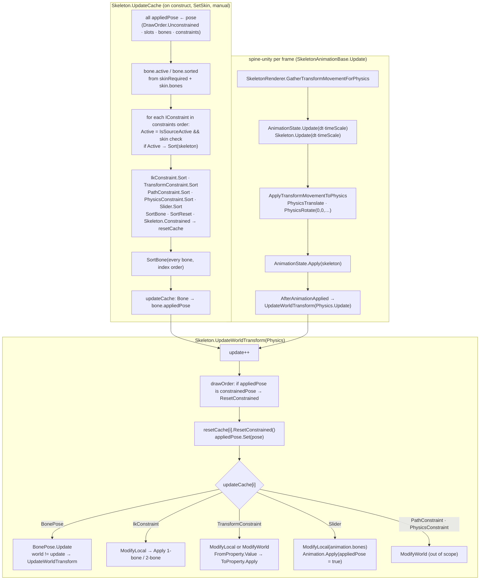

# Spine 4.3 constraints and the per-frame update: clean-room specification

This spec covers the part of stock Spine 4.3 that runs between "animation has written the poses" and "world transforms are ready for the mesh". It describes the three-pose model (`pose`, `constrainedPose`, `appliedPose`) for bones, slots, constraints and draw order. It describes how `Skeleton.UpdateCache` builds the update list, and what `Skeleton.UpdateWorldTransform(Physics)` does step by step, including the local/world validity flags and the world→local decomposition. It gives the exact solvers for IK (one and two bones), the transform constraint (every From and To property) and the slider, and it describes how spine-unity's `SkeletonAnimation` + `SkeletonRenderer` drive all of this each frame, including the physics inheritance from the GameObject's movement. The reference is spine-csharp **4.3.40** and spine-unity **4.3.109**, vendored in `Packages/com.esotericsoftware.spine.spine-csharp` and `Packages/com.esotericsoftware.spine.spine-unity` at upstream `4.3` commit `7ce5d0da`. No reference source is reproduced: the tables, prose and pseudocode are written from scratch, but every float expression is given with its exact operation order, which is the specification. The path constraint solver and the physics constraint integrator are **out of scope**. Only their sorting, their pose/flag interactions and the spine-unity `PhysicsTranslate`/`PhysicsRotate` hooks are covered here.



---

## Contents

1. [Conventions](#1-conventions)
2. [The pose model](#2-the-pose-model)
3. [UpdateCache](#3-updatecache)
4. [UpdateWorldTransform and the validity flags](#4-updateworldtransform-and-the-validity-flags)
5. [World → local decomposition (`UpdateLocalTransform`)](#5-world--local-decomposition-updatelocaltransform)
6. [IK constraint](#6-ik-constraint)
7. [Transform constraint](#7-transform-constraint)
8. [Slider](#8-slider)
9. [Path and physics constraints (interface only)](#9-path-and-physics-constraints-interface-only)
10. [spine-unity frame driver](#10-spine-unity-frame-driver)
11. [Parity traps](#11-parity-traps)
12. [Ambiguities / verified only by reading](#12-ambiguities--verified-only-by-reading)

---

## 1. Conventions

The numeric rules are those of [Pose-and-Mesh.md](Pose-and-Mesh.md) §1, restated only where this spec adds something:

| Notation | Meaning |
|---|---|
| `cosF(x)`, `sinF(x)`, `acosF(x)` | float32 `x` widened to double, `System.Math.Cos/Sin/Acos` in double, narrowed to float32. |
| `atan2F(y, x)` | `(float)Math.Atan2(y, x)` in **radians**. This is also what `MathUtils.Atan2` returns (fast-trig switch off). |
| `atan2Deg(y, x)` | `atan2F(y, x) × RadDeg`: narrow first, then one float multiply. |
| `sqrtF(x)` | `(float)Math.Sqrt(x)`. Because double sqrt of a float is correctly rounded and double has more than 2×24+2 bits, this equals the correctly rounded float32 sqrt. `math.sqrt(float)` is bit-identical. |
| `sign(x)` | `System.Math.Sign(float)`: the **integer** −1, 0 or +1. 0 for ±0. Throws on NaN. Used as a float multiplier after int→float conversion. |
| `abs`, `min`, `max` | Float `Math.Abs/Min/Max`. An int literal argument (`min(1, v)`) is converted to float first. |
| `clamp(v, lo, hi)` | `MathUtils.Clamp`: `if v < lo → lo; else if v > hi → hi; else v`. The low test comes first. |
| int literals | `90`, `180`, `360`, `2`, `4`, `-2`, `1` in float expressions are converted to exact float values. `int × float` converts the int first. |
| Compound assignment | `x op= e` means `x = x op (e)`: the whole right-hand side is evaluated first. |
| Parentheses | Every expression below is written in its exact evaluation order. `a − b − c` is `(a − b) − c`. |

Constants (all float32, compile-time folded in float):

| Name | Definition | Value | Bits |
|---|---|---|---|
| `PI` | literal `3.1415927` | 3.14159274 | `0x40490FDB` |
| `PI2` | `PI × 2` | 6.28318548 | `0x40C90FDB` |
| `HalfPI` | `PI / 2` (written as `PI / 2` at the use site) | 1.57079637 | `0x3FC90FDB` |
| `DegRad` | `PI / 180` | 0.0174532924 | `0x3C8EFA35` |
| `RadDeg` | `180 / PI` | 57.2957764 | `0x42652EE0` |
| `Epsilon` | literal `0.00001` | 9.99999975e-6 | `0x3727C5AC` |
| `EpsilonSq` | `Epsilon × Epsilon` | 9.9999994e-11 | `0x2EDBE6FE` |
| `VOL_KNEE` | literal `0.7` | 0.699999988 | `0x3F333333` |
| `VOL_A` | literal `0.25` | 0.25 | `0x3E800000` |
| `VOL_B` | literal `0.642857` | 0.642857015 | `0x3F249247` |

`skeleton.scaleX` is the raw field. `skeleton.ScaleY` is the getter (raw `scaleY × (Bone.yDown ? −1 : 1)`, and `yDown` is false in spine-unity), see [Pose-and-Mesh.md](Pose-and-Mesh.md) §2.5. Both appear below exactly as the reference reads them. Since `yDown` is false, they are just the two stored scales.

---

## 2. The pose model

### 2.1 Three poses per object

Every bone, slot and constraint instance is a *posed* object with:

| Field | Role |
|---|---|
| `data.setupPose` | Shared, read-only setup values. |
| `pose` | The **unconstrained** pose. Animation (`AnimationState`) and user code write it. |
| `constrainedPose` | A second, private pose object of the same type, allocated at construction. |
| `appliedPose` | A **reference** that points either at `pose` or at `constrainedPose`. Rendering and constraints read it. |

"Constrained" means `appliedPose` points at `constrainedPose`. The draw order has the same trio: `drawOrder.pose` (list of slots), `drawOrder.constrainedPose` (list), and `drawOrder.appliedPose` (reference). Its setup is the skeleton's slot list.

Four operations exist (named after the `IPosedInternal` methods):

| Operation | Effect |
|---|---|
| `Unconstrained()` | `appliedPose ← pose` (reference). |
| `Constrained()` | `appliedPose ← constrainedPose` (reference). |
| `ResetConstrained()` | `appliedPose.Set(pose)`: copy the values of `pose` into whatever `appliedPose` points at. Only called when it points at `constrainedPose`. |
| `PoseEqualsApplied` | `appliedPose` and `pose` are the same object. |

`Set` copies per type:

| Type | Fields copied by `Set` | Not copied |
|---|---|---|
| `BonePose` | `x y rotation scaleX scaleY shearX shearY inherit` | world `a b c d worldX worldY`, flags `world`, `local` |
| `SlotPose` | `color`; `darkColor` **only if the destination already has one**; `attachment` (raw field, no setter side effects); `sequenceIndex`; `deform` (cleared, then all values appended) | – |
| `IkConstraintPose` | `mix softness bendDirection compress stretch` | – |
| `TransformConstraintPose` | `mixRotate mixX mixY mixScaleX mixScaleY mixShearY` | – |
| `SliderPose` | `time mix` | – |
| `PathConstraintPose`, `PhysicsConstraintPose` | all their pose fields | – |
| draw order | `constrainedPose` resized to `pose.count` and the slot references copied | – |

### 2.2 Who writes which pose

| Writer | Writes |
|---|---|
| `AnimationState.Apply` (all timelines) | `pose` (it passes `appliedPose = false`, see [Timelines.md](Timelines.md) §1.3) |
| `UpdateWorldTransform` step 2 | `constrainedPose` ← copy of `pose` for every constrained object |
| IK, transform, path, physics constraints | The constrained bones' **`constrainedPose`** directly. Their bone lists hold `bone.constrainedPose` references taken at construction, not `appliedPose`. |
| Slider | `appliedPose` of whatever its animation keys (`Animation.Apply(..., appliedPose = true)`), plus its own `appliedPose.time` (§8) |
| World transform (`BonePose.UpdateWorldTransform`) | `a b c d worldX worldY` of the `BonePose` in the update cache, which is `bone.appliedPose` as of the last `UpdateCache` |

Because every active IK, transform, path and physics constraint calls `Constrained` on its bones during sorting (§3), the `constrainedPose` it writes **is** the bone's `appliedPose`. An inactive constraint does not sort, so it never runs.

### 2.3 Which objects get a separate constrained pose

Decided only in `UpdateCache`:

| Object | Constrained when |
|---|---|
| Bone | It is `bones[0]` or `bones[1]` of an active IK; one of the bones of an active transform or path constraint; the bone of an active physics constraint; or keyed by a bone timeline (rotate, translate*, scale*, shear*, inherit) in an active slider's animation. |
| Slot | Keyed by a slot timeline (RGBA, RGB, Alpha, RGBA2, RGB2, Attachment, Deform, Sequence) in an active slider's animation. |
| Constraint | Keyed by a constraint timeline (IK, transform, path position/spacing/mix, physics *, physics reset, slider time/mix) in an active slider's animation. |
| Draw order | An active slider's animation contains a DrawOrder or DrawOrderFolder timeline. |

`Skeleton.Constrained(obj)` (used for bones, slots and constraints) does: **if** `obj.PoseEqualsApplied` **then** `obj.Constrained()` and append `obj` to `resetCache`. So the first constrainer adds the object; later ones are no-ops. `resetCache` order is first-constrained order. The draw order is **not** put in `resetCache`. Sliders call `drawOrder.Constrained()` directly, and `UpdateWorldTransform` tests it separately (§4.1).

---

## 3. UpdateCache

Called by the `Skeleton` constructor, by `SetSkin` when the skin changes, and by user code. Bone activation is also in [Pose-and-Mesh.md](Pose-and-Mesh.md) §3.1.

### 3.1 Top level

```
UpdateCache():
    updateCache.clear();  resetCache.clear()

    drawOrder.Unconstrained()
    for slot in slots (index order):         slot.Unconstrained()
    for bone in bones (index order):
        bone.sorted = bone.data.skinRequired
        bone.active = not bone.sorted
        bone.Unconstrained()
    if skin != null:
        for bd in skin.bones (list order):
            b = bones[bd.index]
            repeat: b.sorted = false; b.active = true; b = b.parent   until b == null

    for c in constraints (index order):      c.Unconstrained()
    for c in constraints (index order):
        c.active = c.IsSourceActive
                   and ( not c.data.skinRequired
                         or (skin != null and skin.constraints contains c.data) )   // reference equality
        if c.active: c.Sort(skeleton)

    for bone in bones (index order):         SortBone(bone)

    for i in 0 .. updateCache.count-1:
        if updateCache[i] is a Bone b: updateCache[i] = b.appliedPose   // snapshot of the reference
```

* The constraint list is the unified 4.3 list in **data order** (the file's `constraints` order, see [Format-Json-Atlas.md](Format-Json-Atlas.md) and [Format-Binary.md](Format-Binary.md) §4.3). There is **no** separate "order" field and no grouping by kind: IK, transform, path, physics and slider interleave exactly as listed. Physics constraints and sliders get no special position.
* Activation is decided per constraint inside the same loop that sorts. It only reads bone `active` flags, which are final before the loop starts.
* The final replacement means a bone entry in the cache is a `BonePose`: the `constrainedPose` for a constrained bone, else `pose`. A Burst port stores "bone index + which pose" per entry, decided here.

`IsSourceActive` per kind:

| Kind | `IsSourceActive` |
|---|---|
| IK | `target.active` |
| Transform | `source.active` |
| Path | `slot.bone.active` (the path slot's bone) |
| Physics | the constrained bone's `active` |
| Slider | always `true` (the driving bone is checked every update instead, §8) |

The constrained bones themselves are **not** checked. An active constraint may therefore constrain an inactive bone. It still writes that bone's `constrainedPose`, but `SortBone` never enqueues the inactive bone, so it has no visible effect.

### 3.2 Helpers

```
SortBone(bone):
    if bone.sorted or not bone.active: return
    if bone.parent != null: SortBone(bone.parent)
    bone.sorted = true
    updateCache.append(bone)

SortReset(list):                          // list is a bone's children list
    for bone in list (order):
        if bone.active:
            if bone.sorted: SortReset(bone.children)
            bone.sorted = false
        // inactive bones: untouched, no recursion
```

`SortReset` un-sorts a subtree so that the final `SortBone` pass (or a later constraint's sort) appends those bones **again**, after the constraint. The update cache can therefore contain the same `BonePose` several times. §4.2 explains why that is harmless.

### 3.3 Per-kind `Sort`

In each block, "append self" means `updateCache.append(this constraint)`.

**IK**

```
SortBone(target)
parent = bones[0].bone
SortBone(parent)
append self
parent.sorted = false
SortReset(parent.children)
Constrained(parent)
if bones.count > 1: Constrained(bones[1].bone)
```

The child bone (`bones[1]`) is not `SortBone`d before the IK. The solver only reads its local values and data length.

**Transform**

```
if not data.localSource: SortBone(source)
worldTarget = not data.localTarget
if worldTarget: for b in bones: SortBone(b.bone)
append self
for b in bones: SortReset(b.bone.children); Constrained(b.bone)       // interleaved per bone
for b in bones: b.bone.sorted = worldTarget
```

With a world target the bones stay sorted: the constraint writes their world matrix directly and they are not recomputed. With a local target they are un-sorted, so they are appended after the constraint and their world is recomputed from the modified local.

**Path** (sorting only; the solver is out of scope)

```
slotIndex = slot.data.index ;  slotBone = slot.bone
if skin != null:                                    SortPathSlot(skin)
if data.defaultSkin != null and data.defaultSkin != skin: SortPathSlot(data.defaultSkin)
SortPath(slot.pose.attachment)                      // the slot's *unconstrained* pose attachment
for b in bones: SortBone(b.bone); Constrained(b.bone)   // interleaved per bone
append self
for b in bones: SortReset(b.bone.children)
for b in bones: b.bone.sorted = true

SortPathSlot(skin):   for each entry in skin's attachment map (map enumeration order):
                          if entry.slotIndex == slotIndex: SortPath(entry.attachment)
SortPath(att):        if att is not a PathAttachment: return
                      if att.bones == null: SortBone(slotBone)
                      else: walk the weighted list [n, i1..in, n, …] and SortBone(bones[ik]) for every index
```

**Physics**

```
b = constrained bone
SortBone(b)
append self
SortReset(b.children)
Constrained(b)
```

`b.sorted` stays true (physics writes the world matrix).

**Slider**

```
if bone != null and not data.local: SortBone(bone)
append self
for t in data.animation.timelines (stored order):
    if t is a bone timeline (Rotate/Translate*/Scale*/Shear*/Inherit):
        b = bones[t.boneIndex];  b.sorted = false;  SortReset(b.children);  Constrained(b)
    else if t is a slot timeline (RGBA/RGB/Alpha/RGBA2/RGB2/Attachment/Deform/Sequence):
        Constrained(slots[t.slotIndex])
    else if t is DrawOrderTimeline or DrawOrderFolderTimeline:
        drawOrder.Constrained()
    else if t is a physics property timeline (Inertia/Strength/Damping/Mass/Wind/Gravity/Mix):
        if t.constraintIndex == -1: for p in skeleton.physics: Constrained(p)
        else:                       Constrained(constraints[t.constraintIndex])
    else if t is any other constraint timeline (IK, Transform, PathPosition, PathSpacing, PathMix,
                                                PhysicsReset, Slider, SliderMix):
        Constrained(constraints[t.constraintIndex])
    // EventTimeline: nothing
```

The physics-reset timeline takes the generic branch, so a reset timeline with index −1 indexes `constraints[-1]` and throws (§12).

---

## 4. UpdateWorldTransform and the validity flags

### 4.1 Top level

```
UpdateWorldTransform(physics):
    update = update + 1                                   // int counter, starts at 0; first call uses 1
    if drawOrder.appliedPose is drawOrder.constrainedPose: drawOrder.ResetConstrained()
    for obj in resetCache (order):  obj.ResetConstrained()   // appliedPose.Set(pose), §2.1
    for e in updateCache (order):   e.Update(skeleton, physics)
```

`physics` is only read by `PhysicsConstraint.Update`. Bones, IK, transform, path and slider ignore it.

### 4.2 Per-bone flags

Each `BonePose` has two ints, `world` and `local`, both 0 at construction. `skeleton.update` is the counter above.

| State | Meaning |
|---|---|
| `world == update` | The world matrix was produced during this update and is current. |
| `local == update` | The world matrix was **written directly** (by a world-mode constraint) during this update, so the local fields are stale. |
| anything else | Treat as "not produced this update". |

Operations (all take the skeleton):

```
Update(skeleton, physics):                   // the update-cache entry for a bone
    if world != update: UpdateWorldTransform()

UpdateWorldTransform():
    if local == update: UpdateLocalTransform()       // sets local = 0 and world = update
    else:               world = update
    compute a b c d worldX worldY from the local fields and parent.appliedPose  (Pose-and-Mesh.md §4)

UpdateLocalTransform():                      // §5
    local = 0 ;  world = update
    decompose the world matrix into local fields

ValidateLocalTransform():
    if local == update: UpdateLocalTransform()

ModifyLocal():                               // called before a constraint edits local fields
    if local == update: UpdateLocalTransform()
    world = 0
    ResetWorld(update)

ModifyWorld():                               // called before a constraint edits a b c d worldX worldY
    local = update
    world = update
    ResetWorld(update)

ResetWorld(u):
    for child in bone.children (order):
        cp = child.appliedPose
        if cp.world == u:
            if cp.local == u: cp.UpdateLocalTransform()   // capture the child's modified world as local,
                                                          // relative to THIS bone's pre-edit world
            cp.world = 0
            cp.ResetWorld(u)
```

Consequences a port must reproduce:

* A bone appears in the cache several times. Each extra appearance recomputes it only if something reset its `world` to 0 in between (`ModifyLocal`, or `ResetWorld` from an ancestor).
* `ModifyWorld` / `ModifyLocal` are called **before** the constraint edits the bone. The recursive `ResetWorld` therefore decomposes each world-modified descendant against the ancestor's **old** world. That preserves the descendant's constrained result through the ancestor's change.
* `ResetWorld` recurses only through children whose `world == u`. A subtree not yet computed this update is left alone.
* A bone written by `ModifyWorld` and never recomputed keeps `local == update` after the update ends. Its local fields in `constrainedPose` stay stale, but the next `UpdateWorldTransform` overwrites them with `ResetConstrained` and moves to a new counter value, so this never leaks.
* `UpdateWorldTransform` on a bone whose `local == update` first decomposes, then **recomputes the world from the decomposed local**. The round trip is not the identity in float, so the result can differ from the directly-written world. Inside the stock update loop this branch is unreachable: a cache entry only calls `UpdateWorldTransform` when `world != update`, and every path that sets `local = update` also sets `world = update`, while `ResetWorld` clears `local` (via `UpdateLocalTransform`) before it clears `world`. Only a direct user call reaches it. Reproduce it anyway if the port exposes that call.
* `world`/`local` are **not** copied by `Set`, so `ResetConstrained` does not reset them.

---

## 5. World → local decomposition (`UpdateLocalTransform`)

Inputs: this pose's `a b c d worldX worldY` and `inherit`; parent `pa pb pc pd pwx pwy` from `bone.parent.appliedPose`; `sx = skeleton.scaleX`, `sy = skeleton.ScaleY`. Outputs: the eight local fields (`inherit` is unchanged).

### 5.1 Root bone

```
sxi = 1 / sx ;  syi = 1 / sy
x = (worldX − skeleton.x) × sxi
y = (worldY − skeleton.y) × syi
SetR(a × sxi, b × sxi, c × syi, d × syi, 0)
```

The root ignores `inherit`.

### 5.2 Non-root bones: translation (all modes)

```
pad = (pa × pd) − (pb × pc)
pid = 1 / pad
ia = pd × pid ;  ib = pb × pid ;  ic = pc × pid ;  id = pa × pid
dx = worldX − pwx ;  dy = worldY − pwy
x = (dx × ia) − (dy × ib)
y = (dy × id) − (dx × ic)
```

### 5.3 Matrix per inherit mode

| Mode | Call |
|---|---|
| Normal | `SetR((ia×a) − (ib×c), (ia×b) − (ib×d), (id×c) − (ic×a), (id×d) − (ic×b), 0)` |
| OnlyTranslation | `sxi = 1/sx`, `syi = 1/sy`, then `SetR(a×sxi, b×sxi, c×syi, d×syi, 0)` |
| NoRotationOrReflection | See below |
| NoScale, NoScaleOrReflection | See below |

What every row reads, and what it does not (re-audited against the reference, see §12 item 13):

* `a b c d worldX worldY` are this bone's **current world** fields, as last written (by `UpdateWorldTransform` or directly by a world-mode constraint). The parent values are the parent's `appliedPose` **world** fields at the moment of the call.
* **No local field is read in any mode**, including the root. Rotation, scales and shears are never read back from the existing local, never offset from the pre-constraint local, and the constraint's delta is not added anywhere: everything comes out of the world matrix. `inherit` is read only to pick the row and is not written.
* `sx`/`sy` are read fresh from the skeleton on each call.
* **OnlyTranslation reads nothing from the parent except for `x`/`y`** (§5.2). Its matrix row is the root formula without the skeleton offset: divide the columns' x components by `sx` and y components by `sy`, then `SetR` with `ro = 0`. The result's `rotation` is therefore `atan2Deg(c × syi, a × sxi)`, the world X-axis angle with the skeleton scale divided out, whatever the parent's rotation, scale or reflection. Example: the local pose `rotation 33, scaleX 1.1` builds the world columns from `rx = 33 × DegRad` with the skeleton scale only (Pose-and-Mesh.md §4); an additive world ToRotate of `−5` (§7.4) rotates both columns by `−5 × DegRad`; decomposing that matrix gives `atan2Deg(c, a)` of a column at 28°, which rounds to exactly `28.0f` for skeleton scale `(1, 1)` (float32 emulation of the exact operation order above). Because the result depends only on `a`, `c` and the ratio `sx/sy`, a port that disagrees here is decomposing different inputs; compare those three at the moment of the call.
* The degenerate cases are not guarded: NoRotationOrReflection divides by `(qa × qa) + (qc × qc)` and by `abs(pad × …)` without an `EpsilonSq` test (unlike its world-transform counterpart), and every non-root row divides by `pad`. A zero-scale parent produces ±Infinity or NaN locals in the reference.

**NoRotationOrReflection**

```
sxi = 1 / sx ;  syi = 1 / sy
qa = pa × sxi ;  qc = pc × syi                 // pad from §5.2 keeps the ORIGINAL pa, pc
wa = a × sxi ;  wb = b × sxi ;  wc = c × syi ;  wd = d × syi
s   = 1 / ((qa × qa) + (qc × qc))
det = 1 / abs((pad × sxi) × syi)
SetR( ((qa×wa) + (qc×wc)) × s,
      ((qa×wb) + (qc×wd)) × s,
      ((qa×wc) − (qc×wa)) × det,
      ((qa×wd) − (qc×wb)) × det,
      atan2Deg(qc, qa) )
```

**NoScale / NoScaleOrReflection**

```
sxi = 1 / sx ;  syi = 1 / sy
wa = a × sxi ;  wb = b × sxi ;  wc = c × syi ;  wd = d × syi
tx = (pd × a) − (pb × c)                       // uses UNSCALED a, c
ty = (pa × c) − (pc × a)
if pad < 0: tx = −tx ; ty = −ty
r = atan2Deg(ty, tx)
rotation = r                                   // written now; SetS below does not touch rotation
r = r × DegRad
cs = cosF(r) ;  sn = sinF(r)
za = ((pa × cs) + (pb × sn)) × sxi
zc = ((pc × cs) + (pd × sn)) × syi
k  = 1 / sqrtF((za × za) + (zc × zc))
za = za × k ;  zc = zc × k
si = ( inherit == NoScale and ((pad < 0) != ((sx < 0) != (sy < 0))) ) ? −1 : 1
SetS( (za×wa) + (zc×wc),
      (za×wb) + (zc×wd),
      ((za×wc) − (zc×wa)) × si,
      ((za×wd) − (zc×wb)) × si )
```

### 5.4 The two decomposers

`SetR(ra, rb, rc, rd, ro)` writes rotation, scales and shears, with `shearX` forced to 0:

```
shearX = 0
X = (ra × ra) + (rc × rc) ;  Y = (rb × rb) + (rd × rd)
if X > EpsilonSq:
    r = atan2Deg(rc, ra)
    rotation = r + ro
    scaleX = sqrtF(X)
    scaleY = sqrtF(Y)
    if Y > EpsilonSq:
        shearY = atan2Deg(rd, rb)
        if ((ra × rd) − (rb × rc)) < 0:
            scaleY = −scaleY
            shearY = shearY + (90 − r)
        else:
            shearY = shearY − (90 + r)
        if shearY > 180:        shearY = shearY − 360
        else if shearY <= −180: shearY = shearY + 360
    else:
        shearY = 0
else:
    scaleX = 0
    scaleY = sqrtF(Y)
    shearY = 0
    rotation = (Y > EpsilonSq) ? ((atan2Deg(rd, rb) − 90) + ro) : ro
```

`SetS(ra, rb, rc, rd)` is used only by NoScale modes. It keeps the rotation already written and puts the angle into `shearX`:

```
X = (ra × ra) + (rc × rc) ;  Y = (rb × rb) + (rd × rd)
if X > EpsilonSq: shearX = atan2Deg(rc, ra) ; scaleX = sqrtF(X)
else:             shearX = 0 ;                scaleX = 0
scaleY = sqrtF(Y)
if Y > EpsilonSq:
    shearY = atan2Deg(rd, rb)
    if ((ra × rd) − (rb × rc)) < 0: scaleY = −scaleY ; shearY = shearY + 90
    else:                             shearY = shearY − 90
    if shearY > 180:        shearY = shearY − 360
    else if shearY <= −180: shearY = shearY + 360
else:
    shearY = 0
```

Note the asymmetry: `SetR` computes `scaleY` inside the `X > EpsilonSq` branch as well as in the else branch, while `SetS` computes it unconditionally. The values are the same; only the NaN/degenerate paths differ in which fields are written.

---

## 6. IK constraint

### 6.1 Data and update entry

| Field | Source |
|---|---|
| `bones` | 1 or 2 `BonePose` references = `bone.constrainedPose` of the listed bones (parent first) |
| `target` | a `Bone`; the solver reads `target.appliedPose.worldX/worldY` |
| `data.scaleY` | `ScaleYMode`: `None` (0), `Uniform` (1), `Volume` (2). Default None |
| pose (applied) | `mix`, `softness`, `bendDirection` (int ±1), `compress`, `stretch` |

```
IkConstraint.Update:
    p = appliedPose
    if p.mix == 0: return
    tx = target.appliedPose.worldX ;  ty = target.appliedPose.worldY
    1 bone:  Apply1(bones[0], tx, ty, p.compress, p.stretch, data.scaleY, p.mix)
    2 bones: Apply2(bones[0], bones[1], tx, ty, p.bendDirection, p.stretch, data.scaleY, p.softness, p.mix)
    other counts: nothing
```

### 6.2 One-bone solver `Apply1(bone, targetX, targetY, compress, stretch, scaleYMode, mix)`

```
bone.ModifyLocal()                                   // §4.2
P = bone.bone.parent.appliedPose                     // a root bone here throws (null parent)
pa = P.a ; pb = P.b ; pc = P.c ; pd = P.d
rotationIK = (−bone.shearX) − bone.rotation

switch bone.inherit:
  OnlyTranslation:
    tx = (targetX − bone.worldX) × sign(skeleton.scaleX)
    ty = (targetY − bone.worldY) × sign(skeleton.ScaleY)
  NoRotationOrReflection:
    s  = abs((pa × pd) − (pb × pc)) / max(Epsilon, (pa × pa) + (pc × pc))
    sa = pa / skeleton.scaleX
    sc = pc / skeleton.ScaleY
    pb = ((−sc) × s) × skeleton.scaleX
    pd = (sa × s) × skeleton.ScaleY
    rotationIK = rotationIK + atan2Deg(sc, sa)
    → continue into the default block with pa, pc unchanged and the new pb, pd
  default (Normal, NoScale, NoScaleOrReflection, and NoRotationOrReflection after the block above):
    x = targetX − P.worldX ;  y = targetY − P.worldY
    d = (pa × pd) − (pb × pc)
    if abs(d) <= Epsilon: tx = 0 ; ty = 0
    else:
        tx = (((x × pd) − (y × pb)) / d) − bone.x
        ty = (((y × pa) − (x × pc)) / d) − bone.y

rotationIK = rotationIK + atan2Deg(ty, tx)
if bone.scaleX < 0: rotationIK = rotationIK + 180
if rotationIK > 180:        rotationIK = rotationIK − 360
else if rotationIK <= −180: rotationIK = rotationIK + 360
bone.rotation = bone.rotation + (rotationIK × mix)

if compress or stretch:
    if bone.inherit is NoScale or NoScaleOrReflection:
        tx = targetX − bone.worldX ;  ty = targetY − bone.worldY
    b = bone.bone.data.length × bone.scaleX
    if b > Epsilon:
        dd = (tx × tx) + (ty × ty)
        if (compress and dd < (b × b)) or (stretch and dd > (b × b)):
            s = (((sqrtF(dd) / b) − 1) × mix) + 1
            bone.scaleX = bone.scaleX × s
            ScaleY(bone, s, scaleYMode)
```

`bone.worldX/worldY` are this update's world values, still intact (`ModifyLocal` only resets flags). `bone.x/y/rotation/shearX/scaleX` are the local fields after `ModifyLocal` validated them. The `bone.scaleX` read for `b` is the value **before** the scale change.

`ScaleY(bone, s, mode)` (shared with §6.3):

| Mode | Effect |
|---|---|
| None | nothing |
| Uniform | `bone.scaleY = bone.scaleY × s` |
| Volume | `bone.scaleY = bone.scaleY / ((s < VOL_KNEE) ? (VOL_A + (VOL_B × s)) : s)` |

### 6.3 Two-bone solver `Apply2(parent, child, targetX, targetY, bendDir, stretch, scaleYMode, softness, mix)`

```
if parent.inherit != Normal or child.inherit != Normal: return      // BEFORE ModifyLocal: nothing touched
parent.ModifyLocal() ;  child.ModifyLocal()

px = parent.x ; py = parent.y ; psx = parent.scaleX ; psy = parent.scaleY ; csx = child.scaleX
if psx < 0: psx = −psx ; os1 = 180 ; s2 = −1
else:                    os1 = 0   ; s2 = 1
if psy < 0: psy = −psy ; s2 = −s2
if csx < 0: csx = −csx ; os2 = 180
else:                    os2 = 0
// os1, os2, s2 are ints

a = parent.a ; b = parent.b ; c = parent.c ; d = parent.d      // parent's world, this update
u = abs(psx − psy) <= Epsilon
if (not u) or stretch:
    child.y = 0
    cwx = (a × child.x) + parent.worldX
    cwy = (c × child.x) + parent.worldY
else:
    cwx = ((a × child.x) + (b × child.y)) + parent.worldX
    cwy = ((c × child.x) + (d × child.y)) + parent.worldY

PP = parent.bone.parent.appliedPose                  // the IK parent must not be the root bone
a = PP.a ; b = PP.b ; c = PP.c ; d = PP.d
id = (a × d) − (b × c)
x = cwx − PP.worldX ;  y = cwy − PP.worldY
id = (abs(id) <= Epsilon) ? 0 : (1 / id)
dx = (((x × d) − (y × b)) × id) − px
dy = (((y × a) − (x × c)) × id) − py
l1 = sqrtF((dx × dx) + (dy × dy))
l2 = child.bone.data.length × csx

if l1 < Epsilon:
    Apply1(parent, targetX, targetY, false, stretch, None, mix)    // compress = false, mode None
    child.rotation = 0
    return

x = targetX − PP.worldX ;  y = targetY − PP.worldY
tx = (((x × d) − (y × b)) × id) − px
ty = (((y × a) − (x × c)) × id) − py
dd = (tx × tx) + (ty × ty)

if softness != 0:
    softness = softness × ((psx × (csx + 1)) × 0.5)
    td = sqrtF(dd)
    sd = ((td − l1) − (l2 × psx)) + softness                       // l2 not yet multiplied by psx
    if sd > 0:
        p = min(1, sd / (softness × 2)) − 1
        p = (sd − (softness × (1 − (p × p)))) / td
        tx = tx − (p × tx)
        ty = ty − (p × ty)
        dd = (tx × tx) + (ty × ty)

if u:                                                               // --- uniform parent scale
    l2 = l2 × psx
    cos = ((dd − (l1 × l1)) − (l2 × l2)) / ((2 × l1) × l2)
    if cos < −1:
        cos = −1
        a2 = PI × bendDir
    else if cos > 1:
        cos = 1
        a2 = 0
        if stretch:
            a = (((sqrtF(dd) / (l1 + l2)) − 1) × mix) + 1
            parent.scaleX = parent.scaleX × a
            ScaleY(parent, a, scaleYMode)                          // §6.2 table
    else:
        a2 = acosF(cos) × bendDir
    a = l1 + (l2 × cos)
    b = l2 × sinF(a2)
    a1 = atan2F((ty × a) − (tx × b), (tx × a) + (ty × b))
else:                                                               // --- non-uniform parent scale
    a = psx × l2
    b = psy × l2
    aa = a × a ;  bb = b × b
    ta = atan2F(ty, tx)
    c  = (((bb × l1) × l1) + (aa × dd)) − (aa × bb)
    c1 = (−2 × bb) × l1
    c2 = bb − aa
    d  = (c1 × c1) − ((4 × c2) × c)
    if d >= 0:
        q = sqrtF(d)
        if c1 < 0: q = −q
        q = (−(c1 + q)) × 0.5
        r0 = q / c2 ;  r1 = c / q
        r  = (abs(r0) < abs(r1)) ? r0 : r1
        r0 = dd − (r × r)
        if r0 >= 0:
            y  = sqrtF(r0) × bendDir
            a1 = ta − atan2F(y, r)
            a2 = atan2F(y / psy, (r − l1) / psx)
            goto FINISH
    minAngle = PI ; minX = l1 − a ; minDist = minX × minX ; minY = 0
    maxAngle = 0  ; maxX = l1 + a ; maxDist = maxX × maxX ; maxY = 0
    c = ((−a) × l1) / (aa − bb)
    if c >= −1 and c <= 1:
        c = acosF(c)
        x = (a × cosF(c)) + l1
        y = b × sinF(c)
        d = (x × x) + (y × y)
        if d < minDist: minAngle = c ; minDist = d ; minX = x ; minY = y
        if d > maxDist: maxAngle = c ; maxDist = d ; maxX = x ; maxY = y
    if dd <= ((minDist + maxDist) × 0.5):
        a1 = ta − atan2F(minY × bendDir, minX)
        a2 = minAngle × bendDir
    else:
        a1 = ta − atan2F(maxY × bendDir, maxX)
        a2 = maxAngle × bendDir

FINISH:
os = atan2F(child.y, child.x) × s2                  // child.y may have been zeroed above
a1 = (((a1 − os) × RadDeg) + os1) − parent.rotation
if a1 > 180:        a1 = a1 − 360
else if a1 <= −180: a1 = a1 + 360
parent.rotation = parent.rotation + (a1 × mix)
a2 = (((((a2 + os) × RadDeg) − child.shearX) × s2) + os2) − child.rotation
if a2 > 180:        a2 = a2 − 360
else if a2 <= −180: a2 = a2 + 360
child.rotation = child.rotation + (a2 × mix)
```

Notes on the two-bone solver:

* Angles `a1`, `a2`, `ta`, `os` are in **radians** until `FINISH`. `acosF`, `sinF`, `cosF`, `atan2F` each narrow to float before the following float multiply (for example `acosF(cos) × bendDir`).
* The variables `a b c d x y` are reused with different meanings, in the order shown. `a` in the stretch branch is the scale factor and is then overwritten by `l1 + (l2 × cos)`.
* The softness value is the **pose** softness, scaled locally. The pose itself is not written.
* `child.y = 0` is a real write to the child's constrained local pose. It happens whenever the parent's scale is non-uniform or `stretch` is set, even if the solve later exits early.
* Stretch in two-bone IK happens only in the uniform branch, only when `cos > 1` (target out of reach **after** softness).
* The child's world transform is not read at all. Only its local `x y shearX rotation` and data length.

---

## 7. Transform constraint

### 7.1 Data

| Field | Meaning |
|---|---|
| `bones` | `constrainedPose` references of the constrained bones, in data order |
| `source` | a `Bone`; the solver reads `source.appliedPose` |
| `offsets[6]` | indexed `ROTATION 0, X 1, Y 2, SCALEX 3, SCALEY 4, SHEARY 5`. Passed into every `FromProperty.Value` |
| `localSource`, `localTarget`, `additive`, `clamp` | flags |
| `properties` | ordered list of `FromProperty`. Each has `offset` (float) and an ordered `to` list of `ToProperty`. Each `ToProperty` has `offset`, `max`, `scale` |
| pose (applied) | `mixRotate mixX mixY mixScaleX mixScaleY mixShearY` |

The From and To kinds are `Rotate, X, Y, ScaleX, ScaleY, ShearY`. A From of any kind can map to To properties of any kind. The loaders decide which pairs exist; see [Format-Binary.md](Format-Binary.md) §4.3 for the encoding. Each To kind reads exactly one mix:

| To kind | `Mix(p)` |
|---|---|
| ToRotate | `p.mixRotate` |
| ToX | `p.mixX` |
| ToY | `p.mixY` |
| ToScaleX | `p.mixScaleX` |
| ToScaleY | `p.mixScaleY` |
| ToShearY | `p.mixShearY` |

### 7.2 Update

```
TransformConstraint.Update:
    p = appliedPose
    if p.mixRotate == 0 and p.mixX == 0 and p.mixY == 0
       and p.mixScaleX == 0 and p.mixScaleY == 0 and p.mixShearY == 0: return
    S = source.appliedPose
    if localSource: S.ValidateLocalTransform()           // once, before the loop
    for bone in bones (order):                           // OUTER loop: bones
        if localTarget: bone.ModifyLocal()
        else:           bone.ModifyWorld()
        for from in properties (order):                  // recomputed for every bone
            value = from.Value(S, localSource, offsets) − from.offset
            for to in from.to (order):
                if to.Mix(p) != 0:
                    clamped = to.offset + (value × to.scale)
                    if clamp:
                        if to.offset < to.max: clamped = clamp(clamped, to.offset, to.max)
                        else:                  clamped = clamp(clamped, to.max, to.offset)
                    to.Apply(p, bone, clamped, localTarget, additive)
```

The source value is re-read for every constrained bone and every From property, from the **current** state of `S`. If the source is itself one of the constrained bones, later bones see its modified values. The local target flags are called once per bone before any property is applied. No world recompute happens inside the constraint: local-target bones are recomputed by their later cache entries (§3.3), world-target bones keep the written matrix.

### 7.3 From properties: `Value(S, local, offsets)`

`sx = skeleton.scaleX`, `sy = skeleton.ScaleY`. `S.*` is the source applied pose.

| From | local == true | local == false (world) |
|---|---|---|
| Rotate | `S.rotation + offsets[0]` | see below |
| X | `S.x + offsets[1]` | `(((offsets[1] × S.a) + (offsets[2] × S.b)) + S.worldX) / sx` |
| Y | `S.y + offsets[2]` | `(((offsets[1] × S.c) + (offsets[2] × S.d)) + S.worldY) / sy` |
| ScaleX | `S.scaleX + offsets[3]` | `a = S.a / sx ; c = S.c / sy ;  sqrtF((a × a) + (c × c)) + offsets[3]` |
| ScaleY | `S.scaleY + offsets[4]` | `b = S.b / sx ; d = S.d / sy ;  sqrtF((b × b) + (d × d)) + offsets[4]` |
| ShearY | `S.shearY + offsets[5]` | `ix = 1 / sx ; iy = 1 / sy ;  (((atan2F(S.d × iy, S.b × ix) − atan2F(S.c × iy, S.a × ix)) × RadDeg) − 90) + offsets[5]` |

World Rotate:

```
det = (((S.a × S.d) − (S.b × S.c)) × sx) × sy
v = (atan2F(S.c / sy, S.a / sx) × RadDeg) + ((det > 0) ? offsets[0] : −offsets[0])
if v < 0: v = v + 360
return v
```

In world mode only Rotate folds a negative angle into `[0, 360)`. The world X/Y read the offsets as a local-space point of the source. ShearY has no wrap.

### 7.4 To properties: `Apply(p, bone, value, local, additive)`

`bone` is the constrained `BonePose`. `sx = skeleton.scaleX`, `sy = skeleton.ScaleY`.

**ToRotate**

```
local:
    bone.rotation = bone.rotation + ((additive ? value : (value − bone.rotation)) × p.mixRotate)
world:
    ix = 1 / sx ;  iy = 1 / sy
    a = bone.a × ix ;  b = bone.b × ix ;  c = bone.c × iy ;  d = bone.d × iy
    v = value × DegRad
    if not additive: v = v − atan2F(c, a)
    if v > PI:       v = v − PI2
    else if v < −PI: v = v + PI2                 // strict < on the low side
    v = v × p.mixRotate
    cs = cosF(v) ;  sn = sinF(v)
    bone.a = ((cs × a) − (sn × c)) × sx
    bone.b = ((cs × b) − (sn × d)) × sx
    bone.c = ((sn × a) + (cs × c)) × sy
    bone.d = ((sn × b) + (cs × d)) × sy
```

**ToX**

```
local: bone.x = bone.x + ((additive ? value : (value − bone.x)) × p.mixX)
world: if not additive: value = value − (bone.worldX / sx)
       bone.worldX = bone.worldX + ((value × p.mixX) × sx)
```

**ToY**

```
local: bone.y = bone.y + ((additive ? value : (value − bone.y)) × p.mixY)
world: if not additive: value = value − (bone.worldY / sy)
       bone.worldY = bone.worldY + ((value × p.mixY) × sy)
```

**ToScaleX**

```
local, additive:     bone.scaleX = bone.scaleX × (1 + ((value − 1) × p.mixScaleX))
local, not additive: if bone.scaleX != 0: bone.scaleX = bone.scaleX + ((value − bone.scaleX) × p.mixScaleX)
world, additive:     s = 1 + ((value − 1) × p.mixScaleX) ;  bone.a = bone.a × s ;  bone.c = bone.c × s
world, not additive: a = bone.a / sx ;  c = bone.c / sy ;  s = sqrtF((a × a) + (c × c))
                     if s != 0:
                         s = 1 + (((value − s) × p.mixScaleX) / s)
                         bone.a = bone.a × s ;  bone.c = bone.c × s
```

**ToScaleY**: identical to ToScaleX with `scaleY`, `mixScaleY`, and the `b`/`d` column (`b = bone.b / sx`, `d = bone.d / sy`, scaling `bone.b` and `bone.d`).

**ToShearY**

```
local: if not additive: value = value − bone.shearY
       bone.shearY = bone.shearY + (value × p.mixShearY)
world:
    b = bone.b / sx ;  d = bone.d / sy
    by = atan2F(d, b)
    v = (value + 90) × DegRad
    if additive:
        v = v − HalfPI
    else:
        v = v − (by − atan2F(bone.c / sy, bone.a / sx))
        if v > PI:       v = v − PI2
        else if v < −PI: v = v + PI2
    v = by + (v × p.mixShearY)
    s = sqrtF((b × b) + (d × d))
    bone.b = (cosF(v) × s) × sx
    bone.d = (sinF(v) × s) × sy
```

Additive world shear does not wrap. World rotation/shear angle maths is in **radians** with float `PI`/`PI2` wrap, unlike IK and the decomposers, which work in degrees.

---

## 8. Slider

### 8.1 Data

| Field | Meaning |
|---|---|
| `animation` | the animation to apply (resolved after all animations are read) |
| `additive`, `loop` | passed to `Animation.Apply` |
| `bone` | optional driving bone (`Slider.bone` = `Bone`, may be null) |
| `property` | a `FromProperty` (§7.3), used only with a bone; its `offset` is subtracted |
| `offset`, `scale` | time mapping with a bone |
| `local` | read the bone's local property instead of world |
| pose (applied) | `time`, `mix` |

The offsets array passed to `property.Value` is a static array of **six zeros**, not a transform constraint's offsets.

### 8.2 Update

```
Slider.Update:
    p = appliedPose
    if p.mix == 0: return
    anim = data.animation
    if bone != null:
        if not bone.active: return
        if data.local: bone.appliedPose.ValidateLocalTransform()
        p.time = data.offset
                 + ((data.property.Value(bone.appliedPose, data.local, ZERO6) − data.property.offset) × data.scale)
        if data.loop: p.time = anim.duration + (p.time % anim.duration)
        else:         p.time = max(0, p.time)
    for idx in anim.bones (list order):
        bones[idx].appliedPose.ModifyLocal()
    Animation.Apply(skeleton, lastTime = p.time, time = p.time, loop = data.loop, events = null,
                    alpha = p.mix, from = MixFrom.Current, add = data.additive, mixOut = false,
                    appliedPose = true)
```

Details:

* **Which pose holds the time.** `p` is the slider's `appliedPose`. Unless some other slider keys this slider (making it constrained), `appliedPose` **is** `pose`. The bone-driven time is then written permanently into the slider's `pose.time`, visible to the next frame and to `AnimationState` mixing.
* **Loop wrap, twice.** With a bone and `loop`, `p.time = duration + fmod(t, duration)`, a value in `(0, 2·duration)`. `Animation.Apply` then takes `time % duration` again (and `lastTime % duration`, since it is > 0). The second `%` is exact, but the `duration + r` addition rounds, so the final time is `fmod(fl(duration + fmod(t, duration)), duration)`, which can differ from `fmod(t, duration)` in the last bits. Without a bone, `p.time` comes from the pose (setup or slider timelines) and only `Animation.Apply` wraps it (if `loop` and `duration != 0`).
* **`anim.bones`** is the animation's list of bone indices that have bone timelines, in the order the loader created them ([Format-Binary.md](Format-Binary.md) §8, JSON `bones` map order). `ModifyLocal` uses the bone's `appliedPose`, which `Sort` made the `constrainedPose` (§3.3).
* **Timelines write `appliedPose`**: bones' and slots' `constrainedPose`, `drawOrder.constrainedPose`, and constraints' `constrainedPose`, all copied from `pose` at the start of this update. The per-timeline formulas are [Timelines.md](Timelines.md) §3 with `from = Current` (before the first key: no change), `alpha = mix`, `add = data.additive`, `mixOut = false`.
* **Events** are not collected (`events = null`). The physics-reset timeline still runs its reset logic with `lastTime == time` ([Timelines.md](Timelines.md) §3.12).
* **Order sensitivity.** A slider that keys another constraint's mix only affects that constraint if the constraint comes **after** the slider in the update cache, which follows constraint data order. A constraint that ran earlier in the same update has already used the old value, and the next update's `ResetConstrained` discards the slider's write.
* Nothing is invalidated other than the `ModifyLocal` calls. Slots and draw order carry no flags.

---

## 9. Path and physics constraints (interface only)

The solvers are not specified here. What the rest of the pipeline needs:

| Item | Path | Physics |
|---|---|---|
| Bone list | `constrainedPose` refs | one `constrainedPose` ref |
| Early outs in `Update` | no `PathAttachment` on `slot.appliedPose.attachment`; all three mixes 0 | `appliedPose.mix == 0`; then `physics == Physics.None` |
| Flag call | `ModifyWorld` per bone inside its loop | `ModifyWorld` once, after both early outs |
| Reads `physics` | no | yes (`None`, `Reset`, `Update`, `Pose`) |

Physics constraints hold `ux uy cx cy` (previous and current world positions used by the integrator). spine-unity moves them with:

```
PhysicsConstraint.Translate(x, y):
    ux = ux − x ;  uy = uy − y ;  cx = cx − x ;  cy = cy − y

PhysicsConstraint.Rotate(x, y, degrees):
    r = degrees × DegRad
    cs = cosF(r) ;  sn = sinF(r)
    dx = cx − x ;  dy = cy − y
    Translate(((dx × cs) − (dy × sn)) − dx, ((dx × sn) + (dy × cs)) − dy)

Skeleton.PhysicsTranslate(x, y):         for c in skeleton.physics (all, active or not): c.Translate(x, y)
Skeleton.PhysicsRotate(x, y, degrees):   for c in skeleton.physics (all):               c.Rotate(x, y, degrees)
```

`skeleton.physics` holds the physics constraints in constraint order. `Skeleton.Update(delta)` does only `time = time + delta`. That `time` is what the physics integrator steps against.

---

## 10. spine-unity frame driver

### 10.1 Components and defaults

`SkeletonAnimation` (derived from `SkeletonAnimationBase`) drives a sibling `SkeletonRenderer`.

| Setting | Owner | Default |
|---|---|---|
| `timeScale` | SkeletonAnimation | `1` |
| `unscaledTime` | SkeletonAnimation | `false` → `Time.deltaTime`; true → `Time.unscaledDeltaTime` |
| `loop`, `animationName` | SkeletonAnimation | `false`, `""` |
| `updateTiming` | SkeletonAnimationBase | `InUpdate` (`ManualUpdate 0, InUpdate 1, InFixedUpdate 2, InLateUpdate 3`) |
| `threadedAnimation` | SkeletonAnimationBase | `UseGlobalSetting`; `RuntimeSettings.useThreadedAnimation` defaults to `false` |
| `updateMode` | SkeletonRenderer | `FullUpdate` (`Nothing 0, OnlyAnimationStatus 1, EverythingExceptMesh 2, FullUpdate 3, OnlyEventTimelines 4`) |
| `updateWhenInvisible` | SkeletonRenderer | `FullUpdate` |
| `physicsPositionInheritanceFactor` | SkeletonRenderer | `Vector2.one` |
| `physicsRotationInheritanceFactor` | SkeletonRenderer | `1.0` |
| `physicsPositionInheritanceLimit` | SkeletonRenderer | `Vector2.positiveInfinity` |
| `physicsRotationInheritanceLimit` | SkeletonRenderer | `float.MaxValue` |
| `physicsMovementRelativeTo` | SkeletonRenderer | `null` (world space) |
| `MeshScale` | SkeletonRenderer | constant `1` |
| `_UpdateLocal`, `_UpdateWorld`, `_UpdateComplete`, `_BeforeUpdate`, `_BeforeApply` | events | none subscribed (followers/utility components subscribe) |

### 10.2 Initialisation

`SkeletonRenderer.Initialize` builds the skeleton ([Pose-and-Mesh.md](Pose-and-Mesh.md) §2.1). Between `new Skeleton` and `AssignInitialSkin` it calls `ResetLastPositionAndRotation` (`lastPosition`, `lastRotation` ← current, §10.4). It then calls `AfterAnimationApplied` (§10.3 step 7), so the first `UpdateWorldTransform(Physics.Update)` runs with `skeleton.time == 0` before any animation. `SkeletonAnimation.InitializeAnimationComponent` then creates the `AnimationState` and, if `animationName` is set, calls `SetAnimation(0, anim, loop)`. Play mode does not apply it until the first frame update.

### 10.3 One frame (`updateTiming = InUpdate`, not threaded)

`MonoBehaviour.Update` → `UpdateOncePerFrame(DeltaTime)`. It runs only if `frameOfLastUpdate != Time.frameCount`:

1. `resolvedDeltaTime = DeltaTime` (`Time.deltaTime` or `Time.unscaledDeltaTime`), then a user `deltaTimeOverride` may change it.
2. **Skip check.** Skip the whole update if the renderer is invalid or `Freeze`d, the animation component is invalid, or `updateMode < OnlyAnimationStatus` (i.e. `Nothing`).
3. `SkeletonRenderer.GatherTransformMovementForPhysics()` (§10.4), then `_BeforeUpdate`.
4. `frameOfLastUpdate = frameCount`. `UpdateAnimationStatus(dt)`:
   * `dt = dt × timeScale` (float multiply)
   * `state.Update(dt)` ([Timelines.md](Timelines.md) §5.2)
   * `skeleton.Update(dt)`: `skeleton.time = skeleton.time + dt`
   * if `updateMode == OnlyAnimationStatus`: `state.ApplyEventTimelinesOnly(skeleton, issueEvents: false)`
5. `SkeletonRenderer.ApplyTransformMovementToPhysics()` (§10.4).
6. If `updateMode == OnlyAnimationStatus`, stop here. Otherwise `_BeforeApply`, then `state.Apply(skeleton)` (or `ApplyEventTimelinesOnly(..., issueEvents: true)` in `OnlyEventTimelines`).
7. `SkeletonRenderer.AfterAnimationApplied()`:
   * `_UpdateLocal`
   * if `_UpdateWorld` has no subscriber: `skeleton.UpdateWorldTransform(Physics.Update)`
   * else: `UpdateWorldTransform(Physics.Pose)`, `_UpdateWorld`, `UpdateWorldTransform(Physics.Update)`. Two calls: the counter advances twice and `ResetConstrained` runs twice, so every constraint runs twice.
   * `_UpdateComplete`
8. Later, `SkeletonRenderer.LateUpdate` generates the mesh ([Pose-and-Mesh.md](Pose-and-Mesh.md) §7).

With the threaded update system enabled, the same steps run in the same order. `ExternalDeltaTime = Time.deltaTime` and `ExternalUnscaledDeltaTime = Time.unscaledDeltaTime` are sampled once per frame by `SkeletonUpdateSystem`, and steps 4–7 may run on a worker thread. The values are the same.

### 10.4 Physics inheritance of GameObject movement

**Gather** (main thread, play mode only; in edit mode nothing is gathered and the old deltas stay):

```
if physicsPositionInheritanceFactor != (0,0):
    pos = PhysicsPosition()
    if MeshScale == 0: positionDelta = (0,0,0)
    else:
        positionDelta = (pos − lastPosition) / MeshScale                  // Vector3 ops, per component
        positionDelta = transform.InverseTransformVector(positionDelta)   // into this object's local space
        if physicsMovementRelativeTo != null:
            positionDelta = physicsMovementRelativeTo.TransformVector(positionDelta)
        positionDelta.x = positionDelta.x × factor.x
        positionDelta.y = positionDelta.y × factor.y
        positionDelta.x = Mathf.Clamp(positionDelta.x, −limit.x, limit.x)
        positionDelta.y = Mathf.Clamp(positionDelta.y, −limit.y, limit.y)
    lastPosition = pos
if physicsRotationInheritanceFactor != 0:
    rot = PhysicsRotation()
    rotationDelta = rot − lastRotation
    if rotationDelta > 180:       rotationDelta = rotationDelta − 360
    else if rotationDelta < −180: rotationDelta = rotationDelta + 360
    rotationDelta = Mathf.Clamp(rotationDelta, −rotLimit, rotLimit)       // limit BEFORE the factor
    lastRotation = rot
```

| Helper | relativeTo == null | relativeTo == transform.parent | other relativeTo |
|---|---|---|---|
| `PhysicsPosition()` | `transform.position` | `transform.localPosition` | `relativeTo.InverseTransformPoint(transform.position)` |
| `PhysicsRotation()` | `transform.rotation.eulerAngles.z` | `transform.localRotation.eulerAngles.z` | `(Inverse(relativeTo.rotation) × transform.rotation).eulerAngles.z` |

**Apply** (after `state.Update` and `skeleton.Update`, before `state.Apply`):

```
if physicsPositionInheritanceFactor != (0,0): skeleton.PhysicsTranslate(positionDelta.x, positionDelta.y)
if physicsRotationInheritanceFactor != 0:     skeleton.PhysicsRotate(0, 0, physicsRotationInheritanceFactor × rotationDelta)
```

So the position delta is expressed in the renderer's local (skeleton) space and scaled by the factor, then clamped. The rotation delta is clamped **first** and multiplied by the factor afterwards (the property's comment says the opposite; the code clamps first). The rotation pivot is the skeleton origin `(0, 0)`. Setting a factor from zero to non-zero, or setting `PhysicsMovementRelativeTo`, re-baselines `lastPosition`/`lastRotation`.

For a Burst port, the Unity `Transform` maths (`InverseTransformVector`, `eulerAngles`, quaternion products) are native. Feed the port the same `positionDelta.xy` and `rotationDelta` floats that the managed side computes, rather than re-deriving them.

---

## 11. Parity traps

| # | Trap | Correct behaviour |
|---|---|---|
| 1 | Constraints write `appliedPose` | IK/transform/path/physics hold `constrainedPose` references, made equal to `appliedPose` by `Constrained` during sort. Sliders write through `appliedPose = true`. Animation writes `pose`. |
| 2 | One pass per bone | The cache may hold a bone several times; `world == update` decides whether it recomputes. `SortReset` + `ModifyLocal`/`ResetWorld` create the extra passes. |
| 3 | `ResetWorld` order | Descendants with `local == update` are decomposed **before** the ancestor is edited (flags are set before the constraint writes). |
| 4 | Two-bone IK early return | Non-Normal inherit on either bone returns before `ModifyLocal`, so nothing is invalidated. |
| 5 | `child.y = 0` | Happens for non-uniform parent scale or `stretch`, before any early-out below it, and stays in the constrained pose. |
| 6 | Degrees vs radians | IK and the decomposers wrap in degrees with `> 180` / `<= −180`. Transform world rotate/shear wrap in radians with `> PI` / `< −PI` (strict both sides). |
| 7 | `atan2Deg` | Narrow `atan2` to float, then multiply by `RadDeg` in float. Never multiply in double. |
| 8 | FromRotate world | Adds `+offset` or `−offset` by the sign of the scaled determinant, then adds 360 if negative. The slider passes zero offsets, which still adds ±0. |
| 9 | Transform loop order | bones → from → to. The source value is recomputed per bone. `ModifyLocal`/`ModifyWorld` once per bone before its properties. |
| 10 | Clamp bounds | `clamp(v, offset, max)` when `offset < max`, else `clamp(v, max, offset)`. |
| 11 | Scale To, not additive, local | Skipped entirely when the current scale is exactly 0. World: skipped when the column length is 0. |
| 12 | Slider time lives in `pose` | For an unconstrained slider, the bone-driven time overwrites `pose.time` every update. |
| 13 | Slider loop | `duration + fmod(t, d)` in float, then `Animation.Apply` wraps again. |
| 14 | Slider vs constraint order | Slider writes to a constraint pose affect only constraints later in data order. |
| 15 | `ScaleYMode.Volume` | `scaleY / (s < 0.7f ? 0.25f + 0.642857f × s : s)`. |
| 16 | Softness | Multiplied by `(psx × (csx + 1)) × 0.5` locally. `sd` computes `l2 × psx` as a temporary; `l2` itself is multiplied by `psx` only afterwards, in the uniform branch. |
| 17 | Unconditional `Unconstrained` | `UpdateCache` first points every `appliedPose` back at `pose`. Stale `constrainedPose` data from a previous cache is never read. |
| 18 | spine-unity `_UpdateWorld` | With a subscriber, `UpdateWorldTransform` runs twice per frame (Pose then Update). |
| 19 | Physics rotation inheritance | Clamp, then multiply by the factor; pivot `(0,0)`. Position: factor, then clamp. |
| 20 | Skeleton time | `skeleton.time` advances by `dt × timeScale` **before** `PhysicsTranslate/Rotate` and before `UpdateWorldTransform`. |

---

## 12. Ambiguities / verified only by reading

Nothing below was executed. Every statement comes from reading `Skeleton.cs`, `Bone.cs`, `BonePose.cs`, `BoneData.cs`, `Constraint.cs`, `ConstraintData.cs`, `Posed.cs`, `PosedActive.cs`, `PosedData.cs`, `IPose.cs`, `IUpdate.cs`, `IkConstraint*.cs`, `TransformConstraint*.cs`, `Slider*.cs`, `Slot.cs`, `SlotPose.cs`, `DrawOrder.cs`, `MathUtils.cs`, `Physics.cs`, the `Sort`/`Translate`/`Rotate` parts of `PathConstraint.cs` and `PhysicsConstraint.cs`, `Animation.cs`, and spine-unity `SkeletonAnimation.cs`, `Base/SkeletonAnimationBase.cs`, `SkeletonRenderer.Common.cs`, `SkeletonRenderer.cs`. These deserve a parity test:

1. **FMA and platform libm** ([Pose-and-Mesh.md](Pose-and-Mesh.md) §9 items 1–2) apply equally here, and more strongly: two-bone IK chains `acos`, `sin`, `cos` and `atan2`, so a last-ulp difference in any double libm result can survive narrowing more often.
2. **Physics-reset timeline with index −1 inside a slider animation** hits the generic constraint branch of `Slider.Sort` and indexes `constraints[-1]`, which throws `IndexOutOfRangeException` in the reference. The editor may never export this combination.
3. **IK on a root bone.** One-bone IK dereferences the bone's parent; two-bone IK dereferences the parent's parent. The reference throws for a root bone. The editor presumably forbids it.
4. **Slider with `loop` and `duration == 0`** computes `0 + fmod(t, 0) = NaN`, and `Animation.Apply` skips wrapping when the duration is 0. Timelines then receive NaN. Undefined for parity.
5. **`Math.Sign(NaN)` throws** in one-bone IK OnlyTranslation if the skeleton scale is NaN.
6. **Path sort enumerates a `Dictionary`** (`Skin.Attachments` values). The order only changes which bones get sorted first when several path attachments exist for the slot, and `SortBone` is idempotent, so the cache order could differ only in bone placement, not in results. Not verified against a real skeleton.
7. **Constrained inactive bones.** An active constraint whose constrained bone is inactive (skin-required, not in the skin) still writes that bone's `constrainedPose` and calls `ModifyLocal/ModifyWorld`/`ResetWorld` on it. No rendering effect was found, but a port that skips it must make sure no active descendant depends on it.
8. **`SlotPose.Set` and dark colour** copies the dark colour only if the destination already has one. Both slot poses get one at construction when the setup has a dark colour, so this is consistent in practice.
9. **Two `UpdateWorldTransform` calls per frame** (with `_UpdateWorld` subscribers) re-run IK/transform/slider on freshly reset poses, so results are the same as one call. Physics steps only in the second (`Physics.Update`) call. Not traced through the physics integrator.
10. **Threaded path timing.** `SkeletonUpdateSystem` samples `Time.deltaTime` once for all skeletons. In the non-threaded path, `Update`, `FixedUpdate` and `LateUpdate` read `Time.deltaTime` at their own call site. In `FixedUpdate` that is the fixed timestep. Not verified beyond reading.
11. **`transform.InverseTransformVector` / `eulerAngles.z`** are native Unity maths and not bit-specified here (§10.4).
12. **Editor (not playing)** calls `Update(0)` every editor frame and skips the gather step, so the last gathered deltas are re-applied every editor frame. Parity is only claimed for play mode.
13. **§5 re-audit (2026-09-29), no formula changed.** Prompted by an apparent parity mismatch on an OnlyTranslation bone (reference local rotation `28`, port `27.976265`). §5.1–§5.4 were re-read line by line against the reference `UpdateLocalTransform` and both `Set` overloads, and all match; a float32 emulation of that bone gives exactly `28.0f`. The §5.3 notes above were added then. **Resolution:** the mismatch was the test harness running a stale build that still carried a deliberately broken OnlyTranslation row (a sensitivity check); rebuilt, the port gives `28` and the case is part of the passing P5 parity (`Doc/Parity/Parity.md`).
