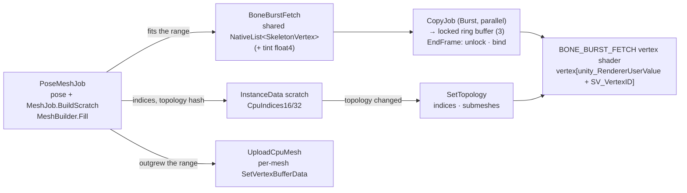

# BoneBurst CPU skinning, GPU vertex fetch

A CPU-meshed skeleton computes every vertex on the CPU exactly as before: animation, constraints, physics, deform, clipping and tint black, bit for bit the CPU mesh (`MeshBuilder`). What changes is how the vertices reach the GPU. Before this path, each skeleton uploaded its vertices into its own `Mesh` every frame. With vertex fetch, the mesh stage of `PoseMeshJob` (`MeshJob.BuildScratch`; the pose and mesh stages were fused in one work item by the Perf2 round, plan P1) writes them into **one shared list**, `BoneBurstFetch` uploads that list with **one `SetData` a frame**, and the `BONE_BURST_FETCH` vertex shader reads vertex `unity_RendererUserValue + SV_VertexID`. Each renderer's `Mesh` keeps only its topology: indices and submeshes, rebuilt when they change. The path is on by default wherever GPU skinning is supported (structured buffers in vertex shaders); `BoneBurstFetch.Enabled = false` turns it off.

## 1. Why

This was profiled on 2026-09-30 with an IL2CPP Development player at 2 000 CPU-meshed skeletons, before this path existed.
- **Main thread:** `Mesh.SetVertexBufferData` took 3.5 ms, 2 000 calls a frame.
- **Render thread:** `RenderLoop` spent 10.3 ms updating and drawing 2 000 dynamic meshes. The GPU-skinning path, drawing the same skeletons from a shared buffer, spent 0.3 ms.

Vertex fetch gives CPU-meshed skeletons the GPU path's draw cost while leaving every vertex computation on the CPU. That covers mesh deform, which GPU skinning does not handle.

## 2. Ranges

| Step | Where | What |
|---|---|---|
| First frame | `UploadCpuMesh` | The instance has no range yet, so its mesh is uploaded per mesh and `InstanceData.FetchNeeded` records its vertex count. |
| `Schedule` | `BoneBurstFetch.Attach` | The instance gets a range of `needed + needed/4 + 16` vertices from a first-fit `RangeAllocator`, kept while the count fits. |
| `Schedule` | `BoneBurstFetch.Point` | After every attach of the frame, since an attach may grow and move the lists, each header gets `FetchVertices` / `FetchTint` / `FetchCapacity`. |
| Job | `PoseMeshJob` (pose, then `MeshJob.BuildScratch`) | If the count fits the range, the job writes vertices (and tint) into it: `MeshOutput.Fetched`. Otherwise it writes the scratch, and the main thread uploads per mesh and grows the range for the next frame. |
| `Complete` | `UploadCpuMesh` | A fetched frame re-declares the `Mesh` layout, indices and submeshes only when the topology hash changed. The hash includes the fetch flag, since the two paths declare different layouts. |
| `Complete` | `ApplyMeshOutput` | The renderer's shader user value is set to the range's base when it changed, and the fetch materials (`BONE_BURST_FETCH` on) are assigned when the path changed (`FetchHash` in the submesh hash). |
| `Schedule` | `BoneBurstFetch.BeginFrame` | Locks the next of three GPU buffers (`LockBufferForWrite`) and schedules `CopyJob` after the mesh job. The job is parallel Burst, 64 KB per item, and copies every used vertex (tint once any instance used tint black). |
| `CompleteGpu` | `BoneBurstFetch.ScheduleLate` | A parallel `RangeCopyJob` copies the ranges written after the frame's copy job (GPU instances' CPU fallbacks) into the locked buffer. It copies each instance's whole range, since the count is known only after the job. |
| `Complete` | `BoneBurstFetch.EndFrame` | Unlocks the buffer and binds it as `_BoneBurstFetchVertices` / `_BoneBurstFetchTint`. The first frame that uses tint black uploads the tint list into every ring buffer once. |

`Detach` or disabling fetch releases the range. A GPU-skinned instance keeps one once it has fallen back to the CPU mesh (`FetchNeeded > 0`), so its fallback frames (mesh deform, clipping) use vertex fetch too. `BoneBurstSystem`'s uninstall disposes the ring.

**Why a ring, and why copy everything.** A locked buffer may be GPU memory that frames still in flight read from, and the documentation warns against read/write hazards. With three buffers, a frame writes one that the last two frames are not reading; this assumes at most two queued frames, Unity's default `QualitySettings.maxQueuedFrames`. The buffer coming round again is three frames old, so every used vertex is copied, including those of instances that did not re-mesh: their current vertices are in the CPU list. The copy runs on worker threads, after the mesh job.

**What it replaced.** A `SetData` of the whole list cost 0.9 ms of main thread at 2000 skeletons (13 MB, IL2CPP Development profile, `BoneBurst.FetchUpload`).

## 3. Shader

`BoneBurst/Unlit` and `BoneBurst/Lit2D` declare `#pragma multi_compile_local _ BONE_BURST_GPU BONE_BURST_FETCH`, one set of three, so there are 1.5× the variants rather than 2× (80 → 120 per graphics API). Both keywords need `#pragma target 4.5`.

In `BoneBurstCommon.hlsl`, the fetch branch reads `BoneBurstFetchVertex { float3 position; uint color; float2 uv; }`, the C# `SkeletonVertex` layout. The color is unpacked with R in the low byte. `_BoneBurstFetchTint` holds (uv2.xy, uv3.xy) for tint black. `BONE_BURST_UV(input)` gives the passes their UV from either path.

The `Mesh` of a fetched frame still declares the CPU layout (position, color, UV) so every attribute the passes declare exists. Its contents are never read.

## 4. What changes for users

- **`skeleton.Mesh` holds only the topology.** On a fetched frame its vertex positions, colors and UVs are not the skeleton's. Code that reads the mesh's vertices should call `BoneBurstFetch.Enabled = false`, or use `BoneBurstSkeleton.GetCpuVertices`, the internal accessor the tests use.
- **Bounds are unchanged.** They are set on the `Mesh` every frame, so culling works.
- **Unsupported platforms keep the per-mesh upload.** This is the same rule as GPU skinning (`BoneBurstGpu.IsSupported`).

## 5. Verification

- **`Tests/Runtime/Render/VertexFetchPlayModeTests`**, 8 of 8 from a cold shader cache: spineboy-pro (real atlas) and the synthetic `gpu.json` (dark colors, checker texture), on both shaders, with and without tint black. The same pose is drawn through fetch and through the per-mesh upload; every combination is pixel-identical (0 differing pixels).
  - The test waits for the Editor's shader compile first: on first use the Editor draws a cyan placeholder while a variant compiles, which made an early run compare a placeholder. Players compile every variant at build time.
- **The play-mode mesh-parity tests** now read vertices through `GetCpuVertices`, so they check the fetched data against the managed reference on every frame after the first.
- **Offline compile:** 804 of 804 vertex and fragment variants through DXC (D3D11 SM 6.0), with `BONE_BURST_GPU` and `BONE_BURST_FETCH` mutually exclusive.
- **Ring and fallback tests:**
  - `StillSkeleton_SurvivesRingRotation`: a skeleton walks, stops, then is drawn after nine ring rotations driven by an animating neighbour; it matches the upload.
  - `GpuFallback_UsesFetch_DrawsLikeUpload`: a GPU-skinned walk's fallback frames go through fetch and match the upload.
  - Breaking the copy (copying nothing) fails 9 of the 10 fetch tests. The GPU-fallback test still passes, correctly, since its ranges go through `EndFrame`'s late copy.
