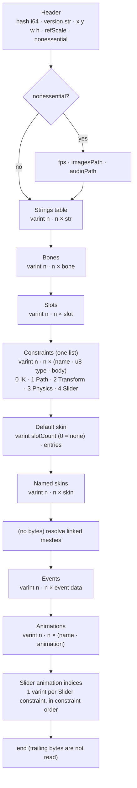

# Spine 4.3 binary skeleton format (`.skel` / `.skel.bytes`)

This page specifies the Spine 4.3 binary skeleton file byte by byte, for a clean-room reader. It is derived by reading the reference loader in `com.esotericsoftware.spine.spine-csharp` (upstream `4.3.40`, branch `4.3`, commit `7ce5d0da`; the only local change in the loader is two added `private` modifiers). No reference source is reproduced. All layouts, enums, defaults, post-processing and `scale` factors are written as tables and neutral pseudocode. The file is one forward-only stream with no chunk sizes and no padding. A reader that gets one field wrong loses sync with everything after it, so the tables below list every conditional read.



Inside one animation, the timeline groups always come in this fixed order:


---

## 0. Conventions used in this document

| Notation | Meaning |
|---|---|
| `u8` | 1 byte, unsigned 0..255 |
| `s8` | 1 byte, two's-complement signed −128..127 |
| `bool` | 1 byte; `0` = false, any other value = true |
| `i32` | 4 bytes, big-endian, two's-complement |
| `i64` | 8 bytes, big-endian, two's-complement |
| `f32` | 4 bytes, big-endian IEEE-754 binary32 |
| `varint+` | variable-length int, "optimize positive" form (§1.3) |
| `varint±` | variable-length int, zig-zag form (§1.3) |
| `str` | length-prefixed UTF-8 string, may be null (§1.4) |
| `sref` | string-table reference, may be null (§1.5) |
| `rgba` | `i32` holding RGBA8888 (§1.6) |
| `S` | the loader's `scale` (a float, default `1`, never `0`). "× S" means the value read is multiplied by `S` before it is stored. |
| `NE` | the header's `nonessential` flag |
| `[cond]` | the field is present only when `cond` is true; otherwise **no bytes** are consumed and the listed default applies |

"Index" always means a 0-based position in a list that has already been read (bones, slots, constraints, skins, events, animations, the string table). The reference never bounds-checks indices; an out-of-range index is a malformed file.

---

## 1. Primitive encodings

### 1.1 Fixed-width numbers

| Type | Bytes | Decoding |
|---|---|---|
| `u8` | 1 | `b` |
| `s8` | 1 | `b < 128 ? b : b − 256` |
| `bool` | 1 | `b != 0` |
| `i32` | 4 | `(b0<<24) | (b1<<16) | (b2<<8) | b3`, interpreted as signed 32-bit |
| `i64` | 8 | `b0` is most significant … `b7` least; signed 64-bit |
| `f32` | 4 | assemble the 4 bytes big-endian into a 32-bit pattern, reinterpret as IEEE binary32 (no conversion, NaN and ±0 preserved bit-exactly) |

### 1.2 End of stream

The reference reads single bytes through a call that returns −1 at end of stream, and it does not check for it everywhere. `u8` reads turn −1 into 255, `bool` into true, and multi-byte reads leave stale buffer contents. Only the `s8` read and the string body read raise an end-of-stream error. **A new reader should treat any read past the end as a hard error.** No valid file relies on reading past its end.

### 1.3 Variable-length integers

Each byte carries 7 payload bits, least-significant group first. Bit 7 (`0x80`) means "another byte follows". There are at most 5 bytes.

```
function readVarintRaw():
    b = u8();  r = b & 0x7F
    if b & 0x80:
        b = u8();  r |= (b & 0x7F) << 7
        if b & 0x80:
            b = u8();  r |= (b & 0x7F) << 14
            if b & 0x80:
                b = u8();  r |= (b & 0x7F) << 21
                if b & 0x80:
                    b = u8();  r |= (b & 0x7F) << 28   // 5th byte: its continuation bit is ignored;
                                                       // only its low 4 bits survive in 32 bits
    return r as 32-bit two's-complement int (bits shifted above bit 31 are discarded)
```

| Variant | Result |
|---|---|
| `varint+` ("optimizePositive = true") | `r` unchanged. Non-negative values `0..127` take 1 byte. **A negative value is stored as its full 32-bit pattern and always takes 5 bytes.** Draw-order offsets (§8.12) use this. |
| `varint±` ("optimizePositive = false", zig-zag) | `(r >>> 1) XOR −(r & 1)` where `>>>` is an unsigned (logical) right shift of the 32-bit value. So 0→0, 1→−1, 2→1, 3→−2, 4→2 … |

`varint±` is used **only** for event integer values (§7 and §8.14). Every other varint in the file is `varint+`.

### 1.4 Strings (`str`)

```
n = varint+
n == 0  → null
n == 1  → "" (empty, non-null)
n >= 2  → read (n − 1) bytes, decode as UTF-8
```

The prefix is the **UTF-8 byte count + 1**, not a character count. The difference between null and empty matters in exactly one place, the event audio path (§7). Everywhere else the reference treats both the same, or turns "" into null (noted per field).

### 1.5 String references (`sref`)

```
k = varint+
k == 0 → null
k >= 1 → strings[k − 1]            // strings = the table read in §3
```

A reference can itself resolve to null if the table entry was written as a null `str`.

### 1.6 Colors

| Encoding | Where | Decoding |
|---|---|---|
| `rgba` (`i32`, RGBA8888) | slot color, region/mesh color, and discarded nonessential colors | treat as unsigned 32-bit. `r = ((v >> 24) & 0xFF) / 255`, `g = ((v >> 16) & 0xFF) / 255`, `b = ((v >> 8) & 0xFF) / 255`, `a = (v & 0xFF) / 255` |
| XRGB888 (`i32`) | slot dark color only | `v == −1` (all bits set, `0xFFFFFFFF`) means **no dark color**. Otherwise `r = ((v >> 16) & 0xFF)/255`, `g = ((v >> 8) & 0xFF)/255`, `b = (v & 0xFF)/255`, the top byte is ignored, and the stored alpha is 1. |
| 3 or 4 separate `u8`s | color timelines (§8.3) | each channel is `u8 / 255`, in the order r, g, b, [a], [r2, g2, b2] |

The divisions are single-precision (`byte / 255f`).

---

## 2. Header

| # | Field | Type | Notes |
|---|---|---|---|
| 1 | hash | `i64` | Stored as text: the decimal form of the signed value (for example `"-4102939422154427046"`). `0` means **no hash** (null). |
| 2 | version | `str` | For example `"4.3.40"`. A null or "" value becomes null. **Check:** if the version string is longer than 13 characters, the reader stops and returns *no skeleton* (null, no error). This is how old 3.x files are rejected (see §9). |
| 3 | x | `f32` | bounds x. **Not scaled.** |
| 4 | y | `f32` | **Not scaled.** |
| 5 | width | `f32` | **Not scaled.** |
| 6 | height | `f32` | **Not scaled.** |
| 7 | referenceScale | `f32` | **× S.** (The in-memory default before reading is 100, but the value is always present.) |
| 8 | nonessential | `bool` | Gates all the `[NE]` fields in the rest of the file. |
| 9 | fps | `f32` `[NE]` | Default 0. |
| 10 | imagesPath | `str` `[NE]` | "" becomes null. |
| 11 | audioPath | `str` `[NE]` | "" becomes null. |

There is no magic number and no format version field beyond the version string.

---

## 3. Strings table

| Field | Type |
|---|---|
| count | `varint+` |
| entries | `count × str` |

Every later `sref` indexes this table (1-based; 0 = null, §1.5). Plain `str` fields (names of bones, slots, constraints, skins, events and animations; event string values; audio paths) are written inline and do **not** use the table.

---

## 4. Setup data

### 4.1 Bones

`count: varint+`, then `count` records. Bones come parents-first: a parent index always refers to an earlier bone.

| # | Field | Type | Scale | Notes |
|---|---|---|---|---|
| 1 | name | `str` | | |
| 2 | parent | `varint+` | | **Absent for bone 0** (the root has no parent). For bone `i > 0`, the index of an earlier bone. |
| 3 | rotation | `f32` | | degrees |
| 4 | x | `f32` | × S | |
| 5 | y | `f32` | × S | |
| 6 | scaleX | `f32` | | |
| 7 | scaleY | `f32` | | |
| 8 | shearX | `f32` | | degrees |
| 9 | shearY | `f32` | | degrees |
| 10 | inherit | `s8` | | index into the Inherit enum below |
| 11 | length | `f32` | × S | |
| 12 | skinRequired | `bool` | | |
| 13 | color | `rgba` `[NE]` | | discarded by the reference |
| 14 | icon | `str` `[NE]` | | discarded |
| 15 | iconSize | `f32` `[NE]` | | discarded (see Ambiguities) |
| 16 | iconRotation | `f32` `[NE]` | | discarded (see Ambiguities) |
| 17 | visible | `bool` `[NE]` | | discarded |

**Inherit enum** (used by bones and by the inherit timeline):

| Value | Name |
|---|---|
| 0 | Normal |
| 1 | OnlyTranslation |
| 2 | NoRotationOrReflection |
| 3 | NoScale |
| 4 | NoScaleOrReflection |

### 4.2 Slots

`count: varint+`, then `count` records. The order is the setup-pose draw order, and a slot's index is its position here.

| # | Field | Type | Notes |
|---|---|---|---|
| 1 | name | `str` | |
| 2 | bone | `varint+` | bone index |
| 3 | color | `rgba` | setup color |
| 4 | darkColor | `i32` | `−1` = the slot has no dark color ("tint black" off). Anything else is XRGB888 (§1.6), and the slot then has a dark color. Presence matters: it decides whether the slot takes part in two-color tinting. |
| 5 | attachmentName | `sref` | setup attachment placeholder name; null = none |
| 6 | blendMode | `varint+` | enum below |
| 7 | visible | `bool` `[NE]` | discarded |

**BlendMode:** `0` Normal, `1` Additive, `2` Multiply, `3` Screen.

### 4.3 Constraints — one unified list

4.3 stores **all constraint kinds in one list**. A constraint's index in this list is the "constraint index" used by skins (§5) and by every constraint timeline (§8.5–8.9).

```
count = varint+
repeat count:
    name = str
    type = u8           // 0 IK, 1 Path, 2 Transform, 3 Physics, 4 Slider
    body per type (below)
```

| Tag | Kind |
|---|---|
| 0 | IK |
| 1 | Path |
| 2 | Transform |
| 3 | Physics |
| 4 | Slider |

Any other tag: the reference reads no body and leaves a null entry, so the stream loses sync. Treat it as an error.

#### 4.3.1 IK (tag 0)

| # | Field | Type | Condition | Notes |
|---|---|---|---|---|
| 1 | boneCount | `varint+` | | usually 1 or 2 |
| 2 | bones | `boneCount × varint+` | | bone indices (constrained bones) |
| 3 | target | `varint+` | | bone index |
| 4 | flags | `u8` | | bits below |
| 5 | scaleYMode | `u8` | flags bit 1 | ScaleYMode enum: 0 None, 1 Uniform, 2 Volume. Default None. |
| 6 | mix | `f32` | flags bit 5 **and** bit 6 | see the mix rule below |
| 7 | softness | `f32` × S | flags bit 7 | default 0 |

| Bit | Mask | Meaning | When clear |
|---|---|---|---|
| 0 | 1 | skinRequired | false |
| 1 | 2 | a scaleYMode `u8` follows | None |
| 2 | 4 | bendDirection = −1 | bendDirection = +1 |
| 3 | 8 | compress | false |
| 4 | 16 | stretch | false |
| 5 | 32 | mix is not the default | mix = **0** |
| 6 | 64 | (only if bit 5) mix is an explicit `f32` | (bit 5 set, bit 6 clear) mix = **1** |
| 7 | 128 | a softness `f32` follows | 0 |

Mix rule: bit 5 clear → mix 0. Bit 5 set and bit 6 clear → mix 1. Both set → read an `f32`.

#### 4.3.2 Transform (tag 2)

| # | Field | Type | Notes |
|---|---|---|---|
| 1 | boneCount | `varint+` | |
| 2 | bones | `boneCount × varint+` | constrained bones |
| 3 | source | `varint+` | source bone index |
| 4 | flags | `u8` | bits 0–4 flags, bits 5–7 the **from-property count** |
| 5 | fromProperties | `fromCount ×` from-record | `fromCount = flags >> 5` (0..7) |
| 6 | offsetFlags | `u8` | which offsets follow |
| 7 | offsets | up to 6 `f32` | in bit order |
| 8 | mixFlags | `u8` | which mixes follow |
| 9 | mixes | up to 6 `f32` | in bit order |

First flags byte:

| Bit | Mask | Meaning (default false) |
|---|---|---|
| 0 | 1 | skinRequired |
| 1 | 2 | localSource |
| 2 | 4 | localTarget |
| 3 | 8 | additive |
| 4 | 16 | clamp |
| 5–7 | 0xE0 | `fromCount` (unsigned, 0..7) |

**From-record:**

| # | Field | Type | Notes |
|---|---|---|---|
| 1 | property | `u8` | Property enum below. Sets `fromScale = S` for X/Y, else 1. |
| 2 | offset | `f32` | × fromScale |
| 3 | toCount | `s8` | number of to-records |
| 4 | to-records | `toCount ×` to-record | |

**To-record:**

| # | Field | Type | Notes |
|---|---|---|---|
| 1 | property | `u8` | Property enum below. Sets `toScale = S` for X/Y, else 1. |
| 2 | offset | `f32` | × toScale |
| 3 | max | `f32` | × toScale |
| 4 | scale | `f32` | × (toScale ÷ fromScale), so X→rotate stores `v / S` and rotate→X stores `v × S` |

**Transform property enum** (from, to, and slider property):

| Value | Property | Scaled by S? |
|---|---|---|
| 0 | Rotate | no |
| 1 | X | yes |
| 2 | Y | yes |
| 3 | ScaleX | no |
| 4 | ScaleY | no |
| 5 | ShearY | no |

An unknown value leaves a null property in the reference and then crashes. Treat it as an error.

**Offset flags** (each set bit is followed by one `f32`, in this order; a clear bit leaves the offset at 0):

| Bit | Mask | Offset | Scale |
|---|---|---|---|
| 0 | 1 | rotation | |
| 1 | 2 | x | × S |
| 2 | 4 | y | × S |
| 3 | 8 | scaleX | |
| 4 | 16 | scaleY | |
| 5 | 32 | shearY | |

**Mix flags** (each set bit is followed by one `f32`, in this order; **a clear bit leaves the mix at 0**):

| Bit | Mask | Setup mix |
|---|---|---|
| 0 | 1 | mixRotate |
| 1 | 2 | mixX |
| 2 | 4 | mixY |
| 3 | 8 | mixScaleX |
| 4 | 16 | mixScaleY |
| 5 | 32 | mixShearY |

Bits 6–7 of both bytes are unused.

#### 4.3.3 Path (tag 1)

| # | Field | Type | Condition | Notes |
|---|---|---|---|---|
| 1 | boneCount | `varint+` | | |
| 2 | bones | `boneCount × varint+` | | |
| 3 | slot | `varint+` | | **slot** index (the path attachment's slot), not a bone |
| 4 | flags | `u8` | | bits below |
| 5 | offsetRotation | `f32` | flags bit 7 | default 0 |
| 6 | position | `f32` | always | × S **iff** positionMode = Fixed |
| 7 | spacing | `f32` | always | × S **iff** spacingMode ∈ {Length, Fixed} |
| 8 | mixRotate | `f32` | always | |
| 9 | mixX | `f32` | always | |
| 10 | mixY | `f32` | always | |

| Bits | Extract | Meaning |
|---|---|---|
| 0 | `flags & 1` | skinRequired |
| 1 | `(flags >> 1) & 1` | PositionMode: 0 Fixed, 1 Percent |
| 2–3 | `(flags >> 2) & 3` | SpacingMode: 0 Length, 1 Fixed, 2 Percent, 3 Proportional |
| 4–5 | `(flags >> 4) & 3` | RotateMode: 0 Tangent, 1 Chain, 2 ChainScale (3 is invalid) |
| 6 | — | unused |
| 7 | `flags & 128` | an offsetRotation `f32` follows |

#### 4.3.4 Physics (tag 3)

| # | Field | Type | Condition | Scale / default |
|---|---|---|---|---|
| 1 | bone | `varint+` | | |
| 2 | flags | `u8` | | bits below |
| 3 | x | `f32` | bit 1 | default 0; **not scaled** (a factor) |
| 4 | y | `f32` | bit 2 | default 0; not scaled |
| 5 | rotate | `f32` | bit 3 | default 0 |
| 6 | scaleX (+ScaleYMode) | `f32` | bit 4 | default 0; decode below |
| 7 | shearX | `f32` | bit 5 | default 0 |
| 8 | limit | `f32` | bit 6 | **default 5000**; stored value = (read or 5000) × S |
| 9 | fps | `u8` | always | `step = 1 / fps` (single-precision). A 0 byte gives step = +∞. |
| 10 | inertia | `f32` | always | setup pose |
| 11 | strength | `f32` | always | |
| 12 | damping | `f32` | always | |
| 13 | massInverse | `f32` | bit 7 | **default 1**; the file stores the *inverse* mass |
| 14 | wind | `f32` | always | |
| 15 | gravity | `f32` | always | |
| 16 | flags2 | `u8` | always | bits below |
| 17 | mix | `f32` | flags2 bit 7 | **default 1** |

First flags byte:

| Bit | Mask | Meaning |
|---|---|---|
| 0 | 1 | skinRequired |
| 1 | 2 | x follows |
| 2 | 4 | y follows |
| 3 | 8 | rotate follows |
| 4 | 16 | scaleX follows |
| 5 | 32 | shearX follows |
| 6 | 64 | limit follows |
| 7 | 128 | massInverse follows |

**scaleX / ScaleYMode packing.** Let `v` be the `f32` read. If `v < −2`: mode = Volume and scaleX = `−2 − v`. Else if `v < 0`: mode = Uniform and scaleX = `−1 − v`. Else mode = None and scaleX = `v`. If bit 4 is clear, mode = None and scaleX = 0.

Second flags byte (each bit sets a "global" flag, default false; a global property is driven by the all-constraints physics timelines, §8.8):

| Bit | Mask | Meaning |
|---|---|---|
| 0 | 1 | inertiaGlobal |
| 1 | 2 | strengthGlobal |
| 2 | 4 | dampingGlobal |
| 3 | 8 | massGlobal |
| 4 | 16 | windGlobal |
| 5 | 32 | gravityGlobal |
| 6 | 64 | mixGlobal |
| 7 | 128 | a mix `f32` follows (else mix = 1) |

#### 4.3.5 Slider (tag 4)

| # | Field | Type | Condition | Notes |
|---|---|---|---|---|
| 1 | flags | `u8` | | bits below |
| 2 | timeOrMax | `f32` | bit 3 | see below |
| 3 | mix | `f32` | bit 4 **and** bit 5 | bit 4 clear → mix **0**; bit 4 set and bit 5 clear → mix **1** |
| 4 | bone | `varint+` | bit 6 | driving bone index |
| 5 | propertyOffset | `f32` | bit 6 | × propertyScale (**read before the property type**) |
| 6 | property | `u8` | bit 6 | Transform property enum (§4.3.2); propertyScale = S for X/Y, else 1 |
| 7 | offset | `f32` | bit 6 | slider offset, not scaled |
| 8 | scale | `f32` | bit 6 | **÷ propertyScale** |

| Bit | Mask | Meaning (default false/absent) |
|---|---|---|
| 0 | 1 | skinRequired |
| 1 | 2 | loop |
| 2 | 4 | additive |
| 3 | 8 | a timeOrMax `f32` follows |
| 4 | 16 | mix is not the default (0) |
| 5 | 32 | mix is an explicit `f32` (else 1) |
| 6 | 64 | bone-driven: fields 4–8 follow |
| 7 | 128 | local (meaningful only with bit 6) |

**timeOrMax semantics.** If bit 3 is set, one `f32` is always consumed. If `NE` is true **and** bit 6 is set, the value is the editor's "max" and is discarded, and the setup time stays 0. In every other case it is the setup **time**. Setup time defaults to 0.

**The slider's animation is not read here.** It is a `varint+` animation index at the very end of the file (§8.16).

---

## 5. Skins

### 5.1 Default skin

```
slotCount = varint+
if slotCount == 0: there is no default skin (nothing is added to the skin list)
else: skin named "default"; read slotCount slot-entry groups (§5.3)
```

The default skin has **no** name, color, bone list or constraint list in the file.

### 5.2 Named skins

```
count = varint+
repeat count:
    name            = str
    color           = rgba            [NE]   discarded
    boneCount       = varint+
    bones           = boneCount × varint+          (bone indices)
    constraintCount = varint+
    constraints     = constraintCount × varint+    (indices into the unified constraint list §4.3)
    slotCount       = varint+
    slotCount slot-entry groups (§5.3)
```

**Skin indices.** The skin list is `[default (if present)] + named skins in file order`. Linked meshes (§6.4) and attachment timelines (§8.10) index this combined list. So when there is no default skin, the first named skin is index 0.

### 5.3 Slot-entry group (shared by both skin forms)

```
slotIndex       = varint+
attachmentCount = varint+
repeat attachmentCount:
    placeholder = sref         // the skin key (name the slot/timelines refer to)
    attachment  = §6
    skin[(slotIndex, placeholder)] = attachment     // unless the attachment loader declined it
```

The attachment bytes are always consumed in full, even when the runtime's attachment loader returns "no attachment" (for example a missing atlas region). The entry is then skipped.

---

## 6. Attachments

Every attachment starts with one flags byte:

| Bits | Mask | Meaning |
|---|---|---|
| 0–2 | `flags & 7` | attachment type (table below) |
| 3 | 8 | an explicit **name** `sref` follows. If clear, name = placeholder. |
| 4–7 | | type-specific (per-type tables below) |

| Type | Kind |
|---|---|
| 0 | Region |
| 1 | BoundingBox |
| 2 | Mesh |
| 3 | LinkedMesh |
| 4 | Path |
| 5 | Point |
| 6 | Clipping |
| 7 | (the "Sequence" enum value) not readable. The reference reads nothing more and returns nothing, so the stream loses sync. Treat it as an error. |

Read order is always: flags `u8`, then `name: sref` if bit 3, then the per-type body.

### 6.1 Region (type 0)

| # | Field | Type | Condition | Default / scale |
|---|---|---|---|---|
| 1 | path | `sref` | bit 4 | null → use **name** |
| 2 | color | `rgba` | bit 5 | `0xFFFFFFFF` (opaque white) |
| 3 | sequence | §6.8 | bit 6 | absent → single-region sequence |
| 4 | rotation | `f32` | bit 7 | 0 |
| 5 | x | `f32` | | × S |
| 6 | y | `f32` | | × S |
| 7 | scaleX | `f32` | | |
| 8 | scaleY | `f32` | | |
| 9 | width | `f32` | | × S |
| 10 | height | `f32` | | × S |

The file field order is color, sequence, rotation, then x … height. It is **not** the order the runtime stores them in.

### 6.2 BoundingBox (type 1)

| # | Field | Type | Condition |
|---|---|---|---|
| 1 | vertices | §6.9 | weighted **iff flags bit 4** |
| 2 | color | `rgba` | `[NE]`, discarded |

### 6.3 Mesh (type 2)

| # | Field | Type | Condition | Notes |
|---|---|---|---|---|
| 1 | path | `sref` | bit 4 | null / absent → name |
| 2 | color | `rgba` | bit 5 | default `0xFFFFFFFF` |
| 3 | sequence | §6.8 | bit 6 | |
| 4 | hullLength | `varint+` | | the number of hull **vertices**. The runtime keeps `hullLength × 2` (a float count). |
| 5 | vertices | §6.9 | weighted **iff flags bit 7** | gives `V` = vertexCount and `L = 2V` |
| 6 | uvs | `L × f32` | | region UVs (u,v pairs, 0..1 of the region), **not scaled** |
| 7 | triangles | `T × varint+` | | `T = (L − hullLength − 2) × 3`, that is `(2V − H − 2)` triangles × 3 indices |
| 8 | timelineSlotCount | `varint+` | | |
| 9 | timelineSlots | `timelineSlotCount × varint+` | | slot indices. They are extra slots whose attachments use this mesh's timelines. If the count is 0, the runtime keeps an empty list. |
| 10 | edgeCount | `varint+` | `[NE]` | |
| 11 | edges | `edgeCount × varint+` | `[NE]` | |
| 12 | width | `f32` | `[NE]` | × S (default 0 without NE) |
| 13 | height | `f32` | `[NE]` | × S |

Note on `T`: `hullLength` here is the raw vertex count H read in field 4, not the doubled value.

### 6.4 LinkedMesh (type 3)

| # | Field | Type | Condition | Notes |
|---|---|---|---|---|
| 1 | path | `sref` | bit 4 | null / absent → name |
| 2 | color | `rgba` | bit 5 | default `0xFFFFFFFF` |
| 3 | sequence | §6.8 | bit 6 | |
| — | inheritTimelines | (flag) | bit 7 | no bytes |
| 4 | sourceSlot | `varint+` | | **slot index** used to look up the source mesh |
| 5 | skinIndex | `varint+` | | index into the combined skin list (§5.2) |
| 6 | source | `sref` | | the source mesh's **placeholder** name in that skin/slot |
| 7 | width | `f32` | `[NE]` | × S |
| 8 | height | `f32` | `[NE]` | × S |

A linked mesh carries no geometry. It is a mesh whose geometry is resolved after all skins are read (§6.10).

### 6.5 Path (type 4)

| # | Field | Type | Condition | Notes |
|---|---|---|---|---|
| — | closed | (flag) | bit 4 | |
| — | constantSpeed | (flag) | bit 5 | |
| 1 | vertices | §6.9 | weighted **iff bit 6** | `L = 2V` |
| 2 | lengths | `(L / 6) × f32` | | × S each (integer division; one length per Bezier segment) |
| 3 | color | `rgba` | `[NE]` | discarded |

### 6.6 Point (type 5)

No type-specific flag bits.

| # | Field | Type | Scale |
|---|---|---|---|
| 1 | rotation | `f32` | |
| 2 | x | `f32` | × S |
| 3 | y | `f32` | × S |
| 4 | color | `rgba` `[NE]` | discarded |

Rotation comes **before** x and y.

### 6.7 Clipping (type 6)

| # | Field | Type | Condition | Notes |
|---|---|---|---|---|
| 1 | endSlot | `varint+` | | slot index where clipping ends |
| 2 | vertices | §6.9 | weighted **iff bit 4** | |
| 3 | color | `rgba` | `[NE]` | discarded |
| — | convex | (flag) | bit 5 | |
| — | inverse | (flag) | bit 6 | |

### 6.8 Sequence block

Present only when the owning attachment's "sequence" bit is set (Region bit 6, Mesh bit 6, LinkedMesh bit 6).

| # | Field | Type | Notes |
|---|---|---|---|
| 1 | count | `varint+` | number of regions (frames) |
| 2 | start | `varint+` | first number of the numeric path suffix |
| 3 | digits | `varint+` | minimum digits (zero-padded); 0 = no padding |
| 4 | setupIndex | `varint+` | region shown in setup pose |

When the block is present, the sequence "has a path suffix". Region `k` then loads the atlas path `path + zeroPad(start + k, digits)`: the decimal form of `start + k`, left-padded with `'0'` to at least `digits` characters. When the block is absent, the attachment has one region, no suffix, and start = digits = setupIndex = 0, and the path is used as is.

Every sequence instance gets a runtime-unique id. Sequence timelines are keyed by it. The id is not in the file.

### 6.9 Vertices block

```
V = varint+                     // vertex count
L = 2 × V                       // "world vertices length", stored on the attachment
if not weighted:
    vertices = L × f32, each × S          // x0,y0,x1,y1,...
    bones    = none
else:
    B = varint+                           // total length of the bones array
    bones    = int[B]
    weights  = float[(B − V) × 3]
    b = 0; w = 0
    while b < B:
        n = varint+                       // influences for this vertex
        bones[b++] = n
        repeat n:
            bones[b++]     = varint+      // bone index
            weights[w++]   = f32 × S      // bind-pose x in that bone's space
            weights[w++]   = f32 × S      // bind-pose y
            weights[w++]   = f32          // weight (NOT scaled)
    vertices = weights
```

Layout of the weighted arrays: `bones` is `[n₀, bone, bone, …, n₁, bone, …]`, one count followed by that many bone indices per vertex, `V` groups in total. `weights` holds one `(x, y, weight)` triple per influence, in the same order. So `B = V + totalInfluences` and `weights.length = 3 × totalInfluences`. The loop ends on `b == B`, not on a vertex count.

"Weighted" on the attachment means "has a bones array". Deform timelines depend on this (§8.10.1).

### 6.10 Linked-mesh resolution (after all skins, no bytes)

It runs once, after the named skins and before the events, in the order the linked meshes were read:

```
for each pending linked mesh M (skinIndex, sourceSlot, source, inheritTimelines):
    P = skins[skinIndex].get(sourceSlot, source)        // lookup by (slot index, placeholder name)
    if P is null: error "Source mesh not found: <source>"
    M.timelineAttachment = inheritTimelines ? P : M
    M.sourceMesh = P   // copies from P: bones, vertices, worldVerticesLength, regionUVs, triangles,
                       //   hullLength, edges, width, height   (overwrites M's own NE width/height)
    re-compute M's sequence UVs
```

Notes:
* The source can live in any skin, including a later skin than the linked mesh.
* The lookup key is the **placeholder** name in `sourceSlot`, which is not necessarily the slot the linked mesh itself is in.
* `timelineSlots` is **not** copied from the source. A linked mesh keeps an empty list.
* Every non-linked attachment's `timelineAttachment` is itself.
* A linked mesh whose loader returned "no attachment" is never queued.

---

## 7. Events (setup data)

`count: varint+`, then `count` records:

| # | Field | Type | Notes |
|---|---|---|---|
| 1 | name | `str` | |
| 2 | int | `varint±` | zig-zag |
| 3 | float | `f32` | |
| 4 | string | `str` | may be null |
| 5 | audioPath | `str` | **not** normalized: "" stays "" (non-null) |
| 6 | volume | `f32` | only if audioPath is **non-null**, even when it is "" |
| 7 | balance | `f32` | same condition |

When fields 6–7 are absent, volume = 0 and balance = 0.

---

## 8. Animations

```
animationCount = varint+
repeat animationCount:
    name = str
    body (§8.1)
```

### 8.1 Animation body — group order

| # | Group | Reads |
|---|---|---|
| 0 | timeline count hint | `varint+`; a capacity hint only (total number of timelines). It may be ignored. |
| 1 | Slot timelines | §8.3 |
| 2 | Bone timelines | §8.4 |
| 3 | IK timelines | §8.5 |
| 4 | Transform timelines | §8.6 |
| 5 | Path timelines | §8.7 |
| 6 | Physics timelines | §8.8 |
| 7 | Slider timelines | §8.9 |
| 8 | Attachment timelines (deform, sequence) | §8.10 |
| 9 | Draw order timeline | §8.11 |
| 10 | Draw-order folder timelines | §8.13 |
| 11 | Event timeline | §8.14 |
| 12 | color | `rgba` `[NE]`, discarded |

**Duration** = the maximum, over all timelines read, of the time of each timeline's last frame. It is 0 if the animation has no timelines. It is not stored in the file.

Every group is present (at least its count varint) even when empty.

### 8.2 Curve encoding and Bezier baking

#### 8.2.1 Keyed curve timelines — common read pattern

Most timelines ("curve timelines") store `C` value channels per frame and read like this:

```
frameCount  = varint+           // header, read by the group
bezierCount = varint+           // header: total Bezier curves in this timeline, over all frames and channels
time  = f32;  values[0..C) = per-channel read (with that channel's scale)
for frame = 0 .. frameCount−1:
    setFrame(frame, time, values)
    if frame == frameCount − 1: stop
    time2 = f32;  values2[0..C) = per-channel read
    curve = u8
      0 (LINEAR):  nothing more
      1 (STEPPED): mark frame as stepped
      2 (BEZIER):  for c in 0..C−1 (channel order):
                        cx1 = f32; cy1 = f32 × scale_c; cx2 = f32; cy2 = f32 × scale_c
                        bake(bezierIndex++, frame, c, time, values[c], cx1, cy1, cx2, cy2, time2, values2[c])
      any other value: treated as LINEAR, nothing read
    time = time2; values = values2
```

* The curve byte after frame `k+1` describes the segment **from frame k to frame k+1**.
* There is no curve byte after the last frame, and none before the first.
* A BEZIER segment always has **all C channels** as Beziers, each with 4 `f32`s, in channel order, with consecutive bezier indices.
* `scale_c` is the same factor applied to that channel's values (1 for everything except the scaled channels listed per timeline).
* Handle times `cx1`, `cx2` are absolute seconds and are never scaled.
* Handle values are in value units. For color channels they are already 0..1 floats; they are **not** divided by 255.

#### 8.2.2 Curve storage

Each curve timeline owns a `curves: float[frameCount + bezierCount × 18]`.

| Index range | Content |
|---|---|
| `curves[f]`, `0 ≤ f < frameCount` | curve type of the segment starting at frame `f`: `0` LINEAR, `1` STEPPED, or `2 + s` where `s` is the start index of that segment's **channel-0** Bezier block |
| `curves[frameCount + k×18 …+17]` | Bezier block `k`: 9 sampled points `(x, y)`, interleaved `x0,y0,x1,y1,…,x8,y8` |

Initial state: every entry is 0 (LINEAR), except `curves[frameCount − 1] = 1` (STEPPED; the last frame has no outgoing segment).

Bezier block `k` starts at `s_k = frameCount + 18k`. Only channel 0 writes the type: `curves[frame] = 2 + s_k`. Channel `c` of the same segment is at `s_k + 18c`, because the file gives consecutive bezier indices to one segment's channels. A reader that uses another storage scheme must reproduce the same sample points.

#### 8.2.3 Baking (`bake`) — 10-segment forward differencing

The cubic Bezier from key `(t1, v1)` through handles `(cx1, cy1)`, `(cx2, cy2)` to key `(t2, v2)` is sampled at parameter `u = 0.1, 0.2, …, 0.9` (9 interior points; the two keys supply the ends, which gives 10 linear segments). The reference uses third-order forward differences with step `h = 0.1`: `3h = 0.3`, `3h² = 0.03`, `6h³ = 0.006`, `1/6 ≈ 0.16666667`. To be bit-exact, evaluate in **single precision** with exactly these operations, left to right as parenthesized:

```
tmpx = ((t1 − (cx1 × 2)) + cx2) × 0.03
tmpy = ((v1 − (cy1 × 2)) + cy2) × 0.03
dddx = ((((cx1 − cx2) × 3) − t1) + t2) × 0.006
dddy = ((((cy1 − cy2) × 3) − v1) + v2) × 0.006
ddx  = (tmpx × 2) + dddx
ddy  = (tmpy × 2) + dddy
dx   = (((cx1 − t1) × 0.3) + tmpx) + (dddx × 0.16666667)
dy   = (((cy1 − v1) × 0.3) + tmpy) + (dddy × 0.16666667)
x    = t1 + dx
y    = v1 + dy
repeat 9 times (point p = 0..8):
    store (x, y) as point p
    dx += ddx;  dy += ddy
    ddx += dddx; ddy += dddy
    x  += dx;   y  += dy
```

**Deform-timeline variant.** A deform timeline bakes a 0→1 *percentage* curve. The file still supplies `cx1, cy1, cx2, cy2`, with cy read at scale 1. v1 = 0 and v2 = 1 are substituted, and the y terms use this algebraically simplified form (the x terms are unchanged):

```
tmpy = (cy2 × 0.03) − (cy1 × 0.06)
dddy = ((cy1 − cy2) + 0.33333333) × 0.018
ddy  = (tmpy × 2) + dddy
dy   = ((cy1 × 0.3) + tmpy) + (dddy × 0.16666667)
y    = dy
```

It is mathematically equal to the general form but not bit-identical, so use this form for deform.

#### 8.2.4 Sampling a baked curve (for parity)

Given a timeline time `t` in the segment starting at frame `f` (frame time `tf`, value `vf`; next frame time `tn`, value `vn`), and `s = curves[f] − 2 + 18c` for channel `c`:

```
if curves[s] > t:               // before first sample
    return vf + (t − tf) / (curves[s] − tf) × (curves[s+1] − vf)
for p = 1..8:
    if curves[s + 2p] >= t:
        (x0,y0) = point p−1; (x1,y1) = point p
        return y0 + (t − x0)/(x1 − x0) × (y1 − y0)
(x,y) = point 8
return y + (t − x) / (tn − x) × (vn − y)
```

For the deform percentage curve: the first case returns `y₀ × (t − tf)/(x₀ − tf)`, and the last case returns `y + (1 − y) × (t − x)/(tn − x)`. LINEAR gives `(t − tf)/(tn − tf)` and STEPPED gives 0.

Frame lookup is "the last frame whose time ≤ t" (a linear scan from frame 0 in the reference). Times before frame 0 are handled per timeline and are not part of the format.

#### 8.2.5 Per-timeline frame storage (reference layout)

| Timeline | Entries per frame |
|---|---|
| 1-value curve (rotate, translateX/Y, scaleX/Y, shearX/Y, path position/spacing, physics *, slider time/mix) | 2: `time, value` |
| 2-value bone (translate, scale, shear) | 3: `time, v1, v2` |
| RGBA | 5 · RGB 4 · Alpha 2 · RGBA2 8 (`t,r,g,b,a,r2,g2,b2`) · RGB2 7 (`t,r,g,b,r2,g2,b2`) |
| IK | 6: `time, mix, softness, bendDirection(±1), compress(0/1), stretch(0/1)` |
| Transform | 7: `time, mixRotate, mixX, mixY, mixScaleX, mixScaleY, mixShearY` |
| Path mix | 4: `time, mixRotate, mixX, mixY` |
| Inherit | 2: `time, inheritIndex` |
| Sequence | 3: `time, modeAndIndex, delay` |
| Attachment, Deform, DrawOrder, DrawOrderFolder, Event, PhysicsReset | 1: `time`, plus a side array per frame |

### 8.3 Slot timelines

```
slotCount = varint+
repeat slotCount:
    slotIndex     = varint+
    timelineCount = varint+
    repeat timelineCount:
        type       = u8
        frameCount = varint+
        [bezierCount = varint+]   // every type EXCEPT 0 (attachment)
        body
```

| Tag | Timeline | Channels (per frame, after `time: f32`) | Bezier channel order |
|---|---|---|---|
| 0 | Attachment | `name: sref` (null = clear attachment). **No curve byte, no bezierCount.** Frames are just `frameCount × (f32 time, sref name)`. | — |
| 1 | RGBA | `r, g, b, a` as 4 × `u8` (/255) | r, g, b, a (4 Beziers) |
| 2 | RGB | `r, g, b` as 3 × `u8` | r, g, b (3) |
| 3 | RGBA2 | `r, g, b, a, r2, g2, b2` as 7 × `u8` (light color + dark color) | r, g, b, a, r2, g2, b2 (7) |
| 4 | RGB2 | `r, g, b, r2, g2, b2` as 6 × `u8` | r, g, b, r2, g2, b2 (6) |
| 5 | Alpha | `a` as 1 × `u8` | a (1) |

Tags 1–5 follow §8.2.1 with `C` = the channel count and scale 1. An unknown tag reads nothing and loses sync; treat it as an error.

### 8.4 Bone timelines

```
boneCount = varint+
repeat boneCount:
    boneIndex     = varint+
    timelineCount = varint+
    repeat timelineCount:
        type       = u8
        frameCount = varint+
        if type == 10 (Inherit):
            frameCount × (time: f32, inherit: u8)       // Inherit enum §4.1; no bezierCount, no curves
        else:
            bezierCount = varint+
            curve timeline §8.2.1
```

| Tag | Timeline | C | Channel scale |
|---|---|---|---|
| 0 | Rotate | 1 | 1 |
| 1 | Translate (x, y) | 2 | **S** (values and Bezier cy) |
| 2 | TranslateX | 1 | **S** |
| 3 | TranslateY | 1 | **S** |
| 4 | Scale (x, y) | 2 | 1 |
| 5 | ScaleX | 1 | 1 |
| 6 | ScaleY | 1 | 1 |
| 7 | Shear (x, y) | 2 | 1 |
| 8 | ShearX | 1 | 1 |
| 9 | ShearY | 1 | 1 |
| 10 | Inherit | — | — |

The reference also records the list of `boneIndex` values (in file order) on the animation, for "which bones does this animation touch". It is derived data.

### 8.5 IK constraint timelines

No type byte. Each entry is one IK timeline.

```
count = varint+
repeat count:
    constraintIndex = varint+          // unified constraint list
    frameCount      = varint+
    bezierCount     = varint+
    flags = u8
    time  = f32
    mix      = (flags & 1) ? ((flags & 2) ? f32 : 1) : 0
    softness = (flags & 4) ? f32 × S : 0
    for frame = 0..:
        setFrame(frame, time, mix, softness,
                 bendDirection = (flags & 8) ? +1 : −1,
                 compress = flags & 16, stretch = flags & 32)
        if last frame: stop
        flags     = u8                   // the NEXT frame's flags
        time2     = f32
        mix2      = (flags & 1) ? ((flags & 2) ? f32 : 1) : 0
        softness2 = (flags & 4) ? f32 × S : 0
        if flags & 64:  stepped(frame)
        elif flags & 128: bezier channel 0 = mix (scale 1), channel 1 = softness (scale S)  → 8 f32
        time, mix, softness = time2, mix2, softness2
```

| Bit | Mask | Meaning (per frame) |
|---|---|---|
| 0 | 1 | mix is not 0 |
| 1 | 2 | mix is an explicit `f32` (else 1) |
| 2 | 4 | softness `f32` follows (× S), else 0 |
| 3 | 8 | bendDirection = **+1** (clear = −1; the reverse of the setup-data bit, §4.3.1) |
| 4 | 16 | compress |
| 5 | 32 | stretch |
| 6 | 64 | the segment *from the previous frame* is STEPPED |
| 7 | 128 | the segment *from the previous frame* is BEZIER (2 channels) |

Bits 6/7 of the **first** frame's flags byte are ignored. The IK timeline has no separate curve byte. Bit 6 is tested before bit 7.

### 8.6 Transform constraint timelines

```
count = varint+
repeat count:
    constraintIndex = varint+
    frameCount      = varint+
    bezierCount     = varint+
    curve timeline §8.2.1 with C = 6:
        mixRotate, mixX, mixY, mixScaleX, mixScaleY, mixShearY   (all f32, scale 1)
```

### 8.7 Path constraint timelines

```
count = varint+
repeat count:
    constraintIndex = varint+           // must be a Path constraint; its modes pick the scale
    timelineCount   = varint+
    repeat timelineCount:
        type        = u8
        frameCount  = varint+
        bezierCount = varint+
        curve timeline §8.2.1
```

| Tag | Timeline | C | Scale |
|---|---|---|---|
| 0 | Position | 1 | **S iff** the constraint's positionMode = Fixed |
| 1 | Spacing | 1 | **S iff** spacingMode ∈ {Length, Fixed} |
| 2 | Mix | 3: mixRotate, mixX, mixY | 1 |

### 8.8 Physics constraint timelines

```
count = varint+
repeat count:
    index         = varint+ − 1          // 0 in the file → −1 = ALL physics constraints (the global variant)
    timelineCount = varint+
    repeat timelineCount:
        type       = u8
        frameCount = varint+
        if type == 8 (Reset):
            frameCount × (time: f32)      // no bezierCount, no curves
        else:
            bezierCount = varint+
            curve timeline §8.2.1, C = 1, scale 1
```

| Tag | Timeline | Notes |
|---|---|---|
| 0 | Inertia | |
| 1 | Strength | |
| 2 | Damping | |
| 3 | — | **unused**; any unlisted tag is an error in the reference |
| 4 | Mass | values are **mass**, not inverse mass (the runtime stores `1/value`) |
| 5 | Wind | |
| 6 | Gravity | |
| 7 | Mix | |
| 8 | Reset | times only |

A stored index ≥ 0 is an index into the unified constraint list. For −1 ("all"), a value timeline affects every active physics constraint whose matching `*Global` flag (§4.3.4) is set, and a reset timeline resets all of them.

### 8.9 Slider timelines

```
count = varint+
repeat count:
    constraintIndex = varint+            // unified list, NOT offset by one
    timelineCount   = varint+
    repeat timelineCount:
        type        = s8                 // read signed
        frameCount  = varint+
        bezierCount = varint+
        curve timeline §8.2.1, C = 1, scale 1
```

| Tag | Timeline |
|---|---|
| 0 | Slider time |
| 1 | Slider mix |
| other | error |

### 8.10 Attachment timelines (deform, sequence)

```
skinCount = varint+
repeat skinCount:
    skin      = skins[varint+]                        // combined skin list §5.2
    slotCount = varint+
    repeat slotCount:
        slotIndex = varint+
        attCount  = varint+
        repeat attCount:
            attName    = sref
            attachment = skin.get(slotIndex, attName)  // must exist → else error "Timeline attachment not found"
            type       = u8
            frameCount = varint+
            body by type
```

| Tag | Timeline |
|---|---|
| 0 | Deform |
| 1 | Sequence |

The lookup happens while reading, and linked meshes are already resolved at that point. That matters for deform, which needs the vertex data.

#### 8.10.1 Deform (tag 0)

The attachment must be a vertex attachment (mesh, linked mesh, bounding box, path, clipping).

```
weighted     = attachment has a bones array (§6.9)
setup        = attachment.vertices          // unweighted: L floats (already × S); weighted: 3 × influences
deformLength = weighted ? (setup.length / 3) × 2 : setup.length
bezierCount  = varint+
time = f32
for frame = 0..:
    end = varint+                                     // number of floats stored for this frame
    if end == 0:
        deform = weighted ? zeros(deformLength) : setup         // unweighted: the setup array itself
    else:
        deform = zeros(deformLength)
        start  = varint+
        for v in start .. start+end−1:  deform[v] = f32 × S
        if not weighted: for every v in 0..deformLength−1: deform[v] += setup[v]
    setFrame(frame, time, deform)
    if last frame: stop
    time2 = f32
    curve = u8   // 0 linear, 1 stepped, 2 bezier: ONE curve, 4 f32 (cx1, cy1, cx2, cy2), cy at scale 1,
                 // baked with the deform variant (§8.2.3) from (time, 0) to (time2, 1)
    time = time2
```

* For a **weighted** attachment, `deformLength = 2 × totalInfluences`, **not** `2 × V`. Each `(x, y)` pair is an offset added to one bone-local bind position. Frames store *offsets*.
* For an **unweighted** attachment, frames store *absolute* vertex positions: setup plus the file delta. The file itself always stores deltas, over the sparse range `[start, start+end)`.
* The timeline's key is `(slotIndex, attachment)`. It animates the named attachment, and through `timelineAttachment` it also animates linked meshes that inherit timelines.

#### 8.10.2 Sequence (tag 1)

The attachment must carry a sequence (Region or Mesh/LinkedMesh). No bezierCount and no curves.

```
frameCount × (
    time         = f32
    modeAndIndex = i32          // 4-byte big-endian, NOT a varint
    delay        = f32          // seconds per sequence frame
)
mode  = modeAndIndex & 0xF      // SequenceMode below
index = modeAndIndex >> 4       // arithmetic shift
```

**SequenceMode:** 0 Hold, 1 Once, 2 Loop, 3 Pingpong, 4 OnceReverse, 5 LoopReverse, 6 PingpongReverse.

### 8.11 Draw order timeline

```
frameCount = varint+
if frameCount > 0:  one timeline with frameCount × ( time: f32, order: drawOrder(slotCount) )
                    // slotCount = total slots in the skeleton
```

### 8.12 Draw-order record (`drawOrder(N)`)

```
changeCount = varint+
if changeCount == 0: order = null        // null = "setup order"
else:
    order     = int[N] filled with −1
    unchanged = int[N − changeCount]
    orig = 0; u = 0
    repeat changeCount:
        idx    = varint+                 // an original index, strictly increasing across the loop
        while orig != idx: unchanged[u++] = orig++
        offset = varint+                 // SIGNED value written as varint+ (negatives take 5 bytes, §1.3)
        order[orig + offset] = orig
        orig++
    while orig < N: unchanged[u++] = orig++
    for i = N−1 down to 0:
        if order[i] == −1: order[i] = unchanged[−−u]
```

`order[i]` is the original index of the item drawn at position `i`.

### 8.13 Draw-order folder timelines (4.3)

Each timeline re-orders a subset of slots (a "folder") among the positions those slots already occupy.

```
folderCount = varint+
repeat folderCount:
    folderSlotCount = varint+
    folderSlots     = folderSlotCount × varint+       // skeleton slot indices, in setup order
    keyCount        = varint+
    keyCount × ( time: f32, order: drawOrder(folderSlotCount) )     // §8.12 in FOLDER-LOCAL indices
```

A folder timeline is added even when `keyCount` is 0. The reference does not special-case that; a reader should skip or ignore such a timeline. The entries of `order` are folder-local indices `0..folderSlotCount−1`, and `folderSlots[order[k]]` gives the skeleton slot. When applied, the k-th draw-order position occupied by *any* folder slot gets `folderSlots[order[k]]`. A null order restores the folder's setup order.

### 8.14 Event timeline

```
eventCount = varint+
if eventCount > 0: one timeline, eventCount × (
    time      = f32
    eventData = events[varint+]
    int       = varint±                         // zig-zag
    float     = f32
    string    = str      // if null → use the event data's setup string
    volume    = f32      // only if eventData.audioPath != null
    balance   = f32      // same condition
)
```

volume and balance default to 0 when absent. The timeline frame time is the event's time.

### 8.15 Trailing animation color

`rgba` `[NE]`, read after the event timeline and discarded.

### 8.16 After all animations — slider animation links

```
for each constraint in the unified list, in order:
    if it is a Slider: slider.animation = animations[varint+]
```

This is the last thing the reference reads. It does not check for trailing bytes.

---

## 9. Version checks and error behavior

| Situation | Reference behavior | Recommendation |
|---|---|---|
| Version string longer than 13 characters | Returns **null** (no skeleton, no error). Meant for pre-4.0 files, whose first field is a string hash and not an `i64`. | Report "unsupported (pre-4.0) format". |
| Version null or "" | Crashes on a null dereference, which is **not** wrapped as a format error. | Treat as a corrupt file. |
| Version 4.x but not 4.3 | **No check.** A 4.0–4.2 file is read with 4.3 rules and loses sync (4.3 introduced the unified constraint list, sliders, folder timelines and more). | Check `major.minor == 4.3` and reject others. |
| I/O error | Wrapped as a serialization error that carries the version string. | — |
| Unknown constraint tag / attachment type 7 / slot, bone, path timeline tag / transform property | Silently reads nothing more (or leaves null and crashes later), so the stream loses sync. | Hard error. |
| Unknown physics or slider timeline tag | Serialization error. | Hard error. |
| Linked-mesh source missing | Error "Source mesh not found". | Hard error. |
| Attachment timeline names a missing attachment | Serialization error "Timeline attachment not found". | Hard error. |
| Attachment loader declines an attachment | Bytes consumed, entry skipped, no linked-mesh record. | Same. |

**Probing a version without loading.** The reference also offers a version probe. It reads an `i64`, peeks the next varint, and if that varint ≤ 13 it reads a `str` and accepts it when its first character is a digit. Otherwise it falls back to the 3.x layout: skip a `str` (the hash), then read a `str` of length 2..13.

---

## 10. Every place `scale` (S) is applied

| Section | Value | Rule |
|---|---|---|
| Header | referenceScale | × S |
| Bone | x, y, length | × S |
| IK setup | softness | × S (if present) |
| Transform from-record | offset | × S if property X/Y |
| Transform to-record | offset, max | × S if to-property X/Y |
| Transform to-record | scale | × (toScale / fromScale): X/Y→non-X/Y ÷ S, non-X/Y→X/Y × S, same class ×1 |
| Transform offsets | x, y | × S |
| Path setup | position | × S iff positionMode = Fixed |
| Path setup | spacing | × S iff spacingMode ∈ {Length, Fixed} |
| Physics | limit (incl. default 5000) | × S |
| Slider | property offset | × S if property X/Y |
| Slider | scale | ÷ S if property X/Y |
| Region | x, y, width, height | × S |
| Mesh / LinkedMesh | width, height `[NE]` | × S |
| Vertices (unweighted) | every coordinate | × S |
| Vertices (weighted) | bind x, bind y | × S (weights not scaled) |
| Path attachment | lengths | × S |
| Point | x, y | × S |
| Bone timelines | Translate (both channels), TranslateX, TranslateY | values and Bezier cy × S |
| IK timeline | softness | value and its Bezier cy × S |
| Path timelines | Position / Spacing | same mode rule as setup, values and Bezier cy |
| Deform timeline | every stored float | × S (curve cy not scaled) |

**Never scaled:** skeleton x/y/width/height, bone rotation/scale/shear, physics x/y/rotate/scaleX/shearX/inertia/…, all mixes, UVs, colors, slider offset, event values, all times and Bezier cx values.

---

## 11. Ambiguities / things verified only by reading

1. **Bone nonessential block.** The reference reads `rgba, str, f32, f32, bool` (color, icon, iconSize, iconRotation, visible) and discards all of it. Only this C# port was read, not the Java reference or an editor export, so the two icon floats are taken on the port's word. Verify against a real NE export before relying on it.
2. **Slider bit 3 without NE.** When `NE` is false and bit 6 is set, the reference uses the bit-3 float as the setup *time*. When `NE` is true, the same float is discarded as "max". This asymmetry is written as the code behaves; whether the exporter ever sets bit 3 with bit 6 in a non-NE export is unverified.
3. **Linked mesh width/height.** They are read from the file, then overwritten by the source mesh's width/height during resolution (§6.10). The file values therefore have no effect.
4. **Event audio path "" vs null.** Setup events do not normalize "", so an empty audio path still causes volume/balance to be read (§7). An exporter probably writes null (length 0), but that is unverified.
5. **Draw-order folder timeline with zero keys** would be created with no frames, and asking it for a duration would crash. No test file with an empty folder was examined.
6. **Timeline count hint** (§8.1 row 0) is only a capacity hint in the reference; whether it always equals the real count was not checked.
7. **Float precision.** Bit-exact curve baking assumes strict IEEE single precision per operation (no fused multiply-add, no wider intermediates). The reference runs in C#, where the JIT/IL2CPP can in principle keep wider intermediates.
8. **Verified 2026-09-29.** A reader written from this page matches stock spine-csharp bit for bit on every binary file available: the three 4.3.74-beta samples (`cloud-pot`, `sack-pro`, `snowglobe-pro`) and M2's `mix-and-match-pro` (4.3.23) at scales 1, 0.37 and 0.01 (`Tests/Editor/Parity`). Binary paths no file exercises are listed in `Doc/Parity/Parity.md`.
9. **Version applicability.** The package is 4.3.40 (the task named 4.3.36). The layout is taken from the 4.3.40 loader only; item 8 records the real files it has since been checked against, including a 4.3.23 export.
10. **Physics timeline tag 3** is missing from the reference's constants (inertia 0, strength 1, damping 2, mass 4, …). It is presumed reserved.
11. **Path RotateMode value 3** is invalid in 2 bits; the reference would fail on it.
