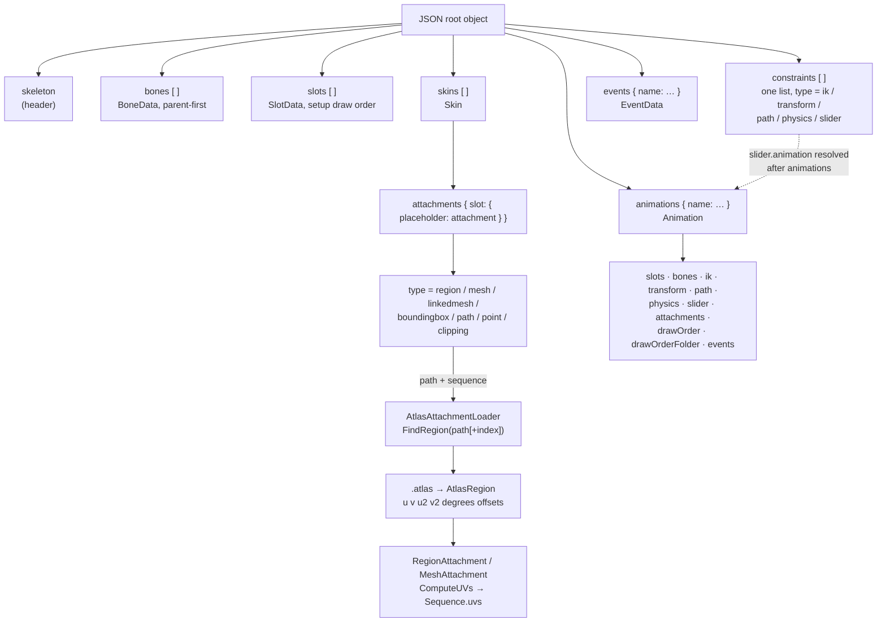
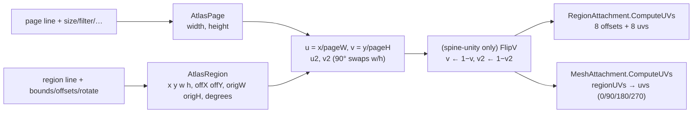

# Spine 4.3 JSON skeleton and `.atlas` text format: clean-room reader specification

This spec describes the Spine **4.3 JSON skeleton format** (`*.json`) and the **libGDX-style `.atlas` text format** as the reference reader interprets them. That reader is spine-csharp **4.3.40**, vendored in `Packages/com.esotericsoftware.spine.spine-csharp` at upstream `4.3` commit `7ce5d0da`. The upstream files are `SkeletonJson.cs`, `Json.cs`, `Atlas.cs`, `Animation.cs`, `Attachments/*.cs` and `*Data.cs`. It is written so that someone can build a new reader **from this document alone**. For each key it gives the JSON type, the default when the key is absent, whether the loader's `scale` multiplies it, and any behavior the reader derives from it. It also covers how Bezier curves are baked, how atlas regions become UVs, and where the JSON path differs from the binary (`.skel`) path. The spec contains no reference source. Tables, prose and pseudocode are written from scratch.

What BoneBurst requires of these files on top of this spec, where Spine's runtimes disagree with each other, and what the BoneBurst editor and runtime each do with every part: [BoneBurst-Profile.md](BoneBurst-Profile.md).



The second diagram shows the atlas-to-UV pipeline:



---

## Contents

1. [Conventions](#1-conventions)
2. [JSON lexical layer](#2-json-lexical-layer)
3. [Top-level object and read order](#3-top-level-object-and-read-order)
4. [`skeleton` header](#4-skeleton-header)
5. [`bones`](#5-bones)
6. [`slots`](#6-slots)
7. [`constraints`](#7-constraints)
8. [`skins` and attachments](#8-skins-and-attachments)
9. [Linked-mesh resolution](#9-linked-mesh-resolution)
10. [`events`](#10-events)
11. [`animations`](#11-animations)
12. [Curves and Bezier baking](#12-curves-and-bezier-baking)
13. [Slider animation pass](#13-slider-animation-pass)
14. [JSON vs binary differences](#14-json-vs-binary-differences)
15. [`.atlas` text format](#15-atlas-text-format)
16. [Atlas region → attachment UVs](#16-atlas-region--attachment-uvs)
17. [Sequences and region-name resolution](#17-sequences-and-region-name-resolution)
18. [Ambiguities / verified only by reading](#18-ambiguities--verified-only-by-reading)

---

## 1. Conventions

| Term | Meaning |
|---|---|
| `scale` | Loader property, default `1`, must be non-zero. The reader multiplies every **length-like** value by it. The "×scale" column below marks those values. |
| **req** | Required. If absent, the reference reader throws (usually a key-not-found error, which is wrapped). |
| float | A JSON number. Every JSON number is parsed as a **32-bit float** (§2). |
| int | A JSON number read as float and then **truncated toward zero**. |
| bool | JSON `true` / `false` literal only. A string or number throws. |
| string | JSON string. |
| hex8 | String `RRGGBBAA`, two hex digits per channel, case-insensitive. Each channel becomes `value / 255`. |
| hex6 | String `RRGGBB`. Alpha is not read and the colour's alpha is left at 1. |
| enum (ci) | String matched **case-insensitively** against the enum member names listed. The reference uses .NET `Enum.Parse(ignoreCase)`, which also accepts a decimal member index such as `"2"` (§18). |
| name lookup | Linear search by exact, case-sensitive name over the items read **so far**. |

Colour-string length rules. A string shorter than the expected length throws. A longer string is accepted and only the leading 6 or 8 characters are used.

---

## 2. JSON lexical layer

The reference parser is a small hand-written JSON decoder. What a new reader needs to reproduce:

| Aspect | Behavior |
|---|---|
| Numbers | Parsed to **float32** with invariant culture. A token starts with `0-9` or `-` and continues over `0-9 + - . e E`. A token that does not parse as a float becomes `0`. Integers therefore lose precision above 2^24. |
| Objects | Become an insertion-ordered map. **Iteration order is document order**, and the reader relies on it: timeline order, skin order, event order and animation order all follow the document. A duplicate key overwrites the value but keeps the position of the first occurrence. |
| Arrays | Ordered lists. |
| Strings | Standard escapes `\" \\ \/ \b \f \n \r \t \uXXXX`. `\u` yields one UTF-16 code unit, so surrogate pairs are not combined. |
| Literals | `true`, `false`, `null`. A `null` value is stored as a key that is *present* with a null value (§18). |
| Leniency | Commas are skipped wherever they appear, so missing or trailing commas are tolerated. A strict parser is fine for editor output. |

---

## 3. Top-level object and read order

The root must be a JSON object. Every section is optional. The reader processes sections in **this fixed order**, whatever order they appear in the file:

| # | Key | JSON type | Produces |
|---|---|---|---|
| 1 | `skeleton` | object | header fields (§4) |
| 2 | `bones` | array of objects | bone list. Index = array position. |
| 3 | `slots` | array of objects | slot list. Index = array position = setup draw order. |
| 4 | `constraints` | array of objects | **single** constraint list. Index = array position. |
| 5 | `skins` | array of objects | skin list. The skin named `default` becomes the default skin. |
| 6 | — | — | linked-mesh resolution (§9) |
| 7 | `events` | object (name → object) | event list, in document order |
| 8 | `animations` | object (name → object) | animation list, in document order |
| 9 | `constraints` (again) | — | slider `animation` references are resolved (§13) |

Name references resolve only against items that are already read. For example, a bone's `parent` must appear **earlier** in `bones`, and a slot's `bone` must exist among the bones.

Errors are wrapped as "Error reading JSON skeleton data, version: X" when the header has been read. The reader does **not** check the version string.

---

## 4. `skeleton` header

| Key | Type | Default | ×scale | Notes |
|---|---|---|---|---|
| `hash` | string | **req** (if `skeleton` is present) | – | Stored verbatim. |
| `spine` | string | **req** (if `skeleton` is present) | – | Editor version, e.g. `"4.3.xx"`. Not validated. |
| `x` | float | 0 | **no** | AABB of the setup pose. |
| `y` | float | 0 | **no** | |
| `width` | float | 0 | **no** | |
| `height` | float | 0 | **no** | |
| `referenceScale` | float | 100 | **yes** | Stored as `referenceScale × scale`. Physics uses it. |
| `fps` | float | 30 | – | Nonessential. Dopesheet FPS. |
| `images` | string | null | – | Nonessential. Images path. |
| `audio` | string | null | – | Nonessential. Audio path. |

If `skeleton` is absent, every field keeps its type default: hash and version null, numbers 0, `referenceScale` 100 (not multiplied by scale), fps 0 and paths null.

---

## 5. `bones`

Array of objects. Bones must be ordered parent-before-child.

| Key | Type | Default | ×scale | Notes |
|---|---|---|---|---|
| `name` | string | **req** | – | |
| `parent` | string | none (root) | – | Must name an earlier bone, or the reader throws "Parent bone not found". |
| `length` | float | 0 | **yes** | |
| `x`, `y` | float | 0 | **yes** | Setup local translation. |
| `rotation` | float | 0 | no | Degrees. |
| `scaleX`, `scaleY` | float | 1 | no | |
| `shearX`, `shearY` | float | 0 | no | Degrees. |
| `inherit` | enum (ci) | `normal` | – | `normal`, `onlyTranslation`, `noRotationOrReflection`, `noScale`, `noScaleOrReflection` (member indices 0–4). |
| `skin` | bool | false | – | "Skin required": the bone is active only when the current skin lists it. |
| `color`, `icon`, `visible`, … | – | – | – | **Ignored** by the JSON reader (nonessential). |

---

## 6. `slots`

Array of objects. Array order is the setup draw order and gives each slot's index.

| Key | Type | Default | Notes |
|---|---|---|---|
| `name` | string | **req** | |
| `bone` | string | **req** | Must exist, or the reader throws "Slot bone not found". |
| `color` | hex8 | white `FFFFFFFF` | Setup tint (light colour). |
| `dark` | hex6 | *absent* | If present, the slot uses two-colour tinting and this is the dark colour (alpha unused). If absent, the dark colour is **null** (no tint black). |
| `attachment` | string | null | Setup attachment placeholder name. |
| `blend` | enum (ci) | `normal` | `normal`, `additive`, `multiply`, `screen`. |
| `visible` | – | – | **Ignored**. |

---

## 7. `constraints`

### 7.1 Listing and ordering

In 4.3 **all five constraint kinds share one array**, `constraints`. Each element has a `type` discriminator. There are no separate top-level `ik`, `transform`, `path` or `physics` arrays. The **array position is the constraint index**. Animation timelines refer to constraints by that index (§11), and the runtime's update order is derived from this list.

Common keys:

| Key | Type | Default | Notes |
|---|---|---|---|
| `name` | string | **req** | |
| `type` | string | **req** | `ik`, `transform`, `path`, `physics`, `slider`. Exact, case-sensitive match. **An unknown type is silently skipped**: it gets no index, so later indices shift down (§18). |
| `skin` | bool | false | Skin required. |

Name lookup for constraints (`FindConstraint<T>`) matches the name **and** the kind, so different kinds may share a name.

### 7.2 `type: "ik"`

| Key | Type | Default | ×scale | Notes |
|---|---|---|---|---|
| `bones` | string[] | empty | – | Constrained bones, in order. Each must exist. |
| `target` | string | **req** | – | Target bone. |
| `scaleY` | enum (ci) | `none` | – | `none`, `uniform`, `volume`. How scaleY follows a stretch. |
| `mix` | float | 1 | no | |
| `softness` | float | 0 | **yes** | |
| `bendPositive` | bool | true | – | Stored as bendDirection `+1` (true) or `-1` (false). |
| `compress` | bool | false | – | |
| `stretch` | bool | false | – | |

### 7.3 `type: "transform"` (4.3 property-mapping model)

| Key | Type | Default | ×scale | Notes |
|---|---|---|---|---|
| `bones` | string[] | empty | – | Constrained bones. |
| `source` | string | **req** | – | Source bone. Earlier versions called this `target`. |
| `localSource` | bool | false | – | |
| `localTarget` | bool | false | – | |
| `additive` | bool | false | – | |
| `clamp` | bool | false | – | |
| `properties` | object | empty | – | from→to mapping, see below. |
| `rotation` | float | 0 | no | Offset slot ROTATION (index 0). |
| `x` | float | 0 | **yes** | Offset slot X (1). |
| `y` | float | 0 | **yes** | Offset slot Y (2). |
| `scaleX` | float | 0 | no | Offset slot SCALEX (3). |
| `scaleY` | float | 0 | no | Offset slot SCALEY (4). |
| `shearY` | float | 0 | no | Offset slot SHEARY (5). |
| `mixRotate` | float | see below | no | |
| `mixX` | float | see below | no | |
| `mixY` | float | see below | no | |
| `mixScaleX` | float | see below | no | |
| `mixScaleY` | float | see below | no | |
| `mixShearY` | float | see below | no | |

**`properties` structure.** An object whose keys are *from* property names and whose values are *from* objects:

```
"properties": {
  "<from>": {                  // from ∈ rotate | x | y | scaleX | scaleY | shearY  (exact case)
    "offset": float,           // default 0, × fromScale
    "to": {
      "<to>": {                // to ∈ rotate | x | y | scaleX | scaleY | shearY  (exact case)
        "offset": float,       // default 0, × toScale
        "max":    float,       // default 1, × toScale
        "scale":  float        // default 1, × (toScale / fromScale)
      }, …
    }
  }, …
}
```

* `fromScale` is `scale` when *from* is `x` or `y`, else 1. `toScale` is `scale` when *to* is `x` or `y`, else 1.
* Any other from or to name throws.
* The *from* entries go into the constraint's property list **in document order**. Each entry's *to* list is also in document order. **A *from* entry with no `to` entries (missing or empty) is dropped.**
* While the reader walks the `to` entries it records which *to* kinds appear anywhere: rotate, x, y, scaleX, scaleY, shearY.

**Mix defaults depend on which *to* kinds occur.** A mix is only read if its kind occurs. Otherwise it stays at **0**, whatever the JSON contains:

| Mix | Read only if a *to* of this kind exists | Default when read |
|---|---|---|
| `mixRotate` | rotate | 1 |
| `mixX` | x | 1 |
| `mixY` | y | **current mixX**. That is 0 if no x target exists. |
| `mixScaleX` | scaleX | 1 |
| `mixScaleY` | scaleY | **current mixScaleX**. That is 0 if no scaleX target exists. |
| `mixShearY` | shearY | 1 |

### 7.4 `type: "path"`

| Key | Type | Default | ×scale | Notes |
|---|---|---|---|---|
| `bones` | string[] | empty | – | |
| `slot` | string | **req** | – | The slot that holds the path attachment. |
| `positionMode` | enum (ci) | `percent` | – | `fixed`, `percent`. |
| `spacingMode` | enum (ci) | `length` | – | `length`, `fixed`, `percent`, `proportional`. |
| `rotateMode` | enum (ci) | `tangent` | – | `tangent`, `chain`, `chainScale`. |
| `rotation` | float | 0 | no | Offset rotation. |
| `position` | float | 0 | **if positionMode = fixed** | |
| `spacing` | float | 0 | **if spacingMode = length or fixed** | |
| `mixRotate` | float | 1 | no | |
| `mixX` | float | 1 | no | |
| `mixY` | float | = mixX | no | |

### 7.5 `type: "physics"`

| Key | Type | Default | ×scale | Notes |
|---|---|---|---|---|
| `bone` | string | **req** | – | |
| `x` | float | 0 | no | How much bone x feeds the simulation. |
| `y` | float | 0 | no | |
| `rotate` | float | 0 | no | |
| `scaleX` | float | 0 | no | |
| `scaleY` | enum (ci) | `none` | – | `none`, `uniform`, `volume`. This is a **mode**, not a number. |
| `shearX` | float | 0 | no | |
| `limit` | float | 5000 | **yes** | Velocity limit. |
| `fps` | int | 60 | – | Stored as `step = 1 / fps`. |
| `inertia` | float | 0.5 | no | |
| `strength` | float | 100 | no | |
| `damping` | float | 0.85 | no | |
| `mass` | float | 1 | no | Stored as **massInverse = 1 / mass**. |
| `wind` | float | 0 | no | |
| `gravity` | float | 0 | no | |
| `mix` | float | 1 | no | |
| `inertiaGlobal` | bool | false | – | When true, an animation's global physics timeline (§11.6, key `""`) drives this constraint's value. |
| `strengthGlobal` | bool | false | – | Same, for strength. |
| `dampingGlobal` | bool | false | – | Same, for damping. |
| `massGlobal` | bool | false | – | Same, for mass. |
| `windGlobal` | bool | false | – | Same, for wind. |
| `gravityGlobal` | bool | false | – | Same, for gravity. |
| `mixGlobal` | bool | false | – | Same, for mix. |

### 7.6 `type: "slider"`

| Key | Type | Default | ×scale | Notes |
|---|---|---|---|---|
| `additive` | bool | false | – | |
| `loop` | bool | false | – | |
| `mix` | float | 1 | no | Setup mix. |
| `animation` | string | **req** | – | Resolved **after** all animations are read (§13). |
| `bone` | string | absent | – | If present, the slider is **bone-driven** and the next five rows apply. |
| `property` | string | **req if `bone`** | – | from-property name: `rotate`, `x`, `y`, `scaleX`, `scaleY`, `shearY`. |
| `from` | float | 0 | × propertyScale | Stored as the property's offset. |
| `to` | float | 0 | no | Stored as slider `offset`. |
| `scale` | float | 1 | **÷** propertyScale | Stored as slider `scale`. |
| `local` | bool | false | – | |
| `time` | float | 0 | no | Setup time. Read **only when `bone` is absent**. |
| `max` | – | – | – | Ignored (nonessential). |

`propertyScale` is `scale` for `x` or `y`, else 1.

---

## 8. `skins` and attachments

### 8.1 Skin object

`skins` is an **array**. Each element:

| Key | Type | Default | Notes |
|---|---|---|---|
| `name` | string | **req** | A skin named exactly `default` becomes the default skin. If several have that name, the last one wins. |
| `bones` | string[] | empty | Bones this skin activates. |
| `ik` | string[] | empty | IK constraint names this skin activates. |
| `transform` | string[] | empty | Transform constraint names. |
| `path` | string[] | empty | Path constraint names. |
| `physics` | string[] | empty | Physics constraint names. |
| `slider` | string[] | empty | Slider names. |
| `attachments` | object | empty | `{ slotName: { placeholderName: attachmentObject } }` |
| `color` | – | – | Ignored. |

The skin's constraint list is built by concatenating the lists in the fixed order **ik, transform, path, physics, slider**, not in document order. Each name is looked up among constraints of that kind.

In `attachments`, each slot key must be an existing slot. Each placeholder key is the name the attachment is stored under in the skin, the key used by `(slotIndex, placeholder)`. If the same key appears twice, the last write wins. If an attachment reads as null (a loader returned null, or the type is `sequence`), it is not stored.

### 8.2 Common attachment keys

| Key | Type | Default | Notes |
|---|---|---|---|
| `type` | enum (ci) | `region` | `region`, `boundingbox`, `mesh`, `linkedmesh`, `path`, `point`, `clipping`. `sequence` parses but yields **no attachment**. Anything else throws. |
| `name` | string | the placeholder key | Attachment name. |

### 8.3 `region`

| Key | Type | Default | ×scale | Notes |
|---|---|---|---|---|
| `path` | string | = `name` | – | Atlas lookup base path. |
| `sequence` | object | absent | – | See §17. |
| `x`, `y` | float | 0 | **yes** | Offset from the bone. |
| `scaleX`, `scaleY` | float | 1 | no | |
| `rotation` | float | 0 | no | Degrees. |
| `width` | float | **req** | **yes** | |
| `height` | float | **req** | **yes** | |
| `color` | hex8 | white | – | |

After reading, the reader computes the region offsets and UVs for every region of the sequence (§16.2).

### 8.4 `mesh` (and `linkedmesh`)

`mesh` and `linkedmesh` are read by **one code path**. The presence of `source` decides whether the attachment is linked. The `type` value does not.

| Key | Type | Default | ×scale | Notes |
|---|---|---|---|---|
| `path` | string | = `name` | – | |
| `sequence` | object | absent | – | §17 |
| `color` | hex8 | white | – | |
| `width`, `height` | float | 0 | **yes** | Nonessential. For a linked mesh these are **overwritten** by the source's values during resolution. |
| `source` | string | absent | – | **If present: linked mesh.** Placeholder name of the source mesh. Earlier versions called it `parent`. |
| `slot` | string | this attachment's slot | – | Linked only: the slot the source mesh lives in. |
| `skin` | string | null → default skin | – | Linked only: the skin that holds the source. |
| `timelines` | bool | true | – | Linked only: whether the mesh inherits the source's deform and sequence timelines. |
| `uvs` | float[] | **req** (non-linked) | no | `2 × vertexCount` values, u and v in 0..1 over the untrimmed image. |
| `vertices` | float[] | **req** (non-linked) | see §8.9 | Weighted or unweighted. |
| `triangles` | int[] | **req** (non-linked) | – | Vertex indices, three per triangle. |
| `hull` | int | absent → 0 | – | Hull vertex count. Stored as `hullLength = hull × 2`. |
| `edges` | int[] | absent → null | – | Nonessential. |

For a linked mesh, the reader stops after the `source`, `slot`, `skin` and `timelines` keys. `uvs`, `vertices`, `triangles`, `hull` and `edges` are **not read**, and UVs are computed later (§9).

For a non-linked mesh, the reader reads `uvs` first, then `vertices` using `uvs.length` as the expected unweighted length, then `triangles`, `hull` and `edges`. It then computes UVs (§16.3).

### 8.5 `boundingbox`

| Key | Type | Default | Notes |
|---|---|---|---|
| `vertexCount` | int | 0 | The expected unweighted length is `vertexCount × 2`. |
| `vertices` | float[] | **req** | §8.9 |
| `color` | – | – | Ignored. |

### 8.6 `path`

| Key | Type | Default | ×scale | Notes |
|---|---|---|---|---|
| `closed` | bool | false | – | |
| `constantSpeed` | bool | true | – | |
| `vertexCount` | int | 0 | – | The expected unweighted length is `vertexCount × 2`. |
| `vertices` | float[] | **req** | §8.9 | |
| `lengths` | float[] | **req** | **yes** | Cumulative curve lengths. |
| `color` | – | – | – | Ignored. |

### 8.7 `point`

| Key | Type | Default | ×scale |
|---|---|---|---|
| `x`, `y` | float | 0 | **yes** |
| `rotation` | float | 0 | no |
| `color` | – | ignored | – |

### 8.8 `clipping`

| Key | Type | Default | Notes |
|---|---|---|---|
| `end` | string | absent → no end slot | Slot name. Must exist if given. |
| `convex` | bool | false | |
| `inverse` | bool | false | |
| `vertexCount` | int | 0 | The expected unweighted length is `vertexCount × 2`. |
| `vertices` | float[] | **req** | §8.9 |
| `color` | – | – | Ignored. |

### 8.9 Vertex arrays: weighted vs unweighted detection

Inputs: the `vertices` float array `V` and the **expected unweighted length** `L`:

* mesh: `L = uvs.length`
* boundingbox, clipping, path: `L = vertexCount × 2`

The attachment's `worldVerticesLength` is always set to `L`.

**Rule: `V` is unweighted if and only if `V.length == L`. Otherwise it is weighted.**

```
if len(V) == L:
    bones    = null
    vertices = [v * scale for v in V]              # x,y pairs, bone-local
else:
    bones = [], weights = []
    i = 0
    while i < len(V):
        n = int(V[i]); i += 1                      # influence count for this vertex
        bones.append(n)
        repeat n times:
            bones.append(int(V[i]))                # bone index
            weights.append(V[i+1] * scale)         # x in that bone's space
            weights.append(V[i+2] * scale)         # y
            weights.append(V[i+3])                 # weight (NOT scaled)
            i += 4
    vertices = weights                             # flat (x, y, w) triples
```

`bones` is the flat run-length array `[n, b1, b2, …, n, …]`. A weighted array can never be exactly `L` long, since each vertex needs at least 5 values against the unweighted 2. The one exception is a zero-vertex attachment. Bounding boxes, clippings and paths with `vertexCount` absent get `L = 0`, so any non-empty `vertices` is parsed as **weighted** (§18).

---

## 9. Linked-mesh resolution

Every mesh with a `source` key is queued with the values `(mesh, skinName|null, ownSlotIndex, sourceSlotIndex, sourceName, inheritTimelines)`. After **all** skins are read, the queue is processed **in the order the meshes were read**:

1. `skin` = the default skin if `skinName` is null, otherwise the skin with that name. If none is found, the reader throws. The reference message says "Slot not found", which is misleading.
2. `source` = that skin's attachment at `(sourceSlotIndex, sourceName)`. If there is none, the reader throws "Source mesh not found".
3. The mesh's `timelineAttachment` becomes `source` if `inheritTimelines` is set, else the mesh itself. Deform and sequence timelines keyed to `source` then also drive this mesh.
4. **Adopt the source geometry by reference**: `bones`, `vertices`, `worldVerticesLength`, `regionUVs`, `triangles`, `hullLength`, `edges`, `width`, `height`. The linked mesh's own `width` and `height` are overwritten.
5. The mesh's UVs are recomputed from **its own** sequence regions (its own `path` and `sequence`) and the adopted `regionUVs` (§16.3).
6. If `inheritTimelines` is set and `ownSlotIndex ≠ sourceSlotIndex`, `ownSlotIndex` is appended to `source.timelineSlots` unless it is already there. This array lists extra slots where a timeline for `source` also applies.

Non-linked meshes read from JSON have an **empty** `timelineSlots` (§14).

---

## 10. `events`

`events` is an **object**: event name → event object. The event list follows document order.

| Key | Type | Default | Notes |
|---|---|---|---|
| `int` | int | 0 | |
| `float` | float | 0 | |
| `string` | string | `""` (empty) | |
| `audio` | string | null | Audio path. |
| `volume` | float | 1 | Read **only if `audio` is present**. Otherwise it stays 0. |
| `balance` | float | 0 | Read only if `audio` is present. |

---

## 11. `animations`

`animations` is an object: animation name → animation object. The animation list follows document order.

### 11.1 Timeline creation order

Inside one animation, the reader creates timelines in **this category order**. Within a category the order is the JSON document order of the map keys:

| # | Animation key | Shape |
|---|---|---|
| 1 | `slots` | `{ slotName: { timelineName: [keys] } }` |
| 2 | `bones` | `{ boneName: { timelineName: [keys] } }` |
| 3 | `ik` | `{ ikName: [keys] }` (**directly an array**) |
| 4 | `transform` | `{ transformName: [keys] }` (**directly an array**) |
| 5 | `path` | `{ pathName: { position/spacing/mix: [keys] } }` |
| 6 | `physics` | `{ physicsName or "": { timelineName: [keys] } }` |
| 7 | `slider` | `{ sliderName: { time/mix: [keys] } }` |
| 8 | `attachments` | `{ skinName: { slotName: { attachmentName: { deform/sequence: [keys] } } } }` |
| 9 | `drawOrder` | `[keys]` → one timeline |
| 10 | `drawOrderFolder` | `[ { slots, keys } ]` → one timeline per element |
| 11 | `events` | `[keys]` → one timeline |

Timelines refer to slots, bones and constraints **by index**. The constraint index is the position in the unified `constraints` list (§7.1).

Other animation-level results:

* **Bone list.** The animation records the index of every bone named under `bones`, **including bones whose timelines are all empty**, in document order.
* **Duration.** Each timeline's duration is its **last** key's time, not the maximum over its keys. The animation's duration is the maximum of those over all timelines, or 0 if there are none.
* **Empty key arrays are skipped** and create no timeline.
* **Unknown timeline names** under `slots`, `bones`, `path`, `physics`, `slider` and `attachments` are silently ignored.
* **Unknown names under the keys referencing objects throw**: a slot, bone, constraint, skin slot or attachment that cannot be resolved throws.

Every key object has a `time` float, default 0 and **never scaled**. Keys are expected to be in ascending time order. The reader neither sorts nor validates them.

### 11.2 Curve-driven timelines: the generic loop

All curve timelines share this loop. The `curve` stored on **key i** shapes the segment from key i to key i+1. A curve on the last key is ignored.

```
k = keys[0]; t = time(k); vals = values(k)
for frame = 0 ..:
    setFrame(frame, t, vals)
    if no next key: break
    n = next key; t2 = time(n); vals2 = values(n)
    if k has "curve":
        for channel c in 0..C-1:
            applyCurve(k.curve, frame, c, t, t2, vals[c], vals2[c], channelScale[c])
    k, t, vals = n, t2, vals2
```

`values(k)` applies each channel's default and scale. Details of `curve` are in §12.

### 11.3 `slots` timelines

| Timeline name | Per-key keys (default) | Channels, in curve order | Scale | Notes |
|---|---|---|---|---|
| `attachment` | `time` (0), `name` (null) | – | – | No curves. A null name clears the attachment. |
| `rgba` | `time`, `color` **req** hex8 | r, g, b, a | 1 | The reader uses the first 8 characters. |
| `rgb` | `time`, `color` **req** hex6 | r, g, b | 1 | |
| `alpha` | `time`, `value` (**0**) | value | 1 | The default is **0**, not 1. |
| `rgba2` | `time`, `light` **req** hex8, `dark` **req** hex6 | r, g, b, a, r2, g2, b2 | 1 | |
| `rgb2` | `time`, `light` **req** hex6, `dark` **req** hex6 | r, g, b, r2, g2, b2 | 1 | |

Colour channel values and colour **curve `cy` values are in normalized 0..1**, not 0..255.

### 11.4 `bones` timelines

Timeline names are **lower-case** exactly as shown:

| Timeline name | Per-key value keys (default) | Channels | Scale |
|---|---|---|---|
| `rotate` | `value` (0) | value | 1 |
| `translate` | `x` (0), `y` (0) | x, y | **scale** |
| `translatex` | `value` (0) | value | **scale** |
| `translatey` | `value` (0) | value | **scale** |
| `scale` | `x` (1), `y` (1) | x, y | 1 |
| `scalex` | `value` (1) | value | 1 |
| `scaley` | `value` (1) | value | 1 |
| `shear` | `x` (0), `y` (0) | x, y | 1 |
| `shearx` | `value` (0) | value | 1 |
| `sheary` | `value` (0) | value | 1 |
| `inherit` | `inherit` enum (ci), default `normal` | – | – |

Timeline values are stored multiplied by the scale, and so are the curve `cy` values.

### 11.5 `ik` timelines

`ik: { name: [keys] }`. The timeline targets the IK constraint's index.

| Key | Default | ×scale | Channel |
|---|---|---|---|
| `time` | 0 | – | |
| `mix` | 1 | no | channel 0 |
| `softness` | 0 | **yes** (the curve `cy` too) | channel 1 |
| `bendPositive` | true → +1, false → -1 | – | not curved |
| `compress` | false | – | not curved |
| `stretch` | false | – | not curved |

### 11.6 `transform` timelines

`transform: { name: [keys] }`.

| Key | Default | Channel |
|---|---|---|
| `mixRotate` | 1 | 0 |
| `mixX` | 1 | 1 |
| `mixY` | = **this key's** mixX | 2 |
| `mixScaleX` | 1 | 3 |
| `mixScaleY` | **1**. Unlike the setup pose, this does *not* default to mixScaleX. | 4 |
| `mixShearY` | 1 | 5 |

None of these are scaled.

### 11.7 `path` timelines

`path: { name: { … } }`.

| Timeline name | Keys (default) | Scale |
|---|---|---|
| `position` | `value` (0) | scale **if** the constraint's positionMode is fixed |
| `spacing` | `value` (0) | scale **if** the constraint's spacingMode is length or fixed |
| `mix` | `mixRotate` (1), `mixX` (1), `mixY` (= this key's mixX). Channels in that order. | 1 |

### 11.8 `physics` timelines

`physics: { name: { … } }`. **An empty-string name `""` means "all physics constraints"**, with constraint index -1. At runtime such a timeline affects each physics constraint whose matching `*Global` flag is set.

| Timeline name | `value` default | Notes |
|---|---|---|
| `reset` | – | Keys carry only `time`. No curves. |
| `inertia` | 0 | |
| `strength` | 0 | |
| `damping` | 0 | |
| `mass` | 0 | The raw value. The reader does **not** invert it. |
| `wind` | 0 | |
| `gravity` | 0 | |
| `mix` | **1** | |

None of these are scaled.

### 11.9 `slider` timelines

`slider: { name: { … } }`.

| Timeline name | `value` default |
|---|---|
| `time` | **1** |
| `mix` | 1 |

Neither is scaled.

### 11.10 `attachments` timelines (deform and sequence)

The skin key is looked up by name, and **the skin must exist**. The reference crashes with a null dereference when it does not. The slot must exist. The attachment is found by the **placeholder key** in that skin and that slot, and the reader throws "Timeline attachment not found" if it is missing.

**`deform`.** The attachment must be a vertex attachment (mesh, linked mesh, bounding box, clipping or path). Let `weighted = (attachment.bones != null)` and `setup = attachment.vertices`. The deform array length is:

* weighted: `D = (len(setup) / 3) × 2`, one x,y offset per bone influence
* unweighted: `D = len(setup)`

| Key | Default | Notes |
|---|---|---|
| `time` | 0 | |
| `offset` | 0 | Start index into the deform array. |
| `vertices` | absent | Floats written from `offset`. Each is **× scale**. |
| `curve` | – | **One channel**. Values run 0 → 1 (a percentage), see §12.3. |

Per key:

```
if "vertices" absent:
    deform = zeros(D) if weighted else setup          # unweighted: the setup array itself (shared)
else:
    deform = zeros(D)
    deform[offset : offset+len(vertices)] = vertices * scale
    if not weighted: deform[j] += setup[j] for all j in 0..D-1
```

An unweighted deform stores **absolute** vertex positions. A weighted one stores offsets.

**`sequence`.** The attachment must be a region or a mesh, meaning it has a sequence. There are no curves.

| Key | Default | Notes |
|---|---|---|
| `time` | 0 | |
| `mode` | `hold` | enum (ci): `hold`, `once`, `loop`, `pingpong`, `onceReverse`, `loopReverse`, `pingpongReverse` (indices 0–6). |
| `index` | 0 | Starting region index. |
| `delay` | **the previous key's delay** (0 for the first key) | Seconds per frame. |

The runtime stores mode and index packed as `mode | (index << 4)`.

### 11.11 `drawOrder`

The value is an array of keys, which produces **one** timeline:

| Key | Default | Notes |
|---|---|---|
| `time` | 0 | |
| `offsets` | absent → this key restores the **setup draw order** (null order) | Array of `{ slot: name (req), offset: int (req) }`. |

Building the order array for `N` slots, where for a folder `N` is the folder's slot count and positions are folder positions:

```
order = [-1] * N
unchanged = []                        # capacity N - len(offsets)
orig = 0
for each {slot, offset} in offsets (must be ascending by slot position):
    pos = position of slot           # slot index, or its index within the folder's slot list
    while orig != pos: unchanged.append(orig); orig += 1
    order[orig + offset] = orig; orig += 1
while orig < N: unchanged.append(orig); orig += 1
for i from N-1 down to 0:
    if order[i] == -1: order[i] = unchanged.pop_last()
```

`order[i]` is the index, a slot index or a folder position, of the slot drawn at position `i`.

### 11.12 `drawOrderFolder` (new in 4.3)

The value is an array. Each element produces **one** timeline that reorders only a subset of slots:

| Key | Type | Notes |
|---|---|---|
| `slots` | string[] **req** | Folder slots **in setup order**. Their positions `0..n-1` are the folder positions. |
| `keys` | array **req** | Same key format as `drawOrder`. `offsets[].slot` must be one of the folder's slots (else "Slot not in folder"). The resulting order holds **folder positions**, not skeleton slot indices. |

### 11.13 `events`

The value is an array of keys, which produces **one** timeline:

| Key | Default | Notes |
|---|---|---|
| `time` | 0 | |
| `name` | **req** | Must name an event in `events`. |
| `int` | the event's setup int | |
| `float` | the event's setup float | |
| `string` | the event's setup string | |
| `volume` | setup volume | Read only if the event has an audio path. |
| `balance` | setup balance | Read only if the event has an audio path. |

---

## 12. Curves and Bezier baking

### 12.1 `curve` encoding

The `curve` key sits on a key object and shapes the segment from that key to the next key.

| Form | Meaning |
|---|---|
| absent | **Linear** interpolation. |
| `"stepped"` | **Stepped**, holding this key's values until the next key. It applies to all channels. |
| any other string | Ignored, so the segment stays **linear**. |
| number array | **Bezier**, with **4 numbers per channel**: `[cx1, cy1, cx2, cy2]` for channel 0, then channel 1, and so on. The array length is `4 × C`. |

In the bezier array, `cx1` and `cx2` are **absolute times in seconds**, never scaled. `cy1` and `cy2` are **absolute values** in the channel's JSON units, and the reader multiplies them by the channel's scale, the same scale the key values get. The two end points are implied: `(time_i, value_i)` and `(time_{i+1}, value_{i+1})`.

Channel order and count per timeline:

| Timeline | C | Channel order |
|---|---|---|
| rotate, translatex/y, scalex/y, shearx/y, alpha, path position/spacing, physics *, slider time/mix | 1 | value |
| translate, scale, shear | 2 | x, y |
| rgba | 4 | r, g, b, a |
| rgb | 3 | r, g, b |
| rgba2 | 7 | r, g, b, a, r2, g2, b2 |
| rgb2 | 6 | r, g, b, r2, g2, b2 |
| ik | 2 | mix, softness |
| transform | 6 | mixRotate, mixX, mixY, mixScaleX, mixScaleY, mixShearY |
| path mix | 3 | mixRotate, mixX, mixY |
| deform | 1 | percentage 0 → 1 |

### 12.2 Storage model (what gets baked)

A curve timeline with `F` frames keeps a `curves` float array:

* `curves[0..F-1]` holds each frame's **curve type**: `0 = LINEAR`, `1 = STEPPED`, or `2 + i`, where `i` is the start index of that frame's first Bezier block.
* Each Bezier block holds **18 floats**: 9 sample points `(x, y)`.
* Blocks are appended in the order they are created, and one block exists per (frame, channel) with a Bezier. Channel `c` of a frame whose type is `2 + i` lives at `i + 18·c`. A frame's channels are therefore contiguous, because the reader writes them one after another.
* On construction, **the last frame's type is set to STEPPED**, so sampling at or after the last key returns the last key's values. All other frames start LINEAR.
* `"stepped"` sets the frame's type to STEPPED.

### 12.3 Baking a segment (9 samples, forward differencing)

For one channel on one segment, with end points `(x0, y0) = (time1, value1)`, `(x3, y3) = (time2, value2)` and handles `(cx1, cy1)`, `(cx2, cy2)` (the `cy` values already scaled):

```
# constants for step h = 0.1
tmpx = (x0 - 2*cx1 + cx2) * 0.03          tmpy = (y0 - 2*cy1 + cy2) * 0.03
dddx = ((cx1 - cx2)*3 - x0 + x3) * 0.006  dddy = ((cy1 - cy2)*3 - y0 + y3) * 0.006
ddx  = 2*tmpx + dddx                      ddy  = 2*tmpy + dddy
dx   = (cx1 - x0)*0.3 + tmpx + dddx/6     dy   = (cy1 - y0)*0.3 + tmpy + dddy/6
x = x0 + dx ; y = y0 + dy
for s in 0..8:
    sample[s] = (x, y)
    dx += ddx ; dy += ddy
    ddx += dddx ; ddy += dddy
    x += dx ; y += dy
```

This is forward differencing of the cubic Bezier `B(t)` for `P0 = (x0, y0)`, `P1 = (cx1, cy1)`, `P2 = (cx2, cy2)`, `P3 = (x3, y3)`. The 9 samples are `B(0.1), B(0.2), …, B(0.9)`, computed in **32-bit float**. A reader that evaluates `B(t)` directly gets the same values up to float rounding. The constants are `3h² = 0.03`, `6h³ = 0.006`, `3h = 0.3`, and `1/6` is written as `0.16666667`.

**Deform** bakes a 0 → 1 percentage curve (`y0 = 0`, `y3 = 1`), and the JSON reader uses the **simplified deform variant** of the y terms given in `Format-Binary.md` §8.2.3, not the general form above. The two are equal in value but differ in the last bit. *Corrected 2026-09-29: this page first said "the same bake"; the parity tests (`Tests/Editor/Parity`) showed last-bit differences in 7 sample files until the reader used the deform variant.*

### 12.4 Sampling (for completeness)

For a frame of type `2 + i` evaluated at time `t`, where the frame's key is `(fx, fy)` and the next key is `(nx, ny)`, channel `c` has block `b = i + 18c`:

```
if sample[b].x > t:                         # strictly greater, before the first sample
    return lerp from (fx, fy) to sample[b]
for s in 1..8:
    if sample[b+s].x >= t:                  # greater or equal
        return lerp from sample[b+s-1] to sample[b+s]
return lerp from sample[b+8] to (nx, ny)    # after the last sample
```

`lerp from (ax, ay) to (bx, by)` at `t` is `ay + (t - ax) / (bx - ax) × (by - ay)`. For deform, `fy = 0` and `ny = 1`.

LINEAR is a plain lerp between the two keys. STEPPED returns the frame's value. The frame for a time is the last frame whose time is `<= t`. The reference finds it with a linear search.

---

## 13. Slider animation pass

After all animations are read, the reader walks the `constraints` array again. For every element with `type == "slider"`, it looks up the slider by `name` and sets its animation to the animation named by `animation`. **The key is required, and the animation must exist.**

---

## 14. JSON vs binary differences

These are observable differences between the JSON reader and the binary reader in the same runtime.

| Area | JSON | Binary |
|---|---|---|
| `hash` | a string, kept as is | an int64. A value of 0 becomes null, anything else its decimal string. |
| Version check | none | returns null for pre-4.0 data |
| fps / images / audio | always read. fps defaults to 30. | only when the nonessential flag is set. Otherwise fps is 0 and the paths are null. |
| Skin order | array order. The default skin is whichever skin is named `default`. | the default skin comes first (unnamed in the stream), then the named skins |
| Mesh `timelineSlots` | never read. Only filled by linked-mesh resolution (§9). | stored explicitly per mesh |
| Mesh width, height, edges | always read (default 0 or null) | only when nonessential |
| Linked mesh source skin | skin **name**, null means default | skin **index** |
| Physics `scaleY` mode | a separate string key `scaleY` | packed into the sign of `scaleX`: `< -2` is volume, `< 0` is uniform |
| Physics `fps` | int, default 60 | an unsigned byte |
| Event key values | missing keys fall back to the EventData setup values | int and float are always present. A null string falls back to setup. |
| Sequence-key `delay` | a missing delay carries over the previous key's delay | always present |
| Transform-timeline `mixScaleY` default | 1 | n/a (always present) |
| Bezier storage | over-allocated, then shrunk. No observable difference. | exact counts |
| Timeline category order | slots, bones, ik, transform, path, physics, slider, attachments, drawOrder, drawOrderFolder, events | the same order |
| Scale application | the same fields are scaled in both. `referenceScale` × scale in both. | — |

---

## 15. `.atlas` text format

### 15.1 Line model

The reader processes the file line by line. The terms below describe how it classifies lines.

* **Blank line**: a line that is empty after trimming whitespace.
* **Entry line**: a trimmed line that contains `:`. The **key** is the text before the first `:`, trimmed. The **values** are the text after it, split on `,`, each trimmed. **At most 4 values** are kept: if a 4th comma exists, the 4th value ends there and the rest of the line is discarded. The value count is 1–4.
* Any other non-blank line is a **name line**.

### 15.2 Grammar

```
atlas      := blank* header? page ( blank+ page )* blank*
header     := entryLine*                          ; ignored entirely
page       := pageName entryLine* region*
pageName   := nameLine                            ; trimmed → page.name (texture file name)
region     := regionName entryLine*
regionName := nameLine                            ; NOT trimmed → region.name
```

The exact state machine:

1. Skip leading blank lines.
2. **Header.** While the current line is a non-blank entry line, ignore it and read the next line. Stop at a blank line, EOF or a name line.
3. **Main loop**, with `page = none`:
   * EOF: stop.
   * Blank line: `page = none`, next line.
   * `page == none`: the line is a **page name**. Read the following entry lines as page fields until a line that is not an entry line (blank, name or EOF). Load the texture, add the page, and continue the loop **with that terminating line**.
   * Otherwise the line is a **region name** in the current page. Read the following entry lines as region fields until a non-entry line. Finish the region and continue with that terminating line.

Consequences:

* **Pages are separated by one or more blank lines.** A blank line *inside* a page's region list ends the page, and the next name line is then read as a **new page name**.
* Region names cannot contain `:`, because they would be read as a field of the previous page or region.
* Region names keep any leading or trailing whitespace. Page names are trimmed.
* The texture loader is called for a page **as soon as its fields are read**, before its regions are parsed. A loader may fill in `width` and `height` at that point (§15.3).

### 15.3 Page fields

| Key | Values | Effect | Default |
|---|---|---|---|
| `size` | `w, h` (int) | page width and height in pixels | 0, 0. Division by zero follows unless the texture loader sets it (spine-unity does, from the texture). |
| `format` | 1 enum, **case-sensitive** | `Alpha`, `Intensity`, `LuminanceAlpha`, `RGB565`, `RGBA4444`, `RGB888`, `RGBA8888` | `RGBA8888` |
| `filter` | `min, mag` enums, **case-sensitive** | `Nearest`, `Linear`, `MipMap`, `MipMapNearestNearest`, `MipMapLinearNearest`, `MipMapNearestLinear`, `MipMapLinearLinear` | `Nearest, Nearest` |
| `repeat` | 1 string | contains `x` → u wrap = Repeat. Contains `y` → v wrap = Repeat. `none` sets neither. | both `ClampToEdge` |
| `pma` | 1 string | `true` (exact) → premultiplied alpha, anything else false | false |
| *other* (e.g. `scale`) | – | **silently ignored** | – |

An enum value that does not match throws.

### 15.4 Region fields

| Key | Values | Effect |
|---|---|---|
| `bounds` | `x, y, w, h` | Position of the packed rect on the page (top-left origin, y down) and its **unrotated** size. |
| `offsets` | `offX, offY, origW, origH` | Whitespace trimmed at the left (`offX`) and bottom (`offY`), plus the original untrimmed size. |
| `rotate` | `true` / `false` / int | `true` → degrees 90. `false` → unchanged (0). Anything else → parsed as an int in degrees (90, 180 or 270 in practice). |
| `index` | int | Stored. Default **0** in this runtime. Not used by the attachment loader. |
| `xy` | `x, y` | Deprecated form of `bounds` x,y. |
| `size` | `w, h` | Deprecated form of `bounds` w,h. |
| `offset` | `offX, offY` | Deprecated form. |
| `orig` | `origW, origH` | Deprecated form. |
| *any other key* (`split`, `pad`, custom) | 1–4 values | Kept as `(name, int[count])` in `region.names` and `region.values`. A value that is not an integer becomes 0. |

Known fields are parsed as integers and throw on a non-integer. The offsets are stored as floats but written in the file as integers.

### 15.5 Derived region values (after the region's fields are read)

Let `pw, ph` be the page width and height and `(x, y, w, h)` the `bounds`:

```
if origW == 0 and origH == 0:  origW = w; origH = h

u = x / pw
v = y / ph
if degrees == 90:
    u2 = (x + h) / pw
    v2 = (y + w) / ph
    swap(w, h)            # packedWidth = h_bounds, packedHeight = w_bounds
else:                     # includes 0, 180, 270
    u2 = (x + w) / pw
    v2 = (y + h) / ph
```

In the reference, `packedWidth` / `packedHeight` are aliases of the region's `width` / `height` fields, so for a 90° region the stored `width` and `height` **are** swapped. A reader may instead keep the file's bounds and store the packed size separately (BoneBurst's `AtlasRegionDef` does); the UV maths only uses the packed size. *Clarified 2026-09-29 by the parity tests.*

After this step, `packedWidth` (`PW`) and `packedHeight` (`PH`) are the region's extent along u and along v on the page when degrees is 90, and the bounds size otherwise. Only degrees 90 swaps. Degrees 180 and 270 do not swap (§18).

Lookup by name (`FindRegion`) returns the **first** region across all pages whose name matches exactly.

**spine-unity post-step.** spine-unity's `SpineAtlasAsset` calls `FlipV()` right after parsing, which sets `v = 1 − v` and `v2 = 1 − v2` for every region. This happens **before** the skeleton loads, so every attachment UV computation (§16) sees the flipped values. The formulas in §16 are affine in `v` and `v2` and are applied verbatim to the flipped values. `TH` below becomes negative, and that is expected.

---

## 16. Atlas region → attachment UVs

### 16.1 Attachment loader

For region and mesh attachments, the loader creates the attachment and fills the sequence's regions:

```
for i in 0 .. sequence.count-1:
    name_i = sequence.path(basePath = attachment.path, index = i)     # §17
    region_i = first atlas (in the order given) whose FindRegion(name_i) is not null
    if none: error "Region not found in atlas: name_i (attachment: name)"   # unless allowMissingRegions → null
```

The attachment computes UVs for each region right after it is read, or for a linked mesh at resolution.

### 16.2 RegionAttachment (offsets + UVs)

Inputs: the attachment's `x, y, scaleX, scaleY, rotation, width, height` (already scaled) and the region. `PW` and `PH` are the post-parse packed size (§15.5).

```
L = -width/2 ; B = -height/2 ; R = width/2 ; T = height/2
if region is an atlas region:
    L += offX / origW * width
    B += offY / origH * height
    if degrees == 90:  rotated = true
        R -= (origW - offX - PH) / origW * width
        T -= (origH - offY - PW) / origH * height
    else:                                           # 0, 180, 270 all take this branch
        R -= (origW - offX - PW) / origW * width
        T -= (origH - offY - PH) / origH * height
L *= scaleX ; R *= scaleX ; B *= scaleY ; T *= scaleY
c = cos(rotation°), s = sin(rotation°)
xf(px, py) = (px*c - py*s + x,  px*s + py*c + y)
```

**Offsets.** The 8 floats, with index names in parentheses:

| Index | Name | Value |
|---|---|---|
| 0, 1 | BL | `xf(L, B)` |
| 2, 3 | UL | `xf(L, T)` |
| 4, 5 | UR | `xf(R, T)` |
| 6, 7 | BR | `xf(R, B)` |

**UVs.** The 8 floats, indexed the same way:

| Index | Unrotated (degrees ≠ 90) | Rotated (degrees = 90) | No region (null) |
|---|---|---|---|
| 0 (BLX) | u2 | u2 | 0 |
| 1 (BLY) | v2 | v | 0 |
| 2 (ULX) | u | u2 | 0 |
| 3 (ULY) | v2 | v2 | 1 |
| 4 (URX) | u | u | 1 |
| 5 (URY) | v | v2 | 1 |
| 6 (BRX) | u2 | u | 1 |
| 7 (BRY) | v | v | 0 |

**Pairing.** In spine-csharp, *world* vertex `k` is built from offsets `BR, BL, UL, UR` for `k = 0, 1, 2, 3`, which rotates the order by one. It pairs with `uvs[2k], uvs[2k+1]`. So, unrotated: world vertex 0 = BR corner ↔ (u2, v2), 1 = BL ↔ (u, v2), 2 = UL ↔ (u, v), 3 = UR ↔ (u2, v). Here `v` is the top edge of the region in the texture (y-down space). A new reader can use any vertex order as long as each geometric corner gets the UV in this table.

### 16.3 MeshAttachment UVs

Inputs: `regionUVs` (the JSON `uvs`: 0..1 over the **original untrimmed** image, with V increasing downward) and the region. For an atlas region:

```
TW = PW / (u2 - u)          # page width in pixels (as derived from the region)
TH = PH / (v2 - v)          # page height (negative after FlipV)
for each pair (U, V) in regionUVs:
```

| degrees | u0 | v0 | w | h | output (u, v) |
|---|---|---|---|---|---|
| 90 | `u − (origH − offY − PW)/TW` | `v − (origW − offX − PH)/TH` | `origH/TW` | `origW/TH` | `(u0 + V·w, v0 + (1−U)·h)` |
| 180 | `u − (origW − offX − PW)/TW` | `v − offY/TH` | `origW/TW` | `origH/TH` | `(u0 + (1−U)·w, v0 + (1−V)·h)` |
| 270 | `u − offY/TW` | `v − offX/TH` | `origH/TW` | `origW/TH` | `(u0 + (1−V)·w, v0 + U·h)` |
| any other (0) | `u − offX/TW` | `v − (origH − offY − PH)/TH` | `origW/TW` | `origH/TH` | `(u0 + U·w, v0 + V·h)` |

The UVs of a region that is not an atlas region are `(u + U·(u2−u), v + V·(v2−v))`. With a null region they are `(U, V)`.

The UV array has the same length as `regionUVs`, and one array is computed **per sequence region**.

---

## 17. Sequences and region-name resolution

The `sequence` object is optional on `region` and `mesh`/`linkedmesh`:

| Key | Type | Default | Notes |
|---|---|---|---|
| `count` | int | **req** | Number of regions (frames). |
| `start` | int | 1 | Number of the first frame. |
| `digits` | int | 0 | Minimum digit count, zero-padded. 0 means no padding. |
| `setup` | int | 0 | Region index shown in the setup pose. |

* **Absent `sequence`**: the attachment behaves as a sequence of `count = 1` **without a suffix**, so the region name is exactly `path`.
* **Present**: region `i` (0-based) is named `path + pad(start + i, digits)`. `pad` writes the decimal number and left-pads it with `0` to at least `digits` characters, counting a leading `-` for negative numbers. Example: path `"fx/smoke_"`, start 1, digits 3, count 3 gives `fx/smoke_001`, `fx/smoke_002`, `fx/smoke_003`.
* At runtime the displayed index is the slot's sequence index, or `setup` when that index is -1. It is clamped to `count − 1`.

The atlas region `index` field plays no part in this. Each frame is a separately named region.

---

## 18. Ambiguities / verified only by reading

Nothing below was run against real exports. Each item comes from reading the reference source.

1. **Package version.** The vendored `package.json` says **4.3.40**, not 4.3.36. The files read here are at `7ce5d0da` plus local edits that only change style (`var` → explicit types, `private` modifiers). The working-tree diff was checked, and the logic is unchanged.
2. **Map iteration order.** The reference relies on .NET `Dictionary` enumerating in insertion order, which is true in practice when nothing is removed but is not a documented guarantee. A new reader must use an ordered map to reproduce timeline, animation and event order.
3. **Enum parsing leniency.** .NET `Enum.Parse` also accepts decimal strings (`"2"`) and comma-joined names. Editor output never uses these. Recommendation: accept names case-insensitively and reject everything else.
4. **Null values.** A key present with JSON `null` counts as present. `GetString` returns null, and a float or bool cast of null throws. The effect differs per key. Treat `null` as "absent" only where the reference default is also null.
5. **Unknown constraint `type`** is skipped without an index, so later constraint indices differ from their array positions. Editor output should never contain one.
6. **Linked mesh of a linked mesh.** Resolution runs in read order and copies the source's arrays **by reference at that moment**. If the source is itself a linked mesh that is not yet resolved, the copies are null. The reference does not handle this specially.
7. **Missing skin under `animations.attachments`** crashes with a null dereference instead of a clean error.
8. **`vertexCount` absent on boundingbox, clipping or path** makes any non-empty `vertices` parse as weighted (§8.9), which is probably garbage. Editor output always writes `vertexCount`.
9. **Mesh `color` length check.** The reference passes expected length 0 for mesh colours, but reading channel 4 still needs 8 characters, so the effective requirement is 8.
10. **Atlas `rotate: 180/270`.** Only 90 swaps packed width and height and uses `x+h`, `y+w` for u2 and v2. Whether the editor's `bounds` for 270 regions already account for this was not verified against a real atlas. `RegionAttachment` treats 180 and 270 as unrotated, and only `MeshAttachment` handles them.
11. **Atlas region `index` default** is 0 in spine-csharp. libGDX and spine-libgdx use -1. The value is unused by attachments.
12. **Atlas `rotate` bool field** (`AtlasRegion.rotate`) is never set by the reader. Only `degrees` is meaningful.
13. **Atlas known field with too few values** reuses stale values from the previous entry line, because the entry buffer is shared. A strict reader may reject this instead.
14. **Atlas `scale` page key**, and any other unknown page key, is ignored. The reader has no concept of an atlas scale.
15. **Ignored nonessential JSON keys.** The reader does not read bone `color`/`icon`/`visible`, slot `visible`, skin `color`, `color` on boundingbox/path/point/clipping, or slider `max`. The exact spelling of every nonessential key the editor writes was inferred from comments in the binary reader, not confirmed against editor output.
16. **Transform setup mixes stay 0** when no *to* property of that kind exists, even if the JSON sets them. This is deliberate in the reference.
17. **Timeline durations** use the last key's time, not the maximum. Unsorted keys would give a wrong duration, and the reader does not validate order.
18. **Unweighted deform keys without `vertices`** share the attachment's setup array by reference. A reader that later mutates deform arrays in place must copy it.
19. **Bezier float precision.** The baked samples come from float32 forward differencing. Exact reproduction needs float32 arithmetic in the order shown in §12.3. Evaluating `B(t)` directly differs by rounding only.
