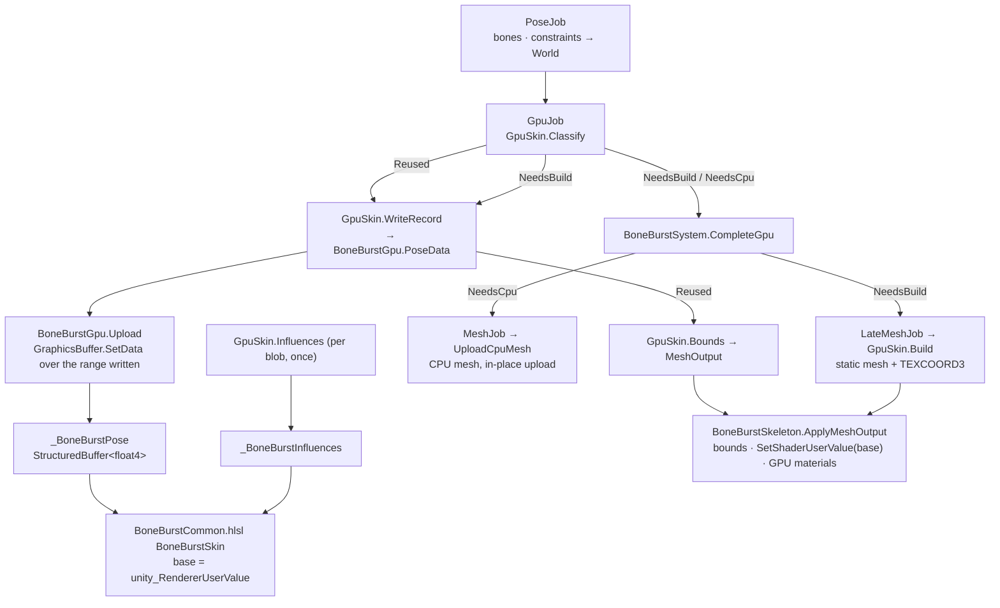
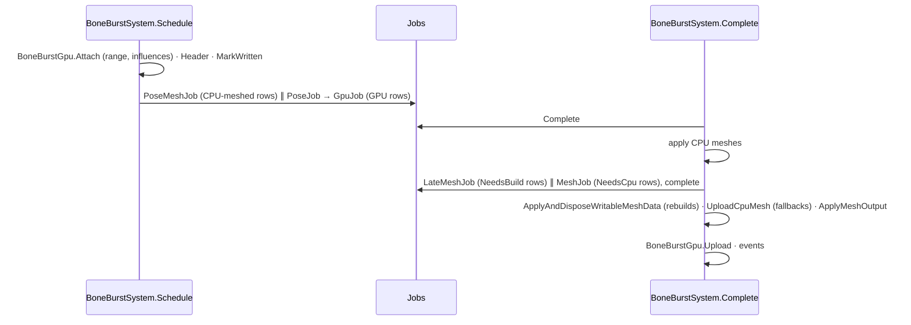

# BoneBurst GPU skinning (P7)

GPU skinning moves the per-vertex work of a BoneBurst skeleton from the mesh job to the vertex shader. The CPU still poses the skeleton (animation, constraints, physics), exactly as before. What changes is the mesh. Instead of rebuilding and uploading every vertex each frame, the component keeps a **static mesh** that stores each vertex's local position and bone references, and each frame uploads one **pose record**: every bone's world transform and every slot's vertex colour. The static mesh is rebuilt only when its **topology** changes: which attachment each draw-order position shows, and which sequence frame. A frame the GPU path cannot draw (an active clip, or deform on a rendered slot) builds the ordinary CPU mesh instead, for that frame only. This design is BoneBurst's own. It is not a port of any stock runtime feature, so there is no clean-room source; the reference is BoneBurst's CPU mesh ([Pose-and-Mesh.md](Pose-and-Mesh.md) §5–7), which is at parity with spine-unity's `MeshGenerator`.

## 1. When a frame takes the GPU path

`BoneBurstSkeleton.GpuSkinning` opts a skeleton in. `BoneBurstGpu.IsSupported` must also hold: compute support and at least two structured buffers readable in vertex shaders, which is shader model 4.5. Without it the skeleton always builds CPU meshes. The GPU path applies only to frames the system meshes anyway (`FullUpdate`, or the first mesh after a reset). Invisible skeletons in `EverythingExceptMesh` are posed and not uploaded, as before.

Each GPU frame, `GpuSkin.Classify` walks the applied draw order with the CPU mesh's `Renders` rule (bone active, slot alpha ≠ 0, a region or mesh attachment on a page). It returns one of three states:

| State | When | What happens |
|---|---|---|
| `NeedsCpu` | A rendered slot has deform (`DeformCount > 0`), **or** the walk passes an active clipping attachment and the skeleton has clipping scratch, so the CPU mesh would take its clipping path (`MeshBuilder.Measure`). | `MeshJob` builds the normal CPU mesh into the instance's scratch, `UploadCpuMesh` uploads it with the normal materials (vertices only while its topology is unchanged, so consecutive fallback frames re-use the buffers), and the GPU topology key is cleared. |
| `NeedsBuild` | The topology key differs from the one the static mesh was built from. | The record is written, then `LateMeshJob` rebuilds the static mesh. |
| `Reused` | Otherwise. | The record and the bounds are written; the mesh is not touched. |

The **topology key** (`InstanceHeader.GpuTopology`, `3 + 3 × slots` ints) is a built flag, the z spacing's bits and tint black, then for each draw-order position its slot, the attachment it renders (or −1) and the sequence frame (`MeshBuilder.Frame`). A key holds only what the static mesh bakes: local positions, UVs, triangles, submesh splits (pages, blend modes), z, and the slot record each vertex reads. Colours, bone transforms and activation that leaves the rendered set unchanged live in the record, so they do not trigger a rebuild. The slot is part of the key because an attachment can be shown on two slots at once (the API allows any attachment on any slot). Swapping two such slots in the draw order changes nothing else in the key, but it changes which colour and bone each vertex must read.

## 2. The two global buffers

`BoneBurstGpu` owns both buffers. Both are `GraphicsBuffer.Target.Structured` of `float4`, set once as global shader buffers, with a CPU copy in a persistent `NativeList<float4>`.

**`_BoneBurstPose`: one record per GPU-skinned instance.** The record lives at the instance's base, `InstanceData.GpuBase`, and is `GpuSkin.RecordSize(bones, slots, tintBlack)` float4s long:

| Offset (float4s) | Contents |
|---|---|
| `2b` | bone `b`: `(a, b, c, d)` |
| `2b + 1` | bone `b`: `(worldX, worldY, 0, 0)` |
| `2 × bones + s × stride` | slot `s`: its vertex colour, the PMA bytes of `MeshBuilder.VertexColor` divided by 255 (what a `UNorm8` attribute reads), or 0 when the slot does not render |
| `2 × bones + s × 2 + 1` | with tint black (stride 2): slot `s`'s `(uv2.x, uv2.y, uv3.x, uv3.y)` |

Records are written by `GpuJob` straight into the CPU copy (`NativeDisableParallelForRestriction`, since each instance writes only its own range). At `Complete`, one `SetData` uploads the range spanning every record written this frame (`MarkWritten`). Ranges come from a first-fit `RangeAllocator` that merges freed neighbours. A range is stable for as long as its size fits, so the renderer's user value rarely changes. Growing past the buffer's size recreates it and uploads everything. `Dispose` (uninstall, or a new play session) bumps a generation counter; an instance holding a range from an older generation re-attaches at its next GPU frame.

**`_BoneBurstInfluences`: every weighted influence of a blob.** Uploaded once, when the blob's first instance goes GPU (`GpuSkin.Influences`). Each weighted mesh's influences are stored in blob order as `(x, y, weight, bone)`; `bone` is a float, exact below 2²⁴. A per-attachment start table, `InstanceHeader.GpuInfluenceStart`, is absolute in the global buffer (−1 when unweighted). `BoneBurstAsset.OnDisable` frees a blob's range after its instances are detached.

## 3. Frame order

The late job adds a main-thread wait only on frames where some GPU instance rebuilds or falls back. Its rows run in parallel. `BoneBurstSystem.LastFrameGpuReused`, `LastFrameGpuBuilt` and `LastFrameGpuFallback` count the three outcomes of the last completed frame, and `BoneBurstSkeleton.LastGpuState` gives one skeleton's.

## 4. The static mesh

The static mesh is built by `LateMeshJob` → `GpuSkin.Build`, sized by `MeshBuilder.Count` (no clipping on this path), with the same vertex order, triangles and submeshes as `MeshBuilder.Write`.

| Stream | Attributes | GPU meaning |
|---|---|---|
| 0 | `POSITION` float3, `COLOR` UNorm8×4, `TEXCOORD0` float2 (`SkeletonVertex`) | `xy`: the vertex's local position (region corner offset, unweighted mesh vertex), or 0 for a weighted vertex; `z`: draw-order depth as on the CPU; colour: the CPU byte colour (not read by the GPU variant); UV as on the CPU. |
| 1 | `TEXCOORD3` float4 | `(first influence, influence count, bone, slot record)`: count 0 means one bone, the slot's; otherwise the vertex's influences start at `first` in `_BoneBurstInfluences`. `slot record` is the slot's offset in the record. |

The mesh has no tint-black streams; the GPU variant reads tint from the record.

## 5. The vertex shader

`BoneBurstCommon.hlsl` provides `BoneBurstSkin`, used through two macros:

- `BONE_BURST_EXTRA_ATTRIBUTES` declares the extra vertex inputs of the variant.
- `BONE_BURST_VERTEX_INPUTS` yields position, vertex colour and tint values.

It uses the same arithmetic, in the same order, as `MeshBuilder.Write`:

- one bone: `x = lx·a + ly·b + worldX`, `y = lx·c + ly·d + worldY`;
- weighted: `wx += (vx·a + vy·b + worldX) · weight` per influence, in blob order.

The record's base is `unity_RendererUserValue`, which URP 17.6 packs into `unity_RenderingLayer.y` (`UnityPerDraw`). `BoneBurstSkeleton.ApplyMeshOutput` sets it with `MeshRenderer.SetShaderUserValue(GpuBase)` whenever the base changes. Because it is a per-draw value rather than a material property, **the SRP Batcher still batches** GPU-skinned renderers. `BONE_BURST_GPU` is a `multi_compile_local` keyword in every pass of `BoneBurst/Unlit` and `BoneBurst/Lit2D`, and its variant alone requires `#pragma target 4.5`. `BoneBurstAsset.MaterialFor(page, blend, gpu: true)` returns a separate material with the keyword on. Runtime-created materials are the reason for `multi_compile`: a `shader_feature` variant no material asset references is stripped from player builds. The same rule made `_TINT_BLACK_ON` `multi_compile_local` too, and turned straight alpha into a branch on `_StraightAlphaInput` (2026-09-29, `Doc/Parity/Parity.md`).

**Exactness.** On the CPU (the harness's transcription) the evaluated positions equal the CPU mesh bit for bit. A GPU compiler may fuse `x·a + y·b` into multiply-adds and reorder nothing else. The difference is then at most the last bit or so of each product, far below a pixel. The colour bytes and UVs are exact. Unlike the plan's first sketch, **there is no influence trimming**: the shader loops over each vertex's full influence list, so there is no trim budget to report.

## 6. Bounds

A reused frame writes no vertices, so the bounds come from the bones. `GpuSkin.Build` records per bone the box of the local positions it carries (`GpuReach`, 4 floats per bone), then the weight statistics: the smallest and largest weight sum per vertex, the largest sum of |weight|, and whether any weight is negative. `GpuSkin.Bounds` then:

1. Maps each used bone's local box through the bone. The world box has centre `M·mid + t` and half extents `(|a|·hx + |b|·hy, |c|·hx + |d|·hy)`, which contain the image of the local box.
2. Takes the union `[lo, hi]` over the bones.
3. Scales by the weights. With all weights ≥ 0, a vertex is `S · (a convex combination of points in [lo, hi])` for its weight sum `S ∈ [sMin, sMax]`, so it lies in `[min(sMin·lo, sMax·lo), max(sMin·hi, sMax·hi)]`. With a negative weight, it lies in `±max(|lo|, |hi|) · max Σ|w|`.
4. Pads by `1e-5` relative plus `1e-6` for GPU rounding. Z extents are as on the CPU.

These bounds are **never smaller than the exact vertex bounds, but usually larger**. Stock's `GetMeshBounds` is exact. Measured over the corpus without `gpu.json`: the mean area is **1.17×** exact, with a maximum of 4.4×. With `gpu.json`'s deliberately extreme weights (sums of 1.25 and 0.5, a negative weight, far-out influences) included, the mean is 1.46× and the maximum 17.5×. For culling this only means a skeleton is considered visible slightly early.

## 7. Differences from the CPU path, and limits

1. **Bounds are conservative** (§6): `Mesh.bounds` differs from stock's exact bounds on GPU frames.
2. **`Mesh.vertices` holds local positions** on GPU frames. Anything that reads the mesh on the CPU sees the static mesh, not the posed skeleton; for example, a collider generated from the mesh, or a readback. Read bone or slot data, or turn GPU skinning off for such a skeleton.
3. **Fallback is per instance and per frame.** One rendered slot with deform, or one active clip, sends the whole skeleton to the CPU for that frame. Deform is common in real animations: on the corpus, 25 % of GPU-requested frames fell back, 17 % for deform and 8 % for clipping.
4. **Topology that changes every frame** (a sequence animating every frame, draw-order keys at frame rate) rebuilds the static mesh every frame. That costs about what the CPU mesh does, plus the record.
5. **The record carries every bone and slot**, not just those the static mesh uses. On the corpus it averages about a quarter of the CPU mesh's upload (below).
6. **GPU numbers are measured in release players.** `Assets/BoneBenchmark` runs the BurstGpu column of every suite ([BoneBurst-Performance.md](../Review/BoneBurst-Performance.md)): at 2 000 skeletons after round 2, 2.70 ms idle / 3.29 walk / 4.45 switch, against BurstCpu's 2.50 / 2.51 / 3.55 — the CPU mesh is faster now, and it handles deform; per the owner's split, lightly animated skeletons go GPU. `Tests/Runtime/Perf/BoneBurstPerfTests.cs` (explicit) remains for an in-Editor look at the two PlayerLoop entries, frame time and GC.

**Upload volume, measured** (harness, all non-fallback frames): 186.6 MB of CPU mesh data would have been uploaded, against **46.6 MB of pose records**, about **4× less**. The count includes rebuild frames, which upload both.

## 8. Verification

- **Harness (outside Unity).** Every frame, `ManagedPose.GpuFrame` (the managed mirror of `GpuJob` and `LateMeshJob`) is compared with `ManagedPose.BuildMesh`: the static mesh and record, evaluated with a line-for-line C# transcription of `BoneBurstSkin`, must give the CPU mesh bit for bit (positions, z, UVs, colour bytes, tint), with the same indices and submeshes. The bounds must contain every CPU vertex, and each fallback must have a reason. Random scripts switch animations (with mixing), combine and swap skins, set and clear attachments, reset slots, show one attachment on two slots then swap them in draw order, and flip z spacing. Results are in `Doc/Parity/Parity.md`, *P7*.
- **Unity (written, not yet run).**
  - `Tests/Editor/Mesh/GpuSkinningParityTests.cs` runs the same comparison over the corpus.
  - `Tests/Runtime/Pose/GpuSkinningPlayModeTests.cs` covers the jobs end to end. It reads the uploaded `GraphicsBuffer` back, evaluates the static mesh and compares the result with the managed reference, and checks reuse, the clipping fallback, switching GPU skinning off, materials and keywords.
- **Shaders.** Compiled offline with Unity's bundled DXC (`libdxcompiler.dylib`) against the project's URP 17.6 includes, for every pass and every combination of `BONE_BURST_GPU`, `_TINT_BLACK_ON`, `_LIGHT_AFFECTS_ADDITIVE`, gamma and the four shape-light keywords, as D3D11 shader model 6.0 (536 stage variants since the 2026-09-29 keyword change). Unity's own compiler has since compiled the CPU variants on Metal (`KeywordVariantComparisonTests`); the GLES back end has not run.
