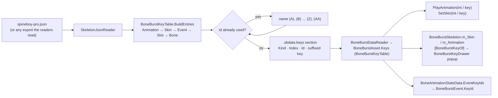

# BoneBurst name keys: baked string → int per skeleton

Every animation, skin, event, slot and bone name of a skeleton is baked as a `BoneBurstKey`: a name as an int, derived exactly as M2-Creator-All's `ModuleP1.PropertyString` does (`new PropertyName(name).GetHashCode()`). Inside one skeleton every id is unique: a name whose id is already taken gets `(A)`, `(B)`, `(C)` … appended until it is free. The keys are baked **into the skeleton's `.sbdata`** by `BoneBurstDataWriter` ([BakedData.md](BakedData.md)). `BoneBurstAsset.Keys` gives them as a `BoneBurstKeyTable`, so `BoneBurstSkeleton.PlayAnimation` and `SetSkin` accept a key or its int id. There is no separate keys asset.



## 1. Baking

- **Keys are part of the skeleton's bake.** `BoneBurstDataWriter.Write` builds them with `BoneBurstKeyTable.BuildEntries` and stores, per key, its kind, index, id, and the suffixed key when it differs from the name. The name itself is not stored again: it is the named item's own name.
- **Any readable export.** The keys come from the parsed `SkeletonDef`, so a binary export bakes the same keys as the JSON of the same skeleton. The Editor bake takes JSON (the owner's source format).
- **Checked at load.** `BoneBurstKeyTable` recomputes each key's id when the asset first loads. An id that differs from the baked one (Unity's `PropertyName` hash changed) or two keys with one id is a `SkeletonFormatException` that says to rebake. It is never a silent wrong lookup.

## 2. Keys and duplicates

| Rule | Why |
|---|---|
| The id is stored and also recomputed from the key once at load | The same int as `PropertyString`; the stored copy catches a changed hash. |
| Categories bake in the order Animation, Skin, Event, Slot, Bone, each in export order | Gameplay mostly refers to animations, so they always keep their clean names. The fixed order makes a re-bake of an unchanged export give the same keys. |
| A name whose id is already used gets ` (A)`, then ` (B)` … ` (Z)`, ` (AA)` (`BoneBurstKeyTable.Suffix`) | Every id is unique within the skeleton. This covers the same name in two categories (bone `head` and slot `head`) and a true hash collision. |
| Attachments are not baked | Their names repeat across skins on purpose: mix-and-match-pro has 293 repeats. |

On spineboy-pro, slot `head` keeps `head` and bone `head` becomes `head (A)`. The samples need these suffixes:

| Export | Keys | Suffixed |
|---|---|---|
| spineboy-pro | 131 | 35 |
| mix-and-match-pro | 263 | 32 |
| dragon | 65 | 30 |
| goblins | 48 | 16 |

`BoneBurstAsset.Keys.KeyOf(kind, name)` returns the key baked for a name as the export spells it, suffix included.

## 3. Using a key

```csharp
int jump = new BoneBurstKey("jump").Id;   // or a baked key's Id
skeleton.PlayAnimation(jump, true);
skeleton.SetSkin(new BoneBurstKey("default"));
```

`BoneBurstAsset.NameOf(keyId, kind)` resolves an id to its name as the export spells it. It throws when:
- the asset has no baked data;
- the id is not baked;
- the key names another kind. An event key passed to `PlayAnimation` is refused.

### Serialized keys: skin and start animation

`BoneBurstSkeleton` serializes its skin and its start animation as `BoneBurstKey` (`m_Skin`, `m_Animation`), exposed as the `Skin` and `Animation` properties. Only the key's text is stored, as with `PropertyString`; the id is computed from it.

- **Resolved by id, never by text.** `ApplySkin` calls `NameOf(m_Skin.Id, Skin)`. A skin whose name an animation also has is keyed `name (A)`, and that text is not the skin's name. A key that names no skin, or names another kind, logs an error and shows the default skin.
- **The Inspector** draws every `[BoneBurstKeyOf(kind)]` field with `BoneBurstKeyDrawer`: a popup of that kind's keys, read from the `Asset` field on the same object. With no readable asset it is a text field labelled *(unchecked)*. A stored key the asset lacks stays selected, marked *(missing)*, and is never cleared.
- `PlayAnimation(string)` before enable stores the name as the key. Animations bake first, so an animation's key is always its name (§2).

### Event key ids

`BoneBurstEvent.KeyId` is the fired event's baked key id. `BoneBurstAsset.AnimationStateData` fills `EventKeyIds` (event index → id) from the keys. Compare it against `Asset.Keys.KeyOf(BoneBurstKeyKind.Event, name).Id`, **not** `BoneBurstKey.IdOf(name)`: events bake third, so their keys are often suffixed. It is `EmptyId` for Complete notifications and for a `BoneAnimationStateData` built without an asset.

```csharp
int footstep = skeleton.Asset.Keys.KeyOf(BoneBurstKeyKind.Event, "footstep").Id;
skeleton.Event += (_, e) => { if (e.KeyId == footstep) PlayStep(); };
```

## 4. Verification

- **`Tests/Editor/Keys/BoneBurstKeysTests.cs`, 16 of 16 passing in Unity 6000.6.3f1** (2026-09-30, after the keys moved into the baked data):
  - the suffix sequence (A, Z, AA, ZZ, AAA);
  - ids equal the `PropertyName` hash;
  - a name `x` in all five categories bakes as `x`, `x (A)` … `x (D)`;
  - a baked id that no longer matches its key, and two keys with one id, are refused;
  - four sample exports bake one key per name, every id unique, re-bakes identical, animations unsuffixed;
  - an asset reads its keys from its baked data, and `NameOf` resolves kinds and refuses a wrong kind.
- **`BakedDataTests.Keys_AreTheBakedKeys`:** on every corpus skeleton, the keys read back equal `BuildEntries`, and each stored id equals its key's id.
- **`BoneBurstSkeletonPlayModeTests` (2026-10-01):** on a skeleton with `x` in every category, serialized key `x (A)` shows skin `x`, the start animation plays, and the event arrives with the id of `x (B)`. Skin key `x` (the animation's) logs an error and shows the default skin. Resolving the skin by its text, or `KeyId` from `IdOf(Name)`, each fails a test.
- **Play mode, demo scene:** `PlayAnimation(int)` and `PlayAnimation(BoneBurstKey)` switch the animation, an event key is refused, and `SetSkin(key)` resolves.
