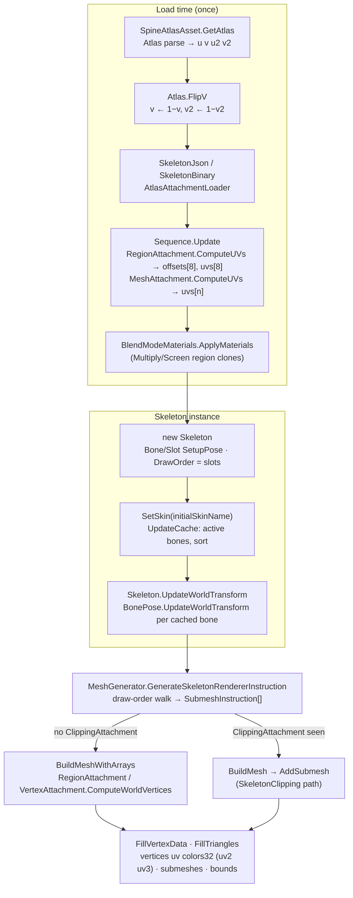
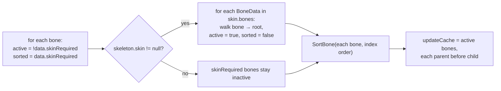

# Spine 4.3 setup pose to spine-unity vertex buffers: clean-room specification

This spec describes how stock Spine 4.3 turns a skeleton's **setup pose** into the vertex, UV, color and index buffers that a spine-unity `SkeletonRenderer` hands to `UnityEngine.Mesh`. The setup pose here has no animation applied, and constraints are ignored. The reference runtime is spine-csharp **4.3.40** and spine-unity **4.3.109**, vendored in `Packages/com.esotericsoftware.spine.spine-csharp` and `Packages/com.esotericsoftware.spine.spine-unity` at upstream `4.3` commit `7ce5d0da`. The local changes in those forks are `var` clean-up and access modifiers only, and none of them changes behaviour. An engineer should be able to build the Burst pipeline **from this document alone** and get bit-identical output wherever the reference is itself deterministic (see §9). No reference source is reproduced here. The tables, prose and pseudocode are written from scratch. File-format parsing (JSON, `.skel`, `.atlas`) is covered by [Format-Json-Atlas.md](Format-Json-Atlas.md) and [Format-Binary.md](Format-Binary.md). This document starts from loaded data.



---

## Contents

1. [Numeric conventions](#1-numeric-conventions)
2. [Setup pose](#2-setup-pose)
3. [Bone activation and update order](#3-bone-activation-and-update-order)
4. [World transform](#4-world-transform)
5. [Region attachment](#5-region-attachment)
6. [Mesh and linked-mesh attachment](#6-mesh-and-linked-mesh-attachment)
7. [spine-unity mesh generation (SkeletonRenderer, default settings)](#7-spine-unity-mesh-generation)
8. [Atlas page materials, PMA vs straight alpha, blend modes](#8-atlas-page-materials-pma-vs-straight-alpha-blend-modes)
9. [Ambiguities / verified only by reading](#9-ambiguities--verified-only-by-reading)

---

## 1. Numeric conventions

| Rule | Detail |
|---|---|
| Scalar type | Every stored pose, attachment, atlas and vertex value is **float32**. |
| Evaluation | Every `+ − × ÷` is a single float32 operation, rounded after each operation. Evaluate **left to right exactly as parenthesised in this spec**. `a*b + c*d + e` means `((a*b) + (c*d)) + e`. Do not contract into FMA (see §9). |
| Transcendentals | `cos`, `sin`, `atan2` and `sqrt` are computed in **float64** on the float32 argument widened to double, then narrowed back to float32. This spec writes them as `cosF(x)`, `sinF(x)`, `atan2F(y, x)` and `sqrtF(x)`. |
| Fast-trig switch | The upstream `USE_FAST_SIN_COS_ATAN2_APPROXIMATIONS` lookup table is **off** (not defined), so it never applies. |
| Degree/radian | Angles are stored in **degrees**. The conversion multiplies by a float32 constant. |
| `atan2Deg(y, x)` | `f32(atan2F(y, x) × RadDeg)`: the double atan2 is narrowed to float first, then multiplied in float. |

Constants (all float32):

| Name | Definition | Value | Bits |
|---|---|---|---|
| `PI` | literal `3.1415927` | 3.14159274101257 | `0x40490FDB` |
| `DegRad` | `PI / 180` | 0.0174532923847437 | `0x3C8EFA35` |
| `RadDeg` | `180 / PI` | 57.2957763671875 | `0x42652EE0` |
| `Epsilon` | literal `0.00001` | | |
| `EpsilonSq` | `Epsilon × Epsilon` | 9.9999994e-11 | `0x2EDBE6FE` |

Colors are 4 × float32 (`UnityEngine.Color`). Color × Color is component-wise. Color × scalar scales all four channels.

---

## 2. Setup pose

### 2.1 How spine-unity reaches the setup pose

`SkeletonRenderer.Initialize` does the following, in order. Nothing else touches the pose before the first mesh.

| Step | Effect |
|---|---|
| `new Skeleton(data)` | Creates one `Bone` per `BoneData` (parent-first, index order) and runs **Bone setup** (§2.2). Creates one `Slot` per `SlotData` and runs **Slot setup** (§2.3). With no skin set yet, attachments resolve from the **default skin** only. Sets draw order = slots in `SlotData.index` order. Sets skeleton color = (1,1,1,1). Calls `UpdateCache` (§3). |
| object initialiser | `skeleton.ScaleX = initialFlipX ? −1 : 1`, `skeleton.ScaleY = initialFlipY ? −1 : 1`. Both flags default to false. |
| `AssignInitialSkin` | If `initialSkinName` is empty or exactly `"default"`, it calls `SetSkin(null)`. That call is a no-op because the skin is already null, so no second `UpdateCache` runs. Otherwise it calls `SetSkin(name)`, see §2.4. |
| `AfterAnimationApplied` | `Skeleton.UpdateWorldTransform` (§3.3, §4). |
| `LateUpdate → UpdateMesh` | Mesh generation (§7). |

`Skeleton.SetupPose()` (bones, then slots) produces the same state as the constructor. A new runtime can call it once.

### 2.2 Bone setup

`bone.pose ← data.setupPose`, copying all 8 fields. The applied pose used for world transforms *is* `bone.pose` while no constraint is active.

| Field | Source (loader default when absent) |
|---|---|
| `x`, `y` | setup x, y × loader `scale` (0) |
| `rotation` | degrees (0) |
| `scaleX`, `scaleY` | (1) |
| `shearX`, `shearY` | degrees (0) |
| `inherit` | `Normal` / `OnlyTranslation` / `NoRotationOrReflection` / `NoScale` / `NoScaleOrReflection` (Normal) |

The world fields `a b c d worldX worldY` start at 0 and are only written by §4.

### 2.3 Slot setup

Run for every slot, in slot-index order:

| Field | Setup value |
|---|---|
| `color` | `SlotData.setupPose.color`. Loader default is (1,1,1,1). Parsed as byte/255. |
| `darkColor` | Exists **only if** the slot data has a dark color (`dark` key / binary flag). Then it is the data's RGB, alpha 1. Otherwise it is *absent*, and renderers treat it as black (0,0,0). |
| `sequenceIndex` | First copied from `SlotData.setupPose.sequenceIndex` (0). It is then **overwritten by −1** whenever the attachment below is non-null (see next row). |
| `attachment` | If `SlotData.attachmentName` is null, the attachment is null. Otherwise the slot first clears it to null, then assigns `skeleton.GetAttachment(slotIndex, attachmentName)`. Because the attachment was cleared first, assigning a non-null result always counts as a *change*. Every attachment change clears `deform` and sets `sequenceIndex = −1`. |
| `deform` | Empty. The setup pose never has deform. |

`Skeleton.GetAttachment(slotIndex, name)` resolves in this order:

1. If `skeleton.skin` is non-null, look up `(slotIndex, name)` in it. Return the result if found.
2. Else, if `data.defaultSkin` exists, return its `(slotIndex, name)` entry, which may be null.
3. Else return null.

Skin lookup is an exact `(slot index, placeholder name)` key match.

**Net setup rule:** every slot with a resolved attachment ends with `sequenceIndex = −1`, so its sequence frame is the attachment's `Sequence.setupIndex` (§5.1).

### 2.4 Skin set after construction (`SetSkin(newSkin)`)

| Case | Effect on slots |
|---|---|
| `newSkin == current skin` | Nothing happens, and `UpdateCache` is not re-run. |
| old skin null, new skin non-null | For each slot whose `attachmentName` is non-null, look up `(i, attachmentName)` **in the new skin only**. If found, assign it (which resets `sequenceIndex` to −1). If not found, keep the attachment from the constructor (the default-skin result). The net result equals §2.3 resolution with the skin set. |
| old skin non-null | `newSkin.AttachAll(old)`: for each slot currently showing an attachment from the old skin, attach the new skin's entry with the same placeholder name, if one exists. Not needed for a fresh setup pose. |

It then sets `skin = newSkin` and runs `UpdateCache` (§3).

### 2.5 Skeleton-level values

| Field | Default | Used by |
|---|---|---|
| `color` | (1,1,1,1) | vertex color (§7.5) |
| `x`, `y` | 0, 0 | root bone translation (§4.2) |
| `scaleX` | 1 (−1 if `initialFlipX`) | root bone and every non-Normal inherit mode |
| `scaleY` | 1 (−1 if `initialFlipY`) | as above. The **getter** returns `scaleY × (Bone.yDown ? −1 : 1)`. `Bone.yDown` is a static that defaults to false, and spine-unity never sets it. All formulas below use the getter value. |

---

## 3. Bone activation and update order

### 3.1 Active bones (`UpdateCache`)



| Rule | Detail |
|---|---|
| Not skin-required | Always active. |
| Skin-required | Active only if it, **or a descendant**, is listed in the **current skin's** `bones` list. Activating a bone activates every ancestor up to the root. |
| Default skin | **Not consulted.** With `skin == null`, every skin-required bone is inactive, even if the default skin lists it. |
| Slots | Have no activation flag of their own. A slot is "active" exactly when `slot.bone.active` is true. |
| Inactive bone | Never enters the update cache, so its world transform is never computed. It stays at the values it was constructed with, which are all 0 for a fresh skeleton. |
| Inactive-bone attachments | Skipped by every rendering pass (§7.2). One case is **not** skipped: a *weighted* mesh on an active slot may reference an inactive bone by index. It then reads that bone's stale transform (zeros on a fresh skeleton). Spine's editor prevents this in practice, see §9. |

Constraint activation (`skinRequired` + skin `constraints` list) also happens here. Constraints are out of scope.

### 3.2 Sort order

`SortBone(bone)` does nothing if the bone is already sorted or is inactive. Otherwise it sorts the parent first (recursively), marks the bone sorted and appends it. Bones are visited in index order, and bone data is parent-first, so **without constraints the update order is ascending bone index, restricted to active bones**. Active constraints could insert their bones earlier. That changes only *when* a bone updates, never *what* it computes, because each bone depends only on its parent.

### 3.3 Update

`Skeleton.UpdateWorldTransform`:

1. Increments an update counter.
2. For each cache entry in order, calls its update. A bone computes §4 once per counter value.

The `local`/`world` bookkeeping fields never trigger `UpdateLocalTransform` in the setup pose. Skip them.

---

## 4. World transform

Inputs per bone: local `x y rotation scaleX scaleY shearX shearY inherit`. The parent's world values are `pa pb pc pd pwx pwy`. Skeleton values are `sx = skeleton.scaleX` and `sy = skeleton.ScaleY` (getter, §2.5), plus `skeleton.x`, `skeleton.y`.

Outputs: the 2×2 matrix `[a b; c d]` (columns = bone local X and Y axes in skeleton space) and `worldX`, `worldY`. A point `(lx, ly)` in bone space maps to `(lx*a + ly*b + worldX, lx*c + ly*d + worldY)`.

### 4.1 Shared local-axis block

The Normal, NoRotationOrReflection and NoScale modes build a local matrix from an angle base `R`, using the float32 rules of §1:

```
rx = (R + shearX) × DegRad          // Normal, OnlyTranslation, root:  R = rotation
ry = ((R + 90) + shearY) × DegRad   // Normal, OnlyTranslation, root
la = cosF(rx) × scaleX
lb = cosF(ry) × scaleY
lc = sinF(rx) × scaleX
ld = sinF(ry) × scaleY
```

The addition order inside `ry` differs by mode. This matters for bit-exactness:

| Mode | `rx` argument | `ry` argument |
|---|---|---|
| root, Normal, OnlyTranslation | `(rotation + shearX)` | `((rotation + 90) + shearY)` |
| NoRotationOrReflection | `(r + shearX)` | `((r + shearY) + 90)` |
| NoScale, NoScaleOrReflection | `shearX` | `(90 + shearY)` |

### 4.2 Root bone (no parent). Inherit mode is ignored.

```
a = (cosF(rx) × scaleX) × sx
b = (cosF(ry) × scaleY) × sx
c = (sinF(rx) × scaleX) × sy
d = (sinF(ry) × scaleY) × sy
worldX = (x × sx) + skeleton.x
worldY = (y × sy) + skeleton.y
```

### 4.3 Non-root bones: translation (all modes)

```
worldX = ((pa × x) + (pb × y)) + pwx
worldY = ((pc × x) + (pd × y)) + pwy
```

### 4.4 Matrix per inherit mode

| Mode | a, b, c, d |
|---|---|
| **Normal** | `a = pa·la + pb·lc`, `b = pa·lb + pb·ld`, `c = pc·la + pd·lc`, `d = pc·lb + pd·ld`. Each is `(p×l) + (p×l)`. |
| **OnlyTranslation** | Same four formulas as the root (§4.2), using the skeleton scale. The parent's matrix is ignored. |
| **NoRotationOrReflection** | See pseudocode A. |
| **NoScale** / **NoScaleOrReflection** | See pseudocode B. |

**Pseudocode A: NoRotationOrReflection**

```
sxi = 1 / sx ;  syi = 1 / sy
qa = pa × sxi ;  qc = pc × syi                   // pb, pd not rescaled here
s  = (qa × qa) + (qc × qc)
if s > EpsilonSq:
    s  = | ((qa × pd) × syi) − ((pb × sxi) × qc) | / s
    qb = qc × s
    qd = qa × s
    r  = rotation − atan2Deg(qc, qa)
else:
    qa = 0 ;  qc = 0
    qb = pb ;  qd = pd                             // original parent values
    r  = (rotation − 90) + atan2Deg(pd, pb)
rx = (r + shearX) × DegRad
ry = ((r + shearY) + 90) × DegRad
la, lb, lc, ld from rx, ry (§4.1)
a = ((qa × la) − (qb × lc)) × sx
b = ((qa × lb) − (qb × ld)) × sx
c = ((qc × la) + (qd × lc)) × sy
d = ((qc × lb) + (qd × ld)) × sy
```

**Pseudocode B: NoScale and NoScaleOrReflection**

```
sxi = 1 / sx ;  syi = 1 / sy
t   = rotation × DegRad
cs  = cosF(t) ;  sn = sinF(t)
za  = ((pa × cs) + (pb × sn)) × sxi
zc  = ((pc × cs) + (pd × sn)) × syi
s   = 1 / sqrtF((za × za) + (zc × zc))
za  = za × s ;  zc = zc × s
zb  = −zc ;  zd = za
if inherit == NoScale and
   ( ((pa × pd) − (pb × pc)) < 0 )  !=  ( (sx < 0) != (sy < 0) ):
    zb = −zb ;  zd = −zd
rx = shearX × DegRad
ry = (90 + shearY) × DegRad
la, lb, lc, ld from rx, ry (§4.1)
a = ((za × la) + (zb × lc)) × sx
b = ((za × lb) + (zb × ld)) × sx
c = ((zc × la) + (zd × lc)) × sy
d = ((zc × lb) + (zd × ld)) × sy
```

The determinant test uses the parent's **original** `pa pb pc pd`. The comparisons bind tighter than `!=`.

---

## 5. Region attachment

### 5.1 Which sequence frame

Every region and mesh attachment owns a `Sequence`. A plain attachment has a 1-frame sequence with `setupIndex = 0`.

```
index = slot.sequenceIndex            // −1 in the setup pose (§2.3)
if index == −1: index = sequence.setupIndex
if index >= regionCount: index = regionCount − 1
```

There is no lower clamp. At load, `Sequence.Update` pre-computes, per frame `i`, `offsets[i]` (8 floats) and `uvs[i]` (8 floats) for regions, or `uvs[i]` (`regionUVs.length` floats) for meshes. Rendering only *selects* `offsets[index]` / `uvs[index]` and `regions[index]` (for the material).

### 5.2 Atlas region fields as stored after loading (spine-unity)

| Field | Value |
|---|---|
| `u`, `u2` | `x / pageW`; `u2 = (x + W) / pageW`, where `W` = bounds height if `degrees == 90`, else bounds width. |
| `v`, `v2` | Top-down: `V = y / pageH`, `V2 = (y + H) / pageH`, where `H` = bounds width if `degrees == 90`, else bounds height. **spine-unity then applies `FlipV`**: stored `v = 1 − V`, `v2 = 1 − V2`. Every formula below uses the *stored* (flipped) `v`, `v2`. |
| `packedWidth`, `packedHeight` | Bounds width/height. **If `degrees == 90` they are swapped after the UVs are computed**, so `packedWidth` = bounds height and `packedHeight` = bounds width. For 180/270 there is no swap. |
| `width`, `height` (TextureRegion) | Aliases of `packedWidth` / `packedHeight` (post-swap). |
| `offsetX`, `offsetY` | float, from `offsets` (default 0). |
| `originalWidth`, `originalHeight` | int, from `offsets`. They default to the (pre-swap) bounds size when both are 0. |
| `degrees` | 0, 90 (`rotate: true`), or an explicit integer. |

### 5.3 Local offsets (8 floats)

Attachment fields: `x y rotation scaleX scaleY width height` (x, y, width, height already multiplied by the loader scale). `r` is the frame's atlas region.

```
hx = width / 2 ;  hy = height / 2
lx = −hx ;  ly = −hy ;  lx2 = hx ;  ly2 = hy
if r is an atlas region:
    lx = lx + ((r.offsetX / r.originalWidth)  × width)
    ly = ly + ((r.offsetY / r.originalHeight) × height)
    if r.degrees == 90:                                   // "rotated"
        lx2 = lx2 − ((((r.originalWidth  − r.offsetX) − r.packedHeight) / r.originalWidth)  × width)
        ly2 = ly2 − ((((r.originalHeight − r.offsetY) − r.packedWidth)  / r.originalHeight) × height)
    else:                                                 // 0, 180, 270 all take this branch
        lx2 = lx2 − ((((r.originalWidth  − r.offsetX) − r.packedWidth)  / r.originalWidth)  × width)
        ly2 = ly2 − ((((r.originalHeight − r.offsetY) − r.packedHeight) / r.originalHeight) × height)
lx = lx × scaleX ;  ly = ly × scaleY ;  lx2 = lx2 × scaleX ;  ly2 = ly2 × scaleY
t  = rotation × DegRad ;  cs = cosF(t) ;  sn = sinF(t)
xc  = (lx  × cs) + x ;  xs  = lx  × sn
yc  = (ly  × cs) + y ;  ys  = ly  × sn
x2c = (lx2 × cs) + x ;  x2s = lx2 × sn
y2c = (ly2 × cs) + y ;  y2s = ly2 × sn
```

The int fields (`originalWidth`, `packedWidth` …) are converted to float before they are used.

| `offsets` index | Corner | x value | y value |
|---|---|---|---|
| 0, 1 (`BL`) | bottom-left (lx, ly) | `xc − ys` | `yc + xs` |
| 2, 3 (`UL`) | upper-left (lx, ly2) | `xc − y2s` | `y2c + xs` |
| 4, 5 (`UR`) | upper-right (lx2, ly2) | `x2c − y2s` | `y2c + x2s` |
| 6, 7 (`BR`) | bottom-right (lx2, ly) | `x2c − ys` | `yc + x2s` |

### 5.4 UV array (8 floats) and its pairing

`uvs` pair *k* belongs to world-vertex output *k* of §5.5, **not** to offset pair *k*.

| `uvs` pair | World output | Corner | Not rotated | `degrees == 90` |
|---|---|---|---|---|
| P0 = uvs[0,1] | W0 | BR | (`u2`, `v2`) | (`u2`, `v`) |
| P1 = uvs[2,3] | W1 | BL | (`u`, `v2`) | (`u2`, `v2`) |
| P2 = uvs[4,5] | W2 | UL | (`u`, `v`) | (`u`, `v2`) |
| P3 = uvs[6,7] | W3 | UR | (`u2`, `v`) | (`u`, `v`) |

`v` and `v2` are the stored, flipped values. In top-down atlas terms, the final Unity `uv.y` is `1 − V` / `1 − V2`. If the region is missing (only possible with `allowMissingRegions`, which spine-unity does not set), the table becomes P0 (0,0), P1 (0,1), P2 (1,1), P3 (1,0), with offsets computed without the atlas adjustment.

### 5.5 World vertices

The bone is the slot's bone (`a b c d wx wy` from §4). Each output is `(ox × a) + (oy × b) + wx`, `(ox × c) + (oy × d) + wy`.

| Output (stride 2) | Uses offsets pair | Corner |
|---|---|---|
| W0 = out[0,1] | offsets[6,7] | BR |
| W1 = out[2,3] | offsets[0,1] | BL |
| W2 = out[4,5] | offsets[2,3] | UL |
| W3 = out[6,7] | offsets[4,5] | UR |

This rotation of one corner is specific to spine-csharp (its own comment says so). The corner names assume `rotation = 0` and positive scales. Mirroring swaps them geometrically, but the index mapping never changes.

---

## 6. Mesh and linked-mesh attachment

### 6.1 Data

| Field | Meaning |
|---|---|
| `worldVerticesLength` | 2 × vertex count. |
| `bones` | null ⇒ **unweighted**. Otherwise a flat int list: for each vertex, `n`, then `n` bone indices. Indices are **skeleton bone indices** (`BoneData.index`). |
| `vertices` | Unweighted: `x, y` per vertex (scaled). Weighted: `x, y, weight` per influence, in the same order as `bones` (x, y bone-local and scaled). |
| `regionUVs` | `u, v` per vertex, 0..1 over the *original* (unpacked) image, v top-down. |
| `triangles` | Index list into this attachment's vertices (a multiple of 3). |
| `color` | Attachment tint (default white). |

**Linked mesh:** after all skins are read, the linked mesh takes `bones`, `vertices`, `worldVerticesLength`, `regionUVs`, `triangles` (and hull/edges) **by reference** from its source mesh. It keeps its **own** `path`, `color` and `Sequence`, and so its own regions and material. Then `Sequence.Update` recomputes its UVs from the shared `regionUVs` against its own regions. `timelines` only affects deform/sequence timelines, which are irrelevant here.

### 6.2 World vertices

With `deform` always empty in the setup pose:

```
unweighted:  bone = slot's bone
    for v in 0 .. count−1:
        out[2v]   = ((vx × a) + (vy × b)) + wx
        out[2v+1] = ((vx × c) + (vy × d)) + wy
weighted:
    vi = 0 ; bi = 0                                  // index into bones[] / vertices[] (step 3)
    for v in 0 .. count−1:
        wxAcc = 0 ; wyAcc = 0
        n = bones[vi] ; vi += 1
        repeat n times:
            B = skeleton.bones[ bones[vi] ] ; vi += 1
            px = vertices[bi] ; py = vertices[bi+1] ; w = vertices[bi+2] ; bi += 3
            wxAcc = wxAcc + ((((px × B.a) + (py × B.b)) + B.worldX) × w)
            wyAcc = wyAcc + ((((px × B.c) + (py × B.d)) + B.worldY) × w)
        out[2v] = wxAcc ; out[2v+1] = wyAcc
```

Accumulation starts at float 0 and follows the stored influence order. When deform is non-empty (never in the setup pose), unweighted meshes read deform *instead of* `vertices`, and weighted meshes add `deform[2k], deform[2k+1]` to each influence's `px`, `py`.

### 6.3 UVs (`MeshAttachment.ComputeUVs`, once per sequence frame)

`rx = regionUVs[2i]` and `ry = regionUVs[2i+1]`. All fields are the stored (post-FlipV, post-swap) values of §5.2. `ow = originalWidth`, `oh = originalHeight`, `ox = offsetX`, `oy = offsetY`, `pw = packedWidth`, `ph = packedHeight`.

```
tw = r.width  / (r.u2 − r.u)          // ≈ page width
th = r.height / (r.v2 − r.v)          // ≈ −page height after FlipV (negative!)
```

| `degrees` | `u0` | `v0` | `W` | `H` | `uv[2i]` | `uv[2i+1]` |
|---|---|---|---|---|---|---|
| 0 / other | `r.u − ox/tw` | `r.v − ((oh − oy) − ph)/th` | `ow/tw` | `oh/th` | `u0 + rx·W` | `v0 + ry·H` |
| 90 | `r.u − ((oh − oy) − pw)/tw` | `r.v − ((ow − ox) − ph)/th` | `oh/tw` | `ow/th` | `u0 + ry·W` | `v0 + (1 − rx)·H` |
| 180 | `r.u − ((ow − ox) − pw)/tw` | `r.v − oy/th` | `ow/tw` | `oh/th` | `u0 + (1 − rx)·W` | `v0 + (1 − ry)·H` |
| 270 | `r.u − oy/tw` | `r.v − ox/th` | `oh/tw` | `ow/th` | `u0 + (1 − ry)·W` | `v0 + rx·H` |

Evaluation is float32, left to right, with `u0`/`v0` computed as a single subtraction from `r.u`/`r.v`. Because `th` is negative after FlipV, the result equals `1 − (top-down result)` mathematically. For bit-exactness, **compute in the flipped domain exactly as above**. Do not compute top-down and then do `1 − x`.

If the region is a plain `TextureRegion` (not an atlas region), `uv = (u + rx·(u2 − u), v + ry·(v2 − v))`. If it is null, `uv = (rx, ry)`.

### 6.4 Triangles

`triangles` are used as-is (§7.6 adds the vertex base). Hull and edges do not affect rendering.

---

## 7. spine-unity mesh generation

### 7.1 Default settings (`MeshGenerator.Settings`)

| Setting | Field default | What a SkeletonRenderer created from the Editor gets |
|---|---|---|
| `useClipping` | true | true |
| `zSpacing` | 0 | Preferences "Default Slot Z-Spacing" (0) |
| `tintBlack` | false | true if any atlas material's shader name contains `Tint Black` |
| `canvasGroupCompatible` | false | false |
| `pmaVertexColors` | **true** | true if any atlas material's shader name contains `Spine/` (true for the stock `Spine/Skeleton`) |
| `addNormals` | false | false |
| `calculateTangents` | false | false |
| `immutableTriangles` | false | false |
| `singleSubmesh` (component) | false | false |
| `enableSeparatorSlots` (component) | false | false |
| custom slot materials | empty | empty |

`linearColorSpace` is `QualitySettings.activeColorSpace == Linear`, captured once in `SkeletonRenderer.Awake`. **This project uses Linear** (`m_ActiveColorSpace: 1`).

### 7.2 Which slots produce geometry

Walk `skeleton.drawOrder` (setup order = slot index order) from index 0 to `count − 1`. The mesh-generation paths skip a slot when **any** of these holds:

| Skip condition | Note |
|---|---|
| `!slot.bone.active` | §3.1 |
| `slot.color.a == 0` | Exact float compare. Skeleton and attachment alpha are **not** tested, so they still emit geometry with alpha 0. (During instruction building a clipping *end* slot is exempt from this test. Clipping only.) |
| attachment is null, BoundingBox, Point or Path | "noRender": contributes nothing and does **not** break the submesh. |
| attachment is Clipping | noRender for geometry. Sets `hasActiveClipping`, which selects the §7.8 path. |

Region and Mesh attachments emit geometry. A mesh with 0 triangles still emits its vertices.

### 7.3 Submesh instructions (`GenerateSkeletonRendererInstruction`)

```
current = { startSlot 0, material null, rawVertexCount 0, rawTriangleCount 0 }
for i in drawOrder:
    if skipped by bone-inactive / alpha-0: continue
    if attachment is Region/Mesh:
        region   = sequence.regions[resolveIndex]        // §5.1
        material = customSlotMaterials[slot] ?? region.page.rendererObject   // (Material)
        if forceSeparate(slot) or (current.rawVertexCount > 0 and material !== current.material):
            close current at endSlot = i ; start new current at startSlot = i (counts 0)
        current.material = material
        current.rawVertexCount   += (region: 4 | mesh: worldVerticesLength/2)
        current.rawTriangleCount += (region: 6 | mesh: triangles.length)
    else if forceSeparate(slot) and enableSeparation:
        close current at i ; start new at i                // separator on a non-rendering slot
if current.rawVertexCount > 0: close current at endSlot = drawOrder.count
```

| Rule | Detail |
|---|---|
| Material identity | **Reference** equality of `AtlasPage.rendererObject`, the Unity `Material` that `MaterialsTextureLoader` matched to the page by texture name. One material per atlas page in the default setup. Two regions on one page ⇒ same material. |
| New submesh starts | at the first renderable slot whose material differs from the previous renderable slot's, or at a separator slot. Draw order is never reordered, so alternating pages A B A give 3 submeshes. |
| Separators | Off by default (`enableSeparatorSlots = false`, list empty). |
| Empty result | If no slot renders, there are 0 submesh instructions. |
| Renderer materials | `sharedMaterials[k]` = submesh *k*'s material. |

### 7.4 Per-vertex position

`position = (x, y, z)`, with `x`, `y` from §5.5 / §6.2 (skeleton space, before the GameObject transform) and **`z = zSpacing × drawOrderIndex`** (float). `drawOrderIndex` is the slot's position in the draw order, counting skipped slots. With the default `zSpacing = 0`, z = 0.

### 7.5 Vertex color (`Color32`), identical for all vertices of one attachment

```
C = (skeleton.color × slot.color) × attachment.color            // component-wise float32
if pmaVertexColors:
    alpha = C.a
    additive = slot.data.blendMode == Additive
    if linearColorSpace and additive: alpha = Mathf.LinearToGammaSpace(alpha)
    A  = trunc_byte(alpha × 255)
    R  = trunc_byte(C.r × A) ; G = trunc_byte(C.g × A) ; B = trunc_byte(C.b × A)   // × the BYTE A, as float
    if canvasGroupCompatible and tintBlack: A = 255
    else if additive: A = 0
else:
    A = trunc_byte(C.a × 255) ; R = trunc_byte(C.r × 255) ; G = … ; B = …
```

`trunc_byte` is the C# `(byte)` cast of a float: truncate toward zero. It is **not** rounded, and it assumes a value in [0, 256). The setup pose never exceeds 1 per channel. The RGB premultiply uses the already-truncated byte `A` (0..255), so for example `C.r = 1, alpha = 0.5` gives `A = 127` and `R = 127`. The linear-space fix changes only the RGB multiplier of **additive** slots. Their emitted alpha is still 0.

### 7.6 Buffers, vertex order and indices. Default path: `BuildMeshWithArrays`

This path is used when no slot in the instruction has a clipping attachment. It is the normal case.

**Vertex buffer.** Vertices are appended over all submeshes, in draw order, with no per-submesh restart.

| Attachment | Emitted vertices |
|---|---|
| Region (4) | v0 = W0 (BR) + P0 · v1 = W3 (UR) + P3 · v2 = W1 (BL) + P1 · v3 = W2 (UL) + P2 |
| Mesh (n) | vertex *i* = world vertex *i* + `uvs[2i], uvs[2i+1]` of the resolved frame |

**Index buffer per submesh.** `base` is the attachment's first vertex in the **global** vertex buffer. It carries across submeshes and is never reset.

| Attachment | Indices appended |
|---|---|
| Region | `base+0, base+2, base+1, base+2, base+3, base+1`. In corners: (BR, BL, UR), (BL, UL, UR). Clockwise in Unity's y-up view for a non-mirrored bone. |
| Mesh | `base + triangles[k]` for every k, in order |

**UV.** Written directly from the frame's `uvs` array, so `uv.y` is already flipped (§5.4, §6.3). There is no further flip.

**Tint black** (only when `tintBlack`). Per attachment, all its vertices get:

| | `pmaVertexColors = true` | `pmaVertexColors = false` |
|---|---|---|
| `alpha` | `(skel.a × slot.a) × att.a`, then `LinearToGammaSpace` if linear and additive | — |
| `uv2` | (`dark.r × alpha`, `dark.g × alpha`) | (`dark.r`, `dark.g`) |
| `uv3` | (`dark.b × alpha`, additive ? 0 : `alpha`) | (`dark.b`, 1) |

`dark` is the slot's dark color, or (0,0,0) when absent. When `tintBlack` is off, `uv2`/`uv3` are not written (set to null on the mesh).

### 7.7 Bounds (`GetMeshBounds`)

`min` and `max` are the component-wise minimum and maximum of x, y over **every emitted vertex** (all submeshes). The initial state is `min = +∞`, `max = −∞`. The else-if shortcuts in the reference produce exactly the true min/max for finite input.

| Case | `Mesh.bounds` |
|---|---|
| no vertex emitted (`min.x` infinite) | `new Bounds()`: center 0, extents 0 |
| otherwise | center `(min.x + hw, min.y + hh, 0)`, extents `(hw, hh, thickness × 0.5)`, with `hw = (max.x − min.x) × 0.5`, `hh = (max.y − min.y) × 0.5` |

`thickness = lastEndSlot × zSpacing`, where `lastEndSlot` is the last submesh's `endSlot` (= drawOrder count). This is 0 by default. With negative `zSpacing` it is negative.

### 7.8 Clipping path (`BuildMesh` → `AddSubmesh` per submesh)

This path is taken when `hasActiveClipping` is true, meaning a Clipping attachment is on an active slot, **even if `useClipping` is false**. The polygon clipping itself (`SkeletonClipping`) is out of scope. The differences that matter for parity:

| Aspect | `AddSubmesh` behaviour |
|---|---|
| Region vertex order | **v0..v3 = W0, W1, W2, W3** (BR, BL, UL, UR) with P0..P3 |
| Region indices | `{0,1,2, 2,3,0}` + base. In corners: (BR, BL, UL), (UL, UR, BR). |
| Clipped attachments | When clipping is active, positions, UVs and indices are replaced by the clipper's output. |
| Empty attachments | Skipped entirely if the vertex or index count is 0 (after clipping). |
| Tint-black `uv3.y` | `1` unless `canvasGroupCompatible`. This differs from §7.6, which writes `alpha` / 0. `uv2`/`uv3.x` are `dark × alpha` when PMA. |
| Everything else | The same color, z, skip rules and global vertex base as §7.4–7.7. `useClipping = false` makes Clipping attachments plain noRender slots. |

### 7.9 Transfer to `UnityEngine.Mesh`

| Call | Content |
|---|---|
| `mesh.vertices / uv / colors32` | The whole backing arrays. Their length is the buffer **capacity**, which can exceed the used count: capacity starts at 4 and only grows, to exactly the needed size. Unused tail positions are set to the **last used vertex position** (0 if none). The tail UV and color keep stale or default values. |
| `mesh.bounds` | §7.7 |
| `mesh.normals` | only if `addNormals`: every normal = (0, 0, −1) |
| `mesh.uv2 / uv3` | tint black only |
| `mesh.subMeshCount`, `SetTriangles(items, 0, count, k)` | one index list per submesh instruction |
| `mesh.tangents` | only if `calculateTangents` (2D tangent solver, not covered) |

Only the first `vertexCount` vertices are referenced by indices. A Burst runtime may emit exactly `vertexCount` vertices unless byte-level Mesh parity is required.

---

## 8. Atlas page materials, PMA vs straight alpha, blend modes

### 8.1 Texture workflow

| Item | Default |
|---|---|
| Atlas `pma:` page flag | **Ignored at runtime.** Only the Editor import uses it, for warnings. |
| Spine Preferences texture preset | `StraightAlphaPreset` ⇒ straight-alpha workflow |
| Material shader | `Spine/Skeleton` with `_StraightAlphaInput = 1` (keyword `_STRAIGHT_ALPHA_INPUT`) for the straight workflow |
| Shader blend | `Blend One OneMinusSrcAlpha`. **Always premultiplied output**, whatever the texture workflow. |
| Fragment | `tex = sample(_MainTex, uv)`. If straight input, `tex.rgb *= tex.a`. Output `tex × vertexColor`. |
| Vertex color in shader | Linear space: the premultiplied gamma vertex color is converted with `rgb' = GammaToLinear(rgb / a) × a` (`a == 0` ⇒ `GammaToLinear(rgb)`). Gamma space: unchanged. |
| Linear + PMA texture | Unsupported. The Editor warns ("re-export as straight alpha or switch to Gamma"). |

So `pmaVertexColors = true` is correct for **both** texture workflows with stock Spine shaders. The texture's alpha handling lives entirely in the material keyword and does not change the vertex data. `pmaVertexColors = false` is only for non-Spine (straight-blend) shaders, and it disables the additive trick.

### 8.2 How blend mode reaches rendering

| Slot blend | Vertex data | Material / submesh |
|---|---|---|
| Normal | §7.5 | page material |
| **Additive** | PMA: RGB premultiplied (linear fix on alpha), **A = 0** ⇒ `One, OneMinusSrcAlpha` becomes pure `src + dst` in the same draw call | **Same page material by default** (`applyAdditiveMaterial = false`), so no submesh break |
| Multiply | Normal vertex color | Replaced by `BlendModeMaterials` when the SkeletonDataAsset `requiresBlendModeMaterials` (set on import when a Multiply slot has a region/mesh attachment): each region of every skin entry on that slot is **cloned** with a cloned page whose `rendererObject` is the `-Multiply` material for that page. A different material ⇒ a new submesh (§7.3). |
| Screen | Normal vertex color | Same as Multiply with the `-Screen` material |
| Additive with `applyAdditiveMaterial = true` | A still 0 when PMA | `-Additive` material via the same cloning |

The clone keeps `u v u2 v2`, offsets and the already-computed attachment UVs. Only the page (material) changes. If a replacement material is missing, the cloned page's material is **null**, and that null still takes part in the reference comparison of §7.3.

---

## 9. Ambiguities / verified only by reading

Nothing below was executed. Every statement in this spec comes from reading the vendored sources. These points deserve a parity test before being trusted:

1. **FMA / extended precision.** The reference evaluates in float32 under Mono or IL2CPP. IL2CPP emits C++, and clang on ARM64 may contract `a*b + c` into FMA (`-ffp-contract`). Results can therefore differ in the last ulp across platforms, and "bit-exact" is only defined per player backend. Build Burst jobs with `FloatMode.Strict`, and compare with a small ulp tolerance on the vertex positions.
2. **`cosF`/`sinF` library.** `System.Math.Cos` is the platform libm (double). Burst `math.cos(double)` may differ in the last double ulp, which rarely survives narrowing to float but can.
3. **`Mathf.LinearToGammaSpace`** is a native Unity function. Its exact curve (piecewise sRGB vs. an approximation) was not verified. It only affects additive slots in Linear color space with PMA vertex colors.
4. **`(byte)` cast of out-of-range floats** is unspecified in C#. It cannot happen in the setup pose (all colors ≤ 1) but can after animation with over-bright colors.
5. **Region attachments on 180/270-degree atlas regions.** `RegionAttachment` treats only `degrees == 90` as rotated. For 180/270 it uses the unrotated UV corner table and the unswapped `u2`/`v2`, which is visibly wrong but is the reference behaviour. Mesh attachments do handle 180/270 (§6.3). The Spine packer normally emits only 0/90.
6. **Weighted mesh referencing an inactive bone** reads that bone's never-updated transform (zeros on a fresh skeleton, stale otherwise). The code follows this path, but the Spine editor normally prevents it.
7. **Different region vertex orders.** `BuildMeshWithArrays` (§7.6) and `AddSubmesh` (§7.8) emit different region vertex orders and different tint-black `uv3.y`. A BoneBurst runtime must pick the path by `hasActiveClipping` to match byte-for-byte.
8. **`singleSubmesh = true`** (off by default) forces a single instruction with the first atlas asset's primary material and skips material splitting. Not specified further.
9. **Skin `bones` list of the default skin** is never used for activation (§3.1). This matches the code, but it means a skin-required bone listed only by the default skin never renders unless a named skin also lists it.
10. **`SlotData.setupPose.sequenceIndex`** is never read from JSON (it stays 0), and it is always overwritten with −1 when an attachment is set. The binary reader was not re-checked for a slot-level sequence index, and it would be overwritten anyway.
11. **Mesh capacity tail** (§7.9): stale UV/color values in unused tail vertices depend on the generator's history (double-buffered meshes, prior frames). They are never indexed, so they are ignored for parity.
12. **Draw-order index used for z** counts skipped slots (the index into the draw order, not a count of emitted attachments). With the default `zSpacing = 0` this is invisible.
