# Spine 4.3 runtime skins, tint black and invisible-update modes: clean-room specification

This spec covers three runtime features that sit around the pose and mesh pipeline. The first is **skins at runtime**: building, combining and copying `Skin` objects, and how `Skeleton.SetSkin`, `SetAttachment` and the setup-pose resets change slot attachments and bone/constraint activation. The second is **tint black (two-colour tint)**: the extra `uv2`/`uv3` vertex streams spine-unity's `MeshGenerator` writes, and how the Spine URP shaders turn them, the texture and the light colour into a fragment. That section includes the 2D-lit shader `Universal Render Pipeline/2D/Spine/Skeleton Lit` and how it samples URP 2D light textures. The third is **culling**: spine-unity's `UpdateMode` / `updateWhenInvisible` and what a `SkeletonRenderer` skips while its `MeshRenderer` is not visible. The reference is spine-csharp **4.3.40**, spine-unity **4.3.109** and spine URP shaders **4.3.25** (`com.esotericsoftware.spine.urp-shaders`) on URP **17.6.0**, all vendored in `Packages/` at upstream `4.3` commit `7ce5d0da`. No reference source is reproduced. The tables, prose and pseudocode are written from scratch. Where the output is data (slot state, vertex streams), float operation order is given exactly. Shader maths is GPU `half`/`float` and is specified as maths, not bits. This document builds on [Pose-and-Mesh.md](Pose-and-Mesh.md): §2.3 slot setup and `GetAttachment`, §2.4 `SetSkin` basics, §3 activation, §7 mesh generation and §8 PMA/materials. It also uses [Constraints.md](Constraints.md) §3 (`UpdateCache`) and §10 (the per-frame driver), [AnimationState.md](AnimationState.md) §10 and [Timelines.md](Timelines.md) §1. It does not repeat them.

```mermaid
flowchart TD
    subgraph SKIN["Skins (spine-csharp)"]
        NS["new Skin(name)"] --> SA["Skin.SetAttachment(slotIndex, placeholder, att)"]
        NS --> ADD["Skin.AddSkin(other)<br/>bones ∪ · constraints ∪ · attachments by reference"]
        NS --> CPY["Skin.CopySkin(other)<br/>RegionAttachment.Copy · MeshAttachment.NewLinkedMesh"]
        ADD --> SS["Skeleton.SetSkin(Skin)"]
        CPY --> SS
        SA --> SS
        SS -->|"old skin == null"| SETUPNAME["per slot: newSkin.GetAttachment(i, SlotData.attachmentName)"]
        SS -->|"old skin != null"| AA["Skin.AttachAll(skeleton, oldSkin)"]
        SETUPNAME --> UC["Skeleton.UpdateCache<br/>bone.active from Skin.bones<br/>constraint.Active from Skin.constraints"]
        AA --> UC
        UC --> SPS["optional Skeleton.SetupPoseSlots / SetupPose<br/>Slot.SetupPose → Skeleton.GetAttachment"]
    end
    subgraph MESH["Tint black (spine-unity)"]
        SET["MeshGenerator.Settings.tintBlack"] --> BMA["BuildMeshWithArrays<br/>uv2 = dark.rg·α · uv3 = (dark.b·α, additive ? 0 : α)"]
        SET --> ADS["AddSubmesh → AddAttachmentTintBlack<br/>uv3.y = 1 (or α if canvasGroupCompatible)"]
        BMA --> FVD["FillVertexData → Mesh.uv2 / Mesh.uv3<br/>(TEXCOORD1 / TEXCOORD2)"]
        ADS --> FVD
        FVD --> SH["_TINT_BLACK_ON vertex: darkColor = GammaToTargetSpace(uv2.xy, uv3.x) + _Black·vc.a<br/>fragment: fragTintedColor"]
        SH --> LIT["2D/Spine/Skeleton Lit · Universal2D pass<br/>CombinedShapeLightShared(_ShapeLightTexture0..3)"]
    end
    subgraph CULL["Culling (spine-unity)"]
        AW["SkeletonRenderer.Awake<br/>updateMode ← updateWhenInvisible"] --> OBV["OnBecameVisible → FullUpdate<br/>OnBecameVisibleFromMode · LateUpdate"]
        OBI["OnBecameInvisible → updateWhenInvisible"] --> GATE["SkeletonAnimationBase.MainThreadBeforeUpdateInternal<br/>SkeletonRenderer.LateUpdateImplementation"]
        OBV --> GATE
    end
```



---

## Contents

1. [Skins at runtime](#1-skins-at-runtime)
2. [Tint black](#2-tint-black)
3. [The 2D lit shader](#3-the-2d-lit-shader-universal-render-pipeline2dspineskeleton-lit)
4. [Culling and `updateWhenInvisible`](#4-culling-and-updatewheninvisible)
5. [Ambiguities / verified only by reading](#5-ambiguities--verified-only-by-reading)

---

## 1. Skins at runtime

### 1.1 The `Skin` object

| Member | Type | Meaning |
|---|---|---|
| `name` | `string` | Set by the constructor, which rejects null. It is never used for lookup inside `Skin`. `SkeletonData.FindSkin(name)` compares it with ordinal `==` and returns the first match in `SkeletonData.skins` order. |
| attachment map | hash map `(slotIndex, placeholder) → entry` | One entry per key. An entry stores `slotIndex`, `placeholder` and `attachment`, and the stored `attachment` is **never null**. |
| `bones` | ordered list of `BoneData` | These bones activate when the skin is set (§1.7). |
| `constraints` | ordered list of `IConstraintData` | These skin-required constraints activate when the skin is set (§1.7). |

**Key equality.** Two keys are equal when both the slot index **and** the placeholder string are equal, using an **ordinal**, case-sensitive string comparison. A negative slot index or a null placeholder throws when the key is built. The hash (`placeholder.GetHashCode() + slotIndex × 37`) only affects bucket placement. It never affects enumeration order.

**Enumeration order.** Several operations below walk a skin's map: `AddSkin`, `CopySkin`, `AttachAll`, and `SortPathSlot` in [Constraints.md](Constraints.md) §3. The reference map is a .NET `Dictionary`, so its enumeration order is the order of its internal entry array. A port must reproduce this with an **insertion-ordered map that obeys three rules**:

| Operation | Effect on order |
|---|---|
| insert a new key | Appends at the end, unless a removed slot is free (next row). |
| overwrite an existing key | The value is replaced **in place**. The position does not change. |
| remove a key, then insert a new one | The new key takes the most recently freed position (LIFO free list), not the end. |
| `Clear` | Empties the map and resets the order. |

A `NativeList<Entry>` plus a `NativeHashMap<Key,int>` with a LIFO free-slot stack reproduces this exactly. Most skins are never edited after loading, so order is load order. Loading order is in [Format-Json-Atlas.md](Format-Json-Atlas.md) and [Format-Binary.md](Format-Binary.md).

### 1.2 Mutators

| Call | Behaviour |
|---|---|
| `new Skin(string name)` | Empty map, empty `bones`, empty `constraints`. |
| `SetAttachment(int slotIndex, string placeholder, Attachment a)` | Throws on a null `a`. Upserts `(slotIndex, placeholder) → a` with the order rules above. The attachment is stored **by reference**. |
| `RemoveAttachment(int slotIndex, string placeholder)` | Removes the key if it is present. Nothing happens if it is absent. |
| `GetAttachment(int slotIndex, string placeholder)` | Exact key lookup. Returns the attachment, or null. |
| `GetAttachments(int slotIndex, List<SkinEntry> out)` | Appends, in map enumeration order, every entry whose `slotIndex` matches. It does not clear `out`. A negative index throws. |
| `Clear()` | Clears the map, `bones` and `constraints`. Skeletons already using this skin are **not** notified (see §1.7). |

### 1.3 `AddSkin(Skin other)`: combine by reference

The steps run in this order:

```
foreach (BoneData b in other.bones)               // other's list order
    if (!this.bones.ContainsReference(b)) this.bones.Add(b);
foreach (IConstraintData c in other.constraints)  // other's list order
    if (!this.constraints.ContainsReference(c)) this.constraints.Add(c);
foreach (Entry e in other.map)                    // other's enumeration order
    this.SetAttachment(e.slotIndex, e.placeholder, e.attachment);   // same object
```

| Rule | Detail |
|---|---|
| Duplicates (bones, constraints) | They are de-duplicated by **reference** (`BoneData`/`IConstraintData` define no `Equals`, so this is identity). The result is `this`'s old list followed by `other`'s new items, in `other`'s order. |
| Duplicate attachment keys | **Last writer wins.** If `this` already has the key, `other`'s attachment overwrites it in place (same enumeration position). Adding skins A then B means B wins every shared key. |
| Attachment identity | Shared. The combined skin holds the **same** attachment objects as its sources. For identity purposes, a slot showing `A`'s attachment is showing the combined skin's attachment too. |
| Default skin | Not special. `combined.AddSkin(data.defaultSkin)` copies its entries, bones and constraints like any other skin. |
| `x.AddSkin(x)` | The bone and constraint loops are harmless. The attachment loop overwrites existing keys while enumerating the same map. On the Mono/IL2CPP `Dictionary` this bumps the map version and throws on the next step (§5, item 3). Do not rely on it. |

### 1.4 `CopySkin(Skin other)`: combine by copy

The bone and constraint steps are identical to §1.3. The shared-by-reference `BoneData`/`IConstraintData` are **not** copied. The attachment step is:

```
foreach (Entry e in other.map)
    Attachment copy = (e.attachment is MeshAttachment m) ? m.NewLinkedMesh() : e.attachment.Copy();
    this.SetAttachment(e.slotIndex, e.placeholder, copy);
```

Overwrite and order rules are as in §1.3. Every stored attachment is a **new object**. What each copy contains:

| Source type | Copy | Shared with source | Duplicated | Notes |
|---|---|---|---|---|
| `MeshAttachment` (linked or not) | `NewLinkedMesh()`: a **linked mesh** whose `sourceMesh` is `m.sourceMesh ?? m` | `bones`, `vertices`, `worldVerticesLength`, `regionUVs`, `triangles`, `hullLength`, `Edges`, `Width`, `Height` (same array objects) | `Sequence` (copy constructor: new id, `regions` array copied but its `TextureRegion`s shared, `start`, `digits`, `setupIndex`, `pathSuffix`). Then `UpdateSequence()` **recomputes** `uvs` from `regionUVs` and the regions ([Pose-and-Mesh.md](Pose-and-Mesh.md) §6.3), giving the same values as the source. | `name`, `path`, `color` copied. `timelineAttachment` = source's `timelineAttachment`. **`timelineSlots` is NOT copied**, so it is the empty array. There is a new `VertexAttachment.id`. A non-linked mesh therefore becomes linked to the original, and never deep-copies its vertices. |
| `RegionAttachment` | Copy constructor | `TextureRegion`s inside the sequence | `x y rotation scaleX scaleY width height color`, `Path`, the `Sequence` (new id, `uvs[][]` and `offsets[][]` deep-copied, not recomputed) | `timelineAttachment` and `timelineSlots` copied from the source. |
| `ClippingAttachment` | Copy constructor | `endSlot` (`SlotData`) | vertex arrays (see VertexAttachment row), `convex`, `inverse` | |
| `BoundingBoxAttachment` | Copy constructor | none | vertex arrays | |
| `PathAttachment` | Copy constructor | none | vertex arrays, `lengths`, `closed`, `constantSpeed` | |
| `PointAttachment` | Copy constructor | none | `x y rotation` | |
| `VertexAttachment` base (Clipping/BBox/Path) | | | `bones` and `vertices` deep-copied (null stays null), `worldVerticesLength` | new `id`. `timelineAttachment` is copied from the source. |

`Attachment.Copy()` on a linked mesh also routes to `NewLinkedMesh()`. The plain mesh copy constructor (deep copy) is reachable only through `Copy()` on a **non-linked** mesh, and `CopySkin` never takes that path.

**Why `timelineAttachment` matters.** Deform timelines, sequence timelines and `SlotPose.Attachment`'s deform-preservation rule all compare `timelineAttachment` ([Timelines.md](Timelines.md) §3.5–3.6). Copies keep the original's `timelineAttachment`. So animations keyed on the original attachment still drive the copy, and switching between an original and its copy keeps the slot's deform.

### 1.5 `Skeleton` attachment lookup and `SetAttachment`

`Skeleton.GetAttachment(int slotIndex, string placeholder)` throws on a null placeholder. It then checks the current `skin` and returns its entry if it is non-null. Otherwise it returns `data.defaultSkin`'s entry (or null if there is no default skin). This is the same as [Pose-and-Mesh.md](Pose-and-Mesh.md) §2.3. `GetAttachment(string slotName, ...)` first resolves the slot with `SkeletonData.FindSlot` (ordinal `==`, first match), and throws if the slot is not found.

`Skeleton.SetAttachment(string slotName, string placeholder)`:

```
if (slotName == null) throw;
Slot slot = FindSlot(slotName);                 // linear, ordinal ==, skeleton.slots order
if (slot == null) throw;                        // "Slot not found"
Attachment a = null;
if (placeholder != null) {
    a = GetAttachment(slot.data.index, placeholder);   // skin, then default skin
    if (a == null) throw;                        // "Attachment not found"
}
slot.pose.Attachment = a;                        // setter rules below
```

It writes the **unconstrained** `slot.pose`, not `appliedPose`. The applied pose picks the change up at the next `UpdateWorldTransform`, which does `ResetConstrained`, or directly when `appliedPose == pose` ([Constraints.md](Constraints.md) §2).

**`SlotPose.Attachment` setter** (every path in this section goes through it):

```
set(Attachment value):
    if (ReferenceEquals(attachment, value)) return;          // nothing changes: sequenceIndex and deform kept
    bool keepDeform = value is VertexAttachment && attachment is VertexAttachment
                      && ((VertexAttachment)value).timelineAttachment == ((VertexAttachment)attachment).timelineAttachment;
    if (!keepDeform) deform.Clear();
    attachment = value;
    sequenceIndex = -1;
```

### 1.6 `Skeleton.SetSkin`

`SetSkin(string name)` calls `data.FindSkin(name)` and **throws** if the skin is not found. The name `"default"` finds the default skin like any other name (spine-unity's `AssignInitialSkin` special-cases `"default"` to `SetSkin(null)`, see [Pose-and-Mesh.md](Pose-and-Mesh.md) §2.1). It then calls `SetSkin(Skin)`:

```
SetSkin(Skin newSkin):
    if (ReferenceEquals(newSkin, skin)) return;            // no attachment change, NO UpdateCache
    if (newSkin != null) {
        if (skin != null) newSkin.AttachAll(this, skin);   // swap
        else
            for (int i = 0; i < slots.Count; i++) {        // first skin
                string name = slots[i].data.attachmentName;
                if (name == null) continue;
                Attachment a = newSkin.GetAttachment(i, name);   // new skin ONLY, no default fallback
                if (a != null) slots[i].pose.Attachment = a;     // setter §1.5
            }
    }
    skin = newSkin;
    UpdateCache();                                         // Constraints.md §3
```

**`AttachAll(skeleton, oldSkin)`** (the swap case):

```
foreach (Entry e in oldSkin.map)                           // OLD skin's enumeration order
    SlotPose p = skeleton.slots[e.slotIndex].pose;
    if (ReferenceEquals(p.attachment, e.attachment)) {     // compares against the CURRENT value
        Attachment a = newSkin.GetAttachment(e.slotIndex, e.placeholder);
        if (a != null) p.Attachment = a;                   // setter §1.5
    }
```

What changes and what does not:

| Situation | Result |
|---|---|
| Slot shows the old skin's `(i, p)` attachment and the new skin has `(i, p)` | Switched to the new skin's attachment. If it is the same object (both skins built with `AddSkin` from a shared part), nothing changes and `sequenceIndex`/deform are kept. |
| Slot shows the old skin's attachment and the new skin has **no** `(i, p)` | **Kept.** The old skin's attachment stays visible. It is not cleared and there is no fallback to the default skin. |
| Slot shows a **default-skin** attachment (or anything not in the old skin's map) | **Never touched**, even if the new skin has an entry under that placeholder. |
| Slot shows null | Never touched. |
| One attachment object stored under two placeholders of the old skin, or the new skin's result equals another old entry | Order-dependent: each old entry is compared against the slot's value **as already modified by earlier entries**, so a second match can re-switch it. Reproduce the map order (§1.1). |
| `SetSkin(null)` from a non-null skin | No attachment changes at all (slots keep the old skin's attachments). `skin = null`, then `UpdateCache`: every skin-required bone and constraint deactivates. |
| First skin (old null) | See [Pose-and-Mesh.md](Pose-and-Mesh.md) §2.4. It looks only at `SlotData.attachmentName` placeholders, and only replaces when the new skin has that key. |

The upstream doc comment recommends `SetupPoseSlots()` after a skin change to get exactly "setup attachments from the new skin". The rows above are why.

**Modifying the current skin.** `AddSkin`, `CopySkin`, `SetAttachment`, `RemoveAttachment` and `Clear` on the skin the skeleton already uses change **nothing** on the skeleton. Slots keep their objects. Bone/constraint activation stays stale until the caller runs `skeleton.UpdateCache()`. `SetSkin(sameSkin)` returns early and does **not** refresh. The usual pattern is to build a new `Skin` object each time, then `SetSkin(newSkin)`, then `SetupPoseSlots()`.

### 1.7 Activation from a (combined) skin

`UpdateCache` is described in full in [Constraints.md](Constraints.md) §3 and [Pose-and-Mesh.md](Pose-and-Mesh.md) §3.1. The skin-specific facts:

| Item | Active when |
|---|---|
| Bone, `skinRequired == false` | Always. |
| Bone, `skinRequired == true` | `skin != null` and the bone, **or any descendant**, is in `skin.bones`. Every listed bone activates its whole ancestor chain. The order of `skin.bones` does not matter for activation, and sorting is by bone index. |
| Constraint, `skinRequired == false` | `IsSourceActive` (IK: target bone active. Transform: source bone active. Path: slot's bone active. Physics: constrained bone active. Slider: always true). |
| Constraint, `skinRequired == true` | `IsSourceActive` **and** `skin != null` **and** `skin.constraints` contains its data (reference). |
| Default skin's `bones`/`constraints` | Ignored unless the default skin object itself is `skeleton.skin` (e.g. `SetSkin("default")`) or was merged in with `AddSkin`/`CopySkin`. |

A combined skin's lists are the reference-deduplicated union (§1.3), so activation is exactly "anything any merged skin lists". Nothing in this step reads the attachment map, except `SortPathSlot` for active path constraints ([Constraints.md](Constraints.md) §3).

### 1.8 Setup-pose resets

The 4.3 names are `SetupPose`, `SetupPoseBones` and `SetupPoseSlots`. The 4.2 names `SetToSetupPose` and `SetSlotsToSetupPose` **do not exist** in this runtime, and nothing in spine-unity provides them.

| Call | Does |
|---|---|
| `Skeleton.SetupPose()` | `SetupPoseBones()`, then `SetupPoseSlots()` |
| `SetupPoseBones()` | For each bone in index order, `bone.pose ← data.setupPose`. Then for each constraint in `constraints` order, `constraint.pose ← data.setupPose` ([Constraints.md](Constraints.md)). |
| `SetupPoseSlots()` | Draw order: copy the setup order (slot index order) into `drawOrder.pose`. Then `Slot.SetupPose()` for each slot in index order. |

None of these calls runs `UpdateCache` or touches `appliedPose`, activation, `skin`, skeleton colour/position/scale or `time`.

**`Slot.SetupPose()`**, exact order (the order is observable):

```
pose.color = data.setupPose.color;
if (pose.darkColor.HasValue) pose.darkColor = data.setupPose.darkColor;  // pose has a dark colour iff SlotData has one (fixed at construction)
pose.sequenceIndex = data.setupPose.sequenceIndex;                          // 0 from both loaders
if (data.attachmentName == null)
    pose.Attachment = null;                                                  // through the setter
else {
    pose.attachment = null;                                                  // raw field write, bypasses the setter
    pose.Attachment = skeleton.GetAttachment(data.index, data.attachmentName);   // current skin, then default skin
}
```

The resulting edge states have to be reproduced:

| Case | `attachment` | `sequenceIndex` | `deform` |
|---|---|---|---|
| name non-null, lookup found | found attachment | −1 | cleared (the raw null write makes the setter see a change from null, and null is not a `VertexAttachment`) |
| name non-null, lookup null | null | **0** (setup value, the setter returned early) | **kept** (not cleared) |
| name null, slot had an attachment | null | −1 | cleared |
| name null, slot already null | null | **0** | kept |

`deform` and `sequenceIndex` on a null attachment never reach rendering. They matter only for parity checks on raw slot state, and for a later `SetAttachment` back to the same `timelineAttachment` (deform preserved).

---

## 2. Tint black

### 2.1 Settings that select it

| Setting | Where | Default | Effect |
|---|---|---|---|
| `tintBlack` | `SkeletonRenderer.meshSettings` (`MeshGenerator.Settings`), Inspector "Advanced → Tint Black (!)" | field default `false`. `EditorInstantiation.TryInitializeSkeletonRenderer` sets it to `true` when any atlas material's **shader name** contains `"Tint Black"` (the URP shaders never match, see below). | Writes `uv2` and `uv3`. |
| `pmaVertexColors` | same | `true` (see [Pose-and-Mesh.md](Pose-and-Mesh.md) §7.1) | Selects the premultiplied `uv2`/`uv3` formulas. |
| `canvasGroupCompatible` | same | `false` | Changes `uv3.y` in the `AddSubmesh` path, and colour alpha. This is meant for SkeletonGraphic. |
| Material keyword `_TINT_BLACK_ON` | URP material property `_TintBlack` (a toggle) | off | Makes the shader read `TEXCOORD1`/`TEXCOORD2`. |

The URP shader names (`Universal Render Pipeline/Spine/Skeleton`, `.../2D/Spine/Skeleton`, `.../2D/Spine/Skeleton Lit`) do not contain "Tint Black". Auto-setup therefore leaves `tintBlack = false` for URP materials, even with `_TINT_BLACK_ON` enabled. The Editor-only `MaterialChecks` then warns: it treats a material as requiring tint black if its shader name contains both "Spine" and "Tint Black", **or** the `_TINT_BLACK_ON` keyword is on. The component flag and the material keyword are independent, and a port must expose both.

### 2.2 Vertex streams

| Mesh channel | Shader semantic | Element type | Content |
|---|---|---|---|
| `Mesh.uv2` | `TEXCOORD1` | `Vector2` (2 × float32) | `(darkR', darkG')` |
| `Mesh.uv3` | `TEXCOORD2` | `Vector2` (2 × float32) | `(darkB', w)` |

These are written per attachment. Every vertex of one emitted attachment gets the same two values. Vertex indexing is the same as the position/UV/colour buffers ([Pose-and-Mesh.md](Pose-and-Mesh.md) §7.6/§7.8). Skip rules are unchanged: inactive bone or `slot.color.a == 0` means no vertices, so no tint entries.

**Common inputs** (float32, left to right):

```
Color dark = slot.appliedPose.darkColor.HasValue ? slot.appliedPose.darkColor.Value : new Color(0f, 0f, 0f);   // alpha of dark unused
bool additive = slot.data.blendMode == BlendMode.Additive;
float alpha = (skeleton.color.a * slot.appliedPose.color.a) * attachment.color.a;
if (linearColorSpace && additive) alpha = Mathf.LinearToGammaSpace(alpha);   // same fix as Pose-and-Mesh §7.5
```

`linearColorSpace` is `MeshGenerator.linearColorSpaceGlobal`, which is Linear in this project. `Mathf.LinearToGammaSpace` is the same native function as in [Pose-and-Mesh.md](Pose-and-Mesh.md) §9 item 3.

**Path A: `BuildMeshWithArrays`** (no active clipping, the normal case). Each submesh instruction runs a separate tint pass over `[startSlot, endSlot)` **before** its position pass. The pass writes into the same global vertex index the position pass will use.

| | `pmaVertexColors == true` | `pmaVertexColors == false` |
|---|---|---|
| `uv2` | `(dark.r * alpha, dark.g * alpha)` | `(dark.r, dark.g)` |
| `uv3` | `(dark.b * alpha, additive ? 0f : alpha)` | `(dark.b, 1f)` |

`canvasGroupCompatible` does **not** affect path A's `uv2`/`uv3`. It only forces colour `A = 255` in the colour stream.

**Path B: `AddSubmesh`** (`BuildMesh`, taken when any active slot has a Clipping attachment). Entries are appended by `AddAttachmentTintBlack` just before the attachment's vertices. They are written only if the (post-clip) vertex count and index count are both non-zero. The count is the clipped vertex count.

| | `pmaVertexColors == true` | `pmaVertexColors == false` |
|---|---|---|
| `uv2` | `(dark.r * alpha, dark.g * alpha)` | `(dark.r, dark.g)` |
| `uv3.x` | `dark.b * alpha` | `dark.b` |
| `uv3.y` | `canvasGroupCompatible ? (additive ? 0f : alpha) : 1f` | `1f` |

In path B, `alpha` in the `uv3.y` canvas-group case is the value **after** the linear-space fix. That is the same `alpha` as in the `uv2` product.

**Consequences:**

* A slot without a dark colour writes `uv2 = (0,0)`, `uv3.x = 0`, and `uv3.y` per the tables. It still gets entries, because the streams are dense over all vertices.
* `uv3.y` differs between the two paths (α/0 in A, 1 in B). **None of the stock URP shaders read `uv3.y`.** Only SkeletonGraphic canvas-group shaders do. `uv3.y` is still Mesh data and must match per path for byte parity.
* The dark colour is **premultiplied in gamma space** when `pmaVertexColors` is on. It is not un-premultiplied anywhere downstream (§2.3).
* Additive slots in PMA mode: the colour alpha is 0 ([Pose-and-Mesh.md](Pose-and-Mesh.md) §7.5), `uv2`/`uv3.x` still carry `dark × alpha`, and `uv3.y` is 0 in path A.

**Buffer lifetime.** `uv2`/`uv3` are lazily created the first time a tint entry is written. `FillVertexData` resizes both to the vertex-buffer **capacity** and assigns them to `Mesh.uv2`/`uv3`. It assigns null only if the buffers were never created. Unused tail entries are stale. If `tintBlack` is switched off on a generator that already created them, they are still assigned every frame with stale contents (§5, item 5). A port that emits exactly `vertexCount` vertices can ignore both effects unless it needs byte-level Mesh parity.

### 2.3 Shader side (URP `Skeleton` forward pass and `2D/Spine/Skeleton`)

Notation: `vc` is the vertex `COLOR` as the shader sees it (bytes / 255, so PMA gamma values). `t1 = TEXCOORD1`, `t2 = TEXCOORD2`. `_Color` defaults to (1,1,1,1) and `_Black` to (0,0,0,0). `S2L` is the piecewise sRGB → linear curve (`c ≤ 0.04045 ? c/12.92 : ((c+0.055)/1.055)^2.4`). "Linear project" means `UNITY_COLORSPACE_GAMMA` is undefined, which is the case here.

**Vertex stage:**

```
lightPMA = linear ? (vc.a == 0 ? (S2L(vc.rgb), vc.a) : (S2L(vc.rgb / vc.a) * vc.a, vc.a)) : vc
if _TINT_BLACK_ON:
    lightPMA *= _Color                                  // all four channels, alpha included
    darkPMA   = (linear ? S2L(t1.x, t1.y, t2.x) : (t1.x, t1.y, t2.x)) + _Black.rgb * vc.a
```

The light colour is un-premultiplied before `S2L` and re-premultiplied after. The dark colour is **not**: `S2L` is applied directly to `dark × alpha`. With `alpha < 1` in a linear project, the dark contribution is therefore darker than `S2L(dark) × alpha`. That is the reference result. `_Black` is scaled by the raw vertex alpha, which is 0 on additive slots.

**Fragment stage, tint black** (`fragTintedColor(tex, darkPMA, lightPMA, _Color.a, _Black.a)`):

```
a        = tex.a * lightPMA.a
texDark  = straightAlphaInput ? (1 - tex.rgb) : (tex.a - tex.rgb)       // per channel
rgb      = texDark * darkPMA * _Color.a  +  tex.rgb * lightPMA.rgb
if straightAlphaInput: rgb *= tex.a
out      = (rgb, a)                                                       // _DARK_COLOR_ALPHA_ADDITIVE is never compiled in the URP shaders
```

Per channel the colour is `lerp`-like: a black texel gets `dark`, a white texel gets `light`. For a PMA texture, `tex.a − tex.rgb` is the premultiplied "1 − colour". For a straight texture, `1 − tex.rgb` is premultiplied afterwards by the `× tex.a`. Both give the same premultiplied output for the same visual texel.

**Fragment stage, no tint black:** `straight ? tex.rgb *= tex.a`, then `out = tex * lightPMA`.

**Blend:** `One, OneMinusSrcAlpha` in every colour pass. Output is always premultiplied. Additive slots reach pure `src + dst` through `a = 0`.

`_ZWRITE` (`Skeleton` forward only) adds `clip(tex.a × lightPMA.a − _Cutoff)`, evaluated before the tint maths.

---

## 3. The 2D lit shader (`Universal Render Pipeline/2D/Spine/Skeleton Lit`)

### 3.1 Structure

| Item | Value |
|---|---|
| SubShader tags | `Queue=Transparent`, `RenderType=Transparent`, `RenderPipeline=UniversalPipeline`, `IgnoreProjector=True` |
| Render state (all passes) | `Cull Off`, `ZWrite Off`. Stencil: `Ref [_StencilRef]` (1), `Comp [_StencilComp]` (default 8 = Always), `Pass Keep`. |
| Properties | `_MainTex`, `_MaskTex` (default white), `_StraightAlphaInput` → `_STRAIGHT_ALPHA_INPUT`, `_LightAffectsAdditive` → `_LIGHT_AFFECTS_ADDITIVE`, `_TintBlack` → `_TINT_BLACK_ON`, `_Color`, `_Black`, outline properties (unused by these passes) |
| Pass 1 | `Universal2D` (LightMode `Universal2D`), `Blend One OneMinusSrcAlpha`: the lit colour pass (§3.2) |
| Pass 2 | `Normals` (LightMode `NormalsRendering`), `Blend SrcAlpha OneMinusSrcAlpha`: writes the normal buffer (§3.3) |
| Pass 3 | `Unlit` (LightMode `UniversalForward`), `Blend One OneMinusSrcAlpha`: used when the camera's renderer is not the 2D Renderer (§3.4) |
| Fallback | `Universal Render Pipeline/2D/Spine/Skeleton` |
| Normal maps | **None.** There is no normal-map property or sampler. The Normals pass writes a constant facing normal. |

### 3.2 `Universal2D` pass: how 2D light reaches the fragment

**Keywords and includes.** On Unity **6000.3 or newer** (this project is 6000.6), the pass includes URP's `Shaders/2D/Include/Core2D.hlsl` (for `SurfaceData2D`/`InputData2D`). It pulls the four light-blend-style multi-compiles `USE_SHAPE_LIGHT_TYPE_0..3` from `ShapeLightShared.hlsl` via `include_with_pragmas`. Before 6000.3 it declares those multi-compiles and the `SHAPE_LIGHT(n)` resources itself, and includes `LightingUtility.hlsl`. It then includes `CombinedShapeLightShared.hlsl`, which includes `LightingUtility.hlsl` (the per-style resources) and `ShapeLightVariables.hlsl` (`_HDREmulationScale`). Its own keywords are `_LIGHT_AFFECTS_ADDITIVE` (multi_compile), `_TINT_BLACK_ON` and `_STRAIGHT_ALPHA_INPUT` (shader_feature).

**Resources the URP 2D Renderer binds per blend style `n` in use** (declared when `USE_SHAPE_LIGHT_TYPE_n` is on):

| Name | Type | Meaning |
|---|---|---|
| `_ShapeLightTexture{n}` | Texture2D + sampler | Screen-space light accumulation texture for blend style `n`, rendered by the 2D Renderer's light pass for the current sorting-layer batch |
| `_ShapeLightBlendFactors{n}` | half2 | `.x` modulate weight, `.y` additive weight (from the blend style: Multiply, Additive, Subtractive and so on) |
| `_ShapeLightMaskFilter{n}` | half4 | Mask channel selector (RGBA). All zero means no mask. |
| `_ShapeLightInvertedFilter{n}` | half4 | Per channel, 1 = use `1 − mask` |
| `_HDREmulationScale` | half | Global scale from the 2D Renderer asset |

**Vertex stage:**

```
positionCS = ObjectToHClip(positionOS)
uv         = uv0
ndc        = positionCS / positionCS.w
lightingUV = (ndc.x * 0.5 + 0.5, ndc.y * _ProjectionParams.x * 0.5 + 0.5)   // URP ComputeScreenPos on a w=1 vector
color      = PMA-to-target-space(vc)                                         // as §2.3
if !_TINT_BLACK_ON:
    color.rgb = (color.a == 0) ? color.rgb : color.rgb / color.a             // un-premultiply for lighting
else:
    color *= _Color
    darkColor = GammaToTarget(t1.x, t1.y, t2.x) + _Black.rgb * vc.a           // as §2.3, NOT un-premultiplied
```

**Fragment stage:**

```
tex = sample(_MainTex, uv)
if _TINT_BLACK_ON:
    main = fragTintedColor(tex, darkColor, color, _Color.a, _Black.a)      // §2.3, premultiplied result
    if (!_LIGHT_AFFECTS_ADDITIVE && color.a == 0) return main;             // unlit additive
    main.rgb = (main.a < 0.001) ? main.rgb : main.rgb / main.a;            // un-premultiply
else:
    if (!_LIGHT_AFFECTS_ADDITIVE && color.a == 0) return tex * color;       // unlit additive (no straight-alpha premultiply here)
    if (!_STRAIGHT_ALPHA_INPUT) tex.rgb = (tex.a < 0.001) ? tex.rgb : tex.rgb / tex.a;
    main = tex * color                                                      // straight rgb, alpha = tex.a * vc.a
mask = sample(_MaskTex, uv)
lit  = CombinedShapeLight(albedo = main.rgb, alpha = 1, mask, lightingUV)
return (lit.rgb * main.a, main.a)                                          // re-premultiply
```

**`CombinedShapeLight`** (URP 17.6 `CombinedShapeLightShared`, 2021.2+ signature). The alpha is forced to 1, so its `discard` on `alpha == 0` never fires:

```
color = (albedo, 1)
for each n in 0..3 with USE_SHAPE_LIGHT_TYPE_n:
    L = sample(_ShapeLightTexture{n}, lightingUV)
    if any(_ShapeLightMaskFilter{n} != 0):
        m = (1 - _ShapeLightInvertedFilter{n}) * mask + _ShapeLightInvertedFilter{n} * (1 - mask)
        L *= dot(m, _ShapeLightMaskFilter{n})
    modulate += L * _ShapeLightBlendFactors{n}.x
    additive += L * _ShapeLightBlendFactors{n}.y
final = (no style enabled) ? color : _HDREmulationScale * (color * modulate + additive)
final.a = 1
return max(0, final)
```

Under `DEBUG_DISPLAY`, URP's 2D debug override may replace the result. That affects debug views only.

To rebuild this from scratch, a replacement shader needs: the same pass LightMode tags (`Universal2D`, `NormalsRendering`, `UniversalForward`); the four `USE_SHAPE_LIGHT_TYPE_n` multi-compiles; the four sets of per-style uniforms and textures above plus `_HDREmulationScale`; the screen-space `lightingUV`; straight-alpha lighting with re-premultiplication; and premultiplied blending. The 2D Renderer drives everything else: which styles are on, texture binding and per-layer batching.

### 3.3 `Normals` pass

The vertex stage transforms the object-space vector (0, 0, −1) to world (`TransformObjectToWorldDir`, normalised) and passes the raw vertex colour. The fragment computes `c = vc × sample(_MainTex, uv)`. It then calls URP `NormalsRenderingShared` with tangent-space normal (0,0,1), zero tangent/bitangent and that world normal. The tangent→world transform therefore yields the world normal itself. The sprite-flip multiply (`unity_SpriteProps.xy`) acts on a zero xy. The output is `rgb = 0.5 × (normalWS + 1)` and `a = c.a`. Additive slots (vertex alpha 0) contribute no normal. There is no straight/PMA handling and no gamma conversion. This pass only matters for 2D lights with normal-map quality enabled.

### 3.4 `Unlit` pass (`UniversalForward`)

`color = vc` raw, with **no** gamma→linear conversion (unlike every other pass). `main.rgb = tex.rgb × vc.rgb` (straight: `× tex.a` as well), `main.a = tex.a × vc.a`. There is no tint black and no lighting.

---

## 4. Culling and `updateWhenInvisible`

### 4.1 Fields and defaults

| Member | Where | Default |
|---|---|---|
| `UpdateMode` enum | `Spine.Unity` | `Nothing = 0`, `OnlyAnimationStatus = 1`, `EverythingExceptMesh = 2`, `FullUpdate = 3`, `OnlyEventTimelines = 4`. The numeric values matter because one gate uses `<`. |
| `updateWhenInvisible` (public, serialized) | `SkeletonRenderer` (moved there in 4.3; `SkeletonAnimation`/`SkeletonMecanim` keep a deprecated serialized copy that the Editor upgrade transfers) | `FullUpdate` |
| `updateMode` (protected, **not** serialized, `UpdateMode` property) | `SkeletonRenderer` | field initialiser `FullUpdate`, then overwritten in `Awake` (below) |

With the defaults, visibility changes nothing: both states are `FullUpdate`.

### 4.2 How visibility is detected

| Event | Effect on `updateMode` |
|---|---|
| `SkeletonRenderer.Awake` (after `Initialize`) | `updateMode ← updateWhenInvisible`, unless a `GenerateMeshOverride` is subscribed with `disableRenderingOnOverride`. **Every renderer starts in its invisible mode** until Unity reports it visible. |
| Unity message `OnBecameVisible` (sent to scripts on the `MeshRenderer`'s GameObject when its bounds pass culling for **any** camera, the Editor Scene view included) | `previous ← updateMode; updateMode ← FullUpdate`. If `previous != FullUpdate`: call `skeletonAnimation.OnBecameVisibleFromMode(previous)`, which calls `Update(0)` (full update with zero delta) **only if** `previous` is `Nothing`, `OnlyAnimationStatus` or `OnlyEventTimelines`. Then call `LateUpdate()` to regenerate the mesh right away. This happens because Unity sends the message after this frame's `Update`/`LateUpdate`. |
| Unity message `OnBecameInvisible` | `updateMode ← updateWhenInvisible` |
| `SkeletonRenderSeparator` present | It polls every `SkeletonPartsRenderer.MeshRenderer.isVisible` in its `Update`. When any part becomes visible it calls `skeletonRenderer.OnBecameVisible()`, and when none is visible it calls `OnBecameInvisible()`. |
| `SkeletonGraphic` | Uses `CanvasRenderer.onCullStateChanged(culled)`. On becoming visible it also returns early if the component is not active and enabled, and it calls `UpdateOncePerFrame(0)` (not the mode-filtered `Update(0)`). |

Culling uses the renderer's bounds, which come from `Mesh.bounds` ([Pose-and-Mesh.md](Pose-and-Mesh.md) §7.7). In any non-`FullUpdate` mode the mesh, and so its bounds, stop updating. An animation that would move the skeleton back into view does **not** make it visible again. Only the transform (or a camera) moving onto the **stale** bounds does.

### 4.3 What each mode skips while it is active

This is the per-frame driver from [Constraints.md](Constraints.md) §10.3 and [AnimationState.md](AnimationState.md) §10.1 with the mode gates applied:

| Stage | `Nothing` | `OnlyAnimationStatus` | `EverythingExceptMesh` | `FullUpdate` | `OnlyEventTimelines` |
|---|---|---|---|---|---|
| Update skip gate (`updateMode < OnlyAnimationStatus`) | **skipped entirely** | runs | runs | runs | runs (4 > 1) |
| `GatherTransformMovementForPhysics` (updates `lastPosition`/`lastRotation`) | skipped | yes | yes | yes | yes |
| `state.Update(dt × timeScale)`: Start/Interrupt/End/Dispose drain | no | yes | yes | yes | yes |
| `skeleton.Update(dt)` (physics clock) | no | yes | yes | yes | yes |
| `ApplyEventTimelinesOnly(issueEvents: false)` (advances `nextAnimationLast`/`nextTrackLast`, fires nothing) | no | yes | no | no | no |
| `ApplyTransformMovementToPhysics` | no | yes | yes | yes | yes |
| `_BeforeApply`, then `state.Apply(skeleton)` (pose, user events, Complete) | no | no | yes | yes | no |
| `state.ApplyEventTimelinesOnly(issueEvents: true)` (user events + Complete, no pose) | no | no | no | no | **yes** |
| `AfterAnimationApplied`: `_UpdateLocal`, `UpdateWorldTransform(Physics.Update)` (constraints, physics step), `_UpdateWorld`, `_UpdateComplete` | no | no | yes | yes | **yes** (on the unchanged pose) |
| `OnAnimationDisposed` mix-out (`Animation.Apply(..., alpha 0, MixFrom.Setup, mixOut: true)` for each disposed entry) | n/a (no `Update`) | yes | no | no | yes |
| Mesh (`LateUpdateImplementation` → `UpdateMesh`) | skipped* | skipped* | skipped* | yes | skipped* |

\* The mesh is still generated **once** after `Initialize`/`Initialize(true)` (`wasMeshUpdatedAfterInit == false`) whatever the mode, "to get bounds for visibility". It is also skipped in every mode when `MeshRenderer` is disabled and no `GenerateMeshOverride` exists.

Mode-specific consequences a port must reproduce:

* **`Nothing`** freezes animation time. On becoming visible, `Update(0)` re-applies the current state at the old time. The physics transform delta is not gathered while invisible, so the first visible frame applies the **whole** displacement since the last gathered frame in one step (clamped only by `physicsPositionInheritanceLimit`, default ∞).
* **`OnlyAnimationStatus`** advances time and track/queue bookkeeping, and skips user and Complete events for the invisible period. On becoming visible, `Update(0)` applies the pose at the advanced time.
* **`EverythingExceptMesh`** keeps the skeleton fully up to date (followers, bone-driven transforms and physics stay correct). Becoming visible only regenerates the mesh.
* **`OnlyEventTimelines`** fires events, but still computes world transforms and steps physics on a pose that animations no longer write.
* Threaded update (`SkeletonUpdateSystem`, off by default) applies the same gates in `MainThreadBeforeUpdateInternal` / `MainThreadPrepareLateUpdateInternal`. With `isUpdatedExternally`, the `LateUpdate()` call inside `OnBecameVisible` returns immediately, so the mesh refreshes on the next system tick instead of the same frame.

---

## 5. Ambiguities / verified only by reading

Nothing here was executed. Every statement comes from reading the vendored sources and URP 17.6.0 in `Library/PackageCache`.

1. **Dictionary enumeration order.** §1.1's order rules (in-place overwrite, LIFO reuse of removed slots) are the .NET reference-source `Dictionary` behaviour that Mono and IL2CPP ship. Unity's exact BCL build was not checked. Order matters only for `AttachAll` edge cases (§1.6), path-slot sorting, and `GetAttachments` output order.
2. **`MeshAttachment` copy constructor guard.** It checks its own (still null) `sourceMesh` rather than the other mesh's, so it never throws. `Copy()` routes linked meshes to `NewLinkedMesh` before that, so behaviour is unaffected.
3. **`skin.AddSkin(skin)` / `CopySkin(skin)` on itself** throws "collection was modified" on Mono's `Dictionary` when an existing key is overwritten during enumeration. .NET Core would not throw. Treat it as unsupported.
4. **`NewLinkedMesh` drops `timelineSlots`.** Copies made by `CopySkin` have empty `timelineSlots`. `IsTimelineActive` is evaluated on the timeline's own attachment (the original), so this should be invisible unless a timeline is keyed directly to a copy.
5. **Stale `uv2`/`uv3` after turning `tintBlack` off.** The buffers are never nulled, so the Mesh keeps receiving them with stale contents. The reverse also applies: a `_TINT_BLACK_ON` material on a mesh without `uv2`/`uv3` reads Unity's default for missing streams. That is assumed to be zeros, giving `darkColor = _Black.rgb × vc.a`, but it was not verified per graphics API.
6. **Dark colour not un-premultiplied before sRGB→linear** (§2.3). This looks unintended upstream, but it is the reference. A port that "fixes" it will differ visibly when slot alpha < 1 in Linear space.
7. **`_LIGHT_AFFECTS_ADDITIVE` makes additive slots invisible** in the lit `Universal2D` pass. Vertex alpha is 0, so `main.a = 0`, and the final `rgb × main.a` is 0. The code clearly does this, but the intent is unclear. Check it in the Editor before relying on it.
8. **Straight-alpha texture + additive slot in the lit pass** returns `tex × color` without premultiplying `tex.rgb` by `tex.a` (non-tint early-out). Texels with alpha 0 and non-zero RGB then add light. This is the reference behaviour, not verified visually.
9. **`Unlit` pass skips gamma→linear** of the vertex colour, so in a Linear project a SkeletonLit material rendered by a non-2D renderer is brighter than the same material's `Universal2D` output.
10. **`OnBecameVisible` timing.** Unity documents it as sent when the renderer becomes visible to any camera. The claim that it arrives after `LateUpdate` in the same frame comes from spine-unity's own comment. The Scene view camera counting as "visible" (Editor only) is Unity's documented behaviour, but Play-mode ordering against Scene-view rendering was not tested.
11. **`OnlyEventTimelines` running `UpdateWorldTransform`** is what the code does (§4.3), even though the name suggests otherwise.
12. **`Mathf.LinearToGammaSpace`**: the same open point as [Pose-and-Mesh.md](Pose-and-Mesh.md) §9 item 3. It feeds `alpha`, and so every `uv2`/`uv3` value of additive slots in Linear space.
13. **Correction to [Pose-and-Mesh.md](Pose-and-Mesh.md) §7.6.** "When `tintBlack` is off, `uv2`/`uv3` … set to null" holds only for a generator that never had tint black on (item 5).
